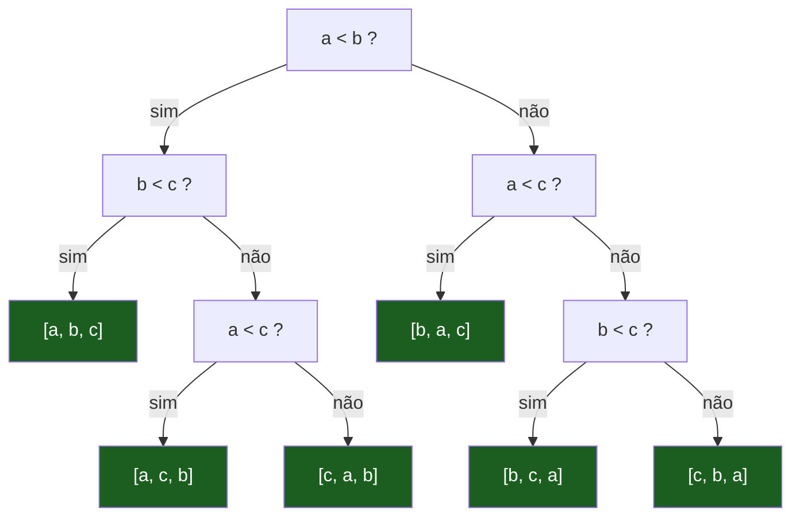

# Ordenação

> [!abstract] TL;DR
> Ordenar é colocar elementos em ordem segundo uma chave. Os sorts **por comparação** (bubble, insertion, merge, quick, heap, TimSort) não conseguem ser melhores que **Ω(n log n)** no pior caso — e isso é *provado*, não falta de criatividade. Os sorts **sem comparação** (counting, radix, bucket) furam o limite usando o próprio valor como índice, mas exigem suposições sobre os dados. Você quase nunca vai implementar um sort: as linguagens já trazem implementações industriais sofisticadas — e elas convergiram para **TimSort** (estável, adaptativo) em coleções de objetos, mas divergem em primitivos (**Dual-Pivot Quicksort** no Java, **pdqsort** no Go), onde estabilidade não importa e o quicksort in-place ganha. A pergunta de entrevista "que sort sua linguagem usa?" tem uma resposta certa: **"depende se é primitivo ou objeto."**

Imagine uma mão de cartas de baralho. Você pega as cartas uma a uma e, para cada nova carta, desliza-a para a posição certa entre as que já estão arrumadas. Isso é, literalmente, o **insertion sort** — e é exatamente o algoritmo que seu cérebro escolheu sozinho. Ninguém ordena cartas fazendo merge sort. Há uma lição aí: o "melhor" algoritmo depende do tamanho e da forma dos dados, não de uma tabela de Big-O olhada no vácuo.

Esta nota é o tratamento de **ordenação** propriamente dito. Merge sort e quicksort já apareceram em [[06 - Divisão e conquista]] como *exemplos de paradigma* — aqui eles voltam, mas com foco no que realmente importa para decisões: estabilidade, uso de memória, adaptatividade, o limite teórico, e o que a biblioteca-padrão da sua linguagem faz por baixo dos panos.

> [!info] Lastro
> - **CLRS** — *Introduction to Algorithms*, 4ª ed. (Cormen, Leiserson, Rivest, Stein). Cap. 2 (insertion/merge), cap. 6 (heapsort), cap. 7 (quicksort), cap. 8 (limite Ω(n log n) via árvore de decisão; counting/radix/bucket sort).
> - **Sedgewick & Wayne** — *Algorithms*, 4ª ed. (elementary sorts, mergesort, quicksort, prioridade/heaps).
> - **Tim Peters** — `listsort.txt` (descrição original do TimSort: "an adaptive, stable, natural mergesort"), no repositório do CPython (`Objects/listsort.txt`).
> - **OpenJDK** — código de `java.util.Arrays.sort` e `java.util.DualPivotQuicksort` (Dual-Pivot Quicksort de Vladimir Yaroslavskiy para primitivos; TimSort para objetos).
> - **V8** — posts *"Getting things sorted in V8"* e *"Stable `Array.prototype.sort`"* (v8.dev): TimSort desde V8 7.0 / Chrome 70; estabilidade garantida desde ES2019.
> - **Go** — issue `golang/go#50154` ("sort: use pdqsort") e a documentação dos pacotes `sort`/`slices`: pdqsort (pattern-defeating quicksort, baseado no trabalho de Orson Peters) desde Go 1.19; `slices` (generics) desde Go 1.21.
> - **Wikipedia/Timsort + CPython** — nota de versão: o CPython substituiu o merge policy do TimSort por **Powersort** a partir do Python 3.11 (ainda estável e adaptativo; a API e o comportamento observável não mudaram).

---

## 1. Por que estudar ordenação se você nunca implementa um sort?

É uma objeção justa. Em 15 anos de carreira, a chance de você escrever um quicksort à mão em produção é quase zero — `Collections.sort`, `list.sort()`, `arr.sort()` e `slices.Sort` resolvem. Então por que gastar uma nota inteira nisso?

**Porque cai em entrevista.** Ordenação é o assunto mais clássico de algoritmos. "Implemente merge sort no quadro", "qual a complexidade do quicksort no pior caso e por quê", "como você ordenaria um bilhão de inteiros que não cabem na memória" — tudo isso é rotina em entrevistas técnicas internacionais.

**Porque ordenar é pré-processamento.** Uma quantidade enorme de algoritmos *começa* ordenando. [[08 - Busca]] (binary search) só funciona em dados ordenados. A técnica de *two pointers* normalmente pressupõe array ordenado. Detectar duplicatas, encontrar o par mais próximo, agrupar por chave, fazer *merge* de intervalos — todos viram triviais depois de ordenar. Saber que "ordenar custa O(n log n)" é o que te deixa decidir se vale a pena pagar esse preço antecipado.

**Porque estabilidade e in-place mudam decisões reais.** Estes dois conceitos (próxima seção) não são trivia acadêmica. Eles determinam se você pode encadear ordenações sem corromper o resultado, e se sua ordenação vai estourar a memória num dataset grande. São decisões de engenharia.

**Porque "que sort sua linguagem usa?" é pergunta clássica.** E a resposta honesta — "depende do tipo" — separa quem decorou de quem entende. Voltamos a isso na seção 7.

---

## 2. O comparativo dos algoritmos clássicos

Aqui está o mapa do território. Memorize a forma da tabela, não os números soltos — entender *por quê* cada célula tem aquele valor vale mais que recitá-la.

| Algoritmo | Tempo médio | Tempo pior | Espaço extra | Estável? | In-place? | Quando usar / por que importa |
| --- | --- | --- | --- | --- | --- | --- |
| **Bubble** | &Theta;(n&sup2;) | &Theta;(n&sup2;) | O&#40;1&#41; | sim | sim | Quase nunca. Valor didático: a forma mais ingênua de "empurrar o maior pro fim". Bom só para explicar swaps. |
| **Insertion** | &Theta;(n&sup2;) | &Theta;(n&sup2;) | O&#40;1&#41; | sim | sim | **n pequeno** e **dados quase-ordenados** &#40;adaptativo: O&#40;n&#41; nesse caso&#41;. É o sub-rotina dos sorts industriais para subarrays pequenos. |
| **Selection** | &Theta;(n&sup2;) | &Theta;(n&sup2;) | O&#40;1&#41; | não | sim | Quando o **custo de escrita** domina &#40;faz só O&#40;n&#41; swaps&#41;. Raro. Instável por causa do swap de longa distância. |
| **Merge** | &Theta;(n log n) | &Theta;(n log n) | O&#40;n&#41; | sim | não | **Pior caso garantido** O&#40;n log n&#41; e **estável**. Base de ordenação externa &#40;dados que não cabem na RAM&#41;. Custa memória. |
| **Quick** | &Theta;(n log n) | &Theta;(n&sup2;) | O&#40;log n&#41; | não | sim | **In-place** e a melhor constante na prática para dados aleatórios. Pior caso O&#40;n&#41; quadrático &#40;mitigado por pivô aleatório/mediana-de-3&#41;. |
| **Heap** | &Theta;(n log n) | &Theta;(n log n) | O&#40;1&#41; | não | sim | **Pior caso garantido E in-place**. Usado como *fallback* anti-O&#40;n&sup2;&#41; do quicksort &#40;introsort/pdqsort&#41;. Constante pior que quick. Conecta com [[03-Dominios/Ciência/Estruturas de Dados/index\|Estruturas de Dados]]. |
| **TimSort** | &Theta;(n log n) | &Theta;(n log n) | O&#40;n&#41; | sim | não | **O&#40;n&#41; em dados quase-ordenados** &#40;adaptativo&#41; + estável. Sort industrial padrão para objetos &#40;Python, Java, JS&#41;. |
| **Counting** | &Theta;(n+k) | &Theta;(n+k) | O&#40;k&#41; | sim | não | **Inteiros num range k limitado**. Fura o limite &Omega;&#40;n log n&#41;. Inútil se k for gigante. |
| **Radix** | &Theta;(d&middot;n) | &Theta;(d&middot;n) | O&#40;n+k&#41; | sim | não | **Inteiros/strings de tamanho fixo** &#40;d dígitos&#41;. Usa counting sort estável como sub-rotina. Fura o limite. |

> [!note] Leitura da tabela
> Três famílias. **As três O(n²)** (bubble/insertion/selection) só ganham em n minúsculo ou casos especiais. **As três O(n log n) por comparação** (merge/quick/heap, e TimSort que é um merge sort turbinado) são o cavalo de batalha geral — e a escolha entre elas é uma negociação entre *estabilidade* (merge/Tim sim, quick/heap não), *memória* (quick/heap O(1)~O(log n), merge/Tim O(n)) e *pior caso* (quick pode degradar a O(n²); os outros não). **As duas/três de não-comparação** (counting/radix/bucket) são as únicas que furam o limite Ω(n log n) — e o preço é precisar conhecer a estrutura dos dados.

---

## 3. Os três conceitos que a tabela esconde

A tabela tem três colunas que parecem detalhes e na verdade são o coração das decisões: estável?, in-place?, e (escondida) adaptativo?.

### 3.1 Estabilidade

Um sort é **estável** quando elementos com **chave igual mantêm a ordem relativa original** que tinham na entrada.

Parece pedante até você precisar de **ordenações encadeadas**. Suponha uma lista de pessoas que você quer ordenar **por idade**, mas, *dentro da mesma idade*, mantendo a **ordem alfabética por nome** que já estava lá.

```mermaid
flowchart TB
    subgraph entrada["Entrada &#40;já ordenada por nome&#41;"]
        E1["Ana &middot; 30"]
        E2["Bruno &middot; 25"]
        E3["Carla &middot; 30"]
        E4["Diego &middot; 25"]
    end

    entrada --> est["Ordena por IDADE &#40;estável&#41;"]
    entrada --> ins["Ordena por IDADE &#40;instável&#41;"]

    subgraph saidaE["Saída estável &mdash; nome preservado por idade"]
        S1["Bruno &middot; 25"]
        S2["Diego &middot; 25"]
        S3["Ana &middot; 30"]
        S4["Carla &middot; 30"]
    end

    subgraph saidaI["Saída instável &mdash; nome embaralhado"]
        I1["Diego &middot; 25"]
        I2["Bruno &middot; 25"]
        I3["Carla &middot; 30"]
        I4["Ana &middot; 30"]
    end

    est --> saidaE
    ins --> saidaI

    style saidaE fill:#1b5e20,color:#fff
    style saidaI fill:#7f1d1d,color:#fff
```



**Leitura do diagrama.** Partimos de uma lista já ordenada por nome. Um sort **estável** por idade produz, dentro de cada idade, a ordem alfabética intacta (Bruno antes de Diego nos 25; Ana antes de Carla nos 30). Um sort **instável** por idade *também produz uma ordenação correta por idade* — Diego e Bruno continuam ambos nos 25 — mas a ordem de desempate por nome se perde. Por isso ordenações encadeadas exigem estabilidade: você ordena pelo critério secundário primeiro, depois pelo primário com um sort estável, e o desempate sobrevive. Sem estabilidade, o segundo sort destrói o trabalho do primeiro.

A regra prática: **estabilidade preserva o trabalho de ordenações anteriores.** "Ordene primeiro por X, depois por Y" só funciona se o sort de Y for estável.

### 3.2 In-place

Um sort é **in-place** quando usa **O(1) de memória extra**, além do próprio array de entrada (no máximo O(log n) para a pilha de recursão, por convenção ainda chamamos de in-place). Ele reorganiza os elementos *dentro do array*, sem alocar uma cópia do tamanho da entrada.

O trade-off é cruel: **você não tem tudo de graça.**

- **Merge sort** é estável, mas precisa de **O(n) de memória extra** para o passo de *merge* — ele intercala duas metades ordenadas copiando para um buffer auxiliar.
- **Quicksort** é **in-place** (particiona trocando elementos no próprio array), mas o particionamento embaralha elementos de chave igual e por isso é **instável**.

Não existe (facilmente) um sort por comparação que seja simultaneamente O(n log n) no pior caso, estável *e* in-place com baixa constante. Há merge sorts in-place, mas as constantes são ruins. É por isso que a indústria escolhe: TimSort (estável, gasta memória) para objetos; quicksort/pdqsort (in-place, instável) para primitivos.

### 3.3 Adaptatividade

Um sort é **adaptativo** quando fica **mais rápido em dados que já estão quase ordenados**. Insertion sort é o exemplo canônico: numa lista já ordenada, cada elemento já está no lugar, então ele faz apenas O(n) comparações e zero swaps — não O(n²). TimSort leva isso ao extremo: ele *detecta* trechos já ordenados (chamados **runs**) e os aproveita. Em dados do mundo real — que raramente são uma bagunça perfeitamente aleatória — isso é ouro.

Quicksort e heap sort **não** são adaptativos: eles fazem o mesmo trabalho numa lista já ordenada que numa embaralhada (aliás, o quicksort ingênuo *degrada* numa lista já ordenada — é o pior caso dele).

---

## 4. Por que insertion sort importa apesar do O(n²)

Olhando só a tabela, insertion sort parece lixo: O(n²). Mas O(n²) só é ruim quando n é grande. Para **n pequeno**, a constante baixíssima do insertion sort o torna **mais rápido** que merge sort ou quicksort, que pagam o overhead de recursão, alocação e gerenciamento de índices.

É exatamente por isso que **todos os sorts industriais caem para insertion sort em subarrays pequenos**: quando o quicksort/merge sort recursivo chega a um pedaço com menos de ~16–32 elementos, ele para de recursar e finaliza com insertion sort. TimSort faz o mesmo: ele constrói seus *runs* mínimos com insertion sort. O Dual-Pivot Quicksort do Java troca para insertion sort abaixo de um limiar (`INSERTION_SORT_THRESHOLD`). Não é detalhe de implementação preguiçoso — é uma otimização medida.

E há o segundo motivo: insertion sort é **adaptativo**. Numa lista quase ordenada, ele roda em O(n).

### Insertion sort passo a passo

```mermaid
flowchart TB
    P0["Início: [5, 2, 4, 6, 1, 3]"] --> P1
    P1["i=1: pega 2, desliza p/ tras de 5 &rarr; [2, 5, 4, 6, 1, 3]"] --> P2
    P2["i=2: pega 4, encaixa entre 2 e 5 &rarr; [2, 4, 5, 6, 1, 3]"] --> P3
    P3["i=3: pega 6, já maior que 5, fica &rarr; [2, 4, 5, 6, 1, 3]"] --> P4
    P4["i=4: pega 1, desliza ate o inicio &rarr; [1, 2, 4, 5, 6, 3]"] --> P5
    P5["i=5: pega 3, encaixa entre 2 e 4 &rarr; [1, 2, 3, 4, 5, 6]"] --> P6
    P6["Ordenado &#10003;"]

    style P0 fill:#1e3a5f,color:#fff
    style P6 fill:#1b5e20,color:#fff
```



**Leitura do diagrama.** A invariante é simples: **à esquerda do índice `i`, tudo já está ordenado.** A cada passo, pegamos o elemento em `i` e o *deslizamos* para a esquerda até achar sua posição entre os já ordenados. Repare no passo `i=3`: o `6` já é maior que tudo à esquerda, então não desliza nada — é aqui que mora a adaptatividade. Se a lista já estivesse ordenada, *todo* passo seria assim, e o custo cairia para O(n). O pior caso (O(n²)) acontece com a lista em ordem inversa, em que cada elemento desliza por toda a parte ordenada.

---

## 5. Sorts por comparação e o limite Ω(n log n)

Aqui está um dos resultados mais bonitos de ciência da computação. **Nenhum sort baseado em comparar elementos pode ser melhor que Ω(n log n) no pior caso.** Não é "ninguém descobriu ainda" — é **provado** que é impossível.

A intuição: um sort por comparação só pode olhar para os dados perguntando "a < b?". Cada comparação tem duas respostas possíveis (sim/não), e é só com essa informação que ele decide trocar coisas de lugar. Pense no algoritmo como uma **árvore de decisão binária**: cada nó interno é uma comparação, cada galho é uma das duas respostas, e cada **folha** é uma permutação final possível dos elementos.



**Leitura do diagrama.** Esta é a árvore de decisão para ordenar **três** elementos `a, b, c`. Cada caminho da raiz até uma folha é uma sequência de comparações que o algoritmo faz; a folha é a ordem final que ele declara. Existem **3! = 6 permutações** possíveis de três elementos, então a árvore precisa ter **pelo menos 6 folhas** — uma para cada resposta possível, senão o algoritmo confundiria duas entradas diferentes. O **número de comparações no pior caso** é a *altura* da árvore (o caminho mais longo): aqui, 3.

Agora a prova geral. Para ordenar `n` elementos, há **n!** permutações possíveis, logo a árvore precisa de **pelo menos n! folhas**. Uma árvore binária de altura `h` tem no máximo `2^h` folhas. Então:

$$2^h \ge n! \implies h \ge \log_2(n!)$$

E pela aproximação de Stirling, $\log_2(n!) = \Theta(n \log n)$. A altura `h` é o número de comparações no pior caso. Logo, **qualquer sort por comparação faz Ω(n log n) comparações no pior caso.** Fim.

```mermaid
graph TB
    raiz["Raiz: a primeira comparação"] --> n1["nível 1: 2 nós"]
    n1 --> n2["nível 2: 4 nós"]
    n2 --> n3["nível h: ate 2^h folhas"]
    n3 --> req["Precisamos de &ge; n! folhas"]
    req --> conc["Logo 2^h &ge; n! &rArr; h &ge; log&#8322;&#40;n!&#41; = &Theta;&#40;n log n&#41;"]

    style conc fill:#4a148c,color:#fff
    style req fill:#1e3a5f,color:#fff
```



**Leitura do diagrama.** A cada nível, a árvore binária no máximo *dobra* o número de nós: nível 1 tem 2, nível 2 tem 4, e o nível `h` tem até `2^h` folhas. Para distinguir todas as `n!` ordenações possíveis, precisamos de pelo menos `n!` folhas. Resolvendo `2^h ≥ n!` chegamos em `h ≥ log₂(n!) = Θ(n log n)`. Por isso merge sort e heap sort, que *atingem* O(n log n) no pior caso, são **assintoticamente ótimos** entre os sorts por comparação — não dá para fazer melhor com comparações.

> [!tip] A pegadinha de entrevista
> Se o entrevistador pergunta "dá pra ordenar mais rápido que O(n log n)?", a resposta completa é: **"Por comparação, não — é provado pelo argumento da árvore de decisão. Mas se eu puder usar o *valor* dos elementos como índice em vez de compará-los, sim: counting/radix sort fazem O(n) sob certas suposições."** É a resposta que mostra que você entende o *porquê* do limite, e não só que ele existe.

---

## 6. Sorts que furam o limite (não-comparação)

O limite Ω(n log n) vale **apenas para sorts que comparam elementos**. Se você não compara — se usa o próprio valor do elemento como um índice — a prova da árvore de decisão não se aplica, e dá para ordenar em tempo *linear*. O preço: você precisa de **suposições sobre os dados** (range conhecido, tamanho fixo, distribuição uniforme).

### 6.1 Counting sort — O(n + k)

Não compara nada. Ele **conta quantas vezes cada valor aparece** e usa essa contagem para colocar cada elemento direto na posição final. Serve para **inteiros num range `[0, k)` limitado**.

```mermaid
flowchart LR
    A["Entrada: [2, 5, 2, 1, 5, 2]"] --> B["1&deg; passe: conta ocorrencias"]
    B --> C["count: 0&times;0, 1&times;1, 3&times;2, 0&times;3, 0&times;4, 2&times;5"]
    C --> D["2&deg; passe: soma prefixos &rarr; posições finais"]
    D --> E["3&deg; passe: percorre entrada de tras p/ frente, posiciona &#40;estavel&#41;"]
    E --> F["Saída: [1, 2, 2, 2, 5, 5]"]

    style A fill:#1e3a5f,color:#fff
    style F fill:#1b5e20,color:#fff
```



**Leitura do diagrama.** Três passes lineares. O **primeiro** conta quantas vezes cada valor aparece (zero comparações — só incrementa `count[valor]`). O **segundo** transforma as contagens em **somas de prefixo**, que dizem *em que posição final* termina cada bloco de valores iguais. O **terceiro** percorre a entrada **de trás para frente** e coloca cada elemento na sua posição, decrementando o contador — varrer ao contrário é o truque que torna o counting sort **estável** (mantém a ordem original dos iguais). O custo é Θ(n + k): linear no número de elementos `n` *e* no tamanho do range `k`. Se `k` for muito maior que `n` (ordenar `[0, 5, 1000000]`), o `+k` mata: você aloca um array de um milhão de contadores para três elementos. Counting sort só vale quando **k = O(n)**.

### 6.2 Radix sort — O(d · n)

E se os números forem grandes (range enorme), mas tiverem **poucos dígitos**? Radix sort ordena **dígito a dígito**, usando counting sort estável como sub-rotina em cada dígito. Custo: Θ(d · n), onde `d` é o número de dígitos.

- **LSD (Least Significant Digit):** começa pelo dígito menos significativo (unidades) e vai subindo. É a variante mais comum; **depende da estabilidade** do counting sort em cada passe para não estragar a ordem dos dígitos já processados.
- **MSD (Most Significant Digit):** começa pelo mais significativo; útil para strings de tamanho variável.

Serve para **inteiros de largura fixa** ou **strings de tamanho fixo**. Exemplo LSD com `[170, 45, 75, 90, 2, 802]`: ordena por unidades, depois por dezenas, depois por centenas — e ao fim está ordenado, *porque cada passe é estável* e respeita o trabalho do anterior. (Note como a estabilidade da seção 3.1 reaparece aqui como mecanismo, não como curiosidade.)

### 6.3 Bucket sort

Distribui os elementos em **baldes** (sub-ranges), ordena cada balde (geralmente com insertion sort) e concatena. Brilha quando os dados são **uniformemente distribuídos** num intervalo conhecido: aí cada balde fica pequeno e a ordenação interna é barata, dando O(n) esperado. Se a distribuição for torta (tudo cai num balde só), degrada para o custo do sort interno.

> [!warning] O preço da mágica
> Counting/radix/bucket parecem "trapaça" porque batem o limite teórico. Mas eles **trocam generalidade por velocidade**: exigem que você saiba algo sobre os dados (range, número de dígitos, distribuição). Um sort por comparação ordena *qualquer coisa que tenha uma relação de ordem* — strings, objetos, tuplas, datas. Counting sort só ordena inteiros pequenos. Não há almoço grátis: o limite Ω(n log n) é o preço da **generalidade**.

---

## 7. Implementações comparadas: Java · TypeScript · Python · Go

Este é o coração prático da nota. Você quase nunca implementa um sort — mas precisa saber *o que sua linguagem faz quando você chama `.sort()`*. As respostas são surpreendentemente sofisticadas e divergem de um jeito que revela um princípio.

> [!info] Verificado na web (jun/2026)
> Todos os fatos de implementação abaixo foram confirmados em fontes primárias/oficiais (ver Lastro). Onde a versão importa, ela está cravada. Detalhes que dependem de versão específica estão marcados.

### 7.1 Java — a escolha muda com o *tipo*

Java faz a coisa mais interessante das quatro linguagens: **escolhe o algoritmo conforme o tipo do que você ordena.**

- **`Arrays.sort` para primitivos** (`int[]`, `long[]`, `double[]`, …) usa **Dual-Pivot Quicksort**, de **Vladimir Yaroslavskiy** (introduzido no Java 7). É **instável** e **in-place**. Usa dois pivôs, particionando em três faixas, e cai para insertion sort em subarrays pequenos.
- **`Arrays.sort` para objetos** (`String[]`, `Integer[]`, qualquer `Object[]`) e **`Collections.sort` / `List.sort`** usam **TimSort** — o porte do TimSort do Python para Java (introduzido no Java 7). É **estável**.

Por que a diferença? **Porque primitivos não têm identidade observável além do valor.** Dois `int` com valor `5` são *indistinguíveis* — não há como notar se eles trocaram de posição entre si, então **estabilidade é irrelevante** para primitivos, e o Java pode usar o quicksort mais rápido e in-place sem dó. Já **objetos têm identidade**: dois objetos `Pessoa` "iguais" pelo comparador podem ter outros campos diferentes; preservar a ordem relativa deles (estabilidade) importa para ordenações encadeadas. Por isso objetos *exigem* um sort estável → TimSort.

```java
int[] nums = {5, 2, 8, 1, 9};
Arrays.sort(nums);                    // Dual-Pivot Quicksort (instável, in-place)

String[] nomes = {"Carla", "Ana", "Bruno"};
Arrays.sort(nomes);                   // TimSort (estável)

List<Pessoa> pessoas = getPessoas();
pessoas.sort(Comparator.comparingInt(Pessoa::idade)
                       .thenComparing(Pessoa::nome));  // TimSort, encadeado estável
Collections.sort(pessoas, Comparator.reverseOrder());  // também TimSort
```

A `Comparator` é como você define ordem customizada; `.thenComparing(...)` encadeia desempates — e funciona justamente porque o TimSort por baixo é estável.

### 7.2 Python — TimSort puro (e agora Powersort)

`sorted()` (retorna **nova lista**) e `list.sort()` (ordena **in-place**, retorna `None`) usam **TimSort**, criado por **Tim Peters** e padrão do Python desde a **versão 2.3**. É **estável** e **adaptativo** (explora *runs* já ordenadas).

```python
nums = [5, 2, 8, 1, 9]
ordenado = sorted(nums)          # nova lista; nums intacto
nums.sort()                      # in-place; nums agora ordenado
nums.sort(reverse=True)          # decrescente

pessoas.sort(key=lambda p: p.idade)            # chave de ordenação
pessoas.sort(key=lambda p: (p.idade, p.nome))  # tupla = ordenação encadeada estável
```

O parâmetro `key=` extrai a chave de ordenação (calculada **uma vez por elemento** — o *decorate-sort-undecorate*, mais eficiente que um comparador chamado O(n log n) vezes). `sorted` versus `.sort()` é a distinção nova-lista versus in-place.

> [!note] Detalhe de versão (verificado)
> A partir do **Python 3.11**, o CPython substituiu a *política de merge* do TimSort por **Powersort** (um merge policy mais robusto, derivado do TimSort). Para você, nada muda na prática: continua **estável**, **adaptativo**, mesma API. Em entrevista, "Python usa TimSort" é uma resposta aceitável; "TimSort, com merge policy Powersort desde 3.11" é a resposta de quem leu as release notes.

### 7.3 JavaScript / TypeScript — TimSort e a pegadinha clássica

`Array.prototype.sort` na **V8** (Chrome, Node) usa **TimSort desde a V8 7.0 / Chrome 70 (2018)**. E — crucial — **a estabilidade é garantida pela especificação desde o ES2019**. Antes disso, motores eram livres para usar quicksort instável em arrays grandes; código que dependia de estabilidade quebrava de navegador para navegador.

A pegadinha mais famosa de JavaScript: **sem comparador, `sort()` converte tudo para string e ordena lexicograficamente.**

```typescript
[10, 2, 1].sort();              // => [1, 10, 2]  (!!) ordem de STRING: "1" < "10" < "2"
[10, 2, 1].sort((a, b) => a - b);  // => [1, 2, 10]  correto, numérico

// SEMPRE passe um comparador para números:
nums.sort((a, b) => a - b);     // crescente
nums.sort((a, b) => b - a);     // decrescente

// encadeado e estável (graças ao ES2019):
pessoas.sort((a, b) => a.idade - b.idade || a.nome.localeCompare(b.nome));

// imutável (ES2023): toSorted() retorna nova array sem mutar a original
const ordenado = nums.toSorted((a, b) => a - b);
```

A regra de ouro: **para números, sempre passe `(a, b) => a - b`.** O comparador deve retornar negativo/zero/positivo. (`toSorted`, do ES2023, é o equivalente ao `sorted()` do Python: não muta o original — útil no estilo imutável do React/Redux.)

### 7.4 Go — a escolha é *sua*

Go é o único que **expõe a decisão estável/instável ao usuário**, em vez de escondê-la.

- **`sort.Sort`, `sort.Slice` e o pacote `slices`** usam **pdqsort** (*pattern-defeating quicksort*, baseado no trabalho de Orson Peters) desde o **Go 1.19**. É **instável** — mas muito rápido e resistente a padrões que matariam um quicksort ingênuo (já-ordenado, reverso, muitos duplicados), com *fallback* para heap sort que garante O(n log n) no pior caso (como um introsort).
- Para **estável**, você pede explicitamente: **`sort.Stable`** ou **`slices.SortStableFunc`**.
- **`slices.Sort`** (genérico, **Go 1.21**) ordena slices de tipos ordenáveis (`int`, `string`, …) sem boilerplate.

```go
nums := []int{5, 2, 8, 1, 9}
slices.Sort(nums)                       // pdqsort, generics (Go 1.21+), instável

// ordem customizada / instável:
slices.SortFunc(pessoas, func(a, b Pessoa) int {
    return cmp.Compare(a.Idade, b.Idade)   // cmp.Compare (Go 1.21+)
})

// estável, explícito:
slices.SortStableFunc(pessoas, func(a, b Pessoa) int {
    return cmp.Compare(a.Idade, b.Idade)
})

// API clássica (pré-generics):
sort.Slice(pessoas, func(i, j int) bool { return pessoas[i].Idade < pessoas[j].Idade })
sort.Stable(porIdade)                    // estável, instável é o sort.Sort
```

O contraste é didático: Java/Python/JS *decidem por você* (estável se for objeto), Go te dá os dois e você escolhe — coerente com a filosofia explícita da linguagem.

### 7.5 A lição

```mermaid
graph TB
    Q["Que sort sua linguagem usa?"] --> tipo{"Primitivo ou objeto?"}

    tipo -->|"objeto / coleção"| obj["TimSort &mdash; estavel + adaptativo<br/>&#40;Python, Java objetos, JS&#41;"]
    tipo -->|"primitivo / slice"| prim["Quicksort in-place &mdash; instavel mas rapido<br/>&#40;Java Dual-Pivot, Go pdqsort&#41;"]

    obj --> motivoO["identidade observavel &rArr;<br/>estabilidade importa"]
    prim --> motivoP["sem identidade alem do valor &rArr;<br/>estabilidade irrelevante &rArr; ganha o in-place"]

    style obj fill:#1b5e20,color:#fff
    style prim fill:#1e3a5f,color:#fff
    style Q fill:#4a148c,color:#fff
```



**Leitura do diagrama.** A resposta certa para "que sort sua linguagem usa?" não é um nome — é **uma bifurcação**. Para **coleções de objetos**, as quatro convergiram para **TimSort** (estável e adaptativo), porque objetos têm identidade e estabilidade importa para ordenações encadeadas. Para **primitivos/slices**, elas divergem para variantes de **quicksort in-place** (Dual-Pivot no Java, pdqsort no Go), porque sem identidade observável a estabilidade é irrelevante e o quicksort in-place tem a melhor constante. Go é o de fora: deixa *você* escolher estável ou não. A lição de fundo: as bibliotecas-padrão não escolhem "o melhor sort" no abstrato — elas escolhem o trade-off certo para o *tipo de dado*.

---

## 8. Em entrevista

Ordenação é território minado de perguntas. Saber falar disso em inglês, com fluência sobre os trade-offs, vale tanto quanto saber o algoritmo.

**Frases úteis (EN):**

- "Any **comparison-based** sort has a lower bound of **Ω(n log n)** in the worst case — that's proven by the decision-tree argument, not just an open problem."
- "Merge sort gives you a **guaranteed** O(n log n) and it's **stable**, but it needs **O(n) auxiliary space**. Quicksort is **in-place** with a better constant on average, but it's **unstable** and degrades to O(n²) on bad pivots."
- "I'd use **counting sort** here because the keys are small bounded integers — that breaks the n-log-n barrier and runs in **O(n + k)**, since we index by value instead of comparing."
- "**Insertion sort** looks bad at O(n²), but it's **adaptive** and has a tiny constant, so production sorts fall back to it for small subarrays."
- "In Java, `Arrays.sort` on **primitives** uses **Dual-Pivot Quicksort** — unstable — while on **objects** it uses **TimSort**, which is stable. Primitives have no observable identity beyond their value, so stability doesn't matter and you can use the faster in-place sort."
- "JavaScript's default `sort` **coerces to strings**, so `[10, 2, 1].sort()` gives `[1, 10, 2]`. Always pass `(a, b) => a - b` for numbers. Stability is guaranteed since **ES2019**."
- "Go's `slices.Sort` uses **pdqsort** and is **unstable**; if I need stability I call `slices.SortStableFunc` explicitly."

**Vocabulário PT → EN:**

| Português | English |
| --- | --- |
| ordenação | sorting |
| ordenar (em ordem) | to sort |
| chave de ordenação | sort key |
| estável / estabilidade | stable / stability |
| in-place (no lugar) | in-place |
| memória/espaço extra | auxiliary space / extra space |
| adaptativo | adaptive |
| pior caso / caso médio | worst case / average case |
| limite inferior | lower bound |
| árvore de decisão | decision tree |
| sort por comparação | comparison-based sort |
| sort sem comparação | non-comparison sort |
| furar o limite | to beat / break the bound |
| comparador | comparator |
| ordem decrescente / crescente | descending / ascending order |
| dígito a dígito | digit by digit |
| trecho já ordenado (run) | (already-sorted) run |
| desempate | tie-break(er) |
| ordenação encadeada | chained / multi-key sort |
| ordenação externa | external sort |
| pivô | pivot |
| particionar | to partition |

> [!question] Perguntas que você deve saber responder de cor
> 1. **Por que o quicksort é O(n²) no pior caso, se o caso médio é O(n log n)?** Porque um pivô ruim (ex.: sempre o menor elemento, numa lista já ordenada) particiona em 1 e n−1, gerando n níveis de recursão. Mitiga-se com pivô aleatório ou mediana-de-3.
> 2. **Quando você prefere merge sort a quicksort?** Quando precisa de **pior caso garantido** O(n log n) (ex.: sistemas de tempo real) ou de **estabilidade**, ou para **ordenação externa** (dados que não cabem na RAM — merge sort intercala blocos do disco).
> 3. **Como ordenar 1 bilhão de inteiros pequenos (0–1000)?** Counting sort: O(n + k) com k = 1000. Linear, sem comparar.
> 4. **Por que heap sort, mesmo sendo O(n log n) garantido e in-place, não é o padrão?** Constante pior (acesso à memória menos *cache-friendly* que o quicksort) e instável. Usado como *fallback* anti-quadrático dentro de introsort/pdqsort.

---

## 9. Resumo em uma linha

> Sorts por comparação batem no teto **Ω(n log n)** (provado pela árvore de decisão); para furá-lo, pare de comparar e use o valor como índice (counting/radix) ao custo de suposições sobre os dados; e na prática você não implementa nada disso — sua linguagem usa **TimSort** para objetos (estável) e **quicksort in-place** para primitivos (rápido, porque estabilidade não importa quando não há identidade).

---

## Ligações

- Anterior: [[06 - Divisão e conquista]] — merge sort e quicksort como paradigma de D&C.
- Próxima: [[08 - Busca]] — ordenar é o pré-requisito do binary search.
- Base: [[02 - Análise de complexidade - Big-O]] — a linguagem de Θ/O/Ω usada aqui.
- Heaps (heap sort): [[03-Dominios/Ciência/Estruturas de Dados/index|Estruturas de Dados]].
- MOC: [[03-Dominios/Ciência/Algoritmos/index|Algoritmos]].
