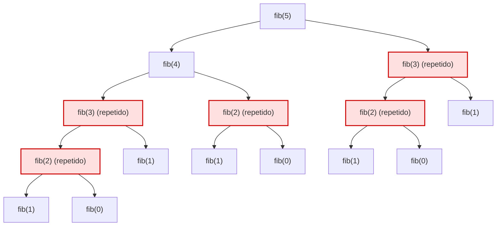
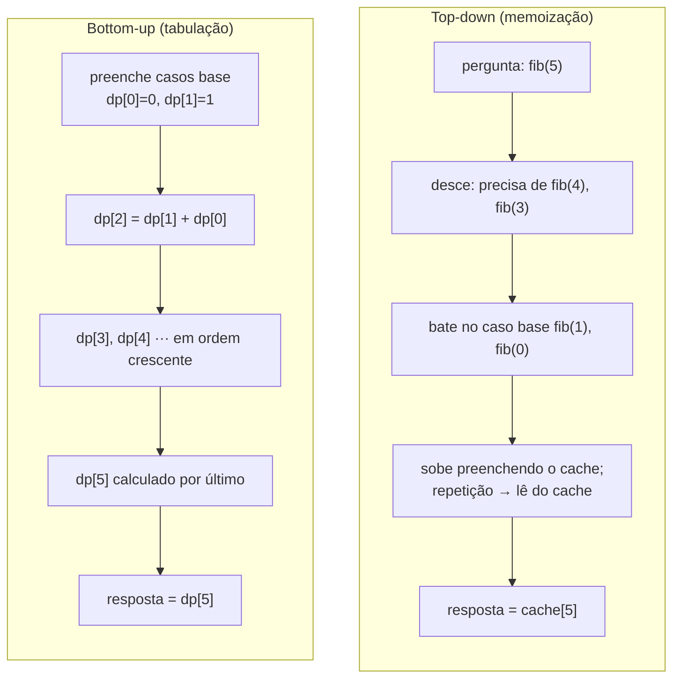
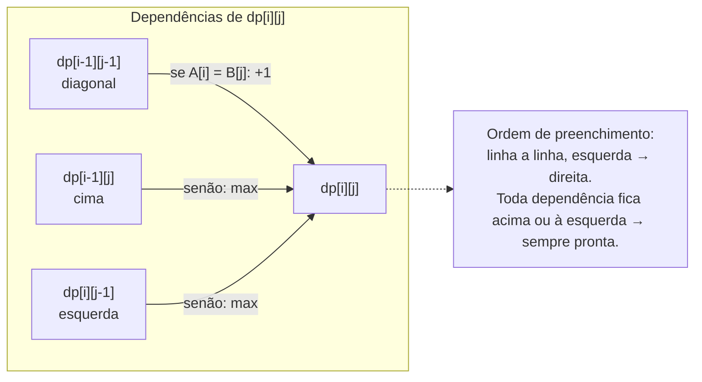
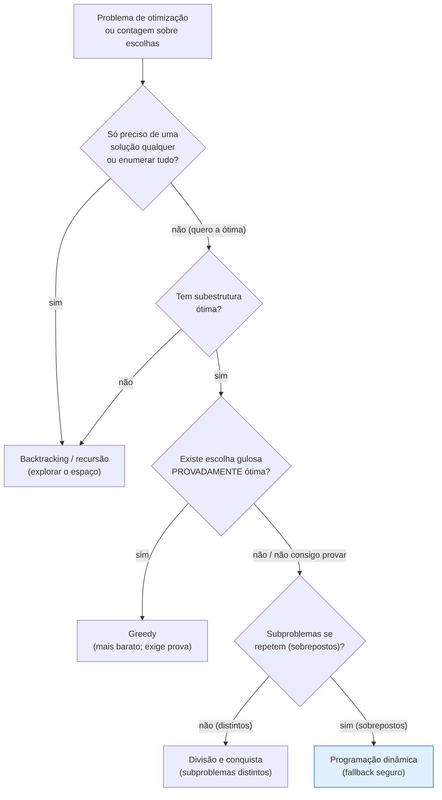

# Programação dinâmica

> [!abstract] TL;DR
> **Programação dinâmica (DP) é recursão com memória.** É uma *estratégia* — não um algoritmo específico — para problemas que têm duas propriedades simultâneas: **subestrutura ótima** (a solução ótima é montada a partir de soluções ótimas de subproblemas) e **subproblemas sobrepostos** (os mesmos subproblemas reaparecem muitas vezes). Quando as duas estão presentes, a recursão ingênua refaz o mesmo trabalho exponencialmente; basta **lembrar** o resultado de cada subproblema para colapsar O(2ⁿ) em O(n) ou O(n·m). Há dois sotaques: **top-down (memoização)** — a recursão natural mais um cache, lazy e intuitivo — e **bottom-up (tabulação)** — uma tabela preenchida do menor subproblema ao maior, sem recursão e sem estouro de pilha. O ganho de senioridade não é decorar problemas: é o **método de 6 passos** (estado → transição → caso base → ordem → resposta → otimização de espaço) que transforma "não faço ideia" em "é só preencher a tabela". DP é o **fallback seguro** quando uma escolha gulosa não se prova ótima ([[11 - Greedy]]) e quando a recursão pura é exponencial ([[04 - Recursão]]).

Imagine que alguém te pede o décimo número de Fibonacci e você escreve a definição direta: `fib(n) = fib(n-1) + fib(n-2)`. Linda, fiel à matemática, e secretamente um desastre. Para calcular `fib(5)`, você chama `fib(4)` e `fib(3)`. Mas `fib(4)` por sua vez chama `fib(3)` *de novo* — e `fib(3)` chama `fib(2)`, que aparece três vezes na árvore inteira, e `fib(1)` aparece cinco vezes. Você está computando os mesmos números repetidamente, como alguém que recalcula 7×8 toda vez que precisa do resultado em vez de lembrar que é 56. A árvore de chamadas tem tamanho exponencial, e o trabalho é quase todo desperdício.

Agora pense num caderninho ao lado. Toda vez que você calcula um `fib(k)`, anota o resultado. Da próxima vez que alguém pedir `fib(k)`, você não recalcula — você *olha o caderninho*. De repente a árvore exponencial vira uma linha reta: cada `fib(k)` é computado **uma única vez**, e há só `n` valores possíveis de `k`. De O(2ⁿ) para O(n), só porque você parou de ser amnésico. Esse caderninho é a alma da programação dinâmica. Tudo o mais — memoização, tabulação, otimização de espaço — são variações sobre o tema "não recalcule o que você já sabe".

Esta nota chega depois de [[09 - Two pointers e sliding window]], que também descartava trabalho explorando estrutura (ordem, contiguidade). Mas lá um único passe linear ganancioso bastava. DP ataca a classe de problemas onde isso *não* basta: onde você precisa **considerar muitas decisões**, cada uma abrindo subproblemas, e a resposta ótima depende de combinar as melhores respostas dos pedaços. É, junto com [[11 - Greedy]] e [[12 - Backtracking]], a fronteira entre "saber percorrer dados" e "saber otimizar decisões" — e é, sem concorrência, **o tópico mais cobrado em entrevista técnica**.

> [!info] Lastro
> - **CLRS** — *Introduction to Algorithms*, 4ª ed. (Cormen, Leiserson, Rivest, Stein), capítulo **Dynamic Programming**. É a referência canônica: define subestrutura ótima e subproblemas sobrepostos, contrasta DP com divisão-e-conquista, e desenvolve LCS, multiplicação de cadeia de matrizes e o método de reconstrução da solução (não só do valor ótimo).
> - **Richard Bellman** — *Dynamic Programming* (Princeton University Press, 1957), a obra fundadora, onde aparece o **Princípio da Otimalidade** (a formulação original da subestrutura ótima). E *Eye of the Hurricane: An Autobiography* (World Scientific, 1984), onde Bellman conta por que escolheu o nome "dynamic programming".
> - **Sedgewick & Wayne** — *Algorithms*, 4ª ed. Trata DP no contexto de problemas de string (LCS / shortest edit distance) e de caminhos em grafos (a recorrência de Bellman-Ford é DP).
> - **Kleinberg & Tardos** — *Algorithm Design* (2005), capítulo 6, **Dynamic Programming**. O melhor texto pedagógico sobre *como formular* uma DP: a ênfase em "defina o conjunto de subproblemas" como o passo difícil vem daqui (weighted interval scheduling, knapsack, RNA secondary structure, sequence alignment).

---

## 1. De onde veio o nome (e por que ele engana)

Vale começar pela história, porque o nome "programação dinâmica" é uma das peças de marketing mais bem-sucedidas da computação — e uma das mais enganosas para quem está aprendendo. "Programação" aqui **não tem nada a ver com escrever código**: vem de "programa" no sentido de *planejamento*, de tabela de decisões (o mesmo "programming" de "linear programming"). E "dinâmica" não significa que algo se mexe em tempo de execução.

Richard Bellman, que inventou a técnica nos anos 1950 na RAND Corporation, conta em sua autobiografia *Eye of the Hurricane* (1984) por que escolheu esse nome. Ele trabalhava sob um Secretário de Defesa, **Charles Wilson**, que tinha — nas palavras de Bellman — um pavor e um desprezo declarados pela palavra "pesquisa" e, ainda mais, por matemática. Bellman precisava de um nome para o que estava fazendo que não soasse como pesquisa matemática, ou seu financiamento estaria em risco. "Dynamic" foi escolhido em parte porque é uma palavra impossível de usar num sentido pejorativo — *tente* dizer "dynamic" como xingamento. E o conjunto "dynamic programming" soava como algo concreto, de planejamento, palatável a um burocrata avesso a teoria. Em suas palavras, era um nome que "nem um congressista poderia objetar".

Guarde essa história não só pela graça: ela diz algo verdadeiro sobre a técnica. DP **é** planejamento — você está montando uma tabela de decisões ótimas, do problema mais simples ao mais complexo. O nome confunde porque promete movimento e entrega contabilidade. Mas a contabilidade é exatamente o ponto.

---

## 2. O que é DP: as duas propriedades

DP é uma estratégia, não uma receita única. Você não "aplica DP" do jeito que aplica busca binária; você **reconhece** que um problema tem a forma certa e então constrói a solução. A forma certa exige **duas** propriedades ao mesmo tempo. Se faltar uma delas, DP não é a ferramenta (ou nem é possível).

### 2.1 Subestrutura ótima

Um problema tem **subestrutura ótima** quando a solução ótima do problema inteiro **contém** as soluções ótimas de seus subproblemas. Dito de outro jeito: você consegue construir a melhor resposta global combinando as melhores respostas de pedaços menores, sem medo de que uma escolha "subótima" num pedaço fosse, surpreendentemente, melhor no todo.

O caminho mais **curto** entre duas cidades tem subestrutura ótima: se o caminho mais curto de A até C passa por B, então o pedaço de A até B *também* é o caminho mais curto de A até B. Se houvesse um caminho mais curto de A até B, você o trocaria e melhoraria o total — contradição. Essa lógica de "trocar e melhoraria, logo é absurdo" é a prova típica de subestrutura ótima (chamada *cut-and-paste* no CLRS).

Mas nem todo problema tem essa propriedade, e esse é um ponto que entrevistadores adoram. O caminho mais **longo** *sem repetir vértices* **não** tem subestrutura ótima. O caminho mais longo de A até C pode passar por B, mas o pedaço A→B desse caminho não é necessariamente o caminho mais longo de A até B — usar o caminho mais longo de A até B poderia "gastar" vértices que você precisava depois, criando uma repetição proibida. As subsoluções **interferem** umas nas outras. Sem subestrutura ótima, DP não se aplica; o caminho mais longo é, de fato, NP-difícil.

> [!tip] Teste rápido de subestrutura ótima
> Pergunte: "Se eu fixar a *última decisão* da solução ótima, o que sobra é um subproblema do mesmo tipo, e a solução ótima do todo usa a solução ótima desse subproblema?" Se sim, você tem subestrutura ótima e uma recorrência praticamente pronta.

### 2.2 Subproblemas sobrepostos

Um problema tem **subproblemas sobrepostos** quando, ao quebrá-lo recursivamente, você encontra os **mesmos** subproblemas repetidas vezes. Essa é a propriedade que distingue DP de divisão-e-conquista ([[06 - Divisão e conquista]]).

Em divisão-e-conquista — merge sort, quicksort, busca binária — você quebra o problema em pedaços **independentes e distintos**. Merge sort divide o array em duas metades que *nunca se sobrepõem*; cada metade é um subproblema novo, resolvido uma única vez. Não há nada para memoizar porque nada se repete. Em DP, ao contrário, os subproblemas **se sobrepõem em massa**, e é justamente essa repetição que a memória elimina.

Fibonacci ingênuo é o exemplo perfeito da diferença. `fib(5)` precisa de `fib(4)` e `fib(3)`. Mas `fib(4)` *também* precisa de `fib(3)`. E ambos os ramos descem até `fib(2)`, que aparece três vezes na árvore. Os subproblemas se sobrepõem brutalmente — e por isso a recursão ingênua é O(2ⁿ) enquanto a memoizada é O(n).

Vamos ver a árvore.

A árvore abaixo mostra a recursão de `fib(5)` sem memória. Observe os nós destacados: subproblemas idênticos recalculados do zero, cada vez gerando sua própria subárvore.



**Leitura do diagrama:** os nós vermelhos são subproblemas que aparecem mais de uma vez. `fib(3)` é computado em dois lugares; `fib(2)` em três. Cada um desses nós recalculados arrasta consigo *toda a sua subárvore* — é daí que vem o crescimento exponencial. O número total de nós cresce como ≈ 2ⁿ. Se você cortasse a repetição — computando cada `fib(k)` uma só vez e reusando — restariam apenas `n+1` valores distintos (`fib(0)` a `fib(n)`). Memoizar é, literalmente, **colapsar essa árvore inflada numa linha de `n` valores**.

A recursão ingênua, para registro:

```python
def fib(n):
    if n < 2:
        return n
    return fib(n - 1) + fib(n - 2)   # O(2ⁿ): refaz tudo
```

Conecte isto com [[04 - Recursão]]: a recursão é a estrutura natural do problema; DP é o que você adiciona quando essa recursão tem subproblemas sobrepostos e por isso desperdiça trabalho.

---

## 3. Top-down: memoização

A primeira maneira de adicionar memória é a mais óbvia e a mais próxima da recursão original: **escreva a recursão natural e coloque um cache na frente dela**. Antes de computar `f(estado)`, olhe o cache. Se já está lá, devolva. Se não, compute, *guarde no cache*, e devolva. Isso é **memoização** (top-down porque você ataca o problema grande primeiro e vai descendo até os casos base sob demanda).

```python
def fib(n, memo=None):
    if memo is None:
        memo = {}
    if n < 2:
        return n
    if n in memo:           # já calculei? devolve do caderninho
        return memo[n]
    memo[n] = fib(n - 1, memo) + fib(n - 2, memo)
    return memo[n]
```

Note o que mudou em relação à versão ingênua: **três linhas**. A estrutura recursiva é idêntica; só acrescentamos "olhe o cache" antes e "salve no cache" depois. Essa é a grande virtude de top-down — você quase não muda o jeito natural de pensar o problema. Você expressa a recorrência exatamente como ela é na matemática, e o cache faz o resto.

Top-down tem três características que importam na hora de escolher entre ele e a tabulação:

- **Intuitivo.** A tradução de "recorrência matemática" para "código" é quase mecânica. Em entrevista, é frequentemente o jeito mais rápido de chegar a *uma* solução correta sob pressão.
- **Lazy (preguiçoso).** Ele só calcula os subproblemas que **realmente são alcançados** a partir da pergunta original. Se a estrutura do problema deixa muitos estados inalcançáveis, top-down os ignora de graça — pode ser uma vantagem real sobre a tabulação, que tende a preencher tudo.
- **Custo em espaço dobrado.** Você paga **duas** estruturas de memória: o cache (os resultados) *e* a **pilha de recursão**, que pode chegar a O(n) de profundidade. Em problemas com `n` muito grande, isso pode causar **stack overflow** — o limite de recursão de Python, por exemplo, é ~1000 por padrão.

> [!warning] A armadilha do default mutável
> O `memo={}` como argumento default em Python é compartilhado entre chamadas — um clássico bug. Por isso o exemplo usa `memo=None` e cria o dicionário dentro. Em entrevista, prefira um cache externo explícito ou o decorador `@functools.cache`, que resolve tudo isso e ainda comunica intenção: "estou memoizando".

---

## 4. Bottom-up: tabulação

A segunda maneira inverte a direção. Em vez de começar pelo problema grande e descer recursivamente, você começa pelos **subproblemas menores** — os casos base — e sobe, preenchendo uma **tabela** (daí "tabulação") até chegar à resposta que você quer. Sem recursão, só um loop.

```python
def fib(n):
    if n < 2:
        return n
    dp = [0] * (n + 1)
    dp[0], dp[1] = 0, 1          # casos base
    for i in range(2, n + 1):    # do menor ao maior subproblema
        dp[i] = dp[i - 1] + dp[i - 2]
    return dp[n]
```

A tabela `dp` tem uma entrada por subproblema. Você a preenche numa **ordem** tal que, quando vai calcular `dp[i]`, tudo de que ele depende (`dp[i-1]` e `dp[i-2]`) já está pronto. Essa ordem é o coração — e a única real dificuldade — da tabulação.

As características da tabulação espelham as da memoização, quase como negativos:

- **Sem overhead de recursão.** Nada de empilhar e desempilhar frames; é um loop. Por isso costuma ser **mais rápido na prática** (melhor constante, mesma complexidade assintótica) e **imune a stack overflow** — você nunca aprofunda a pilha.
- **Eager (ansioso).** Você calcula **todos** os subproblemas da tabela, mesmo os que talvez não fossem necessários. Onde top-down era preguiçoso e econômico, tabulação é exaustivo.
- **Exige descobrir a ORDEM de cálculo.** Em Fibonacci a ordem é trivial (crescente). Em DPs 2D, você precisa pensar em que sentido percorrer a tabela (por linha? por coluna? na diagonal?) para nunca ler uma célula antes de tê-la escrito. Em top-down, a recursão *descobre a ordem por você* — você nunca precisa pensar nela.

Vamos comparar os dois sotaques lado a lado.

O diagrama abaixo contrasta as duas direções de cálculo para o mesmo problema. À esquerda, top-down: começamos do alvo e descemos sob demanda, com o cache interceptando repetições. À direita, bottom-up: começamos dos casos base e subimos, preenchendo a tabela em ordem.



**Leitura do diagrama:** as duas colunas chegam ao mesmo resultado por caminhos opostos. Top-down parte do **topo** (a pergunta original) e desce até os casos base, voltando a subir enquanto preenche o cache — a ordem de cálculo *emerge* da recursão. Bottom-up parte da **base** (os casos base, computados primeiro) e sobe em ordem explícita até o alvo — você teve que *decidir* essa ordem. Ambas computam cada subproblema uma vez; a diferença é quem controla a ordem (a pilha de chamadas vs. o seu loop) e o que é calculado (só o alcançável vs. tudo).

> [!note] As duas são DP
> Iniciantes às vezes acham que "DP de verdade" é só a tabulação. Não é. Memoização e tabulação são as **duas implementações** da mesma estratégia (recursão com memória), com os mesmos custos assintóticos. Escolha por engenharia: top-down quando a recorrência é complexa ou muitos estados são inalcançáveis; bottom-up quando você quer velocidade máxima, controle de espaço, ou quando `n` é grande demais para a pilha de recursão.

---

## 5. Otimização de espaço: jogue fora o que não usa mais

Repare na recorrência de Fibonacci tabulado: `dp[i] = dp[i-1] + dp[i-2]`. Para calcular `dp[i]`, você só precisa das **duas últimas** entradas. As entradas `dp[0]`, `dp[1]`, …, `dp[i-3]` já cumpriram seu papel e nunca mais serão lidas. Manter um array inteiro de tamanho `n` para guardar valores que você nunca mais vai usar é desperdício de memória.

A otimização: **mantenha só as entradas que a recorrência ainda lê.** Em Fibonacci, isso são duas variáveis.

```python
def fib(n):
    if n < 2:
        return n
    anterior, atual = 0, 1       # fib(0), fib(1)
    for _ in range(2, n + 1):
        anterior, atual = atual, anterior + atual
    return atual                 # O(1) de espaço
```

Saímos de O(n) de espaço para **O(1)**, sem mexer no tempo (ainda O(n)). A ideia generaliza: **a complexidade de espaço de uma DP é ditada pela "janela" de subproblemas que a transição lê**, não pelo tamanho total da tabela.

Em DPs 2D, a mesma lógica costuma reduzir uma dimensão. Se `dp[i][...]` só depende da linha `dp[i-1][...]`, você não precisa guardar todas as `i` linhas — só a linha anterior e a atual (ou, com cuidado na ordem de varredura, uma única linha sobrescrita no lugar). É assim que **LCS** e **knapsack** caem de O(n·m) para O(min(n,m)) de espaço, mantendo o tempo O(n·m).

> [!warning] O preço da otimização de espaço
> Ao colapsar a tabela, você **perde a capacidade de reconstruir a solução** (não só o valor ótimo). Se a pergunta é "qual é o valor mínimo de moedas?", basta o valor — otimize. Se é "*quais* moedas?", você precisa da tabela inteira (ou de um array auxiliar de "de onde vim") para fazer o *traceback*. Em entrevista, esclareça primeiro o que pedem; só otimize espaço depois de a versão correta estar pronta — e diga em voz alta que sabe do trade-off.

---

## 6. O MÉTODO: 6 passos que desarmam o pânico

A maior dificuldade da DP em entrevista não é técnica, é psicológica: você lê o enunciado, não vê a recorrência, e congela. O antídoto é ter um **procedimento fixo** que você executa *na ordem*, escrevendo cada passo no quadro. Você não precisa "enxergar a solução" de uma vez — você a *constrói*, passo a passo. Esse é o método que separa quem decora problemas de quem resolve problemas novos.

**Passo 1 — Defina o ESTADO.** O que `dp[i]` (ou `dp[i][j]`) **significa**, em uma frase precisa? Esta é, de longe, a parte mais difícil — e quase tudo o mais decorre dela. Não escreva código antes de conseguir completar: *"`dp[i]` é o valor ótimo de … considerando …"*. Se sua frase é vaga, sua DP vai falhar. Uma boa definição de estado é a metade da batalha (Kleinberg & Tardos passam um capítulo inteiro insistindo nisso: "defina o conjunto de subproblemas").

**Passo 2 — Defina a TRANSIÇÃO (recorrência).** Como `dp[i]` se relaciona com estados menores? Aqui você materializa a subestrutura ótima: dado o estado, **qual foi a última decisão**, e como combiná-la com a solução ótima do que sobra? É quase sempre um `min`/`max`/soma sobre algumas opções.

**Passo 3 — Defina o CASO BASE.** Qual é o menor subproblema, cuja resposta você sabe sem recorrência? (`dp[0] = 0`, ou `dp[0][j] = ...`). Casos base errados são a causa nº 1 de DPs quase-certas.

**Passo 4 — Defina a ORDEM de cálculo.** Em que sequência preencher para que toda dependência já esteja pronta? (Crescente? Por linha? Diagonal?) Em top-down você pula este passo — a recursão resolve. Em bottom-up, é obrigatório.

**Passo 5 — Defina a RESPOSTA final.** Onde, na tabela, está a resposta? Nem sempre é `dp[n]`. Às vezes é `dp[n][m]`, às vezes é `max(dp)`, às vezes é `dp[n][W]`. Saiba de antemão.

**Passo 6 — OTIMIZE o espaço.** Só agora, com a versão correta funcionando: a transição lê uma janela pequena de estados? Então colapse a tabela (Seção 5). Pulável se não pedirem.

> [!tip] Diga em voz alta
> Em entrevista, **narre os 6 passos**. "Vou definir o estado: `dp[i]` é o mínimo de moedas para formar o valor `i`. A transição: para cada moeda `c`, `dp[i] = min(dp[i], dp[i-c] + 1)`. Caso base: `dp[0] = 0`. Ordem: crescente em `i`. Resposta: `dp[alvo]`." Mesmo que você trave depois, você já demonstrou método — e método é o que está sendo avaliado.

---

## 7. Problemas clássicos curados

Não adianta conhecer a teoria sem ter os clássicos na ponta da língua. Cada um abaixo vem com **estado** e **transição** explícitos — exatamente o formato dos passos 1 e 2 do método. Domine estes seis e você reconhece a esmagadora maioria das DPs de entrevista, porque a maioria é variação deles.

### 7.1 Climbing Stairs — Fibonacci disfarçado

*"Você sobe uma escada de `n` degraus dando passos de 1 ou 2 degraus. De quantas formas distintas chega ao topo?"*

- **Estado:** `dp[i]` = número de formas distintas de chegar ao degrau `i`.
- **Transição:** `dp[i] = dp[i-1] + dp[i-2]` (ao degrau `i` você chega ou de `i-1` (passo de 1) ou de `i-2` (passo de 2)).
- **Caso base:** `dp[0] = 1`, `dp[1] = 1`.
- **Resposta:** `dp[n]`. **Espaço:** O(1) (duas variáveis).

É Fibonacci com outra história. O valor de tê-lo na lista é didático: ele te treina a **ver Fibonacci escondido** em enunciados que não mencionam Fibonacci. Muita DP de "contar formas de chegar a X" tem essa cara.

### 7.2 Coin Change — onde greedy quebra

*"Dado um conjunto de moedas e um valor `alvo`, qual o número **mínimo** de moedas para formar `alvo`? (moedas ilimitadas)"*

- **Estado:** `dp[v]` = número mínimo de moedas para formar exatamente o valor `v`.
- **Transição:** `dp[v] = min(dp[v - c] + 1)` para cada moeda `c ≤ v`.
- **Caso base:** `dp[0] = 0` (zero moedas formam valor zero).
- **Resposta:** `dp[alvo]` (ou "impossível" se ficou infinito). **Tempo:** O(alvo × nº de moedas).

```python
def coin_change(moedas, alvo):
    INF = float("inf")
    dp = [0] + [INF] * alvo          # dp[0]=0, resto "impossível"
    for v in range(1, alvo + 1):
        for c in moedas:
            if c <= v and dp[v - c] + 1 < dp[v]:
                dp[v] = dp[v - c] + 1
    return dp[alvo] if dp[alvo] != INF else -1
```

Este problema é o **argumento de existência da DP** contra greedy. A intuição gulosa — "pegue sempre a maior moeda que cabe" — funciona no sistema monetário brasileiro/americano (moedas escolhidas de propósito para isso), mas **falha em sistemas arbitrários**. Com moedas `{1, 3, 4}` e alvo `6`: greedy pega `4`, sobra `2`, pega `1+1` → **3 moedas**. A resposta ótima é `3+3` → **2 moedas**. Greedy errou porque sua escolha localmente ótima (a maior moeda) fechou a porta para a combinação globalmente ótima. DP, por considerar **todas** as últimas decisões em cada estado, não cai nessa. É o exemplo canônico de "quando greedy não se prova, caia para DP" (veja [[11 - Greedy]]).

### 7.3 0/1 Knapsack — incluir ou não incluir

*"Você tem `n` itens, cada um com peso `w` e valor `v`, e uma mochila de capacidade `W`. Maximize o valor total sem ultrapassar `W`. Cada item está disponível **uma só vez** (0 ou 1)."*

- **Estado:** `dp[i][w]` = melhor valor usando **apenas os primeiros `i` itens** com capacidade `w`.
- **Transição (a decisão de incluir/não-incluir):** `dp[i][w] = max(dp[i-1][w], dp[i-1][w - peso[i]] + valor[i])` — o primeiro termo é **não incluir** o item `i` (herda a melhor solução sem ele); o segundo é **incluir** (abre espaço `peso[i]` e soma `valor[i]`), válido só se `peso[i] ≤ w`.
- **Caso base:** `dp[0][w] = 0` para todo `w` (zero itens, valor zero).
- **Resposta:** `dp[n][W]`. **Tempo:** O(n × W); **espaço** otimizável para O(W).

```python
def knapsack(pesos, valores, W):
    n = len(pesos)
    dp = [[0] * (W + 1) for _ in range(n + 1)]
    for i in range(1, n + 1):
        for w in range(W + 1):
            dp[i][w] = dp[i - 1][w]                       # não inclui
            if pesos[i - 1] <= w:                          # pode incluir?
                incluir = dp[i - 1][w - pesos[i - 1]] + valores[i - 1]
                dp[i][w] = max(dp[i][w], incluir)
    return dp[n][W]
```

O "incluir ou não incluir cada item" é o esqueleto de uma família imensa de DPs (subset sum, partição, target sum). Note também a pegadinha de complexidade: O(n·W) parece polinomial, mas `W` é um *número*, não o tamanho da entrada — knapsack é **pseudo-polinomial** e o 0/1 knapsack geral é NP-difícil. Vale mencionar isso em entrevista; mostra profundidade.

### 7.4 LCS — Longest Common Subsequence (o motor do diff/git)

*"Dadas duas strings, qual o comprimento da maior **subsequência** comum? (subsequência = mantém ordem, não precisa ser contígua)"*

- **Estado:** `dp[i][j]` = comprimento da LCS entre o **prefixo de tamanho `i`** de A e o **prefixo de tamanho `j`** de B.
- **Transição:**
  - se `A[i-1] == B[j-1]`: `dp[i][j] = dp[i-1][j-1] + 1` (os caracteres casam → estende a LCS dos prefixos menores);
  - senão: `dp[i][j] = max(dp[i-1][j], dp[i][j-1])` (descarta o último caractere de A *ou* de B, fica com o melhor).
- **Caso base:** `dp[0][j] = dp[i][0] = 0` (LCS com string vazia é 0).
- **Resposta:** `dp[len(A)][len(B)]`. **Tempo:** O(n·m); **espaço** otimizável para O(min(n,m)).

```python
def lcs(a, b):
    n, m = len(a), len(b)
    dp = [[0] * (m + 1) for _ in range(n + 1)]
    for i in range(1, n + 1):
        for j in range(1, m + 1):
            if a[i - 1] == b[j - 1]:
                dp[i][j] = dp[i - 1][j - 1] + 1            # casou
            else:
                dp[i][j] = max(dp[i - 1][j], dp[i][j - 1]) # descarta um
    return dp[n][m]
```

LCS não é exercício abstrato: é o coração do `diff` e, por extensão, de como o **git** mostra mudanças entre versões de um arquivo (linhas em comum = a maior subsequência de linhas idênticas; o que sobra é "adicionado" ou "removido"). Toda vez que você lê um `git diff`, está olhando o resultado de uma DP da família LCS.

Vamos ver a tabela sendo preenchida, porque é onde a recorrência 2D fica visível.

A tabela abaixo computa a LCS de `"ABCBDAB"` e `"BDCAB"`. Cada célula `dp[i][j]` depende de até três vizinhos já preenchidos: diagonal-superior-esquerda (quando os caracteres casam), ou o máximo entre cima e esquerda (quando não casam). As setas mostram de onde cada célula "puxa" seu valor.



**Leitura do diagrama:** a célula atual `dp[i][j]` nunca olha para a frente — só para **três vizinhos que já foram calculados** (cima, esquerda, diagonal). Quando os caracteres casam, ela puxa da diagonal e soma 1 (estendeu a subsequência); quando não casam, copia o **maior** entre cima e esquerda (manteve a melhor das duas escolhas de descarte). Por isso a **ordem** "linha a linha, da esquerda para a direita" funciona: ela garante que, ao chegar em qualquer célula, os três vizinhos de que ela depende já estão escritos. Essa é exatamente a "ORDEM de cálculo" do passo 4 do método, tornada concreta.

### 7.5 LIS — Longest Increasing Subsequence (duas complexidades)

*"Dado um array, qual o comprimento da maior subsequência estritamente **crescente**?"*

LIS é precioso em entrevista porque tem **duas soluções com complexidades diferentes** — e demonstrar que você conhece as duas, e quando usar cada uma, é um sinal forte de senioridade.

**Versão DP, O(n²):**

- **Estado:** `dp[i]` = comprimento da maior subsequência crescente que **termina exatamente no índice `i`**.
- **Transição:** `dp[i] = 1 + max(dp[j])` para todo `j < i` com `arr[j] < arr[i]` (ou `1` se não há tal `j`).
- **Caso base:** todo `dp[i]` começa em `1` (o próprio elemento).
- **Resposta:** `max(dp)` (a LIS pode terminar em qualquer índice).

```python
def lis_n2(arr):
    if not arr:
        return 0
    dp = [1] * len(arr)
    for i in range(len(arr)):
        for j in range(i):
            if arr[j] < arr[i]:
                dp[i] = max(dp[i], dp[j] + 1)
    return max(dp)
```

**Versão O(n log n) com busca binária:** mantém-se um array `tails`, onde `tails[k]` é o **menor** valor que pode terminar uma subsequência crescente de comprimento `k+1`. Para cada elemento, usa-se **busca binária** ([[08 - Busca]]) para achar a posição onde ele entra em `tails` (substituindo o primeiro elemento ≥ ele, ou estendendo o array). O comprimento de `tails` ao final é a LIS. Esta versão não é uma DP de tabela "pura" — é um híbrido engenhoso de greedy + busca binária — mas resolve o mesmo problema mais rápido. Saber que ela existe, e que o salto vem de trocar o `max` linear interno por um `log` da busca binária, é o detalhe que entrevistadores procuram.

### 7.6 Edit Distance (Levenshtein) — o primo do LCS

*"Qual o número mínimo de operações (inserir, remover, substituir um caractere) para transformar a string A na string B?"*

- **Estado:** `dp[i][j]` = mínimo de operações para transformar o prefixo de tamanho `i` de A no prefixo de tamanho `j` de B.
- **Transição:**
  - se `A[i-1] == B[j-1]`: `dp[i][j] = dp[i-1][j-1]` (nada a fazer);
  - senão: `dp[i][j] = 1 + min(dp[i-1][j], dp[i][j-1], dp[i-1][j-1])` (remover, inserir, substituir — pegue o mais barato).
- **Caso base:** `dp[i][0] = i` (apagar tudo), `dp[0][j] = j` (inserir tudo).
- **Resposta:** `dp[len(A)][len(B)]`. **Tempo/espaço:** O(n·m), espaço otimizável.

Edit distance é a DP por trás de **corretores ortográficos** ("você quis dizer…?" = a palavra do dicionário com menor distância de edição), de ferramentas de bioinformática (alinhamento de sequências de DNA) e de busca difusa em geral. É praticamente o LCS com três opções em vez de duas — note como as duas tabelas 2D têm a mesma forma e a mesma ordem de preenchimento.

---

## 8. DP vs. as alternativas: sinais de reconhecimento

Saber resolver uma DP é metade; a outra metade é **reconhecer** que o problema *é* uma DP — e, igualmente importante, reconhecer quando **não** é (porque DP é cara, e há ferramentas mais baratas). Estes são os sinais que você lê no enunciado.

**Sinais de que é DP:**
- O enunciado pede **"máximo"**, **"mínimo"**, **"número de formas"**, ou **"é possível…?"** sobre escolhas combinatórias. (Otimização ou contagem.)
- Você consegue ver **subproblemas que se repetem** ao quebrar o problema, *e* subestrutura ótima (a ótima global usa ótimas locais).
- A solução por força bruta/backtracking é **exponencial** e refaz trabalho.

**Quando *não* é DP — use a ferramenta mais barata:**
- Se você só precisa de **uma solução qualquer** (não a ótima), ou de **enumerar/explorar** o espaço — recursão pura ou **backtracking** ([[12 - Backtracking]]). Backtracking explora; DP otimiza explorações com sobreposição.
- Se existe uma **escolha gulosa provadamente ótima** — **greedy** ([[11 - Greedy]]) é mais simples, mais rápido e usa menos memória. Mas você precisa *provar* a propriedade da escolha gulosa; se não consegue provar, **caia para DP**, que é o fallback seguro.
- Se os subproblemas são **independentes e distintos** (não se repetem) — é **divisão-e-conquista** ([[06 - Divisão e conquista]]), sem memória a manter.

O fluxograma abaixo formaliza essa árvore de decisão. Comece de cima com o problema na mão e desça respondendo às perguntas.



**Leitura do diagrama:** a primeira bifurcação separa **explorar** (quero qualquer solução ou todas → backtracking) de **otimizar** (quero *a melhor*). No ramo de otimização, a ausência de subestrutura ótima manda você de volta para backtracking (não há atalho ótimo). Com subestrutura ótima, a pergunta decisiva é se há uma **escolha gulosa que você consegue provar ótima**: se sim, greedy (mais barato); se não consegue provar, você cai para o nó azul — **DP, o fallback seguro**. A última bifurcação só distingue DP de divisão-e-conquista pela **sobreposição** dos subproblemas. O caminho até o nó azul é exatamente o raciocínio que você deve narrar em voz alta na entrevista.

> [!example] O mesmo problema, três ferramentas
> "Troco mínimo de moedas" ilustra a árvore inteira. **Backtracking:** enumere todas as combinações de moedas que somam o alvo — correto, mas exponencial. **Greedy:** pegue sempre a maior moeda que cabe — rápido, mas **erra** em sistemas arbitrários (Seção 7.2), logo não é provadamente ótimo. **DP:** considere, em cada valor, *todas* as últimas moedas possíveis e guarde o mínimo — O(alvo·moedas), correto sempre. Quando greedy não se prova, DP é a rede de segurança.

---

## 9. Em entrevista

DP é o tópico que mais derruba candidatos — não por dificuldade técnica, mas porque o pânico de "não vejo a recorrência" trava o raciocínio. O antídoto já está na Seção 6: **não tente enxergar a solução de uma vez; execute os 6 passos no quadro, narrando.** O entrevistador quer ver *método*, não mágica. Mesmo que você não chegue à versão otimizada, uma DP correta construída passo a passo, explicada em voz alta, é uma resposta forte.

**O método que desarma o pânico, em uma frase:** quando travar, diga *"Let me identify the state first"* e escreva a definição de `dp[i]`. A partir de uma boa definição de estado, a transição quase sempre se revela.

**Frases úteis em inglês:**
- *"This has overlapping subproblems and optimal substructure, so it's a dynamic programming problem."*
- *"Let me define the state: `dp[i]` represents the minimum number of coins to make amount `i`."*
- *"The recurrence / transition is: for each coin, `dp[i] = min(dp[i], dp[i - coin] + 1)`."*
- *"The base case is `dp[0] = 0`, and the answer is `dp[target]`."*
- *"I'll start with top-down memoization since it's closer to the recursive definition, then convert to bottom-up if we need to avoid stack overflow."*
- *"We can optimize the space from O(n) to O(1) because each state only depends on the previous two."*
- *"A greedy approach fails here — let me show a counterexample — so DP is the safe choice."*
- *"This is a 2D DP over two strings, similar to longest common subsequence."*
- *"If they ask to reconstruct the actual solution, I'll keep the full table instead of optimizing space."*

**Vocabulário PT → EN:**
- programação dinâmica → **dynamic programming (DP)**
- memoização → **memoization** (sem "r": *memoization*, não "memorization")
- tabulação → **tabulation**
- top-down / bottom-up → **top-down / bottom-up**
- estado → **state**
- transição / recorrência → **transition / recurrence**
- caso base → **base case**
- subestrutura ótima → **optimal substructure**
- subproblemas sobrepostos → **overlapping subproblems**
- otimização de espaço → **space optimization**
- reconstruir a solução → **reconstruct / trace back the solution**
- estouro de pilha → **stack overflow**
- pseudo-polinomial → **pseudo-polynomial**
- contraexemplo → **counterexample**
- escolha gulosa → **greedy choice**
- subsequência → **subsequence** (mantém ordem, não-contígua) — cuidado: **substring** é contígua
- mochila → **knapsack**
- distância de edição → **edit distance / Levenshtein distance**

> [!tip] A regra de ouro sob pressão
> Comece pela versão **mais lenta porém correta** (frequentemente top-down memoizado, ou até a recursão pura para validar a recorrência). Diga: *"Let me get a correct solution first, then optimize."* Uma DP correta e clara vale mais que uma tentativa de versão otimizada que não compila. Otimização de espaço e a versão O(n log n) do LIS são *bônus* que você adiciona **depois** de ter algo que funciona.

---

## 10. Síntese

Programação dinâmica é **recursão com memória**, aplicável quando um problema tem **subestrutura ótima** e **subproblemas sobrepostos**. As duas implementações — **top-down (memoização)**, intuitiva e lazy, e **bottom-up (tabulação)**, rápida e sem recursão — têm o mesmo custo assintótico; escolha por engenharia. **Otimização de espaço** colapsa a tabela quando a transição lê só uma janela pequena de estados (ao custo de perder o traceback). O **método de 6 passos** (estado → transição → caso base → ordem → resposta → otimização) é o que transforma DP de "mágica" em "procedimento" — e o passo difícil é sempre o primeiro, **definir o estado**. Os clássicos (climbing stairs, coin change, knapsack, LCS, LIS, edit distance) são variações reconhecíveis dos mesmos esqueletos. E DP é o **fallback seguro** na árvore de decisão: depois de [[09 - Two pointers e sliding window]], quando um passe linear ganancioso não basta e [[11 - Greedy]] não se prova, ela é a rede que segura a resposta ótima.

---

## Ver também

- Anterior: [[09 - Two pointers e sliding window]] — explorar estrutura num passe linear
- Próxima: [[11 - Greedy]] — quando a escolha gulosa se prova ótima (e DP é o fallback)
- Base: [[04 - Recursão]] — a estrutura natural que DP memoiza
- Contraste: [[06 - Divisão e conquista]] — subproblemas independentes, sem memória
- LIS O(n log n) usa: [[08 - Busca]] — busca binária no array de tails
- Frente: [[12 - Backtracking]] — explorar o espaço quando não há subestrutura ótima
- MOC: [[03-Dominios/Ciência/Algoritmos/index|Algoritmos]]
