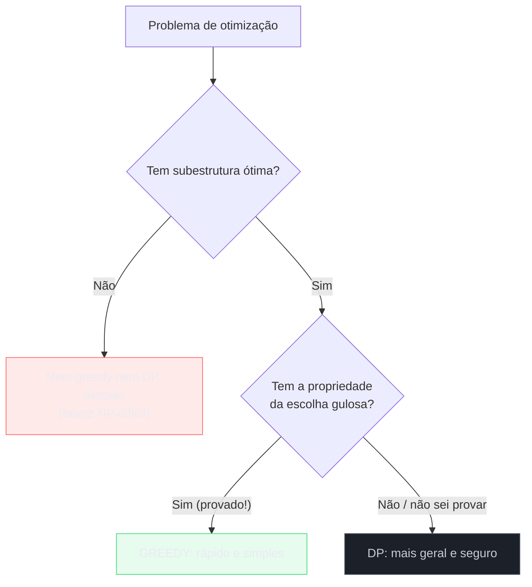
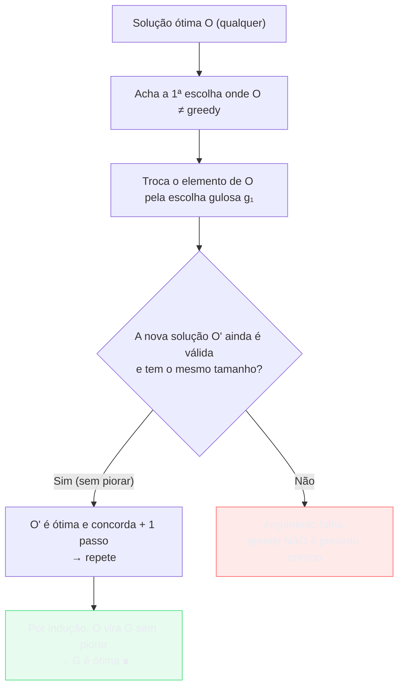
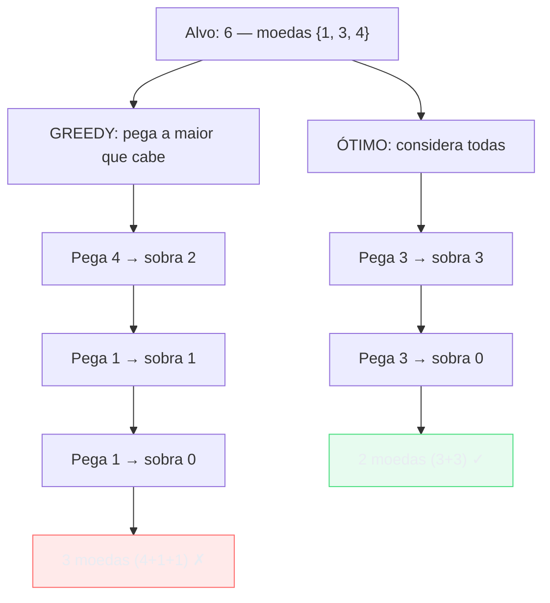
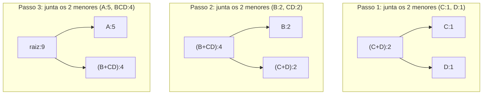
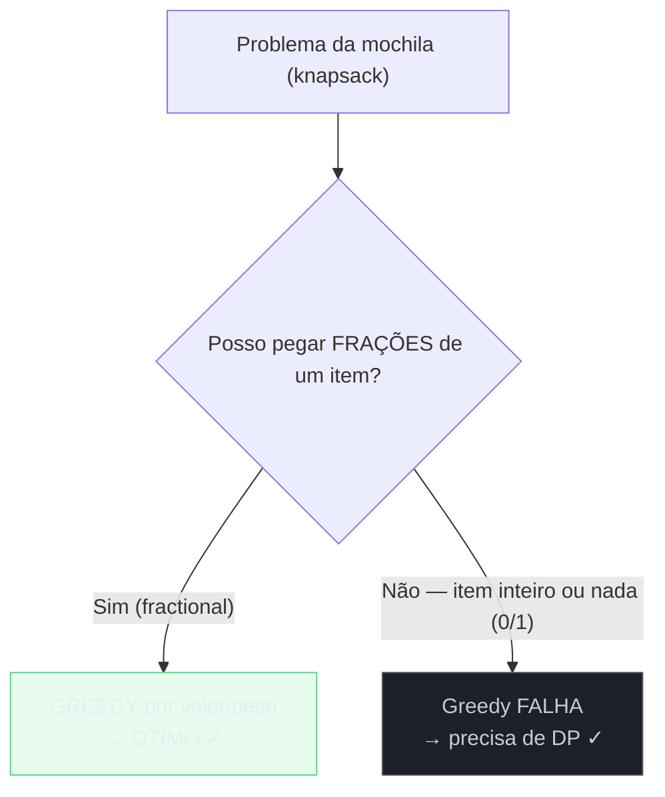

# Greedy

> [!abstract] TL;DR
> **Um algoritmo guloso (greedy) faz, a cada passo, a escolha que parece melhor AGORA — a escolha localmente ótima — e nunca volta atrás para reconsiderar.** É a técnica mais rápida e mais simples de programar quando funciona: nada de tabela como em DP ([[10 - Programação dinâmica]]), nada de explorar todas as combinações. Mas esse "quando funciona" é uma cláusula traiçoeira. Greedy só produz a resposta ótima se o problema tiver **duas** propriedades: a **propriedade da escolha gulosa** (uma escolha localmente ótima faz parte de *alguma* solução globalmente ótima) e a **subestrutura ótima** (o que sobra depois da escolha é um subproblema do mesmo tipo). A prova canônica de que um greedy está correto é o **exchange argument** — pegue uma solução ótima qualquer e mostre que dá pra trocar um pedaço dela pela escolha gulosa sem piorar. O perigo: greedy "parece funcionar" em muitos casos onde está *errado*. O contraexemplo clássico é o troco com moedas {1, 3, 4} para o alvo 6 — greedy pega 4+1+1 (3 moedas) quando 3+3 (2 moedas) era ótimo. Regra de entrevista: **prove com exchange argument, ou tenha um contraexemplo na manga.** DP é o fallback seguro.

Pense no caixa de uma padaria te devolvendo R$ 8 de troco. Sem pensar, ele pega uma nota de R$ 5, depois uma de R$ 2, depois uma de R$ 1. Três notas. Ninguém faz uma planilha de todas as combinações possíveis de cédulas para minimizar a quantidade — você simplesmente **pega a maior nota que cabe**, repete, e pronto. Todo caixa do mundo é guloso por instinto, e na imensa maioria das vezes ele acerta o troco mínimo. Esse reflexo — "pegue o maior pedaço que cabe agora, não olhe pra trás" — é exatamente o coração de um algoritmo guloso.

A graça (e a armadilha) é que esse instinto está certo **por causa da estrutura do dinheiro brasileiro**, não por mágica universal. O sistema de cédulas e moedas do real foi desenhado pra que o método guloso sempre dê o troco mínimo. Troque o sistema de moedas por um maluco — digamos, moedas de 1, 3 e 4 — e o caixa guloso passa a errar. Ele não percebe, porque "parece" certo a cada passo. Essa fenda entre "parece certo" e "é certo" é o tema desta nota inteira.

Esta trilha chega aqui depois de [[10 - Programação dinâmica]], e o contraste entre as duas técnicas é o melhor jeito de entender ambas. DP é o sujeito desconfiado: ele **não aposta**. Considera todas as decisões possíveis em cada ponto, guarda os resultados num caderninho, e só decide depois de ter visto tudo. Greedy é o oposto: ele **aposta** que a escolha localmente ótima é a globalmente ótima, decide na hora, e segue em frente sem olhar pra trás. Quando a aposta é justificada, greedy ganha de lavada em velocidade e simplicidade. Quando não é, ele entrega uma resposta errada com toda a confiança do mundo. A senioridade aqui não é decorar quais problemas são gulosos — é saber **provar** a aposta, ou saber que ela é furada.

> [!info] Lastro
> - **CLRS** — *Introduction to Algorithms*, 4ª ed. (Cormen, Leiserson, Rivest, Stein), capítulo **Greedy Algorithms**. A referência canônica: define a *greedy-choice property* e a subestrutura ótima, desenvolve activity selection (interval scheduling), prova a corretude de Huffman, e formaliza a relação entre greedy e matroides (o arcabouço teórico que explica *por que* certos greedys funcionam).
> - **Kleinberg & Tardos** — *Algorithm Design* (2005), capítulo 4, **Greedy Algorithms**. O melhor texto pedagógico sobre o **exchange argument** e sobre a técnica "greedy stays ahead". Trata interval scheduling, interval partitioning, scheduling to minimize lateness, Dijkstra, MST (Kruskal/Prim) e Huffman, sempre com a prova de otimalidade no centro.
> - **David A. Huffman** — *A Method for the Construction of Minimum-Redundancy Codes*, Proceedings of the IRE, vol. 40, nº 9 (setembro de 1952). O paper original onde a construção gulosa da árvore de Huffman é apresentada e provada ótima entre os códigos de prefixo.
> - **Sedgewick & Wayne** — *Algorithms*, 4ª ed. Trata os greedys de grafo (Dijkstra para shortest paths; Kruskal e Prim para MST) com implementações via priority queue, e discute compressão de dados / Huffman no contexto prático.

---

## 1. A ideia gulosa: decida agora, nunca se arrependa

Um algoritmo guloso resolve um problema de otimização — onde você quer o máximo de algo, ou o mínimo de algo — através de uma sequência de escolhas. A regra é brutalmente simples:

> A cada passo, faça a escolha que parece melhor **neste momento**, sem considerar as consequências futuras, e **nunca reconsidere** uma escolha já feita.

"Parece melhor neste momento" é o que chamamos de escolha **localmente ótima** ou **míope** (do inglês *myopic* — que enxerga só o que está perto). Você não tem uma bola de cristal; você olha o estado atual, escolhe a opção que maximiza (ou minimiza) algum critério imediato, comete-se a ela, e parte pro próximo passo com o problema agora menor.

Compare com a recursão exaustiva ou com DP. Em [[10 - Programação dinâmica]], em cada ponto de decisão você explora **todas** as opções, resolve os subproblemas de cada uma, e só então escolhe a melhor combinação. É caro porque você considera tudo. Greedy faz a aposta de que não precisa considerar tudo: a melhor opção imediata já é parte da melhor resposta final. Se a aposta vale, você acabou de transformar um problema potencialmente exponencial num passeio linear.

O gancho do troco ilustra perfeitamente. Para dar R$ 8 com cédulas {1, 2, 5, 10, 20, 50, 100}, o algoritmo guloso é:

```
troco_guloso(valor, cedulas_em_ordem_decrescente):
    resultado = []
    para cada cedula c em cedulas_em_ordem_decrescente:
        enquanto valor >= c:
            resultado.append(c)
            valor = valor - c
    retorna resultado
```

Para 8: pega 5 (sobra 3), pega 2 (sobra 1), pega 1 (sobra 0). Três cédulas. A escolha localmente ótima — "a maior que cabe" — em cada passo levou ao mínimo global. E note: o algoritmo **nunca olha pra trás**. Depois de pegar a nota de 5, ele não cogita "e se eu tivesse pego duas de 2?". Essa irrevogabilidade é a marca do greedy e a fonte tanto da sua velocidade quanto do seu perigo.


**Leitura do diagrama:** cada caixa é um passo do algoritmo. A cada passo, a única decisão é "qual a maior cédula que ainda cabe no valor restante?" — a escolha localmente ótima. O fluxo é uma linha reta sem ramificações: greedy nunca abre uma árvore de possibilidades, ele segue um único caminho do início ao fim. Compare mentalmente com a árvore exponencial que a recursão ingênua de DP abriria para o mesmo problema (`[[10 - Programação dinâmica]]`): é a diferença entre uma estrada e um labirinto.

> [!tip] O reflexo guloso em uma frase
> Greedy = "pegue o melhor pedaço disponível agora, descarte-o do problema, repita até acabar — e jamais devolva um pedaço já pego."

---

## 2. As duas propriedades que tornam greedy correto

Greedy não é universal. Para que a aposta gulosa esteja sempre certa, o problema precisa ter **duas** propriedades simultâneas. Elas são o equivalente guloso das duas propriedades de DP — e, na verdade, uma delas é literalmente a mesma.

### 2.1 Propriedade da escolha gulosa (greedy-choice property)

Esta é a propriedade que **distingue** greedy de DP, e é a difícil de garantir.

> Um problema tem a **propriedade da escolha gulosa** quando existe uma escolha localmente ótima que faz parte de **alguma** solução globalmente ótima.

Leia com cuidado, porque cada palavra importa. Não dizemos "a escolha gulosa faz parte de *toda* solução ótima" — basta que ela faça parte de *uma*. E não dizemos "a escolha gulosa *é* a solução" — dizemos que ela é um **primeiro passo** que pode ser estendido até o ótimo. A consequência prática é poderosa: se essa propriedade vale, então depois de fazer a escolha gulosa você pode **jogar fora** todas as outras opções daquele passo, com a garantia de que não está descartando nenhum ótimo. Você nunca se arrepende.

É exatamente isso que DP **não** pode assumir. Em DP, você não sabe de antemão qual primeira escolha leva ao ótimo, então tem que tentar todas e comparar. A propriedade da escolha gulosa é a permissão para parar de comparar.

A diferença, em uma imagem: DP decide **de baixo pra cima** (resolve os menores subproblemas primeiro, depois combina); greedy decide **de cima pra baixo** (faz a escolha grande primeiro, e o subproblema que sobra é menor). Greedy só pode se dar a esse luxo porque a escolha gulosa é segura.

### 2.2 Subestrutura ótima

> Um problema tem **subestrutura ótima** quando, depois de fazer a escolha gulosa, o que sobra é um **subproblema do mesmo tipo**, e a solução ótima do todo é igual à escolha gulosa MAIS a solução ótima desse subproblema.

Esta é a **mesma** propriedade que DP exige (veja a seção correspondente em [[10 - Programação dinâmica]]). É o que garante que "resolver otimamente o resto" é uma pergunta bem-formada: combinar a escolha gulosa com o ótimo do subproblema dá o ótimo global. Sem isso, recortar a primeira decisão não levaria a nada útil.

A relação entre as duas técnicas fica clara aqui:



**Leitura do diagrama:** as duas técnicas compartilham o pré-requisito da subestrutura ótima (o primeiro losango). O que as separa é o segundo losango: se você consegue **provar** a propriedade da escolha gulosa, desce pelo ramo verde (greedy, barato). Se não consegue, o caminho seguro é o ramo azul (DP, caro mas geral). Repare na palavra "provado" — é o pedágio do ramo guloso. Sem prova, você não tem o direito de descer ali, mesmo que pareça que funciona. A próxima seção é justamente sobre como pagar esse pedágio.

> [!warning] As duas propriedades não são intercambiáveis
> Todo problema com a propriedade da escolha gulosa tem subestrutura ótima, mas a recíproca é falsa. Muitos problemas têm subestrutura ótima (e por isso aceitam DP) mas **não** têm a propriedade da escolha gulosa (e por isso greedy falha). O exemplo perfeito disso é o coin change com moedas arbitrárias, na seção 4. É a diferença entre "dá pra montar de pedaços ótimos" e "dá pra adivinhar o primeiro pedaço certo sem olhar os outros".

---

## 3. O exchange argument: como PROVAR que um greedy está correto

Aqui mora a parte que separa quem "chuta greedy" de quem **sabe** greedy. A técnica canônica para provar que um algoritmo guloso produz a resposta ótima chama-se **exchange argument** (argumento de troca). A ideia é tão elegante que vale memorizar o esqueleto, porque ele se repete em praticamente toda prova de greedy.

A estrutura do argumento é:

1. Suponha que exista uma solução **ótima** `O` qualquer, possivelmente diferente da solução `G` que o algoritmo guloso produz.
2. Olhe a **primeira** escolha onde `O` difere da escolha gulosa.
3. Mostre que você pode **trocar** o elemento de `O` ali pela escolha gulosa, obtendo uma nova solução `O'` que é **tão boa quanto** `O` (não pior).
4. Como `O'` ainda é ótima e agora concorda com o greedy em mais um passo, repita. Por indução, você transforma `O` em `G` sem nunca piorar — logo `G` é tão boa quanto a ótima. Portanto `G` é ótima. ∎

A frase-chave é "**sem piorar**". Você não precisa mostrar que a troca *melhora* (geralmente não melhora); basta mostrar que ela **não piora**. Isso é o suficiente, porque se a troca não piora e você partiu do ótimo, o resultado ainda é ótimo.

### 3.1 O esqueleto aplicado: interval scheduling

Vamos esboçar o exchange argument no problema clássico que a seção 5 detalha: **interval scheduling** (selecionar o máximo de atividades que não se sobrepõem). A estratégia gulosa é: **escolha sempre a atividade que termina mais cedo**.

Esboço da prova:

- Seja `G` a solução gulosa e `O` uma solução ótima qualquer. Ordene ambas pelo horário de término.
- Seja `g₁` a primeira atividade que o greedy escolhe (a de menor horário de término de todas) e `o₁` a primeira de `O`.
- Por construção, `g₁` termina **antes ou junto** de `o₁` (o greedy pegou a que termina mais cedo no universo todo).
- Troque `o₁` por `g₁` em `O`. A solução continua válida: como `g₁` termina antes de `o₁`, ela não pode sobrepor nenhuma das atividades restantes de `O` (que começavam depois do fim de `o₁`, logo depois do fim de `g₁` também). E o **tamanho** da solução não mudou — trocamos uma atividade por outra, não removemos.
- Agora `O'` é ótima (mesmo tamanho) e concorda com o greedy no primeiro passo. Repita o argumento no subproblema restante.

Por indução, `O` vira `G` mantendo o tamanho — logo `G` tem tantas atividades quanto a ótima. Greedy está correto. Esse é o coração da técnica "greedy stays ahead" de Kleinberg & Tardos: a cada passo, a escolha gulosa está pelo menos tão à frente quanto qualquer alternativa.



**Leitura do diagrama:** o argumento parte da *direita do alvo* — assume que já existe uma solução ótima — e caminha *em direção* à solução gulosa, mostrando que cada troca preserva a otimalidade. O losango "sem piorar" é o coração: se você conseguir provar que a troca nunca degrada a solução, o ramo verde se fecha e o greedy está provado. Se a troca *pode* piorar (ramo vermelho), o argumento desmorona — e isso costuma ser o sinal de que greedy realmente não funciona para aquele problema.

> [!danger] Greedy sem prova é perigoso
> "Rodei em vários casos e funcionou" **não é prova**. A história dos algoritmos está cheia de greedys plausíveis que estão errados (o coin change da próxima seção é o exemplo mais famoso). Em entrevista, propor um greedy sem justificar a corretude é um sinal de imaturidade; propor um greedy *com* um exchange argument (ainda que informal) é exatamente o tipo de raciocínio que distingue um candidato sênior. Se você não consegue provar, assuma: "Acho que greedy funciona aqui, mas preciso checar com um contraexemplo antes de me comprometer."

---

## 4. Quando greedy FALHA: o contraexemplo que salva sua entrevista

A maneira mais rápida de aprender greedy de verdade é estudar onde ele **quebra**. E o exemplo soberano é o problema do troco — o mesmo do gancho, só que com um sistema de moedas adversário.

### 4.1 Coin change canônico vs arbitrário

O problema: dado um conjunto de denominações de moedas e um valor-alvo, use o **menor número de moedas** para somar o alvo (assumindo suprimento infinito de cada moeda).

**Sistema canônico** (como o real, ou {1, 5, 10, 25} dos centavos americanos): o greedy "pegue sempre a maior moeda que cabe" **funciona** e dá o ótimo. Esses sistemas são desenhados (ou matematicamente caracterizados como *canônicos*) justamente para que o greedy seja correto. É por isso que o caixa da padaria nunca erra.

**Sistema arbitrário**: aí o greedy pode falhar espetacularmente. Tome as moedas **{1, 3, 4}** e o alvo **6**.

O greedy faz:
- Maior moeda que cabe em 6? É a **4**. Pega. Sobra 2. (1 moeda)
- Maior moeda que cabe em 2? Não cabe 4 nem 3; pega **1**. Sobra 1. (2 moedas)
- Maior moeda que cabe em 1? Pega **1**. Sobra 0. (3 moedas)
- **Resposta gulosa: 4 + 1 + 1 = 3 moedas.**

Mas a resposta ótima é:
- **3 + 3 = 6 → 2 moedas.**

O greedy usou 3 moedas onde 2 bastavam. Ele errou porque, ao pegar a moeda de 4 (localmente ótima — a maior que cabia), comprometeu-se com um resto (2) que não fatorava bem nas denominações disponíveis. A escolha gulosa **não fazia parte de nenhuma solução ótima** — e essa é exatamente a propriedade da escolha gulosa falhando.



**Leitura do diagrama:** os dois ramos partem do mesmo alvo. O ramo esquerdo (greedy) é míope: ele agarra a moeda de 4 porque é a maior que cabe, sem perceber que isso o encurrala num resto ruim. O ramo direito (ótimo) "abre mão" da moeda grande, escolhe duas de 3, e ganha. A lição visual: a escolha localmente ótima (pegar a 4) **não** estava no caminho da solução globalmente ótima — a aposta gulosa foi furada. Só uma busca que considera todas as combinações (DP) descobre o ramo da direita.

A versão **DP** do coin change considera, para cada valor de 0 até o alvo, o mínimo entre "usar a moeda X e somar o ótimo do resto" para todas as moedas X — exatamente a exploração completa que o greedy se recusa a fazer. Por isso a DP **sempre** acha o ótimo, em qualquer sistema de moedas, ao custo de O(alvo × nº de moedas). Veja a formulação geral em [[10 - Programação dinâmica]].

### 4.2 A lição maior

A corretude do greedy depende da **estrutura do problema**, não é uma propriedade da técnica. O mesmo algoritmo guloso é ótimo para {1, 5, 10, 25} e errado para {1, 3, 4}. Nada no código muda — muda o *input*. Isso é profundamente diferente de DP ou de divisão-e-conquista, cuja corretude é estrutural e não depende dos dados.

> [!warning] Regra prática de entrevista
> Se você "sente" que um greedy funciona, você tem duas obrigações, nessa ordem:
> 1. **Tente provar** com um exchange argument. Se conseguir, ótimo — você tem um algoritmo rápido e defensável.
> 2. Se não conseguir provar rápido, **caçe um contraexemplo** antes de se comprometer. Sistemas com "saltos irregulares" de tamanho (como {1, 3, 4}) são geradores clássicos de contraexemplos.
>
> E lembre do fallback: **DP é seguro**. Se você está em dúvida e o tempo aperta, uma DP correta vale muito mais que um greedy elegante e errado. Errar a corretude é o pior resultado possível numa entrevista — pior que uma solução mais lenta.

---

## 5. Os clássicos onde greedy PROVADAMENTE funciona

Para equilibrar: há uma família de problemas onde greedy não só funciona como é a solução canônica, com prova bem estabelecida. Conhecê-los te dá tanto ferramentas quanto a intuição de *que tipo* de problema é guloso.

### 5.1 Interval scheduling / activity selection

**Problema:** dado um conjunto de atividades com horários de início e fim, selecione o **máximo** de atividades que não se sobreponham. (Pense em reservar uma única sala de reunião para o maior número de eventos.)

**Estratégia gulosa:** ordene por horário de **término** e escolha sempre a próxima atividade compatível que **termina mais cedo**.

A intuição: terminar cedo deixa o máximo de tempo livre para as atividades seguintes. Cada vez que você escolhe a que acaba antes, você "preserva recurso" (tempo restante) para o futuro. A prova é o exchange argument esboçado na seção 3.1.

```
interval_scheduling(atividades):
    ordena atividades por horário de término crescente
    selecionadas = []
    fim_ultimo = -infinito
    para cada atividade a em atividades:
        se a.inicio >= fim_ultimo:
            selecionadas.append(a)
            fim_ultimo = a.fim
    retorna selecionadas
```

> [!note] Não confunda com interval partitioning
> *Interval scheduling* (acima) maximiza atividades numa **única** sala. *Interval partitioning* é o problema dual: dado todas as atividades, qual o **número mínimo de salas** para acomodar todas sem conflito? Também é guloso (ordene por início, atribua cada atividade a uma sala livre, abra sala nova só se preciso), mas a estratégia e a prova são diferentes. Entrevistadores às vezes trocam um pelo outro pra ver se você percebe.

### 5.2 Huffman coding

**Problema:** comprimir uma mensagem atribuindo a cada símbolo um **código de prefixo** binário (nenhum código é prefixo de outro) de modo a minimizar o número total de bits. Símbolos frequentes devem receber códigos curtos; raros, códigos longos.

**Estratégia gulosa (Huffman, 1952):** trate cada símbolo como um nó com peso igual à sua frequência. Repetidamente, **junte os dois nós de menor frequência** num nó-pai cujo peso é a soma dos dois. Continue até sobrar um único nó — a raiz da árvore. O código de cada símbolo é o caminho da raiz até sua folha (0 para esquerda, 1 para direita).

Por que é guloso: a cada passo, a escolha localmente ótima é "case os dois menos frequentes" — empurrando-os pra mais fundo na árvore (códigos mais longos), o que é o lugar certo pra símbolos raros. Huffman provou em 1952 que isso é ótimo entre todos os códigos de prefixo, e a prova é, adivinhe, um exchange argument (mostra-se que numa árvore ótima os dois símbolos menos frequentes são irmãos no nível mais profundo).

Construção da árvore para frequências A:5, B:2, C:1, D:1:



**Leitura do diagrama:** leia de cima pra baixo, passo a passo. Em cada passo, o algoritmo é míope da melhor maneira: olha apenas os **dois nós de menor peso disponíveis** e os funde. C e D (os mais raros, peso 1 cada) são fundidos primeiro e acabam **no fundo** da árvore — logo recebem os códigos mais longos. A (peso 5, o mais comum) só entra no último passo e fica **logo abaixo da raiz** — código mais curto, um único bit de caminho. A escolha gulosa "junte os dois menores" empurra automaticamente os raros pra longe e mantém os frequentes perto: exatamente o que minimiza o total de bits. Implementação eficiente usa uma min-heap / priority queue (`[[11 - Grafos - travessia e algoritmos]]` discute a mesma estrutura no contexto de Dijkstra).

### 5.3 Algoritmos de grafo que são gulosos

Vários algoritmos de grafo centrais são, no fundo, gulosos — eles moram no galho de Estruturas de Dados, em [[11 - Grafos - travessia e algoritmos]], então aqui só registro **por que** são gulosos e linko pra lá:

- **Dijkstra** (caminho mínimo a partir de uma origem, pesos não-negativos): a cada passo, expande o vértice **de menor distância acumulada** ainda não finalizado. Essa escolha localmente ótima é segura *porque* os pesos são não-negativos — uma vez que um vértice tem a menor distância pendente, nada vai melhorá-la. (Com pesos negativos a propriedade da escolha gulosa quebra, e você precisa de Bellman-Ford, que é DP.)
- **Kruskal** (árvore geradora mínima — MST): ordena as arestas por peso e adiciona repetidamente **a aresta mais barata** que não forma ciclo (usando union-find pra detectar ciclos).
- **Prim** (MST): cresce a árvore a partir de um vértice, sempre adicionando **a aresta mais barata** que conecta a árvore atual a um vértice de fora.

Os três compartilham o DNA guloso: ordene/priorize por custo, pegue o mais barato disponível, nunca reconsidere. E os três são **provadamente** ótimos (a prova de MST é o *cut property*, um exchange argument disfarçado). Os detalhes, implementações e provas estão em [[11 - Grafos - travessia e algoritmos]].

### 5.4 Fractional vs 0/1 knapsack: a mesma cara, técnicas opostas

Este é o contraste mais bonito de todos, porque dois problemas quase idênticos exigem técnicas diferentes — e mostra como uma única regrinha muda tudo.

**Fractional knapsack:** você tem uma mochila de capacidade `W` e itens com valor e peso, e pode pegar **frações** de um item (imagine ouro em pó, areia, líquidos). **Greedy funciona:** calcule a razão valor/peso de cada item, ordene em ordem decrescente, e encha a mochila começando pelo de melhor razão; quando o último item não couber inteiro, pegue a fração que cabe. Provadamente ótimo via exchange argument (se houvesse espaço ocupado por um item de razão pior que outro disponível, trocar melhoraria — contradição).

**0/1 knapsack:** mesma coisa, mas cada item é **indivisível** — você pega o item inteiro ou nada (0 ou 1, daí o nome). **Greedy FALHA.** Ordenar por valor/peso não garante o ótimo: pegar o item de melhor razão pode "desperdiçar" capacidade que combinaria melhor com dois itens menores. Você precisa de **DP** (a clássica tabela de knapsack em [[10 - Programação dinâmica]]).



**Leitura do diagrama:** o problema é o mesmo até o losango. A **única** diferença é a pergunta "posso pegar frações?". Se sim, a propriedade da escolha gulosa vale (sempre dá pra completar a mochila com a fração certa do melhor item), e greedy é ótimo. Se não — se o item é indivisível — a escolha gulosa pode encurralar você num resto de capacidade que não fecha bem, exatamente como o coin change da seção 4, e só DP salva. Uma regra de divisibilidade vira o jogo entre as duas técnicas: é o lembrete mais conciso de que a corretude do greedy é uma questão de *estrutura do problema*, não de aparência.

---

## 6. Greedy vs DP: a decisão

Você vai constantemente decidir entre as duas. O resumo operacional:

| Dimensão | Greedy | DP ([[10 - Programação dinâmica]]) |
|---|---|---|
| Estratégia | escolha localmente ótima, sem voltar atrás | considera todas as opções, lembra resultados |
| Velocidade | rápido (geralmente O(n log n) ou O(n)) | mais caro (geralmente O(n·m) ou pior) |
| Memória | mínima | tabela de subproblemas |
| Generalidade | só funciona com a greedy-choice property | funciona sempre que houver subestrutura ótima |
| Risco | alto: pode estar errado sem você perceber | baixo: se a recorrência está certa, é ótimo |
| Prova | exchange argument (difícil) | indução sobre a recorrência (mais mecânica) |

A heurística de decisão:

1. **Cheque se há subestrutura ótima.** Se não houver, nem greedy nem DP simples se aplicam (pode ser NP-difícil — pense em backtracking, [[12 - Backtracking]]).
2. **Tente provar a propriedade da escolha gulosa** com um exchange argument. Se conseguir, **use greedy** — é mais rápido e mais simples.
3. **Se não conseguir provar (ou achar um contraexemplo), use DP.** É o fallback seguro.

Dito de outro jeito: greedy é a otimização agressiva que você só pode usar com licença (a prova); DP é a opção conservadora que sempre está disponível. Em produção e em entrevista, prefira estar certo a estar rápido — então, na dúvida, DP. Mas quando a prova gulosa existe, é um prazer raro: você ganha velocidade *e* simplicidade *e* corretude de uma vez.

---

## 7. Em entrevista

Greedy aparece em entrevista de dois jeitos: como solução elegante que impressiona quando você a *prova*, e como armadilha onde o entrevistador espera que você caia num greedy errado. Saber discutir corretude — não só codar — é o diferencial.

**Frases úteis (em inglês):**

- "My first instinct is a greedy approach: at each step, I'd pick the [interval that finishes earliest / coin with the largest value]. But before committing, let me check whether the **greedy-choice property** holds here."
- "I can justify this greedy with an **exchange argument**: take any optimal solution, and I'll show we can swap one of its choices for the greedy choice **without making it worse**."
- "I'm not fully confident greedy is correct here, so let me try to find a **counterexample** before I commit to it."
- "Greedy would be faster, but I can't prove it's optimal, so I'll fall back to **dynamic programming**, which is safe."
- "This is the **fractional knapsack**, so greedy by value-to-weight ratio is optimal. If it were **0/1 knapsack**, greedy would fail and I'd need DP."
- "The classic counterexample for greedy coin change is denominations **one, three, and four** for a target of **six**: greedy gives three coins, but the optimum is two."

**Vocabulário PT → EN:**

| Português | English |
|---|---|
| algoritmo guloso | greedy algorithm |
| escolha localmente ótima | locally optimal choice |
| propriedade da escolha gulosa | greedy-choice property |
| subestrutura ótima | optimal substructure |
| argumento de troca | exchange argument |
| contraexemplo | counterexample |
| sem piorar / sem perda | without making it worse / without loss |
| solução ótima | optimal solution |
| código de prefixo | prefix code / prefix-free code |
| árvore geradora mínima | minimum spanning tree (MST) |
| sistema canônico de moedas | canonical coin system |
| mochila fracionária / 0-1 | fractional / 0-1 knapsack |
| razão valor por peso | value-to-weight ratio |
| escalonamento de intervalos | interval scheduling |
| seleção de atividades | activity selection |
| fila de prioridade | priority queue |
| solução de recuo / fallback | fallback solution |

> [!tip] O movimento que impressiona
> Quando você propõe um greedy, **antecipe a pergunta de corretude antes que o entrevistador faça**. Diga "deixa eu provar por que isso é ótimo" e esboce um exchange argument, ou diga "deixa eu checar se não há contraexemplo". Essa autocrítica é o sinal mais claro de maturidade algorítmica — mostra que você sabe que greedy é uma faca de dois gumes, não uma bala de prata.

---

## Em uma frase

Greedy aposta que o ótimo local leva ao ótimo global, decide na hora e nunca olha pra trás — imbatível em velocidade quando a aposta se prova (exchange argument), e perigosamente errado quando não (lembre de {1, 3, 4} para 6); na dúvida, caia no fallback seguro que é DP.

---

## Veja também

- Anterior: [[10 - Programação dinâmica]] — o fallback seguro: considera todas as combinações, não aposta.
- Próxima: [[12 - Backtracking]] — quando nem greedy nem DP bastam e você precisa explorar exaustivamente com poda.
- Grafos gulosos (Dijkstra / Kruskal / Prim): [[11 - Grafos - travessia e algoritmos]].
- MOC: [[03-Dominios/Ciência/Algoritmos/index|Algoritmos]]
