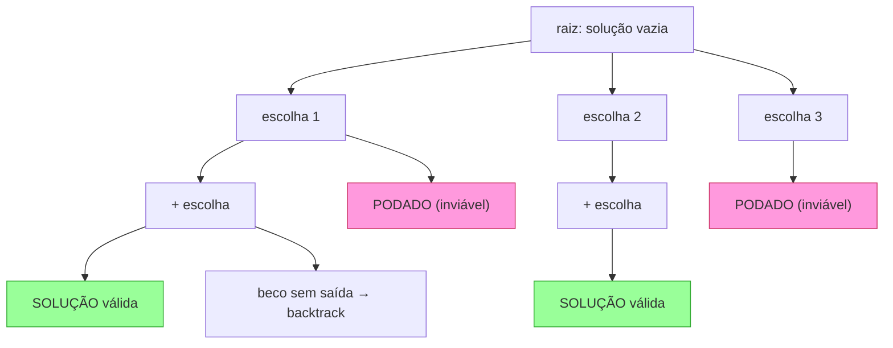
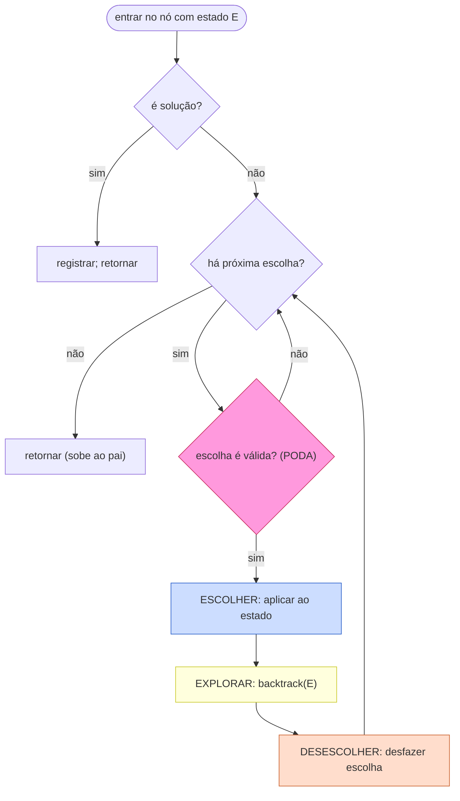
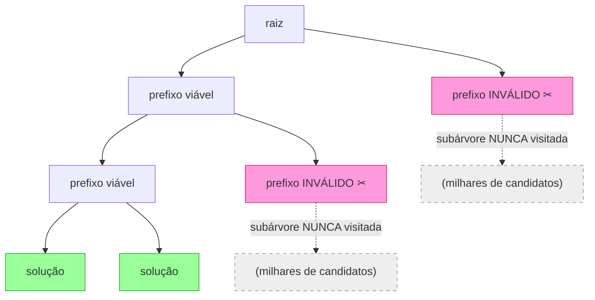
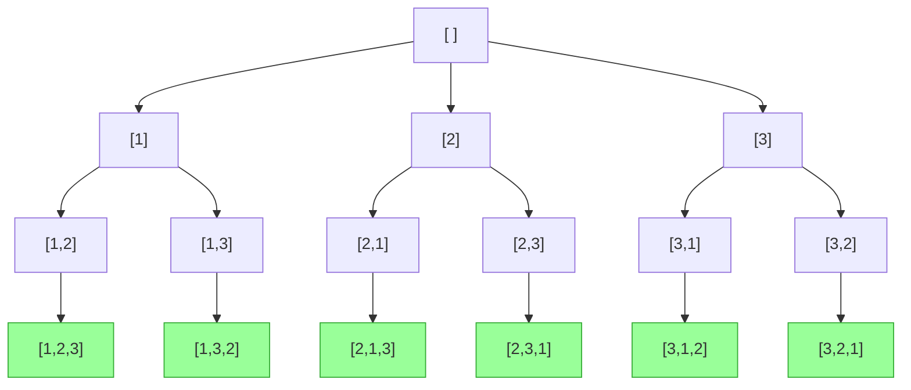
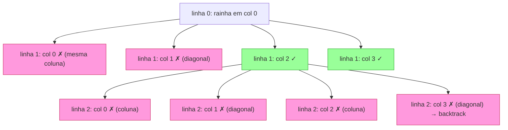
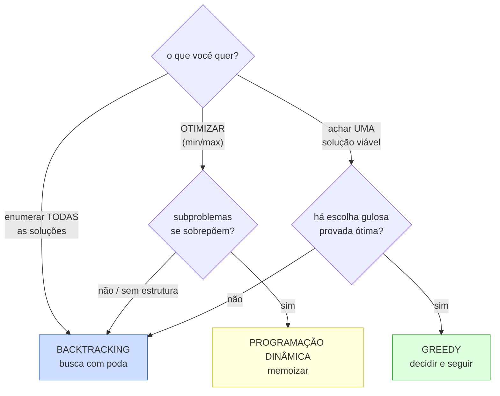

# Backtracking

> [!abstract] TL;DR
> **Backtracking é busca exaustiva inteligente: você constrói uma solução uma escolha por vez, e no instante em que percebe que o caminho atual não pode dar certo, você DESFAZ a última escolha e tenta outra.** É uma travessia em profundidade (DFS, [[11 - Grafos - travessia e algoritmos]]) sobre uma árvore de decisões que nem existe na memória — ela é gerada recursivamente conforme você desce. O esqueleto que resolve quase tudo é o tríplice **escolher → explorar (recursão) → desescolher (undo)**, e o detalhe que separa quem entende de quem decora é o terceiro passo: o **desfazer**. Sem ele, o estado vaza de um ramo da árvore para o irmão e a resposta sai suja. O que torna o backtracking viável apesar de o espaço ser exponencial é a **poda (pruning)**: cortar ramos provadamente sem saída ANTES de explorá-los. A poda não muda a classe de pior caso (continua O(exponencial) — permutações são O(n!), subsets são O(2ⁿ)), mas pode encolher a árvore efetiva em ordens de grandeza. Use backtracking quando o espaço é exponencial e não há estrutura para um atalho: para **enumerar todas** as soluções, ou para **achar uma** quando não dá pra ser mais esperto que buscar com poda. Se os subproblemas se sobrepõem e você quer otimizar (não enumerar), memoize e vira DP ([[10 - Programação dinâmica]]); se há uma escolha gulosa provada, vira greedy ([[11 - Greedy]]).

Imagine que você está dentro de um labirinto, no escuro, com um pedaço de giz. A regra é simples: em cada bifurcação você escolhe um corredor, marca por onde passou, e segue em frente. Quando bate num beco sem saída, você não desiste do labirinto inteiro — você **volta** até a última bifurcação onde ainda havia um corredor não tentado, apaga (ou ignora) a marca do caminho falho, e tenta o próximo. Você repete isso até achar a saída ou até esgotar todos os corredores. Esse "ir fundo, bater na parede, voltar um passo, tentar outro" é o backtracking inteiro, em uma frase.

Outra imagem, talvez ainda mais familiar: um cadeado de combinação de três dígitos que você esqueceu. Você fixa o primeiro dígito em 0, depois o segundo em 0, depois testa o terceiro de 0 a 9. Nenhum abre? Você **volta** ao segundo dígito, sobe pra 1, e varre o terceiro de novo. Esgotou o segundo? Volta ao primeiro, sobe pra 1, e recomeça. Você está construindo uma solução posição por posição e desfazendo a última escolha sempre que um galho inteiro de tentativas se esgota. A diferença para o cadeado da vida real é que, num problema bom de backtracking, você consegue saber que um prefixo é inviável **sem** testar todos os dígitos seguintes — e é aí que mora a poda.

Esta nota chega depois de [[11 - Greedy]] e fecha o arco das técnicas algorítmicas com um irmão direto da recursão ([[04 - Recursão]]). A frase de bolso é: **backtracking é recursão com "desfazer"**. A recursão te dá o esqueleto de descer e voltar; o backtracking adiciona a disciplina de aplicar uma escolha na descida e revertê-la na volta, mais a esperteza de não descer por caminhos condenados.

> [!info] Lastro
> - **CLRS** — *Introduction to Algorithms*, 4ª ed. (Cormen, Leiserson, Rivest, Stein). A travessia em profundidade (DFS) que é o motor do backtracking aparece formalizada no capítulo de algoritmos elementares de grafos (coloração de vértices por descoberta/finalização, árvore de busca), e o vocabulário de "árvore de busca implícita" / espaço de estados percorre o livro. Backtracking é, operacionalmente, DFS sobre essa árvore.
> - **Steven S. Skiena** — *The Algorithm Design Manual*, 3ª ed. Tem um dos melhores tratamentos práticos de **backtracking** que existe: apresenta um template genérico (`backtrack`, `construct_candidates`, `is_a_solution`, `make_move`/`unmake_move`), resolve subsets, permutações e o problema das 8 rainhas com ele, e discute poda e pruning como o que torna a busca tratável.
> - **Robert Sedgewick & Kevin Wayne** — *Algorithms*, 4ª ed. Trata recursão e busca exaustiva, e o problema clássico das **8 rainhas** (8-queens) como exercício canônico de geração de permutações com restrição de não-ataque.
> - **D. H. Lehmer** — a quem se credita a cunhagem do termo *backtrack* (anos 1950). O nome e a formalização da técnica como estratégia geral de busca são frequentemente atribuídos a Lehmer; o algoritmo geral foi depois descrito por autores como Walker, e Golomb & Baumert ("Backtrack Programming", *Journal of the ACM*, 1965) deram o tratamento sistemático que popularizou o termo.

---

## 1. A ideia: busca exaustiva, mas com juízo

Backtracking é, no fundo, **força bruta com freio**. Existe um espaço de soluções — todas as permutações, todos os subconjuntos, todos os preenchimentos possíveis de um tabuleiro — e você precisa varrer esse espaço pra achar uma solução válida (ou todas). A força bruta ingênua geraria cada candidato completo e só depois testaria se ele serve. Backtracking faz melhor: ele constrói o candidato **incrementalmente**, uma escolha de cada vez, e testa a viabilidade **a cada passo parcial**, abandonando o caminho assim que ele se revela impossível.

Pense na diferença entre dois jeitos de adivinhar uma senha de 4 dígitos com a regra "nenhum dígito repetido". A força bruta gera todas as 10 000 sequências de 4 dígitos e descarta as que repetem. O backtracking nunca chega a escrever um quarto dígito num prefixo que já repetiu — ele corta a tentativa "1123…" no terceiro dígito, porque "112" já viola a regra, e poupa todo o galho de senhas que começam com "112".

A estrutura que está sendo percorrida é uma **árvore de decisões implícita**. Cada nó é um estado parcial da solução; cada aresta saindo de um nó é uma escolha possível; as folhas são soluções completas (ou becos sem saída). "Implícita" é a palavra-chave: a árvore não está armazenada em lugar nenhum. Ela existe apenas como a sequência de chamadas recursivas — cada chamada é um nó, cada laço dentro dela são os filhos, e o retorno da recursão é a subida de volta para o pai. É exatamente isto que faz o backtracking ser DFS ([[11 - Grafos - travessia e algoritmos]]) sobre essa árvore: você sempre mergulha o mais fundo possível num ramo antes de considerar os irmãos.



**Leitura do diagrama:** da raiz (solução ainda vazia) saem todas as primeiras escolhas. Descer por uma aresta é "aplicar uma escolha"; subir de volta é "desfazer". Os nós em rosa (`PODADO`) são ramos que uma verificação de viabilidade cortou **antes** de explorá-los — toda a subárvore embaixo deles nunca é visitada, e é daí que vem a economia. Os nós em verde são folhas que formam soluções válidas. O nó "beco sem saída" mostra o outro motivo de voltar: você explorou até o fim e não deu certo, então retrocede para tentar o próximo irmão. Note que a busca é em profundidade: ela esgota tudo embaixo de "escolha 1" antes de tocar em "escolha 2".

---

## 2. O template que resolve quase tudo

Quase todo problema de backtracking que você vai encontrar em entrevista cabe num único esqueleto. Decorá-lo não basta — você precisa entender por que cada linha existe —, mas tê-lo na ponta dos dedos é o que transforma "não sei começar" em "vou instanciar o template". Ei-lo, em pseudocódigo:

```
backtrack(estado):
    se é_solução(estado):
        registra(estado)        # achou; guarda ou conta
        retorna
    para cada escolha em escolhas_possíveis(estado):
        se é_válida(escolha, estado):     # PODA
            aplica(escolha, estado)        # ESCOLHER
            backtrack(estado)              # EXPLORAR (recursão)
            desfaz(escolha, estado)        # DESESCOLHER (backtrack)
```

Vamos linha por linha, porque cada uma carrega uma decisão de projeto:

- **`se é_solução(estado): registra; retorna`** — a condição de parada. Define o que conta como uma solução completa: um tabuleiro inteiro preenchido, uma permutação de tamanho `n`, `n` pares de parênteses fechados. Quando bate, você "registra" (adiciona a uma lista de resultados, conta, ou imprime) e **retorna** — não há mais escolhas a fazer neste ramo. Em alguns problemas (achar *uma* solução), você retorna um sinal de sucesso que aborta a busca inteira; em outros (enumerar *todas*), você apenas registra e deixa a busca continuar pelos outros ramos.

- **`para cada escolha em escolhas_possíveis(estado)`** — gera os filhos do nó atual. São todas as próximas decisões que fazem sentido a partir do estado parcial: qual número ainda não usei, qual coluna posso colocar a rainha, abro ou fecho um parêntese.

- **`se é_válida(escolha, estado)` — a PODA.** Esta é a linha que separa backtracking de força bruta. Antes de comprometer-se com uma escolha, você verifica se ela viola alguma restrição. Se viola, você simplesmente **não desce** por aquele ramo — a subárvore inteira embaixo dele desaparece da busca. Quanto mais cedo e mais barata for essa checagem, mais a árvore encolhe. (Voltaremos a isso na seção 3, porque é o coração da viabilidade prática.)

- **`aplica(escolha, estado)` — ESCOLHER.** Você modifica o estado para refletir a escolha: marca o número como usado, coloca a rainha no tabuleiro, anexa um caractere ao caminho parcial. Agora o estado representa um nó mais profundo da árvore.

- **`backtrack(estado)` — EXPLORAR.** A chamada recursiva. Você desce um nível e repete tudo a partir do estado atualizado. Toda a subárvore daquela escolha é explorada nesta linha.

- **`desfaz(escolha, estado)` — DESESCOLHER, o backtrack propriamente dito.** Quando a recursão retorna, você **reverte** a modificação feita em `aplica`: desmarca o número, tira a rainha do tabuleiro, remove o último caractere. Isso devolve o estado exatamente ao que era **antes** desta escolha, para que a próxima iteração do laço (o próximo irmão) parta de um estado limpo.

> [!warning] O pecado capital: esquecer de desfazer
> O erro número um de candidatos é omitir o `desfaz` — ou, equivalentemente, mutar um estado compartilhado sem revertê-lo. O que acontece é insidioso: a escolha feita no ramo "esquerdo" da árvore continua marcada quando a busca sobe e desce pelo ramo "direito", e o estado **vaza** entre irmãos. O resultado é uma resposta que parece quase certa, com soluções duplicadas, faltando, ou contendo escolhas que nunca foram feitas naquele caminho. Regra de ouro: **toda mutação aplicada na descida tem que ter um desfazer correspondente na subida.** Aplica e desfaz são um par balanceado, como abrir e fechar um parêntese.

Existe uma variação importante. Em vez de mutar-e-desfazer um estado compartilhado, você pode passar para a recursão uma **cópia nova** do estado já com a escolha aplicada. Aí não há `desfaz` explícito — cada chamada tem seu próprio estado, e ele simplesmente é descartado quando a chamada retorna. É mais limpo de raciocinar e mais difícil de errar, mas paga o custo de copiar o estado a cada nó (caro se o estado é grande). Mutar-e-desfazer é mais eficiente e é o que você quer quando o estado é um tabuleiro grande; copiar é mais seguro e idiomático em problemas de string/lista pequenos. Os dois implementam a **mesma** árvore de decisão — a diferença é só *como* o estado viaja por ela.



**Leitura do diagrama:** este é o template virado em fluxo de controle. Entrou no nó, primeiro pergunta se já é solução (caso-base, sai). Senão, entra no laço de escolhas. Cada escolha passa pelo filtro de **poda** (rosa): se inválida, pula direto pra próxima sem gastar nenhuma recursão. Se válida, executa o tríptico em sequência — **escolher** (azul, muta o estado), **explorar** (amarelo, a recursão que desce a subárvore), **desescolher** (laranja, reverte) — e volta ao laço para o próximo irmão. Repare que o laço de escolhas e o par escolher/desescolher formam o ciclo onde o estado é montado e desmontado tijolo por tijolo. Quando as escolhas acabam, o nó retorna e o controle sobe ao pai, que então faz *seu* próprio desescolher.

---

## 3. Poda: o que torna o exponencial suportável

Sem poda, backtracking é só um nome bonito para força bruta exponencial. Com poda, ele resolve na prática problemas cujo espaço de soluções tem bilhões de candidatos. A poda (em inglês, *pruning*) é o ato de **cortar um ramo da árvore antes de descer por ele**, porque você consegue provar, ali mesmo, que nenhuma folha embaixo dele será uma solução válida.

A intuição do labirinto de novo: se você chega numa porta e vê, sem entrar, uma placa "este corredor está alagado", você não entra para descobrir que todos os becos lá dentro estão inundados — você corta o corredor inteiro de uma vez. Cada porta que você evita assim economiza não uma sala, mas **toda a subárvore** de salas que estavam atrás dela. É por isso que a poda tem efeito multiplicativo: cortar um nó perto da raiz pode eliminar metade do espaço de busca.

O exemplo canônico é o N-rainhas (próxima seção em detalhe). Você coloca rainhas linha por linha. Antes de pôr uma rainha numa coluna, você checa se aquela coluna, ou as duas diagonais que passam por ali, já estão sob ataque de uma rainha colocada antes. Se estão, você **nem coloca** — poda. A força bruta tentaria todas as `n^n` (ou `n!`) disposições e só no fim verificaria conflitos; o backtracking com poda derruba isso para uma fração minúscula, porque um prefixo inválido (duas rainhas se atacando nas primeiras linhas) elimina de uma vez todas as disposições das linhas restantes.

Há uma forma mais sofisticada de poda chamada **propagação de restrições (constraint propagation)**, que brilha em Sudoku. Não basta checar se o número que você está pondo é legal agora; você propaga as consequências: pôr um 7 nesta célula remove o 7 dos candidatos de toda a linha, coluna e bloco. Se, ao propagar, alguma célula vazia ficar **sem nenhum candidato**, você sabe — sem tentar nada — que o estado atual é um beco sem saída, e poda imediatamente. Quanto mais inferência você faz antes de adivinhar, menor a árvore que sobra para a busca cega percorrer.



**Leitura do diagrama:** os nós rosa com a tesoura (✂) são prefixos parciais que a verificação de viabilidade rejeitou. As setas pontilhadas levam às subárvores cinzas que **nunca são visitadas** — cada uma podendo conter milhares de candidatos completos que a força bruta teria gerado e testado um a um. Esse é o ganho concreto da poda: não é que você visita os nós ruins mais rápido, é que você **não os visita**. Quanto mais alto na árvore um corte acontece, maior a subárvore que some.

Seja honesto sobre o que a poda faz e o que não faz. **Ela não muda a classe de complexidade de pior caso.** Existe sempre uma entrada patológica para a qual nada é podado e você paga o exponencial cheio. O que a poda muda é o **caso típico** — e essa mudança costuma ser a diferença entre "roda em milissegundos" e "não termina nunca". Backtracking é uma técnica de engenharia: a teoria diz que é exponencial, a prática diz que com boa poda dá pra usar em problemas reais de tamanho moderado.

---

## 4. Complexidade: olhe nos olhos do exponencial

O custo de um algoritmo de backtracking é, grosso modo, **o número de nós da árvore de busca que ele realmente visita**, multiplicado pelo trabalho feito em cada nó. Como a árvore tem ramificação `b` (quantas escolhas por nó) e profundidade `d` (quão fundo vai uma solução), o pior caso é da ordem de **O(b^d)** — e isso é exponencial sempre que `b > 1` e `d` cresce.

Os dois espaços de busca mais comuns têm tamanhos que você deve saber de cor:

- **Permutações:** há `n!` permutações de `n` elementos. A árvore tem `n` escolhas na raiz, `n-1` no nível seguinte, e assim por diante — `n!` folhas. **O(n!)**. Fatorial cresce mais rápido que qualquer exponencial de base fixa; `10!` já é 3,6 milhões e `13!` passa de 6 bilhões.
- **Subconjuntos (subsets):** cada elemento está dentro ou fora do subconjunto, então são `2ⁿ` subconjuntos possíveis. A árvore é binária (incluir / não incluir), com `2ⁿ` folhas. **O(2ⁿ)**. `2^20` é cerca de um milhão; `2^30` é um bilhão.

A lição prática é dura e simples: **backtracking só é viável para `n` moderado.** Se a entrada tem `n` na casa das dezenas baixas e o espaço é fatorial ou `2ⁿ`, ótimo. Se `n` é grande, nenhuma poda salva o pior caso — você precisa de outra técnica (DP, greedy) ou de aceitar uma resposta aproximada. Em entrevista, quando o enunciado pede "gere todas as permutações/subconjuntos/combinações", o `n` será pequeno de propósito, e o entrevistador *espera* a solução exponencial — ela é a resposta certa, não um sinal de que você falhou em achar algo melhor.

E reforçando a seção anterior: a poda **não** rebaixa esse pior caso. Ela só faz com que, na prática, a maioria das entradas execute uma fração ínfima da árvore. As duas verdades convivem: "é O(exponencial)" e "roda rápido no caso típico" não se contradizem — uma fala do pior caso teórico, a outra do comportamento empírico com poda.

> [!tip] Quando o backtracking é a ferramenta certa
> Use backtracking quando (a) o espaço de soluções é exponencial, (b) você precisa **enumerar todas** as soluções OU **achar uma** solução viável, e (c) não há subestrutura que permita um atalho via DP ou greedy. Se você só quer *contar* ou *otimizar* e os subproblemas se repetem, é forte indício de que DP é melhor. Se há uma escolha gulosa provadamente ótima, greedy é mais rápido. Backtracking é o que sobra — e é exatamente a ferramenta certa — quando a busca com poda é o melhor que se pode fazer.

---

## 5. Problemas clássicos

Backtracking tem um repertório de problemas-modelo. Conhecê-los é meio caminho andado, porque a maioria das questões de entrevista é uma variação de um deles. Para cada um, o que importa é enxergar **qual é o espaço de busca** (o que cada escolha representa) e **onde está a poda**.

### 5.1 Permutações

Gerar todas as ordenações de `[1, 2, 3]`. A escolha em cada nível é "qual elemento ainda não usado eu coloco na próxima posição". A poda é trivial mas essencial: você não pode reutilizar um elemento já colocado, então mantém um conjunto de "usados" e só ramifica pelos não usados. A árvore tem `n` filhos na raiz, `n-1` no próximo nível, etc., totalizando `n!` folhas.



**Leitura do diagrama:** a árvore de permutações de `[1,2,3]`. A raiz é o caminho parcial vazio. Cada nível fixa mais uma posição usando um elemento ainda não escolhido — por isso a ramificação encolhe de 3 para 2 para 1. As 6 folhas verdes são as `3! = 6` permutações completas. Descer uma aresta é "escolher e marcar usado"; subir é "desmarcar" — o desfazer que libera o elemento para o ramo irmão. Se você esquecesse de desmarcar, o ramo de `[2]` nunca conseguiria usar o `1`, porque ele teria ficado marcado lá no ramo de `[1]`.

Código em Python, com mutação-e-desfazer:

```python
def permutacoes(nums):
    resultado = []
    usado = [False] * len(nums)
    caminho = []

    def backtrack():
        if len(caminho) == len(nums):          # é solução?
            resultado.append(caminho[:])        # registra (cópia!)
            return
        for i in range(len(nums)):
            if usado[i]:                        # PODA: já usei este
                continue
            usado[i] = True                     # ESCOLHER
            caminho.append(nums[i])
            backtrack()                         # EXPLORAR
            caminho.pop()                       # DESESCOLHER
            usado[i] = False

    backtrack()
    return resultado
```

Repare nos dois desfazeres pareados: `caminho.pop()` desfaz o `caminho.append`, e `usado[i] = False` desfaz o `usado[i] = True`. E note o `caminho[:]` no registro: registramos uma **cópia**, porque `caminho` continuará sendo mutado depois — guardar a referência viva daria uma lista que acaba vazia no fim.

### 5.2 Combinações e subconjuntos (subsets)

Gerar todos os subconjuntos de `[1, 2, 3]`. Aqui a árvore é **binária** por uma decisão diferente: para cada elemento, ou você o **inclui** ou **não inclui**. Duas escolhas por elemento, `n` elementos, `2ⁿ` folhas. Combinações de tamanho fixo `k` são o mesmo, com uma poda extra: descarte caminhos que já passaram de `k` elementos ou que não têm como chegar a `k` com os elementos restantes.

```python
def subconjuntos(nums):
    resultado = []
    parcial = []

    def backtrack(i):
        if i == len(nums):              # decidiu sobre todos
            resultado.append(parcial[:])
            return
        # ramo 1: NÃO incluir nums[i]
        backtrack(i + 1)
        # ramo 2: INCLUIR nums[i]
        parcial.append(nums[i])         # ESCOLHER
        backtrack(i + 1)                # EXPLORAR
        parcial.pop()                   # DESESCOLHER

    backtrack(0)
    return resultado
```

Os dois `backtrack(i + 1)` são os dois filhos de cada nó: o primeiro explora "sem o elemento `i`", o segundo "com o elemento `i`". O `parcial.pop()` desfaz a inclusão antes de subir. As `2³ = 8` folhas são `[]`, `[3]`, `[2]`, `[2,3]`, `[1]`, `[1,3]`, `[1,2]`, `[1,2,3]`.

### 5.3 N-rainhas (N-queens): o clássico histórico

O problema das oito rainhas — colocar 8 rainhas num tabuleiro 8×8 sem que duas se ataquem — é o exemplo canônico de backtracking, estudado desde o século XIX e usado como vitrine da técnica em praticamente todo livro de algoritmos. A observação-chave que estrutura o espaço de busca: **cada linha tem exatamente uma rainha** (duas na mesma linha se atacam), então o problema vira "para cada linha, escolher uma coluna". Isso já transforma o tabuleiro num problema de permutação de colunas, e a poda faz o resto.

A poda em N-rainhas é o que dá ao problema sua fama didática. Antes de pôr a rainha da linha `r` na coluna `c`, você checa três coisas contra todas as rainhas já colocadas nas linhas acima: a coluna `c` está livre? as duas diagonais que passam por `(r, c)` estão livres? Se qualquer ataque existir, você poda — nem desce.



**Leitura do diagrama:** um pedaço da busca de 4-rainhas começando com a rainha da linha 0 na coluna 0. Na linha 1, as colunas 0 (mesma coluna) e 1 (diagonal) são podadas de cara; só 2 e 3 sobrevivem. Seguindo pela coluna 2, **todas** as colunas da linha 2 estão atacadas — esse ramo é um beco sem saída e a busca faz **backtrack**, voltando para tentar a coluna 3 na linha 1. Cada nó rosa é uma posição que a verificação de não-ataque rejeitou sem nunca descer. É a poda agindo a cada passo, e é por isso que o espaço efetivo de N-rainhas é muito menor que `n!`.

```python
def n_rainhas(n):
    solucoes = []
    colunas = set()
    diag1 = set()       # r - c constante numa diagonal
    diag2 = set()       # r + c constante na outra
    tabuleiro = []      # tabuleiro[r] = coluna da rainha na linha r

    def backtrack(r):
        if r == n:                          # todas as linhas preenchidas
            solucoes.append(tabuleiro[:])
            return
        for c in range(n):
            if c in colunas or (r - c) in diag1 or (r + c) in diag2:
                continue                    # PODA: posição atacada
            colunas.add(c); diag1.add(r - c); diag2.add(r + c)   # ESCOLHER
            tabuleiro.append(c)
            backtrack(r + 1)                # EXPLORAR
            tabuleiro.pop()                 # DESESCOLHER
            colunas.discard(c); diag1.discard(r - c); diag2.discard(r + c)

    backtrack(0)
    return solucoes
```

O truque das diagonais: todas as casas numa mesma diagonal "↘" têm `r - c` constante, e numa "↙" têm `r + c` constante. Guardar esses valores em conjuntos torna a checagem de ataque O(1). E o desfazer, de novo, é meticuloso: cada `add` na descida tem seu `discard` na subida — quatro mutações aplicadas, quatro revertidas.

### 5.4 Solucionador de Sudoku

Sudoku é backtracking com poda forte. O estado é a grade parcial; a escolha em cada passo é "que dígito de 1 a 9 ponho na próxima célula vazia". A poda: só tente dígitos que não violem a linha, a coluna e o bloco 3×3 da célula. O fluxo é exatamente o template — escolha uma célula vazia, para cada dígito válido coloque-o, recursão, e se a recursão falhar (voltou sem resolver), **apague o dígito** e tente o próximo. Se nenhum dígito de 1 a 9 serve numa célula, retorne falso: este caminho é um beco, faça backtrack. Com propagação de restrições (manter, por célula, o conjunto de candidatos ainda possíveis), a árvore encolhe drasticamente — quizzes "fáceis" muitas vezes são resolvidos quase sem adivinhação.

### 5.5 Gerar parênteses válidos (generate parentheses)

Dado `n`, gerar todas as combinações de `n` pares de parênteses bem-formadas. O espaço seriam todas as `2^(2n)` sequências de `(` e `)`, mas a poda corta isso brutalmente com duas invariantes que mantêm o prefixo sempre válido: você só pode **abrir** se ainda restam aberturas disponíveis (`abertos < n`), e só pode **fechar** se há um aberto pendente para casar (`fechados < abertos`). Essa segunda regra é a poda decisiva: ela nunca deixa aparecer um `)` a mais que `(`, então todo prefixo gerado é viável e toda folha é uma sequência válida — você nunca gera lixo para depois descartar.

```python
def gerar_parenteses(n):
    resultado = []
    parcial = []

    def backtrack(abertos, fechados):
        if len(parcial) == 2 * n:           # é solução
            resultado.append("".join(parcial))
            return
        if abertos < n:                     # PODA: pode abrir?
            parcial.append("(")             # ESCOLHER
            backtrack(abertos + 1, fechados)# EXPLORAR
            parcial.pop()                   # DESESCOLHER
        if fechados < abertos:              # PODA: pode fechar?
            parcial.append(")")
            backtrack(abertos, fechados + 1)
            parcial.pop()

    backtrack(0, 0)
    return resultado
```

As duas guardas (`if abertos < n` e `if fechados < abertos`) **são** a poda — elas impedem a busca de sequer construir prefixos inválidos. Sem elas, este código geraria todas as `2^(2n)` strings; com elas, gera só as `Catalan(n)` válidas, que é uma fração ínfima.

### 5.6 Outros do mesmo molde

- **Word search** numa matriz: dado um grid de letras, achar se uma palavra existe seguindo células adjacentes sem repetir. A busca é uma DFS de cada célula inicial; a poda corta quando a próxima letra não bate ou a célula já está no caminho atual; o desfazer é desmarcar a célula como visitada ao subir, para que outros caminhos possam reusá-la.
- **Subset sum / soma de subconjuntos:** existe um subconjunto que soma exatamente `T`? Árvore binária incluir/não-incluir (como subsets), com poda: corte se a soma parcial já passou de `T` (assumindo números positivos), ou se nem somando todo o resto você alcança `T`.

---

## 6. Backtracking versus as alternativas

Saber **quando não usar** backtracking é tão importante quanto saber implementá-lo. As três técnicas de busca/otimização que esta trilha cobre — backtracking, DP e greedy — não competem pelo mesmo nicho; cada uma responde a uma estrutura de problema diferente.



**Leitura do diagrama:** uma árvore de decisão sobre qual técnica aplicar. O primeiro corte é o objetivo. Se você precisa **enumerar todas** as soluções, backtracking é quase sempre a resposta — DP e greedy otimizam ou contam, não listam. Se você quer **otimizar** e os subproblemas se **sobrepõem** (o mesmo subproblema reaparece em vários ramos), você memoiza e cai em DP. Se você quer **uma** solução viável rápido e existe uma escolha gulosa **provadamente** ótima, é greedy. Em todos os ramos onde falta estrutura — sem sobreposição para DP explorar, sem garantia gulosa — você volta para backtracking, a ferramenta de último recurso que ainda assim é a certa.

A ponte mais importante de entender é **backtracking → DP**. Os dois percorrem a mesma árvore de decisões. A diferença é que, quando os subproblemas se **sobrepõem** — isto é, quando o mesmo estado é alcançado por caminhos diferentes —, o backtracking puro recalcula cada ocorrência do zero, enquanto a DP ([[10 - Programação dinâmica]]) **guarda o resultado de cada estado** e reusa. Memoizar um backtracking que tem sobreposição é, literalmente, transformá-lo em DP top-down. Por isso muita gente diz que DP "é backtracking com memória". A pegadinha: se os subproblemas **não** se sobrepõem (cada estado é único, como na enumeração de permutações distintas), memoizar não ajuda em nada — não há nada a reusar — e backtracking puro é o certo.

A ponte para **greedy** é o oposto da abundância de busca. Greedy ([[11 - Greedy]]) aposta numa única escolha por passo e nunca volta atrás — é backtracking com ramificação 1 e zero desfazer. Funciona só quando a escolha gulosa é provadamente ótima (lá, via *exchange argument*). Quando não dá pra provar isso, você é forçado a considerar múltiplas escolhas e possivelmente desfazê-las — e aí você está de volta ao backtracking.

Por fim, uma evolução do backtracking para problemas de **otimização**: **branch and bound**. A ideia é a mesma árvore de busca, mas com uma poda extra baseada em *limite (bound)*: você estima o melhor valor possível alcançável a partir de um nó parcial, e se esse limite for pior que a melhor solução completa já encontrada, você poda o ramo — não porque ele é inviável, mas porque ele não pode bater o que você já tem. É backtracking com uma função de bound guiando a poda; é a base de solucionadores de problemas como o caixeiro-viajante e a mochila inteira. Não desenvolvo aqui — fica como o próximo degrau quando o problema é otimizar, não enumerar.

---

## 7. Em entrevista

Backtracking é um dos temas mais testados em entrevistas de codificação, justamente porque revela rápido se o candidato entende recursão de verdade. Sinais de que o problema pede backtracking: o enunciado diz "**generate all**", "**find all combinations/permutations/subsets**", "**place N ... such that no two ...**", ou "**return whether a valid configuration exists**". Quando ouvir isso, pense template antes de pensar código.

A frase que mais impressiona: explicar a tríade em voz alta **antes** de escrever. "I'll use backtracking. The pattern is **choose, explore, un-choose**: I apply a choice, recurse, then undo it before trying the next one — that's what keeps the state clean across siblings." Em seguida, nomeie a poda: "The pruning here is ..." — porque é a poda que mostra que você não está fazendo força bruta cega.

Erros que custam a vaga: (1) esquecer o **un-choose** e deixar o estado vazar entre ramos; (2) adicionar a **referência** do caminho parcial ao resultado em vez de uma **cópia** (em Python, esquecer o `[:]`); (3) não mencionar a complexidade exponencial — diga `O(n!)` para permutações, `O(2ⁿ)` para subsets, e deixe claro que você sabe que é o esperado, não um bug.

Frases úteis em inglês:

- "This is a classic **backtracking** problem — the search space is exponential, so I'll build the solution incrementally and **prune** invalid branches early."
- "The template is **choose → explore → un-choose**. The un-choose step is what resets the state for the next sibling branch."
- "I'll **prune** here: if placing this queen attacks an existing one, I skip it without recursing — that cuts the whole subtree."
- "The worst-case time is **O(n factorial)** for permutations, **O(two to the n)** for subsets. Pruning doesn't change the worst case, but it makes the typical case tractable."
- "I append a **copy** of the partial path to the results, otherwise later mutations would corrupt what I stored."
- "If the subproblems **overlap**, I'd memoize this and it becomes a dynamic-programming solution."

Vocabulário PT → EN:

| Português | English |
|---|---|
| backtracking / retroceder | backtracking / to backtrack |
| desfazer a escolha | to undo / un-choose the move |
| poda | pruning |
| podar um ramo | to prune a branch |
| espaço de busca / soluções | search space / solution space |
| árvore de decisão (implícita) | (implicit) decision tree |
| beco sem saída | dead end |
| busca exaustiva | exhaustive search |
| força bruta | brute force |
| ramificação | branching factor |
| restrição | constraint |
| propagação de restrições | constraint propagation |
| viável / inviável | feasible / infeasible |
| caso-base | base case |
| permutação / combinação / subconjunto | permutation / combination / subset |
| ramo / subárvore | branch / subtree |
| limite (de poda) | bound |

---

## Resumo em uma linha

Backtracking é DFS com "desfazer" sobre a árvore implícita de soluções — **escolher → explorar → desescolher** — viabilizada pela **poda** de ramos inviáveis; exponencial no pior caso, mas a ferramenta certa para enumerar tudo ou achar uma solução quando não há atalho via DP ([[10 - Programação dinâmica]]) ou greedy ([[11 - Greedy]]).

---

## Veja também

- Anterior na trilha: [[11 - Greedy]]
- Próxima na trilha: [[13 - Intratabilidade]]
- Base: [[04 - Recursão]] — backtracking é recursão com desfazer
- Motor: DFS em [[11 - Grafos - travessia e algoritmos]]
- Contraste: [[10 - Programação dinâmica]] — memoizar subproblemas sobrepostos transforma backtracking em DP
- Alternativa: [[11 - Greedy]] — uma escolha por passo, sem voltar atrás
- MOC: [[03-Dominios/Ciência/Algoritmos/index|Algoritmos]]
