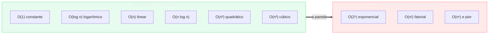
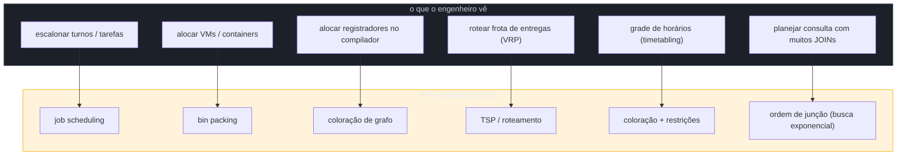
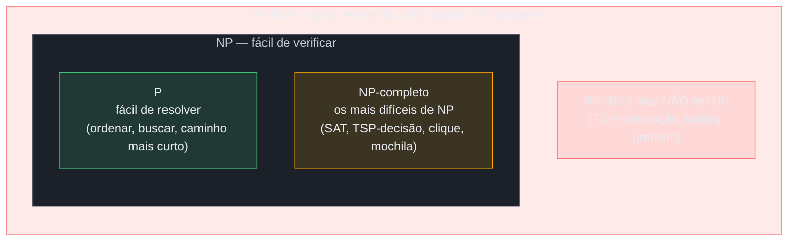
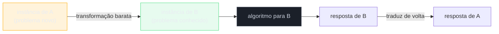
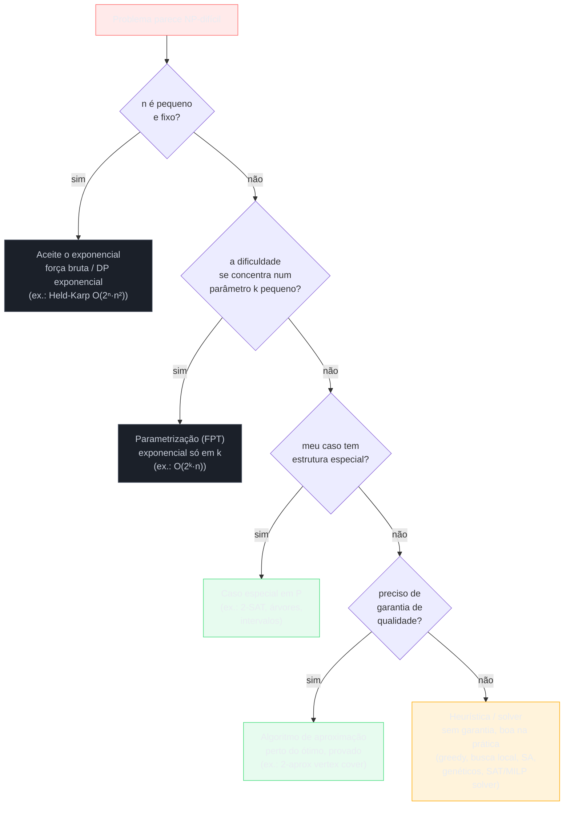

# Intratabilidade

> [!abstract] TL;DR
> **Um problema é intratável quando todo algoritmo conhecido para resolvê-lo exatamente leva tempo exponencial ou fatorial — e nada cresce tão rápido a ponto de ficar impossível tão depressa.** A fronteira prática que separa o "viável" do "inviável" é a fronteira **polinomial vs exponencial**: O(n), O(n²), O(n³) são tratáveis; O(2ⁿ), O(n!) são intratáveis assim que n cresce um pouco. O vocabulário para falar disso é o das classes **P** (sei resolver rápido), **NP** (sei verificar rápido uma solução que me deram), **NP-completo** (os mais difíceis de NP — resolva um e resolve todos) e **NP-difícil** (pelo menos tão difícil quanto esses). A grande pergunta em aberto — **P = NP?** — vale um milhão de dólares e quase ninguém acredita que a resposta seja "sim". A face de engenheiro disso tudo é prática: quando você reconhece que um problema "cheira a NP-difícil", você **para de procurar o algoritmo polinomial perfeito** (ele provavelmente não existe) e pivota para o que de fato resolve a vida: **aproximação** (perto do ótimo, com garantia), **heurística** (sem garantia, mas funciona), **exponencial domado** (n pequeno, DP exponencial, parametrização) ou **casos especiais** (o geral é difícil, o seu caso tem estrutura). E o ponto que muita gente esquece: **"NP-difícil" não quer dizer "impossível na prática"** — solvers modernos (SAT, MILP) mastigam instâncias gigantes do mundo real todo dia, apesar do pior caso exponencial. Aqui está o esqueleto disso. O formalismo (máquinas de Turing, prova de Cook-Levin, hierarquia de complexidade) vive no galho **Teoria da Computação** (planejado neste domínio); esta nota fica na parte que você usa numa sprint ou numa entrevista.

Pense num caixeiro-viajante que precisa visitar 50 cidades e voltar pra casa gastando a menor distância total. Parece um exercício de mapa. Você abre o computador, decide "vou testar todas as ordens possíveis de visitar as cidades e ficar com a melhor", e roda. O programa não termina. Não termina hoje, não termina na próxima década, não termina antes do Sol virar uma anã branca. O número de ordens possíveis para 50 cidades é 50! — um número com 64 dígitos, maior que a quantidade de átomos numa galáxia. Não há defeito no seu código. O problema é que você pediu ao computador algo **intratável**: a única receita exata que você conhece tem um custo que explode mais rápido do que qualquer máquina consegue acompanhar.

Agora a pergunta mais interessante: por que o GPS no seu bolso, que resolve um problema parecido com cidades, te dá uma rota em meio segundo? Porque ele **não testa todas as rotas**. Ele faz outra coisa — usa um algoritmo polinomial que dá a rota mais curta entre dois pontos (Dijkstra, A*), que é um problema fundamentalmente mais fácil que o do caixeiro-viajante. E quando o problema que o GPS enfrenta é mesmo do tipo difícil (otimizar a ordem de 30 entregas de um motoboy), ele não busca a resposta perfeita: ele busca uma resposta **boa o bastante**, rápido. Essa distinção — entre o que dá pra resolver direito e o que só dá pra resolver "mais ou menos" — é o coração desta nota.

Esta é a última técnica do arco antes do fechamento ([[14 - Reconhecendo o algoritmo certo]]). As anteriores te ensinaram a construir algoritmos: programação dinâmica ([[10 - Programação dinâmica]]), greedy ([[11 - Greedy]]), backtracking ([[12 - Backtracking]]). Esta te ensina o contrário, e é a marca de senioridade: **reconhecer quando o algoritmo eficiente que você procura provavelmente não existe** — e o que fazer com essa informação em vez de queimar a tarde (ou a entrevista) caçando o que não há.

> [!info] Lastro
> - **Michael R. Garey & David S. Johnson** — *Computers and Intractability: A Guide to the Theory of NP-Completeness* (1979). A bíblia da NP-completude: define a teoria, cataloga centenas de problemas NP-completos conhecidos, e — o mais útil na prática — ensina o engenheiro a **reconhecer** e a **provar** que seu problema é intratável, e o que fazer em seguida. O apêndice com a lista de problemas é referência diária.
> - **CLRS** — *Introduction to Algorithms*, 4ª ed. (Cormen, Leiserson, Rivest, Stein), capítulos **NP-Completeness** e **Approximation Algorithms**. Trata P, NP, NP-completude, reduções polinomiais, o esquema das provas (incluindo o circuito-SAT e a cadeia clássica) e os algoritmos de aproximação canônicos (vertex cover 2-aprox, TSP métrico) num registro mais didático que o de Garey & Johnson.
> - **Vijay V. Vazirani** — *Approximation Algorithms* (2001). O tratado de referência sobre o "e agora?" da NP-dificuldade: como projetar algoritmos com **garantia provada** (razão de aproximação) para problemas intratáveis — vertex cover, set cover, TSP métrico, Steiner, escalonamento. É o livro que transforma "é NP-difícil, desisti" em "é NP-difícil, então uso uma 2-aproximação".
> - **Stephen A. Cook** — *The Complexity of Theorem-Proving Procedures* (1971). O artigo que prova que **SAT é NP-completo** — o **teorema de Cook-Levin** (Leonid Levin chegou ao mesmo resultado independentemente). É a pedra fundacional: o primeiro problema demonstrado NP-completo, do qual todos os outros descendem por redução.
> - **Richard M. Karp** — *Reducibility Among Combinatorial Problems* (1972). Logo após Cook, Karp mostra **21 problemas NP-completos** reduzindo SAT a eles em cascata — o trabalho que transformou a NP-completude de uma curiosidade num fenômeno onipresente, e popularizou a redução como ferramenta.
> - **Nicos Christofides** — *Worst-case analysis of a new heuristic for the travelling salesman problem* (relatório técnico, Carnegie-Mellon, 1976). A **1,5-aproximação para o TSP métrico** — recorde imbatido por 44 anos, só superado em 2020 (Karlin, Klein & Oveis Gharan, com um fator 3/2 − ε ínfimo).

---

## 1. A fronteira prática: polinomial é "viável", exponencial é "intratável"

Em [[02 - Análise de complexidade - Big-O]] você ordenou as classes de crescimento da mais lenta para a mais rápida. Vamos retomar essa hierarquia, mas agora com uma divisória nova traçada bem no meio dela — a divisória que define este capítulo inteiro.

**Leitura do diagrama:** tudo do lado verde compartilha uma propriedade: o expoente de n é **fixo** (1, 2, 3...). São os algoritmos polinomiais, e por convenção chamamos todos eles de "tratáveis". Tudo do lado vermelho tem n **no expoente** (2ⁿ) ou cresce ainda mais selvagemente (n!, nⁿ). A seta grossa entre os dois blocos — "a parede" — é a fronteira polinomial vs exponencial. Não é uma linha arbitrária: ela marca uma mudança de natureza no comportamento, não só de grau.

Por que essa linha em particular, e não outra? A intuição é a seguinte. Num algoritmo polinomial, **dobrar a entrada multiplica o trabalho por um fator constante**. Em O(n²), dobrar n quadruplica o tempo — chato, mas previsível e domável: compro uma máquina quatro vezes mais rápida e empato. Num algoritmo exponencial, **somar UM único elemento à entrada DOBRA o trabalho**. Não dobrar a entrada — somar um. De n para n+1, o tempo de O(2ⁿ) duplica. Você nunca vence isso comprando hardware: ganhar um fator 1000 de máquina te compra dez elementos a mais de entrada (2¹⁰ ≈ 1000), e aí você travou de novo.

Os números deixam o abstrato visceral. Suponha um computador que faça um bilhão (10⁹) de operações por segundo:

- **2⁵⁰** ≈ 1,1 × 10¹⁵ operações → cerca de **13 dias**.
- **2⁶⁰** ≈ 1,15 × 10¹⁸ → cerca de **36 anos**.
- **2¹⁰⁰** ≈ 1,3 × 10³⁰ → mais de **40 trilhões de anos** (o universo tem ~1,4 × 10¹⁰ anos).
- **50!** ≈ 3 × 10⁶⁴ → não há unidade de tempo cósmica que ajude; é simplesmente impensável.

Compare com o lado tratável: para n = 50, O(n²) são 2 500 operações (microssegundos), e O(n³) são 125 000 (ainda instantâneo). É por isso que a fronteira é onde é. "Polinomial" não quer dizer "rápido" no sentido coloquial — um O(n¹⁰⁰) seria horrível na prática —, mas quer dizer "no lado certo da parede": escala de forma gerenciável, e na imensa maioria dos casos reais os polinômios que aparecem têm expoente pequeno (2, 3).

O caixeiro-viajante (TSP, do inglês *Traveling Salesman Problem*) é o cartaz dessa fronteira. A abordagem por força bruta — testar todas as ordens de visitar n cidades — é O(n!), porque há (n-1)!/2 rotas distintas. Para 10 cidades, tudo bem. Para 20, já são quintilhões de rotas. Para 50, a galáxia de átomos que mencionamos. E o ponto crucial, que motiva a nota inteira: **ninguém conhece um algoritmo polinomial que resolva o TSP exatamente** — e há razões teóricas fortes (a NP-completude) para acreditar que tal algoritmo não exista.

---

## 2. Onde você esbarra nisso de verdade (não é só o TSP acadêmico)

Antes do vocabulário, vale dissolver uma impressão comum: a de que intratabilidade é assunto de prova de faculdade. Não é. Os problemas NP-difíceis estão **debaixo de quase todo sistema que aloca, agenda ou empacota recursos**. A maioria nem se anuncia com o nome do problema clássico — ela vem disfarçada de requisito de produto. A graça é treinar o nariz: por trás de cada um há um NP-completo conhecido, e a indústria já decidiu há tempos como conviver com ele.

**Leitura do diagrama:** à esquerda, o problema como ele chega no Jira ("preciso alocar VMs nas máquinas físicas"); à direita, o esqueleto NP-completo que mora por baixo ("bin packing"). Reconhecer o mapeamento da esquerda para a direita é metade do trabalho — assim que você nomeia o problema clássico, herda toda a literatura sobre como atacá-lo. Veja quatro casos com a forma exata e como a indústria os trata.

**Empacotamento (bin packing) — alocar VMs, containers, corte de estoque.** Você tem itens de tamanhos variados (VMs com demanda de CPU/RAM, peças a cortar de uma chapa) e quer enfiá-los no menor número possível de caixas de capacidade fixa (servidores físicos, chapas de aço). Isso é **bin packing**, NP-difícil. A indústria quase nunca busca o ótimo: usa heurísticas gulosas como **first-fit-decreasing (FFD)** — ordene os itens do maior para o menor e ponha cada um na primeira caixa onde couber. O motivo de FFD ser amado é que ele tem **garantia provada**: o número de caixas que ele usa nunca passa de (11/9)·OPT + 6/9, onde OPT é o ótimo (cota justa, demonstrada por Dósa). Ou seja, no pior caso FFD gasta ~22% de caixas a mais que o perfeito — e na prática, bem menos. Schedulers de Kubernetes e de nuvem fazem exatamente esse tipo de empacotamento guloso.

**Alocação de registradores no compilador — coloração de grafo.** Toda variável "viva" num trecho de código precisa morar num registrador da CPU (há poucos). Duas variáveis vivas ao mesmo tempo não podem dividir o mesmo registrador. Monte um grafo: cada variável é um nó, e há aresta entre duas variáveis que vivem simultaneamente ("interferem"). Atribuir registradores = colorir esse grafo de interferência com k cores (k = número de registradores) sem que dois vizinhos tenham a mesma cor. Chaitin provou em 1982 que **alocação de registradores é NP-completa**, reduzindo coloração de grafo a ela. Compiladores reais (GCC, LLVM) não resolvem isso exato: usam **heurísticas de coloração em tempo quase linear** (Chaitin-Briggs, iterated register coalescing de George-Appel, linear scan), aceitando "spills" para a memória quando a heurística não acha cor.

**Roteamento de veículos (VRP) e logística — TSP generalizado.** O caixeiro-viajante com uma frota, janelas de horário, capacidade por veículo: é o **Vehicle Routing Problem**, uma família que contém o TSP como caso particular, e portanto NP-difícil. Ninguém na logística (correios, iFood, Amazon) calcula a rota ótima de mil entregas — todos usam **heurísticas de busca local** (Lin-Kernighan e variantes para a parte TSP) ou **solvers MILP** com limite de tempo, chegando a frações de 1% do ótimo rotineiramente.

**Planejamento de consulta com muitos JOINs — busca exponencial domada.** O otimizador de um banco relacional precisa escolher a **ordem de junção** de N tabelas; o número de árvores de junção possíveis explode fatorialmente. Postgres e companhia resolvem isso aceitando o exponencial **só enquanto N é pequeno**: usam **programação dinâmica sobre subconjuntos de tabelas** (parente do Held-Karp, próxima seção) até ~12 tabelas; acima disso, trocam para uma **heurística genética** (o `geqo` do Postgres). É a árvore de sobrevivência inteira dentro de uma única peça de software: DP exponencial enquanto cabe, heurística quando não cabe.

Os outros da lista seguem o mesmo padrão. **Escalonamento de tarefas/turnos (job scheduling)** — distribuir tarefas em máquinas/pessoas minimizando o tempo total (makespan) é NP-difícil; resolve-se com gulosos como LPT (longest-processing-time-first, uma 4/3-aproximação para makespan) ou solvers. **Grade de horários (timetabling)** — alocar aulas a salas e horários sem conflito é coloração de grafo com restrições extras, NP-difícil, atacado com simulated annealing e algoritmos genéticos. **Layout de circuitos** (posicionar e rotear componentes num chip) é uma combinação de problemas NP-difíceis resolvida por heurísticas pesadas. A lição transversal: você já usou software que resolve NP-difícil hoje, e ele resolveu **sem** o algoritmo polinomial perfeito.

---

## 3. O vocabulário: P, NP, NP-completo, NP-difícil

Para conversar sobre intratabilidade — e para reconhecê-la — você precisa de quatro palavras. Vou dar a intuição de cada uma sem o formalismo. O tratamento rigoroso (a definição via máquina de Turing não-determinística, a prova de Cook-Levin em detalhe, a hierarquia de complexidade) pertence ao galho **Teoria da Computação**, planejado neste domínio; aqui ficamos na face que um engenheiro usa no dia a dia, e que basta para reconhecer um problema difícil quando ele aparece.

### P — "sei resolver rápido"

**P** é a classe dos problemas que sabemos resolver em **tempo polinomial**. Ordenar uma lista, buscar um elemento, achar o caminho mais curto num grafo, multiplicar matrizes, decidir se um número é primo (resultado de 2002). São o lado verde do diagrama anterior, os problemas "domados". Quando seu problema está em P, a história acaba bem: existe um algoritmo eficiente, é só achá-lo.

### NP — "sei verificar rápido"

Aqui mora a mágica. **NP** é a classe dos problemas para os quais, se alguém te entregar uma solução candidata, você consegue **verificar** em tempo polinomial se ela está certa — mesmo que **achar** essa solução do zero pareça caríssimo.

A imagem perfeita é o **sudoku**. Resolver um sudoku difícil pode te custar uma hora de cabeça quente. Mas se um amigo te entrega o tabuleiro preenchido e diz "pronto", você confere em trinta segundos: cada linha tem 1 a 9 sem repetir? Cada coluna? Cada quadrante? Verificar é trivial; resolver é trabalhoso. A frase de bolso de NP é exatamente essa: **"fácil de verificar, talvez difícil de resolver"**.

Outra imagem: te dão um quebra-cabeças de 1000 peças montado e perguntam se está certo — você olha e responde. Montar é outra história. Ou: te dão uma rota do caixeiro-viajante e perguntam "essa rota custa menos que 500 km?" — você soma as distâncias e responde na hora. Encontrar a melhor rota é que é o inferno.

Note que **todo problema de P também está em NP**: se eu sei resolver rápido, em particular sei verificar rápido (basta resolver e comparar). Por isso dizemos **P ⊆ NP** — P está contido em NP. A pergunta de um milhão de dólares é se essa contenção é estrita ou se, na verdade, P = NP.

### NP-completo — "os mais difíceis de NP"

Dentro de NP existe um clube dos mais durões: os problemas **NP-completos**. A propriedade que os define é arrepiante: eles são, num sentido preciso, **todos equivalentes em dificuldade**. Se alguém descobrisse um algoritmo polinomial para **um único** problema NP-completo, esse algoritmo poderia ser adaptado (via redução, próxima seção) para resolver **todos os problemas de NP** em tempo polinomial — e P seria igual a NP.

É um efeito dominó: derrube uma peça, derruba todas. E como, depois de meio século de gente brilhante tentando, ninguém derrubou nenhuma, isso é a evidência empírica mais forte de que P ≠ NP.

Os clássicos NP-completos que você vai reencontrar a vida toda:

- **SAT** (satisfatibilidade booleana) — existe uma atribuição de verdadeiro/falso que satisfaz esta fórmula lógica? O primeiro NP-completo provado (Cook-Levin).
- **TSP (versão decisão)** — existe uma rota que visita todas as cidades com custo ≤ k?
- **Clique** — existe um grupo de k pessoas numa rede social onde todas se conhecem mutuamente?
- **Mochila (knapsack)** — dá pra encher a mochila com valor ≥ k sem estourar o peso?
- **Coloração de grafo** — dá pra colorir o mapa com k cores sem dois vizinhos da mesma cor?
- **Bin packing (versão decisão)** — dá pra empacotar todos os itens em ≤ k caixas?
- **Vertex cover** — existe um conjunto de ≤ k vértices que toca toda aresta do grafo?

Repare que NP-completo é, por definição, sobre problemas de **decisão** (pergunta de sim/não). Isso é uma tecnicalidade do formalismo, mas é por isso que o "TSP decisão" aparece na lista, e não o "TSP otimização" — o que nos leva ao quarto termo.

### NP-difícil — "pelo menos tão difícil quanto"

**NP-difícil** (NP-hard) é "pelo menos tão difícil quanto os problemas NP-completos" — mas **sem a exigência de estar em NP**. Ou seja, um problema NP-difícil pode ser ainda mais selvagem, a ponto de você nem conseguir verificar uma solução em tempo polinomial.

- O **TSP de otimização** ("ache a rota mais barata", não só "existe uma ≤ k?") é NP-difícil: é tão difícil quanto o TSP decisão (que é NP-completo), mas tecnicamente não está em NP, porque verificar que uma rota é a **ótima** exige provar que nenhuma outra é melhor.
- O **problema da parada** (halting problem) é NP-difícil **e indecidível**: nem sequer existe algoritmo que o resolva, em tempo nenhum. Isso mostra que NP-difícil estende para muito além de NP — engloba coisas que estão fora do alcance de qualquer computação.

Na prática de engenharia, a distinção fina entre "NP-completo" e "NP-difícil" raramente importa: a maioria dos problemas reais aparece na forma de **otimização** ("a rota mais barata", "o menor número de servidores"), que é NP-difícil. O gatilho mental é o mesmo nos dois casos — "isto é caro de resolver exato, mude de estratégia".

A relação intuitiva entre os quatro termos:

**Leitura do diagrama (intuitivo, assumindo P ≠ NP):** a caixa azul é **NP** — tudo que dá pra verificar rápido. Dentro dela, o verde **P** é o que também dá pra **resolver** rápido, e o laranja **NP-completo** é a fronteira mais difícil de NP. A interseção de NP-completo com NP-difícil são os problemas que são as duas coisas. O bloco vermelho de fora mostra que **NP-difícil transborda NP**: há problemas tão duros que nem são verificáveis em tempo polinomial (TSP-otimização) ou nem são computáveis (halting problem). Atenção: este é o mapa **se** P ≠ NP. Se um dia provarem P = NP, o verde engole o laranja e o desenho colapsa — é justamente isso que está em jogo.

### P vs NP: a pergunta de um milhão de dólares

A pergunta central da ciência da computação teórica, e um dos sete Problemas do Milênio do Clay Mathematics Institute (US$ 1 milhão de prêmio): **P = NP?** Ou seja: todo problema cuja solução é fácil de **verificar** também é fácil de **resolver**?

O coração intuitivo da questão é a **assimetria entre achar e verificar**. Verificar uma resposta que te entregaram é, em tantos casos, ridiculamente mais barato que produzi-la do zero: conferir um sudoku resolvido vs resolvê-lo, checar uma demonstração matemática vs descobri-la, validar uma senha vs adivinhá-la. P = NP afirmaria que essa assimetria é uma ilusão — que tudo que se verifica rápido também se resolve rápido. Nossa experiência inteira grita o contrário, e é por isso que a aposta esmagadora é em **P ≠ NP**.

Quase todo mundo aposta nisso. Pesquisas informais com teóricos da computação ao longo das décadas mostram a comunidade fortemente convencida de que P ≠ NP — verificar é genuinamente mais fácil que resolver, e os NP-completos não têm algoritmo polinomial. Mas ninguém **provou**, nem num sentido nem no outro. Provar P ≠ NP confirmaria a intuição de toda uma área; provar P = NP seria um terremoto.

O que estaria em jogo se alguém provasse **P = NP** (com um algoritmo eficiente de verdade, não só existencial)? Boa parte da **criptografia de chave pública desabaria** — RSA e congêneres se apoiam na crença de que fatorar números grandes e problemas correlatos são difíceis; o RSA, especificamente, só é seguro porque ninguém sabe fatorar rápido. Se os problemas duros virassem fáceis, quebrar chaves seria trivial, e a infraestrutura de confiança da internet (HTTPS, assinaturas, blockchains) precisaria ser reconstruída do zero. Mas a outra face é tão deslumbrante quanto assustadora: **otimização perfeita** de logística, escalonamento, alocação de recursos; **descoberta científica** acelerada (dobramento de proteínas, design de fármacos e materiais viraria busca eficiente); demonstração automática de teoremas. Um mundo em que "verificar é fácil" implica "achar é fácil" seria irreconhecível. A própria implausibilidade desse mundo é mais um argumento informal a favor de P ≠ NP. Para esta nota, o panorama basta: você não precisa provar nada, precisa saber que **a aposta da indústria é P ≠ NP**, e agir de acordo.

---

## 4. Redução: "se eu resolvo B, resolvo A"

Como é que se descobre que um problema novo é NP-difícil? Não se prova do zero toda vez. Usa-se a arma mais elegante da área: a **redução**.

A ideia, em uma frase: **se eu consigo transformar o problema A no problema B de um jeito barato, então um algoritmo para B me dá, de quebra, um algoritmo para A — logo A é, no máximo, tão difícil quanto B.** A redução transfere dificuldade de um problema para o outro.

Uma analogia do mundo real. Suponha que você sabe converter "achar o caminho mais curto de carro entre duas cidades" em "achar o caminho mais curto num grafo". A conversão é barata: cidades viram nós, estradas viram arestas com peso. Agora, qualquer algoritmo que resolva grafos (Dijkstra) resolve automaticamente o problema das cidades — você só traduz a entrada, roda o algoritmo de grafos, e traduz a saída de volta. Você **reduziu** o problema das cidades ao problema dos grafos. Isso prova: "cidades" não é mais difícil que "grafos".

Agora vire a lógica do avesso, e você tem o motor das provas de NP-dificuldade. Para mostrar que **um problema novo X é NP-difícil**, você faz o contrário: pega um problema **já conhecido como NP-completo** (digamos, SAT) e mostra que consegue **transformar SAT em X** de forma barata. Por quê? Porque se houvesse um algoritmo eficiente para X, ele resolveria SAT (via a tradução) — e como SAT é NP-completo, isso resolveria todo NP. Logo X tem de ser pelo menos tão difícil quanto SAT.

**Leitura do diagrama:** a redução é o trilho de cima e o de baixo. Você pega uma instância de A, transforma barato numa instância de B, joga no algoritmo de B, e traduz a resposta de volta. Se a transformação e a tradução são baratas (polinomiais), então "resolver B" e "resolver A" custam essencialmente o mesmo — toda a dificuldade está concentrada no algoritmo do meio. É essa cadeia que faz a NP-completude ser contagiosa: Cook provou SAT NP-completo (1971), Karp reduziu SAT a 21 outros problemas (1972), e cada novo problema NP-completo descende de um anterior por uma redução dessas. (O formalismo exato da "redução polinomial" — o que conta como "barato", a direção da seta, a prova de corretude — é tratado no galho Teoria da Computação; aqui a intuição do trilho basta.)

### Um exemplo concreto: o mesmo problema com três fantasias

A intuição da redução fica vívida quando você descobre que três problemas famosos são, na verdade, **o mesmo problema vestido de três jeitos diferentes**: **clique**, **conjunto independente** (independent set) e **vertex cover**. Eles convertem um no outro com uma transformação tão barata que chega a ser uma piada.

Pegue um grafo G. Um **conjunto independente** é um grupo de vértices sem nenhuma aresta entre eles (ninguém se conhece). Um **clique** é o oposto: um grupo de vértices todos conectados entre si (todos se conhecem). A primeira ponte: **um conjunto independente em G é exatamente um clique no grafo complementar de G** (o complemento troca cada aresta por não-aresta e vice-versa). Quem não se conhece no grafo original se conhece no complemento. Então "achar o maior independent set em G" e "achar o maior clique no complemento de G" são literalmente a mesma pergunta — você só inverte as arestas, um passo barato. Resolveu um, resolveu o outro.

A segunda ponte é ainda mais bonita. Um **vertex cover** é um conjunto de vértices que **toca toda aresta** (todo lado do grafo tem pelo menos uma ponta no conjunto). Olhe o que sobra de fora: se um conjunto S toca toda aresta, então os vértices **fora** de S não têm nenhuma aresta entre eles — senão essa aresta não estaria coberta. Ou seja, **o complemento de um vertex cover é um conjunto independente**, e vice-versa. Minimizar o vertex cover é exatamente o mesmo que maximizar o independent set: o que você não põe na cobertura forma o conjunto independente, e o que não põe no independente forma a cobertura.

Encadeando: independent set ↔ clique (via complemento do grafo) ↔ vertex cover (via complemento do conjunto). Os três são NP-completos, e nenhum precisou de prova nova — basta a primeira (clique, que Karp reduziu de SAT) e essas traduções de um centavo carregam a dificuldade para os outros dois. É a NP-completude se propagando por reduções triviais, e é por isso que reconhecer "ah, isto é tipo vertex cover" já te diz tudo que precisa saber sobre a dificuldade.

A consequência prática é enorme: você não precisa redescobrir teoria. Se o seu problema **se parece** com um NP-completo conhecido — "isso é tipo coloração de grafo", "isso é tipo mochila", "isso é tipo agendamento que é tipo SAT" —, esse cheiro é um forte indício de que ele é intratável, e você já pode mudar de estratégia em vez de procurar um algoritmo exato eficiente que quase certamente não existe.

---

## 5. O que FAZER quando o problema é intratável

Esta é a parte mais útil da nota, e a que de fato distingue o engenheiro sênior. Reconhecer que algo é NP-difícil **não é um beco sem saída** — é uma bifurcação. Você troca a pergunta "qual o algoritmo polinomial perfeito?" (resposta: provavelmente não há) por "qual compromisso eu aceito?". Há uma árvore de decisão para isso.

**Leitura do diagrama:** descendo de cima, você faz perguntas progressivamente menos exigentes. Primeiro tenta escapar de graça (n pequeno? estrutura especial?); só lá embaixo, quando nada salva, você abre mão da otimalidade. As folhas verdes são as situações felizes (resposta exata viável); a azul é "exponencial controlado"; a laranja (heurística/solver) é o último recurso, onde você abandona a garantia formal em troca de "bom o suficiente, agora". Vamos por cada folha.

### Aceitar o exponencial — quando n é pequeno

Intratável é uma afirmação **assintótica**: vale quando n cresce. Se o seu n é pequeno e fica pequeno, 2ⁿ pode ser perfeitamente OK. 2²⁰ ≈ 1 milhão — instantâneo. O truque é não rodar uma força bruta ingênua, mas a versão exponencial **mais esperta**.

O exemplo canônico é o **Held-Karp** para o TSP: usando programação dinâmica ([[10 - Programação dinâmica]]) sobre **subconjuntos** de cidades, ele resolve o TSP exato em **O(2ⁿ · n²)**, em vez de O(n!). A diferença é colossal: 2⁵⁰ é impossível, mas é astronomicamente menor que 50! (que é o impossível ao quadrado). O segredo é o **bitmask DP** — você representa cada subconjunto de cidades já visitadas como os bits de um inteiro, e a tabela `dp[máscara][última cidade]` guarda o menor custo de chegar a esse estado; cada um dos 2ⁿ subconjuntos é calculado uma vez só, em vez de revisitado em cada uma das n! permutações. Held-Karp resolve TSP exato até ~20 cidades em hardware comum — o suficiente para muitos casos reais, e é exatamente a técnica que o otimizador do Postgres usa para ordenar JOINs enquanto há poucas tabelas. Backtracking com poda ([[12 - Backtracking]]) é outro morador desta folha: continua exponencial no pior caso, mas a poda pode encolher a árvore o bastante para n moderado.

### Parametrização (FPT) — isolar o "tamanho do mal"

Às vezes a explosão exponencial não depende do tamanho **total** da entrada, mas de um **parâmetro** específico que costuma ser pequeno. A ideia de **FPT** (*Fixed-Parameter Tractable*) é isolar esse parâmetro k e empurrar toda a dor exponencial para cima dele, deixando a dependência de n polinomial.

O exemplo de manual é **vertex cover parametrizado**. A pergunta "existe uma cobertura com no máximo k vértices?" tem um algoritmo FPT que roda em **O(2ᵏ · n)**: a cada aresta não-coberta, você sabe que **uma das duas pontas tem de entrar na cobertura** — então ramifica em dois (tenta a ponta esquerda, tenta a direita) e recursa com k−1. A árvore de busca tem profundidade k e fator de ramificação 2, daí o 2ᵏ; cada nó custa O(n). Se k é pequeno na prática — "cubra todas as arestas com no máximo 10 vértices" —, então 2¹⁰ · n é totalmente viável **mesmo com n gigante**. Você não venceu a intratabilidade no geral; você a **confinou ao parâmetro** que, no seu domínio, é pequeno. A forma geral de um algoritmo FPT é O(f(k) · nᶜ): exponencial só em k, polinomial em n.

### Casos especiais — o geral é difícil, o seu não

NP-difícil é uma afirmação sobre o problema **no caso geral**. Restrinja a entrada e o problema pode despencar para P. O exemplo mais bonito é **2-SAT vs 3-SAT**: o SAT geral é NP-completo (Cook-Levin), e basta cada cláusula ter **3** literais (3-SAT) para já ser NP-completo. Mas se cada cláusula tem **no máximo 2** literais, o problema vira **2-SAT**, que se resolve em **tempo linear** (via componentes fortemente conexas do grafo de implicações). A diferença entre "intratável para sempre" e "linear" é uma única unidade na largura da cláusula — o exemplo mais nítido de como uma restrição mínima atravessa a parede da intratabilidade.

O mesmo padrão se repete por toda parte. Muitos problemas NP-difíceis em grafos gerais são **polinomiais em árvores** ou em grafos de **largura de árvore (treewidth) limitada** — quando o grafo é "quase uma árvore", uma DP sobre a decomposição em árvore resolve em tempo polinomial (vertex cover, conjunto independente e coloração, todos NP-difíceis no geral, viram tratáveis assim). Problemas de agendamento difíceis no geral viram fáceis em **intervalos** (escalonar tarefas com início/fim fixos numa linha do tempo tem solução gulosa ótima). Mochila é NP-completa, mas com pesos inteiros pequenos a **DP pseudo-polinomial** resolve. A lição: antes de declarar derrota, pergunte se o **seu** caso tem estrutura. Frequentemente tem.

### Aproximação — perto do ótimo, com garantia matemática

Quando nada do acima salva e você precisa de uma resposta com **garantia de qualidade**, o caminho é um **algoritmo de aproximação**: roda em tempo polinomial e devolve uma solução **provadamente** dentro de um fator do ótimo. Esse fator se chama **razão de aproximação** (approximation ratio). Uma **k-aproximação** garante que a solução devolvida nunca está mais que um fator k longe do ótimo — para minimização, "no máximo k vezes o ótimo"; para maximização, "pelo menos 1/k do ótimo". O número k é a sua **promessa contratual** sobre o erro, válida para qualquer entrada, sempre.

O exemplo didático é a **2-aproximação para vertex cover**. O algoritmo é quase ofensivo de tão simples: enquanto houver aresta não-coberta, pegue **as duas pontas** dela e jogue na cobertura; remova tudo que elas tocam; repita. Por que isso garante o fator 2? As arestas que você escolheu formam um **emparelhamento** (não compartilham vértices), e **qualquer** cobertura — inclusive a ótima — precisa de pelo menos um vértice por aresta desse emparelhamento. Você pegou dois por aresta, a ótima precisa de pelo menos um por aresta: logo você usou no máximo **o dobro** do ótimo. Garantido, sempre, em tempo linear. Você trocou otimalidade por velocidade, mas **sabe o quanto trocou**: nunca pior que o dobro.

Para o **TSP métrico** (onde vale a desigualdade triangular — ir direto nunca é mais caro que dar a volta), há aproximações famosas com garantia. A clássica, via **árvore geradora mínima**, dá uma 2-aproximação: construa a MST, percorra-a em DFS, atalhe as repetições. E o célebre **algoritmo de Christofides** (1976) garante **1,5×** o ótimo — recorde imbatível por 44 anos, só edged em 2020 por um fator 3/2 − ε ínfimo (Karlin, Klein & Oveis Gharan). No empacotamento, o **first-fit-decreasing** entrega a garantia que vimos na seção 2: nunca pior que **(11/9)·OPT + 6/9** caixas (cota justa). A força da aproximação é exatamente essa: você dorme tranquilo porque tem uma **cota provada** sobre o erro. Note como greedy ([[11 - Greedy]]) reaparece aqui — gulosos que não dão o ótimo no geral muitas vezes dão uma aproximação garantida.

### Heurística e solvers — sem garantia formal, mas resolve a vida

No fim da árvore, quando "bom o suficiente, agora" é tudo que o negócio exige, entram as **heurísticas**: métodos sem garantia formal de qualidade, mas que na prática produzem ótimas respostas com frequência. É o que a indústria mais usa de verdade quando enfrenta NP-difícil em escala.

O cardápio: **greedy** ([[11 - Greedy]]) como chute inicial rápido; **busca local** (parta de uma solução e melhore por pequenas trocas até travar); **simulated annealing** (busca local que às vezes aceita pioras para escapar de ótimos locais, inspirada no recozimento de metais); **algoritmos genéticos** (evolua uma população de soluções por mutação e cruzamento). Nenhum te promete o ótimo nem uma cota sobre o erro — mas resolvedores industriais de TSP com milhões de cidades usam heurísticas (como Lin-Kernighan) e chegam a frações de 1% do ótimo rotineiramente.

E aqui vem a virada de chave mais importante desta nota inteira: **"NP-difícil" não significa "impossível na prática"**. O pior caso é exponencial — mas o **seu** caso quase nunca é o pior caso. Instâncias reais têm estrutura (clusters, simetrias, restrições que podam o espaço), e há toda uma indústria de **solvers** que exploram isso. Os **SAT solvers** modernos (MiniSat, Glucose, e o Z3 da Microsoft, que é um SMT solver) resolvem fórmulas com **milhões** de variáveis em verificação de hardware, prova de programas e análise de segurança — apesar de SAT ser o NP-completo arquetípico. Os **MILP solvers** (Gurobi, CPLEX, o open-source CBC) resolvem programas inteiros gigantes em logística, escalonamento e planejamento financeiro todo santo dia. A jogada do engenheiro maduro, muitas vezes, **não é escrever um algoritmo** — é **modelar o problema como SAT ou MILP e entregar para um solver** que décadas de pesquisa otimizaram. Você troca "inventar uma heurística" por "formular bem e deixar o Gurobi sofrer". Para a logística do mundo real, isso ganha.

### O sinal de senioridade

Junte tudo e você tem a habilidade que esta nota existe para ensinar. O júnior, diante do problema do caixeiro-viajante, abre o editor e começa a otimizar o brute force, convencido de que com esperteza suficiente vai achar o algoritmo rápido. O sênior **reconhece o cheiro** — "isso é roteamento, isso é tipo TSP, isso é NP-difícil" — e **para**. Não desperdiça a tarde (nem os 40 minutos de entrevista) caçando um algoritmo polinomial que quase certamente não existe. Em vez disso, ele anuncia a observação ("acho que isso é NP-difícil, então não vou buscar uma solução exata eficiente") e pivota para a folha apropriada da árvore: "n é pequeno, dá pra fazer DP exponencial"; ou "preciso de garantia, vou de aproximação"; ou "na prática modelo como MILP e jogo num solver".

Numa entrevista, dizer "isto me parece NP-difícil, então proponho uma heurística/aproximação em vez de procurar o ótimo exato" não é admitir derrota — é exatamente o sinal que o entrevistador procura. Mostra que você conhece a fronteira, que não vai gastar a sprint perseguindo o impossível, e que sabe negociar entre otimalidade e viabilidade. **Saber quando parar de otimizar é tão valioso quanto saber otimizar.**

---

## 6. Onde isto se encaixa nas outras técnicas

A intratabilidade é o pano de fundo que dá sentido às técnicas anteriores deste arco.

- O **brute force exponencial** é o território nativo do **backtracking** ([[12 - Backtracking]]): quando o espaço é exponencial e não há atalho, você busca com poda. Backtracking é o que faz o exponencial inevitável ficar tão pequeno quanto possível.
- A **DP exponencial** ([[10 - Programação dinâmica]]) é a folha "aceite o exponencial domado": Held-Karp para TSP, DP sobre subconjuntos (bitmask), DP pseudo-polinomial para mochila. A DP não vence a NP-dificuldade, mas troca O(n!) por O(2ⁿ), o que às vezes é a diferença entre rodar e não rodar.
- O **greedy** ([[11 - Greedy]]) muda de papel aqui. Quando o problema está em P e a escolha gulosa é provadamente ótima, greedy resolve direto. Quando o problema é NP-difícil, o mesmo greedy vira **heurística** (chute rápido sem garantia) ou **aproximação** (chute rápido com cota provada, como na vertex cover e no first-fit-decreasing).
- E a régua que classifica todo mundo — o que é polinomial, o que é exponencial, de que lado da parede um algoritmo cai — é a **análise de complexidade** ([[02 - Análise de complexidade - Big-O]]). Sem saber ler o Big-O de um algoritmo, você não consegue nem reconhecer que está diante de um problema intratável.

A próxima nota ([[14 - Reconhecendo o algoritmo certo]]) fecha o arco juntando todas essas técnicas num só mapa de decisão: dado um problema, como você escolhe entre DP, greedy, backtracking, divisão-e-conquista — e quando reconhecer que nenhuma vai dar o ótimo eficiente e você precisa aceitar uma aproximação. A intratabilidade é a peça que avisa, no meio desse mapa, "a partir daqui, mude de objetivo".

---

## Em entrevista

A intratabilidade quase nunca é o tema explícito de uma questão — ela aparece como o **momento de reconhecimento** no meio de outro problema. O entrevistador descreve algo (escalonar tarefas, empacotar itens, rotear entregas, alocar recursos), você percebe que cheira a NP-difícil, e o que você faz a seguir vale mais que qualquer linha de código.

Frases para sinalizar o reconhecimento:

- "This looks like it could be NP-hard — it resembles the Traveling Salesman / knapsack / graph coloring / bin packing problem."
- "Since finding the exact optimum is likely intractable, let me propose a polynomial-time approximation instead."
- "For small, fixed n we could afford an exponential solution like a bitmask DP; otherwise I'd reach for a heuristic."
- "This is easy to verify but hard to solve, which is the hallmark of an NP problem."
- "I won't burn time looking for a polynomial exact algorithm here, because one probably doesn't exist — let me go for a greedy approximation with a provable bound."

Frases para discutir os trade-offs:

- "We trade optimality for a polynomial running time, but we keep a provable guarantee — at most twice the optimum, like the vertex cover 2-approximation."
- "A heuristic gives no formal guarantee, but in practice it gets within a fraction of a percent of optimal."
- "If the hard part is concentrated in a small parameter k, a fixed-parameter tractable algorithm runs in O(2^k · n)."
- "The general problem is NP-hard, but this special case — like 2-SAT or trees — is solvable in polynomial time."
- "NP-hard doesn't mean impossible in practice — I'd model this as a MILP and hand it to a solver like Gurobi, which handles real-world instances fine."

Vocabulário PT → EN:

- intratável → **intractable**; intratabilidade → **intractability**
- tratável → **tractable**
- tempo polinomial → **polynomial time**
- tempo exponencial → **exponential time**
- fácil de verificar, difícil de resolver → **easy to verify, hard to solve**
- NP-completo → **NP-complete**; NP-difícil → **NP-hard**
- redução (polinomial) → **(polynomial-time) reduction**; reduzir A a B → **reduce A to B**
- algoritmo de aproximação → **approximation algorithm**; razão / fator de aproximação → **approximation ratio / factor**
- heurística → **heuristic**; busca local → **local search**; recozimento simulado → **simulated annealing**; algoritmo genético → **genetic algorithm**
- solver (SAT / MILP) → **(SAT / MILP) solver**; programação linear inteira → **(mixed) integer linear programming**
- empacotamento → **bin packing**; escalonamento de tarefas → **(job) scheduling**; alocação de registradores → **register allocation**; roteamento de veículos → **vehicle routing (VRP)**; grade de horários → **timetabling**
- coloração de grafo → **graph coloring**; cobertura de vértices → **vertex cover**; conjunto independente → **independent set**; clique → **clique**
- parametrização (tratável por parâmetro fixo) → **fixed-parameter tractable (FPT)**; largura de árvore → **treewidth**
- otimalidade → **optimality**; ótimo (substantivo) → **the optimum**; cota / garantia → **bound / guarantee**
- força bruta → **brute force**; busca exaustiva → **exhaustive search**
- caixeiro-viajante → **Traveling Salesman Problem (TSP)**; mochila → **knapsack**; satisfatibilidade → **satisfiability (SAT)**
- problema da parada → **halting problem**; indecidível → **undecidable**
- a pergunta P vs NP → **the P versus NP question**; vale um milhão de dólares → **a million-dollar question** (literalmente, um dos *Millennium Prize Problems*)

> [!tip] A frase que fecha
> "Saber qual algoritmo usar é metade do ofício. A outra metade é reconhecer quando o algoritmo que você quer **não existe** — e ter a maturidade de trocar a busca pelo ótimo pela busca pelo *bom o suficiente*, antes de queimar a tarde."

---

## Veja também

- Anterior: [[12 - Backtracking]]
- Próxima: [[14 - Reconhecendo o algoritmo certo]]
- Base: [[02 - Análise de complexidade - Big-O]]
- Estratégias relacionadas: [[10 - Programação dinâmica]] · [[11 - Greedy]] · [[12 - Backtracking]]
- MOC: [[03-Dominios/Ciência/Algoritmos/index|Algoritmos]]
