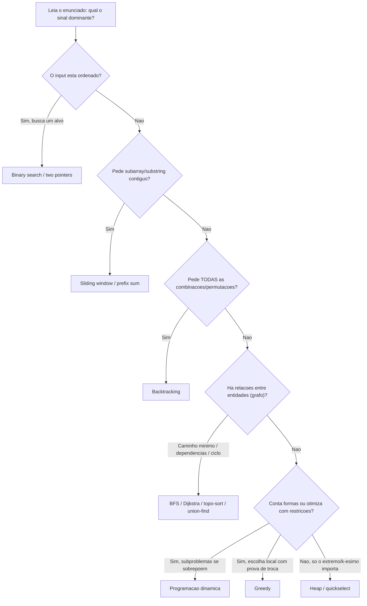
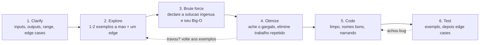
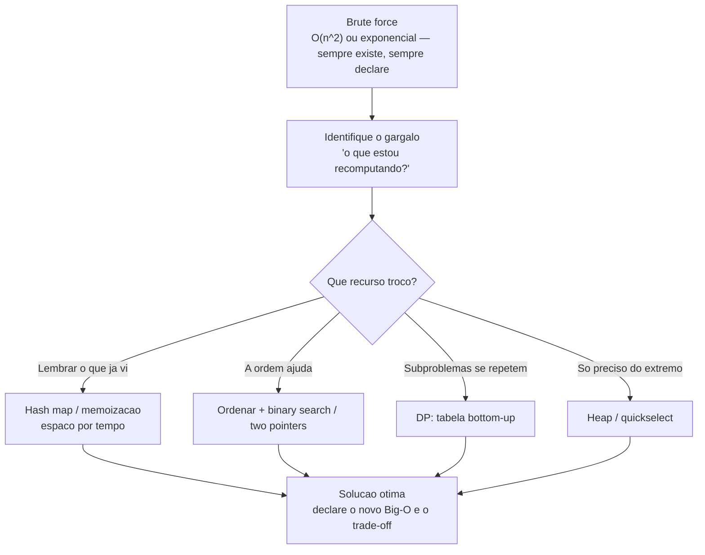

# Reconhecendo o algoritmo certo

Um bom médico de pronto-socorro não decora todas as doenças do mundo. Ele aprende a reconhecer **síndromes**: o paciente chega com dor no peito que irradia para o braço esquerdo, sudorese e falta de ar, e antes de qualquer exame o médico já pensa "infarto" e dispara o protocolo. Os sintomas viraram um padrão, e o padrão aponta a conduta.

Numa coding interview é a mesma coisa, e ninguém te conta. O segredo não é saber implementar quicksort de cabeça nem recitar a prova do Teorema Mestre. O segredo é **reconhecer**: ler o enunciado, captar os sinais — "array ordenado", "todas as combinações", "subarray contíguo", "k-ésimo maior" — e mapeá-los para a família de técnica que aquele tipo de problema pede. O enunciado é o conjunto de sintomas. A técnica é o diagnóstico.

Esta é a nota-capstone do galho. As treze notas anteriores te deram o ferramental — Big-O, recursão, recorrências, ordenação, busca, dois ponteiros, divisão e conquista, DP, greedy, backtracking, grafos, intratabilidade. Esta nota não ensina técnica nova. Ela ensina a **escolher** entre elas sob pressão, com um entrevistador olhando, em inglês, no relógio. É o mapa que liga todos os pinos.

> [!abstract] TL;DR
> O que separa um senior numa entrevista não é memorizar soluções — é **reconhecer o padrão** que o enunciado pede, **analisar o trade-off** e **comunicar o raciocínio**. Retomando as quatro dimensões avaliadas de [[01 - O que é um algoritmo]] (resolver, codar bem, comunicar, achar edge cases): resolver começa em reconhecer. Três ferramentas fazem o trabalho pesado: (1) a **tabela de reconhecimento** "sinal no enunciado → técnica", que mapeia cada gatilho à nota do galho; (2) o **framework de 6 passos** — *clarify → explore com exemplos → brute force → otimize → code → test* — que estrutura qualquer problema, mesmo um que você nunca viu; (3) o **funil brute-force → otimização**, que mostra raciocínio mesmo quando você não acha a solução ótima de cara. Decorar não escala (há milhares de problemas); reconhecer padrões escala (há ~15 padrões). E numa entrevista internacional, **narrar em inglês** vale tanto quanto a solução: quem comunica errando bate quem acerta em silêncio.

## A tese: reconhecimento vence memorização

Volte à nota de abertura. Em [[01 - O que é um algoritmo]] estabelecemos que, numa entrevista, você é avaliado em **quatro dimensões**: a capacidade de **resolver** o problema, de **codar bem** a solução, de **comunicar** o raciocínio e de **achar os edge cases**. Aquela nota plantou a semente; esta colhe.

Repare na ordem em que essas dimensões se ativam. Antes de codar bem, você precisa resolver. E resolver não começa escrevendo código — começa **reconhecendo**. Diante de "encontre dois números que somam X num array", o senior não fica olhando para a tela em branco; ele pensa "soma de par → hash map ou two pointers" em segundos, e o resto da entrevista é executar. O júnior que decorou a solução de *Two Sum* fica perdido quando o problema vira *Three Sum*, porque memorizou o caso, não o padrão.

Esta é a tese central do capstone, e ela tem três pernas:

- **Reconhecer** o padrão. O enunciado tem sinais. "Ordenado" grita binary search ou two pointers. "Todas as combinações" grita backtracking. "Subarray contíguo" grita sliding window. Reconhecer é mapear sintoma → síndrome, e é a habilidade mais treinável que existe.
- **Analisar o trade-off.** Reconhecido o padrão, há quase sempre mais de uma abordagem. A escolha é uma conversa sobre custo: *este* hash map troca espaço O(n) por tempo O(n); *aquele* two pointers é O(1) de espaço mas exige array ordenado. Trade-off é o vocabulário do senior — voltaremos a ele em inglês.
- **Comunicar** o raciocínio. A dimensão que mais surpreende, como dito na nota 01. O entrevistador não está dentro da sua cabeça. Se você resolve em silêncio e erra um detalhe, ele vê só o erro. Se você narra — "estou pensando em hash, porque preciso de lookup O(1)" — ele vê o raciocínio, e raciocínio correto com bug pequeno bate solução muda com bug grande.

Por que reconhecimento escala e memorização não? Aritmética simples. Há **milhares** de problemas catalogados (o LeetCode passa de 3000). É impossível decorar todos, e o entrevistador pode sempre inventar um novo. Mas há **cerca de quinze padrões** que cobrem a esmagadora maioria deles. Decorar quinze padrões e aprender a reconhecê-los é tratável. Decorar três mil soluções é o caminho da ansiedade.

> [!example] A lição que aprendi na prática
> Em coding interviews, o que mais me ajudou foi **praticar os patterns** (o roadmap do NeetCode 150) até reconhecer rápido o tipo de problema. **Decorar soluções não funciona; reconhecer padrões funciona.** Quando você já viu vinte problemas de sliding window, o vigésimo primeiro se anuncia sozinho na primeira leitura do enunciado — e aí a entrevista deixa de ser um teste de memória e vira o que deveria ser: uma conversa de engenharia.

## A tabela de reconhecimento de padrões

Este é o coração da nota — a tabela que você revisa na véspera. Cada linha é um **sinal no enunciado** (ou na estrutura do problema) e a **técnica** que ele tipicamente convoca, com link para a nota do galho que ensina a técnica. Treine lendo da esquerda para a direita: veja o sinal, diga a técnica em voz alta, antes de olhar a coluna.

| Sinal no enunciado | Técnica provável | Por que / complexidade | Nota |
| --- | --- | --- | --- |
| Array/lista **ordenada**; "find target" | **Binary search** ou **two pointers** | Ordem permite descartar metade a cada passo, O(log n); ou varrer das pontas, O(n) e O(1) espaço | [[08 - Busca]], [[09 - Two pointers e sliding window]] |
| "Todas as **combinações** / **permutações** / **subsets**"; "gere todos os..." | **Backtracking** | Explorar e desfazer a árvore de decisões; exponencial por natureza, mas com **poda** | [[12 - Backtracking]] |
| "**Subarray** / **substring** contíguo"; "janela", "consecutivos" | **Sliding window** (+ **prefix sum**) | Janela move-se sem recomputar tudo, O(n); prefix sum responde soma de range em O(1) | [[09 - Two pointers e sliding window]] |
| "**Par** / triplet com **soma** X"; "dois elementos tais que..." | **Hash map** ou **two pointers** (se ordenado) | Hash troca espaço O(n) por lookup O(1); two pointers é O(1) de espaço mas exige ordenar antes | [[09 - Two pointers e sliding window]] |
| "**k-ésimo** maior/menor"; "top-k"; "k mais frequentes" | **Heap** (de tamanho k) ou **quickselect** | Heap-k é O(n log k); quickselect é O(n) médio sem ordenar tudo | [[08 - Busca]] (quickselect) + heap em [[03-Dominios/Ciência/Estruturas de Dados/index\|Estruturas de Dados]] |
| "**Menor caminho**" em grafo **não-ponderado** | **BFS** | Camada a camada garante o caminho mínimo em arestas, O(V+E) | [[11 - Grafos - travessia e algoritmos]] |
| "Menor caminho" **com pesos** (não-negativos) | **Dijkstra** | Heap de fronteira expande sempre o mais barato, O(E log V) | [[11 - Grafos - travessia e algoritmos]] |
| "Ordem de execução com **dependências**"; "pré-requisitos"; "build order" | **Topological sort** | Ordena um DAG; detecta ciclo (= impossível) de quebra, O(V+E) | [[11 - Grafos - travessia e algoritmos]] |
| "**Número de caminhos/formas**"; "máximo/mínimo **com restrições**"; "pode/não pode chegar a..." | **Programação dinâmica** | Subproblemas que se sobrepõem; defina o **estado** e a transição | [[10 - Programação dinâmica]] |
| "Escolha **localmente ótima** parece levar à global"; "maximize / minimize com regra simples" | **Greedy** | Decisão imediata sem voltar atrás — **se** houver argumento de troca que prove a otimalidade | [[11 - Greedy]] |
| "**Intervalos** sobrepostos"; "merge ranges"; "salas de reunião" | **Sort + sweep line** | Ordene por início/fim e varra mantendo estado, O(n log n) dominado pelo sort | [[07 - Ordenação]] |
| "Encontrar **ciclo**" (lista ligada ou grafo) | **Fast/slow pointers**, **DFS** (cores), **union-find** | Floyd O(1) espaço em listas; DFS detecta back-edge; union-find junta componentes | [[09 - Two pointers e sliding window]], [[11 - Grafos - travessia e algoritmos]] |
| "**Menor/maior X** tal que P(X) é **monotônico**" ("mínima capacidade...", "menor velocidade...") | **Binary search no espaço de respostas** | Se "X funciona ⇒ X+1 funciona", busque binário no valor, não no índice | [[08 - Busca]] |
| "**Divida e combine**"; subproblemas **independentes** (sem sobreposição) | **Divisão e conquista** | Quebra recursiva + merge; recorrência resolvida pelo Teorema Mestre | [[06 - Divisão e conquista]] |
| "Já vi este array ordenado mas **rotacionado**"; "matriz ordenada" | **Binary search** (variante) | A monotonicidade local ainda permite descartar metade | [[08 - Busca]] |
| "**Sequência** com escolha em cada passo e ótimo no fim" (LIS, edição, knapsack) | **DP** (1D/2D) | Quase sempre DP quando greedy não tem prova de troca | [[10 - Programação dinâmica]] |

> [!tip] Como ler a tabela na prática
> Os sinais não são exclusivos — vários problemas casam com duas linhas. "Par com soma X" pode ser hash *ou* two pointers; a desempate vem do trade-off (o array está ordenado? pode-se gastar O(n) de espaço?). E há o caminho do **contraexemplo**: se você cogitou greedy mas consegue construir uma entrada onde a escolha gulosa erra, é sinal de que o problema é DP. Reconhecer não é casar a primeira linha — é gerar candidatos e podar com análise.

### Árvore de decisão: do sinal à técnica

A tabela é exaustiva; a árvore abaixo é o atalho mental para os casos mais frequentes. Você entra com a pergunta-chave do problema e desce até uma técnica. Não é dogma — é o primeiro palpite, o que você verbaliza antes de refinar com trade-offs.

> **Leitura do diagrama:** a primeira bifurcação é quase sempre *ordenado vs. não*, porque ordem é o sinal mais barato de explorar (binary search é o primeiro lugar onde a complexidade desaba para O(log n)). Não estando ordenado, a pergunta vira "o que o problema pede": fatia contígua → janela; *todas* as configurações → backtracking; relação entre coisas → grafo. O ramo final separa as três grandes famílias de otimização: DP (subproblemas que se repetem), greedy (decisão local com prova) e heap (só o extremo importa). Repare que binary search e sliding window ficam nos caminhos curtos — são os destinos mais frequentes, por design.

## O framework de 6 passos

Reconhecer o padrão te dá o destino. O framework te dá o **caminho** — o protocolo que você roda em *qualquer* problema, inclusive um que não casou com nenhuma linha da tabela. É a estrutura que transforma pânico em processo. Decore esta sequência como um piloto decora o checklist de pré-voo: clarify, explore, brute force, otimize, code, test.

> **Leitura do diagrama:** o fluxo principal é linear, mas as setas pontilhadas contam a verdade: o processo **itera**. Achou um bug no teste? Volte ao código. Travou na otimização? Volte aos exemplos à mão — quase sempre o insight ótimo aparece quando você observa o que o brute force recomputa. Note que **codar é o passo 5**, não o 1. Júnior abre a IDE e começa a digitar; senior gasta os primeiros minutos clarificando e explorando, e quando finalmente coda, já sabe exatamente o quê.

### 1. Clarify — pergunte antes de assumir

Nunca comece a resolver o problema que você *acha* que foi dado. Confirme inputs, outputs, range e edge cases com perguntas. Isso não te faz parecer inseguro — faz parecer senior, porque é exatamente o que se faz com um ticket vago no trabalho. Perguntas de ouro: *Pode haver números negativos? E zero?* *Há duplicatas?* *O array pode estar vazio?* *Qual o tamanho máximo da entrada?* (esta determina a complexidade-alvo: n ≤ 20 cheira a backtracking/exponencial; n ≤ 10⁵ exige O(n log n) ou melhor; n ≤ 10⁹ força O(log n) ou matemática direta). *A entrada cabe num int ou preciso de long?* Cada pergunta dessas é um edge case que você não vai esquecer depois.

### 2. Explore com exemplos

Pegue um exemplo pequeno e resolva **à mão**, na lousa ou no papel, narrando. Faça dois: um caso típico e um **edge case** (vazio, um elemento, todos iguais). Este passo parece bobo e é o mais subestimado. Resolver à mão revela a estrutura do problema: você *vê* o trabalho que se repete (gatilho para DP ou hash), *vê* a ordem natural (gatilho para sort), *vê* a janela deslizando. Muitas vezes a solução inteira nasce aqui, antes de qualquer Big-O.

### 3. Brute force primeiro

Declare a solução ingênua e sua complexidade — em voz alta, sem implementar ainda. "A força bruta é testar todos os pares, O(n²)." Isto faz três coisas: prova que você entendeu o problema, estabelece um **baseline** contra o qual a otimização vai brilhar, e te dá uma solução de segurança caso o tempo acabe (uma resposta O(n²) correta vale mais que uma O(n) que não compila). A análise de complexidade aqui é a da nota [[02 - Análise de complexidade - Big-O]] — você precisa saber dizer o Big-O do brute force tão naturalmente quanto respira.

### 4. Otimize

Aqui mora o salto. Olhe o brute force e pergunte: **onde está o trabalho repetido?** O gargalo quase sempre é recomputação. Os dois loops aninhados do brute force de "soma de par" recomputam o complemento toda vez — um **hash map** lembra o que já viu e mata o loop interno, levando O(n²) a O(n). A busca linear num array que vai ser consultado mil vezes — **ordene uma vez** e use binary search. A recursão que recalcula `fib(n-2)` repetidamente — **memoize** (gatilho de DP). Otimizar é trocar tempo por espaço, ou pré-processar para baratear consultas. Sempre compare as complexidades antes/depois em voz alta: "saímos de O(n²) tempo / O(1) espaço para O(n) tempo / O(n) espaço — vale a pena para n grande".

### 5. Code

Só agora a IDE. Código limpo, nomes que dizem o que a variável é (`seen`, `left`, `right`, `maxLen`, não `i2`, `temp`, `x`), funções auxiliares quando ajuda. E **narre** enquanto digita: "agora itero o array, e para cada elemento checo se o complemento já está no `seen`". O entrevistador está avaliando se ele gostaria de revisar seu PR — escreva como se fosse para produção, não para o lixo.

### 6. Test

Não espere o entrevistador achar o bug. Percorra o código com o exemplo do passo 2, linha a linha, como um depurador humano. Depois jogue os **edge cases**: vazio, um elemento, todos iguais, o maior valor possível. Encontrar e corrigir seu próprio bug na frente do entrevistador é uma das coisas mais positivas que você pode demonstrar — mostra rigor, a quarta dimensão da nota [[01 - O que é um algoritmo]].

## O funil: brute-force → otimização

O framework merece um zoom no seu eixo central, porque é o que salva a entrevista quando você **não** acha a solução ótima de imediato. A regra de ouro: *uma solução é melhor que nenhuma, e uma solução comunicada é melhor que uma solução muda.* Você desce o funil, e a cada nível mostra mais maturidade.

> **Leitura do diagrama:** o topo é sempre o mesmo — todo problema tem uma força bruta, e declará-la é grátis. O nó decisivo é "o que estou recomputando?", porque otimização **é** eliminar recomputação. Os quatro ramos do meio são os quatro grandes movimentos de otimização: lembrar (hash/memo), explorar a ordem (sort + busca), tabular subproblemas (DP) e isolar o extremo (heap). Todos desembocam no mesmo lugar: a solução ótima, anunciada com seu Big-O e o trade-off que ela paga. O caminho do funil **é** a sua narração — diga cada nó em voz alta e você terá comunicado raciocínio do início ao fim, mesmo que trave antes do final.

## Edge cases que mais escapam

Correção inclui edge cases — foi a primeira propriedade fixada em [[01 - O que é um algoritmo]]. A diferença entre "quase certo" e "certo" é justamente a borda. Esta é a checklist que você roda no passo 6 (e, idealmente, já antecipa no passo 1):

- **Coleção vazia.** Array de tamanho 0, string `""`, lista nula. Seu loop roda zero vezes — o retorno faz sentido?
- **Um único elemento.** Two pointers com `left == right`, recursão que nunca entra no caso recursivo.
- **Todos os elementos iguais.** Quebra quickselect ingênuo, infla janelas, esconde bugs de comparação.
- **Já ordenado / em ordem reversa.** O pior caso do quicksort com pivô ruim; o melhor (ou pior) de muitos algoritmos.
- **Negativos e zeros.** Prefix sum com soma alvo zero, divisão por zero, `x % n` com `x` negativo (em algumas linguagens dá negativo).
- **Overflow.** O clássico: `(lo + hi) / 2` na busca binária estoura quando os índices são grandes — use `lo + (hi - lo) / 2`. Soma de inteiros grandes pede `long` (Java/Go), e em Python o int é arbitrário mas você ainda declara que pensou nisso. Em casos extremos, `BigInteger`.
- **Caracteres não-ASCII / Unicode.** "Reverter string" caractere a caractere quebra com emojis e acentos (code points vs. bytes). Mapas de frequência que assumem 26 letras minúsculas falham com maiúsculas ou Unicode.
- **Grafo desconectado.** Sua BFS/DFS partindo de um nó não visita os outros componentes — precisa iterar sobre todos os nós não visitados.
- **Ciclos.** Sem o conjunto `visited`, a travessia entra em loop infinito. Em listas ligadas, o ciclo trava o fast/slow se mal implementado.
- **Recursão profunda.** Entrada grande estoura a call stack — é o **stack overflow** discutido em [[04 - Recursão]]. Se a profundidade pode chegar a 10⁵, converta para iterativo (pilha explícita) ou garanta tail call onde a linguagem otimiza.

## Armadilhas comuns

Cada armadilha vem com a lição. São os erros que afundam candidatos competentes:

- **Otimizar antes de resolver.** Você gasta dez minutos buscando a solução O(n) elegante e fica sem nada. *Lição: declare o brute force primeiro; ele é o seu paraquedas.*
- **Esquecer edge cases.** A solução funciona no exemplo e quebra no vazio. *Lição: rode a checklist da seção anterior antes de dizer "pronto".*
- **Não comunicar.** A pior de todas. Você resolve em silêncio, erra um detalhe, e o entrevistador só vê o erro. *Lição: narre sempre; raciocínio visível com bug pequeno bate solução muda.*
- **Confundir BFS e DFS.** Usar DFS para menor caminho não-ponderado (não garante o mínimo) ou BFS recursivo. *Lição: BFS = fila, camada a camada, menor caminho; DFS = pilha/recursão, explora fundo, detecta ciclo.* (Detalhe em [[11 - Grafos - travessia e algoritmos]].)
- **Dizer "uso DP" sem definir o estado.** DP não é uma palavra mágica — é uma definição precisa de **estado** e **transição**. *Lição: antes de codar DP, diga em uma frase "dp[i] representa ___" e "a transição é ___".* (Veja [[10 - Programação dinâmica]].)
- **Greedy sem prova.** Assumir que a escolha gulosa é ótima sem argumento. *Lição: ou você tem um exchange argument, ou você testa um contraexemplo; se acha contraexemplo, é DP.* (Veja [[11 - Greedy]].)
- **Off-by-one na busca binária.** `lo <= hi` vs. `lo < hi`, `mid` vs. `mid+1`, o loop que nunca termina. *Lição: fixe um template de binary search e nunca o reinvente sob pressão.* (Veja [[08 - Busca]].)
- **Overflow no mid.** Já citado, mas vale repetir porque é o erro mais famoso da computação: `lo + (hi - lo) / 2`.
- **Modificar a coleção enquanto itera.** Remover de uma lista dentro do `for` sobre ela — `ConcurrentModificationException` em Java, comportamento indefinido em outras. *Lição: itere sobre uma cópia, use iterador explícito, ou colete e remova depois.*
- **Recursão profunda sem plano B.** Solução recursiva linda que estoura a stack na entrada grande. *Lição: estime a profundidade no passo 1; se for grande, vá iterativo.* (Veja [[04 - Recursão]].)

## Em entrevista

Esta nota é, no fundo, *sobre* a entrevista — então a seção bilíngue não é apêndice, é o palco. Numa entrevista internacional você precisa fazer tudo o que vimos **em inglês, fluentemente**, sob o relógio. Reconhecer o padrão em português e travar na hora de explicar em inglês é desperdiçar a preparação inteira. Treine o roteiro abaixo até ele sair natural.

### How to explain in English — o roteiro narrado

Leia este parágrafo em voz alta. Ele percorre o framework inteiro em primeira pessoa, na ordem em que você falaria numa entrevista de verdade. Decore o **esqueleto**, não as palavras exatas:

> "Okay, let me make sure I understand the problem before I jump in. So I'm given an array of integers, and I need to return the indices of the two numbers that add up to a target — is that right? A couple of quick questions: can the array be empty, and are there negative numbers or duplicates? Great. Let me work through a small example by hand: for `[2, 7, 11]` and target `9`, the answer is indices `0` and `1`. Let me also consider the edge case of an empty array — I'd return an empty result there. My first, brute-force idea is to check every pair with two nested loops, which is O(n²) time and O(1) space. That works, but I think I can do better. The bottleneck is that I'm recomputing the complement every time, so let me trade space for time: I'll use a hash map to remember the numbers I've already seen. As I iterate once, for each number I check whether its complement is already in the map — that brings it down to O(n) time and O(n) space. Let me code that up cleanly, and I'll talk through it as I go... Now let me trace it with my example to make sure it's correct, and then run the edge cases — empty array, and a case with duplicates. Looks good. Does that approach make sense to you, or would you like me to handle any other constraints?"

São ~190 palavras que cobrem clarify → exemplo → edge → brute force → bottleneck → otimização → trade-off → code → test → check com o entrevistador. É o capstone do galho inteiro num único monólogo.

### Frases prontas por etapa

Tenha estas na ponta da língua. Elas compram tempo para pensar e sinalizam senioridade.

**Clarifying:**
- "Before I start, let me clarify a few things about the inputs."
- "Can I assume the input is sorted / non-empty / fits in a 32-bit integer?"
- "Should I optimize for time or for space here?"
- "What's the expected size of the input?" *(decide a complexidade-alvo)*

**Exploring:**
- "Let me walk through a small example to build intuition."
- "Let me also consider an edge case: what if the array is empty?"

**Brute force:**
- "The naive approach would be to check all pairs, which is O(n²)."
- "Let me start with a brute-force solution and then optimize."
- "That's correct but inefficient — let me see if I can do better."

**Optimizing:**
- "The bottleneck here is the repeated work in the inner loop."
- "I can trade space for time by using a hash map."
- "If I sort the array first, I can use two pointers and drop to O(1) extra space."
- "This brings the time complexity down from O(n²) to O(n)."

**Coding:**
- "Let me code this up — I'll talk through it as I go."
- "I'll use a helper function to keep this readable."

**Testing:**
- "Let me trace through my example to verify correctness."
- "Now let me run the edge cases: empty input, a single element, and duplicates."
- "I think there's a bug here on the boundary — let me fix that."

**Trade-offs e fechamento:**
- "There's a trade-off: this version uses more memory but is faster."
- "It depends on the access pattern / the constraints."
- "Given the constraints, I'd go with the hash-map approach."
- "Does this approach make sense, or should I consider other constraints?"

### Vocabulário PT → EN (glossário do galho)

Reunindo o vocabulário técnico de todas as notas do galho — o dicionário que você usa para narrar sem hesitar.

| Português | English |
| --- | --- |
| complexidade de tempo / espaço | time / space complexity |
| pior / melhor / caso médio | worst / best / average case |
| custo amortizado | amortized cost |
| recorrência | recurrence relation |
| força bruta | brute force |
| solução ingênua | naive solution |
| gargalo | bottleneck |
| trabalho repetido / recomputação | repeated work / recomputation |
| trade-off (espaço por tempo) | trade-off (space for time) |
| busca binária | binary search |
| busca no espaço de respostas | binary search on the answer |
| dois ponteiros | two pointers |
| ponteiros convergentes | converging pointers |
| janela deslizante (fixa / variável) | sliding window (fixed / variable) |
| ponteiro rápido / lento | fast / slow pointer |
| soma de prefixo | prefix sum |
| divisão e conquista | divide and conquer |
| programação dinâmica | dynamic programming |
| memoização (top-down) | memoization (top-down) |
| tabulação (bottom-up) | tabulation (bottom-up) |
| subestrutura ótima | optimal substructure |
| subproblemas sobrepostos | overlapping subproblems |
| estado / transição (em DP) | state / transition |
| guloso | greedy |
| escolha localmente ótima | locally optimal choice |
| argumento de troca | exchange argument |
| retrocesso | backtracking |
| poda | pruning |
| ordenação estável / in-place | stable / in-place sort |
| pivô | pivot |
| seleção rápida | quickselect |
| varredura linear (sweep) | sweep line |
| intervalos sobrepostos | overlapping intervals |
| fila de prioridade / heap | priority queue / heap |
| amontoado mínimo / máximo | min-heap / max-heap |
| tabela hash | hash map / hash table |
| busca em largura | breadth-first search (BFS) |
| busca em profundidade | depth-first search (DFS) |
| menor caminho | shortest path |
| ordenação topológica | topological sort |
| grafo direcionado acíclico | directed acyclic graph (DAG) |
| conjunto-união / union-find | disjoint set union / union-find |
| aresta de retorno | back edge |
| transbordamento (overflow) | integer overflow |
| erro de um a mais/menos | off-by-one error |
| estouro de pilha | stack overflow |
| caso base / caso recursivo | base case / recursive case |
| chamada de cauda | tail call |
| invariante | invariant |
| limite inferior | lower bound |
| intratável / NP-difícil | intractable / NP-hard |
| aproximação / heurística | approximation / heuristic |
| caso de borda | edge case |
| percorrer (o código) | trace through / step through |

## Cheat-sheet final

A cola de última hora. Uma linha por técnica: o que ela custa, quando ela aparece, e onde estudar. Leia isto no metrô a caminho da entrevista.

| Técnica | Complexidade típica | Quando usar (sinal) | Nota |
| --- | --- | --- | --- |
| Busca binária | O(log n) | input ordenado; "menor X com P(X) monotônico" | [[08 - Busca]] |
| Two pointers | O(n), O(1) espaço | array ordenado; par/triplet com soma; palíndromo | [[09 - Two pointers e sliding window]] |
| Sliding window | O(n) | subarray/substring contíguo; janela fixa ou variável | [[09 - Two pointers e sliding window]] |
| Prefix sum | O(n) pré, O(1) query | somas de range repetidas; subarray com soma alvo | [[09 - Two pointers e sliding window]] |
| Hash map | O(n) tempo / O(n) espaço | lookup O(1); par com soma; contar/dedup | [[03-Dominios/Ciência/Estruturas de Dados/index\|Estruturas de Dados]] |
| Heap / priority queue | O(n log k) | top-k, k-ésimo maior, merge de k listas, scheduling | [[03-Dominios/Ciência/Estruturas de Dados/index\|Estruturas de Dados]] |
| Quickselect | O(n) médio | k-ésimo elemento sem ordenar tudo | [[08 - Busca]] |
| Divisão e conquista | O(n log n) típico | subproblemas independentes; merge sort, closest pair | [[06 - Divisão e conquista]] |
| Ordenação | O(n log n) | pré-passo p/ greedy, two pointers, sweep line | [[07 - Ordenação]] |
| Sweep line | O(n log n) | intervalos sobrepostos, merge de ranges | [[07 - Ordenação]] |
| BFS | O(V+E) | menor caminho não-ponderado; travessia por camadas | [[11 - Grafos - travessia e algoritmos]] |
| DFS | O(V+E) | conectividade, detecção de ciclo, componentes | [[11 - Grafos - travessia e algoritmos]] |
| Dijkstra | O(E log V) | menor caminho com pesos não-negativos | [[11 - Grafos - travessia e algoritmos]] |
| Topological sort | O(V+E) | ordem com dependências num DAG | [[11 - Grafos - travessia e algoritmos]] |
| Union-find | ~O(α(n)) por op | componentes conexos, detecção de ciclo, agrupar | [[11 - Grafos - travessia e algoritmos]] |
| Programação dinâmica | O(estados × transição) | contar formas, otimizar com restrições, subproblemas repetidos | [[10 - Programação dinâmica]] |
| Greedy | O(n log n) (com sort) | escolha local ótima *com prova de troca* | [[11 - Greedy]] |
| Backtracking | exponencial (com poda) | todas as combinações/permutações/subsets | [[12 - Backtracking]] |

## Recursos para continuar

Migrados do material de estudo do galho — todos reais e recomendados.

- **Cursos.** *Algorithms, Part I & II* (Robert Sedgewick & Kevin Wayne, Princeton, no Coursera) — fundamentos rigorosos com implementações em Java. *MIT 6.006 Introduction to Algorithms* (OpenCourseWare) — as aulas em vídeo cobrem a teoria com profundidade.
- **Livros.** Sedgewick & Wayne, *Algorithms* (4ª ed.) — o companheiro dos cursos de Princeton. *CLRS* (Cormen, Leiserson, Rivest, Stein, *Introduction to Algorithms*) — a referência de fundo, para quando você quer a prova. *Cracking the Coding Interview* (Gayle Laakmann McDowell) — o clássico de preparação, com o framework de entrevista. *Elements of Programming Interviews* (Aziz, Lee & Prakash) — problemas mais difíceis, ótimo para o nível senior.
- **Prática.** **NeetCode 150** — roadmap organizado *por padrão*, exatamente o que esta nota prega; o recurso recomendado para internalizar reconhecimento. **LeetCode** — o catálogo amplo. **Codeforces** — programação competitiva, opcional e mais agressivo do que a maioria das entrevistas exige.

> [!info] Lastro
> Esta nota sintetiza, para o contexto de entrevista, as fontes canônicas do galho:
> - **Gayle Laakmann McDowell — *Cracking the Coding Interview*.** O framework de entrevista (clarify, exemplos, brute-force-then-optimize, código limpo, teste) e a ênfase em comunicação derivam diretamente deste livro.
> - **Aziz, Lee & Prakash — *Elements of Programming Interviews*.** A organização por padrões de problema e o nível de dificuldade adequado a candidatos seniores.
> - **NeetCode 150 (roadmap por padrão).** Recurso de prática recomendado para treinar reconhecimento de padrões — a abordagem central desta nota.
> - **Cormen, Leiserson, Rivest & Stein — *Introduction to Algorithms* (CLRS).** Referência de fundo para a fundamentação de complexidade e correção das técnicas citadas.

## Veja também

- Anterior no galho: [[13 - Intratabilidade]] — quando não existe algoritmo eficiente (e o que fazer então).
- Abertura do galho (fecha o ciclo): [[01 - O que é um algoritmo]] — as quatro dimensões avaliadas em entrevista, plantadas lá, colhidas aqui.
- MOC do galho: [[03-Dominios/Ciência/Algoritmos/index|Algoritmos]]
- Galho irmão: [[03-Dominios/Ciência/Estruturas de Dados/index|Estruturas de Dados]] — as estruturas sobre as quais os algoritmos operam; o capstone de lá é [[13 - Escolhendo a estrutura certa]], gêmeo desta nota para o lado das estruturas.
