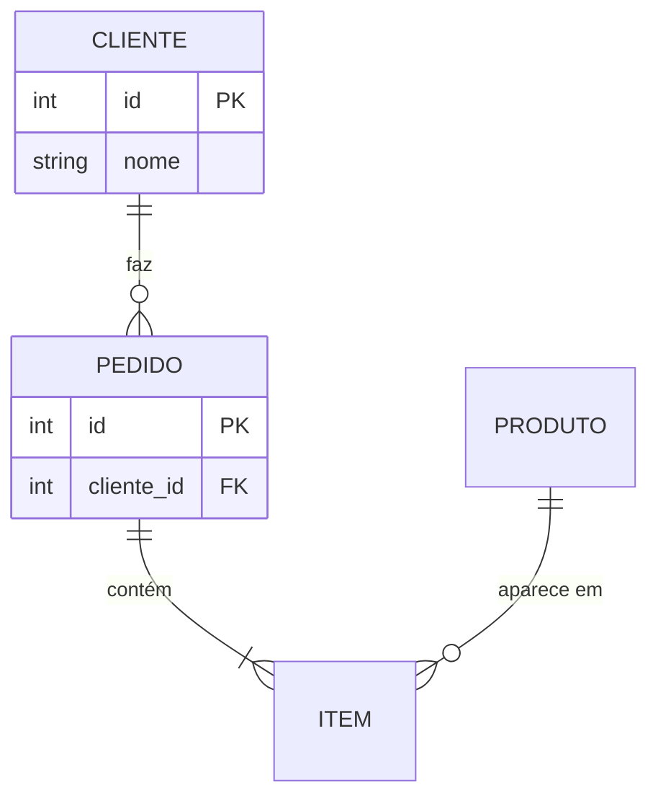

# O que é um banco de dados

> [!abstract] Resumo em uma linha
> Um banco de dados é um sistema que guarda dados de forma **durável** e te dá uma linguagem **declarativa** (SQL) para perguntar O QUE você quer sem dizer COMO buscar — e, num sistema sério, é a **fonte da verdade**: onde vivem as garantias de consistência, os maiores ganhos de performance e os bugs mais caros.

Imagine que você fechou o notebook. Desligou. A energia caiu. Quando liga de novo, o que sobrou?

Tudo que estava só na memória RAM se foi. O que ficou foi o que estava **escrito em disco**. Essa diferença — entre o que evapora e o que persiste — é o ponto de partida para entender o que um banco de dados realmente é.

Para um dev senior, o banco quase nunca é "só onde a gente salva as coisas". É o **coração do sistema**. Quando ele está saudável, ninguém repara. Quando ele engasga, o sistema inteiro engasga junto. Esta nota é a âncora do galho: o mapa de tudo que vem depois.

---

## Persistência: o que sobrevive ao desligar

Todo programa trabalha com dados na **memória volátil** (RAM). É rápida, é onde as variáveis vivem — e é **efêmera**. Corte a energia e ela esquece tudo.

Persistência é a propriedade oposta: o dado continua existindo depois que o processo morre. Para persistir, alguém precisa **escrever em mídia durável** (disco, SSD) e garantir que aquilo de fato chegou lá.

Por que isso não é trivial? Porque o caminho até o disco está cheio de buffers que mentem "já gravei" antes de gravar de verdade. Um banco de dados sério leva isso a sério: ele só te diz "feito" (commit) quando tem certeza de que o dado sobrevive a uma queda de energia. Essa garantia tem um nome — **durabilidade** — e é a letra **D** de ACID (tratado em [[05 - Transações e ACID]]).

> [!question] Mas eu não poderia só salvar tudo num arquivo?
> Poderia. Por uns dias. Aí aparecem duas pessoas escrevendo no mesmo arquivo ao mesmo tempo (corrompe), você quer "todos os pedidos do cliente 42 do mês passado" (varre o arquivo inteiro à mão), o processo cai no meio de uma gravação (metade do dado salvo), e você quer garantir que nenhum pedido fica sem cliente (ninguém valida nada). Um banco de dados é, em grande parte, a resposta acumulada de 50 anos para esses problemas que um arquivo cru não resolve.

Vamos ver o lugar do banco na vida de um dado. A frase que prepara: o dado nasce na memória da aplicação e só "existe de verdade" depois que cruza a fronteira do disco.

```mermaid
flowchart LR
    A["Memória &#40;RAM&#41;<br/>volátil, rápida"] -->|"escrita"| B["Banco de dados<br/>processo + cache"]
    B -->|"commit confirmado"| C["Disco / SSD<br/>durável"]
    C -.->|"crash + restart:<br/>recupera daqui"| B
    A -.->|"crash: perde tudo"| X["nada"]
```



Leitura do diagrama: o que estava só na RAM evapora num crash. O que o banco confirmou em disco volta intacto depois do restart — e é exatamente essa volta segura que o banco existe para garantir.

---

## SGBD: a máquina por trás do "banco"

No dia a dia, dizemos "o banco" para nos referir tanto aos dados quanto ao software que os gerencia. O nome técnico desse software é **SGBD** (Sistema de Gerenciamento de Banco de Dados; em inglês, **DBMS**). PostgreSQL, MySQL, SQLite, Oracle — todos são SGBDs.

O que um SGBD faz por dentro? Pense nele como uma pequena empresa com vários departamentos, cada um com uma função. Numa visão de alto nível (o detalhe de cada peça vem nas notas seguintes):

- **Query processor** — recebe seu SQL e transforma em ação. Tem três fases:
  - **Parser** — lê o texto do SQL, confere a gramática, vira uma árvore. ("Isso é um SELECT válido?")
  - **Planner / optimizer** — decide COMO executar. Há muitos jeitos de buscar a mesma coisa; ele escolhe o mais barato usando estatísticas e índices. ("Uso o índice ou varro a tabela?")
  - **Executor** — roda o plano escolhido e devolve as linhas.
- **Storage engine** — cuida de onde os bytes ficam: páginas em disco, o **buffer pool** (cache em memória das páginas quentes), e os métodos de acesso (B-Tree, por exemplo — ver [[07 - Índices]]).
- **Controle de transação** — garante o "tudo ou nada" e que o banco nunca fica num estado quebrado.
- **Controle de concorrência** — deixa muita gente ler e escrever ao mesmo tempo sem pisar no pé um do outro (no PostgreSQL, via MVCC — ver [[05 - Transações e ACID]]).
- **Recovery** — depois de um crash, reconstrói o estado consistente a partir do **WAL** (Write-Ahead Log): o registro do que ia acontecer, escrito *antes* de acontecer.

A frase que prepara o próximo diagrama: vamos seguir uma query do clique do cliente até o disco e de volta.

```mermaid
flowchart TD
    Cli["Cliente<br/>&#40;app, psql&#41;"] -->|"SQL"| P["Parser<br/>gramática → árvore"]
    P --> PL["Planner / Optimizer<br/>escolhe o plano mais barato"]
    PL --> EX["Executor<br/>roda o plano"]
    EX <--> SE["Storage Engine<br/>buffer pool + páginas"]
    SE <--> D["Disco / SSD"]
    EX <--> TX["Controle de transação<br/>+ concorrência"]
    TX <--> WAL["WAL<br/>durabilidade & recovery"]
    WAL --> D
    EX -->|"linhas"| Cli
```



Leitura do diagrama: seu SQL não vai "direto ao dado". Ele é entendido (parser), planejado (planner), executado (executor) e, ao tocar dados, passa pelo storage engine e pelo controle de transação. O WAL é o caderninho que torna o commit durável e o crash recuperável. Cada uma dessas caixas vira uma nota deste galho.

> [!note] Por que isso cai em entrevista
> Quando o entrevistador pergunta "por que essa query está lenta?", ele está testando se você sabe que existe um **planner** com **estatísticas** decidindo o plano — e que você pode inspecionar essa decisão com `EXPLAIN` (ver [[08 - EXPLAIN e otimização]]). Quem acha que SQL "vai direto ao dado" otimiza no escuro.

---

## O modelo relacional: o mapa dominante

Em 1970, **Edgar F. Codd**, na IBM, publicou *A Relational Model of Data for Large Shared Data Banks*. A ideia era quase subversiva para a época: **separar a organização lógica dos dados da forma como eles são guardados em disco**. Você raciocina sobre **tabelas** (relações), e o SGBD se vira para guardar os bytes do jeito mais eficiente.

Esse modelo venceu. Mais de cinquenta anos depois, ele ainda é o **mapa default** para a maioria dos sistemas. Tabelas com linhas e colunas, relações entre elas por chaves, e uma linguagem para consultá-las: **SQL**.

O modelo em si — tabelas, tuplas, schema, chaves, integridade referencial — é o assunto de [[02 - O modelo relacional]]. Aqui basta fixar a intuição: **uma planilha bem-comportada, com regras de integridade que o banco faz cumprir por você**.



Leitura do diagrama: o poder do relacional está nas **arestas**. "Pedido pertence a um cliente" não é uma convenção que a aplicação lembra de respeitar — é uma **chave estrangeira** que o banco *recusa* violar. Um pedido órfão, sem cliente, simplesmente não entra.

---

## SQL é declarativa: você diz O QUE, não COMO

Aqui mora uma das ideias mais importantes — e mais sub-apreciadas — desta nota.

Na maior parte do seu código você é **imperativo**: você escreve o passo a passo. "Pegue a lista, abra um loop, para cada item compare, se bater adicione no resultado." Você comanda *como* a máquina faz.

SQL é **declarativa**. Você descreve o **resultado que quer** e cala a boca sobre o algoritmo:

```sql
SELECT nome
FROM clientes
WHERE cidade = 'Recife'
ORDER BY nome;
```

Você não disse "varra a tabela", nem "use o índice de cidade", nem "ordene com quicksort". Você disse o QUE quer. **Quem decide o COMO é o planner.** Ele pode varrer a tabela, ou pular direto via índice, ou ordenar de três jeitos diferentes — e a escolha pode mudar amanhã quando a tabela crescer, **sem você tocar uma linha de SQL**.

> [!tip] A virada de chave mental
> Em código imperativo, performance ruim = seu algoritmo está errado. Em SQL, performance ruim = o **planner escolheu um plano ruim** (estatísticas velhas, índice faltando, query mal escrita). Você não conserta um `for`; você dá ao planner informação melhor (um índice, um `ANALYZE`) ou pergunta o que ele está pensando (`EXPLAIN`). Essa é a mudança de mentalidade que separa quem "usa SQL" de quem entende banco.

Contraste lado a lado. A frase que prepara: a mesma tarefa, "filtrar e ordenar", expressa nos dois mundos.

```mermaid
flowchart TB
    subgraph IMP["Imperativo &#40;você dita o COMO&#41;"]
        I1["abra a lista"] --> I2["loop em cada item"]
        I2 --> I3["if cidade == Recife: guarde"]
        I3 --> I4["ordene o resultado"]
    end
    subgraph DEC["Declarativo &#40;você dita o O QUE&#41;"]
        D1["SELECT ... WHERE cidade='Recife' ORDER BY nome"] --> D2["planner decide o COMO"]
    end
```



Leitura do diagrama: à esquerda, cada passo é seu. À direita, você entrega a intenção e o banco compila a intenção em um plano. SQL avançado — janelas, CTEs, upsert — leva esse mesmo espírito declarativo longe (ver [[03 - SQL - consultas]]).

---

## O banco como fonte da verdade

Num sistema real, há muitos lugares onde o dado *aparece*: o cache, a tela do usuário, o índice de busca, uma fila de mensagens, a réplica de leitura. Mas só **um** desses lugares tem o direito de dizer "este é o valor correto, oficial, autoritativo". Esse lugar é a **source of truth** — e quase sempre é o banco relacional.

Por que centralizar a verdade nele? Três motivos que se reforçam:

- **As garantias vivem aqui.** Constraints, chaves estrangeiras, transações ACID, unicidade. A aplicação pode ter bugs; o banco recusa estados inválidos no nível mais fundo. Se "todo pedido tem cliente" é uma `FOREIGN KEY`, nenhum caminho de código consegue burlar.
- **Os maiores ganhos de performance estão aqui.** Um índice certo transforma 2 segundos em 30 milissegundos sem mudar uma linha de aplicação (ver [[07 - Índices]] e [[08 - EXPLAIN e otimização]]). Nenhum micro-otimização de código rivaliza com isso.
- **Os bugs mais caros nascem aqui.** Dado corrompido, dinheiro duplicado por uma race condition, migração que trava uma tabela de 20 milhões de linhas em produção. Bug de UI você corrige e segue. Bug de integridade de dados você passa o fim de semana reconstruindo a verdade.

> [!warning] O cache não é a verdade
> Erro clássico de júnior: tratar o Redis (cache) ou o Elasticsearch (busca) como se fossem a fonte da verdade. Eles são **projeções** — cópias derivadas, descartáveis, reconstruíveis a partir do banco. Se um Elasticsearch some, você reindexa a partir do Postgres. Se o Postgres some sem backup, você perdeu a empresa. A regra: **uma só fonte da verdade, e todo o resto deriva dela.**

---

## SQL e NoSQL: o território, não só o mapa

O modelo relacional é o mapa dominante, mas não é o único território. Existe um continente inteiro de bancos **NoSQL** — documento, chave-valor, coluna larga, grafo, busca, séries temporais, vetorial — cada um trocando alguma garantia do relacional por um ganho específico (escala de escrita, schema flexível, latência).

Por ora, uma só ideia: **NoSQL não é "SQL turbinado", é uma família de ferramentas com trade-offs diferentes**, e a regra senior é "comece com PostgreSQL e só adicione outro banco quando houver dor concreta e medida". O mapa completo desse território — quando escolher cada um, ACID versus BASE, polyglot persistence — fica em [[14 - NoSQL e polyglot persistence]].

---

## O que diferencia um senior (o roteiro deste galho)

Em entrevista, o que separa um senior não é lembrar a sintaxe de um `JOIN`. É um conjunto de competências que você pode ler como o **roteiro de tudo que vem neste galho**:

1. **Modelar corretamente** — normalizar, e saber quando desnormalizar de propósito. → [[04 - Modelagem e normalização]]
2. **Entender transações e ACID** — atomicidade, e os níveis de isolamento que controlam o que transações concorrentes enxergam. → [[05 - Transações e ACID]]
3. **Ler o plano de execução** — `EXPLAIN ANALYZE` é a verdade sobre por que a query está lenta, não o achismo. → [[08 - EXPLAIN e otimização]]
4. **Escolher índices com critério** — qual índice, quando, a que custo de escrita. → [[07 - Índices]]
5. **Saber quando SQL não é a resposta** — cache, busca, NoSQL, sem culto à ferramenta. → [[14 - NoSQL e polyglot persistence]]
6. **Operar em produção** — migrations sem downtime, backup que você de fato testou, replicação, observabilidade.

```mermaid
flowchart LR
    A["01 · O que é<br/>&#40;você está aqui&#41;"] --> B["02-04<br/>modelo · SQL · modelagem"]
    B --> C["05-08<br/>transações · índices · EXPLAIN"]
    C --> D["09-10<br/>SQL avançado · armadilhas"]
    D --> E["11-15<br/>concorrência · distribuídos · NoSQL · produção"]
    E --> F["16 · Entrevista<br/>capstone"]
```



Leitura do diagrama: esta âncora abre a trilha. As fases Iniciado → Adepto → Magus sobem do "o que é" até operar dados distribuídos em produção, fechando no capstone de entrevista ([[16 - Banco de dados em entrevista]]). O mapa completo está no [[03-Dominios/Ciência/Banco de Dados/index|índice do galho]].

---

## Em entrevista

Frases prontas que um senior diz quando o assunto é "o que é um banco / por que ele importa":

- "I treat the database as the source of truth — caches and search indexes are derived projections I can rebuild from it, never the other way around."
- "SQL is declarative: I describe the result I want and let the planner choose how to fetch it. So when a query is slow, my first move is `EXPLAIN ANALYZE` to see what plan it actually picked, not to guess."
- "A DBMS isn't just storage. It's a query processor — parser, planner, executor — plus a storage engine, transaction and concurrency control, and crash recovery through the write-ahead log."
- "Durability means a commit survives a power loss, and that's exactly the guarantee a plain file gives you on its own — which is why I don't roll my own persistence."
- "The relational model has been the default since Codd in 1970 because it lets me reason in terms of tables while the engine handles physical storage and enforces integrity for me."
- "I default to PostgreSQL and only reach for another store — Redis, Elasticsearch, a document or time-series DB — when there's measured, concrete pain."

### Vocabulário

- banco de dados → database
- sistema de gerenciamento de banco de dados (SGBD) → database management system (DBMS)
- persistência → persistence
- memória volátil → volatile memory
- durabilidade → durability
- fonte da verdade → source of truth
- modelo relacional → relational model
- linguagem declarativa → declarative language
- processador de consultas → query processor
- analisador / parser → parser
- planejador / otimizador → planner / optimizer
- executor → executor
- mecanismo de armazenamento → storage engine
- controle de concorrência → concurrency control
- recuperação (de falha) → (crash) recovery
- log de escrita antecipada → write-ahead log (WAL)
- chave estrangeira → foreign key
- integridade referencial → referential integrity
- plano de execução → query execution plan

---

> [!info] Lastro
> - O modelo relacional foi proposto por Edgar F. Codd em *A Relational Model of Data for Large Shared Data Banks*, Communications of the ACM 13(6), junho de 1970 — verificado em [dl.acm.org](https://dl.acm.org/doi/10.1145/362384.362685) e [Wikipedia: Edgar F. Codd](https://en.wikipedia.org/wiki/Edgar_F._Codd). A ideia central é separar a organização lógica dos dados de seu armazenamento físico; o primeiro SGBD relacional comercial demorou cerca de oito anos a sair.
> - A decomposição interna de um SGBD (query processor com parser/planner/executor, storage engine + buffer pool, transaction/concurrency manager, recovery via WAL) segue a apresentação canônica de literatura de internals — conferida contra material de arquitetura de DBMS. Para profundidade séria, *Database Internals* (Alex Petrov) e *Designing Data-Intensive Applications* (Martin Kleppmann).
> - **Simplificação consciente**: a divisão parser → planner → executor é didática; SGBDs reais têm mais etapas (rewrite, binding, cache de planos) e a fronteira entre planner e optimizer varia por produto. A voz-padrão aqui é PostgreSQL — outros engines (ex.: storage baseado em LSM-tree, MVCC implementado de outra forma) divergem nos detalhes, tratados nas notas específicas do galho. Esta é a âncora: cada caixa mencionada é aprofundada em sua própria nota.

## Veja também

- [[03-Dominios/Ciência/Banco de Dados/index|Banco de Dados]] — o índice do galho
- [[02 - O modelo relacional]] — tabelas, chaves e integridade em detalhe
- [[05 - Transações e ACID]] — a durabilidade e o "tudo ou nada"
- [[08 - EXPLAIN e otimização]] — como inspecionar o que o planner decidiu
- [[16 - Banco de dados em entrevista]] — o capstone do galho
