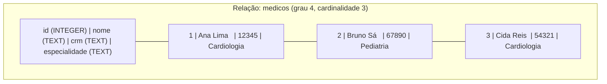
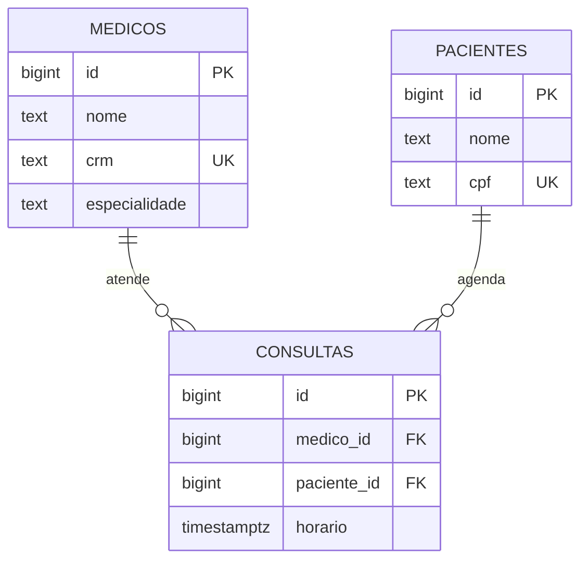
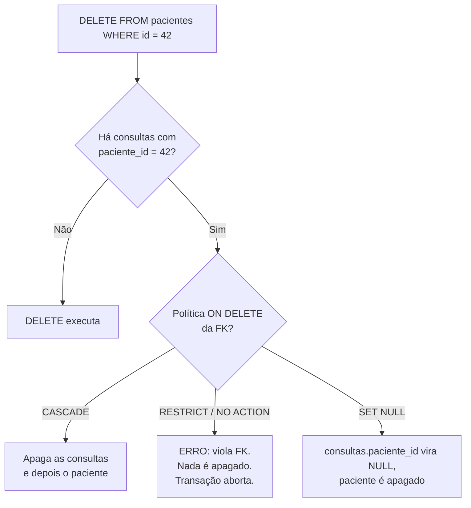
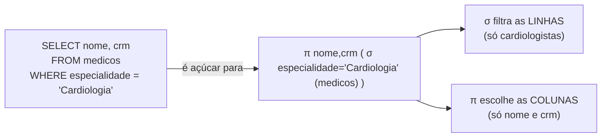

# O modelo relacional

A nota anterior ([[01 - O que é um banco de dados]]) tratou o modelo relacional como um **mapa**: você descreve *o quê* quer, não *como* buscar. Esta nota abre o mapa e mostra a maquinaria por baixo. Quando você escreve `SELECT`, o que existe ali embaixo? Tabelas? Sim — mas tabela é a palavra do dia a dia. Por baixo há uma teoria matemática, publicada em 1970, que sustenta tudo o que o SQL faz até hoje.

A pergunta que essa nota responde: **por que o relacional venceu, e o que exatamente ele te dá de graça?**

A resposta curta: ele te dá um lugar para colocar as **regras** dos seus dados — e um guardião que nunca dorme para fazê-las valer. Schema, chaves, constraints. O banco não é um saco onde você joga bytes. É um cofre com fechaduras que *você* projeta.

---

## A origem: Codd e a álgebra das tabelas

Em junho de 1970, Edgar F. Codd — matemático formado em Oxford, trabalhando no laboratório da IBM em San Jose — publicou *A Relational Model of Data for Large Shared Data Banks* (Communications of the ACM, 13(6), 377–387). Antes dele, os bancos eram **hierárquicos** ou **de rede**: você navegava por ponteiros físicos, "siga este link, depois aquele", e a estrutura de armazenamento vazava para dentro das suas consultas. Mover um arquivo no disco quebrava o programa.

A ideia de Codd foi quase escandalosa na época: **separe a estrutura lógica dos dados da forma como eles são guardados**. Descreva os dados como **relações** — tabelas de linhas e colunas — e deixe uma álgebra matemática descrever as operações sobre elas. O programa não sabe nem se importa onde a linha está no disco.

> [!tip] A palavra "relacional" não vem de "relacionamento"
> Esse é o mal-entendido mais comum. "Relacional" vem de **relação**, o termo matemático para uma tabela — um conjunto de tuplas. Não vem das chaves estrangeiras que ligam tabelas (isso é coincidência feliz de vocabulário). O banco é "relacional" porque seus dados *são relações*, no sentido da teoria dos conjuntos.

### O vocabulário formal (e o do dia a dia)

A teoria tem um nome próprio para cada coisa. Você vai ouvir os dois conjuntos de termos, e em entrevista vale conhecer a tradução.

| Termo formal | Termo do dia a dia | O que é |
| --- | --- | --- |
| Relação | Tabela | O conjunto inteiro de dados de um tipo |
| Tupla | Linha (row) | Um registro: um cliente, um pedido |
| Atributo | Coluna (column) | Uma propriedade: `nome`, `email` |
| Domínio | Tipo do atributo | O conjunto de valores válidos: `INTEGER`, `TEXT`, datas |
| Cardinalidade | — | Quantas tuplas (linhas) a relação tem |
| Grau | — | Quantos atributos (colunas) a relação tem |

Repare no **domínio**. Ele é mais sutil que "tipo". O domínio de `idade` poderia ser "inteiros de 0 a 150" — não só "inteiro". Na prática, os bancos modelam o tipo nativo (`INTEGER`) e você restringe o resto via `CHECK`. Mas a intenção de Codd era forte: cada coluna tem um conjunto de valores legítimos, e o banco deveria recusar qualquer coisa fora dele.

Aqui vai a tabela como **relação**: um cabeçalho (o esquema) e um corpo (as tuplas).



Leitura do diagrama: o cabeçalho `H` é o **esquema** da relação — define os atributos e seus domínios. Cada linha abaixo é uma **tupla**. O **grau** é 4 (quatro atributos); a **cardinalidade** é 3 (três tuplas). Uma propriedade teórica importante: como relação é um *conjunto*, **não há tuplas duplicadas** e **não há ordem garantida** entre elas. É por isso que um `SELECT` sem `ORDER BY` pode devolver linhas em qualquer ordem — o modelo simplesmente não promete ordem nenhuma.

---

## Schema: a definição da estrutura

O **schema** é a planta da relação: quais colunas existem, de que tipo, e que regras valem. No PostgreSQL você o declara com `CREATE TABLE`.

```sql
CREATE TABLE medicos (
    id            BIGINT GENERATED ALWAYS AS IDENTITY PRIMARY KEY,
    nome          TEXT        NOT NULL,
    crm           TEXT        NOT NULL,
    especialidade TEXT        NOT NULL,
    criado_em     TIMESTAMPTZ NOT NULL DEFAULT now()
);
```

Cada coluna carrega um **tipo** — e o tipo é uma promessa. `criado_em` é `TIMESTAMPTZ`: o banco recusa `'banana'` ali. Você nunca vai ler um timestamp e receber lixo, porque o banco nunca deixou o lixo entrar. Essa é a diferença entre um banco com schema e um arquivo JSON solto: o arquivo aceita qualquer coisa; o banco vigia a porta.

### Schema rígido: força e fraqueza

Aqui mora um trade-off que cai em entrevista. Schema rígido é, ao mesmo tempo, a maior força e a maior dor do relacional.

**É força** porque é uma **garantia**. Todo código que lê a tabela pode assumir que `nome` existe e é texto, que `crm` nunca é nulo. Você não precisa de defesa em cada `if`. O schema é um contrato verificado por máquina, e o banco o impõe igualzinho para todos os clientes — a API em Java, o script de migração, o estagiário rodando SQL no console. Ninguém escapa.

**É fraqueza** porque muda devagar. Adicionar uma coluna `NOT NULL` numa tabela de 20 milhões de linhas pode travar a tabela por minutos. Evoluir o schema exige **migrations** — mudanças versionadas, com cuidado para não derrubar produção. Os bancos de documento (como MongoDB) trocam essa rigidez por flexibilidade: cada documento pode ter campos diferentes, ótimo para prototipar, péssimo quando você precisa confiar que um campo está sempre lá.

> [!question] Onde guardar a regra?
> Se a regra "todo médico tem um CRM" vive só no código da aplicação, basta um caminho de escrita esquecer de validar — um script de importação, um endpoint novo — e o dado inválido entra. Se a regra vive no **schema** (`crm TEXT NOT NULL`), nenhum caminho escapa. O schema é a regra escrita no lugar onde *todos* têm que passar.

O design da estrutura — quantas tabelas, como dividir os dados, até onde levar a rigidez — é o assunto de [[04 - Modelagem e normalização]]. Aqui ficamos no mecanismo; lá vem a arte de usá-lo bem.

---

## Chaves: como uma linha é identificada

Se a relação é um conjunto e não tem duplicatas, como você aponta para *uma* tupla específica? Com uma **chave**.

- **Chave candidata (candidate key):** qualquer conjunto mínimo de colunas que identifica unicamente uma linha. `id` identifica. `crm` também (dois médicos não compartilham CRM). Ambos são candidatos.
- **Chave primária (primary key):** a candidata que você **elege** como a identidade oficial da tabela. Só uma por tabela. Nunca nula, nunca duplicada.
- **Chave composta (composite key):** uma chave feita de duas ou mais colunas juntas. Numa tabela de junção `inscricao(aluno_id, curso_id)`, é o **par** que identifica — nenhuma das duas sozinha basta.
- **Chave estrangeira (foreign key):** uma coluna que **aponta** para a chave primária de outra tabela. É a cola do modelo relacional. `consultas.medico_id` aponta para `medicos.id`.

A escolha entre chave **natural** (que tem significado de negócio, como o CRM) e **surrogate** (sem significado, como o `id` auto-gerado) é uma decisão de modelagem detalhada em [[04 - Modelagem e normalização]]. O default prático: `id` surrogate como PK, a chave natural como `UNIQUE`.



Leitura do diagrama: `CONSULTAS` tem duas chaves estrangeiras — `medico_id` e `paciente_id` — cada uma apontando para a PK de uma tabela. O símbolo `||--o{` lê-se "um para zero-ou-muitos": **um** médico atende **muitas** consultas. `UK` marca chaves únicas (o CRM e o CPF — chaves naturais que não escolhemos como PK, mas ainda garantimos únicas). É exatamente esse desenho que o SQL materializa em `CREATE TABLE`.

### Integridade referencial

Aqui está a garantia mais bonita do modelo relacional: uma **chave estrangeira não pode apontar para o vazio**. Se `consultas.medico_id` vale 7, então `medicos.id = 7` *tem* que existir. O banco recusa inserir uma consulta para um médico fantasma, e recusa apagar um médico que ainda tem consultas — a menos que você diga o que fazer com essas consultas órfãs.

Isso se chama **integridade referencial**, e é o banco protegendo você de um dos bugs mais clássicos: o **registro órfão**, aquele que aponta para um pai que não existe mais. Sem FK, você só descobre o estrago quando um `JOIN` silenciosamente perde linhas em produção.

```sql
CREATE TABLE consultas (
    id          BIGINT GENERATED ALWAYS AS IDENTITY PRIMARY KEY,
    medico_id   BIGINT NOT NULL REFERENCES medicos(id) ON DELETE RESTRICT,
    paciente_id BIGINT NOT NULL REFERENCES pacientes(id) ON DELETE CASCADE,
    horario     TIMESTAMPTZ NOT NULL
);
```

### O que fazer quando o pai some: `ON DELETE` / `ON UPDATE`

Você apaga um paciente. E as consultas dele? O banco não decide sozinho — *você* define a política, na declaração da FK:

| Ação | O que acontece ao apagar/atualizar o pai |
| --- | --- |
| `CASCADE` | Apaga (ou atualiza) os filhos junto. Some o paciente, somem as consultas dele. |
| `RESTRICT` | **Proíbe** apagar o pai enquanto houver filhos. Erro imediato. |
| `NO ACTION` | Quase igual a `RESTRICT`, mas a checagem pode ser adiada para o fim da transação. |
| `SET NULL` | Os filhos viram órfãos *legítimos*: a FK passa a `NULL`. Exige que a coluna aceite nulo. |
| `SET DEFAULT` | A FK do filho assume o valor `DEFAULT` da coluna. |



Leitura do diagrama: o `DELETE` do pai dispara uma checagem. Sem filhos, segue direto. Com filhos, a **política da FK** decide o destino. `CASCADE` é conveniente mas perigoso — um `DELETE` numa linha pode apagar milhares em cascata, e você só percebe depois. `RESTRICT` é o conservador: nada some por acidente, mas você precisa limpar os filhos na mão. A escolha não é técnica, é de **domínio**: faz sentido apagar as consultas de um paciente removido? Talvez. Faz sentido apagar consultas só porque o médico saiu da clínica? Quase nunca — por isso `medico_id` ficou `RESTRICT` no exemplo acima.

---

## Constraints: o banco como guardião de invariantes

Chave e FK são casos especiais de uma ideia maior: **constraints** são regras que o banco se recusa a violar. Pense nelas como invariantes do seu domínio, gravadas no lugar onde nenhum código consegue contornar.

| Constraint | Garante que… | Exemplo |
| --- | --- | --- |
| `NOT NULL` | a coluna sempre tem valor | `nome TEXT NOT NULL` |
| `UNIQUE` | não há duas linhas com o mesmo valor | `crm TEXT UNIQUE` |
| `CHECK` | o valor satisfaz uma condição | `CHECK (idade >= 0)` |
| `DEFAULT` | um valor é preenchido quando você omite | `status TEXT DEFAULT 'ativo'` |
| `PRIMARY KEY` | identidade única e não-nula | `id BIGINT PRIMARY KEY` |
| `FOREIGN KEY` | a referência aponta para algo que existe | `REFERENCES medicos(id)` |

```sql
CREATE TABLE consultas (
    id          BIGINT GENERATED ALWAYS AS IDENTITY PRIMARY KEY,
    medico_id   BIGINT      NOT NULL REFERENCES medicos(id),
    paciente_id BIGINT      NOT NULL REFERENCES pacientes(id),
    horario     TIMESTAMPTZ NOT NULL,
    duracao_min INTEGER     NOT NULL DEFAULT 30 CHECK (duracao_min > 0),
    status      TEXT        NOT NULL DEFAULT 'agendada'
                CHECK (status IN ('agendada', 'realizada', 'cancelada')),
    UNIQUE (medico_id, horario)
);
```

Repare na última linha: `UNIQUE (medico_id, horario)`. Isso é uma constraint **composta** que diz "um mesmo médico não pode ter duas consultas no mesmo horário". É uma regra de negócio inteira — *agenda não pode ter conflito* — expressa em uma linha de schema. O banco vai recusar o segundo `INSERT` que tentar marcar o Dr. Bruno às 14h se ele já estiver ocupado. Sem corrida, sem `if`, sem janela de race condition.

### Validar na aplicação ou no banco?

A tentação é validar tudo no código: "checo a idade no controller, mais limpo". Funciona — até não funcionar.

> [!warning] O banco é a última linha de defesa
> A aplicação valida **uma** porta de entrada. Mas existem outras: um script de migração de dados, um job de importação, um colega rodando `UPDATE` no console às 23h, um bug que pula a validação. Toda regra que vive *só* na aplicação é uma regra que *algum* caminho vai violar um dia. A constraint no banco é a rede de segurança que pega todos esses casos, porque está abaixo de todos eles.

Isso não é "ou um ou outro". O bom design valida **nos dois lugares**: na aplicação para dar mensagens de erro amigáveis e rápidas (sem ida ao banco), e no banco para a garantia inviolável. A aplicação é a recepcionista educada; a constraint é a fechadura. Você quer as duas.

---

## A teoria por trás do SQL: álgebra relacional (de leve)

Codd não deu só um formato de dados — deu uma **álgebra**. Um conjunto de operações que recebem relações e devolvem relações. E aqui está o pulo do gato: **toda consulta SQL pode ser expressa nessas operações**. O SQL é açúcar sintático por cima dessa álgebra. Quando o otimizador do PostgreSQL processa seu `SELECT`, ele literalmente pensa em termos parecidos com esses operadores.

Você não precisa decorar o formalismo. Precisa entender que existe uma matemática por baixo — é isso que dá ao relacional sua solidez e o que permite ao banco *reescrever* sua consulta numa forma equivalente mais rápida.

As operações fundamentais, em intuição:

- **Seleção (σ)** — filtra **linhas** por uma condição. `σ especialidade='Cardiologia' (medicos)` devolve só os cardiologistas. Em SQL, é o `WHERE`.
- **Projeção (π)** — escolhe **colunas**. `π nome, crm (medicos)` devolve só essas duas colunas. Em SQL, é a lista do `SELECT`.
- **Junção (⋈)** — combina duas relações casando linhas por uma condição. `medicos ⋈ consultas` cola cada médico às suas consultas. Em SQL, é o `JOIN`.
- **União, diferença, produto** — relações são conjuntos, então você as combina como conjuntos: `∪` (junta), `−` (subtrai), `×` (produto cartesiano, todas as combinações). Em SQL: `UNION`, `EXCEPT`, `CROSS JOIN`.



Leitura do diagrama: aquele `SELECT` do dia a dia é, por baixo, uma **projeção de uma seleção** — `π` aplicado sobre o resultado de `σ`. Primeiro a seleção `σ` joga fora as linhas que não interessam; depois a projeção `π` joga fora as colunas que não interessam. Sintaticamente o `WHERE` vem *depois* do `SELECT` no SQL, mas logicamente a seleção acontece *antes*. Esse descompasso entre a ordem que você escreve e a ordem que o banco executa é a raiz de muita confusão — e o assunto detalhado de [[03 - SQL - consultas]].

> [!info] Por que isso importa numa entrevista
> Quando o entrevistador pergunta "o que o banco faz com essa query?", a resposta de senior reconhece que SQL é declarativo *porque* há uma álgebra fechada por baixo. Você descreve o resultado em termos dessas operações; o **otimizador** escolhe a ordem física (qual junção primeiro, qual índice) que produz o mesmo resultado algébrico pelo menor custo. Modelo lógico estável, execução física livre. Era exatamente o sonho de Codd: o programa não sabe *como* os dados são buscados.

---

## NULL e a lógica de três valores

Agora a armadilha mais traiçoeira do modelo relacional — a que aparece em quase toda entrevista de SQL e derruba gente experiente.

`NULL` **não é um valor**. É a ausência de valor: "desconhecido", "não se aplica", "ainda não preenchido". E porque `NULL` significa "desconhecido", a lógica booleana de dois valores (verdadeiro/falso) deixa de bastar. O SQL precisa de um terceiro estado: **UNKNOWN**.

Isso é a **lógica de três valores** (3VL): toda comparação resulta em `TRUE`, `FALSE` ou `UNKNOWN`. E a consequência é a pegadinha clássica:

```sql
SELECT * FROM medicos WHERE telefone = NULL;   -- NUNCA retorna linhas
```

Por quê? Porque `telefone = NULL` não é `TRUE` nem `FALSE` — é `UNKNOWN`. Você está perguntando "este valor desconhecido é igual a um valor desconhecido?". A resposta honesta é: não sei. Dois desconhecidos podem ou não ser iguais. E o `WHERE` **só deixa passar linhas que dão `TRUE`** — `FALSE` e `UNKNOWN` são descartados igualmente. Resultado: zero linhas, sempre.

A forma correta de perguntar por ausência é o predicado dedicado:

```sql
SELECT * FROM medicos WHERE telefone IS NULL;     -- correto
SELECT * FROM medicos WHERE telefone IS NOT NULL; -- correto
```

### A tabela-verdade do UNKNOWN

Como o `NULL` contamina expressões lógicas:

| A | B | `A AND B` | `A OR B` |
| --- | --- | --- | --- |
| TRUE | UNKNOWN | UNKNOWN | TRUE |
| FALSE | UNKNOWN | **FALSE** | UNKNOWN |
| UNKNOWN | UNKNOWN | UNKNOWN | UNKNOWN |

Repare nas duas exceções onde o `UNKNOWN` *não* propaga: `FALSE AND qualquer-coisa` é sempre `FALSE` (já está perdido, não importa o resto), e `TRUE OR qualquer-coisa` é sempre `TRUE` (já está ganho). Fora desses dois curto-circuitos, qualquer `UNKNOWN` numa expressão a torna `UNKNOWN`. E `NOT UNKNOWN` continua `UNKNOWN` — negar uma incerteza dá outra incerteza.

### O efeito em agregações

A regra é diferente — e às vezes surpreendente — nas funções de agregação:

- `COUNT(*)` conta **todas** as linhas, inclusive as que têm `NULL`.
- `COUNT(coluna)` conta só as linhas onde `coluna` **não é** `NULL`.
- `SUM`, `AVG`, `MAX`, `MIN` **ignoram** `NULL`. E cuidado: `AVG(salario)` divide pela contagem de salários *não-nulos*, não pelo total de linhas. Se metade dos salários é `NULL`, a média é dos que você tem — o que pode ou não ser o que você quer.

> [!warning] A pegadinha do NOT IN com NULL
> `WHERE id NOT IN (1, 2, NULL)` pode retornar **zero linhas** mesmo quando deveria retornar várias. Porque `id NOT IN (...)` vira `id <> 1 AND id <> 3 AND id <> NULL`, e aquele `id <> NULL` é `UNKNOWN`, que contamina o `AND` inteiro para nunca dar `TRUE`. É um dos bugs mais silenciosos do SQL. Prefira `NOT EXISTS` quando a subconsulta puder conter nulos.

`NULL` é poderoso — modela o desconhecido com honestidade — mas exige disciplina. Muita gente sênior tem `NOT NULL` como default mental e só permite nulo quando o domínio *realmente* tem o conceito de "ausente". É uma boa heurística: cada coluna nula é uma porta para a lógica de três valores.

---

## Em entrevista

> The relational model, introduced by Codd in 1970, represents data as **relations** — tables of rows (tuples) and columns (attributes), each column constrained to a **domain**. What I value most about it is that the **schema is a machine-checked contract**: typing, keys, and constraints live in the database, so every code path is forced to respect the same invariants. **Referential integrity** through foreign keys means I never get orphan rows silently — the database refuses to point a foreign key at something that doesn't exist, and `ON DELETE` policies like `CASCADE` or `RESTRICT` let me decide what happens to children when a parent is removed. I treat the database as the **last line of defense**: I validate in the application for fast, friendly errors, but I put the real guarantees — `NOT NULL`, `UNIQUE`, `CHECK` — in constraints, because the app is just one entry point and scripts or console queries bypass it. SQL itself is **syntactic sugar over relational algebra** — selection, projection, join — which is exactly why the optimizer is free to reorder physical execution while preserving the logical result. The trap I always call out is **three-valued logic**: `NULL` isn't a value, it's "unknown", so `column = NULL` evaluates to `UNKNOWN` and never matches — you have to use `IS NULL`, and `NOT IN` with a NULL in the list will silently return nothing.

### Vocabulário PT → EN

- relação → relation
- tupla → tuple
- atributo → attribute
- domínio (de uma coluna) → domain
- cardinalidade / grau → cardinality / degree
- esquema → schema
- chave primária → primary key
- chave candidata → candidate key
- chave estrangeira → foreign key
- chave composta → composite key
- integridade referencial → referential integrity
- registro órfão → orphan row / orphan record
- restrição → constraint
- valor padrão → default value
- álgebra relacional → relational algebra
- seleção / projeção / junção → selection / projection / join
- lógica de três valores → three-valued logic
- valor nulo / ausente → null / missing value

---

> [!info] Lastro
> Modelo relacional e vocabulário formal (relação/tupla/atributo/domínio, grau e cardinalidade) baseados em Edgar F. Codd, *A Relational Model of Data for Large Shared Data Banks*, Communications of the ACM 13(6):377–387, junho de 1970 ([resumo histórico](https://www.historyofinformation.com/detail.php?id=94), [biografia IBM](https://www.ibm.com/history/edgar-codd)). Lógica de três valores, comportamento de `NULL` em `WHERE` e em agregações conferidos em [Modern SQL — Three-Valued Logic](https://modern-sql.com/concept/three-valued-logic) e [LearnSQL — Understanding NULL](https://learnsql.com/blog/understanding-use-null-sql/). Sintaxe (`GENERATED ALWAYS AS IDENTITY`, `REFERENCES ... ON DELETE`, `CHECK`) na voz do **PostgreSQL**. A álgebra relacional está deliberadamente simplificada à intuição — a teoria formal (cálculo relacional, fecho, operações derivadas) fica fora do escopo de uma nota Iniciado. O exemplo `medicos/consultas` é ilustrativo, não um schema real de produção.

## Veja também

- [[01 - O que é um banco de dados]] — o modelo relacional como mapa; SQL como linguagem declarativa.
- [[03 - SQL - consultas]] — o `SELECT` por dentro: `WHERE`, `JOIN`, `GROUP BY`, ordem lógica de execução.
- [[04 - Modelagem e normalização]] — como projetar o schema: normalização, relacionamentos, natural vs surrogate.
- [[05 - Transações e ACID]] — quando as constraints são checadas, e o que "consistência" garante.
- [[07 - Índices]] — como o banco encontra a linha que uma chave aponta, sem varrer tudo.
