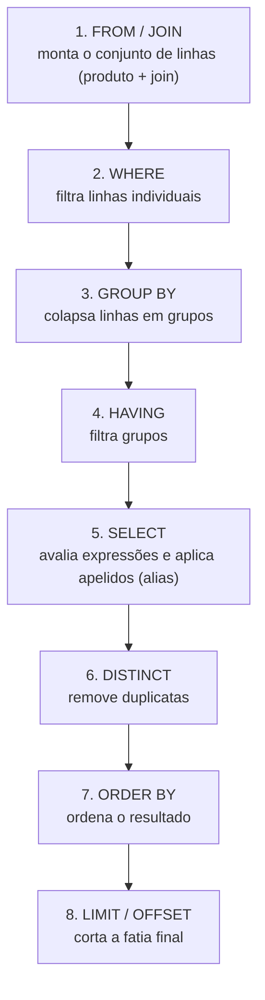
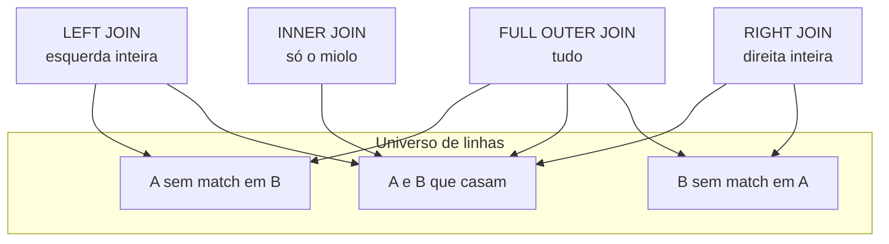
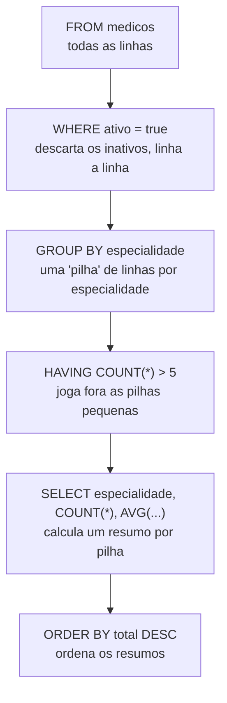

# SQL - consultas

Se [[02 - O modelo relacional]] desenha o mapa (tabelas, tuplas, chaves), SQL é como você anda por ele. E quase tudo que um dev faz num banco relacional cai numa única palavra: `SELECT`. Você lê dados pra montar uma tela, pra alimentar um relatório, pra decidir uma regra de negócio. Saber escrever um `SELECT` que faz a pergunta certa — e que o banco consegue responder rápido — é a habilidade mais usada e mais cobrada em entrevista.

Esta nota é o SQL de consulta **fundamental**: a anatomia do `SELECT`, a ordem em que o banco realmente executa as coisas, os `JOIN`s, agregações com `GROUP BY`/`HAVING`, e subqueries. As ferramentas mais afiadas — window functions, CTEs, `LATERAL`, paginação por keyset — moram em [[09 - SQL avançado]]; aqui eu só aponto pra elas quando o assunto encosta.

Voz-padrão **PostgreSQL**. Onde MySQL ou outro banco divergem de um jeito que cai em entrevista, eu aviso.

> [!tip] Resumo em uma linha
> SQL é **declarativo**: você descreve *o quê* quer, não *como* buscar — e o segredo de não tropeçar é entender a **ordem lógica** em que o banco monta a resposta.

---

## Anatomia de um SELECT

Toda consulta de leitura é uma combinação destas cláusulas. Vou usar um domínio de saúde o tempo todo — tabelas `medicos`, `pacientes`, `consultas` — porque é concreto e dá pra visualizar.

```sql
SELECT   nome, especialidade        -- quais colunas (a projeção)
FROM     medicos                    -- de qual tabela (a fonte)
WHERE    ativo = true               -- quais linhas (o filtro)
ORDER BY nome ASC                   -- em que ordem
LIMIT    20 OFFSET 0;               -- quantas, a partir de onde
```

Leia em voz alta como uma frase: "selecione o nome e a especialidade dos médicos, onde ativo é verdadeiro, ordenados por nome, as primeiras 20". Cada cláusula responde uma pergunta:

- **`SELECT`** — a **projeção**: quais colunas (ou expressões) você quer de volta. `SELECT *` traz tudo, mas é um vício: puxa colunas que você não usa, atrapalha index-only scans (ver [[07 - Índices]]) e quebra silenciosamente quando alguém adiciona uma coluna. Em código de produção, liste as colunas.
- **`FROM`** — a **fonte**: a tabela (ou o resultado de um `JOIN`, ou uma subquery) de onde as linhas saem.
- **`WHERE`** — o **filtro de linhas**: uma condição booleana avaliada linha a linha. Só passa quem dá `TRUE`. (Atenção ao `NULL`, que dá `UNKNOWN` — falo disso adiante.)
- **`ORDER BY`** — a **ordenação**. Detalhe que derruba júnior: **sem `ORDER BY`, a ordem das linhas é indefinida**. O banco pode devolver na ordem que for mais barata, e isso muda com o plano, com o índice, com a versão. Nunca confie em "a ordem que está na tabela".
- **`LIMIT` / `OFFSET`** — quantas linhas trazer e quantas pular. `LIMIT 20 OFFSET 40` é a "página 3" de 20 em 20. (No SQL Server a sintaxe é `OFFSET ... FETCH`; em Oracle antigo, `ROWNUM`. O conceito é o mesmo.)

### DISTINCT

`DISTINCT` remove linhas duplicadas do resultado:

```sql
SELECT DISTINCT especialidade FROM medicos;
```

Devolve cada especialidade uma única vez. Funciona sobre **o conjunto inteiro de colunas projetadas** — `SELECT DISTINCT cidade, especialidade` considera duplicado só quando o *par* (cidade, especialidade) se repete. Cuidado: `DISTINCT` muitas vezes é um curativo. Se você precisa dele porque um `JOIN` está multiplicando linhas, o problema real é o `JOIN`, não a falta de `DISTINCT`. Frequentemente um `EXISTS` (adiante) resolve melhor.

---

## A ordem lógica de execução

Aqui está o insight que separa quem decorou sintaxe de quem entende SQL. Você **escreve** a query numa ordem (`SELECT ... FROM ... WHERE ...`), mas o banco **avalia logicamente** em outra. Essa ordem lógica não é trivia acadêmica: ela explica erros que confundem todo mundo no começo.

A ordem lógica padrão é:



**Leitura do diagrama:** o banco começa montando *de onde* as linhas vêm (`FROM`/`JOIN`), depois joga fora as que não interessam (`WHERE`), agrupa o que sobrou (`GROUP BY`), descarta grupos inteiros (`HAVING`), só **então** calcula as colunas que você pediu e batiza os apelidos (`SELECT`), tira duplicatas (`DISTINCT`), ordena (`ORDER BY`) e por fim corta a página (`LIMIT`). O ponto-chave é que **`SELECT` vem quase no fim** — bem depois de `WHERE`.

> [!note] "Lógica" não é "física"
> Essa é a ordem **lógica** — o modelo mental que o padrão SQL garante. O otimizador é livre pra executar **fisicamente** em outra ordem (empurrar filtros pra dentro do join, usar índice pra evitar ordenação) desde que o resultado seja idêntico ao que a ordem lógica produziria. Você raciocina na ordem lógica; o banco se vira na física. O plano real você lê em [[08 - EXPLAIN e otimização]].

### Por que isso explica os mistérios

**1. Por que não dá pra usar um alias do `SELECT` no `WHERE`?**

```sql
-- ERRO no PostgreSQL:
SELECT preco * 0.9 AS preco_com_desconto
FROM   procedimentos
WHERE  preco_com_desconto > 100;   -- coluna "preco_com_desconto" não existe
```

Quando o `WHERE` é avaliado, o `SELECT` **ainda não rodou** — o apelido `preco_com_desconto` simplesmente não existe ainda. O banco está na etapa 2, e o apelido só nasce na etapa 5. A correção é repetir a expressão (`WHERE preco * 0.9 > 100`) ou embrulhar em subquery/CTE.

**2. Por que `ORDER BY` *aceita* o alias?**

```sql
SELECT preco * 0.9 AS preco_com_desconto
FROM   procedimentos
ORDER BY preco_com_desconto;   -- funciona!
```

Porque `ORDER BY` (etapa 7) roda **depois** do `SELECT` (etapa 5). Quando a ordenação acontece, o apelido já existe. Essa assimetria — alias proibido no `WHERE`, permitido no `ORDER BY` — é consequência direta da ordem lógica, e é uma pergunta clássica de entrevista.

**3. Por que `WHERE` não enxerga funções de agregação?**

```sql
-- ERRO:
SELECT especialidade, COUNT(*)
FROM   medicos
WHERE  COUNT(*) > 5      -- agregação no WHERE: inválido
GROUP BY especialidade;
```

`WHERE` (etapa 2) roda **antes** do `GROUP BY` (etapa 3). No momento do `WHERE` não existe "grupo" nem `COUNT(*)` — ainda são linhas soltas. Filtrar por resultado de agregação é trabalho do `HAVING` (etapa 4), que roda depois do agrupamento. É exatamente esse o motivo de existirem **duas** cláusulas de filtro, e o que separa `WHERE` de `HAVING`.

Guarde a tabela mental:

| Quero filtrar... | Cláusula | Por quê |
| --- | --- | --- |
| linhas, antes de agrupar | `WHERE` | roda antes do `GROUP BY` |
| grupos, depois de agrupar | `HAVING` | roda depois do `GROUP BY` |
| pelo resultado de uma agregação | `HAVING` | a agregação só existe após agrupar |

---

## JOINs

Dados relacionais vivem espalhados em tabelas — médicos numa, consultas em outra. `JOIN` é como você costura essas tabelas de volta numa visão única, casando linhas por uma condição (quase sempre FK = PK; ver [[02 - O modelo relacional]]).

Tabela de referência (mesma do tronco):

| JOIN | Comportamento |
| --- | --- |
| `INNER JOIN` | só linhas com match nos **dois** lados |
| `LEFT JOIN` | todas da esquerda + matches da direita (`NULL` se não houver) |
| `RIGHT JOIN` | espelho do `LEFT` (raro na prática) |
| `FULL OUTER JOIN` | todas de ambos os lados (`NULL` onde não casa) |
| `CROSS JOIN` | produto cartesiano (toda linha × toda linha) |

O diagrama abaixo mostra **quais linhas sobrevivem** a cada tipo, pensando em duas tabelas A (esquerda) e B (direita):



**Leitura do diagrama:** as três caixas do topo são os três "pedaços" possíveis: linhas de A que não acham par, o miolo que casa nos dois lados, e linhas de B que não acham par. Cada tipo de `JOIN` é só uma escolha de **quais pedaços manter**. `INNER` fica só com o miolo. `LEFT` mantém a esquerda inteira (miolo + órfãos de A). `RIGHT` é o espelho. `FULL OUTER` mantém tudo. Onde um lado não tem par, as colunas dele vêm preenchidas com `NULL`.

### INNER JOIN — a interseção

Só sobrevivem as linhas que casam nos dois lados.

```sql
SELECT c.data, m.nome AS medico, p.nome AS paciente
FROM   consultas c
INNER JOIN medicos   m ON m.id = c.medico_id
INNER JOIN pacientes p ON p.id = c.paciente_id;
```

Uma consulta sem médico válido (FK nula ou apontando pra ninguém) simplesmente **some** do resultado. É o `JOIN` mais comum e o default quando você diz só `JOIN` (a palavra `INNER` é opcional).

### LEFT JOIN — preservando a esquerda

Mantém **todas** as linhas da tabela à esquerda, mesmo as sem par à direita. Esse é o `JOIN` que você usa quando a pergunta é "...incluindo os que não têm nada".

```sql
-- Todos os médicos, com a contagem de consultas (zero inclusive)
SELECT m.nome, COUNT(c.id) AS total_consultas
FROM   medicos m
LEFT JOIN consultas c ON c.medico_id = m.id
GROUP BY m.nome;
```

#### O que o NULL faz num LEFT JOIN sem match

Esse é o detalhe que pega gente. Quando um médico não tem nenhuma consulta, a linha dele **ainda aparece**, mas todas as colunas vindas de `consultas` ficam `NULL`. Por isso eu escrevi `COUNT(c.id)` e não `COUNT(*)`: `COUNT(*)` conta a linha (que existe, valendo 1 mesmo com tudo nulo), enquanto `COUNT(c.id)` **ignora os `NULL`** e devolve 0 corretamente pro médico sem consultas. Trocar um pelo outro muda o resultado.

Outra armadilha relacionada: filtrar a tabela da direita no `WHERE` **transforma seu `LEFT JOIN` num `INNER JOIN` por acidente**.

```sql
-- Bug silencioso: o WHERE elimina os médicos sem consulta
SELECT m.nome, c.data
FROM   medicos m
LEFT JOIN consultas c ON c.medico_id = m.id
WHERE  c.data >= '2026-01-01';   -- NULL >= '...' dá UNKNOWN → linha some
```

Os médicos sem consulta têm `c.data = NULL`, e `NULL >= '2026-01-01'` dá `UNKNOWN`, que o `WHERE` descarta. Resultado: você perdeu exatamente as linhas que o `LEFT JOIN` queria preservar. A correção é mover a condição **pra dentro do `ON`** (`LEFT JOIN consultas c ON c.medico_id = m.id AND c.data >= '2026-01-01'`), porque o `ON` participa do join (etapa 1) e o `WHERE` filtra depois (etapa 2). De novo: a ordem lógica explica o comportamento.

### RIGHT JOIN — o espelho raro

`RIGHT JOIN` preserva a tabela da direita. É logicamente idêntico a um `LEFT JOIN` com as tabelas trocadas de lado — e é por isso que ele é **raro na prática**: quase todo mundo prefere reordenar e escrever `LEFT`, que lê melhor (você começa pela tabela "principal"). Vê-lo num código costuma ser sinal de query gerada por ferramenta. Bom detalhe de entrevista: saber que `RIGHT` existe, mas que ninguém o usa por escolha.

### FULL OUTER JOIN — tudo dos dois lados

Mantém linhas de ambos os lados, com `NULL` onde não há par. Útil pra reconciliação ("o que existe num sistema e não no outro, nos dois sentidos").

```sql
SELECT a.id AS id_sistema_a, b.id AS id_sistema_b
FROM   sistema_a a
FULL OUTER JOIN sistema_b b ON b.chave = a.chave
WHERE  a.id IS NULL OR b.id IS NULL;   -- só os que faltam em algum lado
```

> [!warning] Divergência: MySQL não tem FULL OUTER JOIN nativo
> PostgreSQL e SQL Server suportam `FULL OUTER JOIN` direto. **MySQL não** — por escolha histórica de design, ele nunca implementou. O workaround clássico é emular com `LEFT JOIN ... UNION ... RIGHT JOIN`. Saber essa diferença é um sinal forte de senioridade em entrevista, porque mostra que você já trabalhou com mais de um banco.

### CROSS JOIN — o produto cartesiano

Combina **toda** linha de A com **toda** linha de B. Sem condição de junção. Se A tem 100 linhas e B tem 50, você recebe 5.000.

```sql
-- Toda combinação de médico × turno, pra montar uma grade de plantão
SELECT m.nome, t.turno
FROM   medicos m
CROSS JOIN (VALUES ('manhã'), ('tarde'), ('noite')) AS t(turno);
```

Útil pra gerar grades e combinações. Perigoso por acidente: um `JOIN` sem a condição `ON` (ou com a condição errada) vira um cartesiano disfarçado e explode o número de linhas — uma das causas mais comuns de query que "trava" de repente.

### SELF JOIN — a tabela consigo mesma

Quando uma tabela referencia a si própria (hierarquia, ver [[04 - Modelagem e normalização]]), você a junta com ela mesma usando **apelidos diferentes** pra distinguir os dois papéis.

```sql
-- Cada médico e o seu supervisor (ambos vivem em `medicos`)
SELECT m.nome AS medico, s.nome AS supervisor
FROM   medicos m
LEFT JOIN medicos s ON s.id = m.supervisor_id;
```

Aqui `m` e `s` são a **mesma** tabela `medicos`, vista sob dois papéis. Usei `LEFT JOIN` de propósito: o médico no topo da hierarquia não tem supervisor (`supervisor_id` nulo) e mesmo assim deve aparecer. Hierarquias de profundidade arbitrária ("toda a cadeia de supervisão") exigem recursão — isso é trabalho de CTE recursiva, que mora em [[09 - SQL avançado]].

---

## Agregações + GROUP BY

Agregar é colapsar muitas linhas numa só, resumindo. As funções de agregação principais:

| Função | O que faz | Trata NULL? |
| --- | --- | --- |
| `COUNT(*)` | conta linhas | conta tudo, inclusive nulos |
| `COUNT(coluna)` | conta valores **não-nulos** da coluna | ignora `NULL` |
| `SUM(coluna)` | soma | ignora `NULL` |
| `AVG(coluna)` | média | ignora `NULL` (não conta no divisor!) |
| `MIN` / `MAX` | menor / maior | ignora `NULL` |

> [!tip] A pegadinha do AVG com NULL
> `AVG` ignora `NULL` tanto na soma quanto na **contagem**. Se 3 médicos têm `nota` nula entre 10, `AVG(nota)` divide por 7, não por 10. Se você queria que nulo contasse como zero, precisa `AVG(COALESCE(nota, 0))`. Isso muda o resultado e é fonte de bug em relatório.

`GROUP BY` define o critério de agrupamento: o banco junta as linhas que compartilham o mesmo valor das colunas agrupadas, e calcula uma agregação por grupo.

```sql
SELECT especialidade,
       COUNT(*)              AS total,
       AVG(anos_experiencia) AS media_experiencia
FROM   medicos
WHERE  ativo = true
GROUP BY especialidade
HAVING COUNT(*) > 5
ORDER BY total DESC;
```

Leia na **ordem lógica**, que é onde o exemplo fica didático:



**Leitura do diagrama:** `WHERE` poda linhas individuais **antes** de empilhar; `GROUP BY` forma uma pilha por especialidade; `HAVING` descarta pilhas inteiras (as com 5 ou menos médicos); só então `SELECT` calcula `COUNT`/`AVG` de cada pilha que sobrou, e `ORDER BY` põe em ordem. Filtrar "antes de empilhar" (mais barato, menos linhas pra agrupar) é trabalho do `WHERE`; filtrar "pilhas" é trabalho do `HAVING`.

> [!note] Regra do GROUP BY
> No SQL estrito (e no PostgreSQL), **toda coluna no `SELECT` que não está dentro de uma função de agregação precisa aparecer no `GROUP BY`**. Faz sentido: se você agrupou por `especialidade`, qual `nome` o banco deveria mostrar pro grupo "Cardiologia" que tem 30 médicos? Não há resposta única. (O MySQL historicamente relaxava isso e escolhia um valor arbitrário — fonte de bugs silenciosos; hoje, com `ONLY_FULL_GROUP_BY` ligado por default, ele segue a regra estrita.)

### WHERE vs HAVING — a distinção-chave

Já apareceu acima, mas vale cravar como verbete porque é **a** pergunta de entrevista sobre agregação:

- **`WHERE` filtra linhas, antes de agrupar.** Não pode usar agregações.
- **`HAVING` filtra grupos, depois de agrupar.** Existe justamente pra poder usar agregações (`HAVING COUNT(*) > 5`).

Regra prática: tudo que você **pode** colocar no `WHERE`, coloque no `WHERE` — é mais cedo na ordem lógica, então filtra mais linhas mais cedo, mais barato. Reserve o `HAVING` só pra condições que dependem do resultado da agregação.

---

## Subqueries

Uma subquery é um `SELECT` dentro de outro. Serve pra responder uma pergunta em duas etapas: "quais pacientes... entre os que fizeram tal coisa". Há quatro formas que valem dominar.

### Subquery escalar — devolve um único valor

Retorna exatamente uma linha e uma coluna, e pode ser usada onde um valor caberia:

```sql
-- Médicos com experiência acima da média geral
SELECT nome, anos_experiencia
FROM   medicos
WHERE  anos_experiencia > (SELECT AVG(anos_experiencia) FROM medicos);
```

A subquery `(SELECT AVG(...))` vira um número, e o `WHERE` compara cada linha com ele. Se uma subquery escalar devolver mais de uma linha, dá erro em runtime — então garanta que ela é mesmo escalar.

### IN — pertence a um conjunto

A subquery devolve uma **lista** de valores, e `IN` testa pertencimento:

```sql
-- Pacientes que têm pelo menos uma consulta com cardiologista
SELECT nome
FROM   pacientes
WHERE  id IN (
    SELECT c.paciente_id
    FROM   consultas c
    JOIN   medicos m ON m.id = c.medico_id
    WHERE  m.especialidade = 'Cardiologia'
);
```

> [!warning] NOT IN e a armadilha do NULL
> `NOT IN` é traiçoeiro: se a lista interna contém **qualquer** `NULL`, o `NOT IN` inteiro passa a devolver `UNKNOWN` pra todo mundo, e você recebe **zero linhas** sem erro. É a semântica do três-valores do SQL mordendo. Por isso, pra negação, prefira `NOT EXISTS` (abaixo), que é imune a esse problema.

### EXISTS e NOT EXISTS — existe pelo menos um?

`EXISTS` testa se a subquery devolve **alguma** linha — ele não liga pro *valor*, só pra *existência*. Por isso a convenção `SELECT 1` lá dentro: o conteúdo é irrelevante.

```sql
-- Médicos que JÁ têm pelo menos uma consulta agendada
SELECT m.nome
FROM   medicos m
WHERE  EXISTS (
    SELECT 1 FROM consultas c WHERE c.medico_id = m.id
);

-- Médicos que NUNCA tiveram consulta
SELECT m.nome
FROM   medicos m
WHERE  NOT EXISTS (
    SELECT 1 FROM consultas c WHERE c.medico_id = m.id
);
```

`EXISTS` costuma poder **curto-circuitar**: assim que acha a primeira linha que casa, para. E `NOT EXISTS` é a forma segura de fazer "anti-join" (linhas de A sem correspondente em B), sem o problema de `NULL` do `NOT IN`.

### Subquery correlacionada — depende da linha de fora

Nos exemplos de `EXISTS` acima, repare em `c.medico_id = m.id`: a subquery interna **referencia** `m`, uma tabela da query externa. Isso é uma subquery **correlacionada** — ela não roda uma vez só; conceitualmente roda **uma vez por linha** da query externa, porque o `m.id` muda a cada linha.

Subquery não-correlacionada (independente) roda uma vez e pronto. A correlacionada é mais poderosa, mas o modelo mental de "roda por linha" ajuda a entender por que pode ficar cara — embora o otimizador frequentemente a reescreva internamente como join. Confirme no plano com [[08 - EXPLAIN e otimização]].

### Subquery vs JOIN — quando usar qual

Muita subquery pode ser reescrita como `JOIN` e vice-versa. Heurística prática:

- **Quer colunas das duas tabelas no resultado?** Use `JOIN`. Subquery em `WHERE` não te dá acesso às colunas internas.
- **Só quer testar existência/pertencimento, sem trazer colunas?** `EXISTS`/`IN` deixam a intenção mais clara, e `EXISTS` evita a multiplicação de linhas que um `JOIN` causaria (e que te forçaria a um `DISTINCT`).
- **Negação ("os que NÃO...")?** `NOT EXISTS`, quase sempre. Mais legível e imune ao `NULL` do `NOT IN`.
- **Performance?** No PostgreSQL moderno, `IN`, `EXISTS` e `JOIN` equivalentes costumam gerar planos parecidos — o otimizador é bom em reescrever. Não escolha por superstição de performance; escolha por clareza e meça com `EXPLAIN` quando importar.

---

## Operações de conjunto (menção)

Quando você quer **combinar resultados de duas queries** (empilhar verticalmente, não lado a lado como o `JOIN`), há os operadores de conjunto:

- **`UNION`** — junta as linhas das duas queries e **remove duplicatas**.
- **`UNION ALL`** — junta e **mantém duplicatas**. É mais barato (não precisa deduplicar) — prefira `UNION ALL` quando você sabe que não há duplicatas ou não se importa com elas.
- **`INTERSECT`** — só as linhas que aparecem em **ambas**.
- **`EXCEPT`** — linhas da primeira query que **não** estão na segunda (em MySQL/Oracle o nome é `MINUS`).

```sql
SELECT email FROM medicos
UNION
SELECT email FROM pacientes;   -- todos os e-mails, sem repetir
```

As queries precisam ter o **mesmo número de colunas e tipos compatíveis**. Não vou aprofundar aqui — o ponto é reconhecer os operadores e lembrar do par `UNION` (deduplica, mais caro) vs `UNION ALL` (não deduplica, mais barato), que é uma micro-otimização clássica.

---

## O que NÃO está aqui

Pra não confundir o escopo Iniciado com o que vem depois — estas ferramentas de consulta moram em [[09 - SQL avançado]] e você vai encontrá-las quando precisar de mais potência:

- **Window functions** (`OVER (PARTITION BY ...)`) — agregar **sem** colapsar linhas: rankings, running totals, top-N por grupo.
- **CTEs** (`WITH ...`) e **CTEs recursivas** — nomear subqueries pra legibilidade e resolver hierarquias.
- **`LATERAL JOIN`** — subquery correlacionada no `FROM`, ideal pra "top-N por grupo".
- **Upsert** (`INSERT ... ON CONFLICT`) — inserir-ou-atualizar de forma idempotente.
- **Keyset pagination** — o substituto de `OFFSET` alto, que é uma armadilha de performance descrita em [[10 - Performance e armadilhas]].

---

## Em entrevista

> When I read a SQL query, I read it in its **logical execution order**, not top-to-bottom: `FROM` and `JOIN` first, then `WHERE`, `GROUP BY`, `HAVING`, then `SELECT`, `DISTINCT`, `ORDER BY` and finally `LIMIT`. That single mental model explains most of the "gotchas" — for instance, you can't reference a `SELECT` alias in `WHERE` because `WHERE` is evaluated before `SELECT`, but you *can* in `ORDER BY` because `ORDER BY` runs after it. The same reasoning tells you why aggregate filters go in `HAVING`, not `WHERE`.
>
> On joins, I default to `INNER JOIN` for matched rows and `LEFT JOIN` when I need to preserve a side even without matches. The classic trap is filtering the right-hand table in `WHERE` after a `LEFT JOIN` — that silently turns it into an inner join, because `NULL` comparisons evaluate to `UNKNOWN` and get dropped; the fix is to push the condition into the `ON` clause. I rarely write `RIGHT JOIN` — I just flip the tables and use `LEFT`. And I keep in mind that **MySQL has no native `FULL OUTER JOIN`**, so you emulate it with `LEFT ... UNION ... RIGHT`.
>
> For "does it exist?" questions I reach for `EXISTS` and `NOT EXISTS` rather than `IN`/`NOT IN`, because `NOT IN` returns nothing if the subquery yields a single `NULL` — the three-valued logic biting you. I treat `WHERE` versus `HAVING`, `COUNT(*)` versus `COUNT(column)`, and `AVG` ignoring `NULL`s as the details that separate someone who memorized syntax from someone who understands the engine.

### Vocabulário

- consulta → query
- consulta de seleção → SELECT statement
- junção → join
- junção interna / externa → inner / outer join
- junção à esquerda / direita → left / right join
- produto cartesiano → Cartesian product / cross join
- auto-junção → self join
- projeção → projection
- filtro → filter / predicate
- cláusula → clause
- apelido (de coluna/tabela) → alias
- agregação → aggregation
- função de agregação → aggregate function
- agrupamento → grouping
- subconsulta → subquery
- subconsulta escalar → scalar subquery
- subconsulta correlacionada → correlated subquery
- pertencimento → membership (`IN`)
- existência → existence (`EXISTS`)
- anti-junção → anti-join (`NOT EXISTS`)
- ordem lógica de execução → logical query processing order
- operação de conjunto → set operation
- união → union
- interseção → intersection
- diferença → difference / `EXCEPT`
- duplicata → duplicate
- lógica de três valores → three-valued logic

---

> [!info] Lastro
> A **ordem lógica de processamento** (`FROM → WHERE → GROUP BY → HAVING → SELECT → DISTINCT → ORDER BY → LIMIT`) é a sequência padrão usada como modelo mental por todos os SGBDs relacionais — confirmada em referências sobre *SQL logical query processing order* (DataCamp, SQLServerCentral, Jan Zedníček). É **lógica**, não física: o otimizador reordena a execução real desde que preserve o resultado equivalente. A explicação do alias indisponível no `WHERE` (vs disponível no `ORDER BY`) decorre diretamente dessa ordem (Purple Frog Systems).
>
> A semântica dos `JOIN`s (`INNER`/`LEFT`/`RIGHT`/`FULL OUTER`/`CROSS`) é padrão SQL; a ausência de `FULL OUTER JOIN` nativo no **MySQL** (emulado via `LEFT ... UNION ... RIGHT`) é uma divergência histórica real e documentada (Five, GeeksforGeeks, Percona). PostgreSQL e SQL Server suportam `FULL OUTER JOIN` nativamente.
>
> **Ressalvas:** detalhes de sintaxe de paginação (`LIMIT/OFFSET` vs `OFFSET/FETCH` vs `ROWNUM`) e o nome de `EXCEPT`/`MINUS` variam por banco — a voz-padrão aqui é PostgreSQL. O comportamento de `NULL` em `NOT IN` e o `ONLY_FULL_GROUP_BY` do MySQL são pontos onde a teoria (lógica de três valores) e a implementação se cruzam; valem teste prático. Window functions, CTEs, `LATERAL` e upsert ficam fora desta nota por design — ver [[09 - SQL avançado]].
