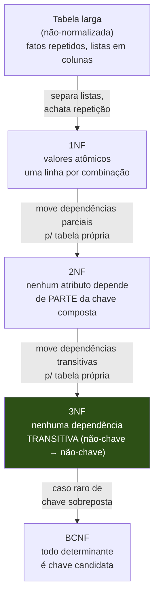
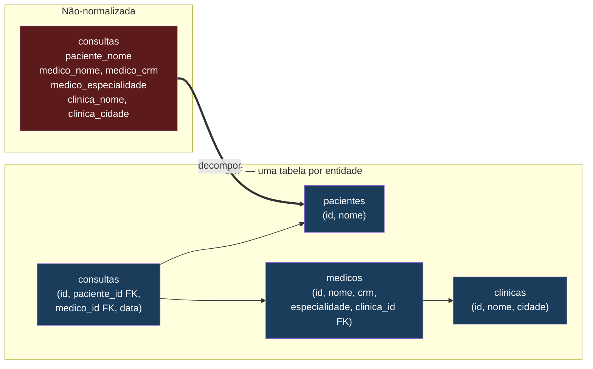
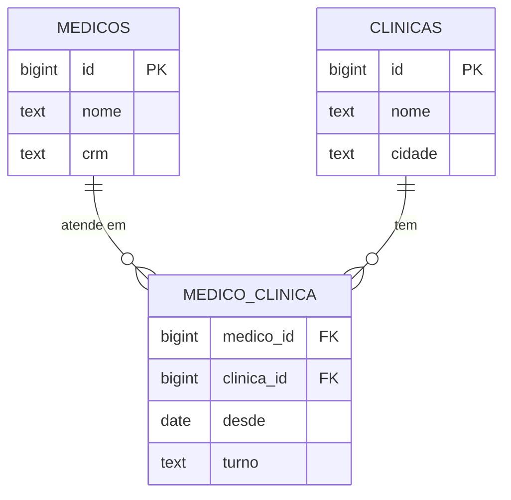
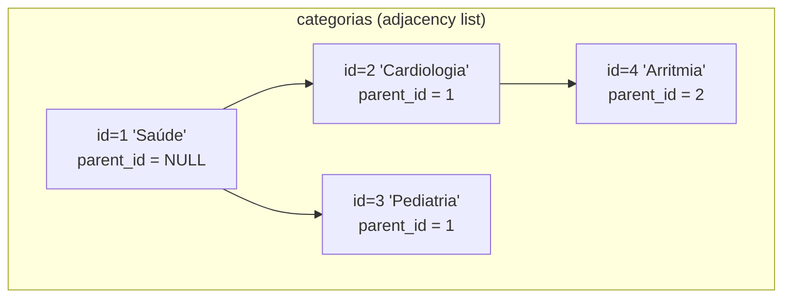
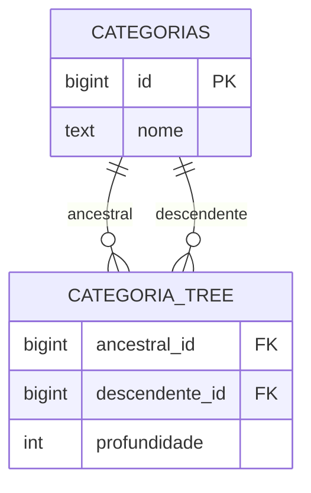
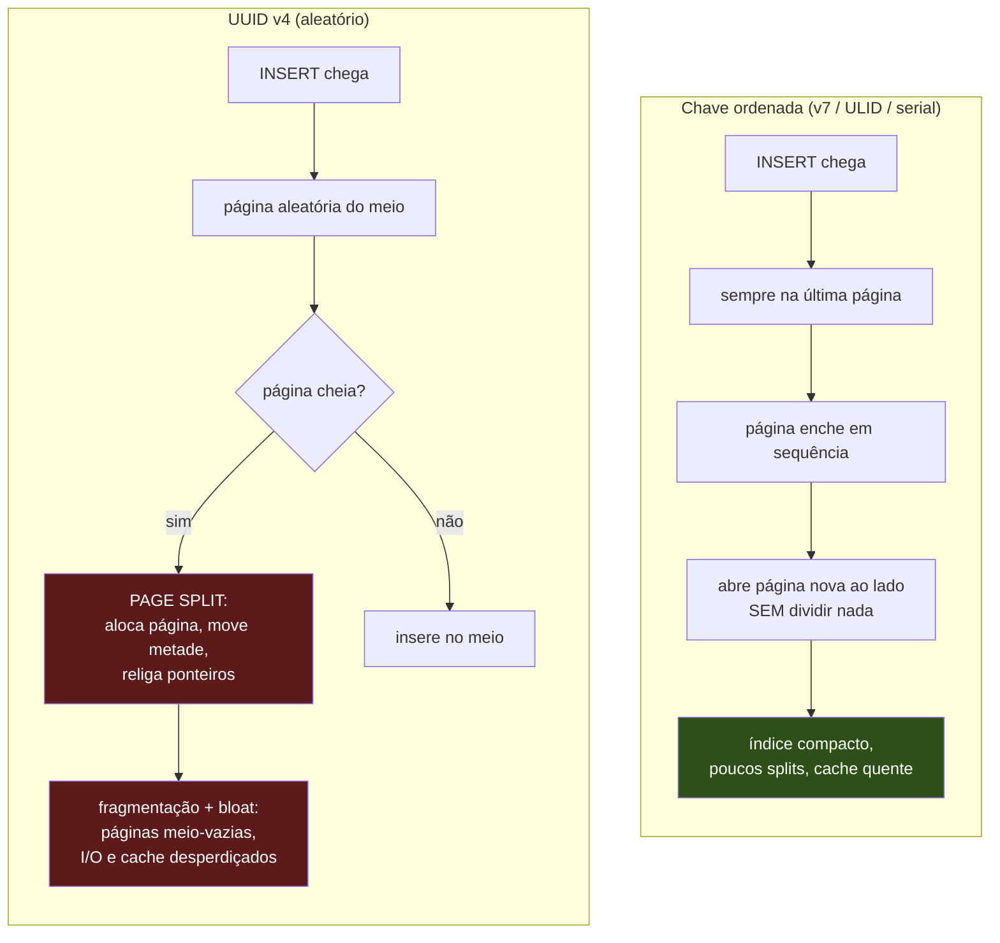

# Modelagem e normalização

Em [[02 - O modelo relacional]] você viu *de que* o banco é feito: tabelas, tuplas, chaves, integridade referencial. Em [[03 - SQL - consultas]] você viu *como* perguntar coisas a ele. Esta nota fecha o triângulo da fase Iniciado com a pergunta mais difícil das três: **como decidir o formato das tabelas antes de existir uma só linha de dado?**

Modelar é desenhar a planta de uma casa. Um schema mal desenhado não cai no primeiro dia — ele racha devagar, sob carga, anos depois, quando já há 20 milhões de linhas e qualquer correção custa uma migração com janela de manutenção. Por isso modelagem é a área onde a senioridade mais aparece: não há sintaxe para decorar, há **julgamento** para exercer.

A boa notícia é que existe uma teoria sólida embaixo desse julgamento — a **normalização** — e ela cabe num punhado de regras que você consegue aplicar de cabeça. A má notícia é que a teoria sozinha leva a schemas lentos; o senior sabe quando *desobedecer* (a **desnormalização intencional**). Esta nota cobre as duas metades.

> [!abstract] Resumo em uma linha
> Normalize até 3NF para eliminar redundância e anomalias; desnormalize cirurgicamente, com um mecanismo de consistência, só quando uma query dominante provar que vale.

---

## Por que a forma da tabela importa: as anomalias

Antes de qualquer regra, é preciso entender *qual dor* a normalização cura. A dor tem nome: **anomalias de modificação**. Elas aparecem sempre que o mesmo fato vive guardado em mais de um lugar.

Imagine uma única tabela larga, do jeito que um iniciante desenharia o cadastro de consultas:

| consulta_id | paciente_nome | medico_nome | medico_crm | medico_especialidade | clinica_nome | clinica_cidade |
| --- | --- | --- | --- | --- | --- | --- |
| 1 | Ana | Dr. Souza | CRM-1234 | Cardiologia | Clínica Vida | Belo Horizonte |
| 2 | Bruno | Dr. Souza | CRM-1234 | Cardiologia | Clínica Vida | Belo Horizonte |
| 3 | Carla | Dra. Lima | CRM-5678 | Pediatria | Clínica Sol | Contagem |

O fato "Dr. Souza é cardiologista" está repetido em toda linha de consulta dele. Daí nascem três pragas clássicas:

- **Anomalia de atualização (update anomaly):** o Dr. Souza muda de especialidade. Se você esquecer uma única linha, o banco passa a afirmar duas verdades contraditórias sobre o mesmo médico. A redundância criou a possibilidade de mentir.
- **Anomalia de inserção (insertion anomaly):** uma clínica nova abriu mas ainda não tem consultas. Onde guardo "Clínica Lua fica em Sabará"? Não dá — não existe linha para pendurar o fato, porque a linha é uma *consulta*. Você seria forçado a inventar consultas-fantasma.
- **Anomalia de exclusão (deletion anomaly):** a última consulta da Dra. Lima é cancelada e a linha 3 some. Junto com ela some o único registro de que a Dra. Lima existe e é pediatra. Apagar um fato apagou outro, sem querer.

> [!tip] A intuição que sustenta tudo
> Cada fato do mundo deve viver em **exatamente um lugar** do banco — "one fact, one place". Quando um fato está em dois lugares, os dois podem divergir, e divergência é corrupção silenciosa. A normalização é só o procedimento mecânico de garantir essa propriedade.

---

## Normalização: o procedimento em quatro degraus

Normalizar é decompor uma tabela larga em tabelas menores, ligadas por chaves, de modo que cada fato apareça uma vez só. As **formas normais** (normal forms) são níveis crescentes de rigor — cada uma assume que a anterior já foi satisfeita. Vou subir os quatro degraus que importam (1NF → 2NF → 3NF → BCNF) com um exemplo de **quebra → conserto** em cada um.



**Leitura do diagrama:** cada seta é uma operação de decomposição que remove um tipo específico de redundância. A caixa verde, 3NF, é o alvo prático — é onde 99% dos schemas de produção devem parar. Subir até BCNF é raro; ficar abaixo de 3NF é quase sempre um defeito esperando para virar bug.

### 1NF — valores atômicos

**Regra:** cada célula contém um valor único e indivisível. Sem listas, sem campos multivalorados, sem "CSV dentro da coluna".

**Quebra.** Alguém guarda os telefones de um paciente assim:

| paciente_id | nome | telefones |
| --- | --- | --- |
| 1 | Ana | "31-9999, 31-8888" |

Parece econômico, mas você acabou de perder o SQL. `WHERE telefones = '31-8888'` não acha nada (o valor real é a string inteira). Ordenar, indexar, contar telefones — tudo vira manipulação de string frágil.

**Conserto.** Telefone vira uma linha por valor, numa tabela própria com FK de volta ao paciente:

| telefone_id | paciente_id | numero |
| --- | --- | --- |
| 1 | 1 | 31-9999 |
| 2 | 1 | 31-8888 |

Agora cada telefone é um fato atômico, pesquisável e indexável. Esse já é o relacionamento **1:N** que a gente formaliza adiante.

> [!warning] A exceção JSONB que confunde
> "Mas o PostgreSQL tem coluna `JSONB`, isso não viola 1NF?" Pragmaticamente, sim — você está guardando estrutura dentro de uma célula. A regra de bolso: use `JSONB` para dados *que você não consulta por dentro como se fossem colunas* (payloads de auditoria, blobs de configuração, respostas de API externas). No instante em que você precisa de `WHERE`, `JOIN` ou `ORDER BY` sobre um campo interno, esse campo merece virar coluna. JSONB é uma válvula de escape consciente, não um substituto para modelar.

### 2NF — dependência total da chave composta

A 2NF só tem o que dizer quando a chave primária é **composta** (formada por mais de uma coluna). Se a sua PK é uma coluna só, você pula este degrau de graça.

**Regra:** todo atributo não-chave depende da **chave inteira**, nunca de só uma parte dela. Uma dependência de parte da chave é uma **dependência parcial (partial dependency)**.

**Quebra.** Tabela de itens de uma prescrição médica, com chave composta `(prescricao_id, medicamento_id)`:

| prescricao_id | medicamento_id | quantidade | medicamento_nome | medicamento_fabricante |
| --- | --- | --- | --- | --- |
| 10 | 7 | 2 | Losartana | EMS |
| 11 | 7 | 1 | Losartana | EMS |

`quantidade` depende da chave inteira (a quantidade *daquele remédio naquela prescrição*) — está certo. Mas `medicamento_nome` e `medicamento_fabricante` dependem **só de `medicamento_id`**, metade da chave. Resultado: "Losartana é da EMS" se repete em toda prescrição que a usa — redundância e anomalia de update de volta.

**Conserto.** O que depende só do medicamento vai para a tabela de medicamentos; a tabela de itens fica só com o que depende do par:

```
medicamentos(medicamento_id PK, nome, fabricante)
prescricao_itens(prescricao_id, medicamento_id, quantidade)   -- PK composta
```

Agora "Losartana é da EMS" mora num lugar só.

### 3NF — sem dependência transitiva

**Regra:** nenhum atributo não-chave depende de **outro atributo não-chave**. Quando A determina B e B determina C, dizer C a partir de A é uma **dependência transitiva (transitive dependency)** — e ela tem que sumir.

**Quebra.** Tabela de médicos com a clínica embutida:

| medico_id | nome | clinica_id | clinica_nome | clinica_cidade |
| --- | --- | --- | --- | --- |
| 1 | Dr. Souza | 50 | Clínica Vida | Belo Horizonte |
| 2 | Dra. Reis | 50 | Clínica Vida | Belo Horizonte |

A cadeia é `medico_id → clinica_id → clinica_nome`. O nome da clínica não depende do médico; depende da clínica, que por acaso está pendurada no médico. Se a Clínica Vida muda de nome, você reescreve a linha de *cada* médico dela — anomalia de update outra vez.

**Conserto.** A clínica vira entidade própria; o médico guarda só a FK:

```
clinicas(clinica_id PK, nome, cidade)
medicos(medico_id PK, nome, clinica_id FK)
```

Vamos ver a progressão dessa decomposição num diagrama, porque é o coração da nota:



**Leitura do diagrama:** a caixa vermelha à esquerda é o pecado original — uma tabela que mistura pacientes, médicos e clínicas dentro do registro de consulta. À direita, cada *coisa do mundo* virou sua própria tabela (azul), e a consulta guarda apenas **chaves estrangeiras** apontando para elas. Agora "Clínica Vida fica em BH" e "Dr. Souza é cardiologista" cada um aparece **uma vez só**. As três anomalias do começo da nota desaparecem por construção.

> [!note] A regra prática que você leva para a entrevista
> **Mire 3NF. Acima disso é exercício acadêmico; abaixo disso é quase sempre erro.** Na prática, modelar "uma tabela por substantivo do domínio, ligadas por FK" entrega 3NF naturalmente, sem você ficar provando dependências funcionais no quadro. A teoria é a justificativa; o instinto de "uma entidade, uma tabela" é a ferramenta do dia a dia.

### BCNF — o degrau a mais (e por que você raramente sobe)

A **Boyce-Codd Normal Form** é uma 3NF mais estrita. **Regra:** *todo determinante é uma chave candidata* — ou seja, qualquer coluna (ou conjunto) que determine outra coluna precisa ser, ela mesma, uma chave candidata da tabela.

A diferença com 3NF só morde num caso patológico: tabelas com **chaves candidatas sobrepostas e compostas**. O exemplo de manual: `(aluno, disciplina) → professor`, mas também `professor → disciplina` (cada professor leciona uma disciplina só). Aqui `professor` determina `disciplina` sem ser chave candidata — a tabela está em 3NF mas viola BCNF. O conserto é decompor para que `professor → disciplina` viva numa tabela própria.

Na prática profissional, com surrogate keys de uma coluna só (o que você vai usar quase sempre, ver adiante), **3NF e BCNF colapsam para o mesmo schema**. Por isso BCNF é mais um item de cultura de entrevista do que uma ferramenta cotidiana: saiba dizer o que é ("todo determinante é chave candidata"), saiba que existe acima de 3NF, e siga sua vida em 3NF.

---

## Desnormalização intencional: quando desobedecer

Normalização otimiza para **integridade de escrita** — cada fato num lugar só, impossível de divergir. Mas ela cobra um preço na **leitura**: para montar uma tela, você junta (`JOIN`) muitas tabelas, e em alta escala esses JOINs custam caro.

A **desnormalização (denormalization)** é a manobra reversa, feita de propósito: você reintroduz redundância *controlada* para acelerar uma leitura específica. Não é voltar ao schema do iniciante — é uma exceção cirúrgica num schema que já é 3NF, feita com olhos abertos para o custo.

**Quando vale a pena (os três sinais juntos):**

1. Existe uma **query dominante** — chamada o tempo todo — que continua cara mesmo com índices bem postos.
2. O dado redundante **muda raramente** comparado à frequência com que é **lido**. Redundância de algo que muda toda hora é só sofrimento.
3. Você tem um **mecanismo de consistência** para manter a cópia em dia: um *trigger*, um *domain event*, um *batch* periódico, ou uma *materialized view*.

**O custo, dito sem rodeios:** você troca simplicidade de escrita por velocidade de leitura. A cópia *pode* divergir da fonte, e você assume a responsabilidade de impedir isso. Toda desnormalização é uma dívida de consistência que você se compromete a pagar.

> [!example] Na prática — `total_avaliacoes` no MedEspecialista
> No MedEspecialista, a tabela de avaliações tinha um `SELECT COUNT(*)` sendo disparado em **todo list de médicos** — eu listava médicos e, para cada um, contava as avaliações dele. Era a query dominante e era cara. Desnormalizei: criei a coluna `total_avaliacoes` direto no médico, atualizada por **domain event** após cada avaliação registrada. O endpoint de listagem ganhou **uma ordem de magnitude** de performance. Os três sinais estavam todos lá: query dominante cara, contagem que muda muito menos do que é lida, e um evento de domínio pronto para manter a coluna consistente sem trigger no banco.

Repare na anatomia da decisão: o estado normalizado (contar as avaliações sob demanda) nunca mente, mas é lento. A coluna desnormalizada é rápida, mas só permanece verdadeira porque *algo* — o domain event — se compromete a incrementá-la. Tire o mecanismo de consistência e a desnormalização vira aquela "tabela larga" do começo da nota, com todas as anomalias de volta. O mecanismo **é** a desnormalização; a coluna é só o efeito.

---

## Relacionamentos: as quatro formas de ligar tabelas

Modelar é, em grande parte, escolher como duas entidades se conectam. Há quatro cardinalidades, e cada uma tem uma implementação canônica.

### 1:1 — raro, geralmente achatável

Cada A tem no máximo um B e vice-versa. Na prática isso quase sempre quer dizer que **A e B deveriam ser a mesma tabela**. Os poucos casos legítimos: separar colunas raramente acessadas e pesadas (um `medico_biografia` com texto enorme que você não quer carregar em toda query de médico), ou isolar dados sensíveis com permissões diferentes. Regra: ao ver um 1:1, sua primeira pergunta é "por que isso não é uma tabela só?".

### 1:N — o pão com manteiga

Cada A tem muitos B, mas cada B pertence a um A só. É o relacionamento mais comum do mundo. **Implementação:** a FK mora no lado **N**. Um paciente tem muitas consultas → `consultas.paciente_id` aponta para `pacientes.id`. A FK fica sempre no lado "muitos", apontando para o lado "um". (Decore isso: em entrevista, "onde vai a FK num 1:N?" tem uma resposta certa — no lado N.)

### N:M — a tabela de junção

Cada A se relaciona com muitos B *e* cada B com muitos A. Médicos atendem em várias clínicas; cada clínica tem vários médicos. Não existe lugar para pendurar uma FK que dê conta disso numa das duas tabelas — você precisa de uma **terceira tabela**, a **tabela de junção (join table / associative table)**, cuja única missão é registrar pares.



**Leitura do diagrama:** `MEDICO_CLINICA` no centro é a tabela de junção. Cada uma das duas entidades tem um relacionamento **1:N** com ela (`||--o{` lê-se "um para zero-ou-muitos"), e o efeito combinado é o **N:M** entre médicos e clínicas. A chave primária da junção é o par `(medico_id, clinica_id)` — o que, de quebra, impede duplicar a mesma associação. E note `desde` e `turno`: a tabela de junção é o lugar natural para **atributos do relacionamento em si** (desde quando o médico atende ali, em que turno). Esse é um superpoder que muita gente esquece — o relacionamento pode carregar dados próprios.

### Auto-relacionamento — hierarquias e árvores

Quando uma entidade se relaciona **consigo mesma**: categorias com subcategorias, comentários com respostas, funcionários com chefes, a árvore de especialidades médicas. Aqui não há uma resposta única — há quatro padrões com trade-offs bem diferentes. Os dois extremos que você precisa dominar são **adjacency list** e **closure table** (os outros dois, *path enumeration* e *nested set*, ficam citados).

**Adjacency list — cada nó aponta para o pai.** É o mais simples e o ponto de partida default: uma coluna `parent_id` que é FK para a própria tabela.



**Leitura do diagrama:** cada caixa é uma linha da tabela `categorias`. A hierarquia inteira vive numa coluna só — `parent_id` —, e a raiz se marca com `parent_id = NULL`. Inserir, mover e apagar um nó é trivial (mexe em uma linha). O ponto fraco aparece em "me dê *toda* a subárvore de Saúde": você não sabe a profundidade de antemão, então precisa de uma **CTE recursiva** (`WITH RECURSIVE`, ver [[03 - SQL - consultas]]) que desce nível por nível. Para árvores rasas e leitura moderada, perfeito. Para árvores fundas lidas o tempo todo, a recursão pesa.

**Closure table — guarda todos os caminhos.** O extremo oposto: uma tabela separada que registra **toda relação ancestral-descendente**, não só pai-filho direto. Para a árvore `Saúde → Cardiologia → Arritmia`, a closure table guarda *todos* os pares, inclusive os de profundidade maior que 1 e os de cada nó consigo mesmo:



Com os dados (ancestral, descendente, profundidade): `(Saúde, Saúde, 0)`, `(Saúde, Cardiologia, 1)`, `(Saúde, Arritmia, 2)`, `(Cardiologia, Cardiologia, 0)`, `(Cardiologia, Arritmia, 1)`, `(Arritmia, Arritmia, 0)`...

**Leitura do diagrama:** `CATEGORIA_TREE` materializa de antemão *todo* par ancestral→descendente da árvore. O ganho é que perguntas de hierarquia viram um `WHERE` plano, **sem recursão**: "toda a subárvore de Saúde" é `WHERE ancestral_id = 1`; "todos os ancestrais de Arritmia" é `WHERE descendente_id = 4`. Leituras de subárvore ficam baratíssimas. O custo é simétrico: **escrita e espaço**. Inserir ou mover um nó exige recalcular vários pares (uma subárvore de N níveis gera ordem de N² linhas no pior caso), e o espaço cresce rápido com a profundidade.

> [!tip] Como escolher entre os quatro
> - **Adjacency list:** default. Simples, espaço-eficiente, escrita barata; leitura de subárvore via CTE recursiva. Comece sempre aqui.
> - **Closure table:** quando leituras de subárvore/ancestrais são frequentes e críticas, e a árvore muda pouco. Troca espaço e custo de escrita por leitura plana e rápida. Bônus: a tabela de caminhos pode carregar atributos da aresta.
> - **Path enumeration** (guardar o caminho como string, ex. `'/1/2/4'`): leitura por prefixo fácil (`LIKE '/1/2/%'`), mas mover subárvores e manter integridade é frágil.
> - **Nested set** (numerar com `left`/`right`): leitura de subárvore relâmpago, mas *qualquer* inserção renumera meia árvore — péssimo para hierarquias que mudam.
>
> Não decore os quatro para a vida; decore **adjacency list como default** e **closure table como o upgrade quando a leitura domina**. Os dois extremos cobrem a conversa.

---

## Chaves: natural vs surrogate

Toda tabela precisa de uma chave primária — o identificador único de cada linha. Há duas filosofias para escolhê-la.

- **Natural key (chave natural):** uma coluna que já tem **significado de negócio** e por acaso é única. CPF de uma pessoa, CRM de um médico, ISBN de um livro, e-mail de um usuário.
- **Surrogate key (chave substituta):** um valor **sem nenhum significado de negócio**, criado só para ser a chave. Um inteiro auto-incremento, um UUID, um ULID.

**O default profissional:** PK **surrogate**, e a chave natural vira uma constraint `UNIQUE` ao lado. Você ganha o melhor dos dois — um identificador interno estável *e* a garantia de que não há dois médicos com o mesmo CRM.

Por que não usar a natural direto como PK? Três motivos que se reforçam:

1. **Naturais mudam.** "CPF nunca muda" é falso: digitação errada no cadastro, troca por decisão judicial, fusão de registros duplicados. E quando a PK muda, ela muda em **cascata** por toda FK que aponta para ela — um pesadelo. A surrogate, por não significar nada, **nunca** precisa mudar.
2. **Eficiência em índice e JOIN.** Um `BIGINT` de 8 bytes é menor e compara mais rápido que um CPF em texto ou um e-mail longo. Como a PK é replicada em toda FK e em todo índice secundário, esse tamanho se multiplica pelo banco inteiro. Chave estreita = índices menores = mais linhas por página = menos I/O.
3. **Privacidade e estabilidade de API.** Expor o e-mail ou o CPF como identificador em URLs e payloads vaza dado pessoal e amarra sua API a um valor que pode mudar. Um id opaco não vaza nada.

> [!note] A exceção honesta
> Em **tabelas de junção** N:M puras, a chave natural composta `(medico_id, clinica_id)` costuma ser a PK certa — ela já é estável (são duas surrogates) e já expressa a regra "um par só aparece uma vez". Aqui adicionar uma terceira surrogate seria cerimônia sem ganho. Regra fina, mas cai em entrevista.

---

## IDs: qual surrogate escolher

Decidido que a PK será surrogate, falta o tipo do valor. A escolha tem consequências de performance que vão fundo no [[07 - Índices]], e é um clássico de entrevista de senior. Quatro candidatos:

| Tipo | Ordenável | Tamanho | Gera fora do banco | Fragmenta B-Tree | Expõe volume |
| --- | --- | --- | --- | --- | --- |
| Auto-increment (`BIGSERIAL`) | sim | 8 bytes | não | não | sim |
| UUID v4 | não (aleatório) | 16 bytes | sim | **sim** (ruim) | não |
| UUID v7 / ULID | sim (por tempo) | 16 bytes / 26 chars | sim | não | parcial |
| Snowflake (Twitter) | sim | 8 bytes | sim | não | parcial |

Lendo as colunas como dimensões de decisão:

- **Auto-increment** é compacto, ordenado e rápido, mas tem dois defeitos. Só o banco pode gerá-lo (você não sabe o id antes do `INSERT` voltar), e ele **expõe volume**: id 10.000 no pedido conta ao mundo quantos pedidos você já teve, e ids sequenciais permitem *enumeration attacks* (varrer `/pedido/1`, `/pedido/2`...).
- **UUID v4** é 128 bits **aleatórios**. Resolve geração distribuída (qualquer serviço cria um, colisão é astronomicamente improvável) e não expõe volume. O problema mora na próxima seção.
- **UUID v7 / ULID** são a geração moderna: 128 bits onde os bits **mais significativos são um timestamp**, seguidos de aleatoriedade. Mantêm a geração distribuída e a opacidade do v4, mas, por começarem com o tempo, **ordenam por criação** — e é isso que salva o índice.
- **Snowflake** empacota timestamp + id de máquina + sequência em 64 bits ordenados. Compacto e ordenado, mas exige coordenar ids de máquina entre os geradores. Comum em escala muito alta (o nome vem do Twitter).

### Por que UUID v4 fragmenta a B-Tree

Este é o detalhe que separa quem decorou a tabela de quem entende. O índice de PK do PostgreSQL é uma **B-Tree** ([[09 - Árvores B e índices]] mostra a estrutura por dentro), e B-Trees guardam as chaves **em ordem**, distribuídas em **páginas** de tamanho fixo (8 KB no Postgres). Inserir uma chave significa colocá-la na página *certa* segundo a ordem.

Com chaves **ordenadas** (auto-increment, v7, ULID), todo `INSERT` cai no **fim** do índice, na última página, que vai enchendo e abrindo uma nova ao lado. Limpo, sequencial, cache-friendly.

Com **UUID v4 aleatório**, cada `INSERT` cai numa página **aleatória** do meio do índice. Quando essa página já está cheia, o banco precisa **dividi-la** (*page split*): aloca uma página nova, move metade das chaves para ela e reorganiza os ponteiros. Inserts aleatórios espalhados pelo índice disparam page splits o tempo todo, e o efeito é cumulativo.



**Leitura do diagrama:** os dois caminhos partem do mesmo `INSERT` e divergem por **onde** a chave aterrissa. À esquerda, a chave ordenada sempre vai para o fim — as páginas enchem em sequência e o índice fica denso. À direita, o UUID v4 cai num ponto aleatório; quando bate numa página cheia, dispara o **page split**, que deixa páginas meio-vazias espalhadas (o **bloat**). O resultado medido em benchmarks de Postgres com tabelas grandes é dramático: UUID v7 chega a **2–5× mais throughput de INSERT** e **60–80% menos bloat de índice** que UUID v4. O índice fragmentado também é maior, então cabe menos dele em memória — você paga de novo em cache miss e I/O nas *leituras*.

> [!example] Na prática — migração de `BIGINT` auto-increment para ULID
> Quando quebramos o monolito do MedEspecialista em serviços, migrei a geração de IDs de `BIGINT` auto-increment para **ULID**. O motivo não foi performance de índice — foi arquitetura: precisávamos **gerar o id no serviço, antes de publicar o evento de domínio**, sem depender de um round-trip ao banco para descobrir qual id o registro recebeu. Com auto-increment isso é impossível (o número só existe depois do `INSERT`). ULID resolveu a geração distribuída e, **por ser ordenável por tempo**, esquivou da fragmentação de B-Tree que o UUID v4 teria nos custado nas tabelas que mais crescem. Foi o melhor dos dois mundos: id gerável no código *e* índice que não degrada.

### A recomendação moderna, em uma frase

Use **UUID v7 ou ULID** como PK quando precisar de ids geráveis fora do banco (sistemas distribuídos, eventos, ids no front antes de persistir). Mantenha **auto-increment** apenas quando o banco for o único gerador *e* expor volume não for um problema. **Evite UUID v4 como PK** — ele resolve distribuição mas cobra em fragmentação; v7 e ULID resolvem distribuição *sem* a conta. (Para o mergulho na estrutura que sofre com isso, [[07 - Índices]] e [[09 - Árvores B e índices]].)

---

## O fio que liga tudo

Modelagem não é uma lista de regras isoladas — é uma sequência de decisões que se conversam. Normalize até 3NF para que cada fato viva num lugar só e as anomalias sejam impossíveis. Escolha as cardinalidades certas para ligar as entidades (FK no lado N, tabela de junção no N:M, adjacency list para hierarquias até a leitura provar que precisa de closure table). Dê a cada tabela uma surrogate key estável, com a chave natural de guarda como `UNIQUE`. E escolha o tipo do id pensando em quem gera e em como o índice vai se comportar sob inserts.

Depois de tudo isso normalizado e ligado, **e só depois**, abra espaço para a exceção: a desnormalização cirúrgica, com mecanismo de consistência, na query que provou doer. Essa ordem — normalizar primeiro, desnormalizar por evidência — é o que separa um schema que envelhece bem de um que racha sob carga.

O que vem a seguir são as consequências de tudo isso em operação: como os JOINs que esse modelo exige se pagam ou não em [[10 - Performance e armadilhas]], como os índices que escolhemos aqui funcionam por dentro em [[07 - Índices]], e como esse schema sobrevive quando vira distribuído em [[12 - Replicação, sharding e CAP]].

---

## Em entrevista

> "When I design a schema, I start by normalizing to third normal form — one fact in one place — which kills the update, insert, and delete anomalies by construction. In practice that means one table per domain entity, linked by foreign keys. I treat BCNF as theory; with single-column surrogate keys, 3NF and BCNF collapse to the same design anyway.
>
> Denormalization is a deliberate exception, never a starting point. I only add controlled redundancy when there's a dominant, expensive read query, the data changes rarely relative to how often it's read, and I have a consistency mechanism — a trigger, a domain event, or a batch job. On a real project I replaced a per-row `COUNT(*)` in a listing endpoint with a denormalized counter column kept in sync by a domain event, and it cut the endpoint latency by an order of magnitude.
>
> For keys, my default is a surrogate primary key with the natural key as a `UNIQUE` constraint — natural keys change and they leak business data; surrogates never change. For the id type, I avoid UUID v4 as a primary key because random inserts cause B-Tree page splits and index bloat. I reach for UUID v7 or ULID — time-ordered, so they append to the index, and still generatable outside the database, which matters in a distributed system where you need the id before publishing an event.
>
> For many-to-many I use a join table, and I remember it can carry attributes of the relationship itself. For hierarchies I start with an adjacency list and only move to a closure table when subtree reads become hot enough to justify the extra write cost and storage."

### Vocabulário

- normalização → normalization
- forma normal → normal form
- desnormalização → denormalization
- anomalia de atualização / inserção / exclusão → update / insertion / deletion anomaly
- dependência parcial → partial dependency
- dependência transitiva → transitive dependency
- atomicidade (de valor) → atomicity (atomic values)
- chave natural → natural key
- chave substituta → surrogate key
- chave candidata → candidate key
- chave estrangeira → foreign key
- tabela de junção → join table / associative table
- auto-relacionamento → self-referencing relationship
- lista de adjacência → adjacency list
- tabela de fechamento → closure table
- divisão de página → page split
- inchaço (de índice) → index bloat
- ordenável por tempo → time-ordered / time-sortable

---

> [!info] Lastro
> - **Formas normais (1NF–BCNF), dependências parcial/transitiva:** as definições seguem o cânone de Codd/Boyce-Codd e batem com tratamentos didáticos atuais (DigitalOcean *Database Normalization*, DataCamp *Third Normal Form*, Codecademy). A regra "mire 3NF, BCNF é raro" é consenso prático, não dogma — schemas com chaves compostas sobrepostas justificam subir até BCNF.
> - **UUID v7 / ULID e fragmentação de B-Tree:** UUID v7 é especificado na RFC 9562 (2024) e é time-ordered por design; ULID é especificação independente com a mesma propriedade. Os números citados (2–5× INSERT, 60–80% menos bloat) vêm de benchmarks publicados em Postgres com tabelas grandes (DEV Community / Medium, 2024–2025) — são *ordens de grandeza ilustrativas*, não garantia: o ganho real depende de fillfactor, hardware, e padrão de carga. A direção (aleatório fragmenta, ordenado não) é robusta e independe do benchmark.
> - **Padrões de hierarquia (adjacency list, closure table, nested set, path enumeration):** taxonomia clássica (Joe Celko, *Trees and Hierarchies in SQL*); trade-offs confirmados em material atual de PostgreSQL/SQL Server (Red Gate Simple Talk, Ackee blog).
> - **Ressalva geral:** voz-padrão **PostgreSQL** (página de 8 KB, `BIGSERIAL`, REPEATABLE READ = snapshot). MySQL/InnoDB difere em detalhes (clustered index pela PK torna a fragmentação por UUID v4 *ainda* mais severa). As experiências do MedEspecialista são do autor.
> - **Fontes verificadas (WebSearch, jun/2026):** DigitalOcean — *Database Normalization: 1NF, 2NF, 3NF & BCNF*; DataCamp — *What is Third Normal Form (3NF)?*; DEV Community — *PostgreSQL UUID Performance: Benchmarking Random (v4) and Time-based (v7) UUIDs*; Medium (A. K. Emara) — *Goodbye Random Inserts: UUIDv7 vs ULID vs UUIDv4*; Red Gate Simple Talk — *SQL Server Closure Tables*; Ackee — *Hierarchical models in PostgreSQL*.

## Veja também

- [[02 - O modelo relacional]] — tabelas, chaves, integridade referencial (a base desta nota)
- [[03 - SQL - consultas]] — JOINs e CTEs recursivas que percorrem os relacionamentos modelados aqui
- [[07 - Índices]] — o que a fragmentação por UUID v4 faz com a B-Tree, e que índice criar
- [[09 - Árvores B e índices]] — a estrutura B-Tree por dentro (galho Estruturas de Dados)
- [[10 - Performance e armadilhas]] — quando os JOINs deste modelo custam caro e como reagir
- [[12 - Replicação, sharding e CAP]] — por que ids geráveis fora do banco importam em distribuído
