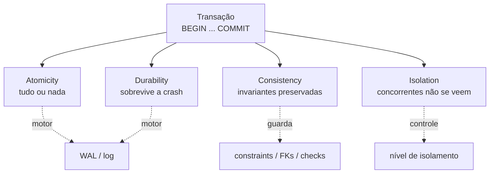
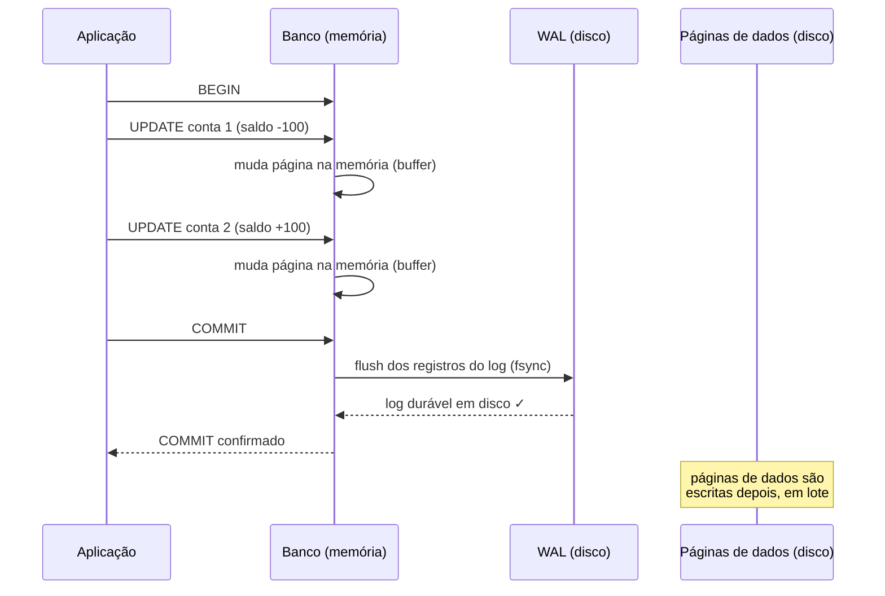
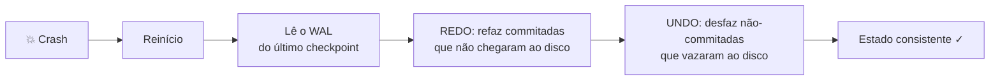
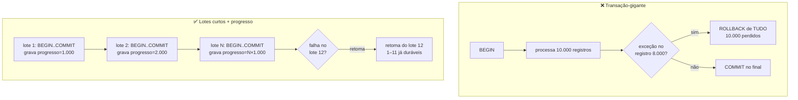

# Transações e ACID

> [!abstract] TL;DR
> Uma transação é uma **unidade atômica de trabalho**: um pacote de operações que o banco
> trata como uma única coisa indivisível. **ACID** são as quatro promessas que o banco faz
> sobre esse pacote — **A**tomicidade (tudo ou nada), **C**onsistência (invariantes
> preservadas), **I**solamento (concorrentes não se atrapalham) e **D**urabilidade (sobrevive
> a crash). O motor por trás de Atomicidade e Durabilidade é o **WAL** (write-ahead log).
> Na aplicação, `@Transactional` faz tudo isso por você — mas é um **proxy**, e proxies têm
> pegadinhas. Interview-critical.

## A transação: o pacote indivisível

Você já transferiu dinheiro entre duas contas? Pense no que tem que acontecer por baixo:
debitar R$ 100 de uma conta e creditar R$ 100 em outra. São **dois** comandos `UPDATE`.

E se o banco cair logo depois do primeiro? O dinheiro simplesmente sumiu. Saiu de uma conta
e não chegou na outra. R$ 100 evaporaram porque a luz caiu no milissegundo errado.

Esse é o problema que a transação resolve. Uma **transação** é um agrupamento de operações
que o banco se compromete a tratar como **uma única operação indivisível**: ou as duas contas
mudam, ou nenhuma muda. Nunca um estado intermediário onde só uma mudou.

```sql
BEGIN;
UPDATE contas SET saldo = saldo - 100 WHERE id = 1;  -- debita
UPDATE contas SET saldo = saldo + 100 WHERE id = 2;  -- credita
COMMIT;  -- só agora as duas mudanças viram realidade, juntas
```

> [!tip] A analogia do contrato
> Uma transação é como assinar um contrato com cláusula "tudo ou nada". Você lista as
> obrigações (os comandos), e só no momento da assinatura final (o `COMMIT`) o contrato
> entra em vigor — inteiro. Se você rasgar o papel antes de assinar (`ROLLBACK`), é como se
> nada tivesse sido escrito. Não existe meio-contrato em vigor.

A transferência bancária é o exemplo clássico de entrevista justamente por ser intuitiva:
todo mundo entende por que "metade feito" seria catastrófico. Mas o mesmo raciocínio vale
para qualquer operação composta — criar um pedido e dar baixa no estoque, registrar uma
matrícula e cobrar a mensalidade, publicar um post e atualizar o contador. Sempre que duas
ou mais escritas **precisam acontecer juntas ou não acontecer**, você quer uma transação.

A modelagem que define *quais* tabelas e constraints essa transação toca vem de
[[04 - Modelagem e normalização]]; aqui falamos de *como* o banco protege essas escritas.

---

## ACID: as quatro promessas

ACID é o acrônimo das quatro garantias que um banco relacional faz sobre uma transação.
Não são quatro features independentes — são quatro ângulos da mesma ideia ("o pacote é
sagrado"). Vamos uma a uma.



**Lead-in:** o diagrama acima é o mapa mental da nota inteira. **Leitura do diagrama:**
a transação se desdobra em quatro garantias; repare que A e D compartilham o mesmo motor (o
WAL), que I é regulado por um botão (o nível de isolamento, tema da
[[06 - Isolamento e anomalias]]), e que C é defendida pelas constraints do schema.

### Atomicity — tudo ou nada

A transação é **atômica**: indivisível. Se qualquer passo falha — uma exceção, uma constraint
violada, uma queda — todos os efeitos anteriores são **revertidos** (`ROLLBACK`). O banco
volta ao estado de antes do `BEGIN`, como se a transação nunca tivesse existido.

Por que isso importa? Porque sem atomicidade você teria que escrever, na mão, a lógica de
"desfazer o que já fiz" toda vez que algo falha no meio. Já imaginou ter que lembrar de
estornar o débito porque o crédito deu erro? A atomicidade transfere essa
responsabilidade para o banco.

> A palavra vem do grego *átomos*, "indivisível". É a mesma raiz de "átomo" — a unidade que
> (acreditava-se) não podia ser quebrada. Uma transação atômica não pode ser quebrada ao meio.

### Consistency — as invariantes nunca quebram

O banco **nunca fica em estado inválido**. Toda regra que você declarou no schema —
`NOT NULL`, `UNIQUE`, `CHECK (saldo >= 0)`, foreign keys, triggers — é verdadeira **antes** da
transação e **depois** dela. Se um `COMMIT` deixaria uma dessas regras quebrada, o banco
aborta a transação inteira.

Note a sutileza: a consistência do ACID **não** garante que sua lógica de negócio esteja
correta. Se você esquecer de creditar a segunda conta, o banco não reclama — não há constraint
dizendo "a soma dos saldos é constante". A consistência do ACID garante apenas que as
**invariantes declaradas** são preservadas. A correção da lógica é sua; o banco só faz
cumprir as regras que você escreveu.

> [!warning] "Consistency" do ACID ≠ "Consistency" do CAP
> Esta é uma das confusões mais comuns em entrevista, e os dois usos batem de frente.
> - **No ACID**, consistência é sobre **invariantes do schema** dentro de **um** nó. "As
>   constraints continuam válidas após o commit."
> - **No CAP**, consistência é sobre **visibilidade entre réplicas** num sistema distribuído.
>   "Toda réplica responde com o dado mais recente."
>
> São conceitos ortogonais que por azar histórico ganharam o mesmo nome. Quando alguém
> disser "consistência", pergunte-se: estamos falando de constraints num banco, ou de
> réplicas convergindo? A versão distribuída mora em [[12 - Replicação, sharding e CAP]].

### Isolation — concorrentes não veem a sujeira alheia

Transações que rodam **ao mesmo tempo** não devem enxergar os estados intermediários umas
das outras. Enquanto a transação A está no meio do caminho (debitou mas ainda não creditou),
a transação B não deveria ver esse estado meio-feito.

Mas isolamento perfeito é caro: forçar transações a fila única mata a concorrência. Então o
banco oferece um **botão** — o **nível de isolamento** — que troca segurança por performance.
Quanto mais frouxo o nível, mais rápido e mais "anomalias" (leituras estranhas) podem
aparecer. Esse botão, as anomalias que cada posição permite (dirty read, phantom read, write
skew) e o MVCC que implementa tudo isso são o assunto inteiro de
[[06 - Isolamento e anomalias]]. Aqui basta saber: **isolamento é um espectro, não um
interruptor.**

### Durability — uma vez commitado, é para sempre

Depois que o `COMMIT` retorna sucesso, a transação **sobrevive a qualquer falha**: queda de
energia, crash do processo, reboot da máquina. Quando o banco diz "commitado", ele está
fazendo uma promessa com lastro físico — o dado está em armazenamento durável (disco/SSD),
não só na memória volátil que evapora quando a luz cai.

E como o banco cumpre essa promessa sem ser lento a ponto de ser inútil? A resposta é o WAL.

---

## WAL: como o banco promete durabilidade sem morrer de lentidão

Aqui está a tensão central da durabilidade. Escrever no lugar "certo" do disco é **caro**: os
dados de uma tabela estão espalhados em milhares de páginas, e atualizá-las significa pular o
disco/SSD de página em página (escrita **aleatória**). Se cada `COMMIT` tivesse que esperar
todas essas páginas chegarem ao disco, o banco rastejaria.

A solução é o **Write-Ahead Log (WAL)** — em português, "log de escrita antecipada". A regra
de ouro tem uma frase só:

> [!important] A regra do WAL
> **Antes de aplicar uma mudança nas páginas de dados, escreva primeiro uma descrição dessa
> mudança num log sequencial em disco.** *Write-ahead*: o log vem antes.

O truque é que escrever no log é **rápido**, porque é uma escrita **sequencial** (append no
final de um arquivo) — o tipo de escrita em que disco e SSD são mais eficientes. Em vez de
pular o disco todo atualizando páginas espalhadas, o banco rabisca "mudei X para Y, mudei Z
para W" no fim de um caderno e pronto. As páginas de dados em si podem ser atualizadas
**depois**, com calma, em lote (a isso se chama *no-force* — não força a página no commit).



**Lead-in:** acompanhe quem toca o disco e quando. **Leitura do diagrama:** durante a
transação, as mudanças vivem só na **memória** (o buffer). O momento crítico é o `COMMIT`:
o banco força (`fsync`) os registros do **log** para o disco e só então confirma o commit
para a aplicação. As páginas de dados reais só vão para o disco **mais tarde**. Ou seja: no
instante do commit, o que está garantido em disco é o **log**, não os dados — e isso basta.

Por que basta? Porque o log é a **fonte da verdade** para recuperação. Se o banco crashar com
páginas de dados ainda desatualizadas em disco, no próximo boot ele faz **recovery**: lê o
WAL e **refaz** (*redo*) todas as transações commitadas cujas páginas não tinham sido
gravadas, e **desfaz** (*undo*) as não-commitadas que vazaram para o disco. O log diz
exatamente o que aconteceu; o banco só reexecuta o roteiro.



**Lead-in:** este é o ciclo de recovery após uma queda. **Leitura do diagrama:** o banco
não "adivinha" o que estava acontecendo — ele **lê o log** e reexecuta. Redo garante que nada
commitado se perde (durabilidade); undo garante que nada pela metade sobrevive (atomicidade).
Repare que **A e D saem do mesmo mecanismo** — é por isso que o diagrama lá em cima ligava as
duas ao mesmo motor.

Essa ideia é antiga e universal. O algoritmo de referência é o **ARIES** (IBM, anos 90), que
formalizou o "redo/undo/no-force" que praticamente todo banco usa hoje. No PostgreSQL chama-se
**WAL**; no MySQL/InnoDB, o mesmo conceito atende pelo nome de **redo log**. Nomes diferentes,
mesma mecânica: *escreva no log antes de aplicar.*

> [!tip] Bônus: o WAL não serve só para recovery
> Como o WAL é um registro fiel e ordenado de **tudo** que mudou, ele vira a base de outras
> features: **replicação** (o standby reaplica o WAL do primary — ver
> [[12 - Replicação, sharding e CAP]]), **PITR** (point-in-time recovery: restaure um backup
> e reaplique o WAL até o segundo desejado) e **change data capture**. Um único log, vários
> usos.

---

## Controlando a transação: a sintaxe

### BEGIN, COMMIT, ROLLBACK

O trio fundamental. `BEGIN` abre a transação; `COMMIT` torna tudo permanente (e durável);
`ROLLBACK` joga tudo fora.

```sql
BEGIN;
  UPDATE estoque SET qtd = qtd - 1 WHERE produto_id = 7;
  INSERT INTO pedidos (produto_id, cliente_id) VALUES (7, 42);
COMMIT;  -- baixa no estoque e pedido nascem juntos, ou nenhum dos dois
```

Se algo der errado entre o `BEGIN` e o `COMMIT` — uma exceção na aplicação, uma constraint
violada — você emite `ROLLBACK` e o banco desfaz tudo.

### Autocommit: você já está em transação (sempre)

Eis uma sutileza que confunde muita gente: **toda** instrução SQL roda dentro de uma transação,
sempre. Quando você executa um `UPDATE` solto, sem `BEGIN`, o banco automaticamente o envolve
numa transação de um comando só e commita no final. Isso é o **autocommit**.

> [!question] "Mas eu nunca escrevi BEGIN e meu UPDATE funcionou..."
> Funcionou porque o autocommit abriu e fechou a transação por você. Cada statement solto =
> uma micro-transação atômica. Você só precisa do `BEGIN` explícito quando quer agrupar
> **vários** comandos numa única unidade atômica. A pergunta não é "estou em transação?"
> (você sempre está) — é "quantos comandos cabem nesta transação?".

### SAVEPOINT: rollback parcial

Às vezes você não quer jogar a transação inteira fora — só voltar até um ponto. O `SAVEPOINT`
cria um marco intermediário ao qual você pode retornar sem abortar tudo.

```sql
BEGIN;
  INSERT INTO log (msg) VALUES ('início');
  SAVEPOINT antes_do_risco;
  UPDATE saldo SET valor = valor - 1000 WHERE id = 1;  -- operação arriscada
  -- deu ruim? volta só até aqui, o INSERT do log sobrevive
  ROLLBACK TO SAVEPOINT antes_do_risco;
  INSERT INTO log (msg) VALUES ('rollback parcial executado');
COMMIT;
```

**Leitura:** o `ROLLBACK TO SAVEPOINT` desfaz só o que veio **depois** do marco. O primeiro
`INSERT` (antes do savepoint) e o último (depois do rollback parcial) ambos sobrevivem ao
`COMMIT`. É um "ctrl-Z" granular dentro da transação. Útil em loops onde um item pode falhar
sem condenar os outros.

---

> [!note] Java — `@Transactional` é um proxy, e isso muda tudo
> Na vida real você quase nunca escreve `BEGIN/COMMIT` na mão. No Spring, você anota um método
> com `@Transactional` e o framework abre a transação na entrada, commita na saída normal e
> dá `rollback` se uma exceção (por padrão, *unchecked*) escapar. Limpo. Mas há uma armadilha
> que vale uma vaga: **como** o Spring faz isso.
>
> O Spring **não** reescreve seu método. Ele embrulha o seu bean num **proxy** — um objeto
> intermediário que intercepta as chamadas, abre a transação, chama o método real e commita.
> Toda a mágica do `@Transactional` mora **no proxy**, não no seu código. Daí saem duas
> consequências que derrubam gente experiente:
>
> 1. **Não funciona em método `private`.** O proxy só consegue interceptar métodos visíveis
>    (públicos, no proxy padrão). Anotar um método privado com `@Transactional` não dá erro —
>    simplesmente **não faz nada**. Silenciosamente.
> 2. **Não funciona em self-invocation (chamada interna).** Se o método A do seu bean chama
>    `this.metodoB()` — onde B é `@Transactional` —, a chamada **não passa pelo proxy**. Vai
>    direto de A para B no mesmo objeto, e o proxy nunca é acionado. B roda **sem transação**,
>    apesar da anotação.
>
> ```java
> @Service
> public class PedidoService {
>     public void processar() {
>         salvar();  // self-invocation: NÃO passa pelo proxy!
>     }
>     @Transactional
>     public void salvar() { /* a transação NÃO abre aqui */ }
> }
> ```
>
> > Já debuguei esse caso mais de uma vez na prática: um `@Transactional` que "não pegava",
> > horas perdidas até cair a ficha de que era uma chamada interna do mesmo bean. O sintoma é
> > traiçoeiro — sem erro, sem stack trace, só o comportamento transacional sumindo.
>
> **Saídas:** mover o método transacional para **outro bean** (a chamada passa a ser entre
> objetos, via proxy); injetar o bean em si mesmo e chamar pela referência injetada; ou
> trocar o proxy por **AspectJ** (weaving no bytecode, que ignora essas limitações). Detalhes
> de configuração em [[Spring Boot]].

---

## A transação-longa: o anti-padrão mais caro

Se atomicidade é tão boa, por que não envolver **tudo** numa transação gigante e dormir
tranquilo? Porque transações pagam pedágio enquanto estão abertas, e o pedágio cresce com o
tempo:

- Elas **seguram locks**, bloqueando outras transações ([[11 - Concorrência e locking]]).
- Elas **inflam o WAL**, que não pode ser reciclado até o commit/rollback.
- Elas **impedem o VACUUM** de limpar versões antigas (no MVCC do PostgreSQL).
- E, o pior: se **qualquer** coisa falhar lá no fim, o `ROLLBACK` joga fora **todo** o
  trabalho. Atomicidade vira armadilha quando a unidade atômica é grande demais.

> [!example] Caso real — o batch noturno na transação-gigante
> No MedEspecialista, um batch noturno rodava dentro de uma `@Transactional` **gigante**: abria
> a sessão, processava **milhares** de registros e só commitava no final. Funcionava... até não
> funcionar. Qualquer exceção no meio — um registro corrompido lá pelo 8.000º — disparava
> `rollback` de **tudo**. Horas de processamento perdidas porque um item deu errado. E na
> retentativa, recomeçava do zero, podendo bater no mesmo registro de novo.
>
> A refatoração foi tratar o batch como **muitas transações curtas** em vez de uma longa:
> lotes de **1.000 registros**, cada lote numa transação própria, com uma **tabela de
> progresso** registrando até onde foi. Se o lote 12 falha, os lotes 1–11 já estão commitados
> e duráveis; a retentativa **retoma do lote 12**, não do início. A robustez disparou — e o
> trabalho perdido por falha caiu de "horas" para "um lote".



**Lead-in:** o contraste entre os dois desenhos é a lição inteira. **Leitura do diagrama:** em
cima, a transação longa transforma uma falha pontual em perda total — atomicidade contra você.
Embaixo, cada lote é atômico **por si**, e a tabela de progresso vira o **ponto de retomada**:
o que já commitou está salvo, e a falha custa no máximo um lote. A regra de ouro:
**transações devem ser tão curtas quanto a unidade de trabalho exige — e não mais.**

---

## Em entrevista

A transaction is an atomic unit of work: a group of operations the database treats as
indivisible — all of them commit, or none do. ACID is the set of four guarantees around that
unit: **Atomicity** (all-or-nothing, via rollback), **Consistency** (declared invariants and
constraints always hold), **Isolation** (concurrent transactions don't see each other's
intermediate state, tuned by the isolation level), and **Durability** (once committed, it
survives a crash). The engine behind atomicity and durability is **write-ahead logging**: the
database writes a description of each change to a sequential log on disk *before* applying it,
so after a crash it can redo committed work and undo half-done work by replaying the log —
PostgreSQL calls it the WAL, MySQL's InnoDB calls it the redo log. A key gotcha I always flag:
ACID consistency (schema invariants on one node) is **not** CAP consistency (replica
visibility across nodes) — same word, orthogonal concepts. And one painful lesson from
production: long-running transactions are a trap — they hold locks, bloat the log, and turn a
single failure into total loss; I break batch jobs into short transactions with a progress
table so failures cost one batch, not the whole run. On the framework side, I lean on Spring's
`@Transactional`, but I know it's a **proxy** — so it silently does nothing on private methods
or self-invocation, which I've debugged more than once.

### Vocabulário

- transação → transaction
- unidade atômica de trabalho → atomic unit of work
- atomicidade → atomicity
- tudo ou nada → all-or-nothing
- reverter / desfazer → roll back / undo
- refazer → redo
- invariante → invariant
- restrição (de schema) → constraint
- durabilidade → durability
- sobreviver a uma falha → survive a crash / failure
- log de escrita antecipada → write-ahead log (WAL)
- escrita sequencial → sequential write
- escrita aleatória → random write
- recuperação (pós-crash) → (crash) recovery
- ponto de salvamento → savepoint
- rollback parcial → partial rollback
- transação longa → long-running transaction
- ponto de retomada → recovery / resume point
- chamada interna (no mesmo objeto) → self-invocation

---

## Veja também

- [[04 - Modelagem e normalização]] — as constraints e FKs que a "consistência" do ACID defende.
- [[06 - Isolamento e anomalias]] — o nível de isolamento por dentro: dirty/phantom read, MVCC, snapshot.
- [[11 - Concorrência e locking]] — os locks que as transações seguram; por que as longas doem.
- [[12 - Replicação, sharding e CAP]] — a *outra* "consistência" (a do CAP); o WAL como base da replicação.
- [[13 - Transações distribuídas]] — quando o "tudo ou nada" atravessa serviços (2PC, Saga, Outbox).
- [[Spring Boot]] — `@Transactional`, proxy vs AspectJ, propagação e rollback rules.

> [!info] Lastro
> Fontes verificadas (WebSearch, jun/2026):
> - **WAL e recovery** — *Write-Ahead Logging* (Wikipedia) e a análise de Kevin Sookocheff
>   sobre WAL + ARIES descrevem o princípio "log antes do dado", o algoritmo **ARIES**
>   (redo/undo/no-force) e o porquê da escrita sequencial. *An In-Depth Analysis of REDO Logs
>   in InnoDB* (Alibaba Cloud) confirma que o **redo log** do InnoDB é o mesmo WAL: registra a
>   mudança antes de gravar a página.
> - **`@Transactional` como proxy** — *Does Spring @Transactional Work on a Private Method?*
>   (Baeldung) e *Understanding the Self-Invocation Problem* (Medium) confirmam que o proxy
>   só intercepta chamadas externas a métodos visíveis: métodos `private` e self-invocation
>   (`this.metodo()`) **não** ativam a transação. Saídas: bean separado, auto-injeção, AspectJ.
> - **ACID** — a semente *Banco de dados.md* deste vault, alinhada à literatura padrão
>   (Kleppmann, *Designing Data-Intensive Applications*, cap. 7).
>
> **Ressalvas:** os números do caso MedEspecialista (lotes de 1.000, "milhares de registros")
> vêm da experiência do autor, não de benchmark publicado. Nomes de mecanismos variam por
> banco (WAL no PostgreSQL, redo log no InnoDB) e detalhes de *force/no-force* e checkpoint
> diferem entre engines — o tratamento aqui é o caso comum, não exaustivo. O comportamento
> exato de rollback do `@Transactional` (quais exceções disparam rollback) depende de
> configuração e fica em [[Spring Boot]].
