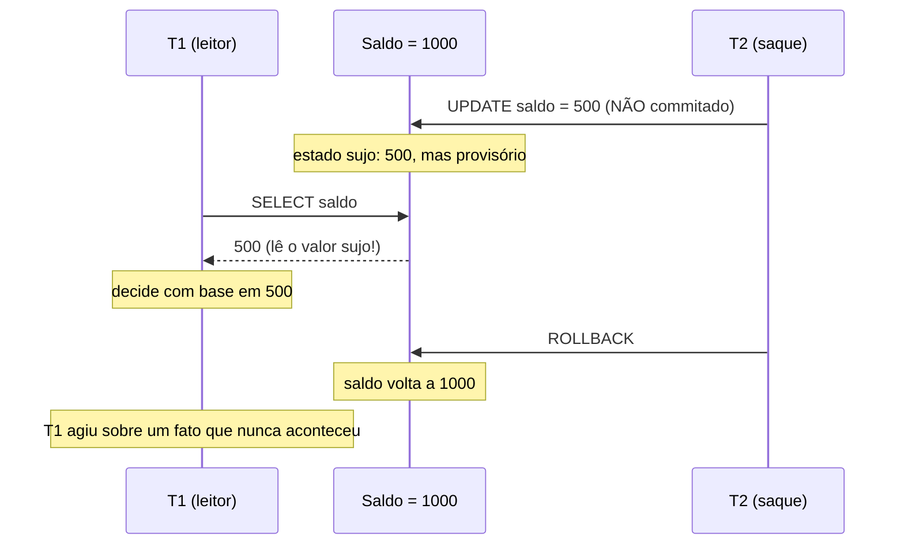
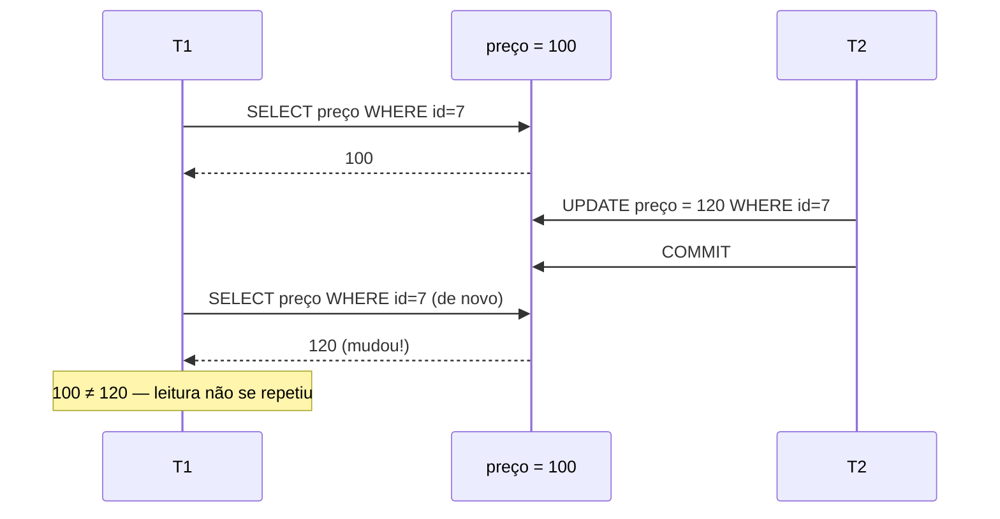
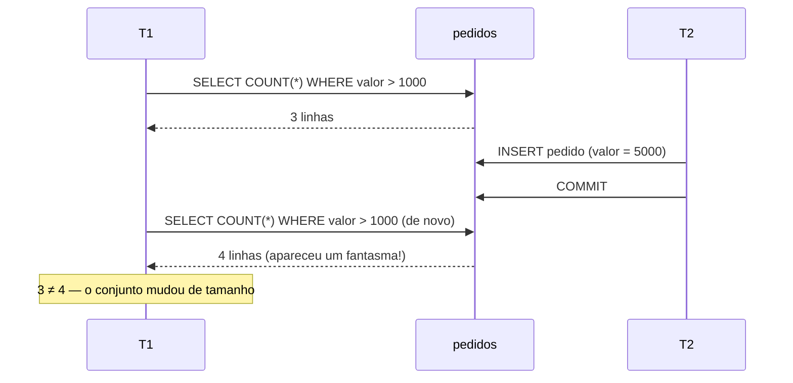
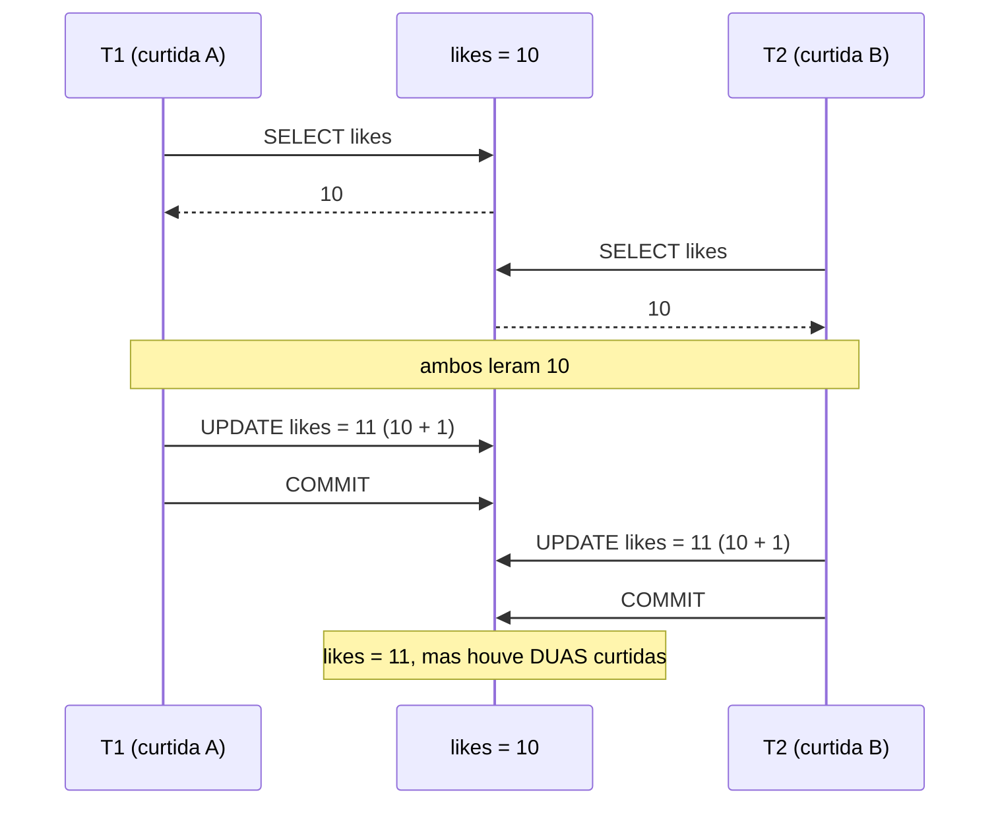
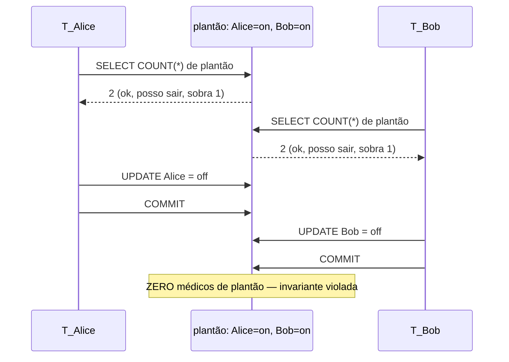
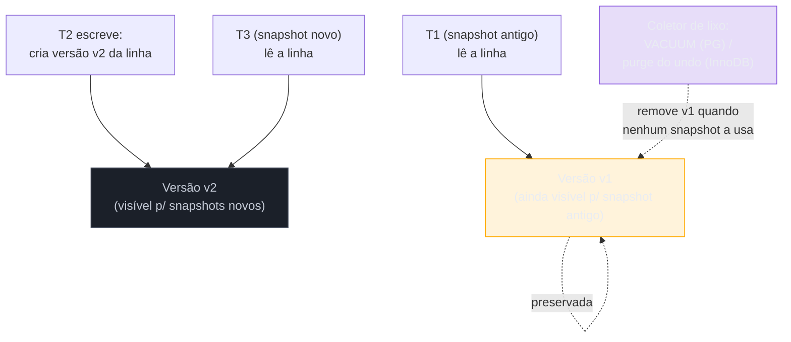

# Isolamento e anomalias

> [!abstract] Em uma linha
> Isolamento é a régua que decide **o que uma transação pode ver das transações ainda no meio do caminho** — e cada degrau a mais de segurança custa concorrência. As anomalias (dirty, non-repeatable, phantom, lost update, write skew) são os fenômenos que cada degrau ainda deixa passar; saber qual nível pega qual é o coração da pergunta de entrevista.

Na nota [[05 - Transações e ACID]] eu tratei o **I** de ACID como se ele tivesse um único valor: "transações concorrentes não veem o estado intermediário umas das outras". Isso é uma meia-verdade conveniente. Na vida real, *isolamento perfeito é caro demais* — se cada transação esperasse a anterior terminar para começar, um banco com 10 mil conexões viraria uma fila de banco do INSS. O que os bancos fazem na prática é oferecer **graus** de isolamento, e te deixar escolher quanto você quer pagar.

Esta nota é sobre essa escolha. Vou destrinchar as cinco anomalias que dão nome ao jogo, mostrar a tabela canônica dos quatro níveis, e então abrir o capô do MVCC — o mecanismo que faz PostgreSQL e MySQL darem isolamento decente *sem* travar leituras. No fim, a divergência que mais cai em entrevista: o "REPEATABLE READ" do PostgreSQL **não é** o REPEATABLE READ do padrão SQL, e essa diferença tem nome (snapshot isolation) e consequência (write skew).

---

## Por que isolamento é um trade-off

Pensa numa biblioteca. Se houvesse **uma única chave** e só uma pessoa pudesse entrar por vez, ninguém jamais pegaria um livro pela metade de ser reposto na prateleira — consistência perfeita. Também daria uma fila na porta de quarteirão. Isolamento total é exatamente isso: serializar tudo, uma transação de cada vez. Seguro, lento.

O outro extremo é deixar todo mundo entrar e mexer em tudo ao mesmo tempo. Rápido, mas você pode pegar um livro que outra pessoa está justamente devolvendo errado, ou contar os livros duas vezes e achar números diferentes. Esse é o trade-off central:

> Quanto **mais isolado**, mais seguro (menos anomalias) e mais **lento** (menos concorrência). Quanto **menos isolado**, mais rápido e mais perigoso.

O padrão SQL não obriga ninguém a escolher o extremo. Ele define **quatro patamares** e diz, para cada um, *quais anomalias ele tem permissão de deixar passar*. Repare na inversão de perspectiva: o padrão não define o nível pela proteção que dá, mas pelos **fenômenos que ele tolera**. Isso vai ser importante daqui a pouco, porque é a brecha pela qual o PostgreSQL entrega *mais* do que o padrão pede.

Antes de ler a tabela, você precisa entender os fenômenos. Senão a tabela é só uma grade de "sim/não" sem sentido. Vamos às anomalias, cada uma com duas transações intercaladas de verdade.

---

## As cinco anomalias

Vou usar uma convenção fixa: **T1** e **T2** são duas transações rodando ao mesmo tempo, e o tempo corre de cima para baixo. Em cada diagrama, repare em *onde* a leitura de uma cruza com a escrita da outra — é nesse cruzamento que mora o estrago.

### 1. Dirty Read — ler o que ainda pode sumir

A **leitura suja** é a mais primitiva. T1 lê um valor que T2 escreveu **mas ainda não commitou**. Se T2 der rollback depois, T1 tomou uma decisão baseada num fato que *nunca aconteceu*.

Imagine um saldo de conta. T2 está no meio de um saque, já subtraiu 500 do saldo na sua memória de transação, mas ainda não confirmou. T1 entra, lê o saldo já reduzido, e decide "ué, tem dinheiro de menos, vou negar o cheque especial". Aí T2 dá rollback (o saque falhou no caixa eletrônico) — e o saldo original volta. T1 negou algo baseado num saldo que nunca existiu de verdade.

**Leitura do diagrama:** a seta crítica é o `SELECT` de T1 chegando **entre** o UPDATE não commitado e o ROLLBACK de T2. T1 enxergou um estado que só existia dentro da transação de T2 — um estado que foi desfeito. É a única anomalia que praticamente *nenhum* banco sério deixa acontecer por padrão; ela é o piso do que se considera aceitável.

### 2. Non-repeatable Read — a mesma linha, dois valores

A **leitura não repetível** é mais sutil e mais comum. T1 lê uma linha, faz algum trabalho, e lê **a mesma linha de novo** — e o valor mudou no meio, porque T2 fez um `UPDATE` **e commitou** entre as duas leituras de T1.

O ponto fino: aqui T2 *commitou*. Não há nada de "sujo". O dado que T1 leu na segunda vez é perfeitamente válido. O problema é a **incoerência dentro da própria T1**: ela viu dois valores diferentes para a mesma pergunta, e qualquer cálculo que dependa de a primeira leitura continuar valendo está errado.

**Leitura do diagrama:** as duas setas de `SELECT` de T1 são idênticas — mesma linha, mesmo `WHERE` — mas devolvem valores diferentes porque o `COMMIT` de T2 se encaixou entre elas. Se T1 calculou um desconto sobre os 100 da primeira leitura e depois gravou algo assumindo 120, o resultado é uma mistura inconsistente.

### 3. Phantom Read — a mesma pergunta, linhas diferentes

A **leitura fantasma** é a prima da non-repeatable, mas em vez de uma *linha mudar de valor*, é o **conjunto de linhas que muda de tamanho**. T1 roda uma query com `WHERE` (um range, um filtro), T2 **insere ou deleta** uma linha que entra ou sai daquele filtro e commita, e T1 roda a mesma query de novo — agora com linhas a mais (ou a menos) que apareceram do nada. Daí "fantasma".

**Leitura do diagrama:** as duas queries de T1 são iguais e o filtro é o mesmo (`valor > 1000`), mas o `INSERT` de T2 criou uma linha nova que **satisfaz o filtro** e commitou no meio. A diferença para a non-repeatable read: lá uma linha existente mudou de valor; aqui uma linha **nova** materializou. É a distinção que confunde candidato e que examinador adora cobrar — *non-repeatable é sobre UPDATE numa linha que você já tinha; phantom é sobre INSERT/DELETE mudando quais linhas existem*.

### 4. Lost Update — a clássica race condition

A **atualização perdida** é, de longe, a anomalia que mais aparece em código de aplicação real, e é traiçoeira porque acontece com um padrão que *parece* inocente: o **read-modify-write**. Você lê um valor, calcula um novo a partir dele na aplicação, e grava de volta. Duas transações fazendo isso ao mesmo tempo: a segunda escrita sobrescreve a primeira **como se a primeira nunca tivesse existido**.

O exemplo canônico é um contador. Dois usuários curtem o mesmo post no mesmo instante.

**Leitura do diagrama:** o veneno está nas duas setas de `SELECT` retornando **10** para ambas as transações *antes* de qualquer escrita. As duas calcularam `10 + 1 = 11` independentemente, e a escrita de T2 sobrescreveu a de T1 com o mesmo número. Resultado: 11 curtidas onde deveriam ser 12. **Uma curtida evaporou.** Note que isso não é dirty read nem non-repeatable: as duas transações fizeram tudo "certo", commitaram limpinho. O erro é que o read-modify-write não é atômico, e o banco não tinha como saber que o `11` de T2 foi calculado sobre um valor já obsoleto.

Como matar lost update? Três caminhos, em ordem de elegância: (1) fazer a atualização **atômica no banco** (`UPDATE likes = likes + 1` — o banco resolve no lugar, sem read-modify-write na aplicação); (2) **optimistic locking** com uma coluna `version` que detecta a sobrescrita e força retry; (3) **pessimistic locking** com `SELECT ... FOR UPDATE`, que serializa o acesso à linha. Esses mecanismos são o assunto de [[11 - Concorrência e locking]]; aqui o que importa é reconhecer *o nome da anomalia* e por que o isolamento sozinho nem sempre a pega.

### 5. Write Skew — a anomalia que só SERIALIZABLE pega

Esta é a mais sofisticada, e a razão de existir do nível SERIALIZABLE. O **write skew** acontece quando duas transações leem um **conjunto sobreposto** de dados, cada uma toma uma decisão *válida em relação ao que leu*, e cada uma escreve numa **linha diferente** — de modo que, somadas, violam uma invariante que nenhuma delas sozinha violou.

O exemplo clássico é o plantão médico. Regra do hospital: **sempre pelo menos um médico de plantão**. Há dois de plantão, Alice e Bob. Cada um quer sair.

**Leitura do diagrama:** o pulo do gato está em que Alice e Bob **leem a mesma coisa** (`COUNT = 2`), cada um conclui corretamente "se eu sair, ainda sobra 1", e cada um escreve numa **linha diferente** (Alice mexe na linha dela, Bob na dele). Como tocam linhas *distintas*, não há conflito de escrita — nenhum lock de linha colide, nenhum lost update acontece. E mesmo assim o estado final (zero de plantão) é **impossível em qualquer execução serial**: se Alice fosse primeiro e Bob depois, Bob leria `COUNT = 1` e seria barrado.

Por que os níveis mais baixos não pegam? Porque eles só vigiam **a mesma linha**. Write skew é um conflito sobre o *predicado* (`COUNT(*)`), não sobre uma linha individual. Só o SERIALIZABLE — que garante que o resultado equivale a *alguma* ordem serial — detecta que essa intercalação não tem equivalente serial e aborta uma das transações. No PostgreSQL isso é feito por um mecanismo chamado SSI, que vamos ver no fim.

> [!warning] Write skew engana porque "parece" seguro
> Cada transação isolada está correta. Cada leitura é consistente (snapshot). Não há dirty read, não há lost update sobre a mesma linha. O sistema *parece* impecável transação por transação — e o agregado é um desastre. É exatamente o tipo de bug que passa em todo teste unitário e explode em produção sob concorrência. Se a sua invariante envolve **mais de uma linha** (saldos que somam, plantões que contam, slots que não podem se sobrepor), suspeite de write skew.

---

## A tabela dos quatro níveis

Agora a tabela faz sentido. Cada nível é definido por **quais anomalias ele permite**. Quanto mais para baixo, mais proteção e menos concorrência.

| Nível | Dirty Read | Non-repeatable | Phantom | Lost Update | Write Skew | Default de |
| --- | --- | --- | --- | --- | --- | --- |
| **READ UNCOMMITTED** | permite | permite | permite | permite | permite | (quase ninguém) |
| **READ COMMITTED** | bloqueia | permite | permite | permite¹ | permite | **PostgreSQL, Oracle, SQL Server** |
| **REPEATABLE READ** | bloqueia | bloqueia | permite² | bloqueia³ | permite | **MySQL/InnoDB** |
| **SERIALIZABLE** | bloqueia | bloqueia | bloqueia | bloqueia | **bloqueia** | (uso crítico explícito) |

Notas de rodapé que separam quem decorou de quem entendeu:

- **¹ Lost update em READ COMMITTED:** o padrão não classifica lost update formalmente, mas na prática um read-modify-write em READ COMMITTED perde updates alegremente. A defesa é `UPDATE x = x + 1` atômico, `FOR UPDATE`, ou optimistic locking — não o nível de isolamento.
- **² Phantom em REPEATABLE READ — depende do banco.** No **padrão SQL** e no comportamento de bancos baseados em locking, REPEATABLE READ ainda sofre phantom. No **PostgreSQL e no InnoDB**, por causa do MVCC, o REPEATABLE READ **não sofre phantom** na leitura. Essa é a divergência da próxima seção.
- **³ Lost update em REPEATABLE READ — também depende.** No InnoDB e no PostgreSQL REPEATABLE READ, o banco detecta a escrita concorrente e aborta com erro de serialização (`could not serialize access`) em vez de perder o update silenciosamente. Você ainda precisa tratar o erro e dar retry.

> [!tip] O que cravar para a entrevista
> READ UNCOMMITTED é praticamente folclore — quase ninguém usa, e o PostgreSQL inclusive **trata READ UNCOMMITTED como READ COMMITTED** (ele simplesmente não tem como ler dado não commitado, dado o MVCC). O par que importa é **READ COMMITTED (default do Postgres) × REPEATABLE READ (default do MySQL)**, e a pegadinha de que os dois bancos entregam mais do que o nome promete.

**Leitura do diagrama:** os níveis formam uma escada de proteção crescente, da esquerda (mais rápido, mais perigoso) para a direita (mais seguro, mais lento). Cada degrau **acrescenta** uma proteção sobre o anterior — não troca, acumula. Subir um degrau nunca tira proteção; só adiciona custo de concorrência. A cor segue o risco: vermelho (frouxo) → azul (rígido).

---

## MVCC — isolamento sem travar leituras

Aqui está a engenharia que torna tudo isso viável em produção. A pergunta ingênua é: "para evitar non-repeatable read, T1 não precisa **travar** a linha enquanto a usa, impedindo T2 de escrever?". Em bancos antigos baseados em lock, sim — e era um pesadelo de contenção, porque **leitores bloqueavam escritores e vice-versa**.

PostgreSQL e InnoDB resolvem isso de outro jeito: **MVCC — Multi-Version Concurrency Control**. A ideia é manter **várias versões** de cada linha ao longo do tempo, e dar a cada transação um **snapshot** — uma foto consistente do banco no instante em que ela (ou seu comando) começou. Em vez de travar, a transação simplesmente **vê a versão que era válida para ela**.

A regra de ouro que cai em entrevista: **writers não bloqueiam readers, e readers não bloqueiam writers.** Uma leitura nunca espera uma escrita, porque a leitura tem seu próprio snapshot — ela enxerga a versão antiga, intacta, enquanto o escritor cria uma nova versão ao lado.

**Leitura do diagrama:** quando T2 escreve, ela **não destrói** a versão antiga (v1) — cria uma v2 ao lado. T1, que começou antes, continua lendo v1 (seu snapshot a aponta) **sem esperar T2**. T3, que começou depois, já vê v2. As duas leituras acontecem em paralelo com a escrita, cada uma na sua versão. O preço aparece embaixo: as versões antigas **acumulam** e precisam de um faxineiro — `VACUUM` no PostgreSQL, purge do undo log no InnoDB — que só pode remover v1 quando **nenhum snapshot vivo** ainda a referencia. É por isso que uma **transação longa segura lixo**: enquanto ela existe, seu snapshot pode precisar de versões antigas, e o coletor não pode limpá-las. Transação longa = bloat acumulando. (Esse custo reaparece em [[10 - Performance e armadilhas]].)

Esse mecanismo é o que faz READ COMMITTED ser barato no Postgres: cada **comando** pega um snapshot novo (por isso ele vê dados commitados desde o último statement), enquanto REPEATABLE READ pega **um snapshot no início da transação** e congela nele até o fim — daí a leitura ser sempre repetível.

---

## Divergência PostgreSQL × InnoDB

Esta é a seção que separa o candidato que leu um tutorial do candidato que entendeu o assunto. As duas divergências abaixo caem em entrevista de senior.

### Divergência 1 — o "REPEATABLE READ" do PostgreSQL é snapshot isolation

O padrão SQL diz que REPEATABLE READ **permite phantom read**. O PostgreSQL **não permite**. Como assim?

Porque o REPEATABLE READ do PostgreSQL não é o REPEATABLE READ do padrão — é **snapshot isolation** com outro nome. Quando a transação congela um snapshot no início e lê *tudo* dele até o fim, ela não enxerga UPDATE *nem* INSERT/DELETE de ninguém que commitou depois. Logo, sem non-repeatable read **e** sem phantom read. O Postgres entrega mais do que o nome promete — herança histórica do padrão SQL, que foi escrito pensando em implementações por locking, não por MVCC.

Mas snapshot isolation tem um buraco com nome próprio: **write skew** (o caso do plantão médico). Snapshot isolation bloqueia dirty, non-repeatable e phantom — mas **não** bloqueia write skew, porque cada transação tem um snapshot consistente *individual* e escreve em linhas que não colidem. Então:

> [!important] A regra de ouro Postgres
> O **REPEATABLE READ** do PostgreSQL é snapshot isolation: pega non-repeatable e phantom, mas **deixa passar write skew**. Se a sua invariante atravessa múltiplas linhas e você precisa **de verdade** de proteção contra write skew, peça **SERIALIZABLE explícito**.

Para honrar o SERIALIZABLE, o PostgreSQL (desde a 9.1) usa **SSI — Serializable Snapshot Isolation**. SSI não trava nada: é otimista. Ele roda tudo sobre snapshot isolation normal e, em paralelo, **rastreia as dependências de leitura/escrita** entre transações concorrentes procurando um padrão de conflito perigoso (um "ciclo" que indica que não existe ordem serial equivalente). Quando detecta, **aborta uma das transações** no commit com um erro de serialização — e cabe à aplicação dar retry. É o write skew sendo pego em tempo de execução, sem o custo de locking pessimista de tudo.

### Divergência 2 — onde cada banco guarda as versões

InnoDB e PostgreSQL implementam MVCC, mas guardam as versões antigas em **lugares diferentes**, e isso tem consequência operacional gigante.

| Aspecto | PostgreSQL | MySQL / InnoDB |
| --- | --- | --- |
| Onde guarda versões | **na própria heap** (tabela): cada UPDATE cria uma tupla nova | em **undo log** separado; o UPDATE altera a linha no lugar |
| Reconstrução de versão antiga | acha a tupla antiga ainda na tabela | **caminha o undo log** para reconstruir |
| Faxina | `VACUUM` / autovacuum reclama tuplas mortas | **purge thread** em background descarta undo antigo |
| Dor típica | **bloat na tabela e nos índices** se o autovacuum não acompanha | undo log **inchando** se há transação longa segurando o purge |

A leitura prática: o modelo do Postgres dá leituras simples e diretas (a versão está ali, na tabela), pagas com a manutenção do `VACUUM` e o risco de **bloat** — tabela e índices incham de tuplas mortas se o autovacuum não der conta da carga de escrita. O modelo do InnoDB evita inchar a tabela principal (atualiza in-place), pagando com a **travessia do undo log** para reconstruir versões antigas e o risco de o undo tablespace crescer. Em ambos, a **transação longa é o vilão comum**: ela trava o coletor de lixo (VACUUM não pode limpar o que o snapshot dela ainda pode ver; o purge não pode avançar além dela). Os dois bancos sofrem do mesmo pecado por caminhos diferentes.

> [!note] Por que isso cai em entrevista
> Porque conecta três coisas que o candidato mediano trata como separadas: o **isolamento** que ele escolhe, o **MVCC** que o entrega, e o **custo operacional** (VACUUM/bloat no Postgres, undo/purge no InnoDB) que ele paga. Quem amarra os três mostra que entende o banco como sistema, não como caixa-preta. E a conexão com `VACUUM` e bloat te leva direto para [[10 - Performance e armadilhas]].

---

## Como escolher na prática

A pergunta inevitável: que nível eu uso? A resposta honesta é **o default do seu banco resolve a esmagadora maioria dos casos** — e o default é cuidadosamente escolhido para ser o ponto certo de equilíbrio.

- **READ COMMITTED (default PG/Oracle):** ótimo para a vasta maioria das aplicações web. Cada comando vê o último estado commitado. Você convive com non-repeatable e phantom dentro de transações longas, mas como suas transações são curtas (e elas *devem* ser curtas), isso raramente morde. Para as anomalias que importam — lost update em contadores — você usa `UPDATE x = x + 1` atômico ou optimistic locking, **não** sobe o isolamento.
- **REPEATABLE READ (default MySQL):** quando você precisa que **a transação inteira** veja um estado congelado e coerente — relatórios consistentes, lógica que lê a mesma coisa várias vezes. No Postgres, lembre que ele é snapshot isolation (sem phantom, mas com write skew).
- **SERIALIZABLE:** o último recurso, e o mais caro. Use quando a invariante atravessa múltiplas linhas e write skew é um risco real (saldos que somam, slots de agenda, plantões). Saiba que ele **aborta transações** e que **sua aplicação precisa de lógica de retry** — sem retry, o SERIALIZABLE só troca um bug silencioso por um erro barulhento.

> A regra de bolso: **não suba o nível de isolamento para resolver um problema que um lock localizado ou um update atômico resolveria melhor.** Subir o isolamento é um martelo global; o write skew num lugar específico muitas vezes se resolve com um `SELECT ... FOR UPDATE` mirado (assunto de [[11 - Concorrência e locking]]) sem penalizar o resto do sistema.

---

## Em entrevista

> "Isolation is a spectrum, not a switch. The four standard levels — read uncommitted, read committed, repeatable read, serializable — are defined by which anomalies they *allow*: dirty reads, non-repeatable reads, phantoms, and the subtle one, write skew. The higher you go, the safer and the slower."
>
> "The trap I always flag is that Postgres and MySQL both deliver *more* than the level names promise, because they're built on MVCC. Postgres' 'repeatable read' is actually snapshot isolation — it has no phantom reads, unlike the SQL standard. But snapshot isolation still allows write skew, so if I have a multi-row invariant — like 'at least one doctor on call' — I ask for SERIALIZABLE explicitly, which Postgres implements with SSI and which aborts one transaction on conflict. That means my app needs retry logic."
>
> "MVCC is what makes this cheap: writers don't block readers and readers don't block writers, because each transaction reads from its own snapshot. The cost is old versions piling up — VACUUM in Postgres, where versions live in the heap and cause bloat, versus the undo log in InnoDB. Either way, a long-running transaction is the villain: it pins old versions and stalls the garbage collector."
>
> "For most apps I leave the default — read committed in Postgres — and handle the one anomaly that actually bites, lost update on counters, with an atomic `UPDATE x = x + 1` or optimistic locking, rather than cranking the isolation level globally."

### Vocabulário PT → EN

- nível de isolamento → isolation level
- anomalia → anomaly
- leitura suja → dirty read
- leitura não repetível → non-repeatable read
- leitura fantasma → phantom read
- atualização perdida → lost update
- desvio de escrita → write skew
- instantâneo (do banco) → snapshot
- isolamento por instantâneo → snapshot isolation
- controle de concorrência multiversão → multi-version concurrency control (MVCC)
- versão antiga / tupla morta → old version / dead tuple
- inchaço (da tabela) → bloat
- limpeza / faxina → vacuuming / purge
- registro de desfazer → undo log
- abortar / reverter transação → abort / roll back a transaction
- erro de serialização → serialization error
- nova tentativa → retry
- invariante → invariant

---

> [!info] Lastro
> **Fontes verificadas (WebSearch, jun/2026):**
> - **Jepsen — PostgreSQL 12.3** ([jepsen.io/analyses/postgresql-12.3](https://jepsen.io/analyses/postgresql-12.3)): análise formal de que o "repeatable read" do PG é snapshot isolation e dos limites de cada nível.
> - **PostgreSQL Wiki — SSI** ([wiki.postgresql.org/wiki/SSI](https://wiki.postgresql.org/wiki/SSI)): SSI adicionado na 9.1; mecanismo otimista de detecção de conflito sobre snapshot isolation, abortando transações no commit. Confirma que SERIALIZABLE pega write skew.
> - **InterDB — Concurrency Control** ([interdb.jp/pg/pgsql05.html](https://www.interdb.jp/pg/pgsql05.html)): internals de MVCC no Postgres (visibilidade, snapshots, xmin/xmax).
> - **Percona — Bloat and VACUUM in PostgreSQL** ([percona.com/blog/basic-understanding-bloat-vacuum-postgresql-mvcc](https://www.percona.com/blog/basic-understanding-bloat-vacuum-postgresql-mvcc/)): por que versões no heap geram bloat e o papel do VACUUM.
> - **DEV Community — MySQL vs PostgreSQL: Storage Architecture** ([dev.to/harry_do/part-2-mysql-vs-postgresql-storage-architecture-2ki1](https://dev.to/harry_do/part-2-mysql-vs-postgresql-storage-architecture-2ki1)): InnoDB guarda versões no undo log e atualiza in-place; Postgres cria tuplas novas no heap.
>
> **Ressalvas:** (1) O comportamento exato de cada nível **varia entre versões e engines** — sempre confirme na doc da versão exata em produção. (2) O padrão SQL define os níveis pelos fenômenos *proibidos*, mas implementações reais (Postgres, InnoDB) frequentemente são mais estritas que o mínimo exigido; "REPEATABLE READ" não significa a mesma coisa em todo banco. (3) A classificação de "lost update" não é parte formal do ANSI SQL-92 original; tratei-a como anomalia prática, que é como cai em entrevista. (4) Não testei os exemplos de SQL em uma instância real para esta nota — eles ilustram a mecânica, não substituem validação na sua versão.

## Veja também

- [[05 - Transações e ACID]] — o I de ACID, WAL, commit/rollback que esta nota destrincha
- [[11 - Concorrência e locking]] — optimistic/pessimistic locking, FOR UPDATE, deadlock: como matar lost update e write skew na prática
- [[10 - Performance e armadilhas]] — o custo do MVCC: VACUUM, bloat, transações longas
- [[12 - Replicação, sharding e CAP]] — quando a consistência deixa de ser de uma máquina e vira problema distribuído
