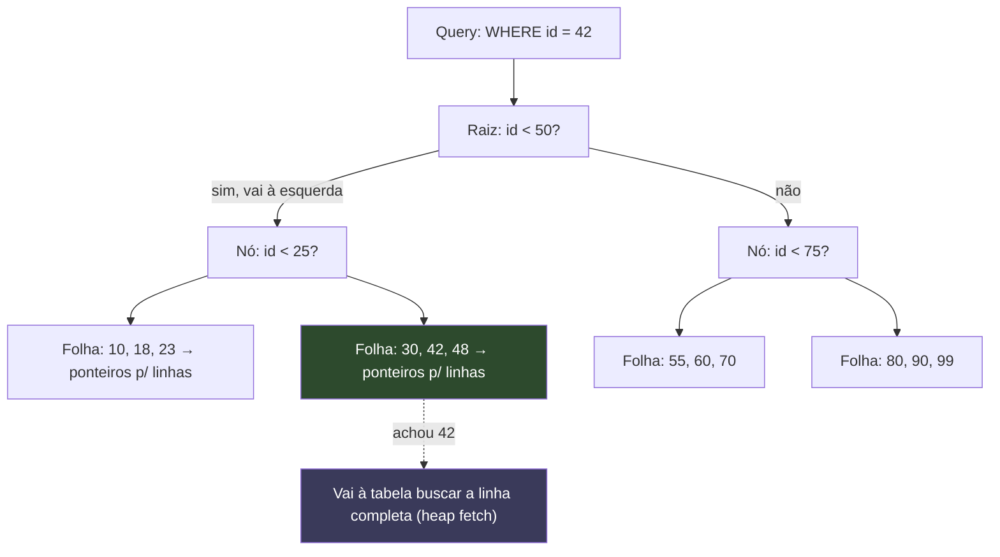
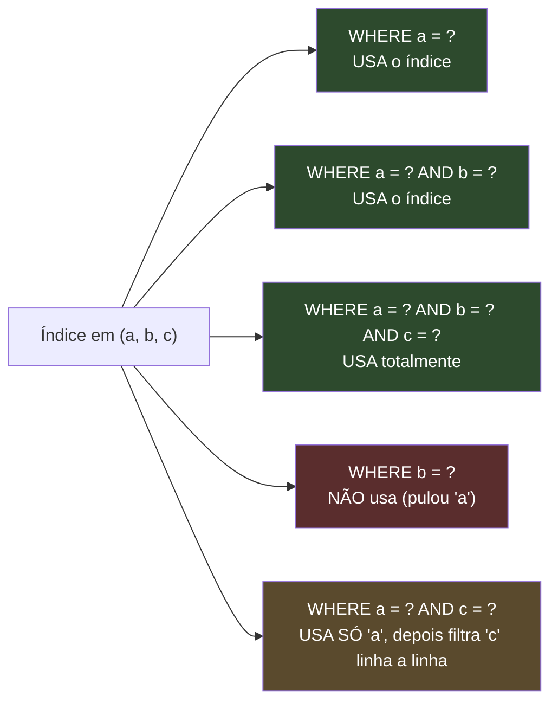
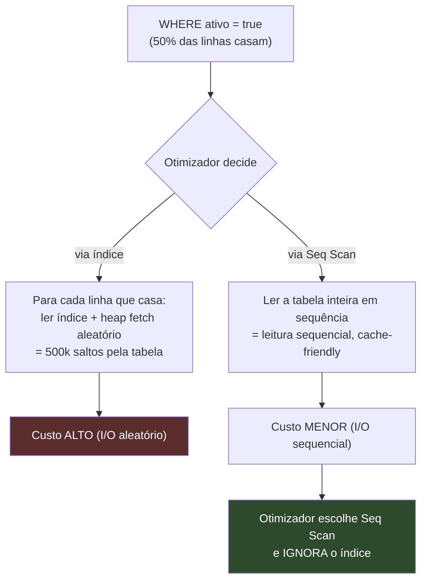
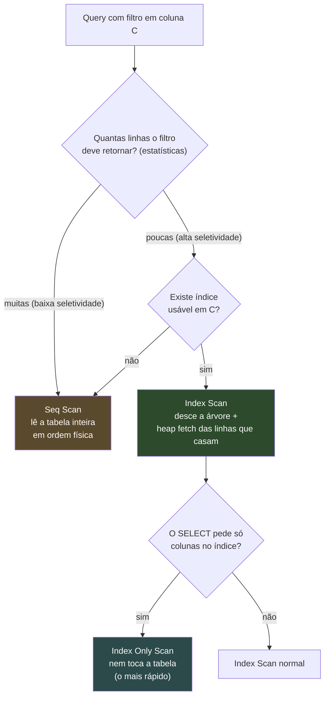

# Índices

Imagine um livro de 800 páginas sem índice remissivo. Você quer todas as menções à palavra "transação". Sem o índice, só há uma opção: ler o livro inteiro, página por página, anotando onde a palavra aparece. Com o índice remissivo no fim do livro — uma lista ordenada de termos, cada um apontando para suas páginas — você vai direto à letra T, encontra "transação", e pula para as páginas certas. Você não leu o livro; você leu o índice.

Um índice de banco de dados é exatamente isso: uma estrutura auxiliar, ordenada, que aponta para as linhas da tabela. Sem ele, toda consulta que filtra por uma coluna precisa ler a tabela inteira — o **full table scan**, ou `Seq Scan` no jargão do PostgreSQL. Com ele, o banco faz uma busca logarítmica e vai direto às linhas que interessam.

A pergunta que separa um senior de um júnior não é "como criar um índice" (é um comando de uma linha). É: **que índice criar, quando, e a que custo.** Porque índice não é grátis. Cada índice que você cria é um livro paralelo que o banco precisa manter sincronizado a cada escrita. Esta nota é sobre tomar essa decisão com critério.

> [!note] Fronteira: estrutura vs uso
> A **mecânica interna** do B-Tree/B+Tree — nós, folhas, page splits, rebalanceamento, por que a altura é O(log n) — é dona da nota [[09 - Árvores B e índices]], no galho de Estruturas de Dados. Aqui eu uso só o **mínimo** de "como funciona" necessário para justificar as decisões de uso. Quando você quiser o detalhe estrutural, é para lá que vai.

---

## Por que um índice acelera

Para decidir quando indexar, você precisa de um modelo mental de por que o índice ajuda. Sem mergulhar na estrutura (isso fica em [[09 - Árvores B e índices]]), o B-Tree dá três superpoderes:

1. **Busca por igualdade em tempo logarítmico.** Em uma tabela de 1 milhão de linhas, um `Seq Scan` lê ~1.000.000 de linhas. Um B-Tree faz ~20 comparações (log₂ de 1 milhão é ≈ 20). A diferença não é "um pouco mais rápido" — é uma diferença de ordem de magnitude que cresce com a tabela.
2. **Range queries.** Porque as chaves estão **ordenadas** na árvore, `WHERE data BETWEEN x AND y` encontra o início do intervalo e varre sequencialmente as folhas até o fim. Sem ordenação, não há como pular o que está fora do intervalo.
3. **Ordenação de graça.** `ORDER BY data` pode ler o índice na ordem em que ele já está, evitando um passo de `Sort` em memória. Por isso um índice pode acelerar uma query que nem filtra por aquela coluna — só ordena por ela.

Vamos ver a busca acontecer. Este diagrama é uma **ilustração** da busca, não a estrutura real (que tem mais filhos por nó, ponteiros entre folhas, e fica em [[09 - Árvores B e índices]]):

Leitura do diagrama: para achar `id = 42`, o banco desce três níveis, comparando em cada nó, e descarta metade da árvore a cada passo. Chega à folha que contém o 42, que guarda um **ponteiro** para a linha real na tabela. O índice não guarda a linha inteira — guarda a chave ordenada mais o endereço. Esse passo final (`heap fetch`) é o que distingue um `Index Scan` de um `Index Only Scan`, e veremos por que isso importa quando falarmos de covering index.

---

## Cada índice tem um preço

Se índice só fizesse bem, o banco criaria um em toda coluna automaticamente. Ele não faz. Porque índice é um trade-off, e o lado do custo é real:

- **Espaço em disco.** O índice é uma cópia ordenada das colunas indexadas mais ponteiros. Em tabelas largas e muito indexadas, a soma dos índices pode ser maior que a própria tabela.
- **Escrita mais lenta.** Aqui mora o custo que mais machuca. Todo `INSERT`, `UPDATE` (que toca a coluna indexada) e `DELETE` precisa **manter cada índice sincronizado**. Inserir uma linha em uma tabela com 8 índices é inserir em 8 estruturas ordenadas, com possíveis page splits em cada uma. Indexar demais transforma uma tabela de escrita rápida em uma tabela lenta.
- **VACUUM mais caro.** No PostgreSQL, por causa do MVCC (ver [[06 - Isolamento e anomalias]]), `UPDATE` e `DELETE` deixam tuplas mortas que o `VACUUM` precisa limpar — e ele limpa também as entradas correspondentes em **cada** índice. Mais índices, VACUUM mais demorado e mais bloat.

> [!warning] A regra de ouro
> **Cada índice acelera leituras e desacelera escritas.** Em uma tabela com 80% de leitura, índices valem quase sempre. Em uma tabela de log com 99% de escrita, um índice extra pode custar mais do que rende. A decisão é por padrão de acesso, nunca "por via das dúvidas". Indexar tudo é o anti-pattern mais comum de quem aprendeu metade da lição.

A regra que decorre disso: **meça antes de criar.** Você descobre se uma query precisa de índice rodando `EXPLAIN ANALYZE` e vendo um `Seq Scan` caro — não adivinhando. Esse é o tema inteiro de [[08 - EXPLAIN e otimização]], e é o reflexo que separa otimização de superstição.

---

## Os tipos de índice

O B-Tree resolve 90% dos casos, mas o PostgreSQL oferece uma família de tipos, cada um especializado em uma forma de pergunta. Saber qual escolher é o que faz a diferença em uma entrevista de modelagem.

| Tipo | Para o quê | Caso de uso típico |
| --- | --- | --- |
| **B-Tree** | igualdade, range, ordenação, `IS NULL` | o default, 90% dos casos |
| **Hash** | só igualdade (`=`) | raramente manual; o planner usa em joins |
| **GIN** | valores compostos: arrays, JSONB, full-text | `WHERE tags @> ARRAY['java']`, busca em documentos |
| **GiST** | geoespacial, ranges, vizinhança | PostGIS, "ponto mais próximo", intervalos sobrepostos |
| **BRIN** | tabelas enormes fisicamente ordenadas | logs e séries temporais por `created_at` |
| **Partial** | só um subconjunto das linhas | índice só `WHERE status = 'pending'` |
| **Expression** | sobre o resultado de uma função | `LOWER(email)` para busca case-insensitive |
| **Covering** | inclui colunas extras para evitar a tabela | `INCLUDE (nome, preco)` |
| **Unique** | impõe unicidade e acelera igualdade | PK, e-mail único |

Vale destrinchar os menos óbvios, porque cada um existe para resolver uma dor concreta:

- **Hash** só sabe responder `=`. Não serve a range nem a ordenação. Como o B-Tree também faz igualdade (e muito mais), você quase nunca cria um Hash à mão. Ele entrou para valer só quando o PostgreSQL passou a registrá-lo no WAL (versão 10) — antes disso, nem sobrevivia a um crash.
- **GIN** (Generalized Inverted Index) é um **índice invertido**: em vez de "linha → valores", ele mapeia "valor → linhas que o contêm". É exatamente o que você precisa quando uma coluna guarda **vários** valores: um array de tags, um documento JSONB, os tokens de um texto para full-text search. A pergunta "quais linhas contêm a tag java" é trivial num índice invertido e impossível de acelerar com B-Tree.
- **GiST** generaliza a árvore para dados onde "menor/maior" não faz sentido mas "contém/sobrepõe/está perto" faz: pontos no mapa, intervalos de tempo, polígonos. É a espinha do PostGIS e de consultas do tipo "os 5 restaurantes mais próximos".
- **BRIN** (Block Range Index) é o oposto filosófico do B-Tree. Em vez de apontar para cada linha, ele guarda só o **valor mínimo e máximo de cada bloco físico** de páginas. É minúsculo. Mas só funciona quando a ordem física da tabela acompanha a coluna — o caso clássico é uma tabela de eventos onde linhas novas têm `created_at` sempre crescente. Para varrer "eventos de março", o BRIN descarta blocos inteiros olhando só o min/max. Índice de poucos kilobytes para uma tabela de terabytes.
- **Partial** indexa só as linhas que casam um `WHERE`. Se 95% dos pedidos estão `done` e você só consulta os `pending`, um índice `WHERE status = 'pending'` é menor, mais rápido e mais barato de manter do que um índice na coluna inteira. É também o truque que salva o índice de boolean (mais abaixo).
- **Expression** indexa o resultado de uma função, não a coluna crua. Se você busca por `LOWER(email) = 'x'`, um índice em `email` **não é usado** — o banco não sabe que `LOWER(email)` se relaciona com o índice. Você cria o índice sobre a própria expressão `LOWER(email)`.
- **Covering** (`INCLUDE`) anexa colunas extras às folhas do índice sem que elas façam parte da chave de busca. O objetivo é o `Index Only Scan`: se tudo que o `SELECT` pede já está no índice, o banco **nunca toca a tabela** — pula aquele `heap fetch` do primeiro diagrama. É a otimização que faz uma query voar.

---

## Índice composto e a regra do leftmost prefix

Aqui está o conceito que mais cai em entrevista e o que mais gente erra. Um **índice composto** (ou concatenado) indexa **duas ou mais colunas juntas**, por exemplo `(estado, cidade, bairro)`. A pergunta crítica é: a quais queries ele serve?

A resposta vem de entender **como** o índice ordena. Um índice em `(a, b, c)` ordena as entradas primeiro por `a`; dentro de cada valor igual de `a`, ordena por `b`; e dentro de cada par `(a, b)` igual, ordena por `c`. É uma ordenação **hierárquica**, exatamente como uma lista telefônica ordena por sobrenome, depois nome, depois inicial do meio.

Pense na lista telefônica ordenada por (Sobrenome, Nome). Achar todos os "Silva" é trivial — eles estão agrupados. Achar todos os "Silva, João" é trivial — você acha o bloco Silva e dentro dele o João. Mas achar todos os **"João"** de qualquer sobrenome? Impossível sem ler a lista inteira: os Joãos estão espalhados por todos os sobrenomes. A ordenação por nome só existe **dentro** de cada sobrenome.

Essa é a **regra do leftmost prefix**: um índice em `(a, b, c)` serve qualquer query que filtre por um **prefixo da esquerda para a direita** — `a`, ou `a` e `b`, ou `a`, `b` e `c` — mas não por colunas que pulam o começo.

Leitura do diagrama: as três primeiras queries são prefixos válidos e o índice as serve com busca direta. `WHERE b = ?` (laranja-vermelho) **não usa o índice** porque pular `a` é pedir os "Joãos espalhados". E `WHERE a = ? AND c = ?` (amarelo) é o caso parcial: o índice posiciona pelo `a`, mas como `b` não foi filtrado, o `c` não está agrupado — o banco usa o índice até onde dá e depois filtra `c` linha por linha. Funciona, mas não com a eficiência de um prefixo completo.

A consequência prática é poderosa: **um índice composto bem ordenado substitui vários índices simples.** O índice `(a, b, c)` já serve consultas por `a` e por `(a, b)` — você não precisa de um índice só em `a` por cima. Menos índices, menos custo de escrita.

### Em que ordem colocar as colunas

A regra que você ouve repetida — "coluna mais seletiva primeiro" — é um bom ponto de partida, mas é **mais sutil do que parece**, e em entrevista vale conhecer a nuance:

- **A ordem que mais importa é a que torna o índice usável pelo maior número de queries.** Como só os prefixos da esquerda são usáveis, a coluna que aparece em **mais** queries (e em queries de igualdade) deve vir primeiro — senão você empurra metade das suas consultas para fora do índice. Markus Winand (o "Use The Index, Luke") argumenta que essa usabilidade pesa mais que a seletividade pura na decisão da ordem.
- **Colunas de igualdade antes de colunas de range.** Se você filtra `WHERE a = ? AND b BETWEEN ? AND ?`, ponha `a` (igualdade) antes de `b` (range). Por quê? Uma vez que o índice encontra uma faixa (`b BETWEEN`), tudo depois dela na ordem perde o agrupamento — o range "abre o leque" e nenhuma coluna seguinte fica utilizável para busca direta. Por isso colunas de range vão no **fim**.
- **Entre colunas de igualdade igualmente usadas, a mais seletiva ajuda a podar antes.** Maior cardinalidade (mais valores distintos) significa que filtrar por ela elimina mais linhas mais cedo.

> [!tip] A heurística honesta
> Primeiro garanta que o **prefixo cobre suas queries reais** (use-as-often-as-possible), depois ponha igualdade antes de range, e só então use seletividade como critério de desempate. Quem decora só "mais seletiva primeiro" cria índices que o otimizador ignora porque o prefixo não bate com nenhuma query.

---

## Seletividade e cardinalidade: quando o índice é inútil

**Cardinalidade** é quantos valores distintos uma coluna tem. **Seletividade** é a fração da tabela que um valor típico filtra — quanto menor a fatia, mais seletivo. Uma coluna `cpf` é altíssima cardinalidade e altíssima seletividade (cada valor pega ~1 linha). Uma coluna `ativo` (boolean) é cardinalidade 2 e seletividade horrível (cada valor pega ~50% da tabela).

Aqui está a sacada que muita gente não tem: **o otimizador pode ignorar um índice pouco seletivo**, e ele está certo em fazê-lo.

Leitura do diagrama: quando metade da tabela casa o filtro, usar o índice significa fazer centenas de milhares de **saltos aleatórios** entre o índice e a tabela — e I/O aleatório é muito mais caro que ler a tabela inteira de forma sequencial. O otimizador calcula isso pelas estatísticas e decide, corretamente, varrer a tabela. Você criou o índice, pagou o custo de escrita e espaço, e o índice fica ali sem ser usado. **Pior dos dois mundos.**

Por isso **indexar boolean quase nunca ajuda** — a cardinalidade é baixa demais. A exceção valiosa é o **partial index**: se você só consulta `WHERE ativo = true` e os ativos são 2% da tabela, um índice `WHERE ativo = true` é pequeno, seletivo no que importa, e usado. Você transformou uma coluna de baixa cardinalidade em um índice útil ao indexar só a fatia que interessa.

---

## Quando NÃO indexar

Tão importante quanto saber criar índice é saber **não** criar. Não indexe quando:

- **A tabela é pequena.** Para algumas centenas de linhas, o `Seq Scan` cabe na memória e é mais rápido que descer uma árvore e fazer heap fetches. O otimizador vai ignorar o índice de qualquer forma; você só pagou o custo de mantê-lo.
- **A cardinalidade é baixa.** Boolean, enums de poucos valores, flags. Seletividade ruim, índice ignorado — salvo partial index sobre a fatia rara.
- **A coluna quase nunca aparece em `WHERE`, `JOIN` ou `ORDER BY`.** Índice que nenhuma query usa é puro custo: espaço, escrita lenta, VACUUM caro, zero benefício.
- **A escrita domina a leitura.** Em uma tabela de ingestão pesada (logs, eventos, métricas), cada índice é um imposto sobre cada `INSERT`. Se as leituras são raras ou toleram lentidão, o índice pode não compensar — considere BRIN, que é baratíssimo de manter.

E a regra-mestra que amarra tudo:

> [!important] Meça, não adivinhe
> **Sempre rode `EXPLAIN ANALYZE` antes de criar um índice** — e depois, para confirmar que ele está sendo usado e que o ganho é real. O plano de execução mostra se há um `Seq Scan` caro (sintoma de falta de índice), e o `actual rows` revela se a seletividade é o que você imaginava. Otimizar por achismo cria índices que o otimizador rejeita. Esse fluxo é o tema de [[08 - EXPLAIN e otimização]]. Índice é uma decisão guiada por evidência, não por intuição.

---

## Seq scan vs index scan: a decisão do otimizador

Para fechar o modelo mental, vale ver lado a lado as duas estratégias que o otimizador escolhe — porque entender a escolha dele é o que permite a você prever quando seu índice será usado.

Leitura do diagrama: o otimizador parte das **estatísticas** (mantidas pelo `ANALYZE`) para estimar quantas linhas o filtro retorna. Se forem muitas, ele escolhe `Seq Scan` mesmo havendo índice — porque, como vimos, I/O sequencial vence I/O aleatório em massa. Se forem poucas e existir índice usável, vai de `Index Scan`. E o prêmio máximo é o `Index Only Scan`: quando o `SELECT` pede apenas colunas que já estão no índice (graças a um covering index), o banco responde sem nunca tocar a tabela. É por isso que `SELECT *` atrapalha — ele força o heap fetch ao pedir colunas que não estão no índice.

Esse vocabulário de planos — `Seq Scan`, `Index Scan`, `Index Only Scan` — é o que você vai ler de verdade em [[08 - EXPLAIN e otimização]]. Aqui o ponto é: o índice é uma **oferta** ao otimizador, não uma ordem. Ele decide. Seu trabalho é criar índices que façam a oferta valer a pena.

---

## Em entrevista

Index questions are a fast way to show senior judgment, because the wrong answer is "add an index" and the right answer is always "it depends on the access pattern." Lead with the trade-off: an index speeds up reads but slows down every write and makes VACUUM more expensive, so each index has a real cost. Make the leftmost-prefix rule explicit — a composite index on `(a, b, c)` serves queries on `a`, on `a, b`, and on `a, b, c`, but not on `b` alone, because the index is sorted hierarchically. For column order, say you put equality columns before range columns and make sure the prefix covers your actual queries, rather than blindly putting the most selective column first. Mention that a low-selectivity column like a boolean is usually a bad index — the optimizer will pick a sequential scan anyway — unless you use a partial index over the rare slice. And always close with: "I'd confirm with `EXPLAIN ANALYZE` before and after adding it," because indexing is evidence-driven, never a guess.

Cross-links úteis: a estrutura do B-Tree por dentro é [[09 - Árvores B e índices]]; ler o plano de execução é [[08 - EXPLAIN e otimização]]; os filtros que tornam um índice usável vêm de [[03 - SQL - consultas]]; e a modelagem das chaves a indexar está em [[04 - Modelagem e normalização]]. Os efeitos colaterais (N+1, `SELECT *`, OFFSET alto) aparecem em [[10 - Performance e armadilhas]].

### Vocabulário

- índice → index
- índice composto / concatenado → composite / compound / concatenated index
- regra do prefixo mais à esquerda → leftmost prefix rule
- varredura sequencial → sequential scan (seq scan)
- varredura de índice → index scan
- varredura só por índice → index-only scan
- seletividade → selectivity
- cardinalidade → cardinality
- índice parcial → partial index
- índice de expressão → expression / functional index
- índice de cobertura → covering index
- índice invertido → inverted index
- ordenação física da tabela → physical row order
- bloat de índice → index bloat
- plano de execução → query execution plan
- otimizador / planejador de consultas → query optimizer / planner

---

> [!info] Lastro
> **Fontes verificadas (WebSearch, jun/2026):**
> - [PostgreSQL Docs — 11.2. Index Types](https://www.postgresql.org/docs/current/indexes-types.html) — tipos B-Tree, Hash, GiST, SP-GiST, GIN, BRIN; B-Tree é o default e cobre igualdade, range, ordenação e `IS NULL`; GIN é descrito como índice invertido para valores compostos (arrays); BRIN guarda sumários de faixas de blocos físicos e depende da correlação com a ordem física.
> - [PostgreSQL Docs — CREATE INDEX](https://www.postgresql.org/docs/current/sql-createindex.html) — sintaxe de `INCLUDE` (covering), partial (`WHERE`) e expression index.
> - [Use The Index, Luke — Myth: most selective column first](https://use-the-index-luke.com/sql/myth-directory/most-selective-first) — Markus Winand argumenta que a ordem das colunas deve maximizar a **usabilidade** do índice (cobrir o máximo de queries) antes de priorizar seletividade pura; é a nuance que refina a regra ingênua.
>
> **Ressalvas:**
> - A "voz padrão" desta nota é **PostgreSQL**. Nomes e comportamentos de tipos de índice (BRIN, GIN, SP-GiST, `INCLUDE`) variam em outros SGBDs — MySQL/InnoDB, por exemplo, não tem GIN/BRIN nativos e trata covering index de forma diferente.
> - A regra do leftmost prefix vale para índices **B-Tree** (a esmagadora maioria dos compostos). Não se aplica a Hash, GIN ou BRIN, que não são ordenados da mesma forma.
> - Os diagramas de B-Tree são ilustrativos e simplificados (poucos filhos por nó, sem ponteiros entre folhas). A estrutura real e suas propriedades estão em [[09 - Árvores B e índices]].
> - Custos relativos de I/O sequencial vs aleatório dependem de hardware (SSD vs HDD), de `random_page_cost`/`seq_page_cost` e do cache. A decisão do otimizador é baseada em estatísticas que precisam estar atualizadas (`ANALYZE`).
