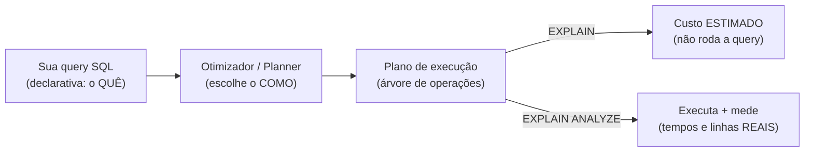
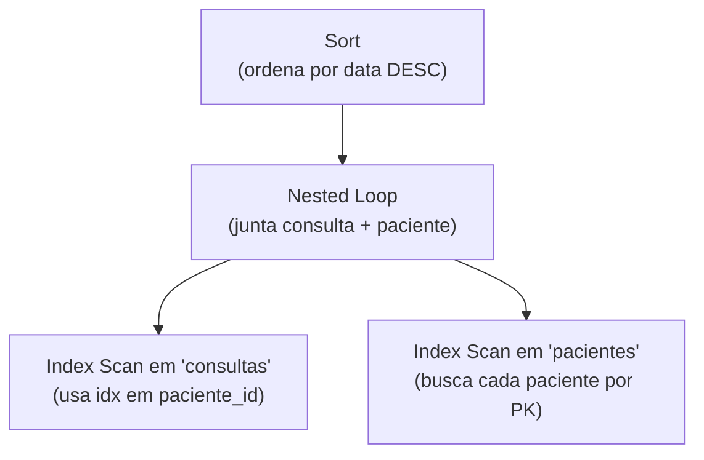
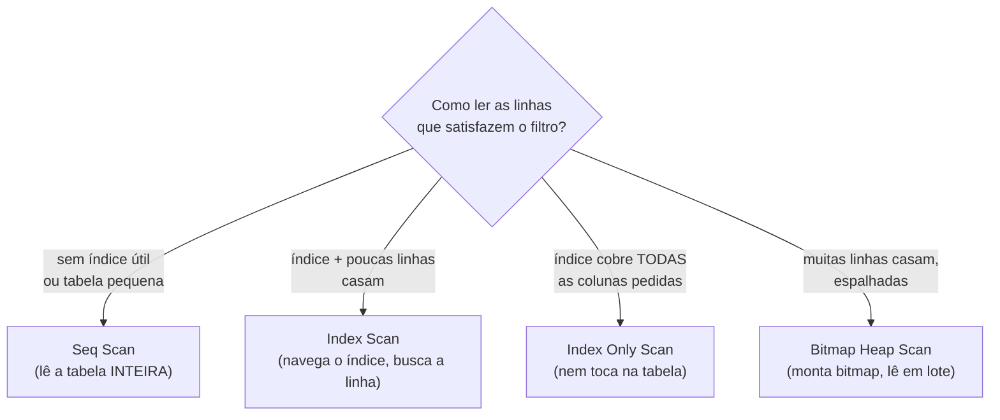
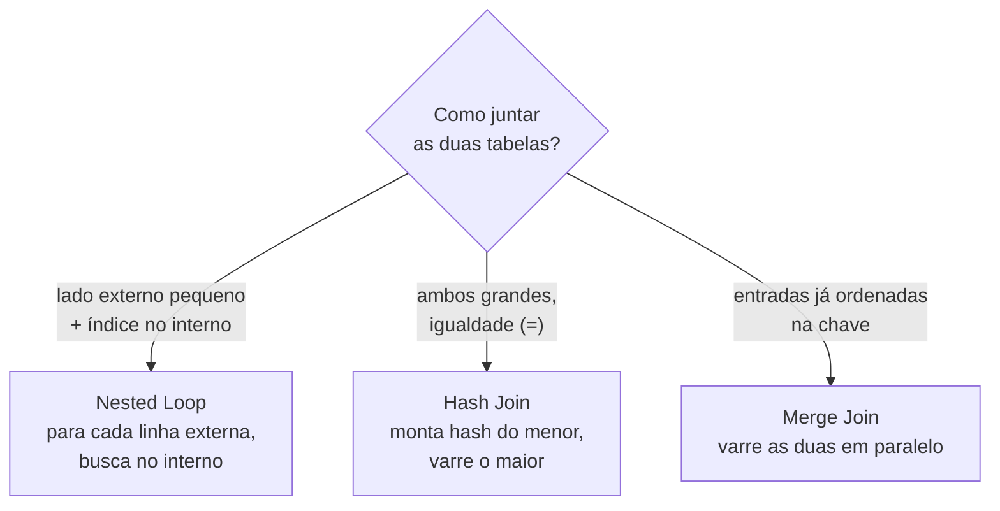
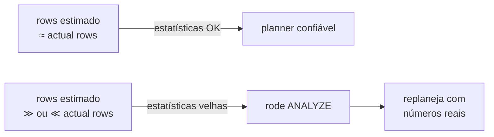
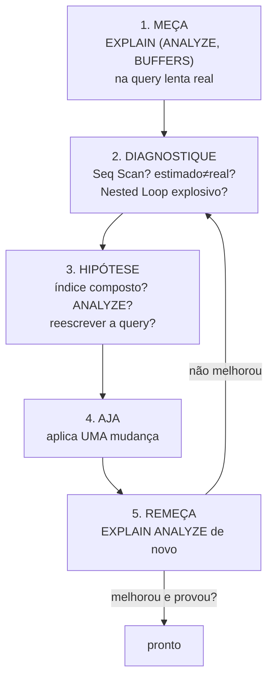

# EXPLAIN e otimização

> [!abstract] TL;DR
> `EXPLAIN` pede ao banco que **mostre o plano** que ele pretende executar — sem rodar a query. `EXPLAIN ANALYZE` **executa de verdade** e te devolve os tempos e as linhas reais de cada etapa. Ler esse plano é a habilidade número um de otimização: é onde você descobre se o banco está varrendo 5 milhões de linhas porque falta um índice, ou se está confiando numa estimativa errada porque as estatísticas estão velhas. A regra de ouro é uma só: **otimize com evidência, nunca com achismo.** Antes de criar índice, antes de culpar o banco, antes de reescrever a query — rode `EXPLAIN ANALYZE` e leia o plano.

## A pergunta que o EXPLAIN responde

Você escreve SQL declarativo. Você diz **o quê** quer ("me dê as consultas do paciente 42 a partir de janeiro"), não **como** buscar. Quem decide o "como" é uma peça do banco chamada **otimizador** (ou *query planner*). Para a mesma query, existem dezenas de caminhos possíveis: varrer a tabela inteira e filtrar? usar este índice ou aquele? fazer o JOIN por hash ou por loop aninhado? O otimizador estima o custo de cada caminho e escolhe o mais barato.

`EXPLAIN` é a janela para essa decisão. Pense nele como pedir a um motorista de aplicativo a **rota que ele vai pegar** antes de sair — você vê as ruas escolhidas sem percorrê-las. Já `EXPLAIN ANALYZE` é fazer a viagem inteira e cronometrar cada trecho: agora você sabe não só a rota planejada, mas onde o trânsito real engasgou.



Leitura do diagrama: a query passa pelo otimizador, que produz um plano. `EXPLAIN` para na estimativa; `EXPLAIN ANALYZE` continua, executa o plano e te entrega a realidade medida. A diferença entre o estimado e o real é exatamente onde mora a maioria dos problemas.

> [!warning] EXPLAIN ANALYZE *executa* a query
> Em um `SELECT` isso é inofensivo (custa o tempo da query). Mas `EXPLAIN ANALYZE` de um `UPDATE`, `DELETE` ou `INSERT` **altera os dados de verdade** — ele roda o comando. Em PostgreSQL, envolva em `BEGIN; EXPLAIN ANALYZE ...; ROLLBACK;` quando for medir uma escrita.

## Anatomia de um plano: a árvore de nós

O plano não é uma lista linear — é uma **árvore**. Cada caixa é um **nó** (uma operação: varredura, junção, ordenação, agregação). Os nós-folha leem dados das tabelas; os nós internos combinam os resultados dos filhos. A execução flui **de baixo para cima e de dentro para fora**: as folhas produzem linhas, que sobem sendo filtradas, juntadas e ordenadas até o nó raiz, que é o resultado final.



Leitura do diagrama: leia **de baixo para cima**. Os dois `Index Scan` (folhas) leem as tabelas; o `Nested Loop` casa cada linha de `consultas` com seu paciente; o `Sort` no topo ordena o resultado final. No texto do `EXPLAIN`, essa hierarquia aparece pela **indentação** — quanto mais à direita, mais fundo na árvore, mais cedo executa.

### Os números em cada linha

Um nó típico do PostgreSQL imprime assim:

```text
Index Scan using idx_consultas_paciente on consultas
  (cost=0.43..8.71 rows=12 width=64) (actual time=0.018..0.024 rows=11 loops=1)
```

Decifrando os campos — eles são o coração da leitura:

- **`cost=0.43..8.71`** — custo **estimado**, em unidades abstratas do planner (não são milissegundos). O primeiro número é o *startup cost*: o custo até a **primeira linha** sair. O segundo é o *total cost*: o custo até a **última linha**. A unidade não importa em absoluto; importa **comparar** custos entre planos. Um `Sort` tem startup cost alto (precisa ler tudo antes de devolver a primeira linha ordenada); um `Seq Scan` tem startup ~0 (devolve a primeira linha quase imediatamente).
- **`rows=12`** — quantas linhas o planner **estima** que esse nó vai produzir.
- **`width=64`** — largura média estimada de cada linha em bytes.
- **`actual time=0.018..0.024`** — só aparece com `ANALYZE`. Tempo **real** em milissegundos (startup..total), **por loop**.
- **`actual rows=11`** — quantas linhas o nó **de fato** produziu.
- **`loops=1`** — quantas vezes esse nó foi executado. Crucial: os valores de `actual time` e `actual rows` são **médias por loop**. Se `loops=5000`, o tempo total daquele nó é `actual time × loops`. Um nó "rápido" que roda cinco mil vezes é lento no agregado.

> [!tip] O número que mais importa: estimado vs real
> Compare `rows` (estimado) com `actual rows` (real). Se o planner achou que viriam 12 linhas e vieram 1,2 milhão, **toda a árvore acima foi planejada errada** — ele pode ter escolhido um Nested Loop achando que o lado externo era minúsculo. Estimativa errada é a causa-raiz nº 1 de planos ruins, e quase sempre significa **estatísticas desatualizadas** (veja adiante).

## Os tipos de scan: como o banco lê uma tabela

A folha da árvore é sempre algum tipo de **varredura** (*scan*). Saber distinguir é meio caminho para diagnosticar.



Leitura do diagrama: a escolha depende de **quantas** linhas casam e de **qual índice** existe. Poucas linhas → `Index Scan`. Muitas e espalhadas → `Bitmap` (que evita ir e voltar ao disco em ordem aleatória). Tudo → `Seq Scan`, que pode ser a escolha **certa** numa tabela pequena.

- **`Seq Scan` (Sequential Scan / varredura sequencial)** — lê a tabela do começo ao fim, linha por linha. Em tabela pequena, é o mais rápido (ler 200 linhas em sequência é mais barato que pular pelo índice). Em **tabela grande**, é o sinal clássico de **falta de índice** — ou de um índice que existe mas não pode ser usado (veja o caso-âncora abaixo).
- **`Index Scan` (varredura de índice)** — navega o índice para achar as posições e depois busca cada linha na tabela (o *heap*). Bom quando **poucas** linhas casam.
- **`Index Only Scan`** — quando o índice contém **todas** as colunas que a query precisa, o banco responde **direto do índice**, sem nem tocar na tabela. Esse é o conceito de **covering index**, detalhado em [[07 - Índices]]. É o scan mais barato possível para uma leitura indexada.
- **`Bitmap Heap Scan`** — meio-termo. Quando muitas linhas casam mas espalhadas pela tabela, o banco primeiro monta um *bitmap* das páginas relevantes (via `Bitmap Index Scan`) e depois lê essas páginas em ordem física, em lote. Evita o custo de I/O aleatório repetido.

## As estratégias de JOIN

Quando há mais de uma tabela, o nó interno é um **JOIN**, e o PostgreSQL tem exatamente **três** algoritmos para isso. Saber por que o planner escolheu cada um é ouro em entrevista.



Leitura do diagrama: a escolha depende do **tamanho** dos lados, da existência de **índice** e de as entradas já chegarem **ordenadas**. Nenhum é "o melhor" — cada um vence em um cenário.

- **Nested Loop (loop aninhado)** — para cada linha do lado externo, varre o lado interno procurando casamentos. É **O(n × m)** no pior caso. Vence quando o lado externo é **pequeno** e o interno tem um **índice** na coluna de junção (aí cada busca interna é um `Index Scan` barato). É também o **vilão** clássico: se o planner subestimou o lado externo e ele na verdade tem 500 mil linhas, o Nested Loop vira uma catástrofe. Quando você vê Nested Loop com `loops` altíssimo e tempo total enorme, desconfie de estatística errada.
- **Hash Join** — funciona em duas fases. Na **build**, lê o lado **menor** inteiro e monta uma tabela hash em memória, indexada pela coluna de junção. Na **probe**, varre o lado **maior** e, para cada linha, consulta o hash. É a escolha típica para **JOINs grandes** sem índice útil e com condição de **igualdade** (`=`). Custa memória (`work_mem`); se o hash não couber, derrama para disco em lotes (*batches*) — você vê isso no plano e é sinal de que `work_mem` está apertado.
- **Merge Join** — exige as duas entradas **ordenadas** pela chave de junção. Aí ele varre as duas em paralelo, como casar duas listas já ordenadas, e cada lado é lido **uma só vez**. Vence quando os dados já vêm ordenados (de um índice, ou de um `Sort` que precisaria existir de qualquer jeito).

> [!info] Por que o planner escolheu *este* JOIN
> A decisão é a saída de um **modelo de custo** que pesa vários fatores de uma vez: o tamanho estimado dos dois lados, se algum já chega ordenado pela chave, o tipo de junção (inner vs semi/anti/outer), se o operador é *hashjoinable* ou *mergejoinable*, se o hash cabe em `work_mem`, e os parâmetros que ponderam I/O sequencial vs I/O aleatório vs CPU. Mude o tamanho da tabela (ou rode um `ANALYZE`) e o JOIN escolhido pode mudar — isso é o otimizador fazendo seu trabalho.

## Estatísticas: por que o estimado mente

O otimizador do PostgreSQL é **baseado em custo** (*cost-based*). Para estimar custo, ele precisa **adivinhar quantas linhas** cada filtro vai produzir. E para adivinhar, ele consulta **estatísticas** coletadas sobre as tabelas: número de linhas, valores mais comuns de cada coluna, histogramas de distribuição, fração de nulos. Essas estatísticas são amostras — uma fotografia da tabela tirada em algum momento.

O problema: se você inseriu 4 milhões de linhas desde a última foto, a foto está **velha**. O planner pode achar que a tabela tem 1.000 linhas e escolher um Nested Loop, quando na verdade tem 5 milhões e o Nested Loop é um desastre. **A divergência entre `rows` estimado e `actual rows` é o sintoma; estatística velha é a doença.**

A cura é rodar `ANALYZE` (o comando, não a opção do EXPLAIN — nomes infelizmente colididos):

```sql
ANALYZE consultas;   -- recoleta as estatísticas da tabela
```

O `autovacuum` do PostgreSQL faz isso automaticamente em background conforme a tabela muda, mas depois de uma carga massiva (migração, import) vale rodar `ANALYZE` na mão antes de confiar em qualquer plano.



Leitura do diagrama: estimativa próxima do real significa que pode confiar no plano. Estimativa muito distante significa parar e rodar `ANALYZE` antes de qualquer outra coisa — sem isso, você estaria otimizando em cima de uma decisão tomada com dados errados.

## BUFFERS: medindo o I/O de verdade

`EXPLAIN (ANALYZE, BUFFERS)` adiciona a métrica que importa mais do que tempo: **quantas páginas o banco tocou**. O tempo varia com a carga da máquina; o número de páginas é estável e revela a quantidade real de trabalho.

```text
Index Scan using idx_consultas_paciente_data on consultas
  (cost=0.56..245.18 rows=11 width=64) (actual time=0.031..0.118 rows=11 loops=1)
  Buffers: shared hit=4 read=2
```

- **`shared hit`** — páginas encontradas **no cache** do PostgreSQL (sem ir ao disco). Baratas.
- **`shared read`** — páginas que **não** estavam no cache e tiveram que ser lidas do disco/SO. Caras.
- (Há também `dirtied`/`written`, sobre páginas modificadas, e `temp` para sorts/hashes que derramaram para disco — esse último, `temp read/written` alto, denuncia `work_mem` insuficiente.)

A leitura prática: **quanto menos I/O, melhor**, e dentro do I/O, `hit` é muito mais barato que `read`. Um `Seq Scan` numa tabela de milhões mostra um `shared read` gigantesco — ali está o custo. Comparar os `Buffers` antes e depois de uma otimização é a forma mais honesta de provar que melhorou, porque independe do cache estar quente. A partir do PostgreSQL 18, `BUFFERS` passou a ser **ligado por padrão** quando você usa `ANALYZE`.

## Caso-âncora: o índice composto que salvou o dia

> [!example] MedEspecialista — Seq Scan em 5 milhões de linhas
> Um endpoint de **busca de consultas** estava lento: cerca de **2 segundos** por requisição. A query era simples — filtrava por paciente e por intervalo de datas, ordenando da mais recente para a mais antiga:
>
> ```sql
> EXPLAIN ANALYZE
> SELECT * FROM consultas
> WHERE paciente_id = 42 AND data BETWEEN '2026-01-01' AND '2026-06-30'
> ORDER BY data DESC;
> ```
>
> Já existia um índice em `paciente_id`. Mesmo assim, o plano gritava o problema:
>
> ```text
> Sort  (cost=412300.55..414550.10 rows=899820 width=64)
>        (actual time=1980.4..1995.2 rows=37 loops=1)
>   Sort Key: data DESC
>   ->  Seq Scan on consultas
>          (cost=0.00..198400.00 rows=899820 width=64)
>          (actual time=12.1..1972.8 rows=37 loops=1)
>         Filter: (paciente_id = 42 AND data >= '2026-01-01' AND data <= '2026-06-30')
>         Rows Removed by Filter: 4999963
> ```
>
> **Seq Scan** numa tabela de **5 milhões de linhas**. Repare na linha `Rows Removed by Filter: 4999963` — o banco leu a tabela inteira e jogou fora quase tudo para sobrar 37 linhas. E o `Sort` no topo ainda ordenava o resultado em memória.
>
> Por que o índice em `paciente_id` não foi usado de forma decente? Porque o filtro combinava **igualdade em `paciente_id`** com **range em `data`**, e a query também pedia ordenação por `data`. Um índice só em `paciente_id` ajudaria a achar as linhas do paciente, mas ainda precisaria filtrar o range e ordenar à parte.
>
> A correção foi um **índice composto**, com a coluna de igualdade primeiro e a de range/ordenação depois, já na ordem `DESC` que a query pedia:
>
> ```sql
> CREATE INDEX idx_consultas_paciente_data
>     ON consultas (paciente_id, data DESC);
> ```
>
> Novo plano:
>
> ```text
> Index Scan using idx_consultas_paciente_data on consultas
>   (cost=0.56..18.30 rows=37 width=64) (actual time=0.022..0.041 rows=37 loops=1)
>   Index Cond: (paciente_id = 42 AND data >= '2026-01-01' AND data <= '2026-06-30')
> ```
>
> De **Seq Scan + Sort** para um **Index Scan** limpo. O `Sort` **desapareceu** — o índice já entrega as linhas em ordem de `data DESC`, então não há nada para ordenar. O endpoint caiu de **~2s para ~30ms**, com **zero alteração de código**: só o índice certo, descoberto lendo o plano. Esse é o exemplo perfeito da regra leftmost-prefix e da ordem (igualdade, depois range/ ordenação) discutida em [[07 - Índices]].

A lição embutida: o `EXPLAIN ANALYZE` não me disse só "está lento" — ele me disse **exatamente por quê** (`Seq Scan`, `Rows Removed by Filter` altíssimo, `Sort` redundante) e, ao sumir o `Sort` no plano novo, **confirmou** que o índice resolveu pela raiz. Sem o plano, eu poderia ter adicionado o índice errado, ou reescrito a query, ou culpado o servidor.

## A metodologia: meça, indexe, remeça

Tudo na nota converge para um ciclo. Otimização de banco é empírica, não intuitiva.



Leitura do diagrama: o ciclo é fechado. Você nunca para na hipótese — você **remede** e deixa o plano novo provar (ou refutar) que a mudança funcionou. Mude **uma coisa por vez**: se você criar o índice e reescrever a query ao mesmo tempo, não vai saber o que ajudou. E sempre meça a query **real**, com dados de volume realista — um plano em tabela de 100 linhas não diz nada sobre o comportamento em 5 milhões.

> [!danger] O pecado capital: otimizar por achismo
> "Acho que está faltando um índice aqui." "Deve ser o banco que é lento." "Vou adicionar uns índices preventivos para garantir." Tudo isso é otimização cega. Cada índice criado no escuro custa **espaço**, deixa as **escritas mais lentas** e encarece o **VACUUM** — e pode nem ser usado. **Sempre rode `EXPLAIN ANALYZE` antes de criar índice ou culpar o banco.** O plano é a evidência; o resto é palpite. Esse mesmo princípio guia as decisões de [[07 - Índices]] e aparece de novo nas armadilhas de [[10 - Performance e armadilhas]].

## Onde esta nota para

`EXPLAIN` é a lente de diagnóstico; o que você faz com o diagnóstico se ramifica nas notas vizinhas. **Qual índice criar e a que custo** é [[07 - Índices]]. **Reescrever a query** com window functions, CTEs ou keyset pagination para evitar planos ruins é [[09 - SQL avançado]]. Os **anti-padrões** que geram planos horríveis (N+1, `OFFSET` alto, `SELECT *` em tabela larga) vivem em [[10 - Performance e armadilhas]]. E a sintaxe das queries que você está medindo é [[03 - SQL - consultas]].

> [!note] Divergência: MySQL
> O **MySQL** tem `EXPLAIN ANALYZE` desde a **versão 8.0**, e o `EXPLAIN` tradicional (em formato tabular, sem o `ANALYZE`) há muito mais tempo. O **formato de saída é diferente** do PostgreSQL — o MySQL imprime uma árvore com custos e tempos próprios — mas os **conceitos são os mesmos**: você vê os tipos de acesso (o equivalente ao `Seq Scan` aparece como `type: ALL`, *full table scan*), as estimativas de linhas e a estratégia de junção. A voz-padrão desta nota é PostgreSQL; ao trocar de banco, troca o vocabulário do plano, não a metodologia.

## Em entrevista

> The first thing I reach for on a slow query is `EXPLAIN ANALYZE`, ideally with `BUFFERS`. I read the plan as a tree, bottom-up: the leaf nodes are the scans, and the inner nodes are joins, sorts and aggregations. The single most important thing I look at is the gap between the **estimated rows** and the **actual rows** — if the planner thought a node would return a dozen rows and it returned a million, the whole plan above it is built on a lie, and that almost always means stale statistics, so I run `ANALYZE` first. A `Seq Scan` on a large table is the classic red flag for a missing or unusable index, and I confirm it with the `Rows Removed by Filter` line. On joins, I know the three strategies — nested loop for a small outer side with an index on the inner, hash join for two large unsorted tables joined on equality, merge join when both sides arrive sorted on the key. The rule I never break is **measure, don't guess**: I always run `EXPLAIN ANALYZE` before creating an index or blaming the database, and then I run it again afterwards to prove the change actually worked. I once had a search endpoint at two seconds doing a sequential scan over five million rows; the plan showed it, a composite index on the equality column plus the range column fixed it down to thirty milliseconds, and the redundant sort node disappeared from the plan — zero code change.

### Vocabulário

- plano de execução → (query) execution plan
- otimizador / planejador de consultas → query planner / optimizer
- baseado em custo → cost-based
- custo estimado → estimated cost
- estimativa de linhas → row estimate / row count estimate
- linhas reais → actual rows
- varredura sequencial → sequential scan
- varredura de índice → index scan
- varredura só de índice → index-only scan
- índice de cobertura → covering index
- varredura por bitmap → bitmap (heap) scan
- loop aninhado → nested loop
- junção por hash → hash join
- junção por mesclagem / intercalação → merge join
- nó (da árvore do plano) → (plan) node
- nó-folha → leaf node
- estatísticas (da tabela) → table statistics
- estatísticas desatualizadas → stale statistics
- páginas em cache → buffer cache hit
- leitura de disco → (disk) read
- recoletar estatísticas → run `ANALYZE` / refresh statistics
- linhas removidas pelo filtro → rows removed by filter
- derramar para disco → spill to disk

---

> [!info] Lastro
> A distinção entre `EXPLAIN` (mostra o plano estimado, **não executa**) e `EXPLAIN ANALYZE` (executa e mede tempos/linhas reais), os campos `cost=startup..total`, `rows`, `width`, `actual time`, `actual rows` e `loops`, e o fato de `EXPLAIN ANALYZE` rodar mesmo comandos de escrita (daí o `BEGIN ... ROLLBACK`) são da documentação oficial do PostgreSQL ("Using EXPLAIN", docs/current/using-explain.html e sql-explain.html). As métricas de `BUFFERS` — `shared hit` (página achada no cache) vs `shared read` (lida do disco), além de `dirtied`/`written` e blocos `temp` para sorts/hashes — e o fato de `BUFFERS` ter virado padrão com `ANALYZE` **a partir do PostgreSQL 18** são da mesma documentação e de depesz ("Explaining the unexplainable – part 6: buffers") e pgMustard.
>
> As três estratégias de junção (Nested Loop, Hash Join, Merge Join) e o critério do modelo de custo do planner (tamanho dos lados, ordenação prévia, tipo de junção, `work_mem`, parâmetros de I/O) são da documentação "Planner/Optimizer" (docs/current/planner-optimizer.html) e de materiais como CYBERTEC e Severalnines. O `Hash Join` em fases build/probe e o derrame para disco quando não cabe em `work_mem` constam dessas mesmas fontes.
>
> O **caso-âncora do MedEspecialista** (Seq Scan em 5M linhas → índice composto `(paciente_id, data DESC)` → ~2s para ~30ms, zero alteração de código) é experiência real do autor; os blocos de plano acima são **reconstruções ilustrativas** no formato do PostgreSQL para fins didáticos — os números de `cost` e `time` são plausíveis, não capturas literais.
>
> **Ressalvas:** a unidade de `cost` é abstrata e só serve para comparar planos, não para prever milissegundos. O comportamento de `autovacuum`/`ANALYZE` e os defaults de `BUFFERS` variam por versão (PostgreSQL 13 passou a reportar buffers de planejamento; 18 ligou `BUFFERS` por padrão). A voz-padrão é PostgreSQL; o **MySQL 8.0+** tem `EXPLAIN ANALYZE` com formato de saída próprio — conceitos equivalentes, sintaxe e rótulos diferentes (ex.: `type: ALL` para full table scan). Detalhes finos de leitura de plano (Gather/parallel workers, `JIT`, `Memoize`) ficam fora do escopo Adepto por design.
