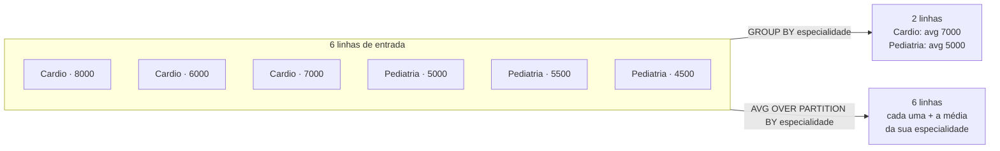
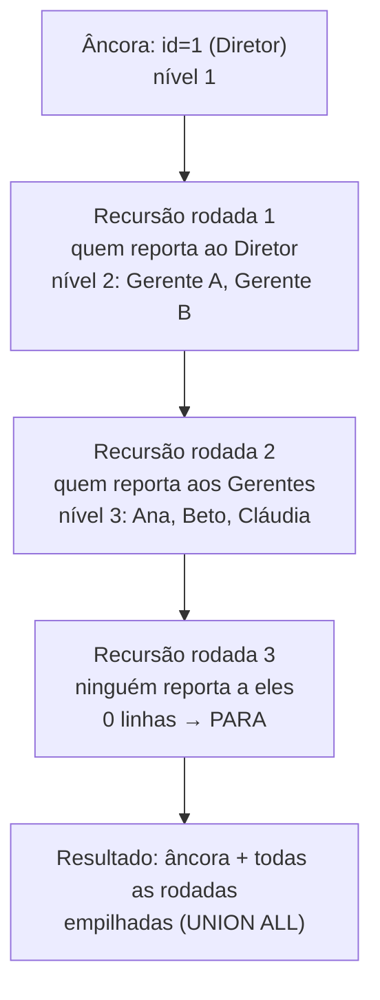
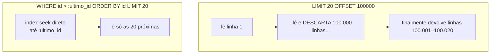

# SQL avançado

[[03 - SQL - consultas]] te deu o esqueleto: `SELECT`, os `JOIN`s, `GROUP BY`, subqueries. Isso resolve a maioria dos CRUDs. Mas existe um degrau onde o SQL deixa de ser "linguagem de buscar linha" e vira ferramenta de cálculo de verdade — e é exatamente esse degrau que separa um pleno de um júnior numa entrevista. Quando alguém pede "o top-3 médicos por especialidade", ou "o saldo acumulado dia a dia", ou "toda a árvore de categorias abaixo desta", a resposta ingênua é puxar tudo pra aplicação e processar em memória. A resposta sênior é uma query que faz o banco fazer o trabalho — porque o banco está sentado em cima dos índices e dos dados, e a rede entre você e ele é o gargalo.

Esta nota cobre cinco ferramentas que vivem nesse degrau: **window functions** (agregar sem colapsar), **CTEs** incluindo as **recursivas** (nomear passos e percorrer hierarquias), **`LATERAL JOIN`** (subquery correlacionada no `FROM`), **upsert** (inserir-ou-atualizar idempotente) e **keyset pagination** (paginar sem o castigo do `OFFSET` alto).

Voz-padrão **PostgreSQL**. Onde MySQL diverge de um jeito que cai em entrevista, eu aviso.

> [!tip] Resumo em uma linha
> Quase tudo aqui é "fazer o banco calcular em vez de trazer linhas cruas pra aplicação" — e a window function é o exemplo mais puro: ela resume **sem destruir** as linhas que resumiu.

---

## Window functions: agregar sem colapsar

Aqui está a confusão que toda window function precisa dissolver primeiro. Você já sabe `GROUP BY`: ele pega muitas linhas e **colapsa** num resumo — 30 médicos de Cardiologia viram **uma** linha com `COUNT(*) = 30`. Ótimo quando você quer o resumo. Péssimo quando você quer cada médico **junto com** o resumo do grupo dele. Com `GROUP BY` você teria que rodar a query duas vezes e juntar. Com window function, você faz numa passada.

Uma window function calcula sobre uma **janela** de linhas — um recorte do resultado — mas devolve **um valor por linha**, sem fundir nada. A linha sobrevive; ela só ganha uma coluna nova com o cálculo "olhando ao redor".

O contraste vale um diagrama, porque é o ponto que mais embaralha na cabeça:



**Leitura do diagrama:** as mesmas 6 linhas entram dos dois lados. O `GROUP BY` (em cima) **destrói** as 6 e devolve 2 — você perdeu os médicos individuais. A window function (embaixo) preserva as 6 e **anexa** a média do grupo em cada uma. Mesmo cálculo de média, destino oposto das linhas: `GROUP BY` colapsa, `OVER` preserva. Esse é o insight inteiro.

### A anatomia do OVER

Toda window function termina em `OVER (...)`, e dentro dos parênteses moram três peças:

```sql
funcao() OVER (
  PARTITION BY <colunas>   -- fatia o resultado em grupos (como um GROUP BY "fantasma")
  ORDER BY    <colunas>    -- ordena dentro de cada fatia (define "antes" e "depois")
  <frame>                  -- recorta uma sub-janela em torno da linha atual (opcional)
)
```

- **`PARTITION BY`** divide as linhas em fatias independentes. A função reinicia em cada fatia. Sem `PARTITION BY`, a janela é o resultado **inteiro** (uma fatia só). É o irmão do `GROUP BY`, mas que não funde nada.
- **`ORDER BY`** dá ordem **dentro** da fatia. É o que dá sentido a "ranking", "linha anterior", "acumulado até aqui". Sem ele, não há "anterior" nem "acumulado".
- **`frame`** (`ROWS`/`RANGE BETWEEN ...`) recorta uma sub-janela móvel — "as 3 linhas anteriores até a atual", base de médias móveis. Quando você usa `ORDER BY` numa função de agregação como `SUM`, o frame default já vira "do começo da fatia até a linha atual", que é justamente o que faz um running total.

### As funções que importam

Vou agrupar por função porque é assim que a entrevista cobra: "como você faria top-N por grupo?", "como faria um acumulado?".

**Numeração e ranking** — respondem "qual a posição desta linha na fatia?":

```sql
SELECT
  especialidade,
  nome,
  salario,
  ROW_NUMBER() OVER (PARTITION BY especialidade ORDER BY salario DESC) AS posicao,
  RANK()       OVER (PARTITION BY especialidade ORDER BY salario DESC) AS rank,
  DENSE_RANK() OVER (PARTITION BY especialidade ORDER BY salario DESC) AS rank_denso
FROM medicos;
```

As três parecem iguais, mas tratam **empates** de formas diferentes — e essa distinção é pergunta clássica:

| Função | Em caso de empate | Sequência num empate de 2º lugar |
| --- | --- | --- |
| `ROW_NUMBER` | nunca empata; desempata arbitrário | 1, 2, 3, 4 |
| `RANK` | empata e **pula** os números seguintes | 1, 2, 2, 4 |
| `DENSE_RANK` | empata e **não pula** | 1, 2, 2, 3 |

`ROW_NUMBER` é o que você usa pra "top-N por grupo" (mais sobre isso em LATERAL e abaixo). `RANK` é o ranking esportivo — dois em segundo, ninguém em terceiro. `DENSE_RANK` é o ranking "sem buracos".

**Navegação entre linhas** — `LAG` e `LEAD` espiam a linha anterior e a seguinte, dentro da ordem da fatia:

```sql
-- Variação de faturamento mês a mês
SELECT
  mes,
  faturamento,
  LAG(faturamento) OVER (ORDER BY mes)                        AS mes_anterior,
  faturamento - LAG(faturamento) OVER (ORDER BY mes)          AS variacao
FROM faturamento_mensal;
```

`LAG(coluna)` te dá o valor da coluna **na linha anterior** sem nenhum self-join. Antes das window functions, "comparar com o registro anterior" exigia um join correlacionado feio e lento. Hoje é uma linha. `LEAD` é o espelho — a próxima linha. Esse padrão também resolve **gap analysis**: detectar buracos numa sequência comparando cada valor com o anterior e vendo onde o salto é maior que 1.

**Agregações como janela** — `SUM`, `AVG`, `COUNT` etc. ganham um `OVER` e viram acumulados ou médias de contexto:

```sql
-- Saldo acumulado (running total) de uma conta, transação a transação
SELECT
  data,
  valor,
  SUM(valor) OVER (ORDER BY data, id) AS saldo_acumulado
FROM transacoes
WHERE conta_id = 42;
```

O `ORDER BY` dentro do `OVER` é o que transforma o `SUM` total num **acumulado**: cada linha soma do início da fatia até ela mesma. Troque por um frame `ROWS BETWEEN 2 PRECEDING AND CURRENT ROW` e o mesmo `AVG` vira uma **média móvel de 3 períodos** — o pão-com-manteiga de dashboard.

**Distribuição** — `NTILE(n)` racha a fatia ordenada em `n` baldes de tamanho parecido (quartis, decis, percentis):

```sql
-- Em que quartil de salário cada médico cai (1 = mais alto)
SELECT nome, salario,
       NTILE(4) OVER (ORDER BY salario DESC) AS quartil
FROM medicos;
```

`NTILE(100)` te dá percentis; `NTILE(10)`, decis. Útil pra segmentação ("os 10% que mais faturam") sem matemática manual.

> [!note] Onde a window function entra na ordem lógica
> Lembra da ordem lógica de [[03 - SQL - consultas]]? Window functions são avaliadas **depois** de `GROUP BY`/`HAVING` e **junto** com o `SELECT` — antes de `ORDER BY` e `LIMIT`. Consequência prática que vira pegadinha: **você não pode usar uma window function no `WHERE`**, porque o `WHERE` roda muito antes dela. Pra "filtrar pelo resultado de uma window function" (ex.: só os de `ROW_NUMBER() = 1`), você embrulha a query numa subquery ou CTE e filtra **por fora**. É exatamente o que o top-N por grupo faz.

---

## CTEs: nomear os passos

Uma **CTE (Common Table Expression)** é uma subquery batizada com `WITH`, que vive só durante aquela query. Em vez de aninhar subquery dentro de subquery dentro de subquery — a famosa "pirâmide invertida" que ninguém consegue ler — você dá nomes aos passos e os encadeia de cima pra baixo, como variáveis num programa.

```sql
WITH pacientes_frequentes AS (
  SELECT paciente_id, COUNT(*) AS visitas
  FROM   consultas
  WHERE  data >= NOW() - INTERVAL '1 year'
  GROUP BY paciente_id
  HAVING COUNT(*) >= 10
),
com_nome AS (
  SELECT p.nome, pf.visitas
  FROM   pacientes p
  JOIN   pacientes_frequentes pf ON pf.paciente_id = p.id
)
SELECT * FROM com_nome ORDER BY visitas DESC;
```

Leia de cima pra baixo: "primeiro defino quem são os pacientes frequentes; depois junto com o nome; depois ordeno". Cada CTE pode referenciar as anteriores. O ganho é **legibilidade** — a mesma lógica como subquery aninhada seria ilegível. O custo é que CTE é uma fronteira mental que às vezes esconde o que o otimizador está fazendo (falo já-já).

### A nuance de materialização (PostgreSQL)

Esta é a parte que vira pergunta de senioridade, e onde a versão do Postgres muda a resposta. Por muito tempo, no PostgreSQL, a CTE era um **optimization fence** — uma "cerca de otimização". O banco **sempre materializava** a CTE: calculava o resultado inteiro, guardava num buffer temporário, e só então a query externa lia desse buffer. O problema: o otimizador **não conseguia empurrar filtros da query externa pra dentro da CTE**. Se a CTE produzia 1 milhão de linhas e o `WHERE` externo só queria 10, o banco materializava o milhão e descartava quase tudo.

A partir do **PostgreSQL 12**, isso mudou: CTEs que são usadas **uma única vez**, não são recursivas e não têm efeito colateral passam a ser **inlined** por default — o otimizador funde a CTE na query externa, podendo empurrar filtros pra dentro, como faria com uma subquery comum. Você ainda controla manualmente:

```sql
WITH dados AS MATERIALIZED     ( ... )   -- força a cerca: calcula uma vez, guarda
WITH dados AS NOT MATERIALIZED ( ... )   -- força inline: funde na query externa
```

- Use `MATERIALIZED` quando a CTE é **cara e reusada várias vezes** (calcular uma vez e reaproveitar compensa), ou quando você **quer** a cerca de propósito (ex.: forçar uma ordem de avaliação, ou conter um `UPDATE ... RETURNING`).
- Use `NOT MATERIALIZED` (ou confie no default ≥ 12) quando a CTE é só açúcar de legibilidade e você quer o otimizador livre pra empurrar filtros.

> [!warning] Divergência e pegadinha de upgrade
> Esse comportamento é **específico do PostgreSQL**. No MySQL e em outros bancos a semântica de materialização é diferente. E há uma armadilha real de migração: equipes que dependiam (sabendo ou não) da CTE ser uma cerca em PG ≤ 11 viram queries mudarem de plano — pra melhor **ou pra pior** — ao subir pro 12+. Se você tinha uma CTE que era cara e usada várias vezes contando com a materialização automática, adicione `MATERIALIZED` explícito ao migrar. "CTE é sempre uma cerca" é uma afirmação que era verdadeira e deixou de ser; saber a data dessa virada é sinal de senioridade.

### CTE recursiva: percorrer hierarquias

Aqui mora o superpoder que [[03 - SQL - consultas]] adiou. Lembra do self-join que pegava médico + supervisor? Ele só sobe **um** nível. Pra percorrer a cadeia inteira — toda a árvore de categorias abaixo de uma raiz, todo o org chart sob um diretor, todos os comentários aninhados de um thread — você precisa de **recursão**, e o SQL faz isso com uma CTE que **referencia a si mesma**.

```sql
WITH RECURSIVE subordinados AS (
    -- 1. Termo âncora: o ponto de partida (o diretor, id = 1)
    SELECT id, nome, supervisor_id, 1 AS nivel
    FROM   funcionarios
    WHERE  id = 1

    UNION ALL

    -- 2. Termo recursivo: quem reporta a alguém já na CTE
    SELECT f.id, f.nome, f.supervisor_id, s.nivel + 1
    FROM   funcionarios f
    JOIN   subordinados s ON f.supervisor_id = s.id
)
SELECT * FROM subordinados ORDER BY nivel, nome;
```

A estrutura é sempre essa: um **termo âncora** (a base, não-recursiva) `UNION ALL` um **termo recursivo** que se junta à própria CTE. O banco roda em rodadas: a âncora produz o nível 1; o termo recursivo usa o que acabou de sair pra produzir o nível 2; usa o nível 2 pra produzir o nível 3; e para quando uma rodada não produz nenhuma linha nova.



**Leitura do diagrama:** a âncora joga a raiz na CTE. Cada rodada da recursão olha **só o que a rodada anterior produziu** e busca os filhos diretos daquilo, descendo um nível por vez. Quando uma rodada não encontra ninguém novo (ninguém reporta às folhas), a recursão **para** e o resultado é a pilha de tudo que saiu. A coluna `nivel` que eu carrego (`s.nivel + 1`) é só pra saber a profundidade — útil pra indentar a árvore na tela.

> [!warning] Recursão infinita e o freio
> Se a hierarquia tiver um **ciclo** (A reporta a B que reporta a A — dado corrompido, ou um grafo de verdade em vez de árvore), a CTE recursiva **roda pra sempre**. Dois freios: o PostgreSQL moderno suporta a cláusula `CYCLE` (SQL padrão) pra detectar e cortar ciclos; e o clássico é carregar um array de ids visitados e filtrar com `WHERE NOT id = ANY(caminho)`. Em entrevista, mencionar que recursão sem proteção de ciclo é um risco real vale ponto. `UNION ALL` (não `UNION`) é o normal aqui — `UNION` deduplicaria a cada rodada, mais caro e raramente o que você quer.

CTE recursiva é a resposta SQL pra hierarquias modeladas como **adjacency list** (cada linha aponta pro pai). Modelagens alternativas (closure table, nested set, `ltree` no PG) trocam complexidade de escrita por leitura mais barata — isso é assunto de [[04 - Modelagem e normalização]]; aqui o ponto é que, **dada** uma adjacency list, a CTE recursiva é como você a percorre.

---

## LATERAL JOIN: a subquery que enxerga a esquerda

Subquery normal no `FROM` é **independente**: ela não pode olhar as colunas das outras tabelas do `FROM`. `LATERAL` quebra essa regra. Uma subquery `LATERAL` pode **referenciar colunas das tabelas à sua esquerda** — é uma subquery correlacionada, mas no `FROM` em vez do `WHERE`. O modelo mental: pra **cada** linha da tabela à esquerda, o banco roda a subquery `LATERAL` com os valores daquela linha plugados dentro.

Isso resolve elegantemente o problema que mais aparece em entrevista de SQL: **top-N por grupo**. "As 3 consultas mais recentes de **cada** médico." Com window function você faria `ROW_NUMBER` e filtraria por fora. Com `LATERAL`, você expressa direto:

```sql
SELECT m.nome, c.data, c.tipo
FROM   medicos m
CROSS JOIN LATERAL (
    SELECT data, tipo
    FROM   consultas
    WHERE  medico_id = m.id        -- ← enxerga m.id, a tabela à esquerda
    ORDER BY data DESC
    LIMIT  3                        -- ← o "N" do top-N, por médico
) c;
```

O `WHERE medico_id = m.id` lá dentro só é possível por causa do `LATERAL` — sem ele, a subquery não conheceria `m`. Pra cada médico, o banco roda aquele `SELECT ... ORDER BY data DESC LIMIT 3` e cola o resultado ao lado. É o top-3 por grupo, limpo, sem `ROW_NUMBER` nem subquery externa de filtro.

Detalhe de junção: `CROSS JOIN LATERAL` descarta médicos sem nenhuma consulta (a subquery volta vazia). Se você quer **todos** os médicos, mesmo os sem consulta (com `NULL`), use `LEFT JOIN LATERAL ... ON true` — mesmo raciocínio de `LEFT JOIN` de [[03 - SQL - consultas]].

> [!tip] LATERAL vs window function pra top-N
> As duas resolvem top-N por grupo. Heurística: **`LATERAL` costuma ser mais rápido quando há um índice em `(grupo, ordem)`** — ele faz um index scan pequeno por grupo, parando no `LIMIT`. A versão com `ROW_NUMBER` tende a ordenar **todas** as linhas de todos os grupos antes de filtrar. Pra "top-3 de milhões de linhas", `LATERAL` com índice em `(medico_id, data DESC)` ganha. Sempre confirme no plano — [[08 - EXPLAIN e otimização]]. (MySQL tem `LATERAL` desde a versão 8.0.14.)

---

## Upsert: inserir-ou-atualizar sem corrida

"Insere se não existe, atualiza se já existe" parece trivial até você tentar e perceber a **race condition**: dois processos checam "existe?" ao mesmo tempo, ambos veem "não", ambos inserem — e você ganha uma duplicata ou um erro de chave única. A solução ingênua (`SELECT` e depois `INSERT` ou `UPDATE` na aplicação) é uma corrida clássica. O upsert resolve isso **atomicamente, dentro do banco**, num único comando.

No PostgreSQL é `INSERT ... ON CONFLICT`:

```sql
-- Contador de visualizações: incrementa se existe, cria com 1 se não
INSERT INTO contadores (pagina_id, views)
VALUES (42, 1)
ON CONFLICT (pagina_id) DO UPDATE
SET views = contadores.views + 1;
```

A leitura: tenta inserir `(42, 1)`. Se bater num conflito **na chave `pagina_id`** (já existe linha 42), em vez de estourar erro, executa o `DO UPDATE` — somando 1 ao valor que já está lá. Tudo numa operação atômica: nenhum outro processo se enfia no meio. É assim que se faz **contador sem perder incremento** e **idempotência** (rodar a mesma operação duas vezes não quebra nada — vital pra consumers de fila que podem receber a mensagem duplicada).

Duas peças importam:
- O `ON CONFLICT (pagina_id)` precisa de uma **constraint `UNIQUE` ou a PK** naquela coluna — é o conflito nela que dispara o desvio. Sem unicidade declarada, não há "conflito" pra detectar.
- Dentro do `DO UPDATE`, a linha que você **tentou** inserir está disponível como `EXCLUDED`. Útil pra "atualiza com o valor novo que eu trazia": `SET views = EXCLUDED.views`. E há `ON CONFLICT DO NOTHING` pra "ignora silenciosamente se já existe" (insert idempotente sem update).

> [!note] Divergência MySQL e o MERGE padrão
> O MySQL escreve a mesma ideia como **`INSERT ... ON DUPLICATE KEY UPDATE`**, com `VALUES(coluna)` no lugar do `EXCLUDED` do Postgres. Mesma semântica, sintaxe diferente — bom detalhe cross-banco pra entrevista.
>
> Existe ainda o **`MERGE`**, comando do SQL padrão (sempre presente em Oracle e SQL Server, e **no PostgreSQL desde a versão 15**). Ele é mais geral — faz `INSERT`/`UPDATE`/`DELETE` condicionais numa tacada, casando uma tabela-fonte contra uma tabela-alvo. Mas, pro caso comum de upsert de **uma linha**, o `ON CONFLICT` é mais simples e tem uma garantia de atomicidade mais forte sob concorrência. Use `MERGE` pra sincronização em lote (fonte inteira contra alvo); use `ON CONFLICT` pro upsert pontual.

---

## Keyset pagination: paginar sem o castigo do OFFSET

Paginação ingênua usa `LIMIT ... OFFSET ...` — página 1 é `OFFSET 0`, página 2 é `OFFSET 20`, e assim por diante. Funciona, e é o que [[03 - SQL - consultas]] mostrou. O problema aparece **fundo no resultado**: `OFFSET 100000` não é uma operação barata. O banco **não pula** mágicamente pra linha 100.001 — ele lê, ordena e **descarta** as 100.000 primeiras linhas pra te entregar as 20 seguintes. O custo cresce **linearmente** com o offset. Página 1: instantânea. Página 5.000: lenta. Página 50.000: timeout.



**Leitura do diagrama:** o `OFFSET` (em cima) faz trabalho proporcional à **profundidade** da página — toda página funda paga pela leitura de tudo que veio antes. O keyset (embaixo) faz trabalho proporcional ao **tamanho da página** — sempre 20 linhas, esteja você na página 1 ou na 50.000. O custo do keyset é **constante**; o do offset, **linear na profundidade**. Essa é a diferença inteira.

A técnica do **keyset** (também chamado de **seek method** ou **cursor pagination**): em vez de "pule N linhas", você diz "me dê os que vêm **depois do último que eu já vi**". O cliente lembra a chave da última linha da página atual e a manda de volta:

```sql
-- Primeira página
SELECT id, nome, criado_em
FROM   medicos
ORDER BY criado_em DESC, id DESC
LIMIT  20;

-- Próxima página: "depois do último que vi"
SELECT id, nome, criado_em
FROM   medicos
WHERE  (criado_em, id) < (:ultimo_criado_em, :ultimo_id)   -- comparação de tupla
ORDER BY criado_em DESC, id DESC
LIMIT  20;
```

O pulo do gato é o `WHERE (criado_em, id) < (...)`: com um índice em `(criado_em DESC, id DESC)`, o banco faz um **index seek** direto pro ponto de corte e lê só as 20 próximas. Zero linhas descartadas. A **comparação de tupla** `(a, b) < (x, y)` resolve o desempate de forma elegante — primeiro por `criado_em`, e quando empata, pelo `id` — garantindo ordem total e estável (por isso a chave de ordenação precisa terminar em algo único, tipicamente o `id`; senão linhas com o mesmo `criado_em` podem pular ou repetir entre páginas).

Os trade-offs, honestamente:
- **Keyset não faz "pular pra página 37"**. Ele só faz "próxima" e "anterior". Pra feeds, scroll infinito e exportações (os casos onde a paginação funda dói), isso é exatamente o que você quer. Pra uma UI com "página 1, 2, 3, ... 500" clicável, offset moderado ainda serve — o problema é só o offset **alto**.
- Keyset é **mais estável sob inserções/remoções concorrentes**: se alguém insere uma linha enquanto você pagina, o offset "escorrega" (você pode ver uma linha duas vezes ou pular uma); o keyset, ancorado numa chave, não escorrega.

Esse mesmo `OFFSET` alto reaparece como armadilha catalogada em [[10 - Performance e armadilhas]] — aqui ficou o **conserto** (keyset); lá fica o diagnóstico no meio de uma lista de antipadrões.

---

## Em entrevista

> Past the basics, the SQL that signals seniority is the stuff that makes the database do the work instead of pulling raw rows into the app. **Window functions** are the clearest example: they aggregate *without collapsing* — `RANK() OVER (PARTITION BY ... ORDER BY ...)` gives me each row plus its standing in the group, where `GROUP BY` would have destroyed the rows. I use `ROW_NUMBER` for top-N, `LAG`/`LEAD` for period-over-period deltas, and `SUM() OVER (ORDER BY ...)` for running totals. One gotcha I always mention: you can't filter on a window function in `WHERE` — it's evaluated too late — so you wrap the query and filter outside.
>
> For readability I lean on **CTEs** with `WITH`, naming each step instead of nesting subqueries. I know the PostgreSQL materialization nuance: before version 12 a CTE was an optimization fence and was always materialized; from 12 on, single-use CTEs are inlined by default, and I can force either behavior with `MATERIALIZED` / `NOT MATERIALIZED`. **Recursive CTEs** are how I walk hierarchies — an org chart or a category tree — with an anchor term `UNION ALL` a recursive term, and I'd guard against cycles with the `CYCLE` clause or a visited-path array.
>
> For **top-N per group** I often prefer a **`LATERAL` join** over `ROW_NUMBER` because, with an index on `(group, sort_key)`, it does a small index scan per group and stops at the `LIMIT` instead of sorting everything. For idempotent writes and race-free counters I use **`INSERT ... ON CONFLICT DO UPDATE`** — `ON DUPLICATE KEY UPDATE` in MySQL — and I know `MERGE` exists for batch sync. And I never paginate deep result sets with high `OFFSET`, because the database reads and throws away every row before the offset; I use **keyset pagination** — `WHERE (sort_col, id) < (:last_sort, :last_id) ORDER BY ... LIMIT n` over an index — which is constant-cost regardless of depth and stable under concurrent writes.

### Vocabulário

- função de janela → window function
- janela / partição → window / partition (`PARTITION BY`)
- número da linha → row number (`ROW_NUMBER`)
- classificação / classificação densa → rank / dense rank
- soma acumulada → running total
- média móvel → moving average
- expressão de tabela comum → common table expression (CTE)
- CTE recursiva → recursive CTE
- termo âncora / termo recursivo → anchor term / recursive term
- cerca de otimização → optimization fence
- materializar → materialize
- inserir-ou-atualizar → upsert
- idempotência → idempotency
- condição de corrida → race condition
- paginação por deslocamento → offset pagination
- paginação por cursor / chave → keyset / cursor / seek pagination
- comparação de tupla → tuple / row comparison
- hierarquia / árvore → hierarchy / tree
- junção lateral → lateral join

---

> [!info] Lastro
> **Window functions** (`OVER`, `PARTITION BY`, `ORDER BY`, frames; `ROW_NUMBER`/`RANK`/`DENSE_RANK`/`LAG`/`LEAD`/`NTILE`/agregações-como-janela) e **CTEs recursivas** (`WITH RECURSIVE`, termo âncora `UNION ALL` termo recursivo, cláusula `CYCLE`) são padrão SQL, documentados no manual do PostgreSQL e amplamente cobertos (PostgreSQL docs, Use The Index Luke). A regra de que window functions não podem ser usadas no `WHERE` (avaliadas após `GROUP BY`/`HAVING`, antes de `ORDER BY`) decorre da ordem lógica de [[03 - SQL - consultas]].
>
> A virada de **materialização de CTE no PostgreSQL 12** (de optimization fence sempre-materializada para inlining por default em CTEs de uso único, com `MATERIALIZED`/`NOT MATERIALIZED` explícitos) é real e documentada (EnterpriseDB blog "PostgreSQL's CTEs are optimisation fences", release notes do PG 12). É **específica do PostgreSQL** — outros bancos têm semântica própria.
>
> **`LATERAL JOIN`** como caminho limpo pra top-N por grupo, **`INSERT ... ON CONFLICT DO UPDATE`** (vs `ON DUPLICATE KEY UPDATE` no MySQL, vs `MERGE` no SQL padrão / PG 15+) e **keyset pagination** (seek method: `OFFSET` alto lê e descarta tudo antes do offset, custo linear na profundidade; keyset com comparação de tupla sobre índice tem custo constante e é estável sob escrita concorrente) são técnicas consolidadas, confirmadas em material atual sobre paginação (Taylor Brazelton, CockroachDB docs, Stacksync) e upsert.
>
> **Ressalvas:** sintaxe e disponibilidade variam por banco — `EXCLUDED` (PG) vs `VALUES()` (MySQL) no upsert; `LATERAL` no MySQL só a partir do 8.0.14; `MERGE` no PG só a partir do 15; a comparação de tupla `(a,b) < (x,y)` no keyset é padrão mas nem todo banco otimiza igual. A voz-padrão aqui é PostgreSQL; números de versão e comportamento de plano valem teste prático com [[08 - EXPLAIN e otimização]].
