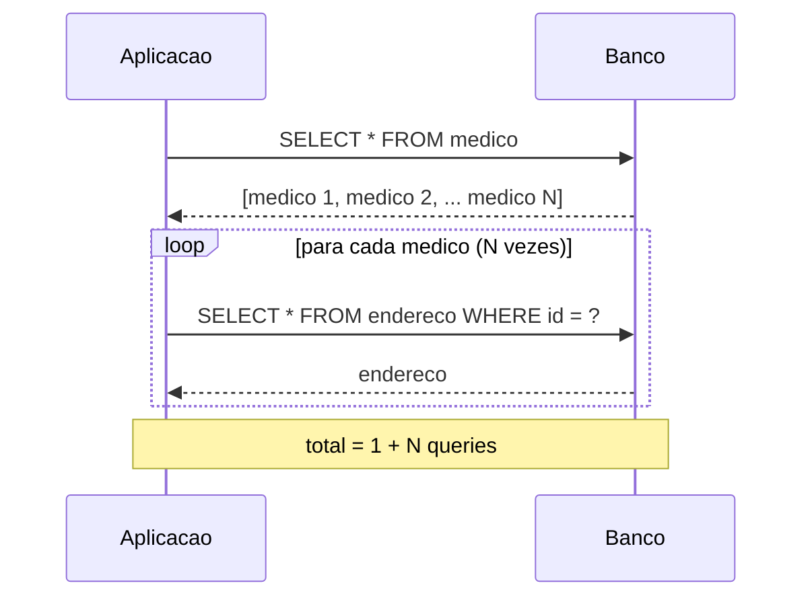
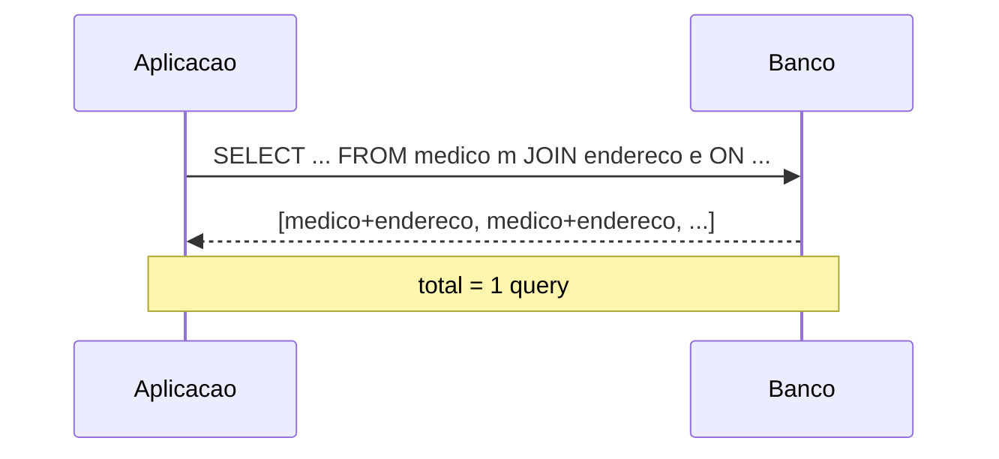
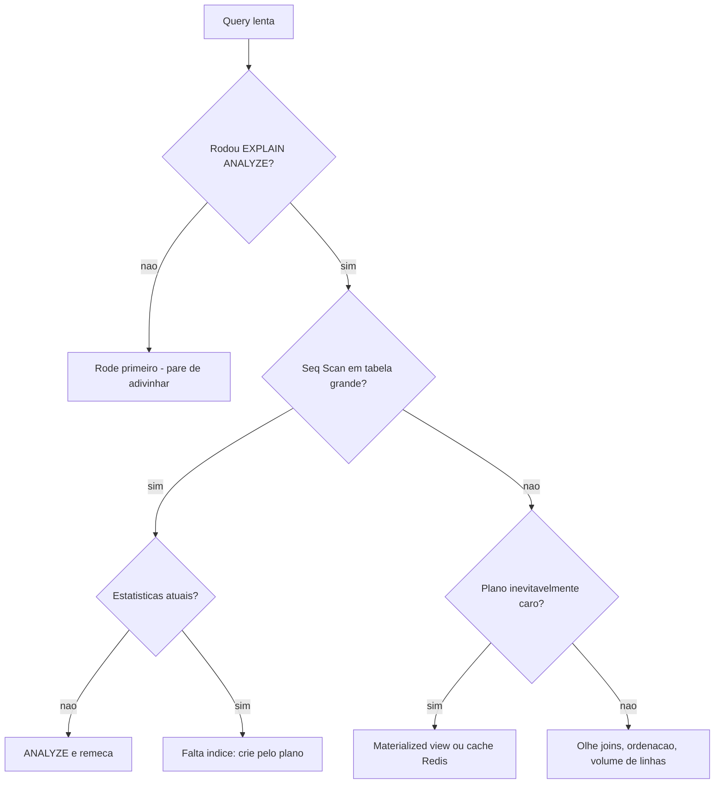
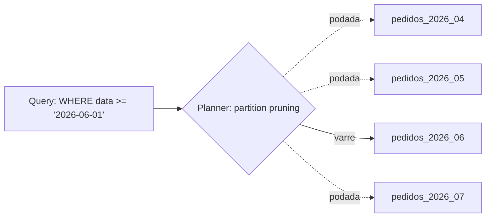
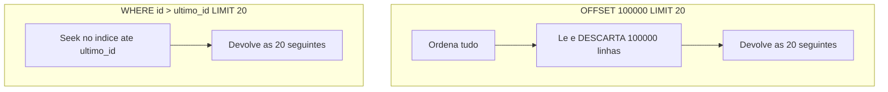
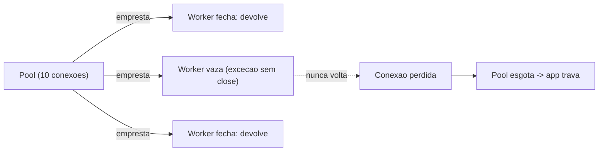

# Performance e armadilhas

> **Em uma linha:** quase todo problema de performance de banco é um destes punhados de erros repetidos — N+1, query sem índice, tabela que ninguém limpou, paginação que relê o mundo. Conhecê-los pelo nome é metade do conserto.

Tem uma coisa curiosa sobre performance de banco de dados. Você passa a carreira inteira imaginando que o gargalo vai ser algo sofisticado — um algoritmo de junção exótico, um detalhe de B-Tree, a velocidade do disco. E aí você abre o profiler de um sistema lento de verdade e o que está lá é quase sempre constrangedoramente simples: a aplicação está disparando duzentas queries onde uma bastava, ou está varrendo cinco milhões de linhas porque ninguém criou um índice, ou está relendo um milhão de registros a cada página de uma listagem.

Esta nota é o catálogo desses erros. Não é uma lista de truques avançados — é o conjunto de armadilhas que, na prática, derruba a performance da maioria dos sistemas. A boa notícia: depois que você aprende a reconhecê-las, elas viram quase um reflexo. Você lê um trecho de código e o N+1 salta da tela. Você vê um `OFFSET 50000` e já sabe o que vai acontecer.

Antes de mergulhar, um princípio que atravessa tudo: **meça antes de culpar.** A nota [[08 - EXPLAIN e otimização]] é o instrumento. Quase todo erro abaixo se manifesta no plano de execução — um `Seq Scan` onde devia haver `Index Scan`, um número de queries que explode com o tamanho da lista, um custo que cresce com a profundidade da página. Otimizar no achismo é como consertar um carro de olhos fechados.

---

## A armadilha número um: N+1 queries

Se existe um único bug de performance que você precisa saber reconhecer de olhos fechados, é o N+1. Ele é tão comum que tem nome próprio, e é tão fácil de cometer que praticamente todo ORM o produz por padrão se você não tomar cuidado.

A mecânica é simples. Você carrega uma **lista** de objetos. Depois, dentro de um loop, você acessa um **relacionamento** de cada objeto — o endereço de cada médico, os itens de cada pedido, o autor de cada post. Se esse relacionamento for carregado de forma **lazy** (sob demanda), cada acesso dispara uma query nova. Você pediu uma lista de N elementos e o banco recebeu 1 query para a lista mais N queries para os relacionamentos. Daí o nome: **1 + N**.

Vamos ver no concreto, com JPA/Hibernate (mas guarde isto: o conceito é agnóstico de stack — já volto nesse ponto):

```java
// N+1: 1 query para listar médicos + N queries para os endereços
List<Medico> medicos = medicoRepository.findAll();   // 1 query: SELECT * FROM medico
for (Medico m : medicos) {
    System.out.println(m.getEndereco().getCidade());  // cada get dispara um SELECT
}
```

Aquele inocente `m.getEndereco()` dentro do loop é uma bomba-relógio. Em desenvolvimento, com cinco médicos no banco, ninguém percebe — são seis queries, roda em milissegundos. Em produção, com mil médicos numa listagem, são mil e uma queries indo e voltando pela rede, cada uma com seu round-trip de latência. O endpoint que demorava 30ms passa a demorar 2 segundos, e o time fica olhando para o servidor de aplicação sem entender por quê.

Vamos desenhar o problema. Veja como a contagem de queries cresce com a lista:



**Leitura do diagrama:** a primeira query traz a lista — uma ida e volta. Mas o loop transforma cada elemento da lista em uma nova ida e volta ao banco. Com N grande, é o `loop` que domina o custo: não é o trabalho do banco que pesa, é a **quantidade de round-trips**. Mil viagens à rede, mesmo que cada query seja trivial, somam latência que mata o endpoint.

### A cura: traga tudo numa query só

A solução, em essência, é **carregar o relacionamento junto com a lista**, numa única query com `JOIN`. O ORM passa a buscar médicos e endereços de uma vez:

```java
// JPQL com JOIN FETCH: 1 query traz tudo
@Query("SELECT m FROM Medico m JOIN FETCH m.endereco")
List<Medico> findAllComEndereco();
```

Agora o desenho é outro:



**Leitura do diagrama:** o loop sumiu. O `JOIN` deixa o trabalho de casar médico com endereço para o banco — que faz isso de forma eficiente, em uma passada — e a aplicação recebe tudo pronto. Uma viagem à rede em vez de mil e uma. É a diferença entre buscar todas as compras numa lista única e ir ao mercado mil vezes, uma por item.

No mundo JPA/Spring você tem algumas ferramentas para isso, e a escolha entre elas importa:

- **`JOIN FETCH` (JPQL):** você escreve a query e diz explicitamente "traga o relacionamento junto". Direto, mas acopla o fetch à query — se você quer carregar o mesmo dado com e sem o relacionamento, precisa de duas queries.
- **`@EntityGraph`:** define o plano de fetch de forma **declarativa**, separado da query. Você anota o método do repositório dizendo quais relacionamentos carregar; a query em si fica limpa. Mais reutilizável e mais limpo quando o mesmo agregado é lido de várias formas.
- **Projeções / DTO:** muitas vezes você nem precisa da entidade inteira. Carregue só os campos que a tela usa, via uma interface ou classe de projeção. Menos dados na rede, menos pressão de memória, e o N+1 simplesmente não tem como acontecer porque você não está navegando relacionamentos lazy.
- **Batch fetching (`@BatchSize` / `hibernate.default_batch_fetch_size`):** quando carregar tudo num JOIN não é viável, o Hibernate pode agrupar os N selects em poucas queries com `WHERE id IN (?, ?, ?, ...)`. Vira 1 + (N/tamanho_do_lote) em vez de 1 + N. Não é tão bom quanto o JOIN, mas é uma rede de segurança barata.

A mecânica específica do JPA/Hibernate — lazy vs eager, os tipos de `@EntityGraph`, o `open-session-in-view` que esconde o N+1 até produção — fica em [[Spring Boot]]. Aqui o que importa é o conceito.

### O ponto que separa o senior: N+1 é universal

Aqui está a coisa que vale ouro em entrevista. O N+1 **não é um defeito do Hibernate**. É uma consequência estrutural de qualquer camada que mapeia objetos para tabelas e oferece carregamento lazy de relacionamentos. Todo ORM sério tem essa armadilha, com nomes diferentes para a mesma cura:

| Stack | Onde mora o N+1 | A cura |
| --- | --- | --- |
| Hibernate / JPA | acesso lazy num loop | `JOIN FETCH`, `@EntityGraph`, batch size |
| TypeORM (Node) | relações lazy / `find` sem `relations` | `relations: [...]`, `leftJoinAndSelect` |
| Prisma (Node) | acesso a relação fora do `include` | `include` / `select` no query |
| ActiveRecord (Rails) | `has_many` acessado em loop | `includes(:assoc)` (eager loading) |
| EF Core (.NET) | navegação lazy | `Include()` / `ThenInclude()` |

Repare no padrão: em **todos** eles a doença é a mesma (lazy loading dentro de iteração) e o remédio é o mesmo (dizer ao ORM, de antemão, "carregue isto junto"). Quando você entende o N+1 como um fenômeno conceitual — e não como um detalhe de configuração do Hibernate — você o reconhece em qualquer linguagem, e é exatamente esse tipo de transferência que um entrevistador sênior está sondando.

### Como detectar antes que doa

N+1 é insidioso porque some em dev e aparece em prod. As ferramentas de detecção:

- **Logar o SQL gerado** (`spring.jpa.show-sql`, `hibernate.SQL` em DEBUG) e contar as queries por requisição. Se uma listagem de 100 itens gera 101 linhas de log, está na sua frente.
- **Hibernate Statistics** — expõe contadores de queries executadas por sessão.
- **Proxies de datasource** — `p6spy`, `datasource-proxy`, ou ferramentas como o `Hypersistence Utils` que falham o teste se mais de N queries rodarem. Essa é a abordagem mais robusta: você escreve um teste de integração que assere "este endpoint deve disparar no máximo 2 queries" e o N+1 vira um regression bug pego no CI, não um incidente em produção.

---

## Queries lentas: meça, não adivinhe

Saindo do N+1, a categoria seguinte é a query individual que demora. E aqui a regra de ouro é quase um mantra: **rode [[08 - EXPLAIN e otimização]] antes de culpar qualquer coisa.** A intuição sobre o que está lento é notoriamente ruim. Você jura que o problema é falta de índice e o `EXPLAIN ANALYZE` revela que o índice existe mas o planner não o usa porque as estatísticas estão desatualizadas.

O roteiro de diagnóstico, em ordem:

1. **`EXPLAIN ANALYZE` na query.** Procure `Seq Scan` em tabela grande (falta índice), `rows` estimado muito diferente do `actual rows` (estatísticas velhas), `Nested Loop` sobre muitas linhas (junção que virou quase-cartesiano). Detalhes de leitura de plano em [[08 - EXPLAIN e otimização]].
2. **Estatísticas atualizadas?** Rode `ANALYZE` na tabela. O planner do PostgreSQL decide o plano com base em histogramas de distribuição dos dados. Se você acabou de inserir um milhão de linhas e não rodou `ANALYZE`, o planner ainda acha que a tabela tem mil linhas e escolhe planos burros. Isso causa um sintoma clássico: a query era rápida, ficou lenta de repente sem ninguém mexer no código. Quase sempre é estatística defasada.
3. **Falta índice de verdade?** Aí sim, crie — guiado pelo plano, não pelo palpite. Veja [[07 - Índices]] para qual índice e em que ordem de colunas.
4. **O plano é inevitavelmente caro?** Algumas queries são intrinsecamente pesadas — um relatório que agrega o ano inteiro, um dashboard que cruza meio sistema. Para esses, índice não salva. As saídas são arquiteturais:
   - **Materialized view** — você pré-computa o relatório caro e consulta o resultado pronto, atualizando-o periodicamente (`REFRESH MATERIALIZED VIEW`). Troca dado fresco por velocidade. Ótimo para relatórios que toleram alguns minutos de atraso.
   - **Cache em Redis** — para o que muda pouco e é lido muito (configurações, catálogos, contadores), guarde o resultado fora do banco. Veja [[14 - NoSQL e polyglot persistence]] para o papel do Redis como cache. O cuidado eterno: **invalidação**. Cache sem estratégia de invalidação é só uma forma elegante de servir dado errado.

O diagnóstico em fluxograma:



**Leitura do diagrama:** o fluxo força a disciplina. Nenhum caminho leva direto a "crie um índice" sem passar pelo `EXPLAIN`. E há dois ramos que muita gente esquece: o `ANALYZE` (estatísticas defasadas disfarçadas de falta de índice) e a aceitação de que **algumas queries não dá para indexar para a felicidade** — a resposta certa ali é pré-computar ou cachear, não martelar índice em cima.

---

## Tabelas gigantes: quando o tamanho vira o problema

Uma tabela com cinco milhões de linhas e os índices certos costuma ir bem. O problema começa quando ela cresce para centenas de milhões e nunca para de crescer — logs, eventos, métricas, histórico de pedidos. Aí três técnicas entram em jogo.

### Particionamento

A ideia é dividir uma tabela logicamente única em **partições físicas** separadas, por um critério. O PostgreSQL faz isso de forma declarativa, com três estratégias:

- **Range** — por faixas contínuas, tipicamente datas. Uma partição por mês de `pedidos`. A faixa é inclusiva embaixo e exclusiva em cima, então `[jan, fev)` e `[fev, mar)` não se sobrepõem.
- **List** — por valores discretos. Uma partição por região, por status, por `tenant_id`.
- **Hash** — por um módulo de hash da chave. Distribui as linhas de forma uniforme entre N partições quando não há um critério natural de range ou lista.

O ganho aparece no **partition pruning** (poda de partição): quando a query filtra pelo critério de particionamento, o planner **prova** que só uma (ou poucas) partições podem conter linhas que satisfazem o `WHERE`, e ignora todas as outras. Em vez de varrer a tabela inteira de duzentos milhões de linhas, ele varre só a partição do mês que você pediu.



**Leitura do diagrama:** a query filtra por data de junho. O planner olha a definição de cada partição e prova que abril, maio e julho não podem conter junho — então as **poda** (linhas tracejadas), sem nem abri-las. Só `pedidos_2026_06` é varrida. O custo da query deixou de depender do tamanho total da tabela e passou a depender só do tamanho da partição relevante. Bônus operacional enorme: apagar dados antigos vira `DROP TABLE pedidos_2026_04` — instantâneo — em vez de um `DELETE` que gera milhões de tuplas mortas.

### VACUUM e autovacuum

Esta é a armadilha favorita de quem vem de outros bancos para o PostgreSQL, e ela amarra direto com [[06 - Isolamento e anomalias]]. Sob **MVCC**, o PostgreSQL nunca sobrescreve uma linha. Cada `UPDATE` cria uma **nova versão** da tupla e deixa a antiga marcada como morta; cada `DELETE` apenas marca a tupla como morta. Isso é o que permite que leitores não bloqueiem escritores — cada transação enxerga o snapshot que lhe cabe. Mas há um preço: as **tuplas mortas** ficam ocupando espaço no arquivo da tabela até alguém limpá-las.

Esse alguém é o **VACUUM**. O autovacuum é o daemon que roda automaticamente, varre as tabelas, marca o espaço das tuplas mortas como reutilizável e atualiza estatísticas (o `ANALYZE` da seção anterior também é trabalho dele). Se ele não acompanha o ritmo de escrita, a tabela e seus índices **incham** — o que se chama de *bloat*. O espaço em disco cresce mesmo que o volume real de dados fique estável, e as queries ficam mais lentas porque há mais páginas para ler, a maioria cheia de lixo.

Duas pegadinhas que valem em entrevista:

- **O default é frouxo para tabelas grandes.** O `autovacuum_vacuum_scale_factor` padrão é 0.2 — autovacuum só dispara quando 20% da tabela está morta. Numa tabela de um bilhão de linhas, isso é esperar duzentos milhões de tuplas mortas acumularem antes de qualquer limpeza. Em tabelas grandes e quentes, você baixa esse fator por tabela.
- **Transação longa trava o VACUUM.** Há uma regra dura do MVCC: o VACUUM **não pode** remover uma tupla morta se existe qualquer transação ainda ativa que poderia precisar enxergá-la. Logo, uma transação que fica aberta por horas (um batch mal feito, uma conexão que vazou) **impede a limpeza do banco inteiro** durante todo esse tempo, e o bloat dispara. É mais um motivo, além dos locks, para manter transações curtas.

Nota técnica: o `VACUUM` comum libera o espaço para reúso *dentro* da tabela, mas não o devolve ao sistema operacional. Para encolher o arquivo de verdade é preciso `VACUUM FULL` (que trava a tabela) ou `CLUSTER` — operações que você agenda em janela de manutenção, não roda em produção quente.

### Arquivamento e cold storage

A técnica mais simples e mais esquecida: dados velhos que ninguém consulta não precisam estar na tabela quente. Mova pedidos de cinco anos atrás para uma tabela histórica, ou exporte para cold storage (S3, data lake). A tabela operacional fica enxuta, os índices cabem em memória, e o relatório anual raro vai buscar o histórico onde ele estiver. Com particionamento por data, arquivar é trivial: destacar a partição antiga (`DETACH PARTITION`) e movê-la.

---

## O resto do bestiário: armadilhas de SQL e de aplicação

As três categorias acima são as grandes. Mas há um conjunto de erros menores que, somados, corroem a performance e a correção de um sistema. Vou passar por eles em ritmo de catálogo — cada um merece reconhecimento imediato.

### `SELECT *`

Trazer todas as colunas quando você precisa de três. Os custos: mais bytes na rede e em memória; e, mais sutil, **você sabota o covering index**. Um índice que poderia responder a query inteira (um `Index Only Scan`, sem nem tocar a tabela — ver [[07 - Índices]]) é descartado, porque ele só cobre algumas colunas e você pediu todas. Liste as colunas que usa. É chato, e vale.

### `OFFSET` alto para paginação

Esta é traiçoeira porque funciona perfeitamente nas primeiras páginas e degrada na profundidade. `LIMIT 20 OFFSET 100000` parece dizer "me dê a página 5001". Mas o banco não tem como pular direto para a linha 100000 — ele **lê e descarta** as 100000 linhas anteriores, ordenadas, para só então devolver as 20 que você quer. A página 1 é instantânea; a página 5000 lê cem mil linhas para servir vinte.



**Leitura do diagrama:** os dois servem a mesma página, mas o caminho é radicalmente diferente. O `OFFSET` faz trabalho proporcional à **profundidade** da página — quanto mais fundo, mais linhas lidas e jogadas fora. O **keyset** (ou *seek method*) faz um seek no índice direto para a posição do último item visto e devolve os próximos 20 — trabalho **constante**, não importa se é a página 5 ou a 50000. Benchmarks reais mostram a página profunda saindo de mais de 130ms (offset) para sub-milissegundo (keyset). A mecânica do keyset — o `WHERE (data, id) < (?, ?) ORDER BY ... LIMIT n` e suas tuplas de comparação — está em [[09 - SQL avançado]]. O trade-off honesto: keyset não te dá "pule para a página 50" nem "página X de Y" sem uma contagem separada; serve para feed, scroll infinito e travessia de grande volume, não para paginação com numerinhos clicáveis.

### JOIN sem índice na FK

Você modela um relacionamento, cria a foreign key, e assume que o banco indexou a coluna da FK. **Nem sempre.** O PostgreSQL cria índice automaticamente na **primary key** e em colunas `UNIQUE`, mas **não** na coluna da foreign key. Resultado: todo JOIN por essa FK, e todo `DELETE` no lado pai (que checa filhos órfãos), faz `Seq Scan` no lado filho. ORMs herdam essa pegadinha — muitos não criam o índice da FK por você. Verifique e crie explicitamente. Detalhe em [[07 - Índices]].

### Connection leak

Cada conexão com o banco é um recurso caro e finito, gerenciado por um **pool** (HikariCP, etc.). Se o código pega uma conexão e não a devolve — uma exceção no meio que pula o `close()`, um `Statement` esquecido — a conexão **vaza**: some do pool e nunca volta. Algumas centenas de vazamentos e o pool esgota; a aplicação inteira congela esperando uma conexão que nunca será liberada. As defesas: `try-with-resources` em Java (fecha a conexão mesmo com exceção), e em camadas mais altas o `@Transactional`, que abre e fecha a sessão num escopo bem definido. Você quase nunca deve gerenciar conexão na mão.



**Leitura do diagrama:** o pool empresta conexões e espera recebê-las de volta. O worker do meio levou uma exceção antes do `close` e a conexão se perdeu — ela não voltou para o pool nem para o banco, ficou num limbo. Repita isso algumas centenas de vezes e o pool fica vazio: novas requisições esperam indefinidamente por uma conexão livre, e o sistema trava sem nenhum erro óbvio no banco. O sintoma é cruel justamente porque o banco está ocioso enquanto a aplicação morre de fome.

### Erros de correção que viram dívida de performance e de dados

Estes não são só performance — são bugs de correção que a aplicação acaba pagando caro:

- **Falta de constraint `UNIQUE`** — confiar na aplicação para impedir duplicatas. Sob concorrência, dois requests checam "já existe?" ao mesmo tempo, ambos veem "não", ambos inserem. Só uma constraint `UNIQUE` no banco garante a unicidade de verdade, atomicamente. A aplicação não tem como — é uma race condition esperando para acontecer.
- **`NULL` com semântica confusa** — `NULL` não é zero nem string vazia; é "desconhecido". E a lógica de três valores morde: `NULL = NULL` resulta em `NULL` (não `TRUE`), `WHERE coluna = NULL` nunca casa nada (use `IS NULL`), e um `NOT IN (subquery)` com um único `NULL` no conjunto retorna vazio silenciosamente. É fonte de bugs que passam por todos os testes felizes.
- **Esquecer `ORDER BY`** — SQL **não garante ordem** sem `ORDER BY`. Nem "a ordem de inserção", nem "a ordem que aparece quando rodo no console". O banco pode mudar o plano, paralelizar, ler de uma partição diferente, e a ordem muda sem aviso. Se a ordem importa, declare-a. Sempre.
- **Lógica de negócio em trigger ou stored procedure** — é tentador colocar regra de negócio no banco "para garantir". O custo escondido: triggers e procedures são difíceis de **testar** (não tem unit test fácil), de **versionar** (some do git, vira conhecimento tribal), de **debugar** (a regra dispara invisivelmente num `INSERT` aparentemente simples) e de **deployar** (não acompanha o ciclo do código). Use o banco para o que ele faz melhor — integridade declarativa (constraints, FKs, checks) — e deixe a lógica de negócio na aplicação, onde ela é testável e rastreável.

---

## Na prática: escolha a ferramenta certa para cada caso

Fecho com a postura que acho mais honesta sobre tudo isto, vinda da minha experiência real.

> No meu dia a dia, o stack default é PostgreSQL com Spring Data JPA. JPA é genuinamente produtivo — para o CRUD, para os agregados normais, para 95% do que um sistema faz, ele me dá velocidade de desenvolvimento e segurança de tipos que SQL na mão não dá. Mas em torno de **5% dos casos** — os *hot paths* de alta carga e as queries de relatório que cruzam meio banco — eu desço para **SQL nativo ou JdbcTemplate**.
>
> A lição que aprendi é não forçar. Tentar espremer toda query complexa em JPQL é uma fonte garantida de três coisas: N+1 escondido atrás de relacionamentos lazy, queries ilegíveis que ninguém entende seis meses depois, e performance ruim porque você está lutando contra o ORM em vez de usar o banco direto. JPQL não foi feito para relatório analítico com window functions e CTEs aninhadas — SQL nativo foi.
>
> Então a regra é pragmática: **escolha a ferramenta certa para cada caso.** ORM para o caminho comum, SQL nativo para o caminho quente. Não é "ORM bom" ou "ORM ruim" — é saber onde a abstração ajuda e onde ela atrapalha, e ter a maturidade de trocar de ferramenta query por query em vez de defender uma religião.

Essa é, no fundo, a tese desta nota inteira. Performance de banco raramente é sobre conhecer o truque mais exótico. É sobre reconhecer os erros comuns pelo nome, medir antes de agir, e ter o bom senso de usar a abstração onde ela serve e abandoná-la onde ela estorva.

---

## Em entrevista

A few sentences to deploy when performance comes up:

- "The most common performance bug I look for is the N+1 query problem — loading a list and then accessing a lazy relationship in a loop. The fix is a join fetch, an entity graph, or a projection, and it's the same pattern in every ORM: Hibernate, Prisma, ActiveRecord, EF Core."
- "Before touching indexes I always run `EXPLAIN ANALYZE`. Half the time the 'missing index' is actually stale statistics — an `ANALYZE` fixes it without any schema change."
- "For deep pagination I use keyset pagination instead of `OFFSET`. High offsets force the database to read and discard every preceding row; keyset seeks straight to the cursor position, so it stays constant-time regardless of page depth."
- "On Postgres I keep an eye on autovacuum and dead tuples. Under MVCC every update leaves a dead row version, and a long-running transaction blocks vacuum entirely — that's how you get table bloat and slow queries even when the data volume is stable."
- "A subtle one: Postgres doesn't auto-index foreign keys, only primary keys and unique columns. So joins on an unindexed FK quietly become sequential scans."
- "I treat a connection leak as a production-down risk — an exception that skips the close call drains the pool until the whole app hangs. I rely on try-with-resources and `@Transactional` so connections are never managed by hand."
- "My honest take on ORMs: JPA for the common path, native SQL for the hot path. Forcing every report query into JPQL is how you get N+1s and unreadable queries — pick the right tool per query."

### Vocabulário

| Português | English |
| --- | --- |
| consulta lenta | slow query |
| vazamento de conexão | connection leak |
| paginação | pagination |
| paginação por chave / cursor | keyset / cursor pagination |
| plano de execução | query execution plan |
| varredura sequencial | sequential scan (seq scan) |
| poda de partição | partition pruning |
| particionamento | partitioning |
| inchaço (de tabela/índice) | bloat |
| tupla morta | dead tuple |
| pool de conexões | connection pool |
| carregamento tardio / ansioso | lazy / eager loading |
| busca em lote | batch fetching |
| visão materializada | materialized view |
| estatísticas (do otimizador) | (optimizer) statistics |

---

> [!info] Lastro
> Fontes verificadas (jun/2026) e ressalvas:
> - **N+1 e soluções JPA** — *JOIN FETCH* acopla o fetch à query; *@EntityGraph* declara o plano de fetch separadamente (existem os tipos `FETCH` e `LOAD`, que mudam o tratamento dos atributos não listados). Confirmado em guias de Spring Data JPA 2026 e na documentação de Hibernate. Detecção via logging de SQL, Hibernate Statistics e proxies (`p6spy`, `datasource-proxy`).
> - **Particionamento PostgreSQL** — declarativo desde o PG 10; estratégias *range/list/hash* e *partition pruning* (em planejamento e em execução) documentados no manual oficial (cap. 5.12, PG 18). Range tem limite inferior inclusivo e superior exclusivo.
> - **Keyset vs OFFSET** — `OFFSET` lê e descarta as linhas anteriores (custo proporcional à profundidade); keyset/seek usa `WHERE` indexado e mantém tempo ~constante. Benchmarks citados (offset ~138ms na linha ~1M vs sub-ms keyset; ganho ~17x em milhões de linhas) são ordens de grandeza típicas, **não números universais** — variam com hardware, índice e largura da linha.
> - **Autovacuum / dead tuples** — MVCC deixa versões mortas a cada UPDATE/DELETE; VACUUM as torna reutilizáveis (não devolve espaço ao SO sem `VACUUM FULL`/`CLUSTER`). `autovacuum_vacuum_scale_factor` default 0.2; transação longa impede o VACUUM de remover tuplas mortas em todo o banco. Documentação PG e guias de tuning 2025-2026.
> - **FK sem índice automático** e **constraint `UNIQUE` como única garantia real de unicidade sob concorrência** — comportamento padrão do PostgreSQL.
> - Voz-padrão é **PostgreSQL**; em MySQL/InnoDB alguns detalhes divergem (ex.: InnoDB indexa FK automaticamente, autovacuum não existe nos mesmos termos). A experiência sobre ORMs (~5% caindo para SQL nativo) é relato pessoal do autor, não estatística de indústria.

## Veja também

- [[08 - EXPLAIN e otimização]] — o instrumento para medir antes de culpar
- [[07 - Índices]] — qual índice criar, FK sem índice, covering index
- [[09 - SQL avançado]] — keyset pagination, window functions, CTEs
- [[06 - Isolamento e anomalias]] — MVCC, o motivo das tuplas mortas e do VACUUM
- [[14 - NoSQL e polyglot persistence]] — Redis como cache para queries caras
- [[Spring Boot]] — JPA, Hibernate, lazy/eager, `@EntityGraph`, `@Transactional`
- [[Banco de Dados]] — índice do galho
