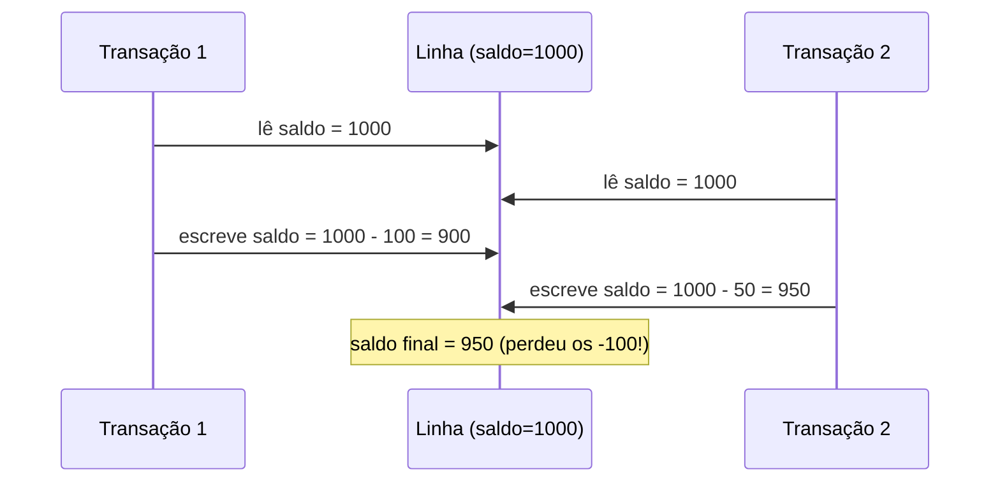
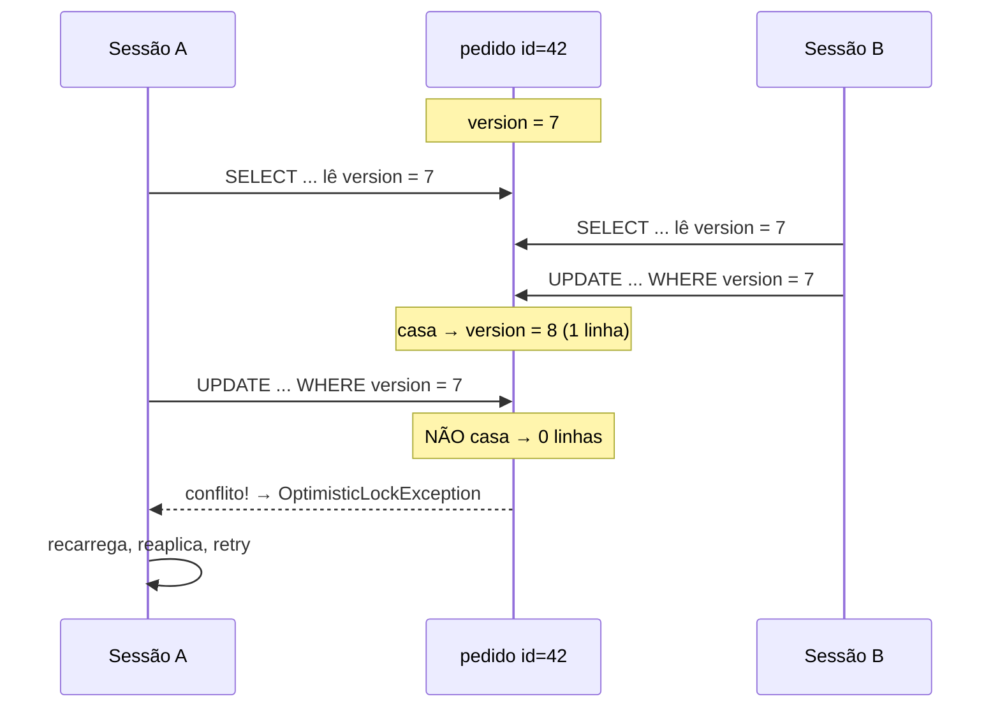
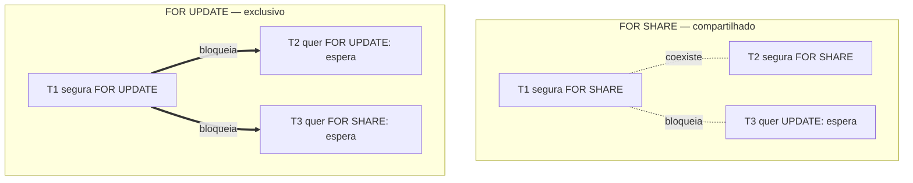
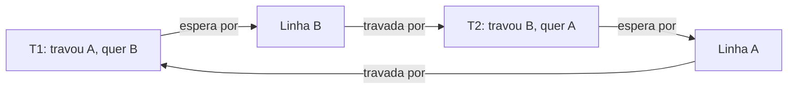
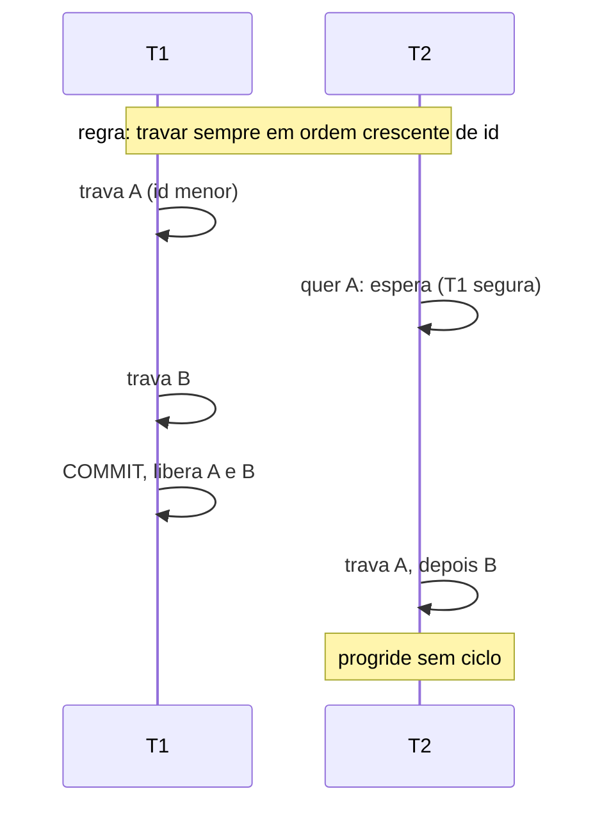
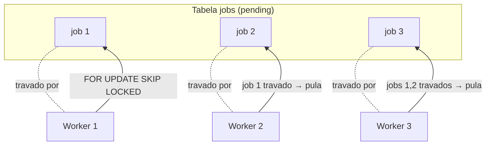
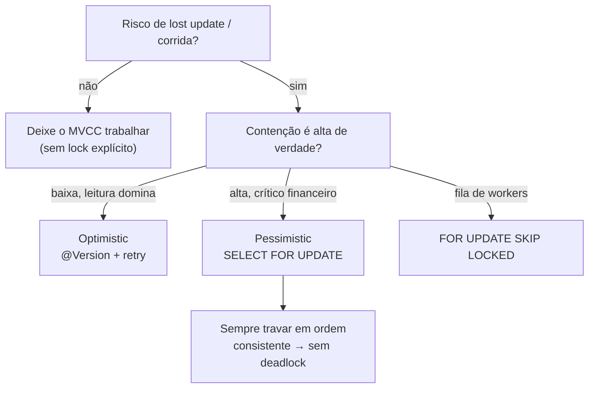

# Concorrência e locking

> [!abstract] Resumo em uma linha
> Quando dois clientes mexem na mesma linha ao mesmo tempo, alguém precisa perder a corrida de forma controlada — e quem decide *como* perder (otimista, pessimista ou pulando a linha travada) é você, não o banco.

A nota [[06 - Isolamento e anomalias]] mostrou como o MVCC do PostgreSQL deixa **leitores e escritores conviverem** sem se atrapalhar: cada transação enxerga seu próprio snapshot, e ninguém trava ninguém só por *ler*. Isso resolve quase tudo. Mas há um buraco que o MVCC sozinho não tapa: o **read-modify-write**. Você lê um saldo, decide subtrair 100, e escreve de volta. Se duas transações fazem isso ao mesmo tempo, ambas leem o mesmo saldo inicial e a segunda escrita apaga a primeira — o *lost update* clássico.

Aqui entra o **locking explícito**: estratégias que *você* aciona, na aplicação ou no SQL, para serializar o acesso a uma linha disputada. Esta nota é sobre as três grandes escolhas — **otimista**, **pessimista** e **SKIP LOCKED** — mais o pesadelo que mora entre elas: o **deadlock**.

Pensa numa cabine de banheiro com tranca. O MVCC é o espelho coletivo: todo mundo se olha ao mesmo tempo, sem fila. O lock é a porta da cabine: só um entra. A pergunta de engenharia é *quando* você precisa da cabine — e qual tipo de tranca usar.

---

## O problema de fundo: lost update

Antes das estratégias, vamos ver o inimigo de perto. Duas transações concorrentes fazem `read → modify → write` na mesma linha.



**Leitura do diagrama:** as duas transações leram o saldo *antes* de qualquer escrita acontecer — ambas viram 1000. Cada uma calculou sobre esse 1000 desatualizado. A escrita de T2 chegou por último e sobrescreveu a de T1: o desconto de 100 sumiu sem deixar rastro. Nenhum erro foi lançado, nenhum constraint violado. O banco fez exatamente o que mandaram. Esse é o veneno do *lost update*: ele é silencioso.

Em `READ COMMITTED` (default do PostgreSQL) isso acontece de boa. Há três jeitos de impedir, e cada um é uma das estratégias desta nota: travar otimisticamente (deixa as duas correrem, mas só uma confirma), travar pessimisticamente (a segunda espera na porta), ou subir o isolamento para `REPEATABLE READ`/`SERIALIZABLE` (o banco detecta o conflito e aborta uma — coberto em [[06 - Isolamento e anomalias]]). Locking explícito é o caminho mais cirúrgico dos três.

---

## Optimistic locking — aposte que ninguém vai colidir

O **bloqueio otimista** parte de uma aposta: conflitos são *raros*. Então não trava nada na leitura — deixa todo mundo ler à vontade. A verificação acontece só **na hora de escrever**: você checa se a linha continua exatamente como estava quando a leu. Se mudou, alguém passou na sua frente — sua operação falha e você tenta de novo.

O mecanismo é uma coluna `version` (um inteiro ou timestamp). A leitura traz a versão junto. O update vira condicional:

```sql
-- li o pedido com version = 7
UPDATE pedido
SET status = 'PAGO', version = version + 1
WHERE id = 42 AND version = 7;
```

Se ninguém mexeu, o `WHERE version = 7` casa, a linha é atualizada e a versão vira 8. Se alguém commitou antes de você, a versão no banco já é 8 — o `WHERE` não casa com nada, **zero linhas afetadas**. Esse `0 rows` é o sinal: houve conflito.



**Leitura do diagrama:** A e B leram a mesma versão 7. B foi mais rápido no update: o `WHERE version = 7` casou, a linha foi para a versão 8. Quando A tentou o seu update, o banco procurou uma linha com `id=42 AND version=7` — e não achou, porque agora ela está na 8. Zero linhas afetadas. A camada de persistência interpreta esse zero como conflito, lança a exceção, e cabe a A **recarregar o estado fresco, reaplicar sua mudança e tentar de novo**. Repare: ninguém ficou *bloqueado* em momento algum. A perdeu a corrida, mas perdeu rápido e sabe disso.

### `@Version` no JPA

No mundo Spring/Hibernate isso é uma anotação só. Veja [[Spring Boot]] para a integração completa.

```java
@Entity
public class Pedido {
    @Id
    private Long id;

    @Version
    private Long version; // Hibernate gerencia sozinho
}
```

Com `@Version` presente, o Hibernate **automaticamente** injeta a versão no `SET` e no `WHERE` de todo update, e incrementa o valor a cada escrita bem-sucedida. Se o `row count` do update voltar zero, ele lança `OptimisticLockException` — que o Spring embrulha em `ObjectOptimisticLockingFailureException`, carregando a classe da entidade e o id envolvidos. O tratamento recomendado é **recarregar a entidade numa transação nova e tentar de novo**; nunca reusar o objeto stale.

O tipo da coluna precisa ser `Short`, `Integer`, `Long` (ou primitivos) ou `Timestamp`. Inteiro é preferível a timestamp: timestamps têm resolução limitada e duas escritas no mesmo milissegundo podem colidir em empate.

**Quando usar otimista:** leitura domina escrita, contenção baixa, conflitos genuinamente raros. Edição de perfil, formulários de admin, catálogos. O custo de um conflito é um retry barato; o ganho é zero bloqueio no caminho feliz, que é 99% do tráfego. É o **default** para a maioria dos casos de aplicação web.

> [!tip] O retry é parte do contrato, não um detalhe
> Optimistic locking sem estratégia de retry é uma bomba-relógio: o usuário leva um erro 500 na cara num conflito que era recuperável. Embrulhe a operação numa lógica de "tente N vezes, recarregando entre tentativas". Em alta contenção o número de retries explode — e isso é o sinal de que você escolheu a estratégia errada.

---

## Pessimistic locking — tranque a porta na leitura

O **bloqueio pessimista** assume o oposto: conflito é provável, então não dá margem. Ele **trava a linha já na leitura**, e qualquer outra transação que tente tocar nela *espera na fila* até você commitar ou der rollback. Não há corrida — há serialização forçada.

A ferramenta é a cláusula de locking no `SELECT`. Em PostgreSQL:

```sql
BEGIN;
SELECT * FROM conta WHERE id = 42 FOR UPDATE;
-- a linha 42 agora está travada para esta transação
UPDATE conta SET saldo = saldo - 100 WHERE id = 42;
COMMIT; -- só aqui a trava é liberada
```

Entre o `SELECT ... FOR UPDATE` e o `COMMIT`, qualquer outra transação que faça `FOR UPDATE`, `UPDATE` ou `DELETE` na linha 42 **bloqueia e espera**. Volta o lost update? Não: a segunda transação só lê *depois* que a primeira commitou, então enxerga o saldo já atualizado. A porta da cabine está trancada.

### `FOR UPDATE` vs `FOR SHARE`

PostgreSQL oferece um espectro de força de trava, não só um botão liga/desliga:

| Cláusula | O que bloqueia | Uso típico |
| --- | --- | --- |
| `FOR UPDATE` | leitura-pra-update, update e delete da linha | vou modificar esta linha |
| `FOR NO KEY UPDATE` | igual, mas mais fraco; não bloqueia `FOR KEY SHARE` | update que não toca a PK |
| `FOR SHARE` | só update e delete; **outros `FOR SHARE` convivem** | "preciso que isto não mude, mas não vou escrever" |
| `FOR KEY SHARE` | só mudanças na chave; o mais fraco | garantia de FK por baixo do pano |

A diferença que cai em entrevista é `FOR UPDATE` × `FOR SHARE`. O `FOR UPDATE` é uma trava **exclusiva**: trava a linha por inteiro, mais ninguém entra. O `FOR SHARE` é uma trava **compartilhada**: vários leitores podem segurar o `FOR SHARE` na mesma linha *ao mesmo tempo* (todos garantem que ela não vai sumir nem mudar), mas nenhum deles consegue um lock exclusivo enquanto os outros seguram o compartilhado.



**Leitura do diagrama:** no bloco de cima, T1 e T2 seguram `FOR SHARE` na mesma linha e *coexistem* — ambas só querem garantir que ninguém a modifique. Mas a T3, que quer fazer `UPDATE`, fica bloqueada: não pode escrever enquanto há travas compartilhadas vivas. No bloco de baixo, a história é mais dura: o `FOR UPDATE` de T1 é exclusivo, então tanto outro `FOR UPDATE` quanto até um `FOR SHARE` ficam na fila. Exclusivo bloqueia todo mundo; compartilhado só bloqueia quem quer escrever.

Use `FOR SHARE` quando precisa garantir que uma linha *referenciada* não desapareça durante sua transação (ex.: confirmar que a conta existe antes de inserir um lançamento), mas você não vai alterá-la. Use `FOR UPDATE` quando vai mesmo escrever.

**Quando usar pessimista:** alta contenção real, lógica financeira crítica, casos onde um retry otimista seria caro ou perigoso (reservar o último ingresso, debitar saldo, decrementar estoque). O preço é throughput: transações ficam em fila indiana na linha quente, e cada lock segurado por tempo demais vira fonte de contenção (próxima seção). Pessimista é o bisturi para o ponto exato onde a corrida não pode existir — não um regime geral.

> [!warning] Lock pessimista só vale dentro de uma transação aberta
> `SELECT ... FOR UPDATE` em autocommit não trava nada de útil: a trava é liberada no instante seguinte. Ele *precisa* estar dentro de um `BEGIN ... COMMIT` explícito. No JPA, isso é `@Transactional` + `@Lock(LockModeType.PESSIMISTIC_WRITE)` no método do repositório.

---

## Deadlock — quando os dois esperam e ninguém anda

Travar resolve a corrida, mas abre uma porta nova: o **deadlock** (impasse). Acontece quando duas transações seguram, cada uma, um recurso que a outra precisa — e ficam esperando em círculo. Ninguém solta porque ninguém termina, e ninguém termina porque ninguém solta.

O cenário canônico: T1 trava a linha A e depois quer a B; T2 trava a B e depois quer a A.



**Leitura do diagrama:** siga as setas e você dá uma volta completa. T1 espera a linha B, que está travada por T2; T2 espera a linha A, que está travada por T1. É um **ciclo de espera** — o nome técnico do deadlock. Nenhuma das duas pode avançar porque cada uma é refém da outra. Sem intervenção externa, esperam para sempre.

A intervenção externa é o **deadlock detector** do banco. No PostgreSQL ele roda periodicamente (a cada `deadlock_timeout`, default 1 segundo) procurando ciclos de espera no grafo de locks. Quando acha um, escolhe uma **vítima** e a aborta com erro (`deadlock detected`), liberando seus locks para que a outra prossiga. A vítima recebe um erro de transação e pode dar retry.

### Prevenção: ordem consistente de aquisição

O detector é uma rede de segurança, não uma solução — ele te custa um abort e um retry, mais a latência de até 1 segundo até detectar. A prevenção real é uma regra quase boba de tão simples: **adquira locks sempre na mesma ordem**.

No cenário acima, o deadlock só existe porque T1 vai A→B e T2 vai B→A. Se *ambas* travarem na ordem A→B (digamos, sempre pelo `id` crescente), o ciclo é impossível:



**Leitura do diagrama:** com a regra "sempre na ordem do id", T1 pega A primeiro. T2 também *quer* A primeiro, então simplesmente espera — não corre para B nas costas de T1. Quando T1 commita e solta tudo, T2 segue em frente e pega A e B na mesma ordem. Houve espera, sim, mas não ciclo: uma fila ordeira nunca trava em impasse. A espera é resolúvel; o ciclo não é. Trocar uma pela outra é todo o truque.

Na prática, isso significa: se você vai travar várias linhas numa transação, **ordene-as por uma chave estável** (id, por exemplo) antes de travar. `SELECT ... FOR UPDATE ... ORDER BY id` é um padrão útil exatamente por isso. Complementos: transações curtas (menos tempo segurando lock = menos janela de colisão — veja [[05 - Transações e ACID]]), `NOWAIT` (falha na hora em vez de esperar, transformando deadlock potencial em erro previsível) e `lock_timeout` (rede de segurança que aborta esperas longas demais).

---

## Lock contention — a fila que engole o sistema

**Contenção de lock** (*lock contention*) é o que acontece quando muitas transações disputam os mesmos locks e passam mais tempo *esperando* do que *trabalhando*. Não precisa de deadlock para doer: basta uma transação longa segurando uma linha quente para formar uma fila atrás dela. E o efeito é em cascata — quem está na fila também segura seus próprios locks, e *outra* fila se forma atrás dele.

O caso clássico é uma transação longa que abre uma sessão, trava algo cedo e só commita lá na frente depois de muito trabalho. Durante todo esse tempo, todo mundo que precisa daquela linha está parado. A linha vira gargalo do sistema inteiro.

Mitigações, em ordem de impacto:

1. **Transações curtas.** A mais poderosa. Uma transação que segura locks por 50ms é incomparavelmente menos problemática que uma de 2 segundos. Não faça I/O externo (chamada HTTP, envio de e-mail) com transação aberta. Veja [[05 - Transações e ACID]].
2. **Optimistic em vez de pessimista.** Se a contenção é baixa de verdade, troque a trava física por `@Version`: ninguém espera, conflitos viram retry barato.
3. **Ordem consistente de locks.** Evita que contenção vire deadlock (seção anterior).
4. **`SKIP LOCKED` para filas e workers.** Em vez de N workers fazendo fila na mesma linha, cada um pula as travadas e pega a próxima livre (próxima seção).
5. **Reduzir granularidade.** Travar a linha, não a tabela; modelar para que linhas quentes diferentes não compartilhem lock (mais abaixo).

A nota [[10 - Performance e armadilhas]] trata o lado de *throughput* da contenção; aqui o foco é a mecânica do lock que a causa.

---

## `SKIP LOCKED` — o padrão de fila de trabalho

Imagine uma tabela `jobs` e dez workers que devem processar tarefas pendentes **sem pegar a mesma tarefa duas vezes**. A abordagem ingênua tem uma corrida no meio: entre o `SELECT` que acha um job `pending` e o `UPDATE` que o marca como `processando`, dois workers podem ler o mesmo job e ambos tentarem processá-lo.

Pessimista (`FOR UPDATE` puro) resolve a duplicidade, mas cria um *convoy*: o worker 2 fica bloqueado esperando o worker 1 soltar a linha — mesmo havendo mil outros jobs livres na tabela. Dez workers viram uma fila indiana de um. Throughput de fila no chão.

O `SKIP LOCKED` (PostgreSQL 9.5+) muda a regra: ao tentar travar uma linha que **já está travada por outra transação**, em vez de esperar, ele simplesmente **pula** e vai para a próxima que casa o `WHERE`.

```sql
BEGIN;
SELECT id, payload FROM jobs
WHERE status = 'pending'
ORDER BY created_at
FOR UPDATE SKIP LOCKED
LIMIT 1;
-- processa o job, marca como done
UPDATE jobs SET status = 'done' WHERE id = :id;
COMMIT;
```



**Leitura do diagrama:** os três workers correm a *mesma* query ao mesmo tempo. O Worker 1 trava o job 1. O Worker 2 tenta o job 1, vê que está travado e — em vez de esperar na fila — **pula** para o job 2. O Worker 3 acha 1 e 2 travados e pula para o 3. Resultado: cada worker pegou um job diferente, ninguém bloqueou ninguém, e a vazão escala com o número de workers. A reivindicação é atômica e livre de corrida: cada worker leva uma linha distinta, garantido.

O preço a pagar é honesto: `SKIP LOCKED` te dá uma **visão inconsistente** da tabela (você não vê as linhas travadas), então não serve para queries de propósito geral — só para esse padrão de "vários consumidores drenando uma fila". E há um teto: com *milhares* de workers martelando a mesma tabela, surgem contenção de SLRU/MultiXact, bloat de heap e pressão de vacuum, e a recomendação vira migrar para um sistema de fila dedicado (use `LISTEN/NOTIFY` só para acordar workers ociosos, não para distribuir trabalho). Para escala pequena e média, porém, `FOR UPDATE SKIP LOCKED` é uma fila de trabalho robusta em uma linha de SQL.

---

## Granularidade de lock — linha, página, tabela

Travar tem um *tamanho*. O banco pode travar a **linha**, a **página** (bloco físico com várias linhas) ou a **tabela inteira**. É um trade-off entre concorrência e overhead:

- **Row-level lock** — máxima concorrência: duas transações em linhas diferentes não se atrapalham. Custo: o banco precisa rastrear muitos locks. É o nível dos `SELECT ... FOR UPDATE`, `UPDATE` e `DELETE` no PostgreSQL e no InnoDB do MySQL.
- **Page-level lock** — meio-termo, raro de gerenciar manualmente; surge mais como detalhe interno.
- **Table-level lock** — mínima concorrência, mínimo overhead de rastreamento. Operações de DDL (`ALTER TABLE`, `DROP`) e alguns modos de `LOCK TABLE` pegam a tabela toda. Uma migração descuidada que trava a tabela inteira para o sistema (veja [[05 - Transações e ACID]] e a nota de operação em produção).

O PostgreSQL e o InnoDB fazem **row-level locking** por padrão para escritas, que é exatamente o que você quer: contenção só entre quem disputa a *mesma* linha. A armadilha de granularidade aparece quando o banco **escala o lock** (lock escalation) ou quando um DDL pega a tabela: de repente uma operação que parecia local trava o mundo. Modelar para que linhas quentes diferentes não colidam — particionar contadores, evitar uma única linha "global" que todo mundo atualiza — é design de concorrência, não só de schema.

> [!note] A linha quente única é um anti-padrão sorrateiro
> Um contador global numa única linha (`UPDATE estatisticas SET total = total + 1`) serializa *todas* as escritas do sistema naquela linha, por mais row-level que o lock seja. A solução é espalhar: várias linhas-shard somadas no fim, ou um contador aproximado. Granularidade fina de lock não ajuda se todo mundo aponta para a mesma linha.

---

## Como escolher: o mapa de decisão



**Leitura do diagrama:** a primeira pergunta é se existe corrida de verdade — se duas transações podem fazer read-modify-write na mesma linha. Não havendo, não invente lock: o MVCC já isola leituras. Havendo, a segunda pergunta é o *grau* de contenção. Baixa contenção com leitura dominante pede otimista (barato no caminho feliz, retry no raro conflito). Alta contenção em ponto crítico pede pessimista (serialização garantida, ao custo de fila). Cenário de fila de trabalho pede `SKIP LOCKED` (paralelismo sem convoy). E *sempre* que você trava várias linhas pessimisticamente, a regra da ordem consistente é o que te salva do deadlock.

---

## Em entrevista

> When two transactions do a read-modify-write on the same row, the MVCC snapshot isolation isn't enough — you can lose updates silently. My default is **optimistic locking** with a `version` column, exposed as `@Version` in JPA: no one blocks on the happy path, and a conflict just means zero rows affected, which I handle by reloading and retrying. I switch to **pessimistic locking** — `SELECT ... FOR UPDATE` inside an explicit transaction — only when contention is real and a retry would be unsafe, like debiting a balance or claiming the last seat. The key distinction is `FOR UPDATE`, an exclusive lock, versus `FOR SHARE`, a shared one that lets multiple readers guarantee a row won't change. The risk with any pessimistic locking is **deadlock**: two transactions each holding what the other needs, in a circular wait. The database detects the cycle and aborts a victim, but I prevent it upfront by always acquiring locks in a consistent order — typically by primary key. For a job queue, I reach for `FOR UPDATE SKIP LOCKED`, which lets many workers drain the same table without forming a convoy: each worker just skips the rows already locked by others. And underlying all of it: short transactions, because every lock held too long becomes contention that cascades.

### Vocabulário PT → EN

- bloqueio / trava → lock
- bloqueio otimista → optimistic locking
- bloqueio pessimista → pessimistic locking
- coluna de versão → version column
- conflito de escrita → write conflict
- atualização perdida → lost update
- leitura-modificação-escrita → read-modify-write
- trava exclusiva → exclusive lock
- trava compartilhada → shared lock
- impasse → deadlock
- ciclo de espera → wait cycle / circular wait
- detector de impasse → deadlock detector
- vítima (do impasse) → (deadlock) victim
- contenção (de lock) → (lock) contention
- comboio (de espera) → convoy
- ordem de aquisição → lock acquisition order
- granularidade de lock → lock granularity
- trava em nível de linha → row-level lock
- pular linhas travadas → skip locked rows
- fila de trabalho → job queue / work queue
- nova tentativa → retry

---

## Veja também

- [[05 - Transações e ACID]] — transações curtas, BEGIN/COMMIT, o escopo onde o lock vive
- [[06 - Isolamento e anomalias]] — MVCC, snapshot isolation e as anomalias que o lock explícito complementa
- [[10 - Performance e armadilhas]] — o lado de throughput da contenção
- [[13 - Transações distribuídas]] — quando a corrida atravessa mais de um banco
- [[Spring Boot]] — `@Version`, `@Lock(PESSIMISTIC_WRITE)`, `@Transactional`

---

> [!info] Lastro
> Fontes verificadas (jun/2026):
> - **PostgreSQL — Explicit Locking & SELECT (FOR UPDATE / FOR SHARE / FOR NO KEY UPDATE / FOR KEY SHARE / NOWAIT / SKIP LOCKED):** [postgresql.org/docs/current/explicit-locking.html](https://www.postgresql.org/docs/current/explicit-locking.html) e [postgresql.org/docs/current/sql-select.html](https://www.postgresql.org/docs/current/sql-select.html). `SKIP LOCKED` desde a 9.5; a doc avisa explicitamente que ele dá "an inconsistent view of the data" e só serve para filas com múltiplos consumidores.
> - **Optimistic locking / `@Version` no JPA-Hibernate:** [Baeldung — Optimistic Locking in JPA](https://www.baeldung.com/jpa-optimistic-locking) e [Vlad Mihalcea — Optimistic locking version property](https://vladmihalcea.com/optimistic-locking-version-property-jpa-hibernate/). Versão entra no `SET` e no `WHERE`; `0 rows` → `OptimisticLockException`, embrulhada pelo Spring em `ObjectOptimisticLockingFailureException`; tratamento é recarregar e dar retry em transação nova.
> - **Deadlock — detecção e prevenção por ordem consistente:** [Netdata — Managing PostgreSQL Deadlocks](https://www.netdata.cloud/academy/effective-strategies-for-managing-postgresql-deadlocks/) e [pganalyze — avoiding deadlocks in migrations](https://pganalyze.com/blog/5mins-postgres-migrations-avoid-deadlocks). Detector roda a cada `deadlock_timeout` (default 1s), aborta uma vítima; prevenção principal é ordem de lock consistente, complementada por transações curtas, `NOWAIT` e `lock_timeout`.
> - **`SKIP LOCKED` como fila de trabalho e seus limites de escala:** [Netdata — FOR UPDATE SKIP LOCKED for queues](https://www.netdata.cloud/academy/update-skip-locked/) e [Potential Consequences of Using Postgres as a Job Queue](https://techcommunity.microsoft.com/blog/adforpostgresql/potential-consequences-of-using-postgres-as-a-job-queue/4514332). O "convoy" do `FOR UPDATE` puro, a atomicidade do `SKIP LOCKED`, e o teto de escala (SLRU/MultiXact, bloat, vacuum) que empurra para fila dedicada + `LISTEN/NOTIFY` só para acordar workers.
>
> **Ressalvas:** voz-padrão é PostgreSQL. Nomes e força de cláusulas de lock variam entre SGBDs (MySQL/InnoDB tem `FOR UPDATE`/`FOR SHARE` e também `SKIP LOCKED` desde a 8.0, mas semântica de gap locks difere; SQL Server usa hints como `UPDLOCK`/`ROWLOCK`). `deadlock_timeout` e detalhes de granularidade citados são do PostgreSQL. Os diagramas são esquemáticos — em produção há `LIMIT`, índices e tratamento de erro que omiti por clareza. Nenhuma experiência pessoal foi atribuída ao autor.
