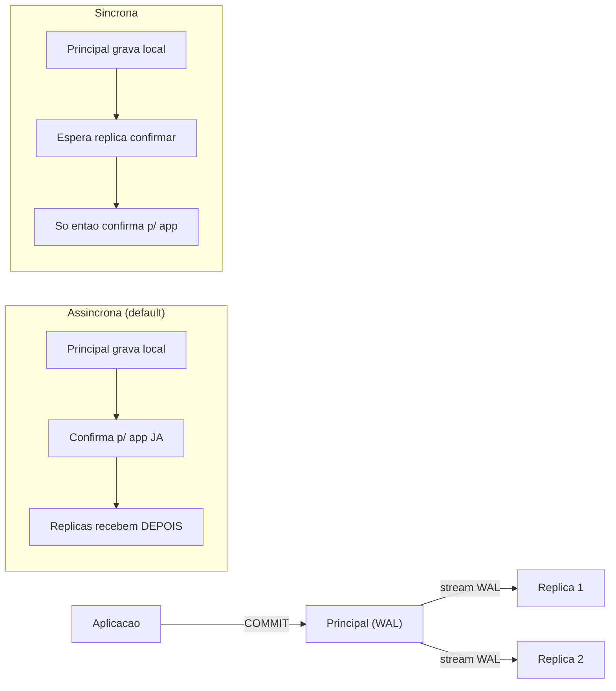
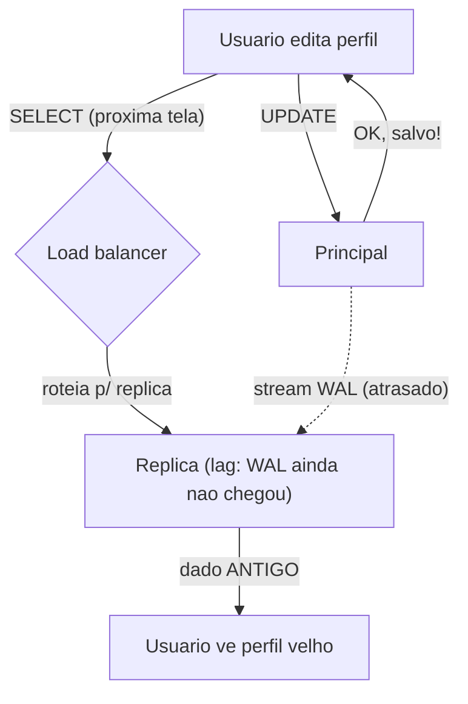
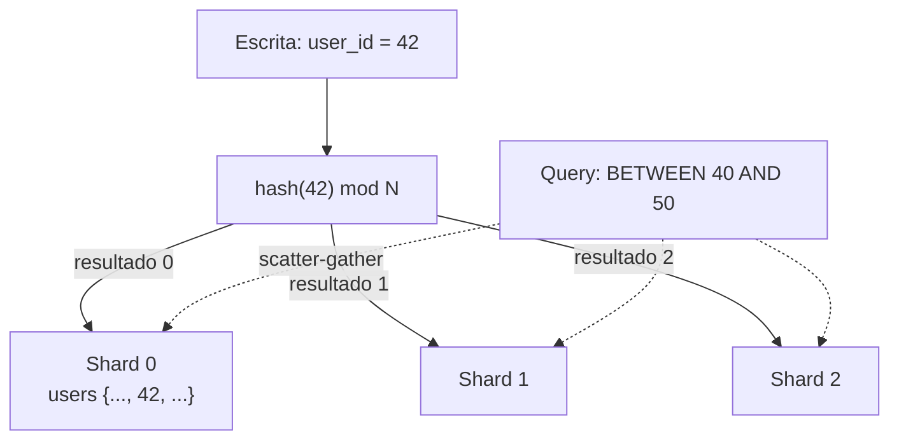
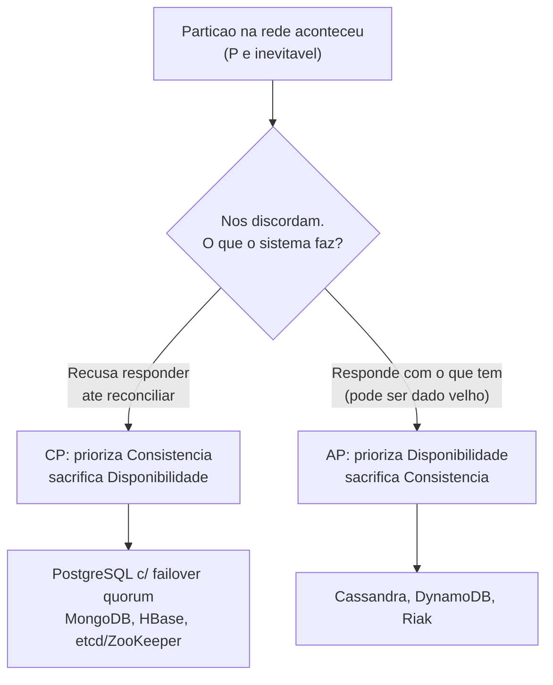
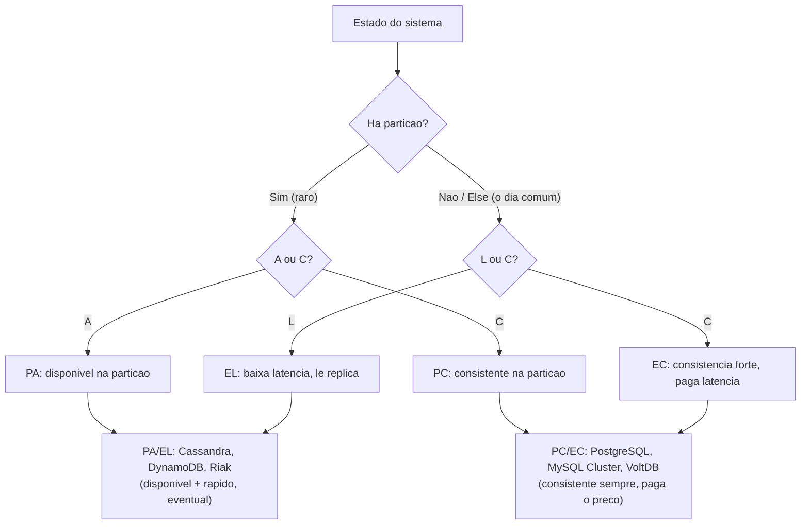

# Replicação, sharding e CAP

Até aqui o galho viveu numa máquina só. Uma instância do PostgreSQL, um disco, um processo, e todas as garantias de [[05 - Transações e ACID]] valendo porque havia **um único lugar** onde a verdade morava. Esta nota quebra essa premissa. A partir do momento em que você tem **mais de um nó guardando os mesmos dados**, a rede entre eles vira parte do seu modelo de consistência — e a rede é, por natureza, não confiável.

A pergunta que organiza tudo aqui é simples de enunciar e difícil de responder: **quando dois nós discordam sobre qual é o valor de uma linha, o que o sistema faz?** Espera os dois concordarem (e fica mais lento, ou até para de responder)? Ou responde com o que tem (e arrisca devolver dado velho)? Não existe terceira opção mágica. Replicação, sharding, CAP e PACELC são, no fundo, vocabulário para falar com precisão sobre **esse único trade-off** e onde cada sistema o crava.

> [!note] Onde mora a fronteira
> Esta nota fica na **escala-de-banco**: replicação física entre nós, sharding como particionamento de dados, CAP/PACELC como vocabulário para descrever a garantia. O **scale-out de sistema** — desenhar a arquitetura de microsserviços, escolher a topologia de dados de uma plataforma inteira, decidir *qual* serviço é dono de *qual* dado — é assunto de [[System Design]]. Aqui a gente entende a mecânica e o vocabulário; lá ela vira decisão de arquitetura. Não vou redesenhar sistema aqui — vou explicar as peças que o System Design usa.

---

## Replicação: por que ter o mesmo dado em mais de um lugar

Replicação é manter **cópias dos mesmos dados em nós diferentes**. Parece desperdício — por que guardar a mesma coisa duas vezes? Há três motivos, e vale separá-los porque eles puxam o design em direções diferentes.

**Alta disponibilidade.** Se o nó que guarda seus dados morre — disco queima, datacenter cai, processo trava — e ele era o único, seu sistema está fora do ar até você restaurar um backup. Com uma réplica, você **promove** a cópia a principal e segue operando. O tempo que isso leva é o seu *recovery time*; o quanto de dado você perde no caminho é o seu *recovery point*. Falaremos dos dois.

**Escalar leitura.** Um sistema de leitura-pesada — um e-commerce onde milhões veem produtos e poucos compram — esbarra na capacidade de leitura de uma instância antes de esbarrar na de escrita. Réplicas resolvem isso de graça: as **escritas vão todas para o principal**, e as **leituras se espalham pelas réplicas**. Você multiplica a vazão de leitura adicionando nós. (Note que isso não escala escrita — todas continuam passando pelo único principal. Escalar escrita é problema do sharding, mais adiante.)

**Geo-distribuição.** Se seus usuários estão no Brasil e na Europa e o banco está em São Paulo, o europeu paga ~200ms de ida-e-volta em cada query. Uma réplica em Frankfurt corta essa latência para os leitores de lá. O preço é que a réplica europeia está sempre um pouco atrás do principal — e aí mora o problema central desta seção.

### Síncrona vs assíncrona: o trade-off que define tudo

Quando o principal recebe um `COMMIT`, ele tem uma escolha sobre **quando responder "feito" para a aplicação**:

- **Replicação assíncrona** (o default do PostgreSQL): o principal confirma o commit para a aplicação **assim que grava localmente no seu próprio WAL**, sem esperar a réplica. Rápido. Mas existe uma janela: se o principal morre depois de confirmar para o cliente e **antes** de a réplica ter recebido aquele registro do WAL, a réplica promovida **não terá as últimas transações commitadas**. Você perdeu dado que jurou para o cliente que estava salvo. Esse é o *recovery point objective* maior que zero.
- **Replicação síncrona**: o principal só confirma o commit para a aplicação **depois que a réplica confirma ter recebido (e, dependendo do nível, gravado ou aplicado) o registro do WAL**. Zero perda de dado num failover — *RPO zero*. O preço é latência: cada commit agora paga a ida-e-volta de rede até a réplica. E há um preço mais sutil de disponibilidade — se a réplica síncrona cai, o principal pode **parar de aceitar escritas** esperando uma confirmação que não vem.

**Leitura do diagrama:** em cima, o fluxo físico — a aplicação faz commit no principal, que transmite o WAL (*streaming replication*) para as réplicas. Em baixo, as duas políticas. Na assíncrona, o passo "confirma para o app" acontece **antes** das réplicas terem o dado — daí a velocidade e a janela de perda. Na síncrona, "confirma para o app" só vem **depois** de a réplica confirmar — daí o RPO zero e a latência extra. É o mesmo trade-off de durabilidade × latência que [[05 - Transações e ACID]] discute no `fsync` local, agora esticado pela rede.

No PostgreSQL isso é controlado por `synchronous_commit`, que tem níveis intermediários úteis: `on` espera a réplica **gravar em disco durável**; `remote_write` espera só a réplica escrever no SO (mais rápido, mais frágil se a réplica cai antes de dar flush); `remote_apply` espera a réplica **aplicar** a transação — necessário quando a aplicação lê da réplica imediatamente após escrever no principal. E ele pode ser setado **por transação**: durabilidade forte no pagamento, frouxa no log de auditoria, no mesmo banco.

### Primary/standby, read replicas e o lag

A topologia mais comum no PostgreSQL é **primary/standby**: um nó principal que aceita escritas, um ou mais *standbys* que recebem o fluxo do WAL via *streaming replication*. Standbys podem ser *hot* (aceitam leituras enquanto replicam) — e aí viram **read replicas**, o mecanismo de escalar leitura.

A métrica que você vai monitorar até dormir com ela é o **lag de replicação**: o quanto a réplica está atrás do principal, medido em bytes de WAL ou em segundos. Lag baixo e estável é saúde. Lag crescente significa que a réplica não consegue acompanhar a vazão de escrita do principal — e isso tem uma consequência concreta e traiçoeira na aplicação.

### O problema "read-your-writes" sob lag

Imagine: o usuário edita o perfil dele. Sua aplicação escreve no principal (`UPDATE perfil ...`), responde "salvo!", e a próxima tela faz um `SELECT` — que o load balancer roteia para uma **read replica**. Se essa réplica ainda não recebeu o WAL daquela escrita (lag), o usuário **vê o perfil antigo**, o que acabou de editar. Para ele, o sistema "perdeu" a edição. Isso é a violação da garantia **read-your-writes**: a expectativa óbvia de que eu leio o que eu acabei de escrever.

**Leitura do diagrama:** a escrita vai para o principal e é confirmada. Mas o `SELECT` seguinte cai numa réplica que **ainda não recebeu** aquele WAL (a seta pontilhada chega atrasada). O usuário lê o estado anterior à própria edição. As saídas práticas: **rotear leituras do mesmo usuário para o principal por uma janela** após a escrita; usar `synchronous_commit = remote_apply` para garantir que a réplica aplicou antes de confirmar; ou aceitar a inconsistência onde ela é inofensiva. Isto é **consistência eventual** mordendo na vida real — voltaremos a ela.

### Failover

Quando o principal morre, alguém precisa **promover** uma réplica a novo principal e redirecionar a aplicação para ela. Fazer isso à mão, às 3h da manhã, é receita para erro. Ferramentas como **Patroni** automatizam: detectam a queda, elegem a réplica mais atualizada, promovem, e atualizam o roteamento. O perigo clássico é o **split-brain** — dois nós achando que são o principal ao mesmo tempo, ambos aceitando escritas divergentes. Por isso o failover sério usa um árbitro externo (um *quorum*, tipicamente etcd/Consul) para garantir que só **um** nó ganhe a promoção. Note como o failover já é uma escolha CAP em miniatura: na partição, ou você promove rápido (disponível, arrisca split-brain) ou exige quorum (consistente, pode ficar indisponível se não houver maioria).

---

## Sharding: dividir os dados, não copiá-los

Replicação resolve disponibilidade e leitura, mas **não escala escrita** nem **não cabe quando os dados não cabem**: se sua tabela tem 50 TB, replicá-la dá cópias de 50 TB — não ajuda no problema de uma instância não dar conta. A resposta é **sharding**: particionamento **horizontal** dos dados entre nós, onde cada nó (shard) guarda um **subconjunto disjunto** das linhas. O usuário 1 a 1M no shard A, 1M a 2M no shard B, e assim por diante. Agora cada shard recebe uma fração das escritas, guarda uma fração dos dados, e você escala adicionando shards.

> [!warning] Sharding ≠ particionamento local
> Cuidado com a colisão de nomes. O **particionamento local** (uma tabela `PARTITION BY` dentro de **uma instância**) que [[10 - Performance e armadilhas]] cobre é uma técnica de *performance e manutenção* — divide a tabela em pedaços físicos no mesmo servidor para que queries varram só a partição relevante (*partition pruning*). **Sharding** é particionamento **entre máquinas diferentes**, com nós, rede e roteamento. A semelhança conceitual é real (ambos dividem dados por uma chave), mas a operação, o custo e os problemas são completamente diferentes. Sharding é a versão distribuída e cara.

### A shard key e as estratégias de roteamento

Tudo no sharding depende da **shard key**: a coluna (ou conjunto) que decide em qual shard cada linha mora. A escolha da shard key é **a decisão mais importante e mais irreversível** do design — trocá-la depois significa remapear todos os dados. As estratégias:

- **Range sharding**: shards por **faixas** da chave (IDs 1–1M no A, 1M–2M no B). Bom para queries de intervalo (`WHERE id BETWEEN ...` vai a um shard só). Ruim para **hotspot**: se a chave é o tempo e você sempre escreve "agora", todas as escritas batem no último shard, e os outros ficam ociosos. O shard quente vira o gargalo de novo.
- **Hash sharding**: aplica uma função de hash na chave e usa o resultado para escolher o shard. Espalha a carga **uniformemente** — sem hotspot por valor. O preço: **destrói a localidade de range**. Uma query `BETWEEN` agora precisa consultar **todos** os shards, porque valores próximos foram para shards aleatórios. Troca hotspot por *scatter-gather*.
- **Geo / directory sharding**: roteia por geografia (usuários do BR no shard de SP, da UE no de Frankfurt) ou por uma **tabela de diretório** explícita que mapeia chave→shard. Flexível, permite mover tenants entre shards, mas o diretório vira um componente crítico a ser consultado e mantido.

**Leitura do diagrama:** a escrita de `user_id = 42` passa pela função de hash, que devolve um shard determinístico (linha cheia) — barato e balanceado. Mas a query por **range** (`BETWEEN 40 AND 50`, linhas pontilhadas) precisa bater em **todos** os shards e juntar os resultados, porque o hash espalhou valores próximos por shards distintos. Esse *scatter-gather* é o custo escondido do hash sharding: você ganha balanceamento e perde queries de intervalo eficientes. A shard key tem que casar com o **padrão de acesso dominante**.

### Os dois problemas que assombram todo shard

**Cross-shard join e cross-shard transaction.** Num banco numa máquina só, um `JOIN` entre `pedidos` e `usuarios` é trivial. Se `pedidos` está num shard e `usuarios` em outro, esse join atravessa a rede — caro, lento, ou impossível dependendo do engine. Pior: uma **transação** que precisa escrever atomicamente em dois shards não tem mais um único WAL para garantir atomicidade. Você caiu no problema das **transações distribuídas** — 2PC, Saga, Outbox — que é o assunto inteiro de [[13 - Transações distribuídas]]. A regra de ouro do design de sharding é **escolher a shard key para que as operações comuns caiam num shard só** (co-locar dados que são acessados juntos). Quando isso falha, você paga caro.

**Rebalanceamento.** Você começou com 4 shards. Agora precisa de 8. Com `hash mod 4`, dobrar para `hash mod 8` remapeia **quase todas** as linhas para shards diferentes — uma migração massiva com o sistema no ar. É por isso que sistemas sérios usam **consistent hashing** ou um **mapa de partições** indireto (centenas de partições lógicas espalhadas sobre poucos nós físicos), que permite mover só uma fração dos dados ao adicionar um nó. Rebalanceamento é o imposto operacional permanente do sharding.

Por tudo isso, a maturidade sênior sobre sharding é: **adie o máximo possível.** Réplicas, particionamento local, índices melhores, cache — esgote tudo antes. Sharding multiplica a complexidade operacional, mata os joins arbitrários que tornavam o SQL agradável, e é quase impossível de desfazer. Você sharda quando uma instância **comprovadamente** não cabe, não quando "pode ser que um dia".

---

## CAP: o vocabulário (e o mito) da consistência distribuída

O **teorema CAP** é a forma canônica de falar sobre o trade-off central. Brewer o apresentou como conjectura em 2000; Gilbert e Lynch o provaram formalmente em 2002. Ele lida com três propriedades de um sistema distribuído:

- **C**onsistency (consistência): toda leitura enxerga a escrita mais recente — todos os nós concordam sobre o valor atual. (Atenção: é uma noção mais forte, *linearizabilidade*, diferente do "C" de ACID.)
- **A**vailability (disponibilidade): toda requisição a um nó **não-falho** recebe uma resposta (não-erro) — o sistema sempre responde.
- **P**artition tolerance (tolerância a partição): o sistema continua operando mesmo quando a rede entre nós **se parte** e mensagens se perdem.

A formulação popular — "escolha 2 dos 3" — é um **mito**, e desfazê-lo é o que separa quem leu de quem entendeu. Você **não escolhe** ter ou não ter partições. Numa rede de verdade, cabos falham, switches caem, pacotes somem — a partição **vai acontecer**, é um fato da física, não um item de menu. Logo, **P é obrigatório** em qualquer sistema genuinamente distribuído. A escolha real, quando a partição ocorre, é entre **C e A**:

**Leitura do diagrama:** a partição já aconteceu (topo) — ela não é escolha. A bifurcação real é o que fazer quando dois lados da partição discordam. Um sistema **CP** recusa-se a responder de forma possivelmente inconsistente: o lado minoritário da partição **para de aceitar escritas** (ou leituras) até a rede voltar — escolheu consistência, abriu mão de disponibilidade. Um sistema **AP** responde com o que cada nó tem localmente, aceitando que dois lados divirjam temporariamente — escolheu disponibilidade, abriu mão de consistência (e vai precisar **reconciliar** depois). PostgreSQL com failover por quorum é CP (sem maioria, não promove, fica indisponível para preservar a verdade). Cassandra e DynamoDB são AP por design (sempre respondem, convergem depois). Não há configuração que dê CA num sistema distribuído — "CA" só descreve um sistema de **um nó só**, onde partição não existe.

Brewer voltou ao tema em 2012 com uma retrospectiva importante: o trade-off é mais sutil que "C ou A binário". Sistemas reais não são CP-puro ou AP-puro o tempo todo — eles **detectam** a partição e podem aplicar políticas diferentes por operação (responder leituras de baixo risco, recusar escritas críticas). CAP é o vocabulário de partida, não a última palavra.

---

## PACELC: o que CAP esquece

CAP tem um buraco: ele só descreve o sistema **durante uma partição**. Mas partições são raras. O que o sistema faz no dia comum, com a rede saudável? CAP é silencioso. **PACELC**, formulado por Daniel Abadi (2010, formalizado em 2012), tampa o buraco:

> Se há **P**artição, escolha entre **A**vailability e **C**onsistency (isso é o CAP). **E**lse (senão — operação normal), escolha entre **L**atency e **C**onsistency.

A segunda metade é a contribuição: **mesmo sem partição alguma**, manter consistência forte entre réplicas **custa latência**. Para uma leitura ver a escrita mais recente, ou ela vai ao principal (mais distante, mais lento), ou as réplicas se coordenam antes de responder (round-trips). Se você aceita ler de uma réplica possivelmente atrasada, é mais rápido — mas inconsistente. É **exatamente o trade-off read-your-writes** que vimos no lag, agora elevado a princípio geral.

**Leitura do diagrama:** PACELC tem **dois ramos**. No ramo raro (esquerda, há partição) é o CAP clássico: A ou C. No ramo comum (direita, o "Else") é a pergunta nova: latência ou consistência? Combinando os dois ramos, os sistemas ganham um rótulo de quatro letras. **PA/EL** (Cassandra, DynamoDB, Riak): na partição ficam disponíveis, no dia comum priorizam latência — sempre rápidos, sempre eventualmente consistentes. **PC/EC** (PostgreSQL, MySQL Cluster, VoltDB): na partição ficam consistentes, no dia comum **também** pagam latência pela consistência — recusam-se a abrir mão da verdade em qualquer cenário. PACELC é mais honesto que CAP porque captura o trade-off que você sente **todo dia**, não só no acidente de rede ocasional.

---

## Consistência eventual: convergência sem garantia de quando

Os sistemas AP/EL escolheram disponibilidade e latência sobre consistência. O que sobra como garantia, então? **Consistência eventual** (*eventual consistency*): se **nenhuma escrita nova for feita**, eventualmente todas as réplicas convergem para o mesmo valor. "Eventualmente" é a palavra carregada — pode ser milissegundos, pode ser segundos sob lag, e a janela não tem teto rígido garantido. Durante ela, leituras diferentes podem devolver valores diferentes.

A questão não é se consistência eventual é "boa" ou "ruim" — é **onde ela é aceitável**:

- **Aceitável:** contador de likes (ver 999 ou 1000 likes por meio segundo não machuca ninguém), feed de timeline, contagem de visualizações, status "online" de um usuário. O custo do desacordo temporário é zero ou trivial.
- **Inaceitável:** **saldo bancário**. Se duas réplicas discordam sobre seu saldo e ambas autorizam um saque baseado no valor que cada uma vê, você sacou duas vezes o que tinha. Estoque de e-commerce na Black Friday tem o mesmo problema — vender o último item duas vezes. Aqui você precisa de **consistência forte**, e paga o preço (latência, ou indisponibilidade na partição) sem reclamar.

Vale ter o espectro na cabeça, porque não é binário:

- **Consistência forte** (linearizável): toda leitura vê a última escrita, sempre. Cara, mas previsível. É o "C" do CAP.
- **Consistência causal**: operações **causalmente relacionadas** são vistas na ordem certa por todos (se você comenta depois de eu postar, ninguém vê seu comentário antes do meu post), mas operações independentes podem ser vistas em ordens diferentes. Um meio-termo prático.
- **Consistência eventual**: só a promessa de convergência no fim, sem ordem garantida no caminho.

> [!important] O "C" do CAP não é o "C" do ACID
> Erro clássico de entrevista. Em [[06 - Isolamento e anomalias]], o "C" do ACID é **consistência de invariantes do schema** — constraints, FKs e checks nunca violados ao fim de uma transação. É uma propriedade **local**, de uma instância. O "C" do CAP é **acordo entre réplicas sobre o valor atual** — uma propriedade **distribuída**, sobre visibilidade na rede. Um banco pode ser perfeitamente ACID-consistente (nenhuma constraint violada) numa réplica que está, ao mesmo tempo, CAP-inconsistente (mostrando dado velho). São palavras iguais para coisas diferentes. Saber separá-las é sinal de quem entendeu os dois mundos.

O ramo NoSQL desse trade-off — a oposição **BASE × ACID**, as famílias de banco que nasceram AP, o "comece com Postgres e só vá para Cassandra com dor medida" — é o assunto de [[14 - NoSQL e polyglot persistence]]. Aqui ficou a mecânica da consistência distribuída; lá vira escolha de tecnologia.

---

## Em entrevista

When distributed data comes up, these sentences carry weight:

- "Replication buys availability and read-scaling; sharding buys write-scaling and capacity. They solve different problems — I reach for read replicas long before I'd ever shard."
- "The core trade-off in replication is synchronous versus asynchronous: async gives you low commit latency but a non-zero RPO — you can lose the last few transactions on failover. Sync gives you zero data loss at the cost of write latency and a hit to availability if the sync standby goes down."
- "A subtle bug I watch for is read-your-writes under replica lag: a user updates a row, the next read hits a lagging replica, and they see the stale value. I route a user's reads to the primary for a short window after a write, or use `remote_apply`."
- "I clear up the CAP myth right away: you don't pick two of three. Partitions are a fact of networks, so P is mandatory — the real choice during a partition is CP versus AP. Postgres with quorum failover is CP; Cassandra and DynamoDB are AP."
- "PACELC is the honest version of CAP: else — when there's no partition, the everyday case — you still trade latency against consistency. Postgres is PC/EC, Dynamo is PA/EL."
- "Eventual consistency is fine for like counts or feeds, never for a bank balance or inventory. There I want strong consistency and I'll pay the latency for it."
- "And I always separate the C in CAP from the C in ACID — schema invariants versus cross-replica agreement. Same word, different guarantee."

### Vocabulário

| Português | English |
| --- | --- |
| replicação | replication |
| replicação síncrona / assíncrona | synchronous / asynchronous replication |
| réplica de leitura | read replica |
| principal / standby | primary / standby |
| atraso de replicação | replication lag |
| promoção / failover | promotion / failover |
| fragmentação / sharding | sharding |
| particionamento horizontal | horizontal partitioning |
| chave de fragmentação | shard key |
| rebalanceamento | rebalancing |
| ponto-quente | hotspot |
| junção entre shards | cross-shard join |
| tolerância a partição | partition tolerance |
| consistência forte | strong consistency |
| consistência causal | causal consistency |
| consistência eventual | eventual consistency |
| convergência | convergence |
| linearizabilidade | linearizability |
| objetivo de ponto de recuperação | recovery point objective (RPO) |
| cérebro dividido | split-brain |

---

> [!info] Lastro
> Fontes verificadas (jun/2026) e ressalvas:
> - **CAP** — conjectura de Eric Brewer (PODC 2000), provada por Seth Gilbert e Nancy Lynch (MIT, 2002: *"Brewer's Conjecture and the Feasibility of Consistent, Available, Partition-Tolerant Web Services"*). A leitura "2 de 3" é reconhecidamente imprecisa; Brewer ("CAP Twelve Years Later", IEEE Computer, 2012) esclarece que **P não é opcional** e que o trade-off C×A é por-operação e mais sutil que binário. Confirmado em Wikipedia (CAP theorem) e na prova ilustrada de M. Whittaker.
> - **PACELC** — Daniel Abadi (Yale), post de 2010 formalizado em paper de 2012 ("Consistency Tradeoffs in Modern Distributed Database System Design"). Classificações PA/EL (Dynamo, Cassandra, Riak, Cosmos DB) e PC/EC (PostgreSQL, MySQL Cluster, VoltDB/H-Store, Megastore) conforme Wikipedia (PACELC) e glossário ScyllaDB. A rotulagem de um sistema concreto pode variar com sua configuração — Cassandra ajustável via *consistency level*, por exemplo.
> - **Replicação PostgreSQL** — *streaming replication* primary/standby; `synchronous_commit` com níveis `on` (flush durável na réplica), `remote_write`, `remote_apply`, configurável por transação; assíncrono é o default e implica RPO > 0 (janela de perda no failover). Documentação oficial PG 18 (cap. 26.2 e 19.6) e Crunchy Data / EnterpriseDB. Failover automatizado e *quorum* (anti split-brain) via Patroni (docs Patroni 4.x).
> - **Sharding** — particionamento horizontal entre nós; estratégias range/hash/geo-directory; hotspot, cross-shard join/transaction e rebalanceamento são problemas reconhecidos na literatura (Kleppmann, *Designing Data-Intensive Applications*, cap. 6). *Consistent hashing* / mapa de partições lógicas como mitigação de rebalanceamento.
> - **Distinção sharding × particionamento local** e **C de CAP × C de ACID** são pontos de clareza conceitual padrão, não fontes únicas. A voz-padrão é **PostgreSQL**; outros engines (Cassandra, DynamoDB) entram só como exemplos de classificação CAP/PACELC. Nenhuma experiência pessoal foi fabricada nesta nota.

## Veja também

- [[05 - Transações e ACID]] — o WAL e o `fsync` local que a replicação estica pela rede
- [[06 - Isolamento e anomalias]] — por que o "C" do CAP não é o "C" do ACID; MVCC e snapshot
- [[10 - Performance e armadilhas]] — particionamento **local** (numa instância), o vizinho do sharding
- [[13 - Transações distribuídas]] — o que fazer quando uma escrita atravessa shards: 2PC, Saga, Outbox
- [[14 - NoSQL e polyglot persistence]] — BASE × ACID, as famílias AP, "comece com Postgres"
- [[System Design]] — replicação/sharding/CAP na escala de **arquitetura de sistema** (a fronteira)
- [[Banco de Dados]] — índice do galho
