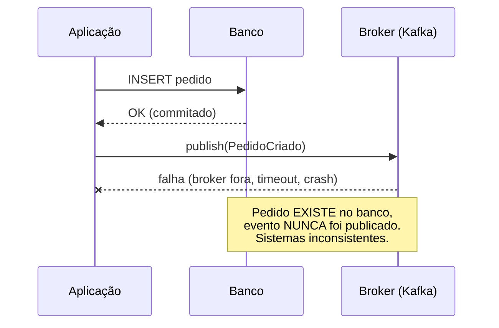
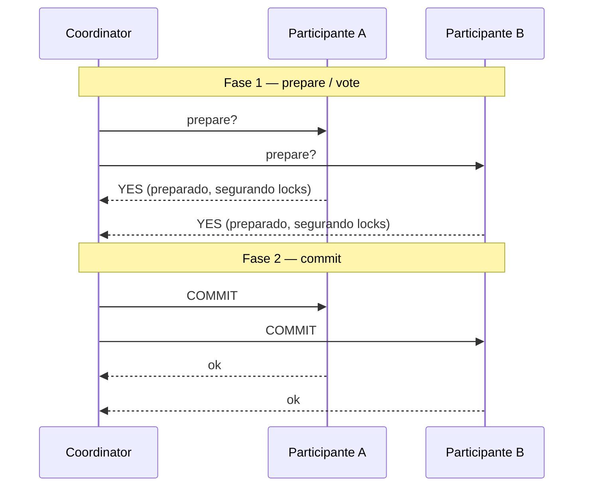
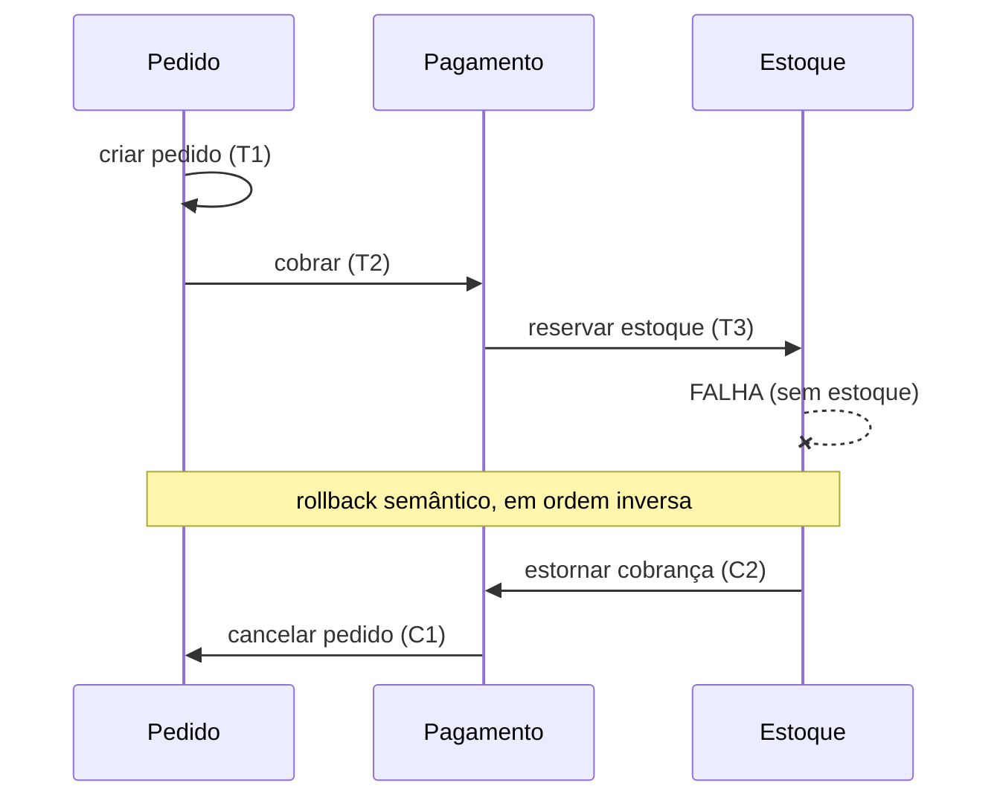
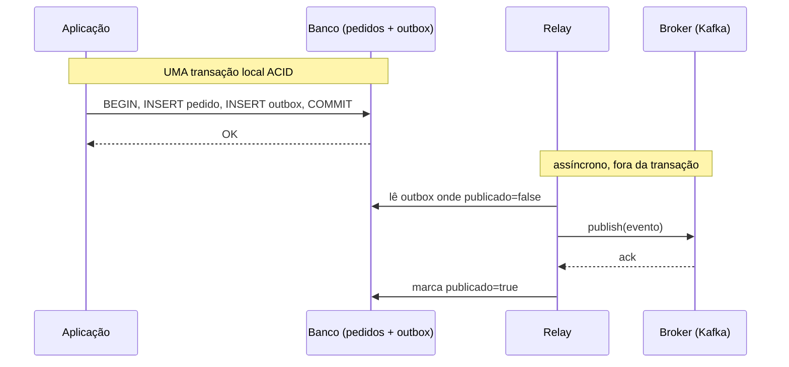

# Transações distribuídas

> [!abstract] TL;DR
> Uma transação local é ACID porque um único banco controla tudo (ver [[05 - Transações e ACID]]). No instante em que uma operação atravessa **dois sistemas** — o banco E um message broker, ou dois bancos — você perde essa garantia e cai no **dual-write problem**. Esta nota é dona do **lado-banco** desse problema: por que escrever em dois lugares é traiçoeiro, por que o **two-phase commit (2PC)** resolve no papel mas trava na prática, e por que o **Outbox pattern** devolve atomicidade transformando "publicar um evento" numa simples escrita de tabela. A **Saga** aparece o suficiente pra entrevista; o detalhe de orquestração vive em [[Mensageria]].

## O dual-write problem: a raiz de tudo

Imagine o código mais inocente do mundo. Você cria um pedido e avisa o resto do sistema:

```java
pedidoRepository.save(pedido);            // escrita 1: no banco
eventBus.publish(new PedidoCriado(...));  // escrita 2: no broker (Kafka, RabbitMQ)
```

Parece atômico. Não é. São **duas escritas, em dois sistemas, sem nenhuma transação comum por cima**. E onde há dois passos sem atomicidade, há uma janela onde só um deles aconteceu.

Pense nos quatro destinos possíveis. Os dois felizes: ambos falham (você reporta erro, nada mudou) ou ambos têm sucesso (o mundo está consistente). Os dois venenosos: o banco grava mas o broker cai — pedido existe, ninguém foi notificado, o estoque nunca é reservado. Ou o inverso, se você publicar antes de gravar — o evento sai, consumidores reagem a um pedido que o `COMMIT` nunca confirmou (e talvez nem confirme).



**Leitura do diagrama:** a primeira escrita já está commitada e é irreversível quando a segunda falha. Não existe `ROLLBACK` que alcance o `INSERT` lá atrás — ele é durável, ponto. O sistema ficou partido sem que ninguém tenha cometido um erro óbvio. Essa é a assinatura do dual-write: o caminho infeliz não é um bug de lógica, é uma propriedade estrutural de escrever em dois sistemas.

Por que não basta reordenar ou inverter? Trocar a ordem só troca **qual** lado fica órfão. Pôr um `try/catch` em volta tampouco resolve: se a publicação falha, você quer desfazer o `INSERT` — mas ele já commitou; e se você adiar o commit do banco até a publicação confirmar, a aplicação pode morrer no milissegundo entre as duas, deixando exatamente o mesmo buraco. **Não há ordem de duas operações independentes que seja segura.** É isso que motiva 2PC, Saga e Outbox.

> [!tip] A pergunta que desarma o dual-write
> "Eu tenho UMA fonte da verdade onde escrevo, e tudo o mais deriva dela?" Se a resposta é sim, você está no caminho do Outbox. Se você escreve a verdade em dois lugares ao mesmo tempo, está no caminho da dor.

## Two-phase commit (2PC): correto no papel, frágil na prática

O 2PC é a resposta acadêmica honesta: se você quer que N participantes commitem **tudo ou nada**, eleja um **coordinator** e faça o commit em duas fases.

- **Fase 1 — prepare (votação):** o coordinator pergunta a cada participante "consegue commitar?". Cada um faz o trabalho, persiste o suficiente pra garantir que **consegue** commitar depois, e vota `YES` ou `NO`. Quem vota `YES` fica **preparado** — comprometido, segurando locks, esperando.
- **Fase 2 — commit:** se **todos** votaram `YES`, o coordinator manda `COMMIT` pra todos. Se um único votou `NO` (ou não respondeu), manda `ABORT` pra todos.



**Leitura do diagrama:** repare na janela entre o `YES` e o `COMMIT`. Nela, cada participante está **preparado mas não commitado** — ele já não pode decidir sozinho (prometeu obedecer ao coordinator) e **segura os locks** que adquiriu. Multiplique isso pela latência de rede de todos os participantes e você entende o problema de throughput: o tempo de lock de cada recurso passa a ser o tempo da transação global inteira, não o da transação local.

O 2PC funciona — dá atomicidade real entre sistemas. Mas paga dois preços que o tornam tóxico em arquitetura de microsserviços:

1. **É um blocking protocol.** Se o **coordinator cai depois do prepare e antes do commit**, os participantes ficam **in doubt**: votaram `YES`, não podem reverter por conta própria, não sabem se o veredito foi `COMMIT` ou `ABORT`. Eles ficam **bloqueados, segurando locks, esperando o coordinator voltar**. Um nó morto trava recursos no sistema inteiro. (O 3PC tenta mitigar isso com uma fase extra, mas ainda assume rede bem-comportada — não sobrevive a partições.)
2. **Acopla disponibilidade.** A transação só commita se **todos** os participantes estiverem vivos e respondendo na hora. A disponibilidade do conjunto é o produto das disponibilidades individuais — quanto mais participantes, mais frágil. Vai na contramão de [[12 - Replicação, sharding e CAP]]: 2PC escolhe consistência abrindo mão de disponibilidade sob partição.

**Onde 2PC ainda aparece:** transações **XA** dentro de um único transaction manager (um servidor de aplicação coordenando um banco mais uma fila JMS, ambos no mesmo datacenter, baixa latência), ou entre dois bancos sob o mesmo TM. É uma ferramenta de **infraestrutura controlada**, não de malha de serviços pela internet. Em entrevista de system design, propor 2PC entre microsserviços é quase sempre o sinal errado.

## Saga: troque atomicidade por compensação

Se 2PC é caro demais, a alternativa é abandonar a fantasia de uma transação global e abraçar uma **sequência de transações locais**, cada uma ACID no seu próprio banco. A Saga é exatamente isso: uma cadeia de passos onde cada passo, se falha, é desfeito por uma **transação de compensação** — uma operação de negócio que reverte o efeito do passo anterior.



**Leitura do diagrama:** não existe `ROLLBACK` global. Quando o passo de estoque falha, a Saga executa **compensações em ordem inversa** — estorna o pagamento, cancela o pedido. Cada compensação é ela mesma uma transação local de negócio: "estornar" não é apagar uma linha, é registrar um estorno. É um **rollback semântico**, não um rollback do banco.

E aqui está a verdade que separa o senior do júnior em entrevista: **Saga não é ACID — ela sacrifica o I (isolamento)**. Entre o passo T2 e a compensação C2, o estado intermediário **é visível** a outras transações: por um instante, o cliente foi cobrado por um pedido que vai ser cancelado. Saga dá **A, C, D mas não I** (às vezes chamado de "ACD"). Isso obriga a desenhar o negócio pra tolerar esses estados — status `PENDENTE`, e-mails que só disparam no estado final, etc.

A coordenação da Saga tem dois sabores — **orquestração** (um coordenador central dita os passos) e **coreografia** (cada serviço reage a eventos dos outros, sem maestro). A escolha entre eles, o desenho das mensagens e as garantias de entrega são **assunto de mensageria**, não de banco: o detalhe vive em [[Mensageria]] e [[Arquitetura de Software]], e a descoberta de quais passos e compensações existem costuma sair de um [[Event Storming]]. Aqui paramos no conceito.

## Outbox pattern: o truque que devolve a atomicidade

Volte ao dual-write. O problema era escrever em dois sistemas. O Outbox faz um movimento elegante: **reduz os dois sistemas a um só no momento da escrita.** Em vez de publicar no broker dentro da sua transação de negócio, você grava o evento numa **tabela `outbox` no MESMO banco, na MESMA transação** que escreve a entidade.

```sql
BEGIN;
  INSERT INTO pedidos (id, cliente_id, total) VALUES (...);
  INSERT INTO outbox (id, tipo, payload, publicado)
    VALUES (gen_random_uuid(), 'PedidoCriado', '{...}', false);
COMMIT;  -- as duas escritas commitam juntas, ou nenhuma
```

Agora a atomicidade é a atomicidade **local** do seu banco — a mesma de [[05 - Transações e ACID]]. "Gravei o pedido E registrei a intenção de publicar o evento" é uma única transação ACID. Não há mais janela: ou as duas linhas existem, ou nenhuma. Um segundo processo, o **relay** (ou message relay), lê a tabela `outbox` e publica os eventos no broker de verdade, marcando-os como publicados.



**Leitura do diagrama:** o caminho crítico da aplicação só toca **um** sistema — o banco. A publicação no broker foi empurrada pra fora da transação, pra um processo que pode **tentar de novo** quantas vezes precisar, porque a fonte da verdade (a linha na `outbox`) é durável e não vai a lugar nenhum. Se o broker está fora, o relay espera e re-tenta; nada se perde.

Note o efeito colateral importante: o Outbox dá garantia **at-least-once**, não exactly-once. Se o relay publica, mas morre **antes** de marcar `publicado=true`, ele vai republicar na volta. Por isso o Outbox **exige consumidores idempotentes** — processar o mesmo evento duas vezes precisa ser inofensivo. A ferramenta canônica de idempotência no lado do consumidor é o **upsert** — `INSERT ... ON CONFLICT DO NOTHING/UPDATE`, detalhado em [[09 - SQL avançado]] — gravando o `event_id` já processado numa tabela de deduplicação.

Como o relay lê a `outbox`? Dois caminhos. O simples é **polling**: o relay faz `SELECT ... WHERE publicado=false` em loop (idealmente com `FOR UPDATE SKIP LOCKED` pra rodar em paralelo sem brigar, ver [[11 - Concorrência e locking]]). O sofisticado é **Change Data Capture (CDC)**: uma ferramenta como o **Debezium** lê o **WAL do PostgreSQL** e detecta os `INSERT` na `outbox` em dezenas de milissegundos, sem consultar o banco em loop. CDC é mais barato e tem menor latência; o detalhe de pipeline é assunto de [[Mensageria]].

> [!warning] O Outbox não te dá ordem nem entrega exatamente-uma-vez de graça
> Ele resolve **atomicidade local** — o dual-write. Não resolve sozinho: ordenação global de eventos, duplicação (daí a idempotência), nem o "inbox" do lado consumidor. Trate-o como o tijolo que torna a publicação confiável, não como a arquitetura inteira.

## Quando usar o quê (resumo de entrevista)

| Situação | Ferramenta | Por quê |
| --- | --- | --- |
| Banco + broker, mesmo serviço | **Outbox** | Mata o dual-write com uma transação local |
| Operação cruza vários serviços | **Saga** | Transações locais + compensação; sem lock global |
| Dois recursos XA, um TM, baixa latência | **2PC** | Atomicidade real onde o ambiente é controlado |
| Microsserviços pela rede | **Evite 2PC** | Blocking, acopla disponibilidade, morre sob partição |

A linha mestra: **prefira atomicidade local (Outbox) + consistência eventual (Saga) a atomicidade distribuída (2PC).** É a mesma escolha de fundo do [[12 - Replicação, sharding e CAP]] — sob partição, sistemas reais largam a consistência forte global e a reconstroem por cima, com idempotência e compensação.

## Em entrevista

> "The root issue in distributed transactions is the **dual-write problem**: when one operation has to write to the database *and* publish an event, there's no shared transaction, so a crash between the two leaves the systems inconsistent. **Two-phase commit** solves atomicity on paper, but it's a **blocking protocol** — participants hold locks while prepared, and if the coordinator dies after the prepare phase they're stuck in-doubt. It also couples availability, so it doesn't survive network partitions. That's why I avoid 2PC across microservices. Instead I reach for the **transactional outbox**: I write the event to an outbox table in the *same local transaction* as the business data, and a relay — polling or CDC with Debezium reading the WAL — publishes it afterward. That collapses the dual write into one atomic local commit. The cost is at-least-once delivery, so consumers must be **idempotent**, typically with an upsert on the event id. For a flow that spans services, I use a **saga** — local transactions with compensating actions — but I'm explicit that a saga drops isolation, so intermediate states are visible and the domain has to tolerate them."

### Vocabulário

- dual-write problem → dual-write problem (problema da escrita dupla)
- transação de compensação → compensating transaction
- escrita dupla → dual write
- protocolo bloqueante → blocking protocol
- fase de preparação → prepare phase
- participante em dúvida → in-doubt participant
- coordenador → coordinator
- entrega ao menos uma vez → at-least-once delivery
- consumidor idempotente → idempotent consumer
- captura de mudança de dados → change data capture (CDC)
- relay / publicador → message relay
- rollback semântico → semantic rollback

## Veja também

- [[05 - Transações e ACID]] — a transação local que o dual-write quebra ao atravessar sistemas
- [[12 - Replicação, sharding e CAP]] — por que sistemas distribuídos largam a consistência forte
- [[09 - SQL avançado]] — upsert (`ON CONFLICT`) como ferramenta de idempotência
- [[11 - Concorrência e locking]] — `SKIP LOCKED` para relays de outbox em paralelo
- [[Mensageria]] — Saga (orquestração vs coreografia), CDC/Debezium, garantias de entrega
- [[Arquitetura de Software]] — Saga e consistência distribuída na escala de sistema
- [[Event Storming]] — descobrir os passos e compensações de uma Saga

> [!info] Lastro
> Fontes verificadas (jun/2026):
> - **Dual-write problem** — Auth0, "Handling the Dual-Write Problem in Distributed Systems"; descrição do estado inconsistente quando a 1ª escrita commita e a 2ª falha.
> - **Transactional outbox** — AWS Prescriptive Guidance, "Transactional outbox pattern"; padrão canônico atribuído originalmente a Chris Richardson (microservices.io). Confirma a tabela outbox + relay na mesma transação ACID.
> - **2PC como blocking protocol e coordinator in-doubt** — Baeldung CS, "Two-Phase Commit vs Saga Pattern"; e material de distributed transactions confirmando locks segurados entre prepare e commit e o estado in-doubt sob falha do coordinator.
> - **Saga sacrifica isolamento (ACD)** — síntese de fontes sobre Saga; compensação em ordem inversa e visibilidade de estados intermediários.
> - **CDC/Debezium lendo o WAL** — material de implementação do outbox com Debezium (latência ~50-100ms lendo o WAL do Postgres).
>
> Ressalvas: latências de CDC citadas variam por setup e não são garantia; "exactly-once" no broker (ex.: Kafka EOS) existe mas tem premissas próprias — o Outbox por si só é at-least-once. O detalhe de Saga (orquestração/coreografia, frameworks) é deliberadamente delegado a [[Mensageria]]; esta nota cobre só o lado-banco.
