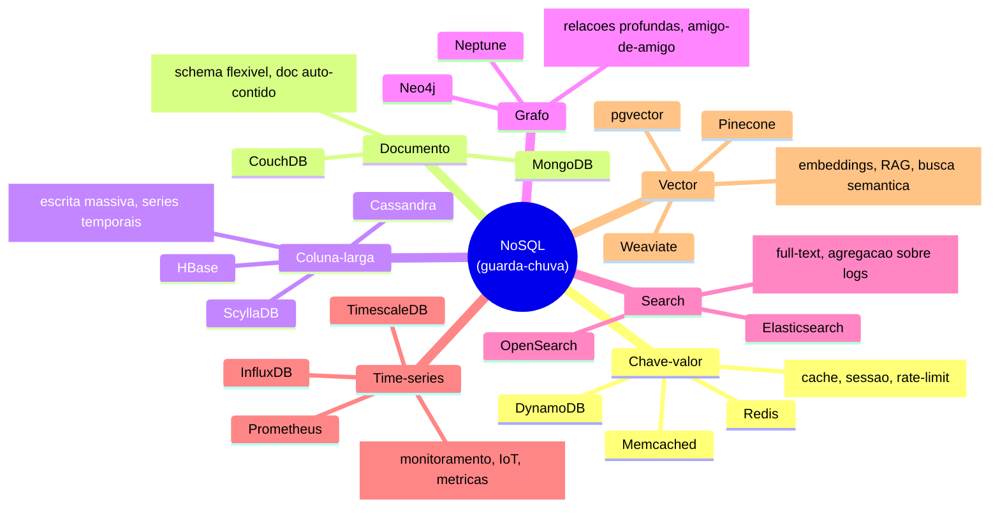
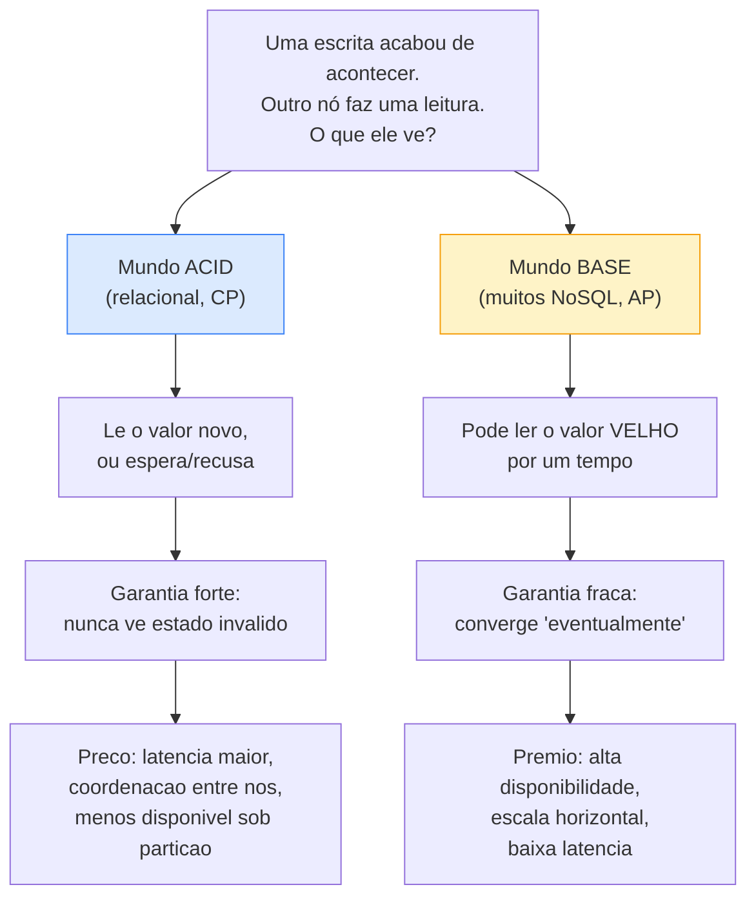
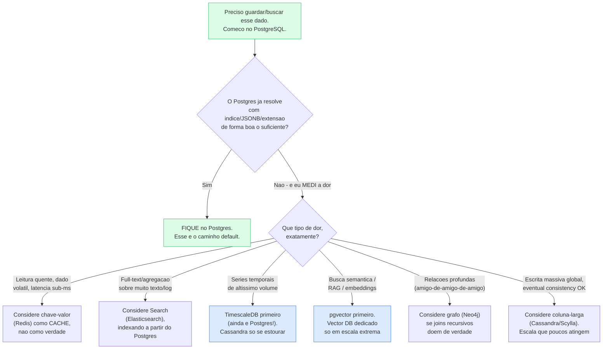
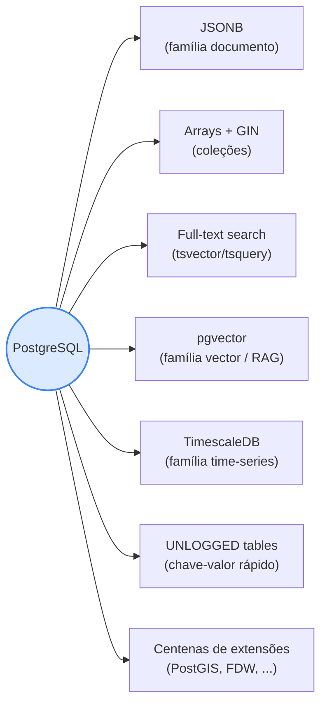

# NoSQL e polyglot persistence

> [!abstract] Resumo em uma linha
> "NoSQL" não é UM banco nem UMA tecnologia: é um guarda-chuva de famílias com modelos e trade-offs distintos. A pergunta de senior nunca é "SQL ou NoSQL?", é "qual store para qual padrão de acesso?" — e a regra de ouro continua sendo **comece com PostgreSQL e só adicione outro banco quando houver dor concreta e medida**.

Deixa eu começar matando um mal-entendido que custa caro em entrevista. Quando alguém diz "vamos usar NoSQL", é como se dissesse "vamos usar um veículo não-carro". Tá, mas o quê? Uma bicicleta? Um avião? Um submarino? São coisas radicalmente diferentes que só compartilham uma negação: *não são carro*. "NoSQL" tem exatamente esse problema — o nome define o que a coisa **não é** (não-relacional, ou na leitura mais caridosa "Not Only SQL"), e por baixo desse rótulo vivem pelo menos sete famílias que não têm quase nada em comum.

Esta nota faz o que importa para um senior: dá o **mapa das famílias**, explica a **mudança filosófica** (ACID → BASE) que muitos desses bancos abraçaram, e — o mais importante para entrevista e para a vida — te dá um **critério honesto de quando adicionar um segundo banco**. Não é um curso de MongoDB nem de Cassandra. É a bússola.

---

## "NoSQL" é um guarda-chuva, não uma categoria técnica

Pensa no que esses bancos compartilham. Quase nada, tecnicamente. Redis guarda pares chave-valor na RAM; Cassandra distribui colunas por dezenas de nós; Neo4j navega arestas de um grafo; Elasticsearch monta índices invertidos para busca textual. O único fio comum é histórico: todos nasceram (lá por 2007-2012) da frustração de fazer um banco relacional único escalar horizontalmente para a web de gigaescala, e por isso **relaxaram alguma coisa** que o relacional segurava firme — o schema rígido, ou os joins, ou a consistência forte, ou as transações ACID.

Esse é o insight de senior: **cada família troca uma garantia específica por um benefício específico.** Não existe "o NoSQL é mais rápido" — existe "essa família abre mão de X para ganhar Y, e isso só vale a pena se o seu workload realmente sofre com X".

O diagrama abaixo organiza as famílias por aquilo que cada uma faz de melhor. Não é uma taxonomia acadêmica — é o mapa que você quer ter na cabeça quando alguém pergunta "onde guardo isso?".

**Leitura do diagrama:** o nó raiz é só um rótulo — não há um "banco NoSQL", há sete ramos independentes. Repara que dois nomes aparecem onde você talvez não esperasse: **TimescaleDB** está em time-series mas é PostgreSQL por dentro, e **pgvector** está em vector mas é uma *extensão* do Postgres. Guarda isso — vai ser o gancho da seção final sobre o canivete suíço.

---

## As sete famílias, com modelo e caso de uso

A taxonomia em prosa some na memória. Em tabela, ela fica. Aqui está o mapa completo — o que cada família modela e onde ela brilha. Esta é a tabela do monólito do galho, e é a que eu releio antes de qualquer entrevista de system design.

| Família | Exemplos | Modelo de dados | Onde brilha | O que troca |
| --- | --- | --- | --- | --- |
| **Chave-valor** | Redis, DynamoDB, Memcached | `key → value` (opaco) | cache, sessão, rate limiting, leaderboard, lock distribuído | sem query rica: você só busca pela chave |
| **Documento** | MongoDB, CouchDB | JSON/BSON aninhado | schema flexível, dado semi-estruturado, documento auto-contido | joins entre documentos são fracos/caros |
| **Coluna-larga** | Cassandra, ScyllaDB, HBase | linhas com colunas dinâmicas, particionadas | escrita massiva distribuída, séries temporais, logs | modela-se pela *query*, não pelo dado; consistência eventual |
| **Grafo** | Neo4j, Neptune, ArangoDB | nós + arestas (com propriedades) | relações profundas (amigo-de-amigo-de-amigo), recomendação, fraude | escala horizontal é difícil; nicho |
| **Search** | Elasticsearch, OpenSearch, Solr | índice invertido | full-text, autocomplete, agregação sobre logs | **não é fonte de verdade**; near-real-time, sem ACID |
| **Time-series** | InfluxDB, TimescaleDB, Prometheus | timestamp + métricas | monitoramento, IoT, métricas, observabilidade | otimizado para append e janelas de tempo |
| **Vector** | Pinecone, Weaviate, pgvector | vetores de embeddings + ANN | busca semântica para LLMs/RAG, similaridade, ML | busca *aproximada* (ANN), não exata |

Três notas que valem ouro na entrevista, porque são onde candidatos escorregam:

- **Documento ≠ "schemaless de graça".** MongoDB te deixa guardar qualquer JSON, mas o schema não desapareceu — ele só **migrou do banco para o seu código de aplicação**. Alguém ainda precisa saber que `user.email` existe e é string. Schema flexível é ótimo para iterar rápido; é péssimo quando cinco serviços assumem formatos diferentes do mesmo documento. A regra prática: documento brilha quando o dado é **auto-contido** (um pedido com seus itens, lido e escrito junto). Se você se pega fazendo "join manual" no código entre coleções, provavelmente queria um relacional.

- **Search nunca é fonte primária de verdade.** Elasticsearch é fenomenal para full-text e agregação, mas é *near-real-time* e não tem transações. O padrão correto é: a verdade vive no Postgres, e você **indexa** uma cópia no Elasticsearch para busca. Se o ES cair, você reconstrói o índice da fonte. Quem trata o ES como banco de verdade acorda um dia com dado perdido e sem como recuperar.

- **Vector é o novato com pedigree.** A explosão de LLMs trouxe a família vector para o centro: você converte texto em embeddings (vetores de centenas de dimensões) e busca por *similaridade semântica* — a base de RAG (retrieval-augmented generation). O ponto de senior aqui é o mesmo de sempre: o **pgvector** te dá busca vetorial dentro do Postgres que você já tem, antes de você adicionar um Pinecone dedicado.

---

## BASE: o oposto filosófico do ACID

Aqui está a divisão conceitual mais profunda da nota. Os bancos relacionais que você conhece de [[05 - Transações e ACID]] prometem **ACID** — atomicidade, consistência, isolamento, durabilidade. É um contrato de **rigor**: ou a transação aconteceu inteira e o banco está num estado válido, ou não aconteceu nada. Forte, previsível, e — em escala distribuída — **caro**.

Muitos bancos NoSQL, especialmente os que nasceram para escalar horizontalmente, abraçaram o contrato oposto, batizado de **BASE** (um trocadilho químico: ACID vs BASE, ácido vs base). BASE significa:

- **B**asically **A**vailable — o sistema **sempre responde**, mesmo que a resposta seja "dado desatualizado" ou "falha parcial". Disponibilidade acima de tudo.
- **S**oft state — o estado **pode mudar sozinho com o tempo**, mesmo sem ninguém escrevendo, porque o sistema está reconciliando réplicas em segundo plano.
- **E**ventually consistent — se as escritas pararem, as réplicas **eventualmente** convergem para o mesmo valor. Sem garantia de *quando* — só de que vai acontecer.

Pega a essência: ACID otimiza para **correção**, BASE otimiza para **disponibilidade e escala**. ACID diz "prefiro recusar do que dar resposta errada"; BASE diz "prefiro dar uma resposta talvez-velha do que não responder". Nenhum é melhor — são respostas a perguntas diferentes.

Isso não cai do céu: é exatamente o trade-off do teorema CAP que você viu em [[12 - Replicação, sharding e CAP]]. Quando há partição de rede, você escolhe entre **C**onsistência e **A**vailability. ACID/relacional tende ao lado CP (recusa em vez de mentir); BASE/Cassandra/Dynamo tende ao lado AP (responde mesmo desatualizado).

**Leitura do diagrama:** a mesma situação — escrever e depois ler de outro nó — produz respostas opostas conforme o contrato. O mundo ACID nunca te mostra lixo, mas paga em latência e disponibilidade. O mundo BASE te mostra um valor possivelmente velho, e em troca fica de pé e rápido sob carga e falha. Saber para qual lado um dado pode pender é trabalho de senior: contador de likes? BASE serve. Saldo bancário? ACID, sem negociação.

### A nuance honesta: NoSQL moderno tem transações

Aqui é onde candidatos desatualizados levam susto. A dicotomia "SQL = ACID, NoSQL = BASE" era verdade em 2012. **Hoje não é mais uma fronteira limpa.** O **MongoDB** suporta transações ACID **multi-documento** desde a versão 4.0 (2018) para replica sets, e desde a 4.2 (2019) para clusters com sharding. DynamoDB tem transações. Vários bancos da família documento e chave-valor adicionaram garantias mais fortes ao longo dos anos.

Então a leitura correta não é "NoSQL não tem transação" — é "**a maioria dos NoSQL nasceu priorizando disponibilidade/escala sobre consistência forte, e oferece transações como recurso opcional, muitas vezes com custo de performance**". Se você precisa de ACID *o tempo todo*, em *todas* as operações, e ele é o seu pão de cada dia, o relacional ainda é o lar natural — porque lá ACID é o default, não a exceção que você liga e paga caro.

---

## Quando escolher cada um (e a regra de ouro)

Beleza, mapa desenhado. Agora a pergunta que importa: **você precisa de outro banco?**

A resposta de senior — e a que faz olhos brilharem em entrevista — começa com uma regra que parece conservadora e é, na verdade, a mais sofisticada que existe:

> [!tip] Regra de ouro
> **Comece com PostgreSQL. Só adicione outro store quando houver dor concreta e medida.**

Por que isso é sofisticado e não preguiçoso? Porque a alternativa — adotar um banco especializado *no caso de* — ignora o custo que ninguém coloca no slide de arquitetura: **custo operacional**. Cada banco novo no seu stack é um sistema a mais para:

- **monitorar** (métricas, alertas, dashboards próprios),
- **fazer backup e testar restore** (cada um com sua ferramenta e seus modos de falha),
- **atualizar** (versões, breaking changes, janelas de manutenção),
- **debugar às 3h da manhã** (e ninguém do time conhece a fundo),
- **proteger** (mais uma superfície de segurança, mais um conjunto de credenciais).

Isso é **polyglot persistence**, termo cunhado por Martin Fowler e Pramod Sadalage no livro *NoSQL Distilled*: usar múltiplas tecnologias de armazenamento, cada uma escolhida pelo modo como a aplicação usa aquele dado. A ideia em si é correta — diferentes problemas pedem diferentes ferramentas. Mas o livro também é honesto sobre o preço: polyglot persistence **multiplica a complexidade operacional**, e essa conta vem todo mês, para sempre.

A árvore de decisão abaixo é o coração prático da nota. Repara que ela **começa no Postgres** e só sai dele a contragosto, depois de comprovar que o Postgres não dá conta.

**Leitura do diagrama:** o filtro inteiro é a pergunta do meio — *"e eu MEDI a dor"*. Sem medição (um `EXPLAIN ANALYZE` lento de [[08 - EXPLAIN e otimização]], um p95 de latência estourado de [[10 - Performance e armadilhas]], um custo de query insustentável), você não tem o direito de sair do Postgres. E mesmo quando sai, repara nos nós azuis: para séries temporais a primeira parada é **TimescaleDB** (que é Postgres), e para embeddings é **pgvector** (que é Postgres). Você quase nunca *precisa* trocar de banco — precisa de uma extensão dele.

Os atalhos concretos que valem decorar, direto do monólito do galho:

- **Redis** antes de qualquer "banco de cache" exótico — cache L2, sessão, rate limiting, lock distribuído, fila leve, pub/sub. É o segundo store mais justificável que existe.
- **TimescaleDB antes de Cassandra** para séries temporais: você mantém SQL, mantém Postgres, e ganha hypertables e compressão. Cassandra é para quando você atinge escala que a maioria dos sistemas nunca vê.
- **pgvector antes de um vector DB dedicado** para RAG/busca semântica: zero banco novo, embeddings convivem com seus dados relacionais. Pinecone/Weaviate quando o volume e a latência de ANN realmente justificarem a operação extra.
- **Elasticsearch** quando full-text de verdade dói — mas sempre como índice derivado, nunca como fonte de verdade.

---

## Postgres como canivete suíço

A razão pela qual "comece com Postgres" não é dogma é que o Postgres, sozinho, **cobre boa parte das famílias NoSQL** sem você adicionar banco nenhum. Esse é o argumento que fecha a nota e que ganha pontos numa entrevista de system design.

**Leitura do diagrama:** cada seta é uma família NoSQL que o Postgres absorve. **JSONB** te dá documentos indexáveis (com índice GIN, você consulta dentro do JSON quase como no MongoDB). **Arrays** modelam coleções pequenas sem tabela de junção. O **full-text** nativo resolve busca textual moderada sem Elasticsearch. **pgvector** traz embeddings. **TimescaleDB** é uma extensão que transforma o Postgres num time-series competente. Some isso ao ecossistema de centenas de extensões e à conclusão do monólito: *"Postgres faz quase tudo bem o suficiente"*.

A ressalva honesta para não soar fanático: "bem o suficiente" tem teto. JSONB não substitui um MongoDB sharded em escala de petabytes; o full-text nativo não bate um Elasticsearch afinado para relevância; pgvector não vence um Pinecone otimizado em bilhões de vetores com latência crítica. O ponto não é "Postgres ganha de tudo" — é "**Postgres adia a decisão de adicionar outro banco até você ter dor e dados para justificá-la**". Polyglot persistence é uma chegada, não um ponto de partida. Volte ao começo desta nota — ao [[01 - O que é um banco de dados]] — e lembre: a meta nunca foi colecionar bancos, foi guardar dado e recuperá-lo com as garantias certas pelo menor custo total.

---

## Em entrevista

> "NoSQL" is an umbrella term, not a technical category — key-value, document, wide-column, graph, search, time-series and vector stores share almost nothing except being non-relational. Each family trades one specific guarantee for one specific benefit, so the real question is never "SQL or NoSQL?" but "which store fits this access pattern?".
>
> Many of these systems adopted **BASE** — Basically Available, Soft state, Eventually consistent — which is the philosophical opposite of **ACID**: they prioritize availability and horizontal scale over strong consistency, exactly the CAP trade-off. That said, I'm careful not to overstate it: modern NoSQL like MongoDB has supported multi-document ACID transactions since 4.0, so the line is blurrier than it used to be.
>
> My rule of thumb is to **start with PostgreSQL and add another store only when there's concrete, measured pain** — because **polyglot persistence** carries a real operational cost: every new database is one more thing to monitor, back up, upgrade and debug at 3am. In practice Postgres is a Swiss-army knife: JSONB covers documents, pgvector covers semantic search for RAG, and TimescaleDB covers time-series — so I reach for those before introducing Cassandra or a dedicated vector database.

### Vocabulário

| Português | English |
| --- | --- |
| armazenamento chave-valor | key-value store |
| banco de documentos | document database |
| coluna larga | wide-column store |
| consistência eventual | eventual consistency |
| persistência poliglota | polyglot persistence |
| disponibilidade | availability |
| tolerância a partição | partition tolerance |
| dado semi-estruturado | semi-structured data |
| documento auto-contido | self-contained document |
| busca semântica | semantic search |
| índice invertido | inverted index |
| fonte de verdade | source of truth |
| dado derivado / índice derivado | derived data / derived index |
| custo operacional | operational cost |
| dor concreta e medida | concrete, measured pain |

---

## Veja também

- [[05 - Transações e ACID]] — o contrato ACID que o BASE inverte
- [[12 - Replicação, sharding e CAP]] — o teorema que explica por que BASE existe
- [[10 - Performance e armadilhas]] — onde se mede a "dor" antes de adicionar um banco
- [[01 - O que é um banco de dados]] — a meta original: guardar e recuperar com garantias
- [[16 - Banco de dados em entrevista]] — defender escolhas de store em system design
- [[03-Dominios/Engenharia/Dados/1 - Fundamentos de engenharia de dados/01 - O que é engenharia de dados|O que é engenharia de dados]] — o lado **OLAP/analytics** que consome estes stores: por que o banco transacional não basta e como a engenharia de dados constrói a ponte pro warehouse

> [!info] Lastro
> Fontes consultadas e verificadas (jun/2026):
> - **Famílias NoSQL e taxonomia** — tabela do monólito do galho (`Banco de dados.md`, seção "SQL vs NoSQL") e *DesignGurus, "ACID vs BASE Properties in Databases"*.
> - **BASE (Basically Available, Soft state, Eventually consistent)** — [DesignGurus — BASE consistency model](https://www.designgurus.io/answers/detail/what-is-the-base-consistency-model-basically-available-soft-state-eventual-consistency-in-nosql-systems); [phoenixNAP — ACID vs BASE](https://phoenixnap.com/kb/acid-vs-base).
> - **Polyglot persistence (definição)** — Martin Fowler & Pramod Sadalage, *NoSQL Distilled*; [Fowler — bliki: Polyglot Persistence](https://martinfowler.com/bliki/PolyglotPersistence.html): "uso de múltiplas tecnologias de armazenamento, escolhidas pelo modo como o dado é usado".
> - **MongoDB com transações ACID** — multi-documento desde a v4.0 (2018, replica sets) e v4.2 (2019, sharded clusters): [MongoDB Docs — Transactions](https://www.mongodb.com/docs/manual/core/transactions/).
> - **pgvector / Postgres como canivete** — conclusões do monólito do galho ("Postgres faz quase tudo bem o suficiente"); pgvector é extensão oficial do PostgreSQL.
>
> **Ressalvas:** (1) a dicotomia "SQL = ACID, NoSQL = BASE" é uma simplificação histórica — NoSQL moderno (MongoDB, DynamoDB) oferece transações, embora não como default barato. (2) "Postgres faz quase tudo" tem teto: em escala extrema, bancos especializados ainda ganham; o argumento é sobre *adiar* a decisão, não sobre Postgres ser onipotente.
