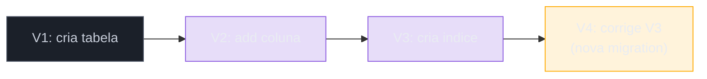
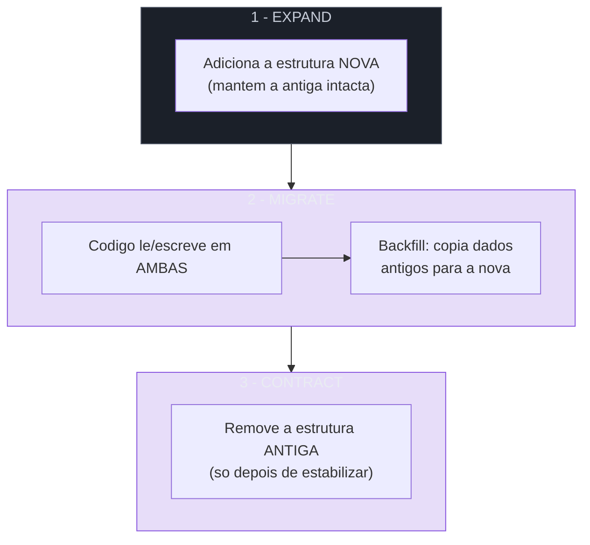
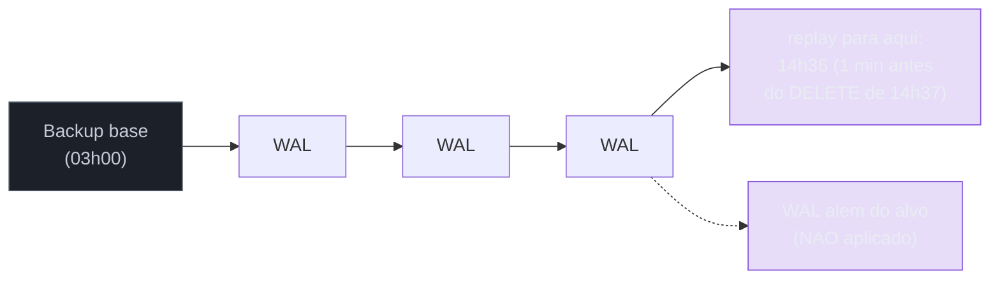
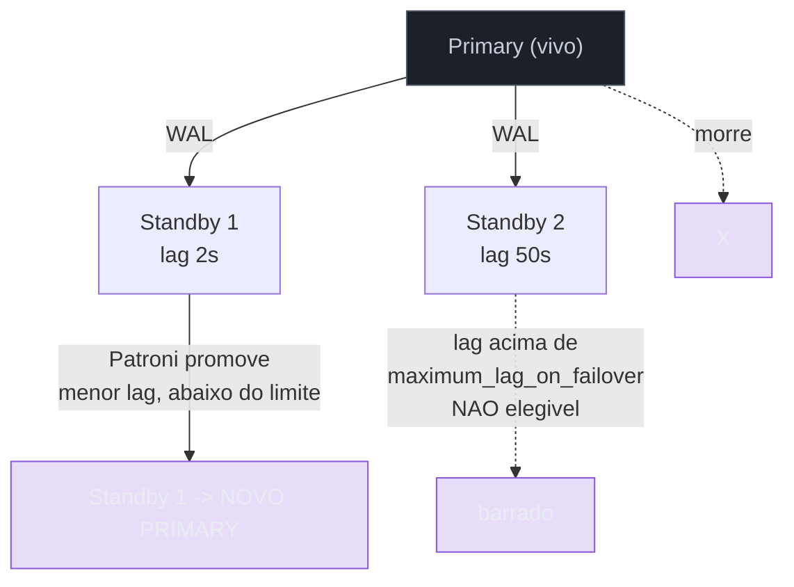
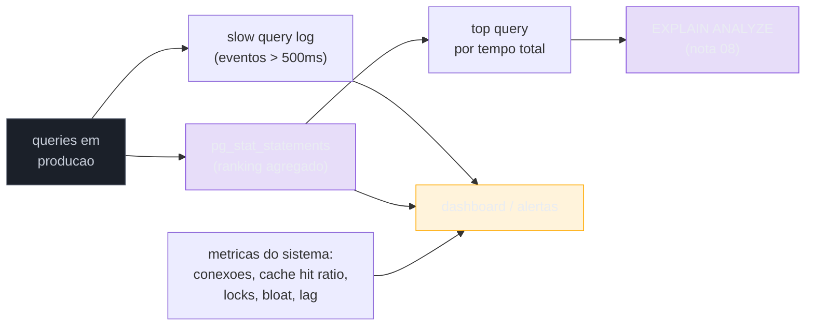

# Operação em produção

> [!abstract] Resumo em uma linha
> Em produção o banco deixa de ser um arquivo de dados e vira um **sistema vivo**: o schema muda enquanto há tráfego, o disco morre, a réplica atrasa, e a query que voava ontem hoje varre 5 milhões de linhas — operar é manter tudo isso sob controle **sem desligar nada**.

Até aqui a trilha tratou o banco parado: você modela, escreve a query, lê o `EXPLAIN`, escolhe o índice. Tudo isso acontece num mundo onde **ninguém está usando o sistema enquanto você mexe**. Operação em produção é o oposto: você mexe **com o sistema ligado**, com usuários reais clicando, com dinheiro passando pelas transações. As regras mudam.

Pensa num mecânico. Aprender a montar um motor na bancada é uma coisa. Trocar uma peça do motor **com o carro andando a 100 km/h na estrada** é outra. Produção é a estrada. Esta nota é sobre as quatro coisas que você precisa saber fazer sem encostar o carro: **mudar o schema** (migrations), **não perder os dados** (backup/PITR), **sobreviver à morte de um servidor** (replicação operacional) e **enxergar o que está acontecendo lá dentro** (observabilidade).

A voz-padrão aqui é PostgreSQL, como no resto do galho. Onde MySQL diverge de verdade, eu aponto.

---

## Migrations: o schema também é código

Toda mudança de estrutura do banco — criar tabela, adicionar coluna, criar índice, mudar um tipo — é uma **migration**. A ideia central, e que separa um time profissional de um amador, é esta:

> O schema do banco é **código versionado no git**, vive **junto com a aplicação**, e roda **automaticamente** no deploy.

Ninguém entra no banco de produção, abre um `psql` e digita `ALTER TABLE` na mão. Por quê? Porque um comando digitado na mão é invisível: não está no git, não passou por code review, não roda igual no ambiente de teste, e ninguém sabe que ele aconteceu. Migration é o `ALTER TABLE` transformado num **arquivo rastreável** que toda cópia do banco (dev, staging, produção) executa na mesma ordem.

As ferramentas que fazem isso, por ecossistema:

| Ecossistema | Ferramentas |
| --- | --- |
| Java | **Flyway**, **Liquibase** |
| Node | **Prisma Migrate**, **TypeORM** migrations |
| Python | **Alembic** |

No mundo Java, o [[Spring Boot]] integra o Flyway de fábrica: ele roda as migrations pendentes na subida da aplicação, mantendo uma tabela de controle (`flyway_schema_history`) que registra **o que já foi aplicado**. Você cria `V2__add_index_consultas.sql` no diretório de migrations, e o Flyway garante que ele roda **uma vez só**, em ordem, em todo ambiente.

### A regra que não se quebra: migration aplicada é imutável

Esta é a regra de ouro, e é contraintuitiva pra quem vem do git mental "edito o arquivo e commito de novo":

> Uma vez que uma migration **rodou em produção**, ela é **imutável**. Você nunca edita o arquivo dela. Se errou, você cria uma **nova** migration que corrige.

A razão é mecânica. O Flyway guarda um **checksum** de cada migration aplicada. Se você editar `V3__...sql` depois que ela rodou, o checksum muda, e o Flyway na próxima subida grita "o histórico não bate" e **recusa subir** — porque o estado real do banco de produção foi construído com a versão *antiga* do arquivo, e o disco não tem como saber o que mudou. Editar uma migration aplicada é reescrever a história de um banco que já agiu sobre aquela história. Não dá.



Leitura do diagrama: as migrations formam uma **fita só pra frente**. Se V3 saiu errada, a correção é V4 — uma nova entrada na fita, nunca uma borracha em cima de V3. O banco de produção é o acúmulo de tudo que já rodou; você só pode **adicionar** ao final.

---

## Migrations zero-downtime: expand / migrate / contract

Aqui mora a parte difícil. Migrations simples (criar tabela nova, adicionar coluna nullable) são inofensivas. O problema são as **mudanças incompatíveis** — aquelas em que o schema novo e o código antigo **não conseguem conviver**.

Pensa num deploy real. Você nunca troca todas as instâncias da aplicação no mesmo instante. Por alguns segundos ou minutos existe a **versão antiga do código** e a **versão nova** rodando ao mesmo tempo, falando com o **mesmo banco**. Se a migration quebra a versão antiga, você derruba metade dos usuários durante o deploy.

A solução é nunca fazer uma mudança incompatível de uma vez. Você a quebra em três fases, conhecidas como **expand / migrate / contract** (também chamado *parallel change*):



Leitura do diagrama: cada fase é um **deploy separado**, com tempo de estabilização entre elas. Em nenhum momento existe um estado onde uma versão do código não consiga funcionar. O segredo é a fase do meio: um período em que **as duas estruturas coexistem** e o código sabe lidar com as duas.

### O caso canônico: renomear uma coluna

"Renomear coluna" parece trivial — `ALTER TABLE ... RENAME COLUMN nome_velho TO nome_novo`. Mas esse comando é **destrutivo e instantâneo**: no milissegundo em que ele roda, o código antigo que ainda procura `nome_velho` quebra com "coluna não existe". É o exemplo perfeito de mudança incompatível. A forma zero-downtime:

1. **Expand** — `ADD COLUMN nome_novo` (nullable). A coluna velha continua lá.
2. **Migrate** — deploya código que **escreve nas duas** colunas e **lê da nova com fallback pra velha**. Roda um **backfill** que copia `nome_velho → nome_novo` nas linhas antigas.
3. **Contract** — depois que tudo estabilizou e nenhum código toca mais `nome_velho`, um último deploy lê só da nova, e a migration final faz `DROP COLUMN nome_velho`.

Mais passos, mais deploys, mais paciência — em troca de **zero usuário quebrado**. É exatamente o tipo de trade-off que define senioridade: o caminho rápido é o caminho que derruba produção.

### Por que `ADD COLUMN NOT NULL` sem default é uma bomba

Tem uma armadilha específica que merece destaque, porque é fácil de cometer e cara de pagar.

Quando você faz `ADD COLUMN ... NOT NULL` **sem um default**, você está dando ao banco uma ordem impossível-de-otimizar: "toda linha que já existe tem que ter um valor não-nulo nessa coluna que acabou de nascer". O banco não tem o que escrever ali, então o comando **falha** — ou, se você dá um default *volátil* (tipo `now()` ou `gen_random_uuid()`), ele precisa **visitar e reescrever cada linha da tabela** pra preencher o valor, segurando um lock pesado o tempo todo.

Vale fixar a nuance moderna, porque cai em entrevista: **desde o PostgreSQL 11**, `ADD COLUMN` com um default **constante** (`DEFAULT 0`, `DEFAULT false`, `DEFAULT 'ativo'`) é uma **mudança só de metadados** — instantânea, sem rewrite, sem lock pesado. O banco guarda "o default dessa coluna pras linhas antigas é X" no catálogo e segue a vida. O rewrite caro só acontece com default **volátil** (que muda a cada linha) ou em versões anteriores à 11.

A regra prática, válida em qualquer versão e qualquer banco, é a sequência segura:

> `ADD COLUMN` nullable → **backfill** dos dados em background (em lotes) → `ALTER COLUMN ... SET NOT NULL` depois.

Veja [[10 - Performance e armadilhas]] pra mecânica de lock contention e por que transações longas (como um backfill mal feito) derrubam concorrência.

### Na prática: a migration que travou produção por 15 minutos

> No MedEspecialista, uma migration adicionou uma coluna `NOT NULL` **sem default** numa tabela de **20 milhões de linhas**. O Flyway pegou aquilo e **travou por cerca de 15 minutos** fazendo o rewrite completo da tabela — segurando lock, com a aplicação batendo timeout, durante a janela inteira. A lição ficou cravada: em tabela grande, **nunca** `ADD COLUMN NOT NULL` num passo só. Sempre `ADD COLUMN` nullable → backfill em background → `SET NOT NULL` depois. O comando que parecia uma linha inofensiva era um expand/migrate/contract disfarçado, e ignorar isso custou 15 minutos de produção degradada.

Esse é o caso-âncora pra fixar tudo desta seção: a diferença entre saber SQL e saber **operar** SQL é exatamente saber que aquele `ALTER TABLE` de uma linha pode parar um sistema inteiro.

---

## Backup e restore: a apólice de seguro

Backup é a coisa mais chata do mundo até o dia em que é a única coisa que importa. Dois eixos pra entender: **o que** você copia, e **até onde** consegue restaurar.

### Físico vs lógico

| Eixo | Backup físico | Backup lógico |
| --- | --- | --- |
| O que é | Cópia dos **arquivos de dados** no disco (snapshot, `pg_basebackup`) | **Comandos SQL** que recriam tudo (`pg_dump`, `mysqldump`) |
| Velocidade | Rápido (copia bytes) | Lento (reexecuta inserts) |
| Tamanho | Grande (banco inteiro, índices) | Menor (só dados + DDL) |
| Portabilidade | Amarrado à versão/arquitetura | Portável entre versões, restaura tabela avulsa |
| Quando | Bancos grandes, restore rápido, base pra PITR | Migração de versão, restaurar uma tabela, dump pra dev |

A intuição: o **físico** é tirar uma foto do disco — rápido de tirar, rápido de colar de volta, mas é o disco inteiro e amarrado àquela versão do Postgres. O **lógico** é o banco contando sua própria história em SQL — portável, granular, mas reconstruir 20M de linhas reexecutando inserts é lento.

### PITR: voltar no tempo até o segundo antes do desastre

Backup comum te dá um ponto: "tenho o estado das 3h da manhã". Mas e se o `DELETE FROM clientes` sem `WHERE` aconteceu às 14h37? O backup das 3h perde o dia inteiro de trabalho.

**PITR — Point-in-Time Recovery** — resolve isso. A sacada é combinar duas coisas que você já conhece:

- Um **backup base** (físico, tirado periodicamente — digamos, toda madrugada).
- A **cadeia de WAL** (o Write-Ahead Log, que [[05 - Transações e ACID]] apresenta como o mecanismo de durabilidade) — **arquivada continuamente** desde o backup base.



Leitura do diagrama: o restore começa do **backup base** e **reaplica os WAL um a um**, como reproduzir uma gravação, **parando exatamente no instante que você pedir** (`recovery_target_time = '14h36'`). Tudo depois desse ponto fica de fora. Você reconstruiu o banco no segundo *anterior* ao erro humano. É a diferença entre "perdi um dia" e "perdi um minuto".

O `recovery_target` pode ser um **tempo**, um **XID** (id de transação), um **LSN** (posição no WAL) ou um restore point nomeado. E ao bater o alvo o Postgres por padrão **pausa** (`recovery_target_action = pause`), pra você inspecionar antes de promover — sensato, porque PITR é cirurgia.

### A regra que mais gente ignora: teste o restore

> Um backup que nunca foi restaurado não é um backup. É uma **esperança**.

Backup é a metade fácil — roda sozinho, gera arquivos, todo mundo dorme tranquilo. O **restore** é a metade que ninguém pratica até a emergência, e é aí que se descobre que o backup estava corrompido, ou que o WAL não estava sendo arquivado, ou que ninguém sabe o procedimento e o relógio do prejuízo está correndo. **Restore testado regularmente** (de preferência automatizado, restaurando num ambiente isolado e validando) é o que transforma backup de teatro de segurança em garantia real.

---

## Replicação operacional: quando a teoria vira plantão

A **topologia** de replicação — primary e standbys, síncrono vs assíncrono, read replicas, sharding, o que CAP impõe — é assunto de [[12 - Replicação, sharding e CAP]], e não vou repetir a teoria aqui. Esta nota é sobre o **plantão**: o que você monitora e o que faz quando um nó cai. Mesma máquina, dois chapéus diferentes — lá o arquiteto desenha, aqui o operador segura o pager.

Duas responsabilidades dominam a operação de uma topologia replicada:

### 1. Monitorar o lag de replicação

Numa replicação assíncrona (o default), o standby está sempre **um pouco atrás** do primary — ele recebe e reaplica o WAL com algum atraso. Esse atraso é o **lag**, e é a métrica mais crítica de uma topologia replicada, por dois motivos:

- **Read replicas servem dados velhos.** Se você manda leituras pro standby e o lag é de 30 segundos, usuários veem dados de 30 segundos atrás. Pode ser aceitável (um feed) ou catastrófico (o saldo logo após um pagamento).
- **Lag = perda potencial num failover.** O que o standby ainda não recebeu, ele não tem. Se o primary morre com 5 segundos de lag, esses 5 segundos de transações **podem se perder**.

No Postgres, o lag se lê no primary via `pg_stat_replication`, olhando `write_lag`, `flush_lag` e `replay_lag` por standby. A boa prática é **alarmar abaixo do seu RPO** — se você tolera perder no máximo 10 segundos (seu RPO), o alerta dispara aos 5, dando margem pra agir antes de cruzar a linha.

### 2. Failover automático

Se o primary morre, alguém precisa **promover um standby a primary** — e fazer isso na mão, de madrugada, com o sistema fora do ar, é receita pra erro. Por isso o failover é **automatizado**, tipicamente com **Patroni**: um orquestrador que vigia a saúde do cluster e, ao detectar que o primary caiu, **promove o standby mais saudável** automaticamente, religa o ex-primary como réplica quando ele voltar, e atualiza o cluster.



Leitura do diagrama: quando o primary morre, o Patroni **não promove qualquer standby** — ele escolhe o de **menor lag**, e há um teto (`maximum_lag_on_failover`, padrão por volta de 1 MiB de WAL atrasado) abaixo do qual um standby é elegível. Standby 2, atrasado demais, fica de fora: promovê-lo perderia transações demais. É a operação encarnando o trade-off de [[12 - Replicação, sharding e CAP]] — quanto você aceita perder (RPO) versus quão rápido volta (RTO).

---

## Observabilidade: enxergar dentro da caixa-preta

Você não pode operar o que não consegue ver. Observabilidade é o conjunto de instrumentos que transformam "o sistema está lento" (inútil) em "esta query específica consumiu 40% do tempo de banco na última hora" (acionável).

### Slow query log: pegar os ofensores no flagrante

A ferramenta mais simples. No Postgres, `log_min_duration_statement = 500ms` faz o banco **registrar no log toda query que demora mais que o limite**. É uma rede que pega os offensores no ato, com os parâmetros reais que usaram. Ótimo pra investigar um incidente pontual ("o que estava lento às 14h?"), mas ruim pra visão geral: é um fluxo de eventos individuais, sem agregação.

### `pg_stat_statements`: o ranking de quem consome o banco

Esta é a joia da observabilidade de queries no Postgres. A extensão `pg_stat_statements` **agrega estatísticas por padrão de query** (normalizando os parâmetros, então `WHERE id = 1` e `WHERE id = 2` viram a mesma entrada) e te dá, pra cada uma: número de chamadas, tempo total, tempo médio.

A pergunta que ela responde, e que o slow log não responde, é: **quem consome mais banco no total?**

```sql
SELECT calls,
       total_exec_time AS tempo_total_ms,
       mean_exec_time  AS tempo_medio_ms,
       query
FROM pg_stat_statements
ORDER BY total_exec_time DESC
LIMIT 20;
```

O insight contraintuitivo está em ordenar por `total_exec_time` (tempo **total**), não por tempo médio. Uma query que demora 5ms mas roda **um milhão de vezes** por hora consome muito mais recurso do que uma query de 2 segundos que roda dez vezes — e o slow query log nunca pegaria a primeira, porque cada execução individual é rapidíssima. O `total_exec_time` é o melhor **proxy de consumo de recurso**: ele revela o ofensor que se esconde na frequência. (Pra ativar, a extensão precisa entrar em `shared_preload_libraries` e exige restart.)

Uma vez identificado o top ofensor, o ciclo fecha em [[08 - EXPLAIN e otimização]]: você pega a query campeã do ranking, roda `EXPLAIN ANALYZE`, e descobre o `Seq Scan` ou o índice faltando.

### O pipeline de observabilidade



Leitura do diagrama: as queries em produção alimentam **duas trilhas** — o slow log (eventos pontuais) e o `pg_stat_statements` (ranking agregado). O ranking aponta o ofensor, que vai pro `EXPLAIN ANALYZE` pra otimizar. Em paralelo, **métricas de sistema** (conexões, cache hit, locks, bloat, lag) entram no mesmo dashboard. Tudo converge num painel com alertas — porque observabilidade que ninguém olha é log, não observabilidade.

### As métricas que você acompanha

Além das queries, o estado de saúde do banco se lê num punhado de métricas:

- **Conexões ativas** vs. limite do pool — esgotar conexões derruba a aplicação inteira (lembra do connection leak em [[10 - Performance e armadilhas]]).
- **Cache hit ratio** — quanto das leituras vem da memória vs. do disco. Caindo = falta RAM ou índice errado.
- **Locks** — bloqueios em cascata sinalizam transações longas ou lock contention.
- **Bloat** — tuplas mortas do MVCC que o `VACUUM` não limpou; incha tabela e índice, degrada tudo.
- **Lag de replicação** — já visto; entra no mesmo painel.

As ferramentas que montam isso: **pgBadger** (parseia o log do Postgres em relatório HTML), **Grafana + Prometheus** (o stack open-source padrão de dashboards e alertas), e suítes comerciais como **Datadog** e **New Relic**.

---

## Em entrevista

> Operating a database in production is where senior experience really shows — it's the difference between knowing SQL and knowing how SQL behaves under live traffic. I treat the schema as versioned code: migrations live in git next to the application, run automatically on deploy, and are **immutable once they hit production** — if I got something wrong, I write a new migration to fix it, I never edit an applied one. For incompatible changes like renaming a column, I use the **expand/migrate/contract** pattern so the old and new code can coexist during a rolling deploy, with zero downtime. The classic trap I've hit is `ADD COLUMN NOT NULL` without a default on a large table: it can rewrite every row under a heavy lock. I learned that the hard way when a Flyway migration locked a 20-million-row table for about fifteen minutes — now the rule is always add nullable, backfill in background batches, then set NOT NULL. For durability I rely on point-in-time recovery — a base backup plus the archived WAL chain — and I make sure the **restore is tested regularly**, because an untested backup is just a hope. On replication I watch replication lag against my RPO and let Patroni handle automatic failover. And for visibility, `pg_stat_statements` is my first stop: I rank queries by total execution time, not mean, because a fast query running a million times costs more than a slow one running ten times — then I take the top offender into `EXPLAIN ANALYZE`.

### Vocabulário

| Português | English |
| --- | --- |
| migração de schema | schema migration |
| sem tempo de inatividade | zero-downtime |
| reescrita de tabela | table rewrite |
| preenchimento retroativo | backfill |
| restauração ponto-no-tempo | point-in-time recovery (PITR) |
| backup base | base backup |
| backup físico / lógico | physical / logical backup |
| réplica de leitura | read replica |
| atraso de replicação | replication lag |
| comutação por falha | failover |
| promover (um standby) | to promote (a standby) |
| consulta lenta | slow query |
| registro de consultas lentas | slow query log |
| taxa de acerto de cache | cache hit ratio |
| inchaço (tuplas mortas) | bloat |
| objetivo de ponto de recuperação | recovery point objective (RPO) |
| objetivo de tempo de recuperação | recovery time objective (RTO) |

---

> [!info] Lastro
> Fontes verificadas (jun/2026):
> - **PostgreSQL — Continuous Archiving and PITR** (docs oficiais 18, §25.3): backup base + cadeia de WAL, `restore_command`, `recovery_target_time/xid/lsn`, `recovery_target_action = pause` por padrão. [postgresql.org/docs/current/continuous-archiving](https://www.postgresql.org/docs/current/continuous-archiving.html)
> - **pg_stat_statements** (docs oficiais 18, §F.32): agregação por query normalizada, colunas `calls`, `total_exec_time`, `mean_exec_time`; exige `shared_preload_libraries` + restart. Ordenar por `total_exec_time` como proxy de consumo: [pgMustard — Queries for pg_stat_statements](https://www.pgmustard.com/blog/queries-for-pg-stat-statements). [postgresql.org/docs/current/pgstatstatements](https://www.postgresql.org/docs/current/pgstatstatements.html)
> - **ADD COLUMN NOT NULL / rewrite**: desde o PostgreSQL **11**, `ADD COLUMN` com default **constante** é metadata-only (sem rewrite, sem lock pesado); default **volátil** ou versões < 11 ainda reescrevem a tabela. [Crunchy Data — When Does ALTER TABLE Require a Rewrite](https://www.crunchydata.com/blog/when-does-alter-table-require-a-rewrite), [Spreaker — Demystifying PostgreSQL Migrations](https://careers.spreaker.com/engineering/backend/demystifying-postgresql-database-migrations/).
> - **Patroni / failover**: promoção automática do standby mais saudável; `maximum_lag_on_failover` (≈1 MiB) barra standbys atrasados; lag via `pg_stat_replication` (`write_lag`/`flush_lag`/`replay_lag`); assíncrono é o default. [Patroni docs — Replication modes](https://patroni.readthedocs.io/en/latest/replication_modes.html), [GitLab docs — PostgreSQL replication and failover](https://docs.gitlab.com/administration/postgresql/replication_and_failover/).
> - **Expand/migrate/contract (parallel change)**: padrão consolidado de migration zero-downtime; renomear coluna como caso canônico.
>
> Ressalvas: números de versão (PG 11 pro metadata-only default; `recovery_target_action = pause` default) podem mudar entre releases — confira na sua versão. O limiar exato do `maximum_lag_on_failover` é configurável; o ≈1 MiB é o default citado. A experiência do MedEspecialista (migration NOT NULL travando 20M de linhas por ~15 min via Flyway) é relato real do autor, não fonte pública.

## Veja também

- [[12 - Replicação, sharding e CAP]] — a teoria da topologia que esta nota opera
- [[08 - EXPLAIN e otimização]] — pra onde vai o top ofensor do `pg_stat_statements`
- [[05 - Transações e ACID]] — o WAL, que sustenta PITR e replicação
- [[10 - Performance e armadilhas]] — lock contention, transações longas, connection leak
- [[Spring Boot]] — Flyway integrado, migrations no deploy
- [[Banco de Dados]] — índice do galho
