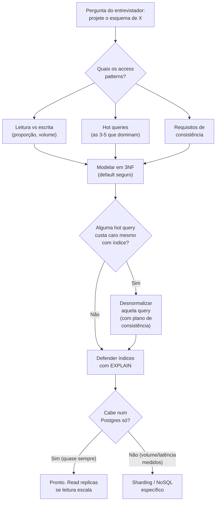
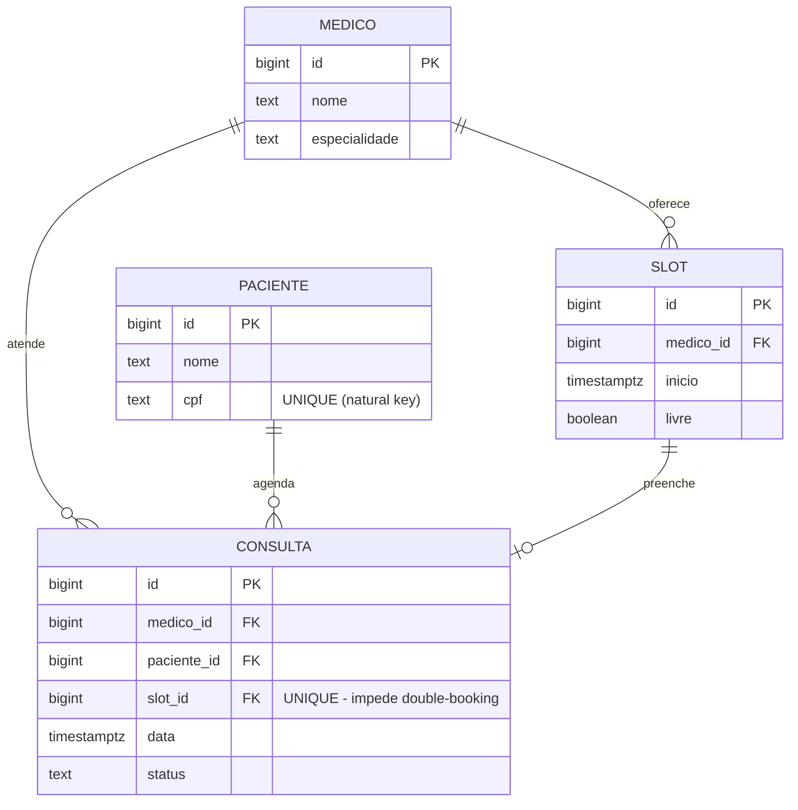
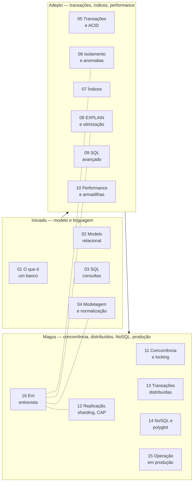

# Banco de dados em entrevista

Esta é a nota de fechamento do galho [[03-Dominios/Ciência/Banco de Dados/index|Banco de Dados]]. As quinze notas anteriores ensinaram o conteúdo; esta ensina a **performar** o conteúdo numa sala de entrevista. São coisas diferentes. Saber o que é um índice composto é uma; saber dizer, sob pressão, em inglês, por que você criaria `(paciente_id, data DESC)` e não `(data, paciente_id)` — defendendo a escolha com `EXPLAIN` — é outra.

A tese central é simples: **numa entrevista de design de dados, ninguém quer ver você desenhar tabelas. Querem ver você raciocinar.** O entrevistador júnior pergunta "como você modela isso?" e espera um diagrama. O entrevistador senior pergunta a mesma coisa e está medindo se você pergunta *de volta* — sobre volume, sobre proporção leitura/escrita, sobre consistência — antes de tocar no quadro branco. Esta nota é o roteiro pra você ser o segundo tipo de candidato.

> [!tip] Resumo em uma linha
> Entrevista de dados não é prova de SQL — é uma demonstração de raciocínio: comece pelos access patterns, modele em 3NF, desnormalize sob query medida, defenda índices com `EXPLAIN`, e saiba a fronteira onde SQL para de ser a resposta.

---

## O roteiro: como atacar um problema de design de dados

A pior coisa que você pode fazer quando ouvir "projete o esquema de X" é começar a desenhar tabelas. Tabelas são a *conclusão* do raciocínio, não o ponto de partida. O ponto de partida são os **access patterns** — como os dados vão ser lidos e escritos.

Por que essa ordem importa tanto? Porque o modelo de dados ideal depende inteiramente de como você o consulta. O mesmo domínio (digamos, "consultas médicas") tem esquemas radicalmente diferentes se a query dominante for "todas as consultas de um paciente no último ano" versus "todas as consultas de hoje, por médico, em tempo real". Modelar sem conhecer os access patterns é como projetar uma estrada sem saber de onde pra onde as pessoas vão.



**Leitura do diagrama:** repare que tudo começa numa *pergunta de volta* (o losango "quais os access patterns?"), não numa ação. O fluxo só desce pra desnormalização ou pra NoSQL quando passa por um losango de evidência — "custa caro mesmo com índice?", "cabe num Postgres só?". Cada bifurcação pra complexidade exige justificativa medida. Esse é o roteiro inteiro: **comece amplo e conservador, e só adicione complexidade quando o problema te forçar.**

O checklist mental que cabe na ponta da língua:

1. **Access patterns primeiro.** "Antes de modelar, deixa eu entender os padrões de acesso." Pergunte proporção leitura/escrita, as hot queries, requisitos de consistência (forte? eventual basta?), volume esperado e taxa de crescimento.
2. **Modele em 3NF.** É o default seguro — elimina redundância, garante integridade. Veja [[04 - Modelagem e normalização]]. Acima de 3NF é academia; abaixo é quase sempre erro.
3. **Chaves e IDs com intenção.** Surrogate key como PK, natural key como `UNIQUE`. ID distribuído? ULID ou UUID v7, nunca UUID v4 (fragmenta B-Tree). Veja [[04 - Modelagem e normalização]].
4. **Índices guiados por evidência.** Para cada hot query, qual índice? Defenda com `EXPLAIN`, respeitando o leftmost prefix. Veja [[07 - Índices]] e [[08 - EXPLAIN e otimização]].
5. **Transações e isolamento onde há invariante.** "Aqui preciso de atomicidade — débito e crédito na mesma transação." Escolha o nível de isolamento conforme a anomalia que precisa evitar. Veja [[05 - Transações e ACID]] e [[06 - Isolamento e anomalias]].
6. **Desnormalize só sob query medida.** Não globalmente — query por query, com um plano de manter o dado redundante consistente (domain event, trigger, batch).
7. **Escala por último, e só se perguntarem.** Read replicas pra escalar leitura; sharding e NoSQL só com dor concreta e medida. Veja [[12 - Replicação, sharding e CAP]] e [[14 - NoSQL e polyglot persistence]].

> [!warning] A armadilha do candidato ansioso
> Desenhar tabelas nos primeiros 30 segundos passa a impressão de que você não pensa em sistemas — só decora schemas. O candidato senior *resiste* à vontade de desenhar e gasta os primeiros minutos entendendo o problema. Silêncio pensando é melhor que tabela errada.

---

## Mini system-design de dados, ponta a ponta

Vamos percorrer um problema real do começo ao fim: **"projete o esquema de um app de agendamento de consultas médicas"**. Esse é o tipo de prompt que cai em entrevista de backend/fullstack. Eu vou narrar como atacaria, ligando cada passo à nota dona do galho.

### Passo 1 — Access patterns (a pergunta de volta)

Antes de qualquer tabela, eu pergunto. Suponha as respostas:

- **Leitura domina escrita** (paciente abre a agenda muitas vezes; agenda uma consulta raramente).
- **Hot queries:** (a) "horários livres de um médico numa data"; (b) "minhas consultas futuras, como paciente"; (c) "agenda do dia de um médico".
- **Consistência forte** no ato de agendar — não pode haver *double-booking* do mesmo horário. Isso é uma invariante dura.
- **Volume:** milhares de médicos, milhões de consultas ao longo do tempo.

Essas respostas já decidem metade do design. "Double-booking proibido" me diz que vou precisar de uma constraint de unicidade e provavelmente de uma transação no momento de agendar. "Leitura domina" me diz que vou indexar pesado pro lado da leitura.

### Passo 2 — Modelagem em 3NF → o ER

Em 3NF, separo as entidades para que nenhum atributo não-chave dependa de outro não-chave. `Medico`, `Paciente`, `Consulta`. O horário disponível pode ser materializado como `Slot` (uma linha por janela agendável) ou calculado — escolho materializar, porque a hot query (a) "horários livres" fica trivial e indexável. Veja [[04 - Modelagem e normalização]] e [[02 - O modelo relacional]] para chaves e integridade referencial.



**Leitura do diagrama:** quatro entidades, três relações 1:N e uma 1:1 opcional (`SLOT` preenche no máximo uma `CONSULTA`). O detalhe load-bearing está no rótulo de `slot_id` em `CONSULTA`: marcá-lo `UNIQUE` faz o **próprio banco** garantir que nenhum slot vire duas consultas. A invariante "sem double-booking" deixa de ser responsabilidade da aplicação e passa a ser uma constraint — exatamente o tipo de decisão que distingue um senior. Note `cpf` como natural key em `UNIQUE`, com `id` surrogate (BIGINT) como PK.

### Passo 3 — Chaves e IDs

`BIGINT` auto-increment como PK serve bem aqui, *desde que* os IDs sejam sempre gerados pelo banco. Se o app fosse distribuído e precisasse gerar IDs antes de persistir (pra publicar eventos), eu trocaria por **ULID** — ordenável por tempo, sem o problema de fragmentação de B-Tree do UUID v4. Como esse exemplo é um monólito, mantenho `BIGINT`. Detalhes em [[04 - Modelagem e normalização]].

### Passo 4 — Índices guiados pelas hot queries

Cada hot query pede um índice. Defendo cada um com `EXPLAIN` — nunca preventivamente. Veja [[07 - Índices]] e [[08 - EXPLAIN e otimização]].

- Hot query (a) "horários livres de um médico numa data": índice **parcial** `(medico_id, inicio) WHERE livre = true`. Parcial porque só me interessam slots livres — o índice fica menor e mais quente.
- Hot query (b) "minhas consultas futuras": índice composto `(paciente_id, data)`, leftmost prefix permitindo filtrar por paciente e por range de data.
- Hot query (c) "agenda do dia de um médico": índice `(medico_id, data)`.

```sql
EXPLAIN ANALYZE
SELECT * FROM slot
WHERE medico_id = 42 AND inicio >= '2026-06-18' AND inicio < '2026-06-19'
  AND livre = true
ORDER BY inicio;
```

Eu rodo isso, confirmo um `Index Scan` (não `Seq Scan`) e olho `rows` vs `actual rows` pra garantir que as estatísticas estão sãs. Se o plano mostrar `Seq Scan` numa tabela grande, o índice está faltando ou não está sendo usado — e aí eu investigo, não chuto.

### Passo 5 — Transações e isolamento no ato de agendar

Agendar é a operação crítica: marcar o slot como ocupado e criar a consulta têm que ser **atômicos**. Ou os dois acontecem, ou nenhum. Veja [[05 - Transações e ACID]].

A invariante "sem double-booking" tem duas linhas de defesa. A primeira é a constraint `UNIQUE (slot_id)` em `CONSULTA` — mesmo sob concorrência, o banco rejeita a segunda inserção. A segunda é a escolha de isolamento e locking. Sob `READ COMMITTED` (default do PostgreSQL), dois pacientes agendando o mesmo slot ao mesmo tempo podem ambos ler `livre = true` — é um **lost update** em potencial. Veja [[06 - Isolamento e anomalias]].

Resolvo com optimistic locking (um campo `version` no slot) ou com `SELECT ... FOR UPDATE` no slot dentro da transação. Como a contenção num slot específico é baixa (poucas pessoas brigam pelo *mesmo* horário), prefiro optimistic — falha rara, retry barato. Veja [[11 - Concorrência e locking]]. A constraint `UNIQUE` continua sendo a rede de segurança final, independente da estratégia de locking.

### Passo 6 — Desnormalização sob query medida

Suponha que apareça uma tela "médicos mais procurados", que faz `SELECT COUNT(*) FROM consulta GROUP BY medico_id` em todo carregamento. Se o `EXPLAIN` mostrar que isso custa caro e a tela é quente, eu desnormalizo: um campo `total_consultas` em `MEDICO`, atualizado por domain event após cada agendamento. Repare: **desnormalizo aquela query, não o esquema inteiro**, e tenho um plano explícito de consistência. Veja [[04 - Modelagem e normalização]] e [[10 - Performance e armadilhas]].

### Passo 7 — Escala (só se perguntarem)

"E se forem 100 milhões de consultas?" Primeiro: **read replicas** pra escalar a leitura, que domina. Veja [[12 - Replicação, sharding e CAP]]. Depois: **particionamento** de `CONSULTA` por range de data — queries por data só varrem uma partição, e o arquivamento de consultas antigas vira um `DROP PARTITION`. Veja [[10 - Performance e armadilhas]]. Sharding e NoSQL? Só com dor medida — e aqui eu seria honesto: *eu não adicionaria* antes de provar que o Poststgres particionado não dá conta. Veja [[14 - NoSQL e polyglot persistence]].

> [!example] O que esse percurso demonstra
> Sete passos, e em nenhum deles eu pulei pra "vamos usar Cassandra porque é escalável". Cada decisão técnica saiu de um access pattern ou de uma medição. Esse é o sinal que o entrevistador procura: **decisões justificadas, não preferências decoradas.**

---

## How to explain in English

O coração da preparação é ter um **monólogo-mestre** ensaiado — não decorado palavra por palavra, mas fluente o bastante pra você navegar sob pressão e em segunda língua. Este é o meu, em primeira pessoa, costurando todo o galho. Refine a redação ao seu gosto, mas mantenha o conteúdo e o tom.

> "Database design is one of the areas where senior experience matters most. I default to PostgreSQL for any new project — it's battle-tested, has excellent indexing, handles transactions with MVCC, and scales well for 99% of what I build. I add other stores only when there's measurable pain: Redis for cache and rate limiting, Elasticsearch if I need real full-text search, and I consider TimescaleDB before adding Cassandra for time series.
>
> When I model a domain, I start in third normal form. I denormalize only when I have a specific hot query that justifies the complexity, and I always have a plan for keeping the redundant data consistent — usually through domain events or triggers. The trade-off is never 'normalized or denormalized' globally; it's query by query.
>
> Indexing is evidence-driven. I don't add indexes preventively — I run `EXPLAIN ANALYZE` on the slow queries and add composite indexes based on actual access patterns, respecting the leftmost prefix rule. I've seen teams add dozens of indexes 'just in case' and then wonder why writes are slow.
>
> For transactions, I lean on the framework — Spring's `@Transactional` — but I know it's implemented as a proxy, which means it doesn't work on private methods or internal calls. I've debugged that exact issue more than once. For concurrency, I use optimistic locking with JPA's `@Version` by default, switching to pessimistic locking only when contention is real.
>
> One hard lesson I learned: long transactions are a trap. A batch job that opens one transaction and processes millions of rows locks resources, inflates the WAL, and loses everything on any exception. I now write batch jobs as small transactions with a progress table — much more robust, and recoverable after failure."

Repare na estrutura desse monólogo — ela é o roteiro disfarçado de fala: (1) **default e quando desviar dele** (Postgres, polyglot só sob dor); (2) **modelagem** (3NF, desnormalizar query por query); (3) **índices guiados por evidência** (`EXPLAIN`, leftmost prefix); (4) **transações via proxy** (a pegadinha do `@Transactional`); (5) **a lição das transações longas**. Cada bloco amarra numa nota: [[14 - NoSQL e polyglot persistence]], [[04 - Modelagem e normalização]], [[08 - EXPLAIN e otimização]], [[05 - Transações e ACID]] (e [[Spring Boot]] para o proxy), [[11 - Concorrência e locking]].

### Frases úteis em entrevista

Frases-âncora em inglês para os momentos de transição. Decore o ritmo delas, não as palavras:

- "Let me start by understanding the access patterns — reads vs writes, hot queries, consistency requirements."
- "I'd model this in third normal form first, then denormalize only if a specific query demands it."
- "Before adding an index, I'd run `EXPLAIN ANALYZE` to confirm the query plan and the actual row counts."
- "For this kind of contention, I'd use optimistic locking with a version column — pessimistic locks are a last resort."
- "I'd avoid UUID v4 as a primary key because it fragments B-Tree indexes — ULID or UUID v7 solve that."
- "This looks like an N+1 problem — we should use a join fetch or projection instead of lazy loading."
- "That's a long-running transaction — I'd break it into smaller chunks with a progress checkpoint."
- "These two need to be atomic — same transaction, or neither happens."
- "ACID consistency and CAP consistency are different things — one's about schema invariants, the other about replica visibility."
- "I wouldn't add another datastore until there's concrete, measured pain — polyglot persistence has real operational cost."
- "Eventual consistency is fine for a like counter, but unacceptable for an account balance."

### Vocabulário PT to EN

O vocabulário técnico do galho inteiro, consolidado. Em entrevista internacional, errar o termo (dizer "lock" quando queria "deadlock", ou hesitar em "leitura fantasma") custa credibilidade barata. Vale memorizar.

| Português | English |
| --- | --- |
| chave primária / estrangeira | primary key / foreign key |
| chave natural / substituta | natural key / surrogate key |
| índice | index |
| índice composto | composite / compound index |
| índice parcial | partial index |
| índice de cobertura | covering index |
| varredura sequencial | sequential scan (seq scan) |
| varredura de índice | index scan |
| plano de execução | query execution plan |
| tabela de junção | join table |
| normalização / desnormalização | normalization / denormalization |
| forma normal | normal form |
| integridade referencial | referential integrity |
| restrição (de unicidade) | (unique) constraint |
| transação | transaction |
| atomicidade / durabilidade | atomicity / durability |
| nível de isolamento | isolation level |
| leitura suja | dirty read |
| leitura não repetível | non-repeatable read |
| leitura fantasma | phantom read |
| atualização perdida | lost update |
| anomalia de escrita enviesada | write skew |
| bloqueio | lock |
| bloqueio otimista / pessimista | optimistic / pessimistic locking |
| contenção de bloqueio | lock contention |
| impasse | deadlock |
| controle de concorrência multiversão | multi-version concurrency control (MVCC) |
| replicação | replication |
| réplica de leitura | read replica |
| fragmentação (de shard) | sharding |
| atraso de replicação | replication lag |
| recuperação automática | failover |
| consistência eventual | eventual consistency |
| log de escrita antecipada | write-ahead log (WAL) |
| particionamento | partitioning |
| fragmentação (de índice) | fragmentation |
| migração (de schema) | (schema) migration |
| migração sem indisponibilidade | zero-downtime migration |
| visão materializada | materialized view |
| consulta lenta | slow query |
| problema N+1 | N+1 problem |
| paginação por cursor | keyset / cursor pagination |
| inserção ou atualização | upsert |

---

## Cheat-sheet do galho

A tabela de bolso. Não para decorar antes da entrevista, mas para revisar e perceber onde sua memória falha — cada linha aponta pra nota que aprofunda.

**ACID** — [[05 - Transações e ACID]]

| Letra | Garantia | Em uma frase |
| --- | --- | --- |
| **A**tomicity | tudo ou nada | nenhum passo fica "meio feito" |
| **C**onsistency | invariantes preservadas | constraints/FKs sempre válidas ao fim |
| **I**solation | transações não veem o intermediário das outras | governado pelo nível de isolamento |
| **D**urability | commit sobrevive a crash | garantido pelo WAL em disco |

**Níveis de isolamento × anomalias** — [[06 - Isolamento e anomalias]]

| Nível | Dirty | Non-repeatable | Phantom | Onde |
| --- | --- | --- | --- | --- |
| READ UNCOMMITTED | sim | sim | sim | raro |
| READ COMMITTED | não | sim | sim | **default PostgreSQL** |
| REPEATABLE READ | não | não | sim (exceto PG) | **default MySQL/InnoDB** |
| SERIALIZABLE | não | não | não | crítico financeiro |

> Pegadinha: REPEATABLE READ no PostgreSQL é snapshot isolation — *não* tem phantom reads. Write skew só some em SERIALIZABLE de verdade.

**Tipos de índice** — [[07 - Índices]]

| Tipo | Para o quê |
| --- | --- |
| B-Tree | equality, range, ordenação — 90% dos casos |
| Hash | só equality |
| GIN | arrays, JSONB, full-text |
| GiST | geoespacial, ranges |
| BRIN | tabelas grandes, ordenadas fisicamente |
| Partial / Expression / Covering | subconjunto / expressão calculada / colunas incluídas |

> Composto `(a, b, c)`: serve `a`, `a,b`, `a,b,c`. Não serve `b` sozinho (leftmost prefix). Mais seletivo primeiro, range por último.

**Outros ponteiros rápidos:**

- **N+1** — uma query vira N por iterar relacionamento lazy. Cura: `JOIN FETCH` / `@EntityGraph` / projeção. Veja [[10 - Performance e armadilhas]].
- **CAP** — partição sempre pode ocorrer, então a escolha real é **CP** (Postgres, MongoDB) ou **AP** (Cassandra, DynamoDB). PACELC: mesmo sem partição, latência vs consistência. Veja [[12 - Replicação, sharding e CAP]].
- **Quando NoSQL** — só com dor medida. Redis (cache/rate-limit), Elasticsearch (full-text, nunca fonte de verdade), Cassandra (escrita massiva, eventual), pgvector/TimescaleDB (fica no Postgres). Veja [[14 - NoSQL e polyglot persistence]].
- **Transações distribuídas** — 2PC bloqueia e é frágil; Saga (compensações); Outbox resolve o dual-write. Veja [[13 - Transações distribuídas]].

---

## O mapa do galho

Antes da entrevista, vale ter o galho inteiro na cabeça como um único mapa — quais notas, em que fase, costurando o quê.



**Leitura do diagrama:** três caixas, uma por fase de aprendizado — Iniciado (o modelo e a linguagem), Adepto (transações, índices, performance), Magus (concorrência, distribuídos, NoSQL, produção). O fluxo sólido é a ordem de estudo. As linhas tracejadas saindo de "16 Em entrevista" mostram que esta nota não é o fim de uma linha: ela **reconverge** sobre as notas de maior peso em entrevista — modelagem, EXPLAIN, isolamento, distribuídos. A capstone puxa o galho inteiro de volta pro foco de entrevista.

---

## Armadilhas consolidadas

As armadilhas do galho inteiro, uma frase cada, linkando a nota dona. Em entrevista, reconhecer a armadilha *antes* de cair nela é o sinal de senioridade — então vale tê-las afiadas.

- **N+1 em ORMs** — iterar relacionamento lazy num loop gera uma query por elemento; use `JOIN FETCH` ou `@EntityGraph`. Veja [[10 - Performance e armadilhas]].
- **Indexar tudo** — cada índice custa escrita, espaço e VACUUM; indexe sob evidência. Veja [[07 - Índices]].
- **Ignorar `EXPLAIN`** — otimizar no achismo é chutar; rode `EXPLAIN ANALYZE` antes. Veja [[08 - EXPLAIN e otimização]].
- **UUID v4 como PK** — chaves aleatórias fragmentam o B-Tree; use UUID v7 ou ULID. Veja [[04 - Modelagem e normalização]].
- **Transações longas** — seguram locks, derrubam concorrência e inflam o WAL; quebre em lotes curtos com checkpoint. Veja [[11 - Concorrência e locking]].
- **`OFFSET` alto pra paginar** — `OFFSET 100000` faz o banco ler 100k linhas; use keyset/cursor pagination. Veja [[09 - SQL avançado]].
- **`SELECT *`** — traz colunas desnecessárias e atrapalha covering indexes. Veja [[10 - Performance e armadilhas]].
- **Confundir consistência ACID com CAP** — uma é invariante de schema, a outra é visibilidade entre réplicas. Veja [[05 - Transações e ACID]] e [[12 - Replicação, sharding e CAP]].
- **Eventual consistency onde precisa de forte** — aceitável pra contador de likes, inaceitável pra saldo bancário. Veja [[12 - Replicação, sharding e CAP]].
- **Migration que trava tabela grande** — `ADD COLUMN NOT NULL` sem default reescreve a tabela; faça nullable → backfill → `SET NOT NULL`. Veja [[15 - Operação em produção]].
- **Dual-write sem Outbox** — escrever no banco e publicar evento em dois passos não é atômico; use o Outbox. Veja [[13 - Transações distribuídas]].
- **Confiar na aplicação pra impedir duplicatas** — sem `UNIQUE` constraint, a concorrência fura sua validação. Veja [[02 - O modelo relacional]].
- **Adicionar banco novo sem dor medida** — polyglot persistence tem custo operacional alto; comece com Postgres. Veja [[14 - NoSQL e polyglot persistence]].

---

## Recursos

A estante de estudo do galho. Os livros são a base; o material online é onde você treina o olho pra planos de execução.

### Livros

- *Designing Data-Intensive Applications* — Martin Kleppmann (o **único** livro que você precisa sobre storage em 2026)
- *Database Internals* — Alex Petrov (como bancos funcionam por dentro)
- *SQL Performance Explained* — Markus Winand (especialista em índices)
- *The Art of PostgreSQL* — Dimitri Fontaine

### Online

- [Use The Index, Luke](https://use-the-index-luke.com/) — guia excelente sobre índices SQL
- [Postgres EXPLAIN Visualizer (PEV2)](https://explain.dalibo.com/) — visualiza planos do PostgreSQL
- [Refactoring SQL](https://www.dbvis.com/thetable/) — artigos práticos
- [Joins visualizer](https://joins.spathon.com/) — visualização de JOINs

### Cursos (pt-BR)

> [!info] Curso de Modelagem de Dados
> [https://www.youtube.com/playlist?list=PLucm8g_ezqNoNHU8tjVeHmRGBFnjDIlxD](https://www.youtube.com/playlist?list=PLucm8g_ezqNoNHU8tjVeHmRGBFnjDIlxD)

> [!info] Álgebra Relacional
> [https://www.youtube.com/playlist?list=PLdoTFRH60cIDTo_-mZvnuwg_uJeMbu6ZP](https://www.youtube.com/playlist?list=PLdoTFRH60cIDTo_-mZvnuwg_uJeMbu6ZP)

### Artigos

> [!info] Não use UUID como PK nas tabelas do seu banco de dados
> [https://gist.github.com/rponte/bf362945a1af948aa04b587f8ff332f8](https://gist.github.com/rponte/bf362945a1af948aa04b587f8ff332f8)

> [!info] UUIDs são ruins? Entenda o que é ULID
> [https://blog.lsantos.dev/o-que-e-ulid/](https://blog.lsantos.dev/o-que-e-ulid/)

---

> [!info] Lastro
> Esta é a nota capstone do galho [[03-Dominios/Ciência/Banco de Dados/index|Banco de Dados]] — sua função é sintetizar, não introduzir conteúdo novo. Todo o material técnico vem das notas 01–15 do galho, que carregam o lastro factual de cada tópico. O monólogo em inglês, as frases de entrevista, o vocabulário e a seção Recursos foram **preservados do monólito original** (`Banco de dados.md`), que está sendo aposentado conforme o galho amadureceu. As experiências em primeira pessoa no monólogo (transações longas, EXPLAIN salvando um endpoint, migração pra ULID, o proxy do `@Transactional`) são do autor e não foram inventadas aqui. Verificação técnica fina (níveis de isolamento, comportamento de MVCC, fragmentação de B-Tree por UUID v4) está nas notas-dona linkadas. Os links de Recursos foram mantidos exatamente como no original — nenhuma referência nova foi adicionada sem verificação.

## Veja também

- [[03-Dominios/Ciência/Banco de Dados/index|Banco de Dados (MOC do galho)]]
- [[System Design]] — replicação/sharding/CAP na escala de arquitetura
- [[Spring Boot]] — JPA, Hibernate, `@Transactional`, `@Version`
- [[04 - Modelagem e normalização]] · [[06 - Isolamento e anomalias]] · [[08 - EXPLAIN e otimização]] · [[12 - Replicação, sharding e CAP]] — as notas de maior peso em entrevista
