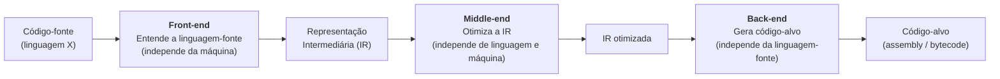
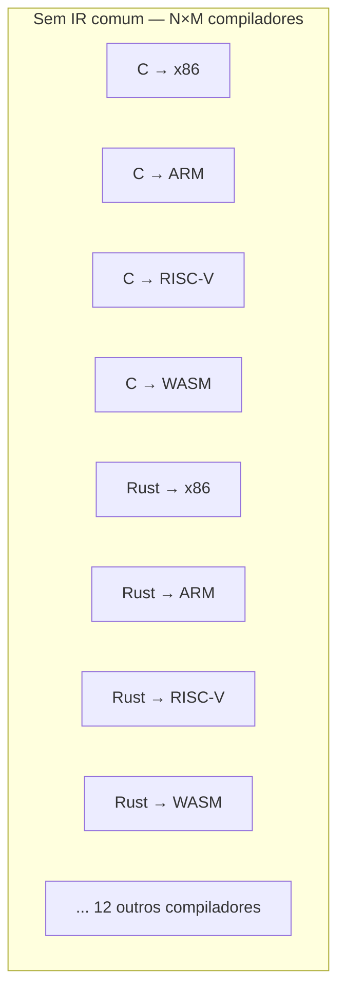
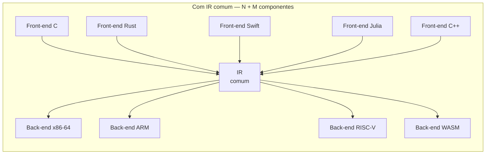
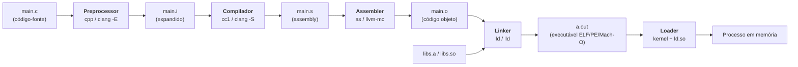
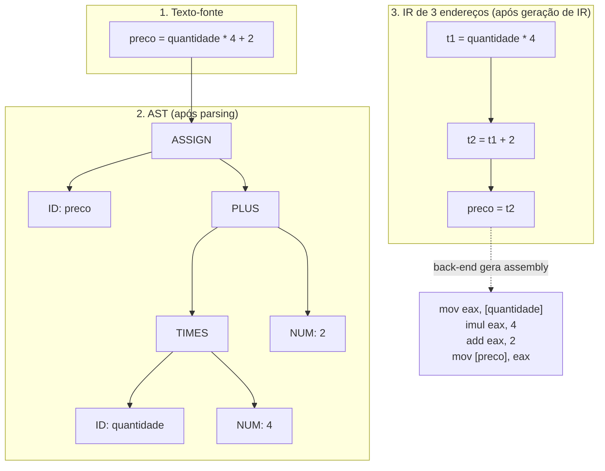

# O que é um compilador e o pipeline de tradução

> [!abstract] TL;DR
> Um compilador é um programa que traduz código-fonte de uma linguagem para outra — geralmente para código de máquina — preservando o significado original. Essa tradução acontece em fases encadeadas: análise léxica, sintática e semântica formam o front-end; geração e otimização de IR formam o middle-end; e a geração de código forma o back-end. Separar frente de verso torna possível reutilizar trabalho: N linguagens × M arquiteturas se reduzem a N + M componentes, o que é exatamente a aposta do GCC e do LLVM.

---

## O compilador como tradutor

Imagine que você escreve uma carta em português e precisa entregá-la a alguém que só lê código binário. Você não reescreve a carta do zero em zeros e uns — você contrata um tradutor experiente que entende os dois lados e garante que o _significado_ chegue intacto do outro lado.

É exatamente isso que um compilador faz.

Formalmente, um compilador é um programa que recebe texto num idioma chamado **linguagem-fonte** (source language) e produz texto equivalente numa **linguagem-alvo** (target language), preservando a semântica do programa original. Quando o alvo é código de máquina ou assembly, falamos do caso mais clássico: `C → x86-64`, `Rust → ARM`, `Java → bytecode da JVM`.

O que caracteriza um compilador — e o distingue de um simples conversor de texto — é a garantia de preservação de significado. Se `preco = quantidade * 4 + 2` calcula 42 quando `quantidade` vale 10, o código gerado pelo compilador deve produzir o mesmo resultado 42, talvez em assembly, talvez em bytecode, mas nunca 41 ou 43.

Note que a linguagem-alvo não precisa ser código de máquina. TypeScript compila para JavaScript — ambos são linguagens de alto nível. Babel transpila JavaScript moderno (ES2022) para JavaScript compatível com navegadores mais antigos. Sass compila para CSS. Em todos esses casos, o princípio é o mesmo: um programa recebe texto numa linguagem, produz texto equivalente em outra, preservando o comportamento.

Quando a linguagem-alvo é uma linguagem de nível comparável à fonte, o compilador costuma ser chamado de **transpilador** (source-to-source compiler), mas a distinção é mais de convenção do que de princípio técnico. O pipeline de fases é essencialmente o mesmo.

> [!tip] Compilador vs. interpretador — a diferença em uma frase
> O compilador traduz o programa inteiro _antes_ de rodar; o interpretador traduz e executa _linha a linha_ em tempo de execução. A nota [[02 - Compilação, interpretação e JIT]] explora essa fronteira em profundidade, incluindo o caso híbrido do JIT (Just-In-Time). Aqui basta saber que a distinção importa para latência de startup, performance de pico e portabilidade.

---

## A grande divisão: front-end, middle-end e back-end

Antes de mergulhar nas fases individuais, é útil enxergar o compilador como três regiões com responsabilidades distintas.



> [!info] Leitura do diagrama
> O código-fonte entra pela esquerda e percorre três regiões antes de virar código-alvo. O front-end lida com a linguagem de entrada; o back-end lida com a arquitetura de saída. O middle-end fica no meio justamente porque não depende de nenhum dos dois extremos — é território de otimizações portáteis.

A terminologia clássica do *Livro do Dragão* (Aho, Lam, Sethi, Ullman) chama as primeiras fases de **análise** e as últimas de **síntese**. Análise desmonta o código-fonte em partes e extrai estrutura; síntese monta o código-alvo a partir dessa estrutura.

- **Análise (front-end):** entende "o que o programador disse" — independe da máquina-alvo.
- **Síntese (back-end):** decide "como dizer isso em assembly" — independe da linguagem-fonte.

Pense na análise como **compreensão** e na síntese como **expressão**. Primeiro você entende completamente o que o código-fonte quer dizer — e só então você decide como expressar isso na linguagem-alvo. Tentar fazer as duas coisas ao mesmo tempo (como em single-pass) restringe o espaço de otimizações disponíveis, porque você ainda não viu o programa inteiro quando já precisa gerar código.

Esse corte não é apenas conceitual. O GCC tem front-ends separados para C, C++, Fortran, Ada e Go, todos convergindo para a mesma IR (GIMPLE/RTL). O LLVM vai além: Clang (C/C++/Objective-C), Rust, Swift e Julia são front-ends independentes que emitem a mesma LLVM IR, e dezenas de back-ends a consomem para x86-64, ARM, RISC-V, WebAssembly e outros alvos.

O conceito de IR também não está restrito a compiladores tradicionais. A JVM é essencialmente uma IR padronizada: Java, Kotlin, Scala, Clojure, Groovy e Jython são front-ends que emitem bytecode JVM. O back-end é o JIT da JVM (HotSpot, GraalVM), que compila bytecode para código nativo em tempo de execução. O modelo é o mesmo — só o timing da síntese muda.

---

## As fases do pipeline — com exemplo contínuo

Vamos acompanhar a expressão `preco = quantidade * 4 + 2` atravessando cada fase. Cada fase recebe uma representação e entrega outra, mais estruturada ou mais próxima do alvo.

```mermaid
flowchart LR
    A["<b>Código-fonte</b>\npreco = quantidade * 4 + 2"]
    B["<b>Análise léxica</b>\nlexer / scanner"]
    C["<b>Tokens</b>\nID ASSIGN ID TIMES NUM PLUS NUM"]
    D["<b>Análise sintática</b>\nparser"]
    E["<b>AST</b>\nárvore sintática abstrata"]
    F["<b>Análise semântica</b>\ntype checker"]
    G["<b>AST anotada</b>\ncom tipos e escopo"]
    H["<b>Geração de IR</b>"]
    I["<b>IR / código de 3 endereços</b>"]
    J["<b>Otimização</b>\nconstant folding, DCE..."]
    K["<b>IR otimizada</b>"]
    L["<b>Geração de código</b>\nseleção + alocação de registradores"]
    M["<b>Assembly</b>\nx86-64 / ARM..."]

    A --> B --> C --> D --> E --> F --> G --> H --> I --> J --> K --> L --> M
```



> [!info] Leitura do diagrama
> Cada caixa com fundo é uma representação do programa; cada caixa em negrito é uma fase de transformação. A representação muda de forma a cada fase — de texto puro para tokens, de tokens para árvore, de árvore para IR linear, de IR para assembly. O significado do programa permanece o mesmo ao longo de toda a cadeia.

### Fase 1 — Análise léxica (lexer / scanner)

O **lexer** (ou scanner) lê o texto caractere a caractere e agrupa sequências em **tokens** — as unidades mínimas com significado.

Para `preco = quantidade * 4 + 2`, os tokens são:

| Token | Tipo |
|-------|------|
| `preco` | ID (identificador) |
| `=` | ASSIGN |
| `quantidade` | ID |
| `*` | TIMES |
| `4` | NUM |
| `+` | PLUS |
| `2` | NUM |

Espaços em branco e comentários são descartados aqui — eles não carregam significado semântico e não entram na saída do lexer. O lexer implementa autômatos finitos determinísticos (DFAs) derivados de expressões regulares — a teoria por trás está em [[03-Dominios/Ciência/Teoria da Computação/index|Teoria da Computação]]. Na prática, o lexer é implementado como um grande switch/case ou uma tabela de transição de estados gerada por ferramentas como `flex` (GNU) ou `ANTLR`. A nota [[03 - Análise léxica - do texto a tokens]] entra a fundo nessa fase.

### Fase 2 — Análise sintática (parsing)

O **parser** recebe os tokens e constrói uma **Árvore Sintática Abstrata** (AST — Abstract Syntax Tree), verificando se a sequência de tokens obedece à gramática da linguagem.

Para nossa expressão, a AST ficaria assim (simplificado):

```
ASSIGN
├── ID: preco
└── PLUS
    ├── TIMES
    │   ├── ID: quantidade
    │   └── NUM: 4
    └── NUM: 2
```

A AST captura a estrutura hierárquica e a precedência de operadores — `*` aparece mais fundo que `+`, refletindo que a multiplicação vincula mais forte. O parser usa gramáticas livres de contexto (CFGs), que é território de [[04 - Gramáticas e a árvore sintática]].

> [!warning] Parse error vs. erro semântico
> O parser detecta erros de _forma_ — parênteses sem par, ponto-e-vírgula faltando. Mas `quantidade * "texto"` passa pelo parser sem reclamação: a árvore é sintaticamente válida. Quem detecta esse problema é a próxima fase.

### Fase 3 — Análise semântica

O **analisador semântico** percorre a AST e verifica _significado_: os tipos batem? As variáveis foram declaradas antes de usar? Uma função chamada com os argumentos corretos?

Em linguagens estaticamente tipadas (Java, C, Rust), é aqui que `quantidade` é verificado como `int` e `4` como literal inteiro, confirmando que `quantidade * 4` é `int * int → int`. A AST sai desta fase anotada com informações de tipo — a chamada **AST decorada** (decorated AST) ou **AST anotada**.

A análise semântica também constrói e consulta a **tabela de símbolos** (symbol table) — uma estrutura de dados que mapeia nomes para seus atributos (tipo, escopo, endereço de memória). Quando o compilador encontra `preco` no lado esquerdo da atribuição, ele pesquisa na tabela de símbolos: essa variável existe? Está em escopo? Qual é seu tipo? Se `preco` não foi declarada antes, é aqui — não no lexer, não no parser — que o erro é reportado.

> [!example] O que a análise semântica detecta que o parser não detecta
> Em C, `int x = "hello"` é sintaticamente perfeito — a gramática de C permite qualquer expressão no lado direito de uma atribuição. Mas semanticamente é inválido: você não pode atribuir um `char*` a um `int`. O parser constrói a AST sem reclamar; o analisador semântico consulta a tabela de tipos e emite o erro. Esse é o papel fundamental da fase semântica: capturar incoerências de significado que escapam da gramática.

### Fase 4 — Geração de IR

A **IR** (Intermediate Representation) é a lingua franca interna do compilador — o idioma neutral que tanto o front-end quanto o back-end entendem. O LLVM usa uma IR em forma SSA (Static Single Assignment), onde cada variável é atribuída exatamente uma vez e cada uso de uma variável refere-se explicitamente a uma definição única. O código de 3 endereços — uma forma simples e popular de IR — ficaria assim para nossa expressão:

```
t1 = quantidade * 4
t2 = t1 + 2
preco = t2
```

Cada instrução tem no máximo um operador e três operandos — daí "código de 3 endereços". Note que introduzimos temporárias (`t1`, `t2`) que não existem no código-fonte original: são variáveis implícitas do compilador para representar resultados intermediários de expressões compostas. A nota [[11 - Representação intermediária e SSA]] explora IRs e a forma SSA em detalhe.

### Fase 5 — Otimização

O **otimizador** transforma a IR em versão semanticamente equivalente, mas mais eficiente. As otimizações formam um espectro de complexidade:

**Otimizações locais** — aplicadas a blocos básicos individuais (sequências sem desvios):
- **Constant folding:** `4 + 2` é uma constante — pode virar `6` em tempo de compilação, eliminando a operação `PLUS` do runtime.
- **Constant propagation:** se `x = 5` e depois `y = x + 3`, o compilador substitui por `y = 8`.
- **Strength reduction:** troca operações caras por equivalentes mais baratas — `x * 4` vira `x << 2` (shift).

**Otimizações globais** — exigem análise de fluxo entre blocos:
- **Dead code elimination (DCE):** remove código que nunca é alcançado.
- **Common subexpression elimination:** se `a * b` aparece duas vezes, calcule uma vez e reuse.
- **Loop invariant code motion:** move cálculos que não mudam a cada iteração para fora do loop.

**Otimizações interprocessuais** — exigem ver múltiplas funções ao mesmo tempo:
- **Inlining:** substitui uma chamada de função pelo corpo da função, eliminando overhead de chamada.
- **Devirtualização:** remove o despacho dinâmico quando o compilador pode provar qual método será chamado.

Após constant folding na nossa expressão:

```
t1 = quantidade * 4
preco = t1 + 2
```

O compilador não pode absorver mais ainda, porque `quantidade` é variável de runtime — não conhecida em tempo de compilação. Mas se o compilador provar que `quantidade` é sempre `10`, constant propagation faria `preco = 42` direto — eliminando toda computação.

> [!tip] A otimização não muda o resultado — apenas o custo
> Um otimizador _correto_ nunca transforma um programa correto num programa com resultado diferente. Ele pode reordenar instruções, eliminar cálculos redundantes, alocar variáveis em registradores — mas o valor final de `preco` deve ser o mesmo. Otimizadores bugados são assustadores exatamente porque produzem código que compila sem erros, roda sem crashes, mas produz resultados sutilmente errados.

### Fase 6 — Geração de código

O **gerador de código** traduz a IR para instruções da arquitetura-alvo — assembly x86-64, ARM Thumb, RISC-V RV64GC, ou bytecode da JVM. Dois subproblemas dominam esta fase:

1. **Seleção de instruções:** qual instrução da ISA (Instruction Set Architecture) representa melhor cada operação da IR? Uma multiplicação pode mapear para `imul`, para um shift se o multiplicador for potência de 2, ou para uma sequência de shifts e somas se o multiplicador for constante mas não potência de 2. A escolha impacta diretamente a performance do código gerado.
2. **Alocação de registradores:** a IR tem variáveis ilimitadas; a CPU tem registradores limitados (x86-64 tem 16 registradores de propósito geral). Quais variáveis vivem em registradores e quais vão para a pilha? O problema é equivalente a coloração de grafo — tecnicamente NP-completo, mas com heurísticas práticas muito eficientes como a alocação linear-scan usada na JVM.

Em x86-64 simplificado, nossa IR poderia virar:

```asm
mov eax, [quantidade]   ; carrega quantidade em eax
imul eax, 4             ; eax = quantidade * 4
add eax, 2              ; eax = t1 + 2
mov [preco], eax        ; armazena em preco
```

Um compilador mais agressivo notaria que `4` é potência de 2 e substituiria `imul eax, 4` por `shl eax, 2` (shift left de 2 bits) — shifts são tipicamente mais baratos que multiplicações em muitas microarquiteturas.

O front-end não sabe nada sobre registradores. O back-end não sabe nada sobre a linguagem de origem. A IR é o contrato entre os dois — e isso tem consequências práticas enormes. A separação torna possível que um especialista em front-end de Rust e um especialista em back-end de ARM trabalhem em paralelo, sem interferir um no outro, desde que concordem com o formato da IR.

---

## O argumento N×M → N+M: por que a IR importa tanto

Suponha que você queira suportar **N = 5 linguagens** (C, C++, Rust, Swift, Julia) em **M = 4 arquiteturas** (x86-64, ARM, RISC-V, WebAssembly). Sem uma IR comum, você precisaria de N×M = 20 compiladores, cada um do zero.





> [!info] Leitura do diagrama
> Sem IR, cada par (linguagem, arquitetura) exige um compilador completo — N×M no total. Com uma IR comum, cada linguagem precisa só de um front-end e cada arquitetura só de um back-end: N + M componentes. Para N=5 e M=4, isso é 20 versus 9 — e a diferença cresce quadraticamente conforme N e M aumentam.

> [!success] O LLVM é a prova viva desse argumento
> O LLVM IR é usado por Clang (C/C++), Rust (rustc), Swift, Kotlin/Native, Julia, Zig, e muitos outros. Os back-ends do LLVM produzem código para x86-64, ARM, AArch64, RISC-V, MIPS, WASM e mais. Cada nova linguagem que adota o LLVM ganha todos esses alvos de graça. Cada nova arquitetura suportada pelo LLVM fica disponível para todas as linguagens de graça.

Essa modularidade tem outro benefício que não aparece no argumento N×M: **testabilidade**. Você pode testar o front-end C contra qualquer IR gerada, sem precisar de uma arquitetura real. Você pode testar o back-end ARM com IR sintetizada, sem precisar de um compilador de linguagem. As fases são unidades independentes com contratos claros.

E tem o benefício da **otimização compartilhada**: qualquer melhoria no middle-end do LLVM — uma nova técnica de vetorização automática, uma análise de alias mais precisa, uma otimização de loop — beneficia imediatamente todas as linguagens que emitem LLVM IR. Quando o LLVM melhorou seu otimizador de loops em 2023, Rust, C++, Swift e Julia ficaram mais rápidos ao mesmo tempo, de graça, sem nenhuma mudança nos seus respectivos front-ends.

O argumento N×M não é apenas sobre quantidade de compiladores — é sobre onde colocar o esforço de engenharia. Concentrar otimizações no middle-end, acessível a todas as linguagens, amplifica o retorno de cada melhoria implementada.

---

## O pipeline completo de build: do .c ao executável

O compilador é o coração do processo, mas não é o único ator. Para um programa `main.c` chegar a um executável que o sistema operacional pode rodar, mais peças entram em cena.

Quando você digita `gcc main.c -o programa`, o GCC orquestra silenciosamente quatro ferramentas distintas em sequência: preprocessador, compilador propriamente dito (cc1), assembler (as) e linker (ld). O que parece um único comando é na verdade um pipeline de quatro estágios. A flag `-v` do GCC expõe todos os subcomandos executados — uma forma excelente de ver o pipeline por dentro.



> [!info] Leitura do diagrama
> O fluxo vai da esquerda para a direita, do texto-fonte ao processo em execução. O compilador ocupa o centro (`.i → .s`), mas antes dele age o preprocessador, depois o assembler, o linker e por fim o loader do SO. Cada ferramenta tem escopo bem delimitado.

Cada componente tem um papel preciso — e é importante entender que eles são ferramentas separadas, não fases internas do compilador. Você pode substituir um sem trocar os outros: o projeto musl usa o mesmo compilador clang mas um linker diferente; o Android NDK usa o clang com um linker lld em vez do ld clássico.

- **Preprocessador (cpp):** expande `#include`, `#define` e diretivas condicionais. Opera puramente em nível de texto, sem entender a gramática de C.
- **Compilador:** traduz `.i` (C pré-processado) para `.s` (assembly). É aqui que vivem as 6 fases descritas acima.
- **Assembler (as / llvm-mc):** traduz assembly textual para **código objeto** (`.o`) — bytes binários com instruções de máquina, mas com referências externas ainda não resolvidas.
- **Linker (ld / lld):** combina múltiplos `.o` e bibliotecas (`.a`, `.so`), resolve referências cruzadas (sabe que `printf` está em `libc.so`) e produz o executável final. A nota [[19 - Linking e loading]] cobre esse processo em detalhe.
- **Loader:** não é uma ferramenta separada que você invoca — é parte do kernel (e do dynamic linker, `ld.so`). Quando você executa `./a.out`, o loader mapeia segmentos do ELF na memória virtual, carrega bibliotecas dinâmicas e transfere controle para `_start`.

> [!example] Compilando em partes com clang
> ```bash
> clang -E main.c -o main.i      # só preprocessador
> clang -S main.i -o main.s      # só compilador (→ assembly)
> clang -c main.s -o main.o      # só assembler (→ objeto)
> clang main.o -o a.out          # só linker
> ```
> Cada flag para no passo correspondente. Isso é útil para inspecionar a IR (`-emit-llvm`) ou o assembly intermediário.

---

## Single-pass vs. multi-pass e AOT vs. JIT

Compiladores **single-pass** processam o código uma vez da esquerda para a direita, produzindo código enquanto fazem a análise — os primeiros compiladores de FORTRAN e Pascal funcionavam assim. São mais rápidos em tempo de compilação, mas têm acesso limitado a informações globais, o que restringe as otimizações possíveis. Pascal foi projetado intencionalmente para ser compilável em single-pass: toda variável deve ser declarada antes de ser usada, toda função declarada antes de ser chamada. Isso não foi um acidente — foi uma escolha de design da linguagem para tornar o compilador mais simples.

Compiladores **multi-pass** percorrem a representação do programa múltiplas vezes: uma passagem para construir a AST, outra para análise semântica, outras para otimizações progressivas. O GCC e o LLVM são multi-pass; cada fase opera sobre uma representação bem definida produzida pela anterior. A separação em IR facilita muito o multi-pass: você pode aplicar quantas otimizações quiser sobre a IR antes de gerar código. C permite declarar uma função após seu uso se uma declaração (protótipo) aparecer antes — isso já exige pelo menos dois passes (ou uma tabela de símbolos com forward declarations).

> [!tip] Por que multi-pass permite melhores otimizações
> Otimizações como inlining interprocessual precisam ver o corpo de todas as funções ao mesmo tempo — impossível em single-pass. Análise de escape (determinar se um objeto pode "escapar" de uma função) também requer visão global do programa. Com multi-pass e uma IR, o otimizador pode fazer quantas iterações forem necessárias sobre o programa inteiro antes de gerar código.

A compilação **AOT** (Ahead-Of-Time) é o modo clássico: você compila antes de rodar, o executável existe em disco, o runtime não inclui um compilador. C, C++, Rust e Go compilam AOT. O contraponto — JIT (Just-In-Time) — é discutido em [[02 - Compilação, interpretação e JIT]].

---

## O mesmo código em três representações

Para tornar tangível como a representação muda a cada fase, veja `preco = quantidade * 4 + 2` em três momentos distintos do pipeline:



> [!info] Leitura do diagrama
> O texto-fonte é uma sequência linear de caracteres; a AST é uma estrutura em árvore que exprime hierarquia e precedência; a IR é uma sequência de instruções simples com temporárias explícitas. Cada representação serve ao propósito de sua fase: a AST facilita análise semântica e verificação de tipos, a IR facilita otimização e geração de código.

---

## O compilador como coletor de informação — a tabela de símbolos

É tentador pensar no compilador como uma sequência linear de transformações, onde cada fase passa o resultado adiante e não olha para trás. Mas há uma estrutura de dados que atravessa todas as fases do front-end: a **tabela de símbolos** (symbol table).

A tabela de símbolos é um dicionário que o compilador mantém sobre os nomes que o programador usou. Quando o lexer encontra `quantidade`, ele emite um token `ID`. Quando o analisador semântico encontra `quantidade * 4`, ele consulta a tabela para saber: essa variável existe no escopo atual? Qual é seu tipo? Está inicializada?

Em linguagens com escopos aninhados (funções dentro de funções, blocos dentro de blocos), a tabela de símbolos precisa suportar busca por escopo: primeiro procura no escopo local, depois no envoltório, depois no global. A implementação clássica usa uma pilha de tabelas de hash (uma por escopo).

```
Tabela de símbolos durante a compilação de: preco = quantidade * 4 + 2
┌─────────────┬──────┬────────┬──────────┐
│ Nome        │ Tipo │ Escopo │ Offset   │
├─────────────┼──────┼────────┼──────────┤
│ quantidade  │ int  │ local  │ [rbp-4]  │
│ preco       │ int  │ local  │ [rbp-8]  │
└─────────────┴──────┴────────┴──────────┘
```

Essa mesma tabela alimenta o gerador de código: quando o back-end precisa emitir `mov eax, [quantidade]`, ele precisa saber o endereço de `quantidade` — que está na tabela de símbolos, já calculado durante a análise semântica.

---

## Erros de compilação vs. erros de runtime

Um **erro de compilação** é detectado pelo compilador antes mesmo de o programa rodar: sintaxe inválida (parser), tipo errado (análise semântica), variável indefinida. O programa sequer chega ao estado de executável.

Qual fase detecta cada tipo de erro?

| Erro | Fase que detecta |
|------|-----------------|
| `preco =` (expressão incompleta) | Análise sintática (parser) |
| `if preco = 10` (uso de `=` em vez de `==`) | Análise semântica (em C, legal; em Java/Pascal, erro semântico) |
| `quantidade` usada sem declarar | Análise semântica (tabela de símbolos) |
| `"texto" * 4` | Análise semântica (verificação de tipos) |
| Divisão por zero com valor constante | Análise semântica ou otimizador (algumas ferramentas detectam) |

Um **erro de runtime** acontece enquanto o programa executa: divisão por zero com valor variável, acesso a ponteiro nulo, índice fora do limite de um array. O compilador não pôde detectá-lo porque dependia de valores só conhecidos durante a execução — como o valor de `quantidade` digitado pelo usuário.

> [!danger] Quanto mais o compilador detecta, melhor
> Rust é famoso por detectar em tempo de compilação classes de erro (como data races e use-after-free) que em C/C++ só aparecem em runtime — muitas vezes em produção. Sistemas de tipos mais expressivos e análises estáticas mais sofisticadas empurram mais erros para o momento de compilação, onde o custo de correção é ordens de magnitude menor. O custo de um bug detectado em compilação é zero em produção; o custo de um crash em produção pode ser catastrófico.

O back-end lida com [[03-Dominios/Ciência/Organização de Computadores/index|Organização de Computadores]] diretamente — registradores, pipeline de instruções, hierarquia de cache, alinhamento de memória. A qualidade do código gerado depende de quanto o back-end "entende" a máquina-alvo. Um back-end que conhece a latência de cada instrução da CPU-alvo pode reordenar operações para manter o pipeline de execução sempre cheio, extraindo performance que o programador não precisou escrever explicitamente.

---

## Conexões

- Esta é a nota-âncora do galho **Compiladores e Linguagens** (fase Iniciado); este galho mapeia o pipeline completo de compilação do código-fonte ao executável
- Próxima nota: [[02 - Compilação, interpretação e JIT]] — aprofunda a fronteira compilador/interpretador e o caso híbrido JIT
- Fases em detalhe: [[03 - Análise léxica - do texto a tokens]] (DFAs e tokens), [[04 - Gramáticas e a árvore sintática]] (CFGs, parsing, AST)
- A IR por dentro: [[11 - Representação intermediária e SSA]] — forma SSA, blocos básicos, CFGs de IR
- O que acontece depois do `.o`: [[19 - Linking e loading]] — resolução de símbolos, relocações, ELF, loader
- A teoria que o front-end aplica: [[03-Dominios/Ciência/Teoria da Computação/index|Teoria da Computação]] — autômatos finitos para o lexer, gramáticas livres de contexto para o parser
- O alvo que o back-end precisa conhecer: [[03-Dominios/Ciência/Organização de Computadores/index|Organização de Computadores]] — ISA, registradores, pipeline, hierarquia de cache

---

> [!summary] Resumo em uma linha
> Um compilador é um tradutor em fases — análise (front-end) desmonta a linguagem-fonte numa IR, otimização a melhora, e síntese (back-end) a converte em código-alvo — e separar frente de verso em torno de uma IR comum reduz N×M compiladores a N+M componentes reutilizáveis.

---

## Em entrevista

Compiladores aparecem em entrevistas de sistemas, linguagens e infraestrutura — especialmente em empresas que desenvolvem runtimes, toolchains, DSLs internas ou VMs (Google, Meta, Apple, JetBrains, Stripe). Mas mesmo em entrevistas de backend puro, saber a diferença entre erro de compilação e runtime, ou explicar por que Rust é mais seguro que C em tempo de compilação, demonstra profundidade que poucos candidatos têm. O vocabulário certo sinaliza familiaridade com fundamentos.

*"A compiler is a program that translates source code from one language to another while preserving the original program's semantics — typically from a high-level language down to machine code or bytecode."*

*"The classic compiler pipeline has six phases: lexical analysis, parsing, semantic analysis, IR generation, optimization, and code generation."*

*"The front-end is language-specific and machine-independent; the back-end is language-independent and machine-specific; the middle-end optimizes the intermediate representation, which is both language- and machine-independent."*

*"The N×M argument for IRs: without a shared intermediate representation, supporting N source languages and M target architectures requires N×M compilers; with a common IR like LLVM IR, you only need N front-ends plus M back-ends."*

*"The LLVM project is the canonical modern example — Clang, Rust's rustc, Swift, and Julia all emit LLVM IR, and the LLVM backend produces code for x86-64, ARM, RISC-V, WebAssembly, and many others."*

*"A compile-time error is caught by the compiler before the program runs; a runtime error manifests during execution, typically because it depends on values unknown at compile time."*

*"The full build pipeline is: preprocessor → compiler → assembler → linker → loader. The compiler is the central step but not the only one — the linker resolves cross-module references and the loader maps the executable into virtual memory."*

*"Analysis (front-end) and synthesis (back-end) is the classical Dragon Book terminology: analysis breaks the source apart to understand it, synthesis builds the target from the extracted structure."*

*"Register allocation is essentially a graph coloring problem — technically NP-complete, but with practical heuristics like linear-scan that work well enough for production compilers."*

*"A transpiler (source-to-source compiler) applies the same pipeline but targets a high-level language — TypeScript to JavaScript, Sass to CSS, Babel for ES-next to ES5. The distinction is one of convention, not principle."*

### Vocabulário PT → EN

Esses termos aparecem frequentemente em discussões técnicas em inglês sobre compiladores. Conhecê-los em ambos os idiomas evita o gelo em conversas sobre toolchains, análise estática e design de linguagens.

| Português | English |
|-----------|---------|
| compilador | compiler |
| linguagem-fonte | source language |
| linguagem-alvo | target language |
| análise léxica | lexical analysis |
| token | token |
| análise sintática | parsing / syntactic analysis |
| árvore sintática abstrata | abstract syntax tree (AST) |
| análise semântica | semantic analysis |
| tabela de símbolos | symbol table |
| representação intermediária | intermediate representation (IR) |
| otimização | optimization |
| geração de código | code generation |
| front-end | front-end |
| middle-end | middle-end |
| back-end | back-end |
| análise | analysis |
| síntese | synthesis |
| assembler | assembler |
| linker | linker |
| loader | loader |
| compilação antecipada | ahead-of-time compilation (AOT) |
| compilador de fonte a fonte | transpiler / source-to-source compiler |
| alocação de registradores | register allocation |
| seleção de instruções | instruction selection |
| otimização local | local optimization |
| otimização global | global optimization |

---

> [!warning] Fronteiras do galho
> Esta nota cobre o pipeline de compilação em visão geral. Interpretação e JIT ficam na [[02 - Compilação, interpretação e JIT]]; análise léxica com DFAs em [[03 - Análise léxica - do texto a tokens]]; gramáticas e parsing em [[04 - Gramáticas e a árvore sintática]]; linking e loading em [[19 - Linking e loading]]. Evite detalhar essas fases aqui além do necessário para contextualizar o pipeline — o aprofundamento vive em cada nota dedicada.

> [!info] Lastro
> 1. Alfred V. Aho, Monica S. Lam, Ravi Sethi, Jeffrey D. Ullman — *Compilers: Principles, Techniques, and Tools* (2ª ed., Pearson/Addison-Wesley, 2006). ISBN 978-0-321-48681-3. O "Livro do Dragão Roxo" — referência canônica de compiladores; define as fases, a terminologia análise/síntese e a estrutura front/back-end. Disponível em: https://suif.stanford.edu/dragonbook/
> 2. Keith D. Cooper, Linda Torczon — *Engineering a Compiler* (3ª ed., Elsevier/Morgan Kaufmann, 2022). ISBN 978-0-12-815412-0. Vencedor do TAA Textbook Excellence Award 2024; cobertura moderna de front-end e otimizações. Disponível em: https://shop.elsevier.com/books/engineering-a-compiler/cooper/978-0-12-815412-0
> 3. Robert Nystrom — *Crafting Interpreters* (Genever Benning, 2021). ISBN 978-0-9905829-3-9. Texto completo gratuito online; implementa lexer, parser, análise semântica e geração de código passo a passo. Disponível em: https://craftinginterpreters.com/
> 4. Andrew W. Appel — *Modern Compiler Implementation in ML / Java / C* (Cambridge University Press, 1998). Abordagem pragmática ao pipeline de compilação com implementações reais. Disponível em: https://www.cs.princeton.edu/~appel/modern/
> 5. LLVM Project — *LLVM Language Reference Manual* (documentação oficial, llvm.org). Especificação completa da LLVM IR em forma SSA; descreve front-ends, middle-end (opt) e back-ends (llc). Disponível em: https://llvm.org/docs/LangRef.html
> 6. LLVM Project — *Writing an LLVM Backend* (documentação oficial). Detalha como implementar um back-end para nova arquitetura sobre a IR comum do LLVM. Disponível em: https://llvm.org/docs/WritingAnLLVMBackend.html
