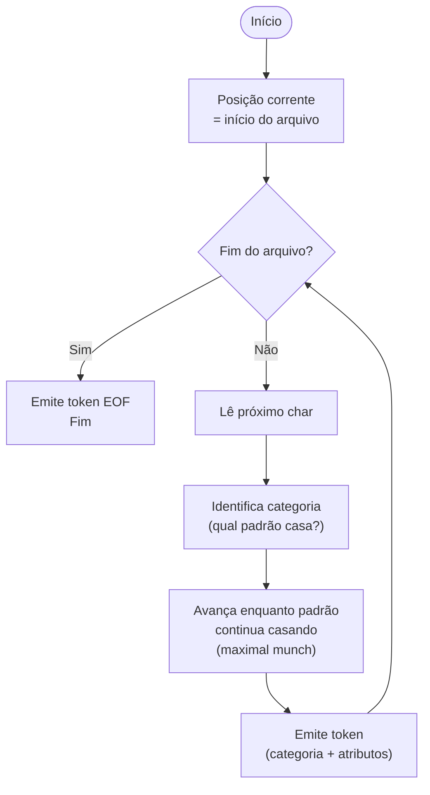
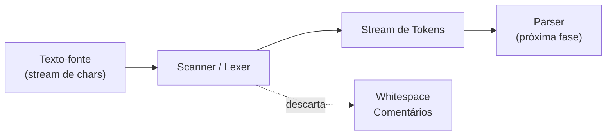
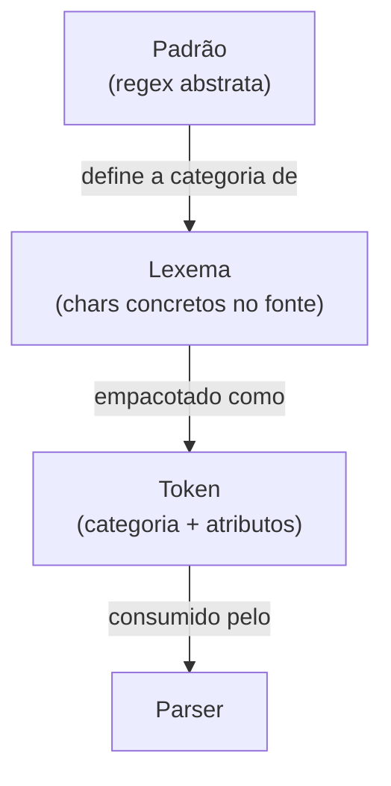
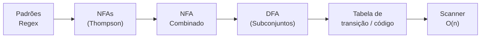
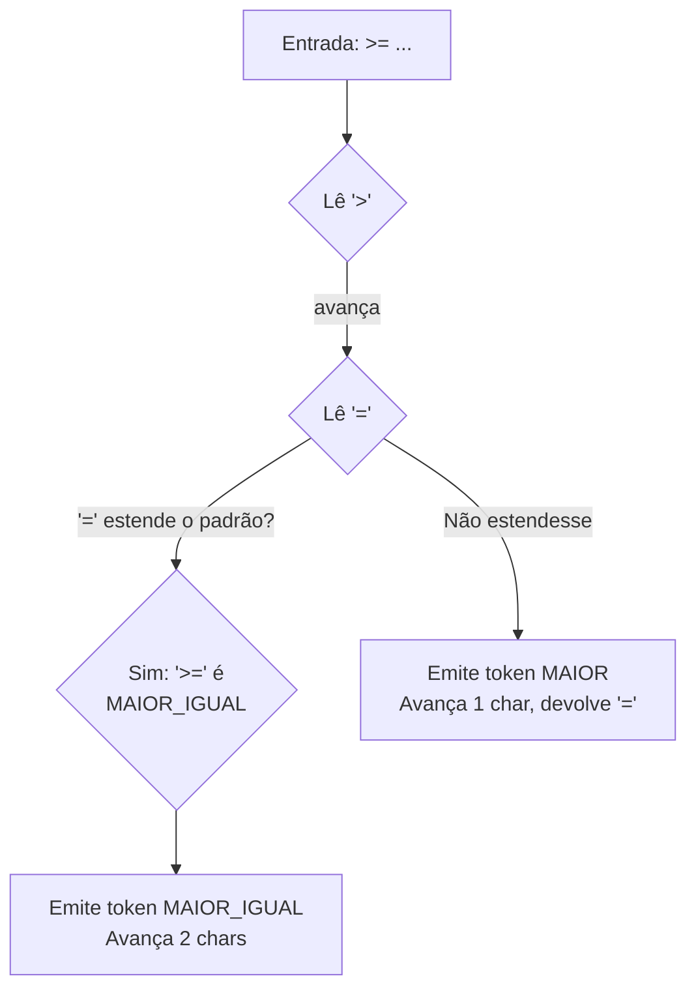
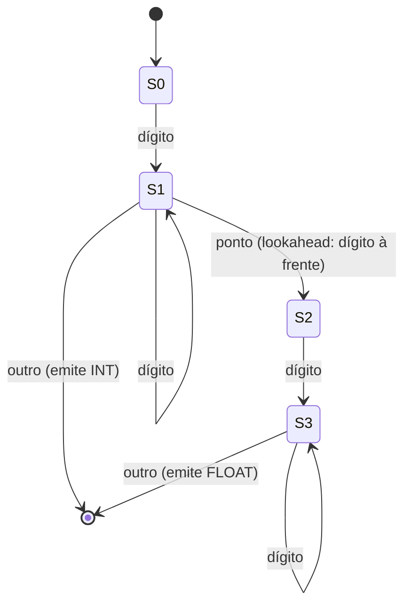
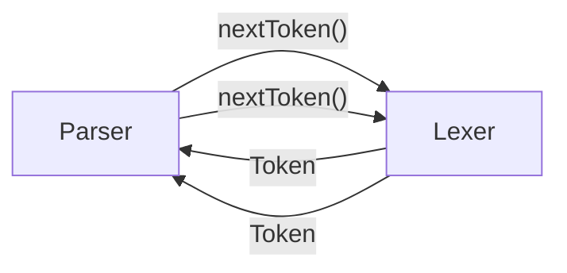

# Análise léxica - do texto a tokens

> [!abstract] TL;DR
> A análise léxica é a primeira fase do compilador: um scanner lê o texto-fonte caractere a caractere e o converte numa stream de tokens, descartando ruído (espaços, comentários). Três conceitos regem essa fase — padrão, lexema e token —, e a regra do maximal munch garante que a correspondência seja sempre a mais longa possível. O resultado é eficiente por construção: O(n) no tamanho da entrada, uma única passada.

---

## O scanner: a fronteira do sentido

Pense no código-fonte como uma longa fita de caracteres. Para o computador, `int x = 42;` não passa de uma sequência de bytes — `i`, `n`, `t`, espaço, `x`, espaço, `=`, espaço, `4`, `2`, `;`. Não há semântica, não há estrutura. É como olhar para uma frase em idioma desconhecido: você enxerga os símbolos, mas não enxerga as palavras.

O scanner — também chamado de lexer, tokenizer ou analisador léxico — resolve exatamente esse problema. Ele é a fronteira entre "sequência de caracteres" e "sequência de símbolos com significado". Depois que o scanner termina seu trabalho, as fases seguintes (parser, análise semântica) nunca mais tocam no texto bruto; elas operam sobre uma stream de tokens, unidades atômicas com categoria e atributos.

O scanner é a primeira fase da compilação, conforme vimos em [[02 - Compilação, interpretação e JIT]]. Ele roda antes do parser, que vai construir a árvore sintática em [[04 - Gramáticas e a árvore sintática]].

O loop interno do scanner é simples de descrever em prosa: ele mantém uma posição corrente na entrada, lê o próximo caractere, decide qual padrão começa a casar, avança enquanto o padrão continua casando, e então emite o token. Isso se repete até o fim do arquivo — quando é emitido o token especial EOF (ou EOFILE), que sinaliza ao parser que não há mais entrada.



> [!info] Leitura do diagrama
> O loop principal do scanner: a cada iteração, um único token é emitido. O scanner nunca "salta" nem volta — só avança. O tratamento de erros (caractere não reconhecido) se encaixa no passo "identifica categoria": se nenhum padrão casa, é um erro léxico.



> [!info] Leitura do diagrama
> O scanner consome caracteres à esquerda e produz tokens à direita. Whitespace e comentários são descartados ou tratados internamente — o parser nunca os vê. A seta pontilhada representa o que é jogado fora antes de chegar ao parser.

---

## Três conceitos que todo mundo confunde

Existe uma trindade no vocabulário léxico que parece simples mas engana até desenvolvedores experientes: **padrão**, **lexema** e **token**. Vamos destrinchar cada um com um exemplo concreto.

Considere esta linha de Java:

```java
int conta123 = 0;
```

| Conceito | Definição | Exemplo da linha acima |
|---|---|---|
| **Padrão** | A regra (regex) que descreve a categoria | `[a-zA-Z_][a-zA-Z0-9_]*` (identificador) |
| **Lexema** | A sequência concreta de caracteres no fonte | `conta123` |
| **Token** | A categoria + atributos (lexema, valor, posição) | `<IDENTIFICADOR, "conta123", linha 1, col 5>` |

O **padrão** é a especificação abstrata — a regra que diz "qualquer coisa que comece com letra ou underscore e seja seguida de letras, dígitos ou underscore". O **lexema** é o que realmente apareceu no arquivo — `conta123` — a evidência concreta de que o padrão casou. O **token** é a embalagem que o scanner entrega ao parser: "encontrei um IDENTIFICADOR, o texto era `conta123`, e estava na linha 1, coluna 5".

Tokenizando a linha completa `int conta123 = 0;`:

| Lexema | Categoria do Token | Atributo extra |
|---|---|---|
| `int` | PALAVRA_CHAVE | — |
| `conta123` | IDENTIFICADOR | `"conta123"` |
| `=` | OPERADOR_ATRIBUIÇÃO | — |
| `0` | LITERAL_INTEIRO | `0` |
| `;` | PONTUAÇÃO | — |

Espaços e quebras de linha não geram tokens — são descartados pelo scanner.



> [!info] Leitura do diagrama
> O padrão é a regra formal; o lexema é a instância no texto; o token é o objeto estruturado que circula entre as fases. São três níveis de abstração sobre o mesmo fenômeno.

---

## Categorias de token típicas

Todo lexer reconhece um conjunto fixo de categorias. As principais são:

- **Palavras-chave** (`if`, `while`, `class`, `return`): reservadas pela linguagem, não podem ser identificadores.
- **Identificadores**: nomes definidos pelo programador — variáveis, funções, classes.
- **Literais inteiros**: `42`, `-7`, `0xFF`.
- **Literais de ponto flutuante**: `3.14`, `1.0e-9`.
- **Literais de string**: `"hello"`, incluindo sequências de escape.
- **Operadores**: `+`, `-`, `*`, `/`, `==`, `!=`, `>=`, `&&`.
- **Pontuação e delimitadores**: `;`, `,`, `(`, `)`, `{`, `}`, `[`, `]`.

Cada categoria tem seu padrão regex. O trabalho do lexer é, para cada posição na entrada, descobrir qual padrão casa — e qual tem maior prioridade quando dois padrões casam ao mesmo tempo.

Vale notar o que **não** é uma categoria léxica: a estrutura hierárquica de um programa (blocos aninhados, chamadas de função, expressões compostas) não existe para o lexer. Para ele, `{` é um token de pontuação, e `}` também — a relação entre os dois é problema do parser. O lexer não "vê" estrutura, apenas sequências lineares de símbolos.

> [!example] Tokenizando uma expressão completa
> Entrada: `resultado = a + b * 2;`
>
> | Posição | Lexema | Token |
> |---|---|---|
> | 0 | `resultado` | `<IDENTIFICADOR, "resultado", L1:C1>` |
> | 10 | `=` | `<OPERADOR_ATRIBUIÇÃO, "=", L1:C12>` |
> | 12 | `a` | `<IDENTIFICADOR, "a", L1:C14>` |
> | 14 | `+` | `<OPERADOR_SOMA, "+", L1:C16>` |
> | 16 | `b` | `<IDENTIFICADOR, "b", L1:C18>` |
> | 18 | `*` | `<OPERADOR_MULT, "*", L1:C20>` |
> | 20 | `2` | `<LITERAL_INTEIRO, 2, L1:C22>` |
> | 21 | `;` | `<PONTUAÇÃO_PONTO_VÍRGULA, ";", L1:C23>` |
>
> Espaços nas posições 9, 11, 13, 15, 17, 19 foram silenciosamente descartados.

---

## Do regex ao reconhecedor: o pipeline na prática

Como o scanner implementa esses padrões com eficiência? A resposta está em transformar os padrões regex em um autômato finito determinístico (DFA).

O pipeline de construção é:

1. **Padrões regex**: você especifica as regras — um regex por categoria de token.
2. **NFAs individuais** (Thompson): cada regex vira um NFA pelo algoritmo de Thompson.
3. **NFA combinado**: todos os NFAs são unidos via ε-transições num único NFA "orquestrador".
4. **DFA** (construção de subconjuntos): o NFA combinado é convertido num DFA equivalente.
5. **Tabela de transição / código gerado**: o DFA vira uma tabela bidimensional (estado × caractere → próximo estado) ou código C direto.



> [!info] Leitura do diagrama
> Cada caixa é uma transformação. O resultado final — a tabela de transição — é o scanner em si. Uma vez construída, ela processa a entrada em tempo O(n): cada caractere causa exatamente uma consulta à tabela.

> [!tip] Onde está a teoria
> A teoria completa de autômatos (DFA/NFA, ε-fechamento, construção de subconjuntos) está em [[03-Dominios/Ciência/Teoria da Computação/03 - Autômatos finitos - DFA e NFA]]. A álgebra das expressões regulares e linguagens regulares está em [[03-Dominios/Ciência/Teoria da Computação/04 - Linguagens regulares e expressões regulares]]. Aqui nos interessa o resultado de engenharia: **O(n) garantido, uma única passada sobre a entrada**.

Por que isso importa? Porque um compilador precisa ser rápido. Se o lexer fosse O(n²) — tentando casar regex ingenuamente, caractere por caractere, reiniciando o autômato — compilar um arquivo de 100 mil linhas seria impraticável. O DFA elimina esse problema: ele nunca "volta atrás" na entrada (com exceção do lookahead de um caractere, que veremos adiante).

### A tabela de transição na prática

O DFA compilado vira uma matriz `T[estado][char] → próximo_estado`. O loop do scanner é quase trivial em código:

```c
estado = ESTADO_INICIAL;
while ((c = proximo_char()) != EOF) {
    estado = T[estado][c];
    if (estado == ESTADO_ERRO) { recuperar_erro(); break; }
    if (eh_estado_aceitador(estado)) { emitir_token(estado); }
}
```

Cada iteração é O(1) — uma indexação de array. Para n caracteres, o total é O(n). Não existe fase de compilação mais rápida que essa.

> [!tip] Minimização do DFA
> O DFA resultante da construção de subconjuntos pode ter estados redundantes. Um passo de minimização (algoritmo de Hopcroft, O(n log n)) reduz o número de estados sem alterar a linguagem reconhecida. Lexers de produção sempre minimizam — menos estados = tabela menor = melhor localidade de cache.

---

## Maximal Munch: a lei do maior lexema

Imagine o scanner encontrando `>=` na entrada. Ele poderia parar no `>` e emitir um token MAIOR, depois no `=` e emitir ATRIBUIÇÃO. Mas isso estaria errado: `>=` é um único token MAIOR_IGUAL.

A regra do **maximal munch** (ou *longest match*) diz: **o scanner sempre avança o máximo possível antes de emitir um token**. Em outras palavras, o lexema é sempre o mais longo que o padrão consegue reconhecer a partir da posição atual.



> [!info] Leitura do diagrama
> O scanner lê um caractere a mais para checar se ele estende o lexema atual. Se sim, o lexema cresce. Se não, o scanner emite o token e "devolve" o caractere excedente (put-back) para a próxima rodada.

> [!danger] Maximal munch como armadilha
> O maximal munch às vezes produz surpresas. Em C++, `vector<vector<int>>` era problemático em compiladores antigos: o `>>` era tokenizado como operador de deslocamento direito (`>>`) antes do parser ter chance de ver que eram dois `>` fechando templates. C++11 adicionou uma regra especial para tratar esse caso. Maximal munch é a regra padrão, mas linguagens precisam ocasionalmente tratá-lo com cuidado.

### Prioridade: palavra-chave vence identificador

E quando `interface` poderia ser tanto palavra-chave quanto identificador? Ambos os padrões casam com o mesmo lexema! A solução é simples: **palavras-chave têm prioridade maior que identificadores**. Implementações comuns fazem isso de duas formas:

1. **Tabela hash de reservadas**: o scanner reconhece tudo como identificador, depois consulta uma tabela hash; se estiver lá, reclassifica como palavra-chave.
2. **Ordem das regras**: em geradores como Flex, a primeira regra que casa vence — então as palavras-chave são listadas antes do padrão de identificador.

A abordagem da tabela hash é mais flexível: permite adicionar ou remover palavras-chave sem alterar o autômato (útil para linguagens que têm "soft keywords" — palavras que são reservadas em certos contextos mas não em outros, como `async` e `yield` em JavaScript).

> [!example] Maximal munch + prioridade juntos
> Entrada: `interface2`
>
> O scanner aplica maximal munch: lê `i-n-t-e-r-f-a-c-e-2` até encontrar um caractere que não pertence ao padrão de identificador. O lexema é `interface2`. Então consulta a tabela de palavras-chave: `interface2` não está lá. Resultado: token IDENTIFICADOR com lexema `"interface2"`. A palavra-chave `interface` não "vence" aqui porque o lexema *maior* é `interface2` — e esse não é palavra-chave.

---

## Atributos do token: muito mais que a categoria

Um token não carrega apenas sua categoria. Os três atributos principais são:

- **Lexema**: o texto exato no fonte (`"conta123"`).
- **Valor processado**: para literais, o valor já convertido — `42` como inteiro, `3.14` como double, `"hello\n"` com a escape resolvida.
- **Posição**: linha e coluna no arquivo-fonte.

Por que a posição importa tanto? Porque ela é a cola entre o código compilado e o texto original. Sem posição, uma mensagem de erro diria apenas "variável não declarada" — inútil. Com posição, ela diz "linha 47, coluna 12: variável `cona123` não declarada (você quis dizer `conta123`?)". Debuggers, source maps (em transpiladores como TypeScript → JavaScript) e IDEs dependem inteiramente dessa informação de posição para apontar o cursor no lugar certo.

### Como o lexer rastreia a posição

O scanner mantém dois contadores globais: `linha` e `coluna`. A cada caractere lido, `coluna` incrementa. Ao encontrar uma quebra de linha (`\n`), `linha` incrementa e `coluna` reseta para 1. Ao iniciar o reconhecimento de um token, o scanner salva os valores correntes de `linha` e `coluna` — essa é a posição que vai no token.

Tabs são uma complicação: `\t` deveria avançar a coluna para o próximo múltiplo de 8 (ou 4, dependendo da convenção)? Compiladores diferentes fazem escolhas diferentes. A convenção mais segura é tratar `\t` como um único caractere e deixar que a IDE cuide da exibição visual.

Uma variante mais eficiente para arquivos grandes: em vez de rastrear linha/coluna incrementalmente, o lexer armazena apenas um **offset** (posição absoluta em bytes do início do token). As mensagens de erro convertem esse offset para linha/coluna consultando um índice de quebras de linha construído uma única vez. Essa é a abordagem do LLVM/Clang.

---

## O que o lexer descarta e o que trata especialmente

### Whitespace e comentários

Espaços, tabs e comentários não contribuem para o significado do programa — o lexer simplesmente os consome e descarta. Comentários de linha (`// ...`) são reconhecidos por padrão e ignorados. Comentários de bloco (`/* ... */`) exigem um pouco mais de cuidado: o lexer precisa consumir tudo até encontrar `*/`, o que requer um estado especial no autômato.

### Linguagens sensíveis à indentação: Python

Python não usa `{` e `}` para delimitar blocos — usa indentação. Isso exige que o **próprio lexer** gere tokens sintéticos: `INDENT` quando o nível de indentação sobe, e `DEDENT` quando desce. O scanner mantém uma pilha de níveis de indentação e os compara a cada início de linha.

```python
def foo():
    x = 1   # INDENT emitido antes de 'x'
    y = 2
             # DEDENT emitido antes do fim
```

Isso é uma responsabilidade incomum para um lexer — normalmente estrutura hierárquica fica para o parser —, mas é a solução pragmática adotada por Python, Haskell (regra de layout) e YAML.

### Continuação de linha

Em Python, uma linha que termina com `\` continua na próxima. Em C, macros de pré-processador também usam `\`. O lexer precisa reconhecer esse padrão e "juntar" as linhas antes de tokenizar.

### Strings com interpolação

Linguagens modernas como Kotlin, Swift, Python (f-strings) e JavaScript (template literals) têm strings com interpolação de expressões: `` f"olá, {nome}!" ``. O lexer encontra dificuldade aqui porque dentro da `{...}` pode haver código arbitrário — incluindo novas strings. Isso tecnicamente está fora do alcance de uma linguagem regular; é tratado de forma pragmática: o lexer emite tokens especiais (`FSTRING_START`, `FSTRING_MIDDLE`, `FSTRING_END`, `FSTRING_EXPR_START`) e delega ao parser a tarefa de coordenar os fragmentos. O CPython 3.12 reescreveu o lexer de f-strings exatamente para tornar esse tratamento correto.

---

## Lookahead: quando o lexer precisa espiar à frente

O scanner ideal tomaria decisões olhando apenas para o caractere atual. Na prática, um único caractere de lookahead (o próximo, sem consumi-lo) é suficiente para quase todas as situações — mas há casos clássicos:

**O ponto decimal**: ao encontrar `3`, o scanner está reconhecendo um número inteiro. Mas se o próximo caractere for `.` seguido de dígito, o lexema muda para literal de ponto flutuante `3.14`. O scanner lê o `.`, decide se é parte do número ou não, e devolve se não for.

**O clássico do Fortran**: em Fortran antigo não havia palavras reservadas. `DO 5 I = 1,25` iniciava um loop (DO até label 5, variável I de 1 a 25), enquanto `DO 5 I = 1.25` atribuía 1.25 à variável `DO5I` (espaços eram ignorados). O lexer só descobria a diferença no caractere após `1` — vírgula (loop) ou ponto (atribuição). Isso ficou famoso como exemplo de por que linguagens bem projetadas reservam palavras-chave e delimitam expressões claramente.

**Lookahead além de 1**: a maioria dos lexers precisa de no máximo 1 caractere de lookahead. Linguagens com operadores como `...` (Elixir, JavaScript spread) ou `<<=` (shift-assign em C) precisam de 2-3 caracteres de antecipação. O DFA padrão lida com isso naturalmente — ele só emite o token quando chega a um estado aceitador e o próximo caractere não estende mais o lexema. Não é um lookahead explícito no código; é o comportamento emergente do maximal munch no autômato.

> [!tip] Contextos sensíveis ao lexer
> Em linguagens como Perl e Ruby, a mesma sequência `/regex/` pode ser uma expressão de divisão ou um literal de regex, dependendo do contexto sintático. Resolver essa ambiguidade requer que o lexer conheça algo sobre o estado do parser — o que viola a separação limpa de fases. Nesses casos, o lexer e o parser são acoplados: o parser informa ao lexer qual modo usar. C++ faz isso também para os tokens `<` de template. Isso é uma exceção — e um warning de design para linguagens novas.



> [!info] Leitura do diagrama
> O autômato reconhece números inteiros (S0→S1→aceita) e de ponto flutuante (S0→S1→S2→S3→aceita). O ponto em S1→S2 só avança se o lookahead confirmar um dígito depois — caso contrário, o ponto pertence ao próximo token.

---

## Lexer generators: Flex e a alternativa artesanal

Ferramentas como **Lex** (1975, Lesk & Schmidt) e seu sucessor **Flex** (Vern Paxson, c. 1987) automatizam a construção do scanner. Você escreve um arquivo `.l` com pares (regex, ação em C), e o Flex gera um arquivo `lex.yy.c` com o DFA compilado e a função `yylex()`.

Exemplo de fragmento Flex:

```
[a-zA-Z_][a-zA-Z0-9_]*  { return IDENTIFIER; }
[0-9]+                   { yylval.ival = atoi(yytext); return INTEGER; }
"if"                     { return IF; }
[ \t\n]                  { /* descarta whitespace */ }
.                        { yyerror("char ilegal"); }
```

O gerador cuida de toda a construção Thompson → subconjuntos → minimização → tabela. O desenvolvedor especifica *o que* reconhecer; o gerador cuida de *como*.

Além do Flex em C, existem equivalentes em outras linguagens: **ANTLR** (Java/múltiplos alvos) gera tanto o lexer quanto o parser de uma vez; **re2c** (C/C++) gera código reconhecedor extremamente otimizado a partir de regras regex, sem gerar uma tabela — ele gera código de comparação direta, que o compilador C consegue vetorizar; **logos** é a solução do ecossistema Rust.

A proliferação dessas ferramentas reflete o fato de que construir um lexer correto é mecânico — dado os padrões, o DFA é determinístico. A criatividade está nos padrões, não no autômato.

> [!tip] Por que muitos compiladores de produção escrevem o lexer à mão
> GCC, Clang, javac, rustc — todos têm lexers escritos manualmente, não gerados. Os motivos práticos são:
> 1. **Performance**: um lexer hand-written pode usar técnicas específicas (SIMD, branch-free código) que um gerador genérico não aplica.
> 2. **Mensagens de erro melhores**: ao encontrar um erro léxico, o lexer manual pode fornecer contexto ("você esqueceu fechar a string que começou na linha 42?") enquanto geradores normalmente só dizem "caractere inválido".
> 3. **Controle**: casos especiais — como os INDENT/DEDENT do Python ou o tratamento de `#include` em C — são mais fáceis de inserir num lexer manual do que em regras Flex.

---

## Erros léxicos: o que fazer quando o texto não casa

O que acontece quando o scanner encontra `@` num contexto C clássico, onde `@` não pertence a nenhum padrão? Ou uma string que começa com `"` mas nunca fecha?

As estratégias de recuperação comuns são:

- **Panic mode**: o scanner emite um erro, descarta caracteres até encontrar um delimitador seguro (`;`, `}`, nova linha) e retoma a tokenização. Garante que o compilador continue e reporte mais erros na mesma rodada — útil em IDEs que compilam continuamente.
- **Substituição / inserção**: o scanner assume que houve um typo e tenta continuar com o token mais plausível. Raro em lexers; mais comum no parser.
- **Emitir token especial de erro**: o lexer emite um token `ERROR` com o lexema problemático; o parser decide o que fazer. Permite relatório de erro centralizado.

> [!warning] String não terminada
> Uma string como `"hello world` sem o `"` de fechamento é um erro léxico frequente. O lexer precisa detectar que chegou ao fim da linha (ou ao fim do arquivo) sem fechar a string. Um lexer robusto emite erro imediatamente com a posição do `"` de abertura, não no fim do arquivo.

### Erros léxicos em IDEs modernas

Em compilação batch (linha de comando), parar ao primeiro erro é aceitável. Em IDEs com compilação incremental (enquanto o desenvolvedor digita), o lexer precisa ser **robusto a erros**: nunca travar, sempre produzir algum token para que o parser continue e o realce de sintaxe funcione mesmo com o arquivo incompleto.

Language Server Protocol (LSP) — o protocolo que conecta VS Code, Neovim e outros editores a compiladores como `clangd`, `rust-analyzer`, `typescript-language-server` — exige justamente isso: o servidor de linguagem precisa tokenizar e parsear código parcialmente escrito. Lexers de produção em contexto LSP tendem a emitir tokens `ERROR` em vez de abortar, e o parser tem gramáticas de recuperação de erro para consumir sequências inválidas sem desistir de parsear o resto do arquivo.

---

## Pull vs Push: quem manda no ritmo

Há dois modelos de integração entre lexer e parser:

- **Pull (sob demanda)**: o parser chama `nextToken()` sempre que precisa do próximo símbolo. O lexer gera tokens um de cada vez, on demand. É o modelo dominante — o parser controla o ritmo.
- **Push (eager)**: o lexer tokeniza toda a entrada de uma vez e despeja uma lista de tokens para o parser consumir. Simples de implementar, mas usa mais memória para arquivos grandes.

O modelo pull é preferível em compiladores reais porque:
1. Memória: o lexer nunca precisa manter mais de um token em memória de cada vez.
2. Composição: o parser pode passar informação de contexto de volta ao lexer (raro, mas existe — C++ faz isso para resolver ambiguidades de template).

### Buffer de antecipação (two-buffer scheme)

Em sistemas de produção, o lexer raramente lê um byte por vez direto do arquivo — I/O custaria demais. A solução clássica, descrita no livro do Dragão, é o **esquema de dois buffers**: dois blocos de memória (tipicamente 4 KB cada) alternados. Enquanto o lexer consome caracteres do primeiro buffer, o sistema operacional carrega o próximo bloco no segundo. Quando o lexer chega ao fim do primeiro, troca — sem espera. O resultado é que do ponto de vista do lexer, a entrada é um array contínuo de caracteres, mas a leitura efetiva é I/O em blocos de 4 KB.

Esse esquema também facilita o lookahead e o put-back: o lexer mantém dois ponteiros, `lexemeBegin` (início do lexema corrente) e `forward` (posição atual de leitura). Ao emitir um token, `lexemeBegin` avança para a posição de `forward`. Se precisar devolver um caractere, basta decrementar `forward` — sem movimentar dados.



> [!info] Leitura do diagrama
> O parser está no comando: ele pede cada token individualmente. O lexer só trabalha quando solicitado. Isso é o modelo pull.

---

## O lexer como componente isolável

Uma propriedade valiosa do lexer — e razão pela qual ele é uma fase separada — é que ele é **isolável e testável independentemente**. Você pode escrever testes unitários para o lexer sem envolver o parser: dada esta entrada, a sequência de tokens emitida deve ser exatamente esta. Esse isolamento facilita:

- **Debugging de erros de sintaxe**: um erro de parse é mais fácil de investigar quando você pode primeiro checar se a tokenização está correta.
- **Ferramentas que só precisam de tokens**: linters de estilo, formatadores automáticos (como `gofmt`, `prettier`) e realce de sintaxe em editores frequentemente operam apenas sobre a stream de tokens, sem construir uma árvore sintática completa.
- **Múltiplos parsers, um lexer**: em algumas implementações, o mesmo lexer alimenta um parser de expressões e um parser de tipos — duas gramáticas distintas consumindo a mesma stream de tokens.

> [!success] O lexer como contrato
> A stream de tokens é o contrato entre lexer e parser. Se ambos respeitarem esse contrato — o lexer produz tokens bem formados com posições corretas, o parser consome sem modificar — qualquer um dos dois pode ser substituído independentemente. Compiladores como GCC e Clang passaram por múltiplas gerações de parsers mantendo lexers estáveis (ou o contrário).

## Conexões

- [[02 - Compilação, interpretação e JIT]] — o scanner é a primeira fase do pipeline de compilação descrito lá
- [[04 - Gramáticas e a árvore sintática]] — o parser consome os tokens produzidos pelo lexer
- [[05 - Recursive descent e Pratt parsing]] — implementações concretas de parser que recebem a stream de tokens
- [[03-Dominios/Ciência/Teoria da Computação/03 - Autômatos finitos - DFA e NFA]] — a teoria do DFA que fundamenta o scanner
- [[03-Dominios/Ciência/Teoria da Computação/04 - Linguagens regulares e expressões regulares]] — a álgebra formal por trás dos padrões do lexer

> [!summary] Resumo em uma linha
> O scanner transforma texto bruto em tokens estruturados usando DFAs construídos a partir de padrões regex, aplicando maximal munch para desambiguação — tudo em O(n), uma passada, antes de o parser ver qualquer coisa.

---

## Em entrevista

Em entrevistas de compiladores ou sistemas, a análise léxica aparece como contexto de perguntas sobre design de linguagens, parsing e otimização. O examinador quer ver que você entende a fronteira entre o lexer e o parser, por que O(n) é garantido, e que você conhece as pegadinhas práticas (maximal munch, lookahead, palavras reservadas).

A análise léxica também aparece disfarçada em perguntas sobre interpretadores, transpiladores (Babel, TypeScript), linters e formatadores. Qualquer ferramenta que processa código-fonte passa por uma fase de tokenização — o nome pode ser diferente (o TypeScript chama de `Scanner`), mas o problema é o mesmo.

*"The lexer is the first phase of the compiler: it converts a stream of characters into a stream of tokens."*

*"A token is a pair (category, attributes) where attributes include the lexeme, its value, and its source position."*

*"The maximal munch rule says the scanner always consumes the longest possible lexeme at each position."*

*"Keywords take priority over identifiers: `interface` is always a keyword, never an identifier."*

*"Lexer generators like Flex take regex patterns and produce a compiled DFA that runs in O(n) on the input size."*

*"Most production compilers write the lexer by hand for better error messages and performance control."*

*"Python's INDENT and DEDENT tokens are synthetic tokens generated by the lexer, not found literally in the source."*

*"The classic Fortran `DO` loop ambiguity shows why a single character of lookahead can change everything."*

### Vocabulário PT → EN

| Português | Inglês |
|---|---|
| Análise léxica | Lexical analysis |
| Scanner / analisador léxico | Scanner / lexer |
| Token | Token |
| Lexema | Lexeme |
| Padrão | Pattern |
| Maximal munch | Maximal munch / longest match |
| Lookahead | Lookahead |
| Palavra-chave | Keyword |
| Identificador | Identifier |
| Literal | Literal |
| Gerador de scanner | Scanner generator / lexer generator |
| Descarte de whitespace | Whitespace skipping |
| Posição no fonte | Source position / source location |
| Recuperação de erro | Error recovery |
| Fluxo de tokens | Token stream |
| Modo pânico | Panic mode |
| Autômato finito determinístico | Deterministic finite automaton (DFA) |
| Tabela de transição | Transition table |
| Indentação significativa | Significant indentation |
| Buffer de antecipação | Lookahead buffer |
| Gerador de analisador léxico | Lexer generator |

---

> [!info] Lastro
> - **Aho, Lam, Sethi, Ullman** — *Compilers: Principles, Techniques, and Tools* (2ª ed., Addison-Wesley, 2007), Capítulo 3 "Lexical Analysis": define formalmente os conceitos de token, lexema e padrão; descreve o pipeline regex → NFA → DFA → tabela de transição; trata maximal munch e recuperação de erros. [Google Books](https://books.google.com/books/about/Compilers_Principles_Techniques_and_Tool.html?id=-4Q_AQAAIAAJ)
> - **Nystrom, Robert** — *Crafting Interpreters* (2021), Capítulo "Scanning": implementação passo a passo de um scanner em Java com lookahead de um caractere; trata strings, números, palavras-chave e casos de borda. Disponível gratuitamente em [craftinginterpreters.com/scanning.html](https://craftinginterpreters.com/scanning.html)
> - **Cooper, Keith D.; Torczon, Linda** — *Engineering a Compiler* (3ª ed., Morgan Kaufman, 2022), Capítulo 2 "Scanners": abordagem orientada a implementação; detalha a construção do DFA a partir de NFA e a geração de código de scanner. [ScienceDirect](https://www.sciencedirect.com/book/9780128154120/engineering-a-compiler)
> - **Westes, Will (mantenedor)** — *Flex: The Fast Lexical Analyzer*, documentação oficial versão 2.6.2: descreve a sintaxe de arquivos `.l`, as regras de prioridade (maximal munch + primeira regra vence) e a função `yylex()` gerada. [westes.github.io/flex/manual](https://westes.github.io/flex/manual/)
> - **Lesk, M.E.; Schmidt, E.** — *Lex — A Lexical Analyzer Generator* (Bell Laboratories, 1975): paper original que introduziu o Lex; contexto histórico do campo e motivação para geração automática de scanners.
