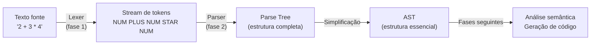
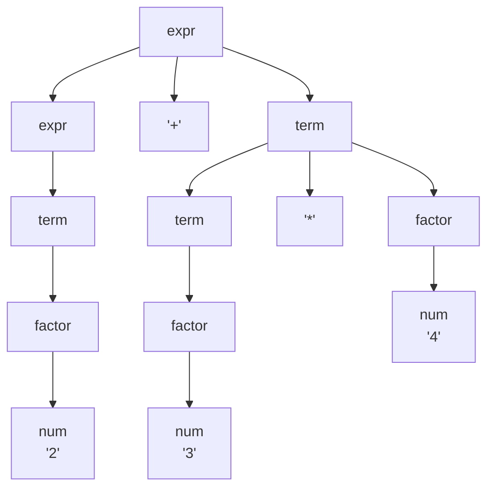
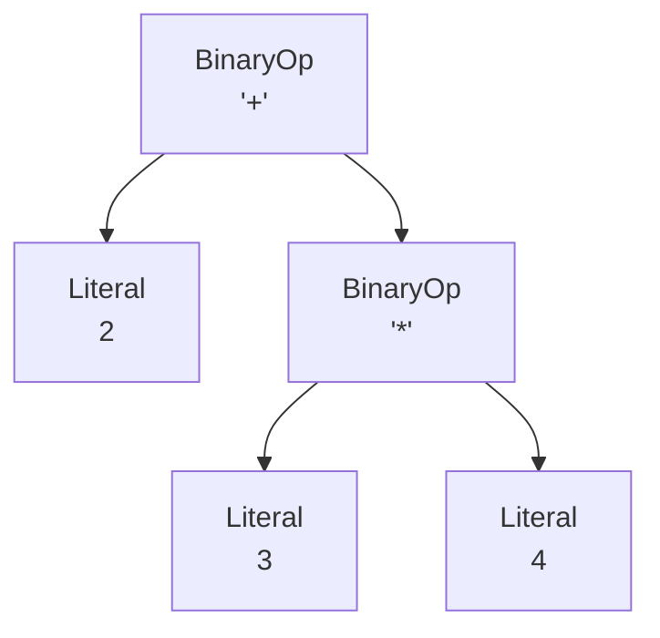
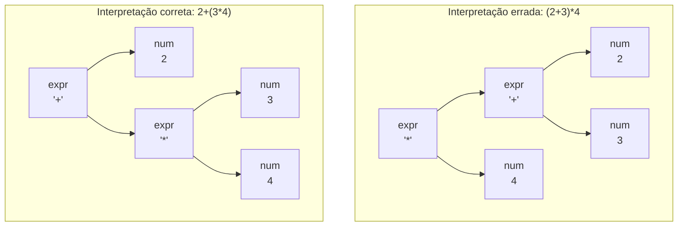
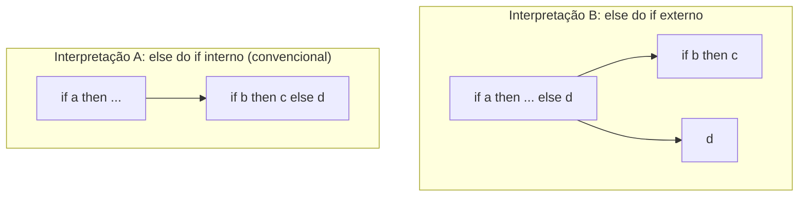

# Gramáticas e a árvore sintática

> [!abstract] TL;DR
> O lexer entregou uma fila de tokens — números, operadores, palavras-chave. Agora o parser precisa descobrir a **estrutura hierárquica** dessa fila: quem é operando de quem, qual bloco contém qual statement. Para isso ele usa uma **gramática livre de contexto (CFG)**, que descreve exatamente quais sequências de tokens são válidas e como elas se encaixam. O resultado é uma árvore: primeiro a **parse tree** (concreta, guarda tudo), depois a **AST** (abstrata, guarda só o essencial para o significado). No caminho, você vai ver por que ambiguidade é uma armadilha real — e como desarmá-la.

---

## Da fila linear para a árvore hierárquica

Imagine que você recebe uma mensagem de texto com todas as palavras separadas por vírgula, sem pontuação de estrutura:

> `2 , + , 3 , * , 4`

Você sabe que há números e operadores. Mas você **não sabe a estrutura**: `(2 + 3) * 4` ou `2 + (3 * 4)`? São cálculos diferentes, e a diferença importa muito.

É exatamente esse o problema que o lexer (fase 1) deixa em aberto. Ele converteu o texto bruto em uma **stream linear de tokens**:

```
NUM(2)  PLUS  NUM(3)  STAR  NUM(4)
```

Agora a fase 2 — análise sintática — precisa descobrir a **hierarquia**: quem é filho de quem, qual operador domina qual operando. O resultado dessa descoberta é uma **árvore**, não uma lista.



> [!info] Leitura do diagrama
> O pipeline de compilação em quatro etapas: texto → tokens (lexer) → parse tree (parser) → AST (simplificação) → fases posteriores. A fronteira entre fase 1 e fase 2 é a passagem de uma estrutura plana para uma estrutura em árvore.

---

## Por que regex não basta

Você talvez pense: "regex já é tão poderoso para o lexer, por que não usá-lo também para o parser?"

A resposta é **aninhamento**. Regex — e os autômatos finitos que o executam — não têm memória. Eles não conseguem contar. Por isso, expressões como `((()))` (parênteses aninhados balanceados) estão além do alcance de qualquer regex.

Pense assim: para saber se `(((...)))` com `n` abre-parênteses é válido, você precisa lembrar quantos abre você viu — e esse número pode ser qualquer inteiro. Um autômato finito tem um número fixo de estados e não pode fazer isso.

Existe até uma prova formal disso — o **lema do bombeamento para linguagens regulares** garante que a linguagem `{(^n )^n | n ≥ 0}` (parênteses balanceados) não é regular. Mas você não precisa saber a prova para entender a intuição: autômatos finitos são como pessoas com memória de trabalho de tamanho zero; eles não conseguem manter contagem de nada.

Já uma **gramática livre de contexto (CFG)** é executada por um **autômato de pilha**, que tem uma pilha de profundidade ilimitada. Cada vez que você abre um parêntese, empilha; quando fecha, desempilha. A pilha funciona como a memória que o autômato finito não tem.

Veja como isso se traduz em estrutura real: `f(g(x, h(y)))`. Três níveis de aninhamento de chamadas de função. Um autômato finito não consegue rastrear que o primeiro `)` fecha `h`, o segundo fecha `g` e o terceiro fecha `f`. Um autômato de pilha empilha `f`, depois `g`, depois `h` — e desempilha na ordem inversa. Exatamente o que um parser de linguagem de programação faz.

> [!tip] A intuição da hierarquia de Chomsky
> Regular = sem aninhamento. Livre de contexto = aninhamento balanceado (parênteses, blocos, chamadas de função). Contexto-sensível = dependência entre partes distantes do texto. Para a hierarquia completa, veja [[03-Dominios/Ciência/Teoria da Computação/02 - Linguagens formais e a hierarquia de Chomsky]] e, para autômatos de pilha, [[03-Dominios/Ciência/Teoria da Computação/06 - Autômatos de pilha e gramáticas livres de contexto]]. Aqui, a intuição é o que importa: sintaxe de linguagens de programação tem aninhamento, então precisa de CFG.

Toda linguagem de programação que você usa — Python, Java, Rust, C — tem a sua sintaxe descrita por uma CFG. A "linguagem de máquina" do parser são as produções dessa gramática. Você pode baixar a gramática do Java (Java Language Specification, §2) ou do Python (Python Reference, §Full Grammar specification) e ler exatamente as regras que o parser da linguagem segue.

---

## Anatomia de uma CFG

Uma gramática livre de contexto tem quatro partes:

| Componente | O que é | Exemplo |
|---|---|---|
| **Terminais** | Os tokens que vêm do lexer — folhas da árvore | `num`, `+`, `*`, `(`, `)` |
| **Não-terminais** | Categorias sintáticas que o parser constrói | `expr`, `term`, `factor` |
| **Produções** | Regras que expandem um não-terminal | `expr → expr + term` |
| **Símbolo inicial** | O não-terminal de topo — representa o programa todo | `expr` (para expressões) |

Uma **produção** (ou regra) tem o formato `A → α`, onde `A` é um não-terminal e `α` é uma sequência de terminais e não-terminais. Ela diz: "um `A` pode ser reescrito como `α`".

### Notação BNF e EBNF

**BNF (Backus-Naur Form)** foi criada por John Backus e refinada por Peter Naur para descrever ALGOL 60 nos anos 1950-60 — a primeira vez que a sintaxe de uma linguagem de programação foi formalizada. O nome "Backus-Naur" foi sugerido por Donald Knuth. A notação usa `::=` para "pode ser" e `|` para alternativas:

```
<expr> ::= <expr> "+" <term> | <term>
<term> ::= <term> "*" <factor> | <factor>
<factor> ::= "(" <expr> ")" | num
```

**EBNF (Extended BNF)** acrescenta açúcar sintático que torna as gramáticas mais legíveis, sem aumentar o poder expressivo:

- `A*` → zero ou mais repetições de A
- `A+` → uma ou mais repetições de A
- `A?` → zero ou uma ocorrência de A (opcional)
- `(A | B)` → alternativa inline

```
<stmt_list> ::= <stmt>*
<if_stmt>   ::= "if" <expr> "then" <stmt> ("else" <stmt>)?
```

### Gramática exemplo: expressões aritméticas

Aqui está uma gramática completa para expressões aritméticas com precedência correta (números inteiros, `+`, `*`, parênteses):

```
expr   → expr "+" term
       | term

term   → term "*" factor
       | factor

factor → "(" expr ")"
       | num
```

Leia assim: uma `expr` é ou uma `expr` mais um `term`, ou apenas um `term`. Um `term` é ou um `term` vezes um `factor`, ou apenas um `factor`. Um `factor` é um número ou uma `expr` entre parênteses.

> [!example] Por que três níveis?
> A estratificação em `expr → term → factor` **não é acidental** — ela codifica precedência. `*` liga mais forte que `+` porque `term` está mais fundo na gramática. Qualquer expressão com `*` fica encapsulada dentro de um `term`, que depois alimenta uma `expr`. Você vai ver isso se desdobrar na seção sobre ambiguidade.

Note também que `factor` pode ser `"(" expr ")"` — isso fecha o ciclo: uma `expr` inteira pode aparecer dentro de parênteses e se tornar um `factor`, que é o nível mais baixo (maior precedência). É assim que `(2 + 3) * 4` funciona: o `2 + 3` é uma `expr` que, envolto em parênteses, vira um `factor` e portanto tem "precedência" de número.

### Gramática exemplo: mini-linguagem com statements

Para ver como a gramática escala além de expressões, aqui está uma mini-linguagem com `if`, `while` e atribuições:

```
program   → stmt*

stmt      → assign_stmt
           | if_stmt
           | while_stmt
           | block

assign_stmt → id "=" expr ";"

if_stmt   → "if" "(" expr ")" stmt
           | "if" "(" expr ")" stmt "else" stmt

while_stmt → "while" "(" expr ")" stmt

block     → "{" stmt* "}"

expr      → expr "+" term | term
term      → term "*" factor | factor
factor    → "(" expr ")" | num | id
```

Esta gramática já captura boa parte da estrutura de C. `stmt*` em EBNF significa zero ou mais statements. `block` é a chave para aninhamento: um `stmt` pode ser um `block`, que contém `stmt*`, que podem ser `block`s, e assim por diante — aninhamento ilimitado, exatamente o que precisamos de uma CFG.

---

## Derivação: aplicando as regras passo a passo

Derivar uma sentença é aplicar produções partindo do símbolo inicial até chegar em apenas terminais. Cada passo substitui um não-terminal por sua forma na produção.

**Derivação de `2 + 3 * 4`:**

```
expr
→ expr "+" term          (produção: expr → expr + term)
→ term "+" term          (produção: expr → term)
→ factor "+" term        (produção: term → factor)
→ num "+" term           (produção: factor → num)  → "2 + term"
→ "2" "+" term "*" factor  (produção: term → term * factor)
→ "2" "+" factor "*" factor
→ "2" "+" num "*" factor
→ "2" "+" "3" "*" factor
→ "2" "+" "3" "*" num
→ "2" "+" "3" "*" "4"
```

Chamamos cada forma intermediária de **sentential form** — uma mistura de terminais e não-terminais que surge durante a derivação. Por exemplo, `term "+" term` é uma sentential form: já tem um terminal (`"+"`) mas ainda tem não-terminais (`term`) que precisam ser expandidos.

**Derivação mais à esquerda (leftmost):** em cada passo, expande sempre o não-terminal mais à esquerda. No exemplo acima, primeiro expandimos `expr` (mais à esquerda), depois o `expr` filho, depois `term`, e assim por diante.

**Derivação mais à direita (rightmost):** expande sempre o não-terminal mais à direita. O resultado final (a sentença gerada) é o mesmo, mas a ordem dos passos é diferente.

Por que isso importa? Parsers top-down constroem derivações leftmost; parsers bottom-up constroem derivações rightmost de trás para frente (rightmost derivation in reverse). Essa diferença determina toda a teoria de LL e LR parsing — que você verá em detalhes nas notas [[07 - Parsing top-down formal]] e [[08 - Parsing bottom-up]].

---

## Parse tree: a derivação visualizada

A **parse tree** (árvore de derivação, ou árvore concreta) é a derivação virando árvore. Cada nó interno é um não-terminal; cada folha é um terminal. As arestas representam uma aplicação de produção.

Para `2 + 3 * 4`, a parse tree produzida pela gramática estratificada é:



> [!info] Leitura do diagrama
> Raiz `expr` se divide em `expr + term`. O `expr` da esquerda colapsa em `term → factor → num '2'`. O `term` da direita se expande em `term * factor`, onde `term → factor → num '3'` e `factor → num '4'`. Perceba que o `*` está mais fundo (dentro do `term`), o que reflete maior precedência.

A parse tree preserva **tudo**: cada não-terminal intermediário, cada token de pontuação, cada passo da derivação. Ela é completa — mas verbosa demais para as fases seguintes.

Você pode visualizar a relação entre derivação e parse tree assim: a derivação é a sequência de passos; a parse tree é essa sequência "comprimida" numa estrutura bidimensional. A raiz é o símbolo inicial; as folhas, lidas da esquerda para a direita, dão exatamente a sentença original.

Uma propriedade fundamental: **uma sentença é válida na gramática se e somente se ela tem pelo menos uma parse tree**. Reconhecer a sentença é equivalente a construir a árvore. Por isso parsing e reconhecimento são a mesma coisa na prática.

---

## AST: só o que importa para o significado

A **AST (Abstract Syntax Tree)** é a versão enxuta da parse tree. Ela descarta tudo que é detalhe de gramática e guarda apenas a **estrutura semântica**: quem faz o quê com quem.

Compare a AST de `2 + 3 * 4` com a parse tree acima:



> [!info] Leitura do diagrama
> A AST tem apenas três tipos de nó: `BinaryOp` (operação binária) e `Literal`. Não há `expr`, `term`, `factor` — esses não-terminais eram andaimes da gramática, não do significado. Parênteses desaparecem porque a estrutura da árvore já codifica a ordem de avaliação. O nó `*` está abaixo do `+`, refletindo que a multiplicação acontece primeiro.

O que a AST joga fora em relação à parse tree:

| O que some | Por quê pode sumir |
|---|---|
| Nós `expr`, `term`, `factor` intermediários sem filhos múltiplos | São andaimes de gramática, não de significado |
| Parênteses `(`, `)` | A estrutura da árvore já os representa |
| Tokens de pontuação (ponto-e-vírgula, vírgulas em alguns casos) | Servem ao parser, não ao significado |
| Nós de produção unitária | `expr → term → factor → num` colapsa em `Literal` |

Veja outro exemplo: `(2 + 3) * 4`. Na parse tree, os parênteses aparecem explicitamente como nós filhos de `factor`. Na AST, eles somem completamente — mas o agrupamento que eles expressavam está preservado na **estrutura da árvore**: o nó `+` é filho do nó `*`, o que significa que `+` é calculado primeiro.

```
Parse tree de (2+3)*4          AST de (2+3)*4
         expr                       BinaryOp *
          |                        /         \
         term                BinaryOp +    Literal 4
        / | \               /         \
    term  *  factor     Literal 2   Literal 3
     |       |
   factor   num "4"
    |
  "(" expr ")"
       |
     expr + term
```

Isso é a essência: a parse tree é a gramática materializada; a AST é o **significado** materializado.

> [!success] Por que a AST é tão importante
> As fases seguintes — análise semântica, otimização, geração de código — trabalham sobre a AST, não sobre a parse tree. A AST é menor, mais uniforme e mais fácil de percorrer. O padrão Visitor (veja [[06 - A AST e o padrão visitor]]) é a forma canônica de processar uma AST sem poluir os nós com lógica de cada fase. Ferramentas como linters (ESLint, Clippy), formatadores (Prettier, rustfmt) e refactoring tools operam quase sempre sobre ASTs.

---

## Ambiguidade: quando a gramática não sabe escolher

Uma gramática é **ambígua** se existe pelo menos uma sentença com **duas ou mais parse trees distintas**. Isso é um problema grave: significa que o mesmo código pode ser interpretado de formas diferentes, dependendo de qual parse tree o parser escolhe.

Existem dois casos canônicos que toda entrevista de compiladores pode cobrar.

### Caso 1: Precedência e associatividade de operadores

Suponha que você tivesse uma gramática ingênua — sem estratificação:

```
expr → expr "+" expr
     | expr "*" expr
     | num
```

Para `2 + 3 * 4`, existem **duas parse trees válidas**:



> [!info] Leitura do diagrama
> À esquerda: a gramática agrupa `2 + 3` primeiro, depois multiplica por `4` — resultado 20. À direita: agrupa `3 * 4` primeiro, depois soma `2` — resultado 14. Mesma sentença, dois significados. A gramática ambígua não sabe qual escolher.

**Como resolver:** estratifique a gramática, como mostramos antes. `expr → term → factor` força `*` a ter precedência sobre `+` estruturalmente.

**Associatividade** é outro aspecto: `2 - 3 - 4` é `(2 - 3) - 4 = -5` (associativa à esquerda) ou `2 - (3 - 4) = 3` (associativa à direita)? A regra recursiva à esquerda `expr → expr "-" term` codifica associatividade à esquerda; `expr → term "-" expr` codifica à direita. Exponenciação geralmente é associativa à direita: `2 ^ 3 ^ 2 = 2 ^ (3 ^ 2) = 512`, não `(2 ^ 3) ^ 2 = 64`.

### Caso 2: O dangling else

Considere a gramática:

```
stmt → "if" expr "then" stmt
     | "if" expr "then" stmt "else" stmt
     | other
```

E a sentença:

```
if a then if b then c else d
```

A quem pertence o `else d`? Duas interpretações:



> [!info] Leitura do diagrama
> Interpretação A (à direita): o `else` casa com o `if b` mais próximo. Interpretação B (à esquerda): o `else` casa com o `if a` externo. Ambas são parse trees válidas para a gramática acima.

> [!danger] Armadilha real em produção
> O dangling else causou bugs históricos. Em C, a convenção é que o `else` se associa ao `if` mais próximo — mas nada na gramática padrão de C força isso; é uma regra de desempate do parser. Em Python, o problema não existe porque indentação define blocos. Em Java, blocos com `{}` eliminam a ambiguidade pelo programador.

**Como a gramática resolve (sem truque do parser):** distinção entre `matched_stmt` e `open_stmt`:

```
stmt          → matched_stmt | open_stmt
matched_stmt  → "if" expr "then" matched_stmt "else" matched_stmt | other
open_stmt     → "if" expr "then" stmt
              | "if" expr "then" matched_stmt "else" open_stmt
```

Agora a gramática só aceita `if-then-else` completo em posições onde ambos os ramos estão fechados — eliminando a ambiguidade estruturalmente.

---

## Top-down × bottom-up: dois jeitos de usar a gramática

O parser tem a gramática em mãos e a stream de tokens. Como ele produz a árvore?

**Top-down (descendente):** começa pela raiz (`expr`) e **expande** não-terminais até chegar nos tokens. É como prever o que você vai ler antes de ler. Em cada passo, o parser tenta adivinhar qual produção vai gerar o prefixo que está vendo na entrada. Se errar, pode ter que voltar atrás (backtracking) — ou, com gramáticas bem projetadas (LL(1)), nunca precisa.

Recursive descent é a forma mais natural de top-down: você escreve uma função por não-terminal. Pratt parsing é uma variante elegante especialmente boa para expressões com operadores — veja [[05 - Recursive descent e Pratt parsing]].

**Bottom-up (ascendente):** começa pelos tokens (folhas) e **reduz** sequências de terminais/não-terminais para não-terminais de nível mais alto, até chegar à raiz. Em cada passo, o parser escolhe entre "empilhar o próximo token" (shift) ou "reduzir o topo da pilha por uma produção" (reduce). LR parsing é o paradigma dominante aqui — mais poderoso que LL na teoria, usado por yacc/bison e a maioria dos geradores de parsers industriais. Veja [[08 - Parsing bottom-up]].

Ambas as abordagens usam a **mesma gramática**; a diferença é a direção de percurso e a forma como a pilha é usada. Para detalhes formais de top-down (conjuntos FIRST e FOLLOW, tabelas LL), veja [[07 - Parsing top-down formal]].

> [!tip] Analogia culinária
> Top-down é como cozinhar seguindo a receita do início ao fim: você sabe o prato final e vai montando passo a passo. Bottom-up é como olhar para os ingredientes na bancada e decidir o que combina com o quê — até chegar ao prato completo. Mesma comida, abordagens opostas.

---

## Recuperação de erros sintáticos

O que acontece quando o parser encontra um token inesperado — um `;` onde deveria haver um `)`, por exemplo?

Um compilador ingênuo para imediatamente e exige que você corrija o primeiro erro antes de ver o segundo. Isso é impraticável: em código com 10 erros, você teria que compilar 10 vezes. Compiladores modernos fazem **recuperação de erros** para continuar e reportar o máximo possível de problemas em uma única passagem.

**Panic mode (modo pânico):** o parser descarta tokens da entrada até encontrar um "token de sincronização" (como `;`, `}`, `end`, `)`) e tenta retomar a partir dali. É a técnica mais simples e surpreendentemente eficaz. A ideia é: se algo deu errado dentro de um bloco, pule para o fim do bloco e continue.

**Error productions (produções de erro):** a gramática inclui produções especiais para erros comuns. Por exemplo, `expr → expr "+" "+" expr` poderia reconhecer `++` usado erroneamente como operador em C, emitir uma mensagem específica e continuar. Essa técnica produz mensagens de erro muito mais úteis do que simplesmente "token inesperado".

**Recuperação por frase:** o parser tenta pequenas correções locais (inserir ou deletar um token) para transformar a entrada inválida em algo válido. Mais sofisticado — e mais propenso a produzir "reparos" que confundem o usuário.

Compiladores modernos como GCC, Clang e rustc usam variantes sofisticadas dessas técnicas, combinadas com heurísticas específicas para cada linguagem, para produzir mensagens de erro que guiam o programador direto para a causa raiz.

> [!warning] Erros em cascata
> Um erro sintático pode desencadear dezenas de erros falsos nas fases seguintes — análise semântica pode achar que um símbolo não está declarado simplesmente porque o parser pulou sua declaração durante a recuperação. Bons compiladores rastreiam o estado de erro e suprimem mensagens redundantes após um erro real. O Rust é famoso por mensagens de erro sintático extremamente precisas exatamente por ter investido muito na qualidade da recuperação.

---

## Conexões

- **Anterior:** [[03 - Análise léxica - do texto a tokens]] — o lexer que produziu a stream de tokens que o parser consome.
- **Próxima:** [[05 - Recursive descent e Pratt parsing]] — como implementar um parser top-down na prática.
- **Teoria de base:** [[03-Dominios/Ciência/Teoria da Computação/06 - Autômatos de pilha e gramáticas livres de contexto]] — o formalismo matemático por trás das CFGs; [[03-Dominios/Ciência/Teoria da Computação/02 - Linguagens formais e a hierarquia de Chomsky]] — onde CFGs se encaixam na hierarquia.
- **Continuação:** [[06 - A AST e o padrão visitor]] — o que fazer com a AST depois de construída; [[07 - Parsing top-down formal]] — LL(1), FIRST/FOLLOW sets; [[08 - Parsing bottom-up]] — LR(1), SLR, LALR.

---

> [!summary] Resumo em uma linha
> Uma gramática livre de contexto descreve a sintaxe hierárquica de uma linguagem via produções; o parser aplica essas produções para construir uma parse tree concreta e depois a simplifica em uma AST, descartando andaimes de gramática e preservando apenas a estrutura semântica — e ambiguidade é o inimigo desse processo.

---

## Em entrevista

Em entrevistas de nível senior (especialmente em empresas de compiladores, ferramentas de linguagem e infra), esses conceitos aparecem tanto em perguntas diretas quanto em discussões sobre design de DSLs, analisadores de código, linters e formatadores.

*"A context-free grammar describes the hierarchical syntax of a language through production rules — terminals are the tokens, non-terminals are syntactic categories like expression or statement, and the start symbol represents the whole program."*

*"A parse tree, or concrete syntax tree, faithfully records every step of the derivation — every intermediate non-terminal node, every punctuation token. An AST discards the grammar scaffolding and keeps only the semantically meaningful structure."*

*"To understand the difference: in a parse tree for `2 + 3 * 4`, you'll see `expr`, `term`, and `factor` nodes. In the AST, you see only `BinaryOp('+', Literal(2), BinaryOp('*', Literal(3), Literal(4)))`."*

*"A grammar is ambiguous when a single sentence has two or more distinct parse trees. That's dangerous because it means the program has two or more valid interpretations — the compiler would be non-deterministic."*

*"Operator precedence and associativity ambiguity is resolved by stratifying the grammar: deeper non-terminals bind tighter. `term` is deeper than `expr`, so `*` binds tighter than `+`."*

*"The dangling else is the classic ambiguity example: `if a then if b then c else d` can associate the `else` with either `if`. The conventional resolution is to match it with the nearest preceding `if`, or redesign the grammar using matched/unmatched statement categories."*

*"BNF was introduced by John Backus for ALGOL 60 in 1959 and refined by Peter Naur — it's the first formal notation for programming language syntax. EBNF adds `*`, `+`, `?` for repetition and optionality, without increasing expressive power."*

*"Regular expressions can't parse balanced nesting — they have no memory. Context-free grammars, executed by pushdown automata, can, because the stack provides unbounded memory to track nesting depth."*

| Português | English |
|---|---|
| Gramática livre de contexto | Context-free grammar (CFG) |
| Análise sintática | Parsing / syntactic analysis |
| Árvore sintática abstrata | Abstract syntax tree (AST) |
| Árvore de derivação | Parse tree / concrete syntax tree |
| Terminal | Terminal |
| Não-terminal | Non-terminal |
| Produção / regra | Production / production rule |
| Símbolo inicial | Start symbol |
| Ambiguidade | Ambiguity |
| Precedência | Precedence |
| Associatividade | Associativity |
| Forma sentencial | Sentential form |
| Derivação mais à esquerda | Leftmost derivation |
| Else pendente | Dangling else |
| Modo pânico | Panic mode (error recovery) |

---

> [!info] Lastro
> - Alfred V. Aho, Monica S. Lam, Ravi Sethi, Jeffrey D. Ullman. **Compilers: Principles, Techniques, and Tools** (2ª ed., "Dragon Book"), Pearson, 2007. Capítulo 4: "Syntax Analysis" — definição formal de CFG, parse trees, ambiguidade e estratégias de parsing.
> - Robert Nystrom. **Crafting Interpreters**, 2021 (disponível em craftinginterpreters.com). Capítulos "Representing Code" e "Parsing Expressions" — parse tree vs. AST na prática, Pratt parsing.
> - Keith D. Cooper, Linda Torczon. **Engineering a Compiler** (3ª ed.), Morgan Kaufmann, 2022. Capítulo 3: "Parsers" — CFG, BNF/EBNF, derivações, ambiguidade e recuperação de erros.
> - Peter Naur et al. **Revised Report on the Algorithmic Language ALGOL 60**, Communications of the ACM, 6(1):1–17, 1963. Fonte primária da notação BNF — a primeira formalização de sintaxe de linguagem de programação.
> - Wikipedia. [Backus–Naur form](https://en.wikipedia.org/wiki/Backus%E2%80%93Naur_form) — história da notação, papel de Backus, Naur e Knuth.
> - Wikipedia. [Dangling else](https://en.wikipedia.org/wiki/Dangling_else) — análise do problema e soluções em diferentes linguagens.
> - GeeksforGeeks. [Dangling-else Ambiguity](https://www.geeksforgeeks.org/compiler-design/dangling-else-ambiguity/) — gramática matched/unmatched como solução formal.
