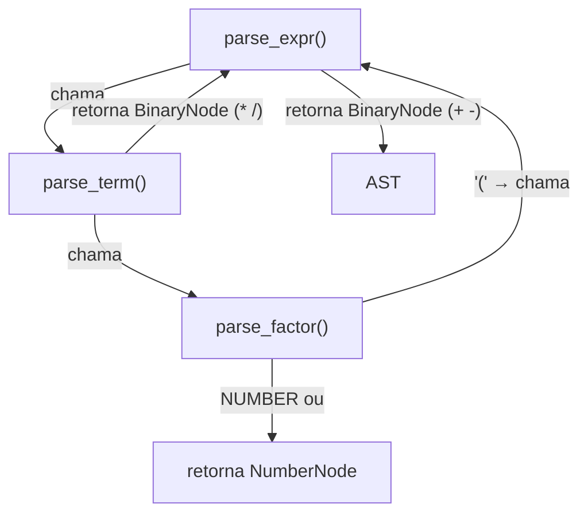
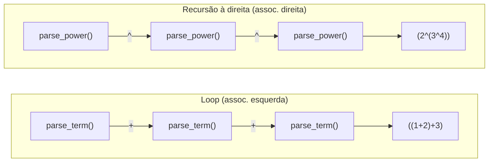
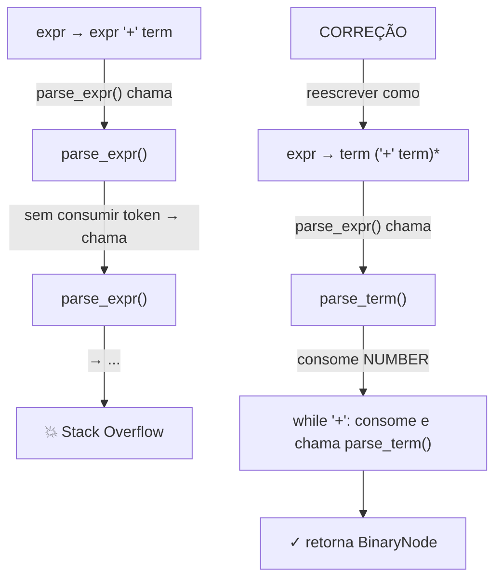
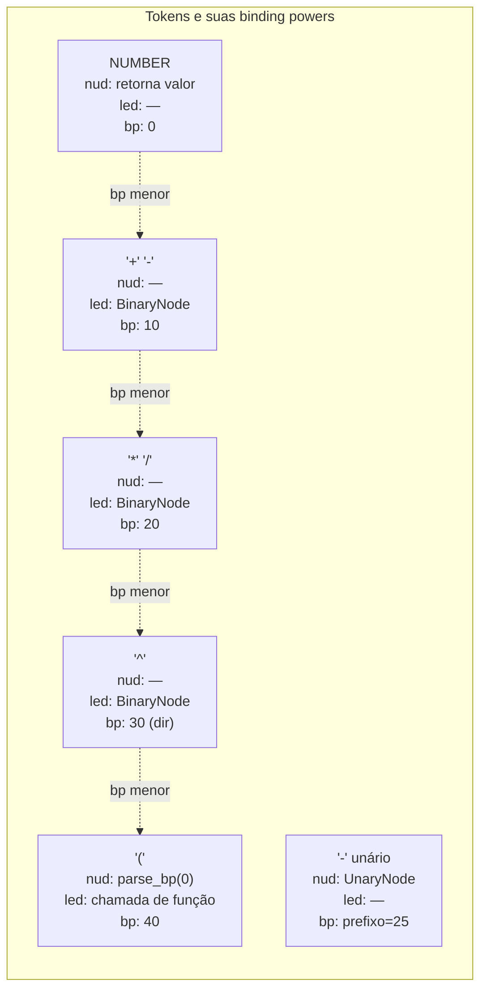
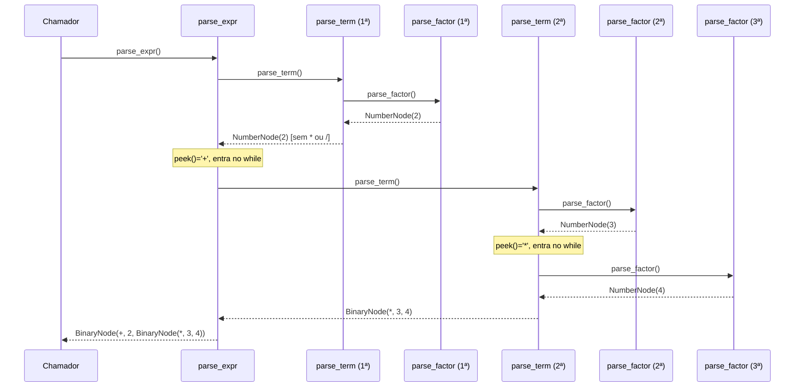

# Recursive descent e Pratt parsing

> [!abstract] TL;DR
> Recursive descent transforma cada não-terminal da gramática em uma função: a pilha de chamadas da linguagem hospedeira *é* a pilha do parser. Pratt parsing resolve o problema de gravar precedência sem uma função por nível, associando "binding powers" a tokens. Juntos, formam a espinha dorsal dos parsers de produção em GCC, Clang, Rust e V8.

---

## A ideia central: a gramática vira código

Imagine que você está descrevendo uma linguagem para um amigo. Você diz: "uma expressão é uma soma de termos; um termo é um produto de fatores; um fator é um número ou uma expressão entre parênteses." Isso é uma gramática. Agora imagine que cada frase dessa descrição vira uma função no seu programa. Isso é *recursive descent*.

A observação genial é simples: se a gramática é recursiva, o código também pode ser. A pilha de chamadas da linguagem hospedeira (Java, Python, C, qualquer uma) faz o trabalho de rastrear o estado do parse. Você não precisa gerenciar uma pilha manualmente.

Essa técnica é chamada de **parser de descida recursiva** (*recursive descent parser*). É o método mais intuitivo para escrever um parser à mão, e — surpreendentemente — também o dominante em compiladores de produção sérios.

---

## Da gramática às funções

Considere a gramática clássica de expressões aritméticas, já estratificada por precedência:

```text
expr   → term   ( ('+' | '-') term   )*
term   → factor ( ('*' | '/') factor )*
factor → NUMBER | '(' expr ')'
```

Cada regra vira uma função. Aqui está o parser em Python, do zero:

```python
class Parser:
    def __init__(self, tokens):
        self.tokens = tokens
        self.pos = 0

    def peek(self):
        """Olha o token atual sem consumi-lo."""
        if self.pos < len(self.tokens):
            return self.tokens[self.pos]
        return None

    def advance(self):
        """Consome e retorna o token atual."""
        tok = self.tokens[self.pos]
        self.pos += 1
        return tok

    def expect(self, kind):
        """Consome um token do tipo esperado; erro se for outro."""
        tok = self.advance()
        if tok.kind != kind:
            raise SyntaxError(f"Esperado {kind}, encontrado {tok.kind}")
        return tok

    def parse_expr(self):
        """expr → term ( ('+' | '-') term )*"""
        left = self.parse_term()
        while self.peek() and self.peek().kind in ('+', '-'):
            op = self.advance()
            right = self.parse_term()
            left = BinaryNode(op, left, right)
        return left

    def parse_term(self):
        """term → factor ( ('*' | '/') factor )*"""
        left = self.parse_factor()
        while self.peek() and self.peek().kind in ('*', '/'):
            op = self.advance()
            right = self.parse_factor()
            left = BinaryNode(op, left, right)
        return left

    def parse_factor(self):
        """factor → NUMBER | '(' expr ')'"""
        tok = self.peek()
        if tok.kind == 'NUMBER':
            return NumberNode(self.advance())
        if tok.kind == '(':
            self.advance()           # consume '('
            node = self.parse_expr()
            self.expect(')')
            return node
        raise SyntaxError(f"Token inesperado: {tok.kind}")
```

Veja a simetria: a estrutura da gramática estratificada em três níveis *é* a estrutura das três funções. `parse_expr` chama `parse_term`; `parse_term` chama `parse_factor`. A hierarquia de chamadas *codifica a precedência*.

O diagrama abaixo mostra isso visualmente:



> [!info] Leitura do diagrama
> Cada seta de "chama" representa uma invocação de função. A seta de `parse_factor` de volta para `parse_expr` mostra a recursão mútua que suporta parênteses. O nó `BinaryNode` encapsula operador e dois filhos.

---

## Como o parser decide o que fazer: predictive parsing

Em cada ponto do parse, o parser precisa escolher qual produção seguir. O **predictive parsing** faz isso olhando apenas o *próximo token* (lookahead de 1 token, LL(1)).

As primitivas são quatro:

| Primitiva | O que faz |
|-----------|-----------|
| `peek()` | Olha o token atual sem consumir |
| `advance()` | Consome e retorna o token atual |
| `expect(k)` | Consome o token esperado; erro se for outro |
| `match(k)` | Consome se for do tipo `k`, ignora se não for |

A teoria por trás — conjuntos FIRST e FOLLOW, tabelas LL(1) — está em [[07 - Parsing top-down formal]]. Aqui o foco é a prática: o `while self.peek().kind in ('+', '-')` do `parse_expr` *é* o predictive parsing em ação. O parser olha o próximo token e decide: "ainda estou dentro de uma soma? Sim → consumo o operador e continuo. Não → retorno."

> [!tip] O lookahead de 1 é suficiente para a maioria das linguagens
> LL(1) cobre Python, Ruby, JSON, a maioria dos DSLs. C++ precisa de lookahead maior em alguns contextos — por isso o parser do Clang guarda estado extra em certos pontos.

---

## Associatividade pelo formato do loop

Observe o `while` em `parse_expr`:

```python
left = self.parse_term()
while self.peek() and self.peek().kind in ('+', '-'):
    op = self.advance()
    right = self.parse_term()
    left = BinaryNode(op, left, right)  # left se acumula
return left
```

`1 + 2 + 3` vira `(1 + 2) + 3` — **associatividade à esquerda**. O `left` se acumula; cada iteração do loop o envolve num novo `BinaryNode`.

Para **associatividade à direita** (como o operador `^` de exponenciação), você usa *recursão à direita* em vez de loop:

```python
def parse_power(self):
    """power → factor ('^' power)?   — associatividade à direita"""
    base = self.parse_factor()
    if self.peek() and self.peek().kind == '^':
        op = self.advance()
        exp = self.parse_power()   # chama a si mesmo, não itera
        return BinaryNode(op, base, exp)
    return base
```

`2 ^ 3 ^ 4` vira `2 ^ (3 ^ 4)` — correto para exponenciação.



> [!info] Leitura do diagrama
> À esquerda, o `left` se acumula a cada iteração do `while`, agrupando à esquerda. À direita, a chamada recursiva a si mesmo agrupa à direita porque a recursão é resolvida de dentro para fora.

---

## A armadilha: recursão à esquerda

> [!danger] Recursão à esquerda = loop infinito
> Uma gramática com recursão à esquerda direta — `expr → expr '+' term` — faz `parse_expr()` chamar a si mesma *antes de consumir qualquer token*. A pilha cresce até o stack overflow. Recursive descent **não suporta** essa forma.

Veja o problema:

```text
GRAMÁTICA COM RECURSÃO À ESQUERDA:
    expr → expr '+' term    ← expr aparece no início do lado direito
         | term

CÓDIGO RESULTANTE (INVÁLIDO):
def parse_expr():
    left = parse_expr()   ← chama a si mesmo SEM consumir token!
    ...
```

A correção é reescrever a gramática eliminando a recursão à esquerda — transformando-a em iteração:

```text
ANTES (recursão à esquerda):
    expr → expr '+' term
         | term

DEPOIS (iterativo, equivalente):
    expr → term ('+' term)*
```

O padrão geral: `A → A α | β` vira `A → β (α)*`. No código, isso se torna um `while` loop — exatamente o que fizemos em `parse_expr`.



> [!info] Leitura do diagrama
> O lado esquerdo mostra o loop infinito: `parse_expr` nunca para. O lado direito mostra a correção: começar com `parse_term()` garante que um token é consumido antes de qualquer recursão.

---

## O problema de escala: um nível de precedência por função

Gramáticas simples têm 3 ou 4 níveis de precedência. Mas linguagens reais têm muito mais. O C tem 15 níveis. JavaScript tem 20+. Escrever uma função por nível produz código verboso e repetitivo:

```text
parse_expr()       → + -
parse_term()       → * /
parse_shift()      → << >>
parse_compare()    → < > <= >=
parse_equality()   → == !=
parse_bitand()     → &
parse_bitxor()     → ^
parse_bitor()      → |
parse_and()        → &&
parse_or()         → ||
...
```

Existe uma técnica muito mais elegante.

---

## Pratt parsing: binding power como solução

**Vaughan Pratt** publicou em 1973 a técnica *Top Down Operator Precedence*. A ideia central: em vez de uma função por nível de precedência, você associa a cada token um número — a **binding power** (poder de ligação) — e escreve *uma única função de parse* que usa esses números para decidir o que fazer.

Cada token pode ter dois comportamentos:

- **nud** (*null denotation* / prefixo): como o token se comporta quando aparece *no início* de uma expressão. Um número retorna a si mesmo; um `-` unário parseia a subexpressão à direita; `(` parseia até `)`.
- **led** (*left denotation* / infixo): como o token se comporta quando aparece *no meio* de uma expressão, já tendo um operando à esquerda.

O algoritmo central:

```python
# Binding powers: quanto maior, mais forte a ligação
BP = {
    '+': 10, '-': 10,
    '*': 20, '/': 20,
    '^': 30,  # exponenciação — associatividade à direita
    '(': 0, ')': 0,
}

def parse_bp(min_bp=0):
    """Pratt: parseia enquanto o próximo operador tiver binding power > min_bp."""
    tok = advance()
    # nud: token prefixo
    if tok.kind == 'NUMBER':
        left = NumberNode(tok)
    elif tok.kind == '-':
        left = UnaryNode(tok, parse_bp(BP['*']))  # prefixo com alta precedência
    elif tok.kind == '(':
        left = parse_bp(0)  # parseia subexpressão completa
        expect(')')
    else:
        raise SyntaxError(f"Token inesperado no prefixo: {tok.kind}")

    # led: tokens infixos enquanto a binding power for maior que min_bp
    while True:
        op = peek()
        if op is None or BP.get(op.kind, 0) <= min_bp:
            break
        op = advance()
        bp = BP[op.kind]
        # Associatividade à direita: passa bp sem decrement
        # Associatividade à esquerda: passa bp (o próximo operador igual NÃO vai vencer)
        right = parse_bp(bp)  # para assoc. esquerda; use bp-1 para assoc. direita
        left = BinaryNode(op, left, right)

    return left
```

> [!tip] Por que "binding power"?
> Pense nos operadores como ímãs. Um operador com binding power 20 (`*`) puxa os operandos com força 20. Se o operador seguinte tem força menor (10, o `+`), ele não consegue "roubar" o operando da direita — então `2 + 3 * 4` resulta em `2 + (3 * 4)`, não `(2 + 3) * 4`. A precedência emerge dos números, não da estrutura de chamadas.



> [!info] Leitura do diagrama
> Cada token carrega um "poder de ligação". O parser continua consumindo operadores enquanto eles têm poder maior que o mínimo atual. A hierarquia de precedência está nos números, não nas funções.

---

## Traçando `2 + 3 * 4` passo a passo

Veja como a pilha de chamadas cresce ao parsear `2 + 3 * 4` com recursive descent clássico:



> [!info] Leitura do diagrama
> O resultado final é `BinaryNode(+, 2, BinaryNode(*, 3, 4))` — a AST correta. A multiplicação foi agrupada primeiro porque `parse_term` (de precedência maior) consumiu `3 * 4` completamente antes de retornar para `parse_expr`. A estrutura da pilha *impõe* a precedência.

---

## Por que parsers à mão dominam compiladores de produção

Existe uma questão prática que não costuma aparecer nos livros: se existem geradores de parser (ANTLR, yacc/bison, etc.), por que GCC, Clang, Rust, V8, Roslyn e Swift todos usam parsers escritos à mão?

A resposta está no que acontece quando o usuário erra.

> [!example] Diagnóstico de erro: gerado vs. à mão
> ```
> // CÓDIGO COM ERRO
> if x > 0
>     return x
>
> // Parser gerado (típico):
> "syntax error near 'return'"  ← inútil
>
> // Clang (à mão):
> "expected '(' after 'if'"  ← preciso, com highlight e sugestão de correção
> ```

As razões concretas pelas quais parsers à mão dominam:

| Razão | Detalhes |
|-------|----------|
| **Mensagens de erro de qualidade** | O parser sabe exatamente onde está na gramática e pode dar contexto preciso |
| **Recuperação de erros** | Após um erro, o parser pode sincronizar e continuar, reportando vários erros em uma passagem |
| **Contextos sensíveis** | C++ e Rust têm ambiguidades que dependem de contexto semântico — difíceis de expressar em gramáticas formais |
| **Controle fino** | Heurísticas ad-hoc (como tentar parsear expressão em vez de tipo quando ambíguo) são código comum |
| **Integração com análise semântica** | O parser pode consultar a tabela de símbolos durante o parse (*parsing dirigido por semântica*) |
| **Performance** | Sem overhead de tabela de dispatch; hotpath conhecido |

O contraste com geradores está em [[08 - Parsing bottom-up]].

---

## Recuperação de erros: não parar no primeiro problema

Um compilador que reporta apenas o primeiro erro e para é frustrante. A técnica mais comum é o **panic mode** (*modo pânico*):

```python
def parse_stmt(self):
    try:
        return self._try_parse_stmt()
    except SyntaxError as e:
        self.report_error(e)
        self.synchronize()  # avança até um ponto seguro
        return ErrorNode()

def synchronize(self):
    """Avança até um 'ponto de sincronização' — token que inicia um novo statement."""
    SYNC_TOKENS = {';', '}', 'if', 'while', 'for', 'return', 'class', 'fun'}
    while self.peek() and self.peek().kind not in SYNC_TOKENS:
        self.advance()
    # Consome o ';' ou '}' se for ele o sincronizador
    if self.peek() and self.peek().kind == ';':
        self.advance()
```

O parser descarta tokens até encontrar um **token de sincronização** — um ponto na gramática onde é seguro retomar o parse. Tokens como `;` e `}` são escolhas naturais porque delimitam statements e blocos.

> [!warning] Recuperação de erros é difícil de acertar
> Recuperação ruim gera erros em cascata — o parser sincroniza no ponto errado e reporta erros falsos no código subsequente. Compiladores de produção têm décadas de ajuste fino nessa heurística.

---

## Conexões

- **Anterior:** [[04 - Gramáticas e a árvore sintática]] — a gramática que o recursive descent implementa
- **Próxima:** [[06 - A AST e o padrão visitor]] — o que fazer com a AST que o parser produz
- **Teoria formal:** [[07 - Parsing top-down formal]] — conjuntos FIRST/FOLLOW e tabelas LL(1) (a base teórica que justifica o que fizemos aqui na prática)
- **Alternativa gerada:** [[08 - Parsing bottom-up]] — LR, LALR e geradores como yacc/ANTLR

> [!summary] Resumo em uma linha
> Recursive descent transforma cada regra gramatical em uma função e usa a pilha de chamadas como pilha do parser; Pratt parsing generaliza isso para precedência arbitrária via binding powers — juntos, são a base de todos os compiladores de produção sérios.

---

## Em entrevista

Em entrevistas sobre compiladores ou design de linguagens, recursive descent e Pratt parsing são assuntos recorrentes. O entrevistador quer ver que você entende não apenas *como implementar*, mas *por que* essa escolha domina compiladores reais.

*"Recursive descent is a hand-written parser where each grammar non-terminal maps to a function; the host language's call stack is the parser's stack."*

*"Predictive parsing uses a 1-token lookahead — peek() — to decide which production to apply without backtracking."*

*"Left recursion in a grammar — like expr → expr + term — causes infinite recursion in recursive descent; you eliminate it by rewriting as expr → term ('+' term)\*, turning recursion into a while loop."*

*"Left associativity is achieved with a while loop accumulating the left node; right associativity requires right recursion — the function calls itself recursively."*

*"Pratt parsing assigns a binding power to each token and uses a single parse function with a minimum-bp parameter, replacing the need for one function per precedence level."*

*"The nud (null denotation) of a token describes its prefix behavior; the led (left denotation) describes its infix behavior given a left operand."*

*"GCC, Clang, Rust, and V8 all use hand-written recursive descent parsers because generated parsers produce poor error messages and cannot handle context-sensitive ambiguities common in real languages."*

*"Panic mode error recovery advances past tokens until a synchronization token like ';' or '}' is found, allowing the parser to report multiple errors per compilation."*

| Português | Inglês |
|-----------|--------|
| descida recursiva | recursive descent |
| parse preditivo | predictive parsing |
| antecipação de token | lookahead |
| recursão à esquerda | left recursion |
| Pratt parsing | Pratt parsing / TDOP |
| poder de ligação | binding power |
| associatividade à esquerda | left associativity |
| associatividade à direita | right associativity |
| denotação nula (prefixo) | nud / null denotation |
| denotação à esquerda (infixo) | led / left denotation |
| recuperação de erros | error recovery |
| modo pânico | panic mode |
| token de sincronização | synchronization token |
| não-terminal | non-terminal |
| gramática estratificada | stratified grammar |

---

> [!info] Lastro
> - **Robert Nystrom, *Crafting Interpreters*, Cap. 6 "Parsing Expressions" e Cap. 17 "Compiling Expressions"** — implementação completa de recursive descent e depois Pratt parsing em Java/C; a referência prática mais acessível. [craftinginterpreters.com/parsing-expressions.html](https://craftinginterpreters.com/parsing-expressions.html)
> - **Vaughan Pratt, "Top Down Operator Precedence" (POPL 1973)** — o paper original que introduziu binding powers, nud/led e a ideia central do TDOP. Digitalizado em [github.com/tdop/tdop.github.io](https://github.com/tdop/tdop.github.io)
> - **Bob Nystrom, "Pratt Parsers: Expression Parsing Made Easy" (blog, 2011)** — a explicação mais citada da técnica, constrói um parser completo passo a passo. [journal.stuffwithstuff.com/2011/03/19/pratt-parsers-expression-parsing-made-easy/](https://journal.stuffwithstuff.com/2011/03/19/pratt-parsers-expression-parsing-made-easy/)
> - **Alfred Aho, Monica Lam, Ravi Sethi, Jeffrey Ullman, *Compilers: Principles, Techniques, and Tools* (Dragon Book), 2ª ed., Cap. 4 "Syntax Analysis"** — tratamento formal completo de parsing top-down e bottom-up; a referência acadêmica canônica.
> - **Eli Bendersky, "Top-Down operator precedence parsing" (blog, 2010)** — walkthrough detalhado do algoritmo Pratt com exemplos em Python. [eli.thegreenplace.net/2010/01/02/top-down-operator-precedence-parsing/](https://eli.thegreenplace.net/2010/01/02/top-down-operator-precedence-parsing/)
> - **Clang/LLVM — Parser.cpp** — código-fonte real do parser à mão de C/C++/Objective-C; os comentários dos desenvolvedores explicam diretamente a escolha por recursive descent e mensagens de erro de qualidade. [github.com/llvm/llvm-project/blob/main/clang/lib/Parse/Parser.cpp](https://github.com/llvm/llvm-project/blob/main/clang/lib/Parse/Parser.cpp)
