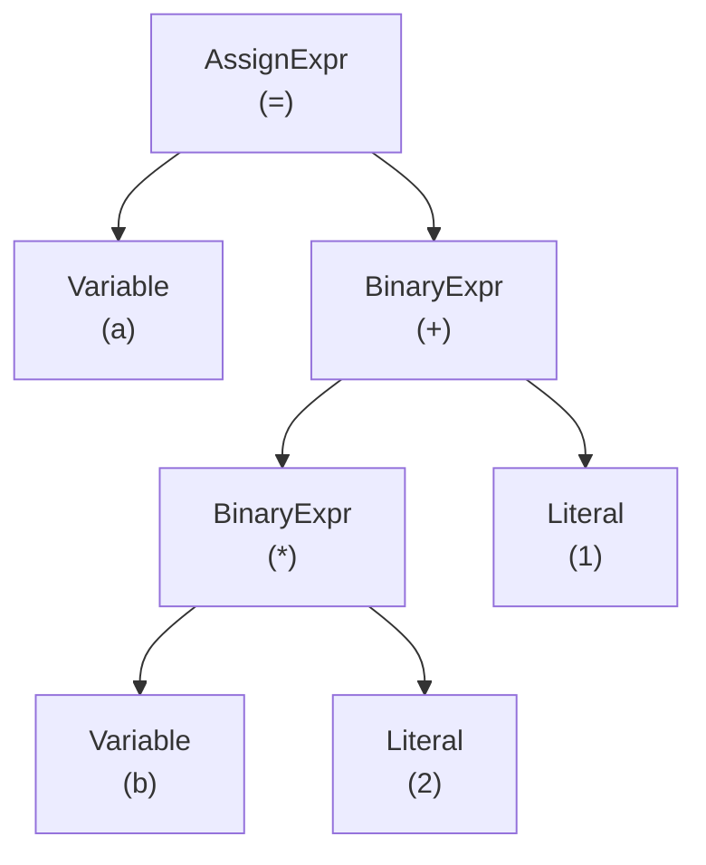
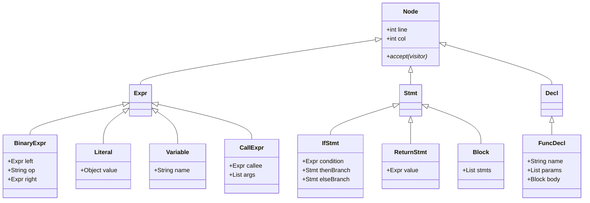
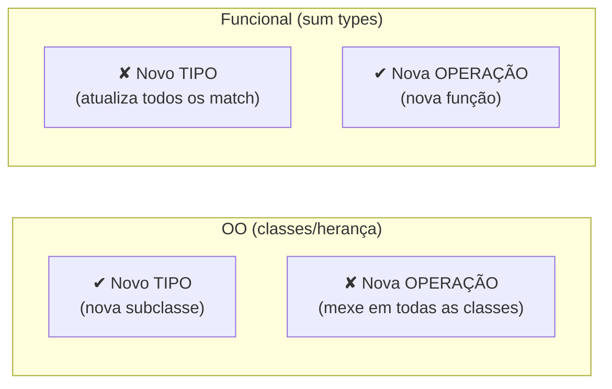
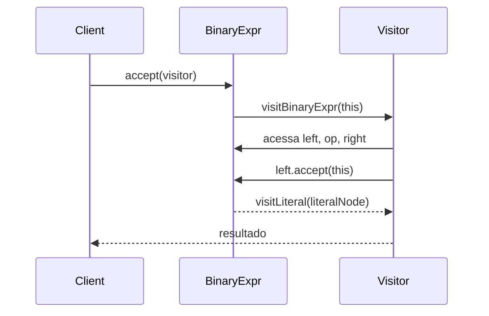
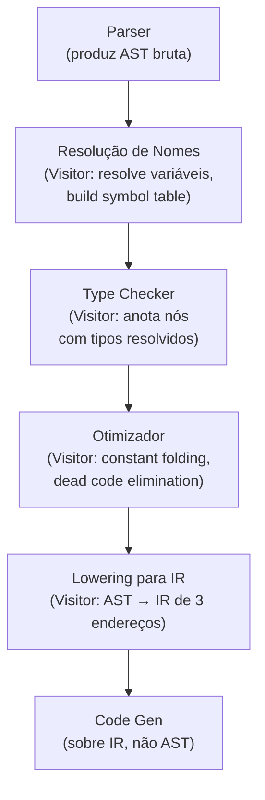

# A AST e o padrão visitor

> [!abstract] TL;DR
> A AST (Abstract Syntax Tree) é a estrutura de dados central do compilador: depois do parsing, quase tudo — checagem de tipos, otimizações, geração de código — é uma travessia sobre ela. O padrão Visitor separa as operações da estrutura da árvore usando double dispatch, resolvendo parcialmente o "expression problem" de Wadler: OO facilita adicionar novos tipos de nó; functional/pattern-matching facilita novas operações.

---

## Parse tree × AST: a distinção rápida

Na [[04 - Gramáticas e a árvore sintática]] você conheceu a parse tree (ou CST — Concrete Syntax Tree): cada nó corresponde a uma produção gramatical, incluindo parênteses, vírgulas, palavras-chave. É a transcrição literal das regras.

A AST é a versão condensada. Ela joga fora tudo que é ruído sintático e mantém apenas o que importa semanticamente. `(2 + 3)` e `2 + 3` produzem parse trees diferentes — mas a mesma AST: um nó `BinaryExpr(+, 2, 3)`.

Pense assim: a parse tree é o manuscrito do autor com todas as rasuras; a AST é a versão editada que vai para a impressão.

A partir do momento em que o parser entrega a AST, o compilador praticamente não volta ao texto-fonte. A AST é o mundo.

---

## Anatomia dos nós: o vocabulário da árvore

Uma AST não é uma árvore genérica. Cada nó tem um **tipo** que descreve o que aquela parte do programa significa. Os tipos se agrupam em três grandes famílias:

**Expressões** — produzem um valor quando avaliadas:

- `BinaryExpr` — operação binária: `left op right`
- `UnaryExpr` — operação unária: `op operand`
- `Literal` — constante: número, string, booleano
- `Variable` — referência a nome: `x`
- `CallExpr` — chamada de função: `callee(args…)`
- `AssignExpr` — atribuição: `target = value`

**Statements** — executam efeitos, não produzem valor diretamente:

- `IfStmt` — `condition, thenBranch, elseBranch?`
- `WhileStmt` — `condition, body`
- `ReturnStmt` — `value?`
- `Block` — lista de statements

**Declarações** — introduzem nomes no programa:

- `VarDecl` — `name, type?, initializer?`
- `FuncDecl` — `name, params, returnType?, body`
- `ClassDecl` — `name, superclass?, methods`

Cada nó também carrega **metadados**: posição no fonte (`line`, `col`, `file`) para mensagens de erro, e — depois da análise semântica — o tipo resolvido da expressão.

```text
BinaryExpr
├── op: "+"
├── left: Variable("b")
├── right: BinaryExpr
│         ├── op: "*"
│         ├── left: Literal(2)
│         └── right: Literal(1)
├── position: { line: 3, col: 12 }
└── resolvedType: int   ← preenchido na passada semântica
```

---

## Uma AST concreta: `a = b * 2 + 1`

Vamos montar a AST para a expressão `a = b * 2 + 1`. A precedência faz `*` vincular antes de `+`, e `+` antes de `=`.



> [!info] Leitura do diagrama
> Leia de baixo para cima: primeiro `b * 2` (filho esquerdo do `+`), depois soma com `1`, e por fim o `=` atribui o resultado a `a`. A estrutura da árvore **codifica a precedência** — não há parênteses, não há ordem textual; a hierarquia faz o trabalho.

---

## Representando a AST em código: duas filosofias

Chegamos ao primeiro ponto de bifurcação de design. Como representar essa hierarquia de nós em código?

### Abordagem OO: hierarquia de classes

```java
// Classe raiz abstrata para expressões
abstract class Expr {
    // posição no fonte — todos os nós herdam
    final int line;
    final int col;
    Expr(int line, int col) { this.line = line; this.col = col; }
}

class BinaryExpr extends Expr {
    final Expr left;
    final String op;
    final Expr right;

    BinaryExpr(Expr left, String op, Expr right, int line, int col) {
        super(line, col);
        this.left = left;
        this.op = op;
        this.right = right;
    }
}

class Literal extends Expr {
    final Object value; // int, double, String, Boolean...
    Literal(Object value, int line, int col) {
        super(line, col);
        this.value = value;
    }
}

class Variable extends Expr {
    final String name;
    Variable(String name, int line, int col) {
        super(line, col);
        this.name = name;
    }
}
```

Limpo. Mas se você quiser escrever uma operação "avalie essa expressão", precisa colocar um método `evaluate()` em **cada** subclasse — ou usar `instanceof` espalhado pelo código.

### Abordagem funcional: tipos algébricos + pattern matching

Em linguagens com sum types (Haskell, Rust, Scala, OCaml), o mesmo design fica assim:

```python
# Python com dataclasses (aproximação de tipos algébricos)
from dataclasses import dataclass
from typing import Union

@dataclass
class Literal:
    value: object

@dataclass
class Variable:
    name: str

@dataclass
class BinaryExpr:
    left: 'Expr'
    op: str
    right: 'Expr'

Expr = Union[Literal, Variable, BinaryExpr]

# Operação como função com pattern matching (Python 3.10+)
def evaluate(expr: Expr, env: dict) -> object:
    match expr:
        case Literal(value):
            return value
        case Variable(name):
            return env[name]
        case BinaryExpr(left, '+', right):
            return evaluate(left, env) + evaluate(right, env)
        case BinaryExpr(left, '*', right):
            return evaluate(left, env) * evaluate(right, env)
```

Adicionar uma nova operação (como `pretty_print`) é trivial — escreva uma nova função com o mesmo `match`. Mas adicionar um novo tipo de nó (por exemplo `TernaryExpr`) exige atualizar **todas** as funções existentes.

---

## Hierarquia de classes: o mapa completo



> [!info] Leitura do diagrama
> Todos os nós herdam de `Node` (posição + `accept`). `Expr`, `Stmt` e `Decl` são as três grandes famílias. Cada família tem suas subclasses concretas. O método `accept` em `Node` é o coração do padrão Visitor — voltamos a ele na próxima seção.

---

## O expression problem de Wadler

Philip Wadler nomeou esse dilema em 1998 num e-mail para a lista de discussão Java Generics. O problema é este: você tem um conjunto de **tipos** (nós da AST) e um conjunto de **operações** (passadas do compilador). Você quer poder estender os dois lados sem recompilar o código existente. O dilema:



> [!info] Leitura do diagrama
> OO e funcional são espelhos um do outro. Cada abordagem torna um eixo fácil e o outro difícil. O Visitor é a forma de OO de "comprar" a facilidade de novas operações, ao custo de tornar novos tipos mais trabalhosos.

O Visitor não resolve o expression problem — ele reposiciona o custo. Mas para compiladores, onde os tipos de nó são estáveis e as operações crescem (type-checker, otimizador, gerador de código), é a troca certa.

---

## O padrão Visitor: double dispatch na prática

O problema central é este: você tem 20 tipos de nó e 6 passadas de compilador. Sem visitor, cada passada precisa de uma cadeia de `instanceof` ou de 20 métodos espalhados nas classes. Com visitor:

- Cada **operação** (passada) é uma classe `Visitor` com um método por tipo de nó.
- Cada **nó** tem um método `accept(visitor)` que chama o método certo no visitor — esse é o **double dispatch**.

```java
// Interface do Visitor — um método por tipo concreto
interface ExprVisitor<R> {
    R visitBinaryExpr(BinaryExpr expr);
    R visitLiteral(Literal expr);
    R visitVariable(Variable expr);
    R visitCallExpr(CallExpr expr);
}

// Cada nó implementa accept() chamando o método certo
class BinaryExpr extends Expr {
    // ...campos como antes...

    @Override
    public <R> R accept(ExprVisitor<R> visitor) {
        return visitor.visitBinaryExpr(this); // double dispatch
    }
}

class Literal extends Expr {
    @Override
    public <R> R accept(ExprVisitor<R> visitor) {
        return visitor.visitLiteral(this);
    }
}

// Uma operação = uma classe Visitor
class PrettyPrinter implements ExprVisitor<String> {
    @Override
    public String visitBinaryExpr(BinaryExpr expr) {
        String left  = expr.left.accept(this);
        String right = expr.right.accept(this);
        return "(" + left + " " + expr.op + " " + right + ")";
    }

    @Override
    public String visitLiteral(Literal expr) {
        return String.valueOf(expr.value);
    }

    @Override
    public String visitVariable(Variable expr) {
        return expr.name;
    }

    @Override
    public String visitCallExpr(CallExpr expr) {
        String callee = expr.callee.accept(this);
        String args   = expr.args.stream()
                            .map(a -> a.accept(this))
                            .reduce("", (a, b) -> a.isEmpty() ? b : a + ", " + b);
        return callee + "(" + args + ")";
    }
}

// Uso
Expr ast = new BinaryExpr(new Variable("b"), "+", new Literal(1));
String result = ast.accept(new PrettyPrinter()); // "(b + 1)"
```

> [!tip] Por que "double dispatch"?
> Numa linguagem OO com single dispatch, `obj.method()` escolhe o método baseado no tipo de `obj`. Aqui, o método certo é escolhido baseado em **dois** tipos: o tipo do nó (quem chama `accept`) e o tipo do visitor (quem recebe a chamada). Java não tem double dispatch nativo — o visitor emula esse comportamento.

---

## O fluxo do double dispatch



> [!info] Leitura do diagrama
> O cliente não sabe que tipo de nó está chamando — ele invoca `accept`. O nó sabe seu próprio tipo e delega para o método certo no visitor. O visitor recebe o nó já tipado e pode acessar seus campos sem cast. É uma indireção dupla que elimina `instanceof` do código da operação.

---

## Múltiplas passadas sobre a AST

O compilador não faz tudo numa única travessia. Ele percorre a AST várias vezes, cada passada com um propósito distinto. Cada passada é tipicamente um Visitor:



> [!info] Leitura do diagrama
> Cada caixa é uma passada com um Visitor próprio. A AST vai sendo **anotada** entre passadas (attributed AST): após o type checker, cada nó `Expr` carrega seu tipo resolvido. Após o lowering, a representação muda para IR — mas até lá, a AST é o substrato compartilhado.

A separação em passadas tem vantagens práticas. O type checker pode assumir que todos os nomes já foram resolvidos (porque a passada de resolução veio antes). O otimizador pode assumir que o programa é type-safe. Cada passada tem uma responsabilidade única e bem definida.

> [!warning] AST × IR
> A AST ainda é estruturada pela linguagem de origem — tem nós `IfStmt`, `ForLoop`, etc. A IR (Intermediate Representation) é mais próxima da máquina: tripletas de três endereços, SSA, bytecode. O lowering converte a AST para IR. Veja [[11 - Representação intermediária e SSA]] para os detalhes.

---

## AST como attributed tree: decorando entre passadas

Imagine que você está fazendo o type checker. Você quer que o nó `BinaryExpr(+, x, y)` saiba que `x` é `int` e `y` é `int`, logo o resultado é `int`. Como guardar isso?

Duas estratégias comuns:

**Mutação da AST** — adicione um campo `Type resolvedType` nos nós e preencha durante a passada semântica. Simples e eficiente. A maioria dos compiladores de produção faz isso.

**Reconstrução funcional** — em vez de mutar, cada passada retorna uma árvore nova com os nós anotados. Mais seguro em ambientes concorrentes; mais fácil de testar (a árvore de entrada não muda). Clang usa essa abordagem em parte do frontend.

```java
// Abordagem mutável (comum em produção)
class TypeChecker implements ExprVisitor<Type> {
    @Override
    public Type visitBinaryExpr(BinaryExpr expr) {
        Type leftType  = expr.left.accept(this);
        Type rightType = expr.right.accept(this);
        if (!leftType.equals(rightType)) {
            throw new TypeError("tipos incompatíveis em " + expr.op);
        }
        expr.resolvedType = leftType; // anota o nó
        return leftType;
    }
    // ...
}
```

---

## Tree-walking interpreter: o visitor mais simples

O uso mais direto da AST é um **tree-walking interpreter**: um Visitor que avalia cada nó recursivamente, sem compilar para nenhuma representação intermediária.

```java
class Interpreter implements ExprVisitor<Object> {
    private final Map<String, Object> environment = new HashMap<>();

    @Override
    public Object visitLiteral(Literal expr) {
        return expr.value;
    }

    @Override
    public Object visitVariable(Variable expr) {
        if (!environment.containsKey(expr.name)) {
            throw new RuntimeError("variável indefinida: " + expr.name);
        }
        return environment.get(expr.name);
    }

    @Override
    public Object visitBinaryExpr(BinaryExpr expr) {
        Object left  = expr.left.accept(this);
        Object right = expr.right.accept(this);
        return switch (expr.op) {
            case "+" -> (double) left + (double) right;
            case "-" -> (double) left - (double) right;
            case "*" -> (double) left * (double) right;
            case "/" -> (double) left / (double) right;
            default  -> throw new RuntimeError("operador desconhecido: " + expr.op);
        };
    }
}
```

É lento — cada avaliação percorre a árvore do zero. Mas é o método de implementação mais simples, ótimo para protótipos e linguagens de script. Python e Ruby usaram tree-walking por anos antes de adotar VMs. Veja [[02 - Compilação, interpretação e JIT]] para o contexto completo.

---

## Imutabilidade versus mutabilidade da AST

Mutar a AST durante as passadas é conveniente, mas cria acoplamento temporal: a passada B assume que a passada A já rodou e preencheu certos campos. Se B rodar antes de A, campos serão `null` — um bug silencioso.

Transformações funcionais (retornar uma AST nova) eliminam esse problema: cada passada recebe uma AST limpa e retorna outra, anotada. O código é mais verboso, mas o fluxo de dados é explícito.

```java
// Transformação funcional: retorna nó novo em vez de mutar
class ConstantFolder implements ExprVisitor<Expr> {
    @Override
    public Expr visitBinaryExpr(BinaryExpr expr) {
        Expr left  = expr.left.accept(this);
        Expr right = expr.right.accept(this);
        // constant folding: 2 * 3 → 6
        if (left instanceof Literal l && right instanceof Literal r) {
            if (expr.op.equals("*")) {
                return new Literal((double)l.value * (double)r.value,
                                   expr.line, expr.col);
            }
        }
        return new BinaryExpr(left, expr.op, right, expr.line, expr.col);
    }
    // ...
}
```

> [!example] Babel usa esse modelo
> O Babel (transpilador JavaScript) representa cada plugin como um Visitor que retorna nós transformados. A árvore é reconstruída após cada plugin, o que permite que plugins sejam compostos na ordem correta sem efeitos colaterais.

---

## Conexões

- [[05 - Recursive descent e Pratt parsing]] — o parser que constrói a AST
- [[07 - Parsing top-down formal]] — próximo passo
- [[04 - Gramáticas e a árvore sintática]] — parse tree vs. AST em profundidade
- [[02 - Compilação, interpretação e JIT]] — tree-walking interpreter como modo de execução
- [[10 - Análise semântica e checagem de tipos]] — a passada que anota tipos nos nós
- [[11 - Representação intermediária e SSA]] — para onde a AST é traduzida pelo lowering
- [[03-Dominios/Ciência/Estruturas de Dados/index|Estruturas de Dados]] — a árvore como estrutura fundamental

> [!summary] Resumo em uma linha
> A AST é o substrato central do compilador — uma árvore de nós tipados que representa o programa desacoplado do texto-fonte — e o padrão Visitor é o mecanismo que permite aplicar múltiplas passadas (type-check, otimização, code-gen) sobre ela com duplo despacho, sem espalhar lógica por todas as classes de nó.

---

## Em entrevista

Em entrevistas de sistemas e linguagens, a AST aparece em perguntas sobre design de compiladores, design patterns e até design de APIs (o Babel é um exemplo cotado com frequência). Ter clareza sobre o double dispatch e o expression problem diferencia respostas medianas de respostas sênior.

*"An AST is the central data structure of a compiler — the parser produces it, and almost every subsequent phase (name resolution, type checking, optimization, code generation) is a traversal over it."*

*"Each node in the AST is typed by its grammatical role: expressions produce values, statements produce effects, declarations introduce names."*

*"The Visitor pattern separates operations from the node hierarchy: each compiler pass is a Visitor class with one method per node type."*

*"Double dispatch is the mechanism: `node.accept(visitor)` calls `visitor.visitFoo(this)`, selecting the method based on both the node's runtime type and the visitor's type."*

*"The expression problem, named by Wadler in 1998, captures the tension: OO makes it easy to add new node types but hard to add new operations; functional/pattern-matching inverts that trade-off."*

*"The Visitor buys OO the ease of new operations at the cost of harder node extension — exactly the right trade for a compiler, where node types are stable but passes grow."*

*"A tree-walking interpreter is the simplest use of the AST: a Visitor that evaluates each node recursively, without compiling to any IR."*

*"Between passes, the AST is annotated — type-resolved fields, symbol references — producing what's called an attributed AST."*

| PT-BR | EN |
|---|---|
| Árvore sintática abstrata | Abstract syntax tree (AST) |
| Árvore sintática concreta | Concrete syntax tree (CST) / parse tree |
| Nó | Node |
| Padrão visitor | Visitor pattern |
| Double dispatch | Double dispatch |
| Passada | Pass / traversal |
| Expression problem | Expression problem |
| Interpretador por travessia | Tree-walking interpreter |
| Lowering | Lowering |
| Atribuição / anotação de atributos | Attribution / attributed AST |
| Despacho simples | Single dispatch |
| Resolução de nomes | Name resolution |
| Verificação de tipos | Type checking |
| Dobramento de constantes | Constant folding |
| Tipo algébrico | Algebraic data type (ADT) |

> [!info] Lastro
> - **Robert Nystrom — *Crafting Interpreters***, cap. 5 "Representing Code" e cap. 7 "Evaluating Expressions": apresenta a hierarquia de nós da AST e o padrão Visitor com gerador de código Java. Disponível em: https://craftinginterpreters.com/representing-code.html
> - **Philip Wadler — "The Expression Problem"** (e-mail à lista Java Generics, novembro de 1998): a definição canônica do dilema tipos × operações. Texto integral em: https://homepages.inf.ed.ac.uk/wadler/papers/expression/expression.txt
> - **Alfred V. Aho, Monica S. Lam, Ravi Sethi, Jeffrey D. Ullman — *Compilers: Principles, Techniques, and Tools*** (2ª ed., Addison-Wesley, 2006), caps. 4–5: gramáticas, parse trees, syntax-directed translation e construção de ASTs. ISBN 978-0-321-48681-3.
> - **Python `ast` module — documentação oficial** (Python 3.x): expõe a AST do interpretador CPython, com `NodeVisitor` e `NodeTransformer` que implementam o padrão Visitor. https://docs.python.org/3/library/ast.html
> - **Babel — ESTree spec e plugins de transformação**: o transpilador JavaScript usa Visitors para transformar ASTs; o formato ESTree é o padrão de facto para ASTs de JavaScript. https://astexplorer.net/ e https://github.com/estree/estree
> - **Erich Gamma, Richard Helm, Ralph Johnson, John Vlissides — *Design Patterns: Elements of Reusable Object-Oriented Software*** (Addison-Wesley, 1994), cap. Visitor: definição do padrão, double dispatch e discussão do expression problem avant la lettre. ISBN 978-0-201-63361-0.
