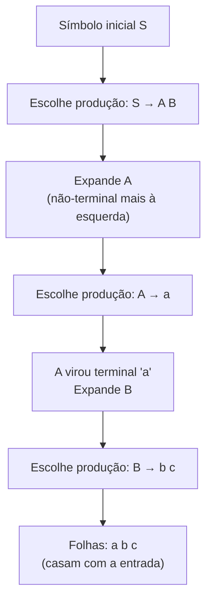
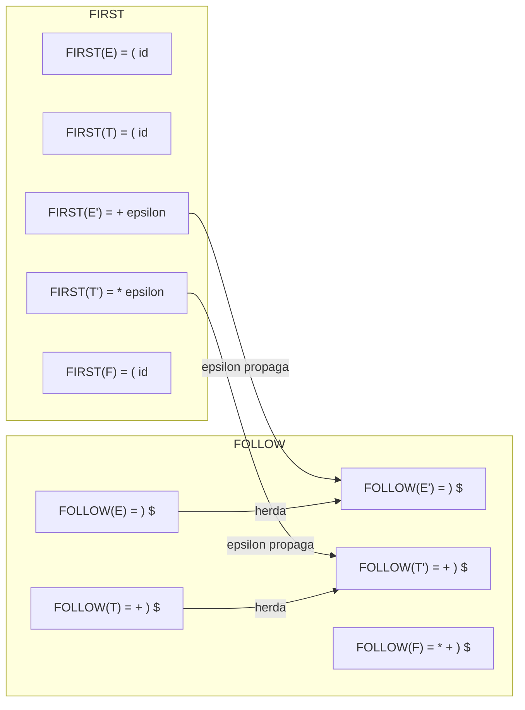
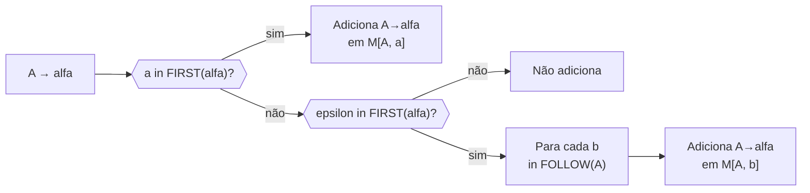
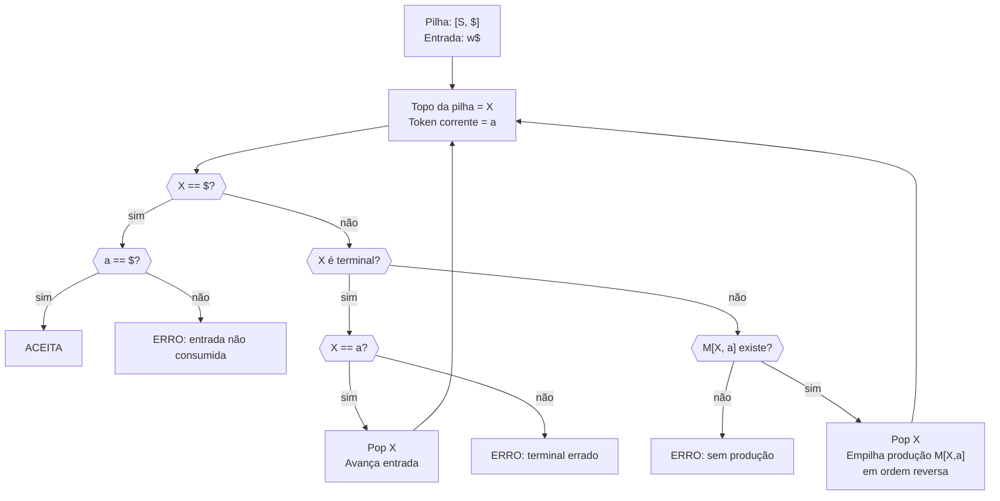
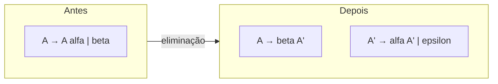
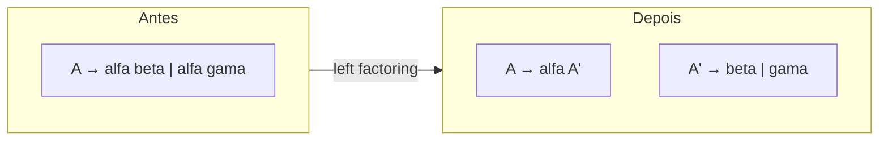

# Parsing top-down formal

> [!abstract] TL;DR
> Parsing top-down constrói a árvore sintática da raiz para as folhas, expandindo produções. Parsing preditivo (LL(1)) faz isso sem backtracking — uma tabela M[A, a], calculada a partir dos conjuntos FIRST e FOLLOW, diz exatamente qual produção aplicar ao ver o símbolo corrente. Gramáticas com recursão à esquerda ou prefixos comuns quebram LL(1) e precisam de transformação antes de entrar na tabela.

---

## Por que precisamos de teoria

[[05 - Recursive descent e Pratt parsing]] mostrou como escrever um parser à mão — você cria uma função para cada não-terminal e decide qual produção usar olhando o próximo token. Funciona. Mas qual a garantia de que vai funcionar? E se você tiver dúvida sobre qual produção escolher? E se duas produções começarem com o mesmo token?

A teoria do parsing LL(1) responde a essas perguntas de modo preciso: ela diz *quando* o truque funciona e *como* construí-lo sistematicamente, sem depender do instinto do programador.

Pense assim: recursive descent é o jazz — você improvisa seguindo o ouvido. LL(1) formal é a partitura que prova que a improvisação nunca vai desafinar.

---

## Parsing top-down — a ideia central

Parsing top-down significa expandir a gramática do símbolo inicial até as folhas (os tokens). A cada passo, você tem uma *sentential form* parcial e precisa decidir qual produção aplicar ao não-terminal mais à esquerda.



> [!info] Leitura do diagrama
> Cada seta é uma substituição de não-terminal por sua produção. A ordem é sempre o não-terminal mais à esquerda — chamamos isso de *leftmost derivation*.

A derivação mais à esquerda (leftmost derivation) é a convenção de top-down: sempre expanda o não-terminal mais à esquerda. Isso garante que a ordem de expansão seja determinística, e é por isso que o "L" do meio em LL(1) significa *Leftmost*.

**Predictive parsing** é top-down sem backtracking: ao ver o token corrente na entrada, você sabe *exatamente* qual produção aplicar, sem precisar tentar e voltar atrás.

---

## Gramáticas LL(k)

LL(k) é uma família de gramáticas definida por três letras:

| Letra | Significado |
|-------|------------|
| **L** | Left-to-right scan — lemos a entrada da esquerda para a direita |
| **L** | Leftmost derivation — sempre expandimos o não-terminal mais à esquerda |
| **(k)** | k tokens de lookahead — olhamos k símbolos à frente para decidir a produção |

Na prática, **k = 1** cobre a maioria das linguagens de programação. LL(1) significa: um único token à frente é suficiente para escolher a produção sem ambiguidade.

LL(2), LL(3), ... existem, mas raramente são necessários. Quando k finito não basta, o ANTLR usa LL(*) — veremos no final.

---

## Conjunto FIRST

> O conjunto FIRST(α) responde à pergunta: *"Quais terminais podem aparecer como primeiro símbolo de uma cadeia derivada de α?"*

Formalmente: FIRST(α) = { a ∈ Terminais | α ⇒* a … } ∪ { ε | se α ⇒* ε }

### Regras de cálculo

1. Se X é terminal: FIRST(X) = { X }
2. Se X → ε: adicione ε a FIRST(X)
3. Se X → Y₁ Y₂ … Yₙ:
   - Adicione FIRST(Y₁) – {ε} a FIRST(X)
   - Se ε ∈ FIRST(Y₁), adicione FIRST(Y₂) – {ε}
   - Continue enquanto o prefixo puder derivar ε
   - Se todos Yᵢ podem derivar ε, adicione ε a FIRST(X)

### Exemplo trabalhado

Considere a gramática de expressões aritméticas:

```text
E  → T E'
E' → + T E' | ε
T  → F T'
T' → * F T' | ε
F  → ( E ) | id
```

Calculando FIRST passo a passo:

- FIRST(id) = { id }           ← terminal
- FIRST(+)  = { + }            ← terminal
- FIRST(*)  = { * }            ← terminal
- FIRST('(') = { ( }           ← terminal
- FIRST(')')= { ) }            ← terminal
- FIRST(F)  = { (, id }        ← F → ( E ) ou F → id
- FIRST(T') = { *, ε }         ← T' → * F T' ou T' → ε
- FIRST(T)  = FIRST(F) = { (, id }   ← T → F T', F não deriva ε
- FIRST(E') = { +, ε }         ← E' → + T E' ou E' → ε
- FIRST(E)  = FIRST(T) = { (, id }   ← E → T E', T não deriva ε

---

## Conjunto FOLLOW

> FOLLOW(A) responde: *"Quais terminais podem aparecer IMEDIATAMENTE DEPOIS do não-terminal A numa derivação?"*

É diferente de FIRST: FOLLOW olha o contexto em que A aparece nas produções de outros não-terminais.

Formalmente: FOLLOW(A) = { a ∈ Terminais | S ⇒* … A a … }. Inclui `$` (fim da entrada) se A pode aparecer no final de uma derivação completa.

### Regras de cálculo

1. Adicione `$` a FOLLOW(S), onde S é o símbolo inicial.
2. Para cada produção B → α A β:
   - Adicione FIRST(β) – {ε} a FOLLOW(A)
   - Se ε ∈ FIRST(β) (ou β é vazio), adicione FOLLOW(B) a FOLLOW(A)
3. Repita até estabilizar (ponto fixo).

### Exemplo trabalhado — mesma gramática

```text
E  → T E'
E' → + T E' | ε
T  → F T'
T' → * F T' | ε
F  → ( E ) | id
```

- FOLLOW(E):  { $, ) }  ← E é símbolo inicial (→ $); aparece em F → ( E ) (→ ) )
- FOLLOW(E'): FOLLOW(E) = { $, ) }  ← E → T E', E' no fim → herda FOLLOW(E)
- FOLLOW(T):  FIRST(E') – {ε} ∪ FOLLOW(E') = { + } ∪ { $, ) } = { +, $, ) }
- FOLLOW(T'): FOLLOW(T) = { +, $, ) }
- FOLLOW(F):  FIRST(T') – {ε} ∪ FOLLOW(T') = { * } ∪ { +, $, ) } = { *, +, $, ) }



> [!info] Leitura do diagrama
> As setas mostram como ε em FIRST propaga FOLLOW para baixo na hierarquia. Quando um símbolo pode derivar ε, quem vem depois dele (no contexto) também pode aparecer depois dele.

---

## A tabela de parsing preditivo LL(1)

A tabela M é uma matriz: linhas = não-terminais, colunas = terminais + `$`. Cada célula M[A, a] contém a produção a usar quando estamos tentando expandir A e o token corrente é a.

### Como preencher a tabela

Para cada produção A → α:

1. Para cada terminal a ∈ FIRST(α): coloque A → α em M[A, a]
2. Se ε ∈ FIRST(α): para cada b ∈ FOLLOW(A), coloque A → α em M[A, b]

Se uma célula recebe duas produções — **conflito LL(1)**: a gramática não é LL(1).

Por que a regra funciona assim? Pense no parser como um detetive. Ele vê o token `a` no topo da pilha de leitura e precisa decidir qual produção de A aplicar. Se `a` pode INICIAR uma derivação de α (ou seja, `a ∈ FIRST(α)`), a produção A → α é candidata. Se α pode derivar vazio (ε ∈ FIRST(α)), então a produção pode ser usada quando `a` é algo que vem *depois* de A — ou seja, `a ∈ FOLLOW(A)`. A tabela captura exatamente essa lógica de decisão.



> [!info] Leitura do diagrama
> Dois caminhos levam uma produção à tabela: pelo que ela pode INICIAR (FIRST), ou porque pode derivar vazio e o token está no FOLLOW do não-terminal.

### Tabela para a gramática de expressões

|    | **id** | **+** | __*__ | **(**  | **)** | **$** |
|----|--------|-------|-------|--------|-------|-------|
| E  | E→TE'  |       |       | E→TE'  |       |       |
| E' |        | E'→+TE'|      |        | E'→ε  | E'→ε  |
| T  | T→FT'  |       |       | T→FT'  |       |       |
| T' |        | T'→ε  | T'→*FT'|       | T'→ε  | T'→ε  |
| F  | F→id   |       |       | F→(E)  |       |       |

> [!success] Nenhum conflito!
> Cada célula tem no máximo uma produção. Esta gramática é LL(1).

---

## O algoritmo table-driven com pilha explícita

Recursive descent implementa LL(1) via código (chamadas de função recursivas). A alternativa equivalente é um parser **dirigido por tabela** com uma pilha explícita — mais fácil de verificar formalmente.



> [!info] Leitura do diagrama
> O parser mantém uma pilha onde o topo é sempre o próximo símbolo esperado. Se for terminal, ele deve casar com o token corrente. Se for não-terminal, consulta a tabela e empilha a produção (em ordem reversa, para que o símbolo mais à esquerda fique no topo).

### Exemplo de execução — parsear `id + id * id`

| Pilha           | Entrada         | Ação                          |
|-----------------|-----------------|-------------------------------|
| E $             | id + id * id $  | M[E, id] = E→TE'              |
| T E' $          | id + id * id $  | M[T, id] = T→FT'              |
| F T' E' $       | id + id * id $  | M[F, id] = F→id               |
| id T' E' $      | id + id * id $  | Casa id, avança                |
| T' E' $         | + id * id $     | M[T', +] = T'→ε               |
| E' $            | + id * id $     | M[E', +] = E'→+TE'            |
| + T E' $        | + id * id $     | Casa +, avança                 |
| T E' $          | id * id $       | M[T, id] = T→FT'              |
| F T' E' $       | id * id $       | M[F, id] = F→id               |
| id T' E' $      | id * id $       | Casa id, avança                |
| T' E' $         | * id $          | M[T', *] = T'→*FT'            |
| * F T' E' $     | * id $          | Casa *, avança                 |
| F T' E' $       | id $            | M[F, id] = F→id               |
| id T' E' $      | id $            | Casa id, avança                |
| T' E' $         | $               | M[T', $] = T'→ε               |
| E' $            | $               | M[E', $] = E'→ε               |
| $               | $               | ACEITA                        |

---

## O que torna uma gramática LL(1)?

Uma gramática é LL(1) se e somente se a tabela preditiva não tem conflitos. Duas situações típicas causam conflitos:

### (a) Recursão à esquerda

Produção do tipo A → A α causa loop infinito no top-down: para expandir A, você precisa expandir A novamente, sem consumir nenhum token.

> [!danger] Recursão à esquerda é letal para parsers LL
> O parser table-driven entra em loop infinito e nunca avança na entrada. Recursive descent explode a pilha de chamadas.

[[05 - Recursive descent e Pratt parsing]] mencionou o problema. Aqui está a formalização:

**Eliminação de recursão à esquerda imediata:**

```text
A → A α | β
```

Vira:

```text
A  → β A'
A' → α A' | ε
```



> [!info] Leitura do diagrama
> A recursão à esquerda (A no início da produção) vira recursão à direita (A' no final). A derivação produz a mesma linguagem, mas agora o parser não precisa se expandir infinitamente antes de consumir um token.

**Exemplo:**

```text
Antes:  E → E + T | T
Depois: E  → T E'
        E' → + T E' | ε
```

Reconhece a mesma linguagem, sem recursão à esquerda.

**Recursão à esquerda indireta** (A → B α, B → A β) é eliminada primeiro convertendo para direta e depois aplicando o algoritmo acima.

### (b) Falta de fatoração à esquerda

Duas produções com prefixo comum:

```text
A → α β | α γ
```

Ambas colocam a mesma produção em M[A, FIRST(α)] — conflito!

**Left factoring** fatora o prefixo:

```text
A  → α A'
A' → β | γ
```



> [!info] Leitura do diagrama
> O prefixo comum alfa é fatorado. Agora o parser consome alfa e só então decide entre beta e gama, usando o lookahead nesse ponto posterior.

**Exemplo:**

```text
Antes:  stmt → if expr then stmt
              | if expr then stmt else stmt

Depois: stmt    → if expr then stmt stmt'
        stmt'   → else stmt | ε
```

> [!warning] O dangling-else ainda é ambíguo!
> Left factoring resolveu a FORMA, mas a semântica do `else` associando ao `if` mais próximo ou mais distante fica indefinida na gramática. Linguagens como C e Java resolvem por convenção (else sempre associa ao if mais próximo), não pela gramática em si.

---

## Por que algumas linguagens não são LL(1)?

Algumas construções exigem mais de um token de lookahead para a decisão, ou são inerentemente ambíguas para qualquer LL(k) finito.

- **Dangling-else** — como visto acima.
- **C com typedef** — `T *p` pode ser declaração ou multiplicação; resolver exige saber se T é um tipo (informação semântica, não sintática).
- **Expressões com prefixo arbitrário** — `a.b.c.d.e()` pode exigir consumir toda a cadeia antes de saber se é chamada ou acesso.

### LL(*) e ANTLR — a evolução adaptativa

O ANTLR v4 usa o algoritmo **ALL(\*)** (Adaptive LL): em vez de pré-calcular conjuntos de lookahead estaticamente, o parser toma decisões em tempo de execução usando autômatos adaptativos. Se um lookahead de k tokens não resolve a ambiguidade, ele expande k dinamicamente.

A vantagem: aceita quase toda gramática sem ambiguidade real, sem pedir transformações manuais. O custo: análise em tempo de execução (ainda que cacheada, o *warm-up* tem custo).

> [!tip] Quando usar LL(*)?
> Para ferramentas de produção com gramáticas complexas (SQL, Java, C#), LL(*) via ANTLR poupa horas de refatoração manual. Para compiladores de alto desempenho onde a gramática é controlada, LL(1) manual ou table-driven é mais previsível.

---

## Table-driven × Recursive descent — a dualidade

> [!example] Dois lados da mesma moeda
> Recursive descent à mão IS o parser LL(1) dirigido por código. A função para o não-terminal A consulta implicitamente o lookahead (com `if/switch`) e escolhe a produção — exatamente o que M[A, a] faz explicitamente.

```text
Table-driven:           Recursive descent:
------------------      ------------------
pilha explícita         pilha implícita (call stack)
loop principal          mutuamente recursivo
fácil de depurar        mais legível por humanos
fácil de modificar      melhor para parsers handwritten
```

A equivalência garante que tudo que funciona em recursive descent funciona em table-driven e vice-versa — para gramáticas LL(1).

---

## Conexões

- Anterior: [[06 - A AST e o padrão visitor]] — o que o parser produz
- Próxima: [[08 - Parsing bottom-up]] — LR, reduce-reduce, a outra família
- [[05 - Recursive descent e Pratt parsing]] — a implementação prática da teoria desta nota
- [[04 - Gramáticas e a árvore sintática]] — CFGs, derivações, ambiguidade

---

> [!summary] Resumo em uma linha
> Parsing LL(1) constrói a árvore da raiz para as folhas, guiado por uma tabela M[A, a] preenchida com FIRST e FOLLOW — funciona se e somente se a gramática não tem recursão à esquerda, prefixos comuns irresolvidos, ou ambiguidade real.

---

## Em entrevista

Em entrevistas sobre compiladores (ou mesmo sobre design de linguagens), saber articular LL(1) em inglês técnico abre portas:

*"Top-down parsing builds the parse tree from the root, applying leftmost derivations. Predictive parsing eliminates backtracking by computing FIRST and FOLLOW sets to fill a parsing table M[A, a]. A grammar is LL(1) if and only if the table has no conflicts — which requires eliminating left recursion and applying left factoring to remove common prefixes. Recursive descent is essentially a code-driven implementation of the same algorithm, with the call stack substituting for an explicit stack."*

*"The FIRST set of a symbol alpha tells you which terminals can start a derivation of alpha; the FOLLOW set of a nonterminal A tells you which terminals can legally appear immediately after A in a complete derivation. Together they define exactly which production to choose."*

*"Left recursion causes infinite expansion in top-down parsers before any token is consumed. The standard fix rewrites A → A alpha | beta as A → beta A' and A' → alpha A' | epsilon, producing the same language with right recursion instead."*

*"Left factoring handles productions with a shared prefix: A → alpha beta | alpha gamma becomes A → alpha A' with A' → beta | gamma, deferring the choice until after the common prefix is consumed."*

*"The dangling-else problem shows a grammar that is not LL(1) even after factoring — the ambiguity is semantic, not syntactic, and is resolved by convention, not grammar transformation."*

*"ANTLR's ALL(*) algorithm extends LL parsing adaptively at runtime, using augmented transition networks to decide lookahead dynamically rather than fixing k statically."*

*"The LL(1) parsing table is filled by: for each A → alpha, add the production to M[A, a] for every a in FIRST(alpha); if epsilon is in FIRST(alpha), also add it for every token in FOLLOW(A)."*

*"Recursive descent and table-driven LL(1) are isomorphic: one uses the call stack implicitly, the other manages an explicit stack in a loop — same algorithm, different representation."*

### Vocabulário PT → EN

| Português | Inglês |
|-----------|--------|
| Parsing top-down | Top-down parsing |
| Conjunto FIRST | FIRST set |
| Conjunto FOLLOW | FOLLOW set |
| Tabela preditiva | Predictive parsing table |
| Símbolo de lookahead | Lookahead symbol |
| Recursão à esquerda | Left recursion |
| Fatoração à esquerda | Left factoring |
| Gramática LL(1) | LL(1) grammar |
| Derivação mais à esquerda | Leftmost derivation |
| Símbolo inicial | Start symbol |
| Produção | Production (rule) |
| Pilha explícita | Explicit stack |
| Forma sentencial | Sentential form |
| Conflito na tabela | Table conflict |
| Análise preditiva | Predictive analysis / predictive parsing |
| Analisador sintático | Parser |

---

> [!info] Lastro
> - Aho, A. V., Lam, M. S., Sethi, R., & Ullman, J. D. (2006). *Compilers: Principles, Techniques, and Tools* (2ª ed.). Addison-Wesley. Capítulo 4.4: Non-Recursive Predictive Parsing — apresenta FIRST, FOLLOW e a tabela preditiva. [Exercícios da seção 4.4](https://dragon-book.jcf94.com/book/ch04/4.4/4.4.html)
> - Cooper, K. D., & Torczon, L. (2022). *Engineering a Compiler* (3ª ed.). Morgan Kaufmann / Elsevier. Capítulo 3: Parsers — cobre parsing top-down com análise formal de FIRST/FOLLOW. [ScienceDirect](https://www.sciencedirect.com/book/9780128154120/engineering-a-compiler)
> - Appel, A. W. (1998). *Modern Compiler Implementation in ML*. Cambridge University Press. Capítulo 3: Parsing — FIRST, FOLLOW, gramáticas LL e construção de tabelas. [Cambridge Core](https://www.cambridge.org/core/books/abs/modern-compiler-implementation-in-ml/parsing/F39547575080141406963B5E4E73490C)
> - Parr, T., Harwell, S., & Fisher, K. (2014). Adaptive LL(*) Parsing: The Power of Dynamic Analysis. *ACM SIGPLAN Notices*, 49(10). [DOI 10.1145/2714064.2660202](https://dl.acm.org/doi/10.1145/2714064.2660202) — artigo original do algoritmo ALL(*) usado no ANTLR4. [PDF técnico](https://www.antlr.org/papers/allstar-techreport.pdf)
> - ANTLR Project. *About the ANTLR Parser Generator*. [antlr.org/about.html](https://www.antlr.org/about.html) — documentação oficial do gerador de parsers LL(*) adaptativo.
