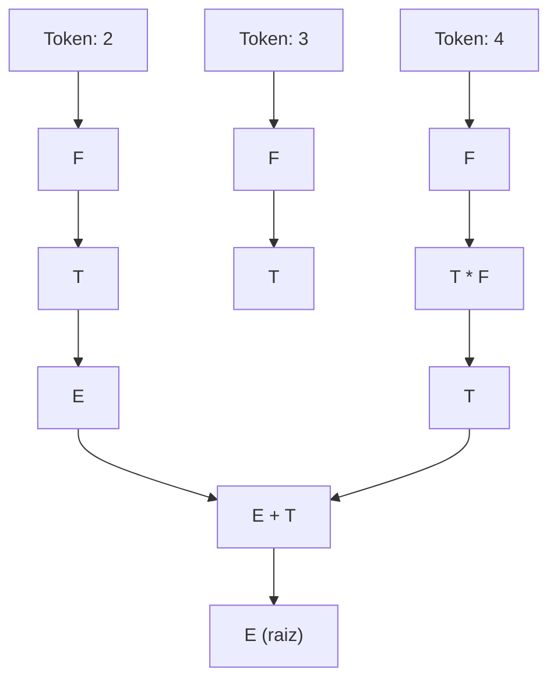
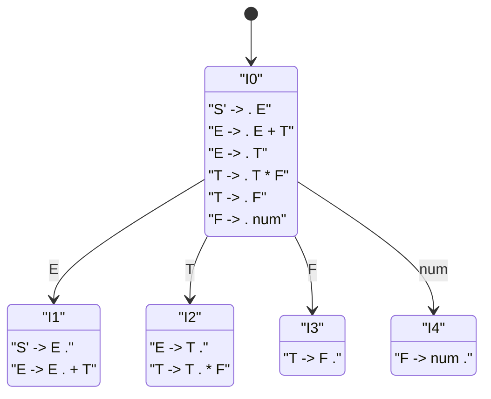
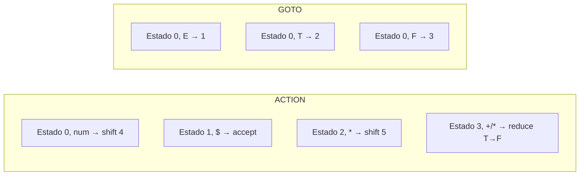
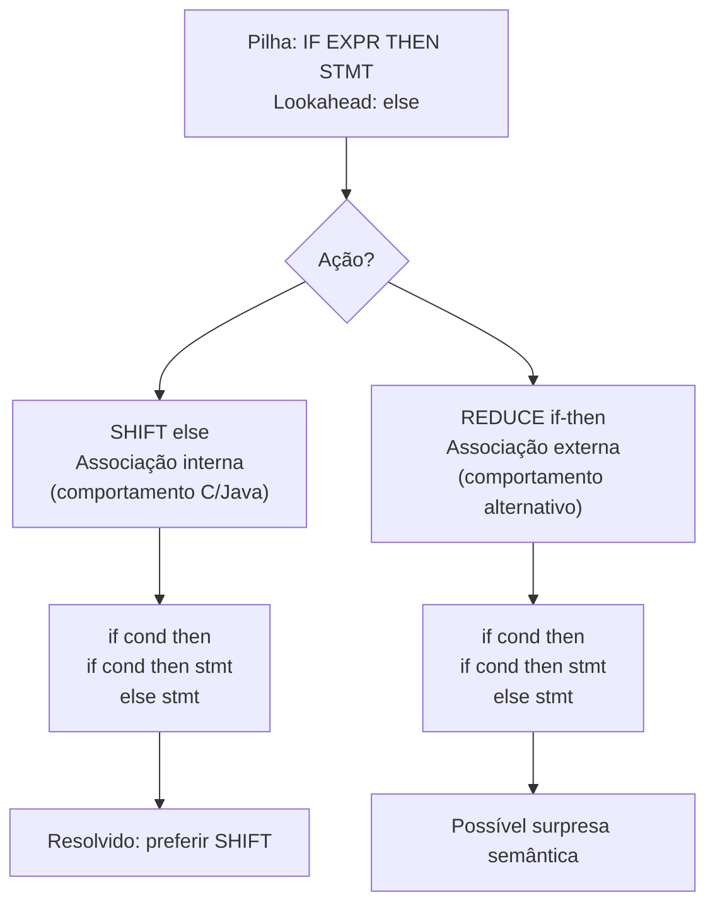
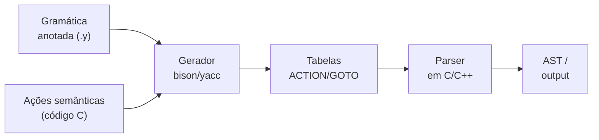

# Parsing bottom-up

> [!abstract] TL;DR
> Bottom-up parsing constrói a árvore sintática das folhas (tokens) para a raiz, empurrando tokens para uma pilha (SHIFT) e reduzindo sequências ao não-terminal da regra (REDUCE). A família LR — com LALR como ponto-doce — é mais poderosa que LL porque decide a produção *depois* de ver o lado direito inteiro. A indústria, porém, migrou para recursive descent à mão por mensagens de erro e recuperação superiores.

---

## O que muda em relação ao top-down?

Em [[07 - Parsing top-down formal]] vimos que um parser LL começa pela raiz da gramática e *expande* produções até chegar nos tokens. Imagine construir um quebra-cabeça encaixando as peças de fora para dentro.

Bottom-up faz o inverso: você pega as peças individuais — os tokens — e vai *juntando grupos* até restar uma única peça: o símbolo inicial da gramática. É como montar o puzzle das bordas para o centro.

A consequência prática é enorme. Um parser LL precisa escolher qual produção usar *antes* de consumir o lado direito. Um parser LR espera, consome tudo, e *então* decide. Mais informação = mais poder expressivo.

O nome "LR" vem do padrão de consumo: **L** = lê a entrada da esquerda para a direita; **R** = produz uma derivação mais-à-direita (rightmost derivation) ao contrário. Ao desfazer as reduções do parser, você obtém exatamente a sequência de passos de uma derivação canônica direita — uma propriedade elegante com implicações para a análise semântica subsequente.

Praticamente toda gramática de linguagem de programação real foi projetada para ser LR(1) — e geralmente LALR(1). Isso não é coincidência: as linguagens foram projetadas assim porque os parsers LR existiam e eram eficientes.

---

## As duas ações fundamentais: SHIFT e REDUCE

Um parser bottom-up opera sobre dois componentes:

- **Pilha**: armazena símbolos já processados (terminais e não-terminais).
- **Entrada restante**: os tokens ainda não consumidos.

Há exatamente duas ações possíveis (mais ACCEPT e ERROR):

**SHIFT**: consume o próximo token da entrada e empilha-o.

**REDUCE**: identifica que o topo da pilha é o lado direito de alguma produção `A → α`, retira `α` da pilha e empilha `A`.

A pergunta que o parser deve responder a cada passo é: *shiftar ou reduzir?* E se reduzir, *qual* produção? Essa decisão é guiada pela tabela LR — mas antes de chegar nela, precisamos entender o conceito de handle.

---

## O handle: a peça que deve ser reduzida agora

**Handle** é a subsequência no topo da pilha que casa com o lado direito de alguma produção e que, se reduzida, leva o parser a uma derivação válida. A palavra-chave é *agora*: pode haver múltiplos casamentos possíveis, mas apenas um deles faz parte da derivação correta.

É tentador pensar que basta achar qualquer sequência no topo que casa com alguma produção e reduzir. Errado. Em gramáticas ambíguas ou com produções sobrepostas, a escolha errada conduz a um beco sem saída. O autômato LR é o mecanismo que garante encontrar o handle certo.

Encontrar o handle é o problema central do parsing bottom-up. Se você errar e reduzir a peça errada, o parser entra em um estado inválido irrecuperável (em gramáticas determinísticas).

> [!tip] Analogia do cubo de Rubik
> O handle é como o grupo de peças que você *deve* girar neste momento para avançar a solução. Girar o grupo errado pode desfazer trabalho anterior ou criar um estado insolúvel.

---

## Trace passo a passo: `2 + 3 * 4`

Vamos usar uma gramática simplificada de expressões com precedência:

```text
E → E + T
E → T
T → T * F
T → F
F → num
```

O parser processa `2 + 3 * 4` assim (pilha à esquerda, entrada restante à direita):

```text
Passo  Pilha           Entrada       Ação
  1    $               2 + 3 * 4 $   SHIFT 2
  2    $ 2             + 3 * 4 $     REDUCE F → num
  3    $ F             + 3 * 4 $     REDUCE T → F
  4    $ T             + 3 * 4 $     REDUCE E → T
  5    $ E             + 3 * 4 $     SHIFT +
  6    $ E +           3 * 4 $       SHIFT 3
  7    $ E + 3         * 4 $         REDUCE F → num
  8    $ E + F         * 4 $         REDUCE T → F
  9    $ E + T         * 4 $         SHIFT *     ← NÃO reduz E + T ainda!
 10    $ E + T *       4 $           SHIFT 4
 11    $ E + T * 4     $             REDUCE F → num
 12    $ E + T * F     $             REDUCE T → T * F
 13    $ E + T         $             REDUCE E → E + T
 14    $ E             $             ACCEPT
```

No passo 9, o parser *não* reduz `E + T` pela regra `E → E + T` porque o próximo token é `*`, que tem precedência maior. O LALR sabe disso via lookahead. Isso garante que `3 * 4` seja agrupado primeiro — exatamente a precedência correta.

---

## Diagrama: fluxo conceitual bottom-up



> [!info] Leitura do diagrama
> Os tokens individuais aparecem na base. As setas sobem mostrando cada redução: `num → F → T`. O `*` agrupa `T * F` antes que o `+` agrupe `E + T`, refletindo a precedência capturada pela gramática.

---

## A família LR: quatro gerações

Todos os parsers da família LR são shift-reduce, mas diferem em *quanta informação contextual* usam para tomar decisões:

**LR(0)**: usa só o estado atual da pilha, sem olhar o próximo token. O mais fraco. Produz tabelas com muitos conflitos mesmo em gramáticas simples.

**SLR(1)** (Simple LR): usa o estado mais o conjunto FOLLOW do não-terminal para decidir quando reduzir. Resolve conflitos que LR(0) não resolve, com tabelas do mesmo tamanho.

**LR(1) canônico**: carrega, em cada estado do autômato, exatamente qual lookahead é válido para cada redução. Máximo poder. Problema: o número de estados explode (pode ser dezenas de vezes maior que LALR).

**LALR(1)** (Look-Ahead LR): começa como LR(1) canônico, mas *mescla* estados com o mesmo núcleo de itens. Obtém tabelas do mesmo tamanho que SLR, com poder quase igual ao LR(1). É o ponto-doce da prática: yacc, bison, e a maioria dos geradores clássicos geram LALR(1).

A hierarquia formal é:

**LR(0) ⊂ SLR(1) ⊂ LALR(1) ⊂ LR(1)**

Cada classe reconhece estritamente mais gramáticas que a anterior. Linguagens de programação reais geralmente se encaixam em LALR(1) com pequenos ajustes.

---

## O autômato de itens LR(0)

Um **item LR(0)** é uma produção com um ponto (•) indicando quanto foi processado. Por exemplo, para a produção `E → E + T` há quatro itens possíveis:

```text
E → • E + T       (nada foi processado; esperando E)
E → E • + T       (vimos E; esperando +)
E → E + • T       (vimos E +; esperando T)
E → E + T •       (lado direito completo: reduz!)
```

Quando o ponto está no final, o item é chamado de **item completo** — ele sinaliza que essa produção pode ser reduzida.

O autômato é construído por dois algoritmos cooperantes:

**Closure(I)**: dado um conjunto de itens `I`, se algum item tem `• A` (ponto antes de um não-terminal), adicione todos os itens iniciais de *todas* as produções de `A`. Repita até estabilizar (ponto fixo). A intuição: se o parser está esperando por `A`, ele também precisa estar preparado para reconhecer tudo que pode começar `A`.

Exemplo com nossa gramática: começamos de `{S' → • E}`. Como o ponto está antes de `E`, adicionamos `{E → • E + T, E → • T}`. O ponto antes de `T` traz `{T → • T * F, T → • F}`. O ponto antes de `F` traz `{F → • num}`. Nenhum novo não-terminal: closure fecha.

**Goto(I, X)**: dado um conjunto de itens `I` e um símbolo `X`, retorna o closure do conjunto de todos os itens de `I` onde o ponto avança sobre `X`. Em outras palavras: "se consumirmos `X` em qualquer um desses itens, para onde vamos?"

O conjunto inicial do autômato é o closure de `{S' → • S}`, onde `S'` é o símbolo-meta adicionado à gramática augmentada. Isso garante um único estado de aceitação (`S' → S •`).

> [!tip] Por que augmentar a gramática?
> Adicionando a produção `S' → S`, o parser tem exatamente um estado de aceitação e uma única redução final. Sem isso, múltiplas produções poderiam ser o ponto de partida, complicando a construção das tabelas.

---

## Fragmento do autômato de itens



> [!info] Leitura do diagrama
> Cada caixa é um estado do autômato. O ponto (.) marca o quanto da produção já está na pilha. `I1` tem `S' -> E .` (aceitar se a entrada acabou) e `E -> E . + T` (aguardar `+`). `I3` e `I4` são itens completos: ao chegar neles, o parser reduz.

---

## A tabela ACTION/GOTO

O autômato de itens se transforma em duas sub-tabelas:

**ACTION[estado, terminal]**: o que fazer ao ver um terminal.
- `shift k` → empilha o token e vai para o estado `k`
- `reduce A → α` → retira `|α|` estados da pilha, reduz a `A`
- `accept` → entrada consumida com sucesso
- vazio → erro de sintaxe

**GOTO[estado, não-terminal]**: após uma redução a `A`, para qual estado ir.



> [!info] Leitura do diagrama
> As células ACTION determinam o próximo passo com base no estado atual e no terminal visto. As células GOTO determinam para qual estado ir após uma redução, com base no não-terminal gerado.

### O loop principal do parser LR

Um detalhe crucial que geralmente fica implícito: a pilha do parser LR não armazena apenas símbolos — ela armazena **estados**. A cada momento, o topo da pilha é o estado atual. O algoritmo é:

```text
loop:
  s = estado no topo da pilha
  a = próximo token da entrada

  se ACTION[s, a] = shift t:
    empilha t (o estado t)
    avança a entrada

  se ACTION[s, a] = reduce A → β:
    desempilha |β| estados          (|β| = tamanho do lado direito)
    s' = estado agora no topo
    empilha GOTO[s', A]             (estado de destino após produzir A)
    NÃO avança a entrada

  se ACTION[s, a] = accept:
    parse bem-sucedido; termina

  se ACTION[s, a] = erro:
    rotina de recuperação de erro
```

Note que na redução o token `a` não é consumido — ele volta a ser o lookahead para o próximo ciclo, agora no novo estado após a redução. Isso permite que o mesmo token participe da decisão "shift vs. reduce" múltiplas vezes conforme a pilha muda.

---

## Por que LR reconhece mais que LL?

A distinção fundamental: um parser LL(k) decide qual produção usar *antes* de processar o lado direito, com no máximo `k` tokens de lookahead. Um parser LR(k) decide *depois* de ver o lado direito inteiro, acrescido de `k` tokens.

Pense assim: LL aposta em qual produção aplicar antes de ver as cartas. LR espera a rodada terminar e *então* decide. Com mais cartas na mão, LR erra menos.

Isso tem uma consequência imediata: LR lida naturalmente com **recursão à esquerda** (`E → E + T`), que é expressamente proibida em LL. Gramáticas com recursão à esquerda são naturais e compactas — elas expressam diretamente a associatividade à esquerda dos operadores aritméticos. As transformações necessárias para LL (fatoração, eliminação de recursão) as tornam mais complexas e menos intuitivas.

Outra vantagem: LR detecta erros de sintaxe mais cedo. Um parser LL pode consumir vários tokens tentando encontrar uma produção válida antes de desistir. Um parser LR detecta o erro assim que o próximo token não casa com nenhuma ação válida no estado atual — às vezes um token mais cedo.

Do ponto de vista teórico, LR(1) reconhece exatamente os DCFLs (Deterministic Context-Free Languages) — o limite do que parsers determinísticos com uma pilha conseguem fazer. LL(k), para qualquer k fixo, fica aquém: há DCFLs que não são LL(k) para nenhum k, mas são LR(1).

---

## Conflitos: quando o autômato não sabe o que fazer

> [!danger] Conflitos são armadilhas de projeto de gramática
> Um conflito não é erro de implementação — é sinal de que a gramática (ou a categoria LR escolhida) não consegue tomar a decisão deterministica que o parsing exige.

**Conflito shift-reduce**: em um dado estado e lookahead, o parser pode tanto shifttar quanto reduzir. O exemplo canônico é o **dangling else**:

```text
stmt → if expr then stmt
stmt → if expr then stmt else stmt
```

Após `if expr then stmt`, ao ver `else`, o parser pode:
- **Shift** o `else` (associar ao `if` mais interno — comportamento usual)
- **Reduce** o `if-then` sem o else (associar o `else` ao `if` externo)

A resolução padrão é preferir **shift**, o que implementa a regra "else casa com o if mais próximo". Geradores como bison adotam isso como padrão e reportam um aviso, não um erro.

**Conflito reduce-reduce**: duas produções diferentes poderiam ser aplicadas no mesmo estado com o mesmo lookahead. Isso geralmente indica gramática genuinamente ambígua ou mal projetada. É o conflito mais grave porque não há uma resolução óbvia como no shift-reduce: o gerador precisa escolher uma das produções arbitrariamente, ou o projetista deve reescrever a gramática.

### Resolução por precedência declarada

Geradores modernos como bison permitem declarar precedência e associatividade de tokens diretamente na especificação da gramática:

```text
%left  '+'           /* + é associativo à esquerda, baixa precedência */
%left  '*'           /* * é associativo à esquerda, maior precedência */
%right UMINUS        /* menos unário, maior precedência ainda */
```

Quando um conflito shift-reduce ocorre entre reduzir pela produção `E → E + E` e shifttar `*`, o gerador consulta a tabela de precedências: `*` tem maior precedência que `+`, então shift vence. Quando tokens têm a mesma precedência e são associativos à esquerda, reduce vence (implementando `a + b + c` como `(a + b) + c`).

Esse mecanismo permite escrever gramáticas ambíguas de forma compacta e resolver os conflitos declarativamente — sem precisar reescrever a gramática com múltiplos não-terminais de precedência explícita.

> [!success] Precedência declarada é elegante
> Em vez de escrever `E → E + T`, `T → T * F`, `F → num | '(' E ')'` (três camadas de não-terminais), você pode escrever `E → E + E | E * E | num | '(' E ')'` e declarar as precedências. A gramática fica menor; o gerador resolve os conflitos.

---

## Diagrama: conflito dangling else



> [!info] Leitura do diagrama
> O conflito nasce porque a gramática é inerentemente ambígua para `else`. A resolução por preferência de SHIFT é uma convenção, não uma propriedade da gramática. Bison a implementa automaticamente e emite um aviso `1 shift/reduce conflict`.

---

## Geradores de parser: yacc, bison e ANTLR

O fluxo típico com um gerador LALR:



> [!info] Leitura do diagrama
> O programador escreve a gramática anotada com ações semânticas (ex.: construir nós da AST). O gerador produz as tabelas e o esqueleto do parser. O código C das ações é embutido diretamente no parser gerado.

**yacc** (Yet Another Compiler Compiler): o original, 1973, de Stephen C. Johnson na Bell Labs. Gerou LALR(1) e moldou a geração de parsers por décadas.

**GNU Bison**: substituto yacc-compatível, ainda ativo (versão 3.8.x). Suporta LALR(1), LR(1) canônico, IELR(1) e GLR. É a referência atual para parsing baseado em tabelas.

**ANTLR**: usa LL(*) (LL com lookahead adaptativo). Sintaxe mais amigável, melhor integração com IDEs. Popular em ferramentas, DSLs e ferramental de linguagens JVM. Não é LR — mas gera parsers que para a maioria das gramáticas práticas funcionam bem sem exigir que o projetista entenda tabelas de estados.

**menhir** (OCaml): gerador LR(1) moderno, muito usado em compiladores acadêmicos e de pesquisa. Produz parsers com garantias formais verificáveis e suporte a mensagens de erro customizadas por estado — um passo importante em direção ao que recursive descent oferece nativamente.

> [!example] Fragmento de gramática bison
> ```text
> expr : expr '+' term   { $$ = $1 + $3; }
>      | term            { $$ = $1; }
>      ;
> term : term '*' factor { $$ = $1 * $3; }
>      | factor          { $$ = $1; }
>      ;
> ```
> As ações `{ ... }` em C executam quando a redução ocorre. `$$` é o valor do não-terminal produzido; `$1`, `$3` são valores dos símbolos do lado direito.

---

## A tensão academia × indústria

A academia ama parsers LR: são teoricamente elegantes, reconhecem a classe máxima de linguagens determinísticas, e geradores tornam o processo quase automático a partir de uma especificação formal.

A indústria conta uma história diferente.

**GCC** usou bison para C e C++ por muitos anos. Em 2004 (GCC 3.4), o parser C++ foi reescrito à mão como recursive descent. Em 2006 (GCC 4.1), o mesmo aconteceu com C e Objective-C. O motivo principal: C++ não é LALR(1) — requer lookahead não-limitado em várias construções (declarações vs. expressões, templates). O bison produzia soluções workaround frágeis com estados falsos no lexer.

**Clang** (LLVM) nasceu já com recursive descent à mão para C, C++ e Objective-C. A filosofia explícita dos desenvolvedores: mensagens de erro de qualidade e recuperação de erro são cidadãos de primeira classe, não características adicionadas depois. Parsers gerados por tabela dificultam enormemente ambos.

**V8** (JavaScript no Chrome) e o parser do **Rust** seguem o mesmo caminho.

O problema não é só a complexidade gramatical. É o ciclo de desenvolvimento. Com um gerador, você edita a gramática, roda o gerador, e o parser novo emerge. Mas quando surge um bug de parsing sutil — e em C++ eles são frequentes — você depura as tabelas geradas, não o código humano. Rastrear um conflito em uma tabela com centenas de estados é árido. Um parser recursive descent manual tem a lógica exposta em funções que um engenheiro pode ler e depurar diretamente.

Há também a questão das **mensagens de erro**. Um parser LR em erro simplesmente entra em um estado sem ação válida na tabela. Produzir uma mensagem útil — `expected ';' after expression` em vez de `syntax error` — exige trabalho extra considerável (tabelas de mensagens, mapeamento de estado → diagnóstico, estratégias de recuperação como panic mode ou reinserção de tokens). Um parser recursive descent manual pode emitir exatamente a mensagem certa porque sabe o contexto sintático em que está: a função `parseIfStatement()` sabe que está parseando um `if` e pode dizer `expected 'then' after condition`.

A conclusão honesta: para DSLs e linguagens bem-comportadas (LALR(1) sem gambiarras), geradores como bison são produtivos e corretos. Para linguagens de produção com sintaxe complexa e alta exigência de qualidade de diagnóstico, a indústria prefere o controle cirúrgico do recursive descent à mão — e paga esse custo conscientemente. Veja [[05 - Recursive descent e Pratt parsing]] para o contraste direto.

> [!warning] Não é uma dicotomia simples
> Alguns compiladores modernos combinam as abordagens: um parser LR para o núcleo estável da linguagem e recursive descent manual para extensões ou recuperação de erro. A escolha depende da complexidade sintática e das prioridades do projeto.

---

## Conexões

- Anterior: [[07 - Parsing top-down formal]] — LL(k), tabelas preditivas, limitações
- Próxima: [[09 - Tabela de símbolos, escopo e resolução de nomes]] — o que acontece após a árvore estar pronta
- [[05 - Recursive descent e Pratt parsing]] — a alternativa industrial ao LR
- [[04 - Gramáticas e a árvore sintática]] — fundação: produções, derivação, árvore de parse

> [!summary] Resumo em uma linha
> Bottom-up parsing empilha tokens (SHIFT) e colapsa handles ao não-terminal da produção (REDUCE); a família LR automatiza esse processo via autômato de itens e tabela ACTION/GOTO, com LALR como ponto-doce entre poder e tamanho de tabela.

---

## Em entrevista

Parsing bottom-up aparece em entrevistas de compiladores, sistemas e linguagens. Seja capaz de traçar um shift-reduce à mão, explicar o autômato de itens e articular a diferença entre os membros da família LR.

*"Bottom-up parsing builds the parse tree from the leaves up to the root by repeatedly identifying a handle on the stack and reducing it to the corresponding non-terminal."*

*"The two fundamental actions are SHIFT — push the next input token onto the stack — and REDUCE — replace the top of the stack with the non-terminal of a matching production."*

*"A handle is the substring at the top of the stack that matches the right-hand side of a production and whose reduction advances the parser toward a valid parse."*

*"An LR(0) item is a production with a dot marking how far we've matched; the collection of sets of items forms the states of the LR automaton."*

*"LALR(1) merges states that share the same LR(0) core but differ only in lookahead sets, giving tables as compact as SLR but with power close to canonical LR(1) — that's why yacc and bison use it."*

*"A shift-reduce conflict means the parser can either shift the next token or reduce the current handle; the dangling-else ambiguity is the canonical example, resolved by preferring shift."*

*"GCC replaced its Bison-generated parsers with hand-written recursive descent between 2004 and 2006 because C++ is not LALR(1) and because handwritten parsers give much better error messages and error recovery."*

*"ANTLR generates LL(*) parsers, not LR; the choice between LR generators like Bison and LL generators like ANTLR depends on the grammar's structure and the project's needs for error quality."*

| Português | English |
|---|---|
| parsing bottom-up | bottom-up parsing |
| shift (empilhar) | shift |
| reduce (reduzir) | reduce |
| handle | handle |
| parser LR | LR parser |
| LALR | LALR |
| autômato de itens | item automaton / LR automaton |
| item LR (com ponto) | LR item (dotted item) |
| conflito shift-reduce | shift-reduce conflict |
| conflito reduce-reduce | reduce-reduce conflict |
| gerador de parser | parser generator |
| tabela de análise | parsing table |
| gramática ambígua | ambiguous grammar |
| lookahead | lookahead |
| recursive descent à mão | hand-written recursive descent |

---

> [!info] Lastro
> - Aho, Lam, Sethi, Ullman. *Compilers: Principles, Techniques, and Tools* (2ª ed., "Dragon Book"). Addison-Wesley, 2007. Cap. 4.5–4.7: LR parsing, construção de tabelas SLR e LALR. Disponível em: https://www.pearson.com/en-us/subject-catalog/p/Aho-Compilers-Principles-Techniques-and-Tools-2nd-Edition/P200000003472
> - Knuth, D. E. "On the Translation of Languages from Left to Right." *Information and Control*, v. 8, n. 6, pp. 607–639, 1965. O artigo original que inventou os parsers LR(k). Disponível via Semantic Scholar: https://www.semanticscholar.org/paper/On-the-Translation-of-Languages-from-Left-to-Right-Knuth/fc230d6b4e6d275bff21b64dd0f457f07a92055f
> - Cooper, K. D.; Torczon, L. *Engineering a Compiler* (3ª ed.). Morgan Kaufmann, 2023. Cap. sobre análise sintática bottom-up. Disponível em: https://www.oreilly.com/library/view/engineering-a-compiler/9780080916613/
> - GNU Bison. *Bison Manual* (versão 3.8.1). Free Software Foundation. https://www.gnu.org/software/bison/manual/bison.html
> - GCC mailing list: thread sobre migração do parser C/C++ de bison para recursive descent (2005–2006). https://gcc.gcc.gnu.narkive.com/uWRm0b29/is-still-use-bison-or-yacc e https://gcc.gnu.org/ml/gcc/2005-03/msg00746.html
> - Kegler, J. "Undershoot: Parsing Theory in 1965." *Ocean of Awareness* (blog), 2018. Análise do impacto do artigo de Knuth. https://jeffreykegler.github.io/Ocean-of-Awareness-blog/individual/2018/07/knuth_1965_2.html
> - Grune, D.; Jacobs, C. J. H. *Parsing Techniques: A Practical Guide* (2ª ed.). Springer, 2008. Cap. 9: parsers LR determinísticos. Cobertura abrangente de toda a família LR incluindo LALR e sua relação com SLR e LR canônico.
