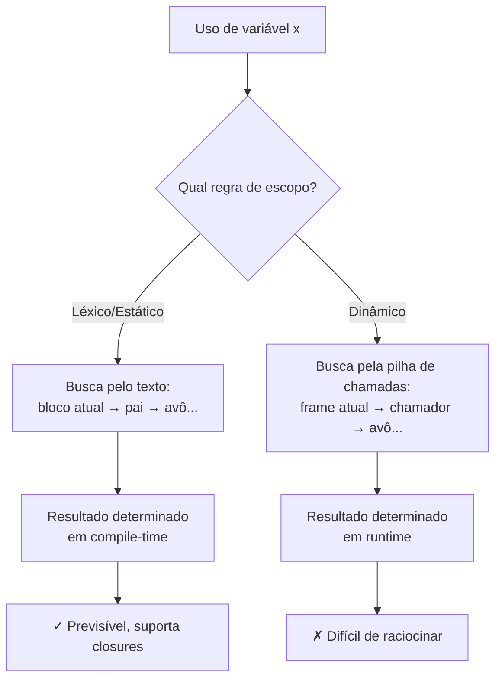
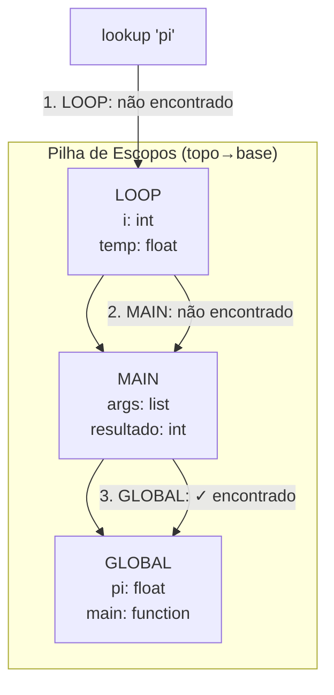
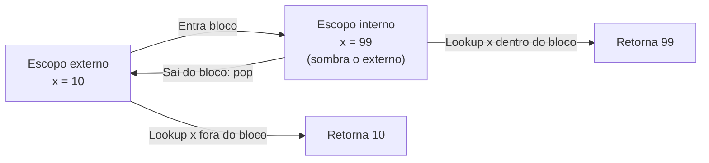
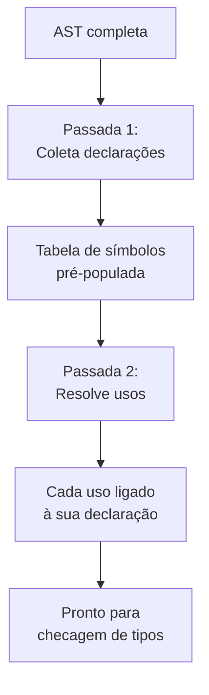
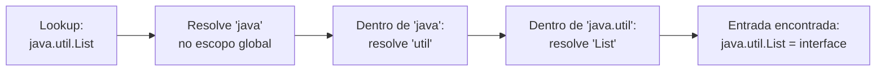
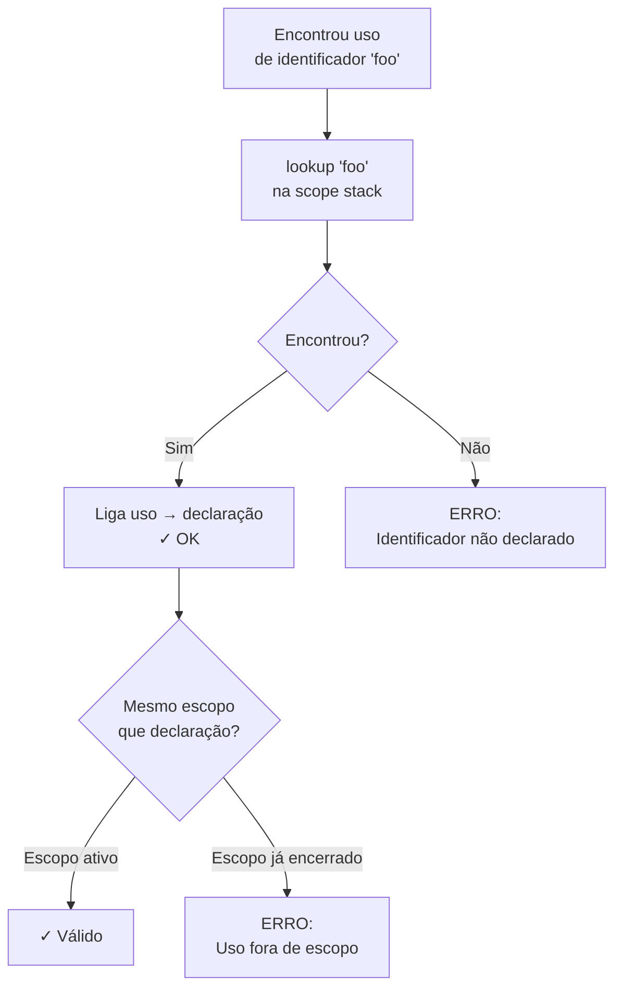

# Tabela de símbolos, escopo e resolução de nomes

> [!abstract] TL;DR
> O parsing produziu uma AST que é sintaticamente válida — mas `x` ainda é só texto. A análise semântica começa aqui: resolução de nomes liga cada *uso* de um identificador à sua *declaração*, construindo uma tabela de símbolos que mapeia nome → tipo, localização e escopo. Escopo léxico (o padrão moderno) resolve pelo texto; escopo dinâmico, pela cadeia de chamadas. Pilhas de escopos aninhados, shadowing, forward references e namespaces formam a espinha dorsal dessa fase — tudo antes de checar um único tipo.

---

## Da AST à semântica: o problema que o parser não resolve

O parser entregou uma árvore. Ela está **estruturalmente correta** — parênteses balanceados, produções respeitadas, precedência aplicada. Mas tente rodar esta AST na sua cabeça:

```python
x = y + z
```

Quem é `y`? Quem é `z`? O parser não sabe. Para ele, são três folhas `Identifier` com atributo `name`. Poderiam ser variáveis locais, globais, parâmetros, funções — ou nomes que simplesmente não existem.

A **análise semântica** começa resolvendo essa pergunta. O primeiro passo se chama **resolução de nomes** (*name resolution*): ligar cada *uso* de um identificador à sua *declaração*. Antes dessa ligação, `x` é uma string. Depois dela, `x` é um ponteiro (conceitual) para uma entrada específica em memória, com tipo, escopo e tempo de vida conhecidos.

> [!tip] Analogia do arquivo
> Pense no parser como quem organiza pastas numa gaveta. A resolução de nomes é quem preenche o índice: "quando alguém pedir pelo arquivo `x`, está na pasta `local`, terceira posição". Sem o índice, você só tem pilhas de papel com rótulos.

---

## A tabela de símbolos

A estrutura de dados central dessa fase é a **tabela de símbolos** (*symbol table*): um mapeamento de `nome → informações`. Na prática, é um hash map — lookup em O(1) amortizado, crucial quando um arquivo tem milhares de declarações.

O que se guarda em cada entrada?

| Campo | Significado | Exemplo |
|---|---|---|
| `name` | O identificador como string | `"contador"` |
| `kind` | Variável, função, tipo, parâmetro, constante | `VAR` |
| `type` | Tipo associado (preenchido na fase seguinte) | `int` |
| `scope_level` | Nível de profundidade do escopo | `2` |
| `offset` / `address` | Posição na memória ou no frame de ativação | `bp - 8` |
| `mutable` | Aceita re-atribuição? | `true` |
| `declared_at` | Linha/coluna da declaração | `(12, 4)` |

As operações são simples: **`insert(name, info)`** na declaração e **`lookup(name)`** no uso. A complexidade está no *quando* e no *onde* — que é exatamente onde entra o conceito de escopo.

---

## Escopo: onde uma declaração é visível

**Escopo** é a região do programa onde uma declaração pode ser referenciada. Declare `x` dentro de uma função e ela não existe fora dela — a não ser que o escopo externo também tenha um `x`, que é outra declaração.

Há duas famílias de regras de escopo:

### Escopo léxico (estático)

Neste modelo — o padrão em praticamente toda linguagem moderna: C, Java, Python, Rust, JavaScript (com `let`/`const`) — o escopo é determinado pela **estrutura textual** do código. Você pode descobrir qual declaração `x` resolve *só de ler o texto*, sem executar nada.

```python
x = "global"

def outer():
    x = "outer"
    def inner():
        print(x)   # resolve para "outer" — escopo léxico
    inner()

outer()
```

A regra é clara: olhe o bloco onde `x` é usado, suba para o bloco pai, avô, etc., até encontrar uma declaração.

### Escopo dinâmico

Neste modelo — presente em Bash, no Emacs Lisp tradicional e no Lisp original de 1960 — o escopo é determinado pela **cadeia de chamadas em runtime**. A mesma expressão pode resolver para valores diferentes dependendo de *quem chamou a função*.

```bash
x="global"

outer() {
    x="outer"
    inner
}

inner() {
    echo $x   # resolve para "outer" em Bash — escopo dinâmico!
}

inner         # imprime "global"
outer         # imprime "outer"
```

Observe a diferença crucial: chamar `inner` diretamente imprime `"global"`; chamar via `outer` imprime `"outer"`. O texto de `inner` é idêntico nos dois casos — só a **pilha de chamadas** muda.

> [!warning] Escopo dinâmico é traiçoeiro
> Em escopo dinâmico, o significado de uma variável livre depende de *quem* chamou sua função. Isso torna o raciocínio local impossível: você não pode entender `inner()` sem saber o contexto de chamada. Por isso, linguagens modernas abandonaram esse modelo — com exceção de casos especializados como variáveis de thread-local ou parâmetros implícitos.



> [!info] Leitura do diagrama
> O fluxo mostra os dois caminhos de resolução: léxico segue a estrutura textual e pode ser resolvido pelo compilador; dinâmico segue a pilha de execução e só se resolve em runtime. O escopo léxico é o único que permite closures corretas.

---

## Aninhamento de escopos e a pilha de tabelas

Programas reais têm escopos **aninhados**: blocos dentro de funções dentro de módulos. O compilador precisa rastrear qual declaração vale em cada ponto.

A solução canônica é uma **pilha de tabelas de símbolos** (*scope stack*). Cada vez que o compilador entra em um novo bloco, faz um `push` de uma tabela nova. Ao sair, faz `pop`. O `lookup` sobe a pilha do topo até a base:

```
escopo_global   { pi: float, main: function }
  └─ escopo_main  { args: []string, resultado: int }
       └─ escopo_loop  { i: int, temp: float }
```

Vejamos o rastreamento concreto sobre este código:

```python
pi = 3.14        # escopo global

def main(args):
    resultado = 0
    for i in range(10):
        temp = pi * i   # quem é "pi" aqui?
        resultado += temp
    return resultado
```

| Momento | Ação na pilha | Estado da pilha (topo → base) |
|---|---|---|
| Início do arquivo | push `global` | `[global: {pi}]` |
| Entra `main` | push `main` | `[main: {args, resultado}, global: {pi}]` |
| Entra `for` | push `loop` | `[loop: {i, temp}, main: {args, resultado}, global: {pi}]` |
| Lookup `pi` | sobe do topo | loop → main → **global** → encontrado! |
| Sai do `for` | pop `loop` | `[main: {args, resultado}, global: {pi}]` |
| Sai de `main` | pop `main` | `[global: {pi}]` |



> [!info] Leitura do diagrama
> A pilha cresce para cima a cada bloco aninhado. O lookup começa no topo (escopo mais local) e desce até encontrar a declaração ou esgotar a pilha (erro: identificador não declarado).

---

## Shadowing: quando o interno esconde o externo

**Shadowing** ocorre quando uma declaração interna usa o mesmo nome de uma declaração em escopo externo. A declaração mais interna "vence" para todos os usos dentro daquele bloco.

```java
int x = 10;          // escopo externo

{
    int x = 99;      // shadowing: declara novo x no escopo interno
    System.out.println(x);  // imprime 99
}

System.out.println(x);  // imprime 10 — o externo está intacto
```

O `x` externo não desaparece — continua na tabela, mas inacessível dentro do bloco interno. Ao sair do bloco, o `x` interno é removido (pop do escopo) e o externo volta a ser visível.



> [!info] Leitura do diagrama
> Enquanto estamos dentro do bloco interno, qualquer lookup de `x` encontra `99` antes de chegar ao externo. Ao sair, o escopo interno é destruído e o externo reassume.

Shadowing é **permitido** na maioria das linguagens porque facilita o reuso de nomes comuns (como `i` em loops aninhados). Mas...

> [!danger] Shadowing como armadilha
> Em Rust, shadowing de variáveis é explícito e intencional — você reescreve `let x = x + 1;` propositalmente. Em Java e Python, um shadow acidental (especialmente ao esquecer `self.x` vs `x` local) é uma fonte clássica de bugs silenciosos. Compiladores modernos emitem warnings para shadows suspeitos.

---

## Implementando o scope stack: detalhes práticos

Como um compilador real mantém essa pilha? A estrutura mais simples é uma lista encadeada de hash maps, onde cada nó representa um escopo:

```java
// Pseudocódigo: scope stack em um compilador/interpretador
class Scope {
    Map<String, Symbol> table = new HashMap<>();
    Scope parent;  // null no escopo global

    Symbol lookup(String name) {
        Symbol s = table.get(name);
        if (s != null) return s;
        if (parent != null) return parent.lookup(name);  // sobe a cadeia
        return null;  // não encontrado — erro semântico
    }

    void define(String name, Symbol s) {
        if (table.containsKey(name))
            throw new SemanticError("redeclaração: " + name);
        table.put(name, s);
    }
}
```

Repare no `parent.lookup()` recursivo: esse é o mecanismo da **scope chain**. Em linguagens compiladas staticamente, essa cadeia é resolvida em compile-time — o compilador substitui cada `lookup` por um endereço fixo (offset no frame ou endereço global). Em interpretadores, a cadeia pode ser percorrida em runtime.

> [!tip] Alternativa: índice numérico de profundidade
> Em vez de percorrer a cadeia a cada acesso, Nystrom (*Crafting Interpreters*) usa uma abordagem mais eficiente: na fase de resolução, o compilador computa quantos "saltos" de escopo são necessários para cada variável e armazena esse número na AST. O interpretador usa o número diretamente — acesso O(1) ao ambiente correto, sem busca linear.

---

## Binding: o ato de ligar um nome ao seu significado

**Binding** é o processo de associar um nome a uma entidade (valor, localização de memória, função). O momento em que isso acontece — o **binding time** — é crítico:

- **Binding estático (compile-time)**: o compilador resolve a ligação antes da execução. Mais eficiente, permite verificações de tipo antecipadas.
- **Binding dinâmico (runtime)**: a ligação ocorre durante a execução. Mais flexível, mas não detecta erros antes de rodar.

```python
# Python: binding dinâmico de funções
def greet():
    return "Olá"

say = greet          # "say" é ligado a greet em runtime
say = lambda: "Oi"  # re-binding: "say" agora aponta para outra função
```

Em linguagens compiladas estaticamente (C, Rust, Java), a maioria dos bindings de variáveis e funções é resolvida em compile-time, o que permite gerar código de máquina eficiente com endereços fixos.

---

## Forward references e o problema de ordem

O que acontece quando você usa algo antes de declarar?

```c
// C: forward reference para função
void imprime(int x);   // declaração antecipada (forward declaration)

int main() {
    imprime(42);       // usa antes da definição completa
    return 0;
}

void imprime(int x) {
    printf("%d\n", x);
}
```

Em C, isso exige uma **declaração antecipada** explícita. Em Java e Python, funções dentro de um módulo podem ser referenciadas em qualquer ordem — mas como?

A resposta é **duas passadas** (*two-pass*):

1. **Primeira passada**: percorre o código coletando *apenas* as declarações (nome, kind, localização). Não resolve usos.
2. **Segunda passada**: percorre novamente, agora com todas as declarações disponíveis, e resolve cada uso.

Isso é essencial para **funções mutuamente recursivas**:

```ml
(* SML: mutuamente recursivas — nenhuma pode "vir primeiro" *)
fun isEven 0 = true
  | isEven n = isOdd (n - 1)
and isOdd 0 = false
  | isOdd n = isEven (n - 1)
```

Sem uma primeira passada, ao processar `isEven`, o compilador ainda não viu `isOdd` — e falharia.



> [!info] Leitura do diagrama
> As duas passadas são sequenciais sobre a mesma AST. A primeira só insere; a segunda só consulta. Isso elimina o problema de ordem de declaração.

### Hoisting em JavaScript

JavaScript implementa uma forma especial de forward reference chamada **hoisting**: declarações `var` e `function` são "içadas" ao topo do escopo antes da execução.

```javascript
console.log(x);   // undefined — não é erro! var x foi hoisted
var x = 5;
console.log(x);   // 5

foo();             // funciona! declaração de função é hoisted com corpo
function foo() { return "oi"; }
```

Hoisting é o mecanismo de runtime do motor JS simulando uma "primeira passada". Com `let` e `const`, o hoisting ainda ocorre, mas a variável fica em uma **temporal dead zone** — acessá-la antes da declaração é erro explícito. Muito mais seguro.

> [!example] Exemplo: temporal dead zone
> ```javascript
> console.log(y);  // ReferenceError: Cannot access 'y' before initialization
> let y = 10;
> ```

---

## Namespaces e qualified names

À medida que programas crescem, colisões de nomes se tornam inevitáveis. A solução é organizar declarações em **namespaces** (ou módulos, pacotes, classes).

```java
// Java: dois tipos com o mesmo nome "List" em namespaces diferentes
java.util.List<String> lista1 = new java.util.ArrayList<>();
java.awt.List lista2 = new java.awt.List();
```

A resolução de um **qualified name** como `a.b.c` segue uma cadeia:

1. Encontra `a` no escopo atual (pode ser um módulo, um objeto, um pacote).
2. Dentro do escopo de `a`, busca por `b`.
3. Dentro do escopo de `b`, busca por `c`.



> [!info] Leitura do diagrama
> Qualified names são resolvidos componente a componente, da esquerda para a direita. Cada componente é um lookup dentro do escopo do componente anterior.

> [!tip] import como alias
> Instruções como `import java.util.List` criam um *alias* no escopo atual: mapeiam o nome curto `List` para o qualified name completo. A resolução por baixo dos panos é idêntica.

---

## Erros de resolução de nomes

A resolução de nomes produz diagnósticos precisos antes de gerar qualquer código:

| Erro | Causa | Exemplo |
|---|---|---|
| **Identificador não declarado** | `lookup` sobe toda a cadeia e não encontra | `print(variavel_inexistente)` |
| **Redeclaração no mesmo escopo** | `insert` encontra entrada existente no mesmo nível | `int x = 1; int x = 2;` no mesmo bloco |
| **Uso fora de escopo** | Nome existe, mas foi declarado em escopo que já saiu da pilha | acessar variável de loop após o loop (em C com declaração `for`) |



> [!info] Leitura do diagrama
> O fluxo de resolução tem dois pontos de falha: ausência total do nome (não declarado) e uso após o escopo ter sido destruído. Ambos são detectáveis estaticamente em linguagens com escopo léxico.

---

## Closures: capturando o escopo léxico

Uma **closure** é uma função que "fecha sobre" variáveis do escopo léxico em que foi criada — capturando-as mesmo depois que o escopo original teria sido destruído.

```python
def contador():
    n = 0
    def incrementa():
        nonlocal n
        n += 1
        return n
    return incrementa   # retorna a função com n capturado

c = contador()
print(c())  # 1
print(c())  # 2 — n persiste!
```

A resolução de nomes identifica que `n` em `incrementa` é uma **variável livre** — referenciada, mas não declarada localmente. O compilador (ou interpretador) registra que `n` deve ser *capturada* do escopo envolvente.

> [!tip] Teaser: closures no runtime
> A captura de variáveis livres implica que o frame de ativação de `contador` não pode ser simplesmente destruído ao retornar — `n` precisa sobreviver na heap. Como o runtime gerencia isso (com *upvalues* ou *cells*) é o tema de [[15 - Runtime, stack frames e gestão de memória]].

---

## Conexões

- Anterior: [[08 - Parsing bottom-up]] — o parsing bottom-up (LR/LALR) produziu a AST que esta fase consome.
- Próxima: [[10 - Análise semântica e checagem de tipos]] — com os nomes resolvidos, a próxima fase checa se os tipos são compatíveis.
- [[06 - A AST e o padrão visitor]] — a resolução de nomes é implementada como uma passada sobre a AST usando o padrão Visitor.
- [[15 - Runtime, stack frames e gestão de memória]] — closures e captura de variáveis livres exigem suporte especial do runtime (upvalues, heap allocation de frames).

> [!summary] Resumo em uma linha
> Resolução de nomes transforma identificadores anônimos em referências concretas às suas declarações, usando uma pilha de tabelas de símbolos que respeita o escopo léxico — a fundação sobre a qual toda verificação de tipos e geração de código é construída.

---

## Em entrevista

Resolução de nomes e escopo aparecem em entrevistas de compiladores, sistemas de tipos e linguagens. Dois ângulos comuns: implementação (como funciona a pilha de escopos) e comportamento (escopo léxico vs dinâmico, shadowing, hoisting).

*How does a compiler build a symbol table, and what information does each entry hold?*

*Explain the difference between lexical scope and dynamic scope with a concrete example where they produce different results.*

*What is shadowing? When is it safe and when is it a bug?*

*Why do some languages require forward declarations while others don't? What technique allows avoiding them?*

*What is a closure, and how does lexical scoping make it possible?*

*What is hoisting in JavaScript, and how does the temporal dead zone differ between `var` and `let`?*

*How does qualified name resolution work — for example, `java.util.List`?*

*What errors can name resolution detect before type checking even begins?*

| PT | EN |
|---|---|
| Tabela de símbolos | Symbol table |
| Resolução de nomes | Name resolution |
| Escopo | Scope |
| Escopo léxico / estático | Lexical scope / static scope |
| Escopo dinâmico | Dynamic scope |
| Shadowing | Shadowing |
| Binding | Binding |
| Binding estático | Static binding |
| Binding dinâmico | Dynamic binding |
| Referência antecipada | Forward reference |
| Içamento | Hoisting |
| Namespace | Namespace |
| Nome qualificado | Qualified name |
| Pilha de escopos | Scope stack / scope chain |
| Variável livre | Free variable |
| Closure | Closure |

---

> [!info] Lastro
> - Aho, A. V., Lam, M. S., Sethi, R., & Ullman, J. D. (2006). *Compilers: Principles, Techniques, and Tools* (2ª ed.). Pearson. Seções 2.7 (tabela de símbolos no pipeline) e 6.3 (organização de escopos e ligação de nomes). [Dragon Book — Wikipedia](https://en.wikipedia.org/wiki/Compilers:_Principles,_Techniques,_and_Tools)
> - Nystrom, R. (2021). *Crafting Interpreters*. Gentlydown. Capítulo "Resolving and Binding" — implementação em Java de um resolver de escopo léxico sobre uma AST, com tratamento de variáveis livres e closures. [craftinginterpreters.com](https://craftinginterpreters.com/resolving-and-binding.html)
> - Cooper, K. D., & Torczon, L. (2022). *Engineering a Compiler* (3ª ed.). Morgan Kaufmann. Capítulo 5 (introdução de nomes, escopo e tabelas de símbolos) e novo capítulo sobre elaboração semântica. [O'Reilly](https://www.oreilly.com/library/view/engineering-a-compiler/9780080916613/)
> - Wikipedia. *Scope (computer programming)*. Histórico do escopo léxico (MDL/Lisp 1967) e escopo dinâmico; linguagens com cada modelo. [wikipedia.org](https://en.wikipedia.org/wiki/Scope_(computer_science))
> - Northeastern University PRL Blog (2019). *Lexical and Dynamic Scope* — análise comparativa com exemplos em Racket e CommonLisp. [prl.khoury.northeastern.edu](https://prl.khoury.northeastern.edu/blog/2019/09/05/lexical-and-dynamic-scope/)
> - University of Washington CSE 341 Lecture Notes. *Lexical and Dynamic Scoping* — exemplos side-by-side mostrando divergência de comportamento. [courses.cs.washington.edu](https://courses.cs.washington.edu/courses/cse341/14wi/general-concepts/scoping.html)
