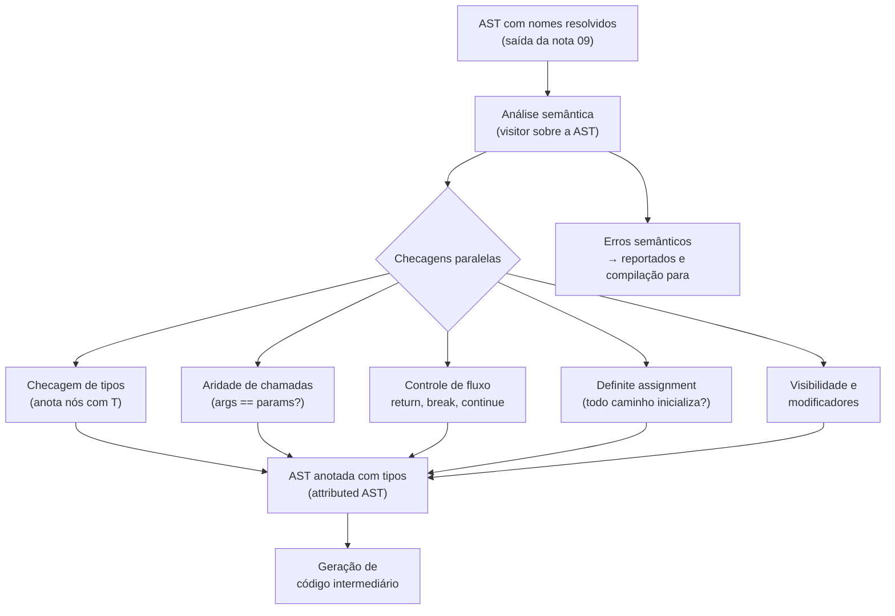
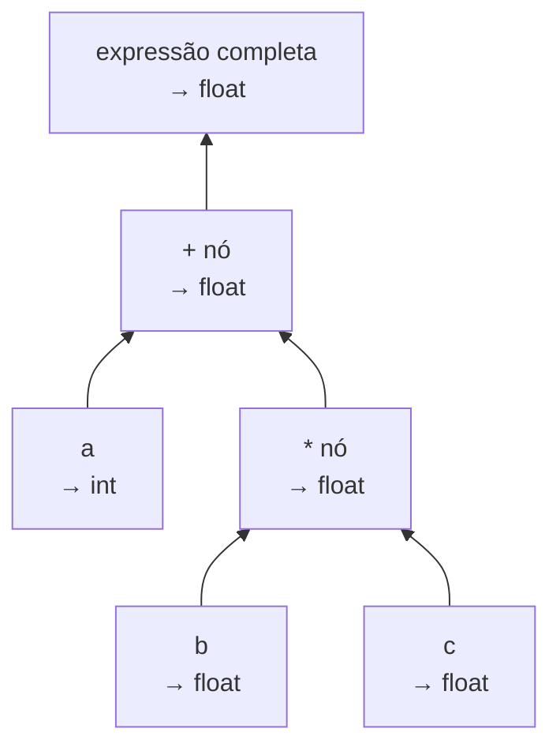
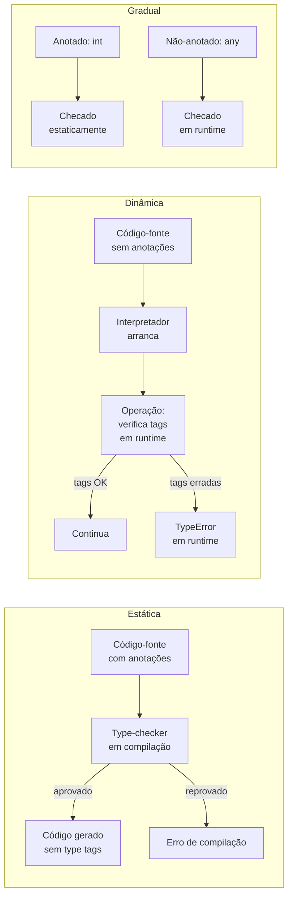
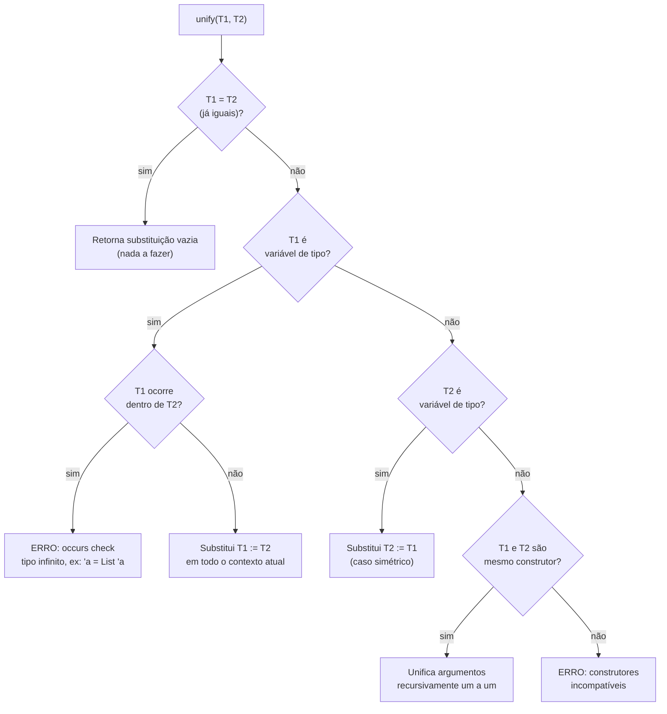
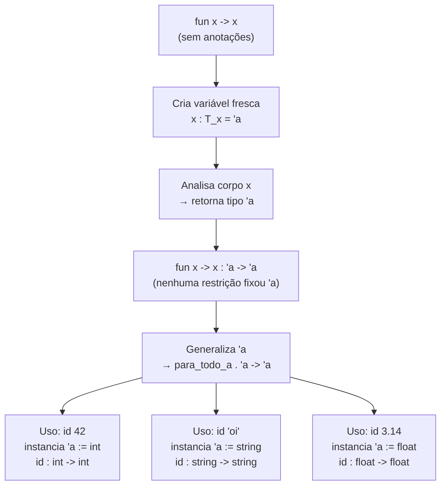

# Análise semântica e checagem de tipos

> [!abstract] TL;DR
> A sintaxe diz se o programa tem a forma certa; a semântica diz se ele *faz sentido*. A análise semântica percorre a AST anotada com nomes resolvidos e executa um conjunto de verificações — aridade de chamadas, controle de fluxo, definite assignment e, no centro, **checagem de tipos** — antes de qualquer código ser emitido. A checagem de tipos caminha recursivamente pelas expressões calculando e anotando tipos de baixo para cima. A inferência de Hindley-Milner vai além: deduz tipos inteiros sem anotações via **unificação**, casando variáveis de tipo com termos concretos.

---

## O que a sintaxe não captura

A gramática de uma linguagem é estrita mas burra. Ela valida pontuação, chaves e parênteses — mas não tem a menor ideia de contexto. Um programa pode passar pelo parser imaculado e ainda assim ser um absurdo semântico.

Imagine que você contrata um revisor de texto que garante que todas as frases seguem a gramática do português, mas não entende o que as frases significam. Ele aceita "O triângulo bebeu a quinta-feira" porque a concordância está perfeita. O compilador sem análise semântica é exatamente esse revisor.

Pense nas situações a seguir, todas sintaticamente corretas em suas respectivas linguagens:

```python
# Python — tipos incompatíveis em operação
resultado = "hello" * True + [1, 2, 3]

# C — variável não inicializada usada
int x;
return x + 1;

# JavaScript — return fora de função (module-level)
return 42;

# Java — break fora de loop
break;

# Qualquer linguagem tipada — aridade errada
function f(a) { return a * 2; }
f(1, 2, 3);  // f espera 1 argumento, passou 3
```

O parser não reclama de nenhum deles. A gramática de `return expr;` é válida independente de estar ou não dentro de uma função. Quem reclama é a **análise semântica** — a fase que vive entre o parser e a geração de código intermediário, e que conhece o *significado* das construções.

> [!warning] Por que isso importa?
> Sem checagem semântica, erros que poderiam ser detectados em milissegundos na compilação só aparecem em produção, em tempo de execução, possivelmente em dados reais de usuário. Em linguagens sem checagem estática (JavaScript puro, Python sem mypy), um `return` no lugar errado só explode quando o interpretador chega àquela linha. O compilador é a sua primeira linha de defesa — e ela não tem custo em runtime.

---

## Análise semântica: o conjunto de checagens sobre a AST

A análise semântica opera sobre a AST já com nomes resolvidos — a tabela de símbolos foi construída e o escopo foi resolvido conforme vimos em [[09 - Tabela de símbolos, escopo e resolução de nomes]]. Agora a AST carrega referências diretas às declarações: cada uso de `x` não é mais uma string `"x"`, é um ponteiro para o nó de declaração de `x`.

Sobre essa AST, a análise semântica executa múltiplas **checagens** — geralmente numa única passada visitor, ou em passadas separadas para clareza:

- **Checagem de tipos**: o tipo de cada expressão é calculado e verificado contra o contexto esperado. É a checagem mais complexa e é o foco desta nota.
- **Aridade de chamadas**: o número de argumentos passados bate com o número de parâmetros declarados? `f(a, b)` quando `f` foi declarada como `f(x)` é um erro semântico, não sintático.
- **Controle de fluxo**: `return` está dentro de uma função? `break` e `continue` estão dentro de um laço ou `switch`? `case` duplicado num `switch`?
- **Definite assignment**: a variável foi definitivamente inicializada antes de ser lida? Java e C# verificam isso estaticamente — percorrem o grafo de fluxo de controle e garantem que todo caminho até o uso passa por uma atribuição.
- **Acesso a membros**: o campo `obj.foo` existe no tipo declarado de `obj`? O método `obj.bar()` é acessível daqui?
- **Visibilidade e modificadores**: o símbolo referenciado é acessível do ponto de uso (público, protegido, privado, `internal`)? Um `final` está sendo reatribuído?

O resultado de tudo isso é uma **AST anotada** (*attributed AST*): a mesma árvore, mas cada nó de expressão agora carrega um campo `type` com o tipo calculado. Cada nó de chamada carrega a referência ao símbolo de função resolvido e verificado. Essa árvore anotada é o que a geração de código intermediário vai consumir (ver [[11 - Representação intermediária e SSA]]).



> [!info] Leitura do diagrama
> A AST com nomes já resolvidos entra na análise semântica. Múltiplas checagens rodam — geralmente numa única passada visitor que as combina. O resultado é a AST anotada (cada nó de expressão carrega seu tipo calculado) que alimenta a próxima fase. Qualquer erro interrompe a compilação antes de gerar código.

---

## Checagem de tipos: o coração da análise semântica

A checagem de tipos responde a uma pergunta simples para cada expressão: *qual o tipo desse nó?* E então verifica se o tipo produzido é compatível com o que o contexto exige.

### O algoritmo: visitor recursivo que sobe tipos

O type-checker é implementado como um **visitor** (ver [[06 - A AST e o padrão visitor]]) que percorre a AST de baixo para cima. Para cada nó, ele:

1. Visita os filhos recursivamente, obtendo seus tipos.
2. Aplica a **regra de tipagem** daquele construtor de expressão.
3. Anota o nó com o tipo resultante.
4. Se o tipo calculado contradiz o esperado pelo contexto pai, emite um erro de tipo.

Pense na expressão `a + b * c` com `a: int`, `b: float`, `c: float`. O type-checker visita da folha para a raiz:



> [!info] Leitura do diagrama
> Os tipos sobem da folha para a raiz. O nó `*` recebe dois `float` e produz `float`. O nó `+` recebe `int` (de `a`) e `float` (do `*`): aplica a regra de promoção, insere um nó de conversão `int→float` implícita na AST, e produz `float`. O nó raiz fica anotado com `float`.

O ponto-chave é que o type-checker não só verifica — ele **transforma** a AST, inserindo nós de conversão explícita onde a regra de tipagem exige promoção. A AST anotada que sai do type-checker é um grafo mais rico do que entrou.

Em pseudocódigo, o visitor para expressões binárias fica assim:

```python
def check_binary(node):
    t_left  = check_expr(node.left)   # visita filho esquerdo
    t_right = check_expr(node.right)  # visita filho direito

    if node.op == '+':
        result_type = type_of_add(t_left, t_right)
        if result_type is None:
            raise TypeError(f"Operador + não suporta {t_left} e {t_right}")
        node.type = result_type
        return result_type

    # ... demais operadores

def type_of_add(t1, t2):
    if t1 == INT and t2 == INT:   return INT
    if t1 == FLOAT or t2 == FLOAT: return FLOAT   # promoção
    if t1 == STRING and t2 == STRING: return STRING
    return None  # incompatível
```

### Regras de tipagem e a notação de juízos

Formalmente, uma regra de tipagem escreve-se como um juízo de tipo:

**Γ ⊢ e : T**

Leia em voz alta: "no contexto Γ (o *type environment*, um mapa de nome → tipo), a expressão `e` tem tipo `T`".

Você não precisa dominar a notação formal para entender a intuição. O **type environment** Γ é exatamente a tabela de símbolos com os tipos das variáveis em escopo. Cada regra tem premissas (em cima da linha) e uma conclusão (abaixo):

```
-- Regra para variável: busca no environment
x : T  ∈  Γ
───────────────
Γ ⊢ x : T

-- Regra para adição de inteiros
Γ ⊢ a : int     Γ ⊢ b : int
─────────────────────────────
    Γ ⊢ a + b : int

-- Regra para aplicação de função
Γ ⊢ f : T1 → T2     Γ ⊢ arg : T1
────────────────────────────────────
        Γ ⊢ f(arg) : T2
```

A última regra é particularmente elegante: `f` deve ter tipo "função de T1 para T2", o argumento deve ter tipo T1, e a expressão inteira tem tipo T2. O type-checker verifica a aridade implicitamente: se `f` espera `T1 → T2` mas recebeu dois argumentos, o segundo argumento seria aplicado ao resultado T2, que pode não ser uma função — gerando erro.

Cada operador, cada construção da linguagem, tem sua regra. O type-checker é o *executor* dessas regras sobre a AST real. O conjunto completo de regras é chamado de **sistema de tipos** da linguagem.

> [!tip] Referência canônica
> Benjamin C. Pierce, *Types and Programming Languages* (MIT Press, 2002), trata regras de tipagem com rigor crescente a partir do capítulo 8 (aritmética tipada) até capítulos sobre sistemas de tipos complexos. É a referência padrão — mas a intuição acima é suficiente para a maioria das entrevistas sênior.

---

## Tipagem estática × dinâmica × gradual

A checagem de tipos pode acontecer em momentos muito diferentes do ciclo de vida do programa.

**Tipagem estática (compile-time):** o compilador verifica tudo antes de gerar código. Se um erro de tipo existe, o programa não compila. O código gerado não precisa carregar *type tags* nos valores — o compilador sabe o tipo de cada posição de memória estaticamente. Custo de verificação zero em runtime. Exemplos: Java, C#, Go, Haskell, Rust.

**Tipagem dinâmica (runtime):** o interpretador ou runtime carrega *type tags* em cada valor — um inteiro sabe que é inteiro, uma string sabe que é string. A cada operação, o runtime verifica as tags e decide o comportamento (ou lança uma exceção). Exemplos: Python, Ruby, JavaScript, Lisp.

**Tipagem gradual (híbrida):** parte do código tem tipos anotados e verificados estaticamente pelo compilador; a parte não-anotada fica com tipo `Any` / `dynamic` e recebe checagens residuais em runtime. O programador migra progressivamente de dinâmico para estático. Exemplos: TypeScript sobre JavaScript, mypy sobre Python, Dart com `dynamic`.



> [!info] Leitura do diagrama
> Três regimes. No estático, a verificação acontece antes de rodar — o código gerado é mais enxuto. No dinâmico, o interpretador carrega tags em cada valor e checa em cada operação. No gradual, os dois coexistem na mesma base de código: você ativa checagem progressivamente adicionando anotações.

O trade-off não é apenas performance: tipagem estática captura erros antes do deploy, mas exige mais cerimônia de escrita; tipagem dinâmica é mais ágil para protótipos, mas erros de tipo chegam em produção. Tipagem gradual tenta o melhor dos dois mundos — com a ressalva de que a fronteira `any` é exatamente onde os bugs se escondem.

Para a taxonomia mais detalhada de sistemas de tipos como *design* — nominal vs. estrutural, covariância, forte vs. fraco — veja [[03-Dominios/Ciência/Paradigmas/13 - Sistemas de tipos]]. Aqui o foco é no *algoritmo* de verificação.

---

## Coerção implícita × explícita: a armadilha silenciosa

O type-checker pode fazer mais do que reclamar — ele pode **inserir conversões** automaticamente na AST anotada.

**Coerção implícita** (*implicit coercion* / *type promotion*): o compilador insere uma conversão sem que o programador peça. O nó de conversão aparece na AST anotada mesmo sem ter aparecido no código-fonte. Exemplo clássico: `int` promovido a `float` em operações mistas, ou `byte` promovido a `int` em Java.

**Coerção explícita** (*cast*): o programador ordena a conversão. `(float) x` em C, `int(x)` em Python, `x as f64` em Rust.

A **promoção numérica** em C/Java tem uma hierarquia bem definida: `byte → short → int → long → float → double`. O type-checker sempre escolhe o tipo "maior" da hierarquia para cobrir os dois operandos. Em Java, `byte + byte` já resulta em `int` — isso surpreende muita gente.

> [!danger] Coerções implícitas geram bugs sutis
> JavaScript é o caso extremo e canônico de armadilha: o operador `+` é polimórfico, e a linguagem decide silenciosamente entre concatenação de strings e soma numérica com base em regras de coerção que poucos memorizam completamente.

```js
// JavaScript — coerções implícitas enganosas
"5" - 2     // → 3      (string vira número porque - não concatena)
"5" + 2     // → "52"   (número vira string porque + concatena)
true + 1    // → 2      (boolean vira número 1)
false + 1   // → 1      (boolean vira número 0)
null + 1    // → 1      (null vira 0)
undefined + 1 // → NaN  (undefined vira NaN)
[] + {}     // → "[object Object]"
{} + []     // → 0      (contexto diferente, resultado diferente!)
```

O último exemplo — `{} + []` resulta em `0` mas `[] + {}` resulta em `"[object Object]"` — é o tipo de inconsistência que linguagens com tipagem forte simplesmente não permitem: a tentativa de somar array e objeto seria um erro de compilação, não um resultado silenciosamente errado.

Linguagens com tipagem forte (Rust, Haskell, Go) rejeitam operações entre tipos incompatíveis com erro de tipo. Mesmo Java, com tipagem mais permissiva, não faz coerção de `String` para `int` implicitamente.

---

## Inferência de tipos: deduzir sem anotar

Anotar tipos explicitamente é trabalhoso. E se o compilador pudesse descobrir os tipos *sem* que você os escrevesse? Em ML, Haskell e Rust (para variáveis locais), ele faz exatamente isso — e ainda garante que inferiu o tipo *mais geral* possível.

### Hindley-Milner e o Algorithm W

O sistema de tipos de Hindley-Milner (HM), cujos fundamentos foram publicados por Robin Milner em 1978 e formalizados com prova de completude por Luis Damas e Milner no artigo *Principal type-schemes for functional programs* (POPL 1982), garante duas propriedades notáveis:

1. **Toda expressão bem tipada tem um tipo principal** (*principal type* / *most general type*) — o tipo mais polimórfico possível, sem perder informação.
2. O **Algorithm W** encontra esse tipo principal em tempo quase-linear (amortizado), sem que o programador forneça nenhuma anotação.

A mecânica do HM descansa em três ingredientes:

**1 — Variáveis de tipo** (`'a`, `'b` em ML/OCaml; `a`, `b` em Haskell): placeholders para tipos ainda não determinados. Quando o compilador encontra um parâmetro sem tipo declarado, cria uma variável de tipo fresca — um nome temporário para "tipo desconhecido por enquanto".

**2 — Geração de restrições**: cada nó da AST gera equações entre tipos. Para `f(x)` onde `f : T_f` e `x : T_x`, geramos a restrição `T_f = T_x → T_result` (f deve ser uma função que aceita x). Para `a + b`, `T_a` e `T_b` devem ser unificáveis com um tipo numérico.

**3 — Unificação**: resolver o sistema de equações, substituindo variáveis de tipo por tipos concretos. Quando tudo se resolve, as variáveis que sobram livres representam polimorfismo — o tipo funciona para qualquer instanciação delas.

### Unificação: casar dois tipos

Unificação é o coração da inferência. Dado dois tipos `T1` e `T2`, o algoritmo tenta encontrar uma **substituição** (S) — um mapa de variável de tipo → tipo — tal que `S(T1) = S(T2)`.



> [!info] Leitura do diagrama
> A unificação é recursiva. Quando T1 é uma variável de tipo, ela "absorve" o outro tipo — salvo se T1 aparece dentro de T2 (o *occurs check* previne isso, evitando tipos infinitos como `'a = List<'a>`). Quando ambos são construtores (ex: `List` e `List`), unificamos seus argumentos recursivamente. Construtores diferentes (ex: `List` e `Maybe`) geram erro imediatamente.

Um exemplo concreto: `unify(List<'a>, List<int>)`.

- Ambos são o construtor `List` — OK, prosseguir com os argumentos.
- `unify('a, int)` — `'a` é variável de tipo, não ocorre em `int`. Resultado: `'a := int`.

Substituição final: `{'a → int}`. Aplicando: `List<'a>` vira `List<int>`.

### Inferência passo a passo: `let id = fun x -> x`

Vamos acompanhar o Algorithm W inferindo o tipo da função identidade em OCaml/ML:

```ocaml
let id = fun x -> x
```

**Passo 1 — Parâmetro sem tipo declarado.** O compilador cria uma variável de tipo fresca: `x : 'a`.

**Passo 2 — Análise do corpo.** O corpo é simplesmente `x`. Sua expressão tem tipo `'a` (pelo que atribuímos a `x`). Portanto `fun x -> x` tem tipo `'a → 'a`.

**Passo 3 — Nenhuma restrição fixa `'a`.** Ao longo de toda a análise, nenhuma equação forçou `'a` a ser um tipo específico. O compilador **generaliza**: `'a` vira um quantificador universal.

**Resultado:** `id : ∀ 'a. 'a → 'a`.

Isso significa: "para qualquer tipo `'a`, `id` aceita um `'a` e devolve um `'a`". Quando você usar `id 42`, o compilador instancia `'a := int`. Quando usar `id "oi"`, instancia `'a := string`. A mesma função serve para todos os tipos.



> [!info] Leitura do diagrama
> Cada chamada a `id` instancia a variável de tipo `'a` independentemente. O tipo polimórfico `∀ 'a. 'a → 'a` é um template que o compilador especializa em cada ponto de uso, sem criar cópias do código (diferente de generics de C++ que podem gerar code bloat).

Um exemplo ligeiramente mais interessante mostra quando a inferência detecta um erro sem nenhuma anotação:

```ocaml
(* OCaml — inferência detecta erro *)
let double x = x + x   (* infere x : int, double : int -> int *)
let _ = double "hello"  (* ERRO: esperava int, recebeu string *)
```

O compilador infere que `+` sobre dois `x` iguais exige `x : int` (a regra do `+` inteiro). Quando você passa `"hello"`, a unificação de `string` com `int` falha. Tudo isso sem uma única anotação de tipo no código.

> [!example] Rust: inferência local e bidirecional
> Rust não implementa HM completo (polimorfismo paramétrico de rank superior é limitado), mas tem inferência bidirecional poderosa para variáveis locais e closures. Em `let x = vec![1, 2, 3]`, o tipo `Vec<i32>` é inferido a partir dos elementos. Em `let xs: Vec<_> = iter.collect()`, o tipo do elemento é inferido do iterador. Quando a inferência não resolve, o compilador pede anotação com mensagem precisa indicando exatamente onde a ambiguidade está.

### Os limites da inferência global

HM funciona perfeitamente para linguagens funcionais puras. Para programação orientada a objetos, os limites aparecem rápido:

- **Sobrecarga de métodos** (overloading): se `+` pode ser `int+int` ou `string+string`, a regra de tipagem precisa escolher. Linguagens como Java resolvem pela sobrecarga declarada (e às vezes com mais de uma regra candidata, gerando ambiguidade).
- **Subtiping e herança**: `Dog` é subtipo de `Animal`. A inferência precisa saber que `fun(x: Animal)` aceita `Dog`. HM puro não lida com subtyping — extensões como HM(X) ou bidirectional typing são necessárias.
- **Rank-2 polimorfism e tipos dependentes**: quando funções recebem funções polimórficas como argumento, a inferência fica indecidível. Haskell exige anotações para `forall` explícito em rank >= 2.

---

## Por que o type-checker é seu amigo

Há um ditado no mundo Haskell: *"if it compiles, it works"*. Não é 100% verdade — bugs de lógica não têm tipo errado — mas captura algo profundo: **um tipo correto é uma prova parcial de correção**.

Tipos como `Option<T>` em Rust e `Maybe T` em Haskell forçam você a tratar a ausência de valor. O compilador não deixa você chamar métodos numa `Option<String>` sem antes verificar se ela é `Some` ou `None`. Quantos `NullPointerException` em Java existiriam se Java tivesse `Option<T>` desde o início?

Tipos como `NonEmptyList<T>` garantem que a lista tem pelo menos um elemento — chamar `.head()` nunca lança exceção. Tipos como `Result<T, E>` em Rust obrigam o chamador a lidar com o erro — você não pode "esquecer" de tratar um `Result`.

À medida que os tipos ficam mais expressivos, mais propriedades são provadas em compile-time.

Isso não é acidente — é o **Isomorfismo de Curry-Howard**: existe uma correspondência exata entre sistemas de tipos e sistemas de lógica. Tipos são proposições; programas que habitam esses tipos são provas. Um tipo `A → B` corresponde à implicação lógica "se A então B"; uma função que tem esse tipo *é* a prova construtiva da implicação. Um tipo `A × B` (tupla) corresponde à conjunção "A e B". Um tipo `A + B` (union / Either) corresponde à disjunção "A ou B".

> [!tip] Teaser: proof assistants
> Linguagens como Coq, Agda e Lean levam Curry-Howard ao limite: você escreve tipos que são especificações matemáticas (ex.: "esta função de ordenação retorna uma lista que é uma permutação da entrada e está em ordem crescente") e o compilador exige que você prove que seu código satisfaz a especificação. O type-checker *é* o verificador de prova. Isso está muito além do Java cotidiano, mas o princípio é o mesmo: **tipos são contratos verificados mecanicamente**.

---

## Erros de tipo e por que mensagens de inferência são difíceis

Quando a tipagem estática falha, o compilador precisa reportar **onde** e **por que** o tipo é incompatível. A qualidade dessas mensagens varia enormemente entre linguagens.

Em linguagens com anotações explícitas (Java, C#, Go), a mensagem é direta: "esperava `String`, recebeu `int`" na linha exata onde a incompatibilidade aparece. O contexto é local e a culpa é clara.

Em linguagens com inferência global (Haskell, OCaml), a dificuldade é estrutural. O tipo de uma expressão pode ser determinado por uma cadeia de unificações espalhadas pelo arquivo — o erro ocorre num nó, mas a raiz da contradição está muitos nós acima na AST, ou mesmo em outro arquivo. O compilador pode apontar para o lugar da contradição, mas a *causa* da contradição está em outro lugar.

```haskell
-- Haskell — erro de tipo com mensagem potencialmente críptica
foo xs = map (+1) xs ++ "hello"
-- O que acontece: map (+1) xs força xs : [Num a => a]
--                 (++) força o tipo de xs a ser [Char]
--                 Num Char existe em Haskell, mas a mensagem
--                 de erro pode ser confusa dependendo da versão do GHC
```

O Rust investe deliberadamente em mensagens pedagógicas. Quando a inferência falha, o compilador exibe:

1. O tipo esperado vs. o tipo encontrado.
2. Onde cada tipo foi estabelecido.
3. Uma sugestão concreta de como corrigir (uma anotação, um `.into()`, um `as T`).

```rust
// Rust — erro com sugestão explícita
fn soma(a: i32, b: i32) -> i32 { a + b }
let x: i64 = 10;
soma(x, 5);
// error[E0308]: mismatched types
// --> src/main.rs:4:10
//  expected `i32`, found `i64`
//  help: you can convert an `i64` to `i32` and panic if the converted value doesn't fit: `x.try_into().unwrap()`
```

> [!warning] Regra prática
> Quando o compilador aponta um erro de tipo, o erro *real* pode estar em outro lugar. Leia a mensagem inteira — o `note:` e o `help:` ao final costumam ser mais informativos que a linha apontada. E quando a mensagem mencionar variáveis de tipo internas (`T0`, `'a0`), procure o primeiro ponto onde essa variável foi criada — ali está a raiz do problema.

---

## Conexões

- **Anterior:** [[09 - Tabela de símbolos, escopo e resolução de nomes]] — a resolução de nomes constrói a AST que a análise semântica consome.
- **Próxima:** [[11 - Representação intermediária e SSA]] — a AST anotada com tipos é a entrada para a geração de IR.
- **Taxonomia de sistemas de tipos (design):** [[03-Dominios/Ciência/Paradigmas/13 - Sistemas de tipos]] — nominal × estrutural, covariância, forte × fraco; esta nota foca no *algoritmo* de verificação, não no design do sistema.
- **Padrão visitor (implementação do type-checker):** [[06 - A AST e o padrão visitor]] — o type-checker é um visitor recursivo sobre a AST, e entender o padrão ajuda a entender como ele é estruturado.

> [!summary] Resumo em uma linha
> A análise semântica transforma uma AST sintaticamente válida numa AST *semanticamente coerente*, anotada com tipos — e o coração dessa transformação é o type-checker, um visitor recursivo que aplica regras de tipagem de baixo para cima, usando unificação quando infere tipos sem anotação.

---

## Em entrevista

Em entrevistas de nível sênior sobre compiladores ou design de linguagens, espere perguntas sobre onde a checagem de tipos vive no pipeline, o que é inferência e como ela funciona, e a diferença entre tipagem estática, dinâmica e gradual. Perguntas mais avançadas podem explorar unificação ou Curry-Howard.

*"Semantic analysis is the compiler phase that runs after name resolution; it walks the attributed AST and checks type consistency, call arity, control-flow validity, and definite assignment before any code is emitted."*

*"Type checking is a recursive bottom-up visitor: for each expression node, you visit the children to get their types, apply the typing rule for that operator, annotate the node with the resulting type, and emit an error if the inferred type contradicts the expected context."*

*"A type judgment Γ ⊢ e : T reads: 'in type environment Γ, expression e has type T.' The type environment maps names to their declared types in the current scope — it's essentially the symbol table enriched with type information."*

*"Hindley-Milner inference works by introducing fresh type variables for unknown types, walking the AST to generate equality constraints, and solving them via unification — producing the most general (most polymorphic) type without any programmer annotations."*

*"Unification is the core of type inference: given two types T1 and T2, find a substitution S such that S(T1) = S(T2). Type variables absorb whatever type they're unified with, unless the occurs check detects a cycle."*

*"Gradual typing, as in TypeScript or mypy, lets you annotate as much or as little as you want: annotated code is statically checked at compile time; unannotated parts get the dynamic type 'any' and fall back to runtime checks."*

*"Implicit coercion inserts type conversions automatically — numeric promotion in C/Java is well-defined and mostly safe, but JavaScript-style coercion across unrelated types (string/number/boolean) is a classic source of hard-to-trace semantic bugs."*

*"The Curry-Howard correspondence says types are propositions and programs are proofs — a function of type A → B is a constructive proof that A implies B, which is why expressive type systems can encode correctness properties that the compiler verifies mechanically."*

| Português | English |
|---|---|
| Análise semântica | Semantic analysis |
| Checagem de tipos | Type checking |
| Inferência de tipos | Type inference |
| Unificação | Unification |
| Tipagem estática | Static typing |
| Tipagem dinâmica | Dynamic typing |
| Tipagem gradual | Gradual typing |
| Coerção implícita | Implicit coercion / type coercion |
| Promoção numérica | Numeric promotion |
| Ambiente de tipos | Type environment |
| Variável de tipo | Type variable |
| AST anotada | Attributed AST |
| Regra de tipagem | Typing rule |
| Juízo de tipo | Type judgment |
| Isomorfismo de Curry-Howard | Curry-Howard correspondence |
| Verificação de ocorrência | Occurs check |
| Tipo principal | Principal type |
| Polimorfismo paramétrico | Parametric polymorphism |

> [!info] Lastro
> - Alfred V. Aho, Monica S. Lam, Ravi Sethi, Jeffrey D. Ullman. *Compilers: Principles, Techniques, and Tools* (2ª ed., "Dragon Book"). Addison-Wesley, 2006. Capítulos 5 (syntax-directed translation e attribute grammars) e 6 (geração de código intermediário com type checking integrado). Referência canônica da área.
> - Benjamin C. Pierce. *Types and Programming Languages* (TAPL). MIT Press, 2002. Capítulos 8–9 (typed arithmetic, simply typed lambda calculus) e Capítulo 22 (type reconstruction e Algorithm W). Referência padrão para regras de tipagem, unificação e HM. <https://www.goodreads.com/book/show/112252.Types_and_Programming_Languages>
> - Luis Damas e Robin Milner. "Principal type-schemes for functional programs." *Proceedings of POPL 1982*, pp. 207–212. ACM. Artigo fundacional que prova a completude do Algorithm W e estabelece o sistema HM. Descrito em <https://en.wikipedia.org/wiki/Hindley%E2%80%93Milner_type_system>
> - Keith D. Cooper e Linda Torczon. *Engineering a Compiler* (3ª ed.). Morgan Kaufmann / Elsevier, 2022. Cobre elaboração semântica, checagem de tipos e geração de código intermediário com perspectiva de implementação prática. <https://shop.elsevier.com/books/engineering-a-compiler/cooper/978-0-12-815412-0>
> - Microsoft TypeScript Team. "Type Inference" — TypeScript Handbook. Documentação oficial sobre inferência contextual e bidirecional sem anotações. <https://www.typescriptlang.org/docs/handbook/type-inference.html>
> - Microsoft Research. "Safe & Efficient Gradual Typing for TypeScript." Artigo sobre as garantias e limitações de soundness da tipagem gradual no TypeScript. <https://www.microsoft.com/en-us/research/publication/safe-efficient-gradual-typing-for-typescript-3/>
