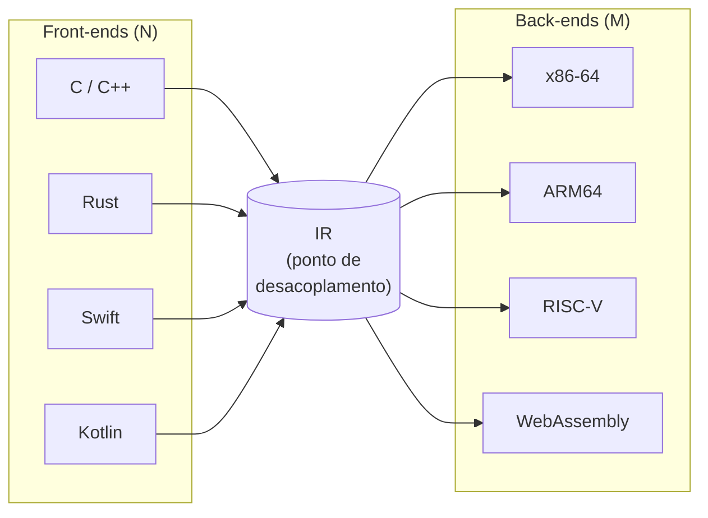
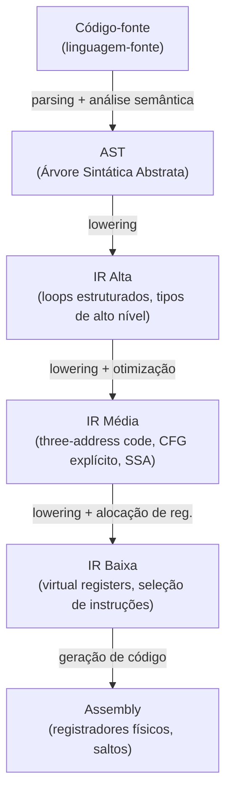
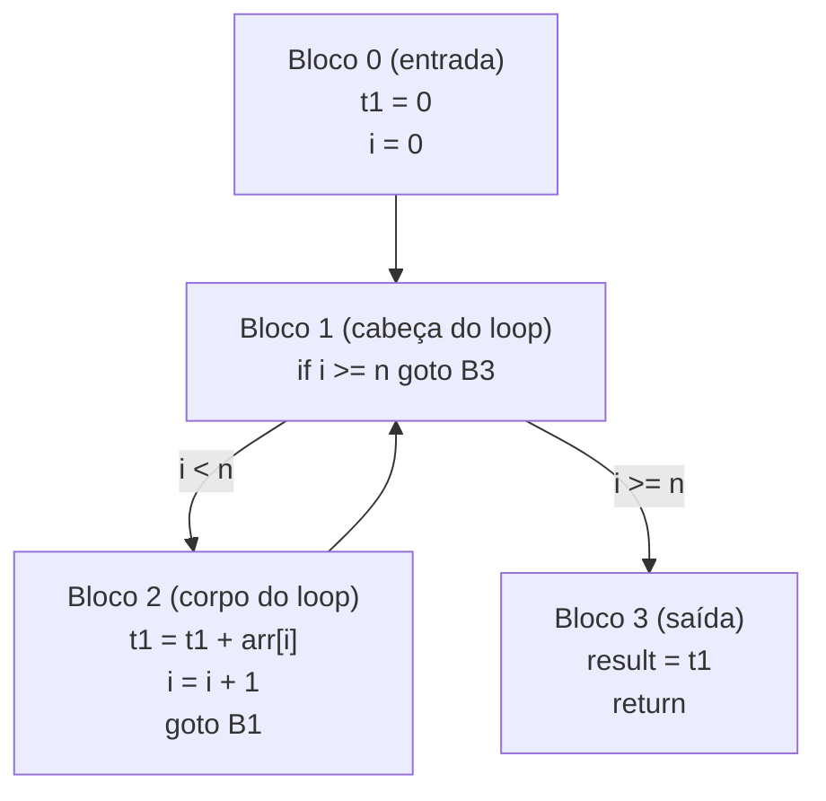
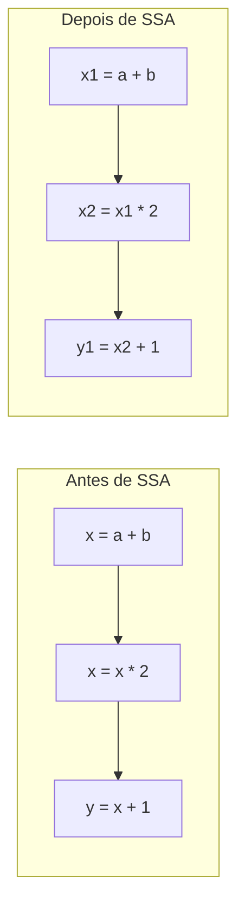
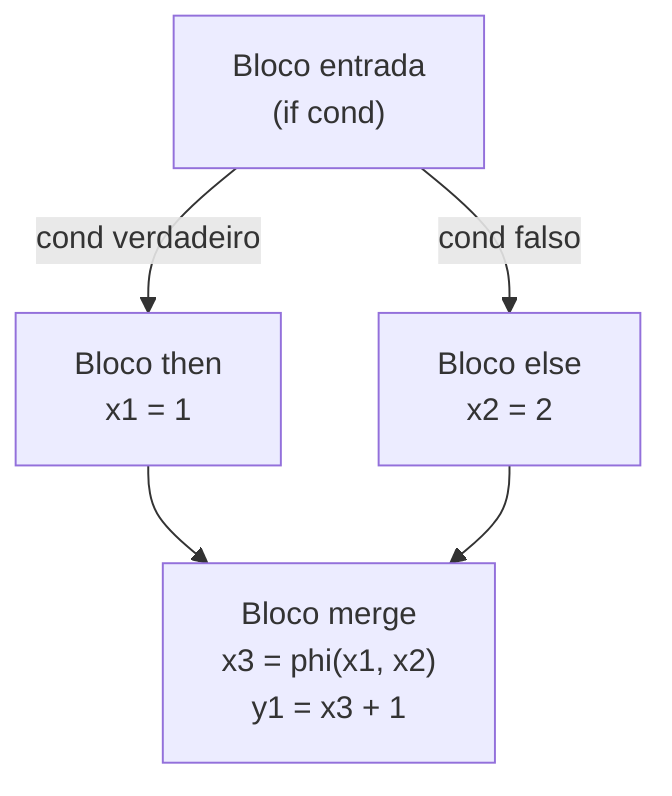

# Representação intermediária e SSA

> [!abstract] TL;DR
> Uma Representação Intermediária (IR) é uma linguagem de meio-termo que desacopla a fonte do alvo: N front-ends produzem IR, M back-ends a consomem, e todas as otimizações operam uma única vez sobre ela. SSA (Static Single Assignment) é uma propriedade da IR que exige que cada variável seja atribuída exatamente uma vez — simplificando dataflow, eliminando cópias e tornando as análises de otimização dramaticamente mais eficientes.

---

## O problema: AST é lingua da fonte, assembly é língua da máquina

Imagine que você está traduzindo um romance do russo para mandarim. Uma abordagem possível seria traduzir russo → mandarim diretamente. Outra: traduzir russo → inglês primeiro, e depois inglês → mandarim. O inglês aqui é a *língua franca* — ela não é a ideal para nenhum dos dois extremos, mas é boa o suficiente para servir de pivô.

Compiladores têm exatamente esse problema.

A **AST** (Árvore Sintática Abstrata, gerada nas fases anteriores) ainda carrega a estrutura da linguagem-fonte: tem nós `ForStatement`, `WhileStatement`, `ClassDeclaration`. Ela sabe que você escreveu `for (int i = 0; i < n; i++)`. Isso é ótimo para análise semântica e checagem de tipos — veja [[10 - Análise semântica e checagem de tipos]].

Mas o **assembly** carrega a estrutura da máquina: registradores físicos (`rax`, `rbx`), saltos incondicionais (`jmp`), endereços de memória. Ele não sabe o que é um `for`.

Otimizar diretamente na AST é impraticável — ela é estruturada demais pela linguagem. Gerar assembly direto da AST sem otimização produz código péssimo. E fazer um módulo de otimização específico para cada par (linguagem-fonte, arquitetura-alvo) é combinatorialmente explosivo.

A solução é uma **Representação Intermediária** — uma linguagem de meio-termo, independente tanto da fonte quanto do alvo.

---

## O argumento N×M revisitado

Em [[01 - O que é um compilador e o pipeline de tradução]], vimos o argumento N×M: sem IR, N linguagens × M arquiteturas = N×M combinações de compiladores. Com IR, o custo cai para N + M.



> [!info] Leitura do diagrama
> Cada front-end (linguagem) traduz sua AST para IR. Cada back-end consome a mesma IR. As otimizações ficam no meio — escritas uma vez, servem a todas as linguagens e todas as arquiteturas.

É exatamente a arquitetura do **LLVM**: Clang (C/C++), Rustc, Swift e outros front-ends emitem LLVM IR. Os back-ends de LLVM geram código para x86, ARM, RISC-V, WebAssembly. As centenas de passes de otimização do LLVM operam sobre a IR e beneficiam todos os usuários.

O GCC faz algo parecido com o **GIMPLE** (IR de nível médio) e o **RTL** (IR de nível baixo, próxima da máquina).

---

## Níveis de IR e lowering progressivo

Não existe uma IR única. Compiladores modernos usam várias IRs em sequência, cada uma mais próxima da máquina que a anterior. Esse processo é chamado **lowering** (abaixamento de nível).



> [!info] Leitura do diagrama
> O código desce progressivamente de nível: a IR alta ainda tem `while` e tipos de linguagem; a IR média já tem blocos básicos, SSA e three-address code; a IR baixa já é quase assembly com registradores virtuais. A geração final de código (nota [[13 - Geração de código e seleção de instruções]]) faz o último passo.

- **IR alta**: ainda tem estruturas de controle da linguagem (loops, condicionais). GCC usa GENERIC/GIMPLE-alto aqui.
- **IR média**: three-address code em SSA, CFG explícito. A maioria das otimizações acontece aqui.
- **IR baixa**: registradores virtuais, instruções parecidas com assembly mas ainda abstratas. RTL do GCC, MIR do GCC recente.

[!tip] O Rust tem um bom exemplo: código Rust → HIR (simplificação de syntax) → MIR (SSA, borrow checker definitivo) → LLVM IR → assembly. Três IRs internas antes mesmo do LLVM.

---

## Formas de IR: TAC, stack-based e register-based

### Three-Address Code (TAC)

TAC é a forma de IR mais clássica: cada instrução tem no máximo **um operador** e no máximo **três endereços** (dois operandos e um resultado). Temporários são gerados livremente — imagine um conjunto infinito de variáveis descartáveis.

A ideia é decompor expressões complexas em passos atômicos. Veja o exemplo:

```text
Expressão original:
  x = (a + b) * (c - d)

TAC equivalente:
  t1 = a + b
  t2 = c - d
  x  = t1 * t2
```

Cada linha faz exatamente uma operação. Desvios condicionais viram `if t < 0 goto L1`. Chamadas de função ficam explícitas: `param a`, `call f, 1`, `t = result`.

TAC é fácil de gerar a partir da AST (um percurso pós-ordem), fácil de transformar (cada instrução é atômica) e fácil de analisar (dependências são locais e explícitas).

### Stack-based vs. register-based

Há duas filosofias para IRs de bytecode — IRs usadas em VMs (veja [[02 - Compilação, interpretação e JIT]] para o contexto geral):

**Stack-based** (JVM, CPython bytecode, WebAssembly):
```text
# calcular (a + b) * (c - d)
LOAD a
LOAD b
ADD        ; pilha: [(a+b)]
LOAD c
LOAD d
SUB        ; pilha: [(a+b), (c-d)]
MUL        ; pilha: [(a+b)*(c-d)]
STORE x
```

Instruções são compactas (não precisam nomear operandos), mas a pilha é um estado implícito que dificulta otimização.

**Register-based** (Lua 5, Dalvik/Android, LLVM IR):
```text
# calcular (a + b) * (c - d)
ADD  %t1, %a, %b     ; t1 = a + b
SUB  %t2, %c, %d     ; t2 = c - d
MUL  %x,  %t1, %t2   ; x  = t1 * t2
```

Operandos são explícitos em cada instrução. Mais verboso, mas muito mais amigável para análise e otimização — o compilador pode ver imediatamente quem produz e quem consome cada valor.

| Característica | Stack-based | Register-based |
|---|---|---|
| Tamanho do bytecode | Menor | Maior |
| Análise/otimização | Mais difícil | Mais fácil |
| Geração a partir da AST | Muito simples | Um pouco mais complexo |
| Exemplos | JVM, Python, WASM | LLVM IR, Lua, Dalvik |

---

## O CFG: Control-Flow Graph

TAC já resolveu o problema de expressões complexas. Mas e o fluxo de controle — os `if`, `while`, `return`?

A solução é o **Grafo de Fluxo de Controle** (CFG). A ideia central é:

> Divida o código em **blocos básicos**: sequências de instruções sem nenhum salto interno (exceto possivelmente no final). Conecte os blocos com arestas representando os possíveis fluxos de controle.

Um **bloco básico** tem uma definição precisa:
- Existe exatamente um ponto de entrada (o início).
- Existe exatamente um ponto de saída (o fim).
- Nenhuma instrução interna é um salto, nem um destino de salto.

Qualquer código com `if`/`while`/`for` pode ser decomposto em blocos básicos + saltos entre eles.



> [!info] Leitura do diagrama
> Código com um loop `for` vira quatro blocos básicos: inicialização (B0), teste da condição (B1), corpo (B2) e saída (B3). A aresta de B2 de volta para B1 representa o back-edge do loop — sinal de que há um ciclo no CFG.

Com o CFG, algoritmos de otimização como eliminação de código morto, propagação de constantes e análise de dominância ficam muito mais fáceis: você percorre o grafo em vez de tentar entender fluxo de controle implícito.

---

## SSA: Static Single Assignment

Agora vem a sacada que revolucionou compiladores modernos.

Considere este trecho em TAC depois de um `if`:

```text
  ; bloco then:
  x = 1
  goto merge

  ; bloco else:
  x = 2
  goto merge

  ; bloco merge:
  y = x + 1   ; qual x? o 1 ou o 2?
```

No bloco `merge`, `x` pode ter sido atribuída em dois lugares diferentes. Para descobrir qual definição de `x` chega até `y = x + 1`, o compilador precisa fazer uma análise de fluxo de dados inteira — cara e complexa.

**SSA** resolve isso com uma regra simples mas poderosa:

> **Cada variável é atribuída exatamente uma vez. Toda atribuição cria uma nova "versão" da variável.**

```text
; antes de SSA:
  x = a + b
  x = x * 2       ; x redefinida!
  y = x + 1

; depois de SSA:
  x1 = a + b
  x2 = x1 * 2    ; nova versão: x2
  y1 = x2 + 1
```



> [!info] Leitura do diagrama
> À esquerda, `x` é redefinida duas vezes — para saber qual versão chega em `y`, é preciso dataflow. À direita, cada uso de uma variável aponta para exatamente uma definição. As "use-def chains" são triviais: `y1` usa `x2`, que veio de `x2 = x1 * 2`, ponto final.

Por que SSA simplifica tanto a vida do compilador?

- **Use-def chains triviais**: dado um uso de `x2`, existe exatamente uma definição: a instrução `x2 = ...`. Não há ambiguidade.
- **Dataflow esparso**: em vez de propagar informação por todos os blocos, você percorre as cadeias de definição/uso diretamente.
- **Otimizações ficam mais simples**: constant propagation, dead code elimination, value numbering — todas ficam elegantes em SSA porque o compilador sabe exatamente de onde cada valor vem.

---

## Funções φ (phi): o problema do merge

SSA cria um problema: e quando dois caminhos diferentes chegam ao mesmo ponto com versões diferentes da mesma variável?

```text
; then:  x1 = 1  →  merge
; else:  x2 = 2  →  merge
; merge: y = ??? + 1
```

A solução é a **função φ (phi)**: uma instrução especial que, no ponto de junção de dois ou mais caminhos, seleciona a versão correta dependendo de *qual caminho de entrada foi tomado*.

```text
; merge:
x3 = phi(x1, x2)   ; se viemos do then: x3=x1; se do else: x3=x2
y1 = x3 + 1
```



> [!info] Leitura do diagrama
> Dois blocos predecessores chegam ao bloco merge. A função phi no topo do bloco merge "escolhe" entre x1 e x2 conforme o predecessor de onde o fluxo veio. Assim, a invariante SSA é preservada: x3 tem exatamente uma definição, e essa definição resolve a ambiguidade.

[!warning] A função φ **não existe no hardware**. Ela é uma ficção matemática da IR. Durante o lowering para código de máquina, o compilador remove as funções phi inserindo moves nos blocos predecessores ("saindo de phi").

Funções phi são inseridas nos pontos de **dominância fronteiriça** do CFG — um conceito de teoria de grafos que identifica exatamente onde um join de fluxo pode introduzir ambiguidade. O algoritmo para inserção eficiente de funções phi foi formalizado por Cytron et al. (1991).

---

## LLVM IR: o exemplo canônico

O LLVM IR é hoje a IR de referência da indústria. Ele tem três representações isomorfas:

1. **Texto (.ll)**: legível por humanos, útil para debug e ensino.
2. **Bitcode (.bc)**: binário compacto, usado para link-time optimization (LTO).
3. **In-memory**: a estrutura de dados C++ usada internamente pelo compilador.

O LLVM IR é **tipado**, **SSA**, **register-based** e de **nível relativamente baixo** (sem loops estruturados — só blocos básicos e branches).

```text
; Função em LLVM IR (text form)
define i32 @soma(i32 %a, i32 %b) {
entry:
  %t1 = add i32 %a, %b     ; t1 = a + b  (SSA: t1 definida uma vez)
  ret i32 %t1
}

; Com um if:
define i32 @max(i32 %a, i32 %b) {
entry:
  %cond = icmp sgt i32 %a, %b   ; a > b ?
  br i1 %cond, label %then, label %else

then:
  ret i32 %a

else:
  ret i32 %b
}
```

Repare nas características: tipos explícitos (`i32`), registradores prefixados com `%`, cada registrador definido exatamente uma vez, blocos com rótulos (`entry:`, `then:`, `else:`).

A "tripla alvo" do LLVM (`target triple`) descreve a arquitetura-alvo: `x86_64-unknown-linux-gnu`, `aarch64-apple-darwin`, `wasm32-unknown-unknown`. O mesmo IR pode ser compilado para diferentes alvos mudando apenas essa tripla.

Veja como uma função com condicional fica em LLVM IR com função phi:

```text
; int max(int a, int b) { return a > b ? a : b; }
define i32 @max(i32 %a, i32 %b) {
entry:
  %cond = icmp sgt i32 %a, %b
  br i1 %cond, label %then, label %else

then:
  br label %merge

else:
  br label %merge

merge:
  ; phi seleciona %a se veio de %then, %b se veio de %else
  %result = phi i32 [ %a, %then ], [ %b, %else ]
  ret i32 %result
}
```

A notação `phi i32 [ %a, %then ], [ %b, %else ]` é exatamente a função φ: "se o predecessor imediato foi `%then`, o valor é `%a`; se foi `%else`, o valor é `%b`".

---

## Saindo de SSA: eliminação de phi

SSA é uma propriedade da IR, não do código de máquina. Antes de emitir assembly, o compilador precisa **sair de SSA** — substituir as funções phi por instruções concretas.

A técnica clássica é inserir **moves** (cópias de registrador) nos blocos predecessores:

```text
; SSA com phi:
then:
  br label %merge

else:
  br label %merge

merge:
  %result = phi i32 [ %a, %then ], [ %b, %else ]

; Após eliminação de phi:
then:
  %result = %a     ; move inserido antes do salto
  jmp merge

else:
  %result = %b     ; move inserido antes do salto
  jmp merge

merge:
  ; %result já está definido, sem phi
```

Na prática, muitos desses moves são eliminados pela alocação de registradores: se `%a` já está no registrador que `%result` precisa usar, o move some. O problema de "paralelo assignment" (quando dois predecessores querem mover para o mesmo registrador ao mesmo tempo) é resolvido por algoritmos específicos de eliminação de phi.

> [!warning] Cuidado com a "lost copy problem"
> A eliminação ingênua de phi pode introduzir bugs se dois registradores se sobrescrevem na ordem errada. A solução canônica é serializar os moves em ordem topológica ou usar uma variável temporária para quebrar ciclos.

---

## Otimizações clássicas habilitadas por SSA

SSA não é apenas uma curiosidade teórica — ela é o que torna viáveis as otimizações mais importantes de compiladores modernos:

**Constant Propagation (Propagação de Constantes)**: em SSA, se `x1 = 5` e toda ocorrência de `x1` usa exatamente essa definição, você pode substituir todos os usos de `x1` por `5` e eliminar a instrução. Sem SSA, você precisaria provar que nenhum outro caminho redefine `x1` antes do uso — uma análise global de dataflow.

**Dead Code Elimination (Eliminação de Código Morto)**: se uma instrução define `x3` e nenhuma outra instrução usa `x3`, a instrução é morta e pode ser removida. Em SSA isso é imediato: verifique se a variável tem zero usos. Sem SSA, a mesma verificação requer análise de liveness completa.

**Global Value Numbering (GVN)**: detecta computações redundantes em diferentes pontos do programa. Se `t1 = a + b` em um bloco e `t2 = a + b` em outro bloco (com os mesmos valores de `a` e `b`), um deles é redundante. Em SSA, "mesmo valor" é fácil de detectar porque as versões são explícitas.

**Sparse Conditional Constant Propagation (SCCP)**: combina propagação de constantes com análise de alcançabilidade de blocos. Se uma condição é sempre verdadeira, o branch "falso" nunca é alcançado — o código pode ser removido. SSA torna esse algoritmo dramaticamente mais eficiente.

> [!example] O ciclo virtuoso
> SSA habilita otimizações. Otimizações produzem código mais simples. Código mais simples revela novas oportunidades de otimização — que SSA torna novamente triviais de detectar. Por isso compiladores rodam múltiplas "rodadas" de passes de otimização sobre a IR em SSA.

---

## Por que múltiplos níveis de lowering?

Você poderia perguntar: por que não ir direto da AST para assembly? Ou por que não usar uma IR única?

A resposta é que diferentes otimizações funcionam melhor em diferentes níveis de abstração:

- **Otimizações de alto nível** (inlining de funções, eliminação de abstrações da linguagem, análise de ponteiros) são mais fáceis com a IR ainda próxima da linguagem.
- **Otimizações de médio nível** (propagação de constantes, eliminação de código morto, loop unrolling) funcionam melhor em SSA com CFG explícito.
- **Otimizações de baixo nível** (seleção de instruções, scheduling, alocação de registradores) requerem uma IR já próxima da máquina.

Forçar todas as otimizações a operar no mesmo nível seria ou muito abstrato para as transformações de máquina, ou muito concreto para as transformações de alto nível. O lowering progressivo é o compromisso pragmático.

> [!success] O benefício final
> Quando o back-end recebe a IR, o trabalho pesado de análise e otimização já foi feito. O back-end "só" precisa mapear IR de baixo nível para instruções reais da arquitetura-alvo — um problema muito mais restrito e solucionável. Veja [[13 - Geração de código e seleção de instruções]].

---

## Conexões

- [[10 - Análise semântica e checagem de tipos]] — a fase que precede e alimenta a geração de IR
- [[12 - Otimização]] — as passes de otimização operam sobre a IR em SSA
- [[13 - Geração de código e seleção de instruções]] — o back-end que consome a IR baixa
- [[01 - O que é um compilador e o pipeline de tradução]] — argumento N×M e visão geral do pipeline
- [[02 - Compilação, interpretação e JIT]] — bytecode como IR de VMs (JVM, CPython)

---

> [!summary] Resumo em uma linha
> A IR é a língua franca do compilador — desacopla N linguagens de M arquiteturas e concentra otimizações em um único lugar; SSA acrescenta a invariante de atribuição única, tornando análise de fluxo de dados trivial e viabilizando as otimizações modernas.

---

## Em entrevista

Em entrevistas de posições sênior envolvendo compiladores, VMs, linguagens ou infraestrutura, esses conceitos aparecem de forma recorrente — tanto em perguntas diretas quanto como contexto implícito quando se discute LLVM, JVM ou bytecode.

*"An intermediate representation sits between the source language and the target machine — it's what allows N compilers and M backends to share optimization passes."*

*"Three-address code decomposes expressions into atomic steps with at most one operator each, using unlimited temporaries."*

*"A basic block is a maximal straight-line sequence of code with a single entry point and a single exit point, no internal jumps."*

*"A control-flow graph has basic blocks as nodes and possible control transfers as edges — if-statements and loops become explicit branches and back-edges."*

*"SSA requires that each variable is defined exactly once, so every use has a unique reaching definition — this makes use-def chains trivial and dataflow analysis sparse."*

*"Phi functions appear at control-flow merge points; they select the right version of a variable based on which predecessor block was taken."*

*"LLVM IR is typed, SSA-based, and register-based; it comes in text (.ll), bitcode (.bc), and in-memory forms — the same IR can target x86, ARM, or WebAssembly by changing the target triple."*

*"Lowering is the progressive translation from a high-level IR (still with structured loops) down to a low-level IR (virtual registers, instruction-like ops) — different optimizations work best at different abstraction levels."*

| Português | English |
|---|---|
| Representação intermediária | Intermediate representation (IR) |
| Código de três endereços | Three-address code (TAC) |
| Grafo de fluxo de controle | Control-flow graph (CFG) |
| Bloco básico | Basic block |
| Forma de atribuição única estática | Static single assignment (SSA) |
| Função phi | Phi function |
| Abaixamento de nível | Lowering |
| Bytecode | Bytecode |
| Cadeia de definição-uso | Use-def chain / def-use chain |
| Borda de retorno | Back-edge |
| Dominância | Dominance |
| Fronteira de dominância | Dominance frontier |
| Passe de otimização | Optimization pass |
| Bitcode | Bitcode |
| Tripla alvo | Target triple |

---

> [!info] Lastro
> - Aho, A. V., Lam, M. S., Sethi, R., & Ullman, J. D. (2006). *Compilers: Principles, Techniques, and Tools* (2nd ed.). Pearson/Addison-Wesley. Capítulo 6 (Intermediate-Code Generation) e Capítulo 8 (Code Generation). [ACM Digital Library](https://dl.acm.org/doi/10.5555/1177220)
> - Cytron, R., Ferrante, J., Rosen, B. K., Wegman, M. N., & Zadeck, F. K. (1991). Efficiently computing static single assignment form and the control dependence graph. *ACM Transactions on Programming Languages and Systems*, 13(4), 451–490. [https://dl.acm.org/doi/10.1145/765568.765573](https://dl.acm.org/doi/10.1145/765568.765573)
> - Cooper, K. D., & Torczon, L. (2011). *Engineering a Compiler* (2nd ed.). Morgan Kaufmann. Capítulos 5 (Intermediate Representations) e 9 (Data-Flow Analysis). [Elsevier](https://www.educate.elsevier.com/book/details/9780120884780)
> - LLVM Project. *LLVM Language Reference Manual*. Documentação oficial, versão atual. [https://llvm.org/docs/LangRef.html](https://llvm.org/docs/LangRef.html)
> - Appel, A. W. (1998). *Modern Compiler Implementation in ML*. Cambridge University Press. Capítulos sobre IR, SSA e CFG.
