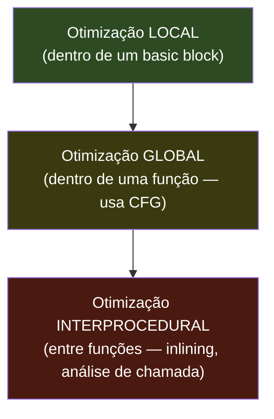
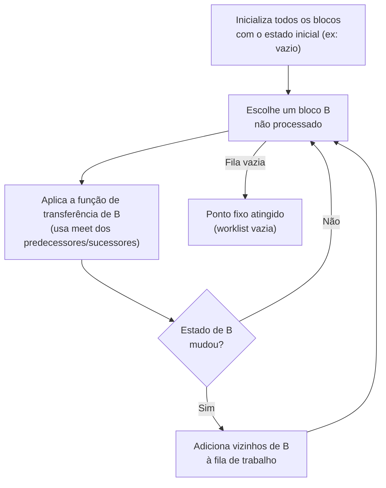
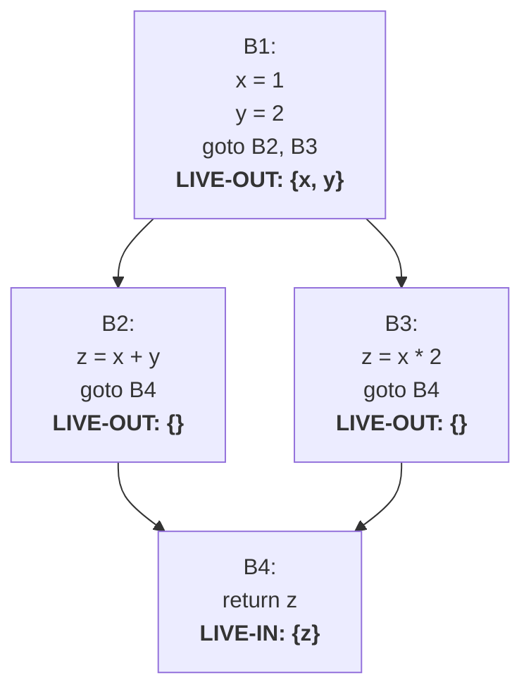
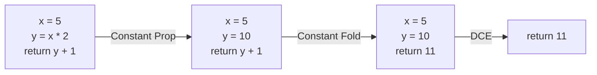
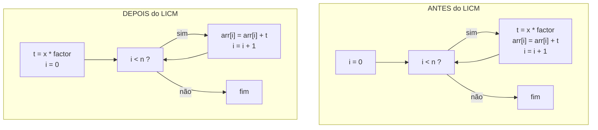
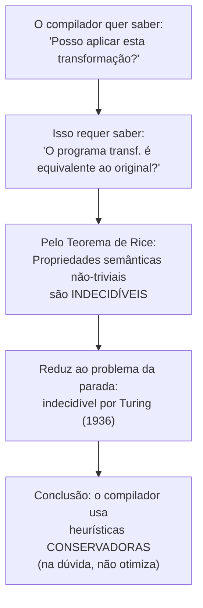

# Otimização

> [!abstract] TL;DR
> Otimização de compilador transforma o código (geralmente na IR) para rodar mais rápido ou ocupar menos espaço **sem alterar a semântica observável**. O compilador usa análise de fluxo de dados para enxergar oportunidades — constant folding, DCE, CSE, inlining, LICM — em escopos local, global e interprocedural. O otimizador perfeito é teoricamente impossível (Rice/halting); o que existe são heurísticas conservadoras e níveis de flag (`-O0` a `-Ofast`) que controlam o trade-off entre qualidade do código, tamanho e depurabilidade.

---

## O que é uma otimização correta?

Antes de qualquer coisa, vamos acertar o vocabulário: a palavra "otimização" é um nome torto para uma ideia simples. **Otimizar** aqui significa *melhorar* — e não "atingir o ótimo", porque atingir o ótimo absoluto é matematicamente impossível (voltamos a isso na última seção).

Uma transformação é **correta** se, e somente se:

1. O programa produz **o mesmo resultado observável** para qualquer entrada válida.
2. Os **efeitos colaterais** (I/O, exceções, ordem de acesso a memória compartilhada) são preservados.

Tudo o mais é negociável. O compilador pode reordenar instruções, eliminar variáveis, fundir loops, substituir multiplicações por shifts — desde que nenhum observador externo consiga perceber a diferença.

Pense assim: imagine um programa como uma caixa-preta. Você entra com os mesmos dados e sai com os mesmos resultados, na mesma ordem, com os mesmos efeitos no mundo externo. O que acontece *dentro* da caixa pode ser completamente diferente. O compilador trabalha nesse espaço de equivalência.

> [!warning] Semântica observável não é "o mesmo assembly"
> Dois programas podem ter assemblies completamente diferentes e ainda ser semanticamente equivalentes. O compilador explora esse espaço de equivalência agressivamente. O perigo surge quando o programador assume um comportamento que **não** faz parte do contrato da linguagem (comportamento indefinido — UB — em C/C++, por exemplo) e o compilador, legitimamente, "quebra" o código ao otimizar.
>
> Um exemplo clássico: em C, acesso a um ponteiro nulo é UB. O compilador pode assumir que UB não ocorre e eliminar verificações de nulidade que aparentemente "protegem" o acesso. O código parece seguro; o binário otimizado, não.

---

## Escopos: local, global, interprocedural

Pense na otimização como uma lente com três amplitudes de zoom.



> [!info] Leitura do diagrama
> Cada nível engloba o anterior. Quanto maior o escopo, mais oportunidades de melhoria — e mais custo de análise.

**Local (basic block):** Um basic block é uma sequência linear de instruções sem desvios no meio (ver [[11 - Representação intermediária e SSA]]). Dentro dele, as relações def-use são triviais de calcular: basta varrer de cima para baixo. Constant folding e CSE local funcionam aqui sem CFG.

**Global (intra-procedural):** A análise atravessa os basic blocks de uma função inteira, usando o grafo de fluxo de controle (CFG) para rastrear quais valores chegam a quais pontos. É aqui que liveness analysis e reaching definitions vivem. Mais poder, mais custo.

**Interprocedural:** A análise cruza fronteiras de funções. O caso mais óbvio é o **inlining** — substituir uma chamada pelo corpo da função. Para análises mais profundas (pointer aliasing global, propagação de constantes entre funções), o compilador precisa de um call graph inteiro, o que fica caro para programas grandes.

> [!tip] Quanto maior o escopo, mais poder e mais custo
> Local custa O(n) onde n é o tamanho do bloco. Global custa O(n²) ou mais por convergência iterativa no CFG. Interprocedural pode ser O(n³) ou indecidível no caso geral. O compilador escolhe o escopo de cada análise com base no trade-off tempo de compilação × qualidade do código.

---

## Dataflow Analysis: o motor das otimizações globais

Se o CFG é o mapa da função, o **dataflow analysis** é o processo de propagar "fatos" por esse mapa até que nenhum fato novo apareça — o chamado **ponto fixo** (*fixed point*).

A ideia é simples: cada nó do CFG (basic block) tem uma função de transferência que descreve como os fatos mudam ao atravessar aquele bloco. Você aplica essas funções iterativamente até o sistema estabilizar.



> [!info] Leitura do diagrama
> O algoritmo de worklist é a implementação padrão: em vez de iterar sobre todos os blocos toda vez, mantém uma fila dos blocos cujos predecessores/sucessores mudaram. Converge em tempo proporcional ao número de nós × profundidade do reticulado (*lattice*) dos fatos.

Existem duas direções:

- **Forward analysis:** os fatos fluem da entrada para a saída (ex: reaching definitions — "qual definição chega aqui?").
- **Backward analysis:** os fatos fluem da saída para a entrada (ex: liveness — "esta variável será usada depois?").

O operador **meet** (ou join) combina os fatos vindos de múltiplos predecessores/sucessores. Para liveness, o meet é a **união** (uma variável está viva se está viva em *algum* sucessor). Para available expressions, é a **interseção** (uma expressão está disponível só se está disponível em *todos* os predecessores).

Por que a direção importa? Imagine que você quer saber se `x` é usada depois de um ponto P. Você precisa olhar *para frente* — mas para juntar informação de múltiplos caminhos futuros, você precisa *voltar* pelos sucessores. É por isso que liveness é backward: você começa nos usos (folhas do CFG, saídas da função) e propaga de volta para as definições.

Reaching definitions é o oposto: você começa nas definições e pergunta "esta definição consegue chegar até este uso sem ser redefinida no caminho?" — flui para frente.

### Liveness Analysis — exemplo concreto

Uma variável está **viva** (*live*) num ponto do programa se existe algum caminho desse ponto até um uso futuro sem uma definição no meio. Intuitivo: se você vai usar `x` depois, `x` está viva agora.

Por que isso importa além do alocador de registradores? Porque liveness determina quais stores de memória precisam acontecer (só salvar uma variável que vai ser lida depois), quais leituras são necessárias (só ler o que vai ser usado), e quais cópias são redundantes. A análise é o coração de múltiplas passes de otimização.



> [!info] Leitura do diagrama
> Começamos de baixo para cima (backward). B4 usa `z`, logo `z` está viva na entrada de B4. B2 e B3 definem `z`, então `z` não está viva antes deles — mas `x` e `y` (usados em B2) e `x` (usado em B3) estão. O meet em B1 é a união: `{x, y}`. Liveness informa o alocador de registradores (nota [[14 - Alocação de registradores]]) quais variáveis precisam de um registrador ao mesmo tempo.

---

## As otimizações clássicas

### Constant Folding e Constant Propagation

**Constant folding:** avaliar expressões constantes em tempo de compilação.

```text
; Antes
t1 = 3 * 4
t2 = t1 + 1

; Depois (constant folding)
t1 = 12
t2 = 13
```

**Constant propagation:** se uma variável sempre tem um valor constante num ponto, substituir seus usos por esse valor.

```c
// Antes
int x = 5;
int y = x * 2;   // x é sempre 5 aqui

// Depois
int x = 5;
int y = 10;      // x substituído → y dobrado → x vira dead code
```



> [!info] Leitura do diagrama
> As três otimizações se alimentam mutuamente: propagação gera dobráveis, que geram código morto, que a DCE elimina. Esse ciclo pode iterar.

### Dead Code Elimination (DCE)

Se o resultado de uma computação **nunca é usado**, ela pode ser removida — desde que não tenha efeitos colaterais.

```text
; Antes
t1 = a + b    ; resultado nunca usado
t2 = c * d
return t2

; Depois
t2 = c * d
return t2
```

Em SSA (nota [[11 - Representação intermediária e SSA]]), identificar código morto é trivial: se uma definição não tem usos, ela está morta. Basta varrer as listas de uso.

Existe uma versão mais poderosa, a **ADCE (Aggressive Dead Code Elimination)**, que vai além: além de remover instruções sem usos, também pode remover branches que nunca são tomados — por exemplo, após constant propagation mostrar que uma condição é sempre falsa. Isso cria um ciclo produtivo: DCE revela novos alvos para constant propagation, que revela novos alvos para DCE.

> [!tip] Código morto "intencional"
> Frameworks de feature flags frequentemente produzem código morto intencional: `if (FEATURE_X_ENABLED) { ... }`. Com constante de compilação (`constexpr` em C++, `const` em Rust, diretivas de preprocessador em C), o compilador elimina o branch inteiro em produção. Isso é DCE como mecanismo de deploy — você "embarca" código inativo e o compilador simplesmente o apaga.

### Common Subexpression Elimination (CSE)

Se a mesma expressão é computada mais de uma vez **com os mesmos operandos** e nenhum deles muda entre as computações, calcule uma vez e reutilize.

```c
// Antes
float dist1 = sqrt(x*x + y*y);
float dist2 = sqrt(x*x + y*y);  // idêntico!

// Depois
float xy2 = x*x + y*y;          // calculado uma vez
float dist1 = sqrt(xy2);
float dist2 = sqrt(xy2);
```

CSE local funciona dentro de um basic block. CSE global (disponível em todos os caminhos → available expressions analysis) precisa de dataflow.

O critério é: a expressão deve estar disponível em **todos** os caminhos que chegam ao ponto de reutilização. Se existe ao menos um caminho onde `x*x + y*y` não foi calculado (por exemplo, um branch que pula a primeira ocorrência), a expressão não está "available" e a CSE não pode ser aplicada com segurança.

> [!example] CSE e aliasing
> CSE é mais sutil com ponteiros. Se `*p` aparece duas vezes, o compilador só pode reutilizar o valor se tiver certeza de que nada escreveu em `*p` entre as duas leituras. Análise de aliasing (alias analysis) determina quais ponteiros podem apontar para os mesmos endereços — e é uma das análises mais complexas (e conservadoras) do compilador.

### Copy Propagation

Quando uma instrução é simplesmente uma cópia (`x = y`), substitua usos posteriores de `x` por `y` — e deixe a DCE eliminar a cópia.

```text
; Antes
x = y
z = x + 1

; Depois (copy prop)
x = y
z = y + 1

; Depois (DCE se x não tem outros usos)
z = y + 1
```

### Inlining

Substituir a chamada de uma função pelo seu corpo no local da chamada.

```c
// Antes
static int dobro(int n) { return n * 2; }
int r = dobro(x) + dobro(y);

// Depois (inlining)
int r = (x * 2) + (y * 2);
```

O ganho real do inlining não é só eliminar o overhead da chamada (push/pop, branch). É que **ele habilita outras otimizações**: constant propagation nos argumentos, DCE de branches que nunca serão tomados, CSE entre o corpo inlinado e o contexto. Um bom inlining transforma um grafo de chamadas profundo numa sequência linear de instruções que o processador pode executar com pipeline cheio.

> [!warning] Trade-off: tamanho × velocidade
> Inline demais enche o I-cache e pode causar mais misses do que salvaria em overhead de chamada. Compiladores usam heurísticas (tamanho da função, frequência de chamada via PGO) para decidir quando inline compensa. Em Rust, `#[inline]` é uma sugestão; `#[inline(always)]` e `#[inline(never)]` são forçados. Em C/C++, `__attribute__((always_inline))` e `__attribute__((noinline))` cumprem o mesmo papel. O compilador geralmente sabe mais do que você — use essas anotações só com benchmarks em mãos.

### Loop-Invariant Code Motion (LICM)

Se uma computação dentro de um loop produz **sempre o mesmo resultado** (não depende de variáveis modificadas no loop), ela pode ser movida para **antes** do loop.



> [!info] Leitura do diagrama
> `t = x * factor` não depende de `i` nem de `arr[i]`, logo é invariante do loop. O compilador identifica isso via dataflow (nenhuma definição de `x` ou `factor` está dentro do loop) e move a instrução para o *preheader* — um bloco que executa uma vez antes do loop.

### Strength Reduction e afins

Substituir operações caras por equivalentes baratas:

```text
; Antes (multiplicação por 2)
t = x * 2

; Depois (shift — 1 ciclo em vez de 3-5)
t = x << 1

; Antes (multiplicação por potência de 2 em loop)
for i in 0..n: arr[i] = i * 8

; Depois (acumulador)
acc = 0
for i in 0..n: arr[i] = acc; acc = acc + 8
```

**Loop unrolling** e **vectorization** são otimizações de laço mais agressivas: unrolling replica o corpo N vezes para reduzir overhead de controle (verificação de índice, branch, incremento) ao custo de código maior; vectorization transforma iterações escalares em instruções SIMD que processam múltiplos elementos em paralelo. Ambas interagem fortemente com o hardware alvo — o que nos leva ao capítulo de geração de código ([[13 - Geração de código e seleção de instruções]]).

> [!tip] Strength reduction em loops — o padrão histórico
> Em arquiteturas antigas, multiplicação era cara (10-20 ciclos) e adição, barata (1 ciclo). O compilador convertia `i * k` dentro de um loop em um acumulador de adições. Hoje, com multiplicadores rápidos em pipeline, a técnica é menos crítica — mas a ideia persiste para operações como divisão (convertida em multiplicação por recíproco) e módulo por potência de 2 (convertido em AND de bits).

---

## Por que SSA facilita tudo isso

Em SSA (Static Single Assignment), cada variável é definida **exatamente uma vez**. As consequências são enormes para o otimizador:

- **Use-def triviais:** dado um uso de `x₃`, há exatamente uma definição de `x₃` no programa inteiro. Não precisa de dataflow para encontrá-la.
- **DCE em uma passagem:** se `x₃` não tem usos, sua definição está morta. Verificação O(1) por definição.
- **Constant propagation (SCCP — Sparse Conditional Constant Propagation):** propagar constantes em SSA é equivalente a resolver um sistema de equações simples no grafo de dependências — eficiente e preciso. O "sparse" vem do fato de que, com use-def explícitos, você só visita nós relevantes em vez de iterar sobre todos os blocos.
- **CSE via value numbering:** em SSA, duas instruções com o mesmo opcode e os mesmos operandos (nomes SSA iguais) produzem garantidamente o mesmo valor. CSE vira comparação de strings — ou hashing de tuplas (opcode, operandos).

Antes do SSA, dataflow analysis era O(n²) ou pior para calcular use-def chains. Com SSA, as chains são literais: cada nome SSA tem uma lista de definição (tamanho 1) e uma lista de usos (tamanho arbitrário). O custo é a inserção de φ-nodes nas junções do CFG — mas esse custo é pago uma vez, durante a construção da IR, e amortizado sobre todas as otimizações que rodam depois.

> [!success] SSA como habilitador
> A maioria das otimizações modernas (em LLVM, GCC, JVM JIT, JavaScript V8) opera sobre SSA porque a forma elimita a complexidade de rastrear definições múltiplas. É um exemplo de como uma representação bem escolhida pode simplificar drasticamente os algoritmos que operam sobre ela.

---

## "Otimização prematura é a raiz de todo mal"

Donald Knuth escreveu em 1974, no artigo *Structured Programming with go to Statements*:

> *"We should forget about small efficiencies, say about 97% of the time: premature optimization is the root of all evil. Yet we should not pass up our opportunities in that critical 3%."*

A frase é frequentemente amputada na primeira metade e usada como desculpa para nunca otimizar nada. O contexto real é diferente: Knuth argumentava que **micro-otimizações manuais** (o equivalente da época: uso manual de `goto` para acelerar loops) obscurecem o código e devem ser evitadas *exceto nos 3% críticos identificados por profiling*.

O argumento aplica-se à otimização manual pelo programador, não à otimização pelo compilador. O compilador pode otimizar agressivamente **sem tornar o código-fonte ilegível**. Você escreve `a + b + c + d`; o compilador reordena para minimizar dependências; o código-fonte permanece limpo.

> [!tip] Quando confiar no compilador
> Para a esmagadora maioria do código, `-O2` faz um trabalho melhor que qualquer micro-otimização manual. Reserve otimizações manuais para hot paths identificados por profiler, com benchmarks antes/depois. O compilador é conservador onde você seria impreciso — e preciso onde você seria lento.

---

## Níveis de otimização: -O0 a -Ofast

| Flag | Nome | O que ativa | Uso típico |
|------|------|-------------|------------|
| `-O0` | Sem otimização | Nenhuma; mapeamento 1:1 fonte↔instrução | Debug (GDB, AddressSanitizer) |
| `-O1` | Conservador | DCE básica, folding, redução simples | Compilações rápidas com algum ganho |
| `-O2` | Padrão release | CSE global, LICM, inlining moderado, scheduling | Padrão para produção |
| `-O3` | Agressivo | Inlining agressivo, vectorização, unrolling | Código numérico, HPC |
| `-Os` | Size | Como -O2, menos transformações que aumentam código | Embedded, firmwares |
| `-Ofast` | Sem garantias | -O3 + **fast-math** + violações de padrão | Benchmarks, código numérico sem NaN/Inf |

> [!danger] -Ofast é uma armadilha
> `-Ofast` habilita `-ffast-math`, que **viola o padrão IEEE 754**: reordena operações de ponto flutuante (que não são associativas), elimina verificações de NaN/Inf, trata `0.0` como idêntico a `-0.0`. Resultados podem diferir da execução não-otimizada. Para código financeiro, científico com invariantes numéricas, ou qualquer coisa que dependa de comportamento IEEE, `-Ofast` é uma bomba-relógio silenciosa.

`-O0` é fundamental para depuração: garante que cada linha do fonte corresponda a instruções identificáveis, que variáveis existam onde o debugger espera, e que nenhuma transformação "engula" um ponto de parada. É por isso que ambientes de desenvolvimento separam `Debug` e `Release` como configurações de build distintas.

Uma situação clássica de confusão: o programador coloca um `printf` para inspecionar o valor de uma variável, e o valor *muda* dependendo se o print está presente ou não. Isso não é bug do compilador — é efeito colateral intencionado pelo `-O2`: sem o print, a variável era dead code e foi eliminada; com o print, há um uso e ela persiste. O comportamento do programa é o mesmo (o resultado final não depende da variável), mas a depuração fica confusa. Solução: usar `-O0` ou `-Og` enquanto depura.

Outra nuance importante: **LTO (Link-Time Optimization)** estende a otimização além dos limites de unidade de compilação. Com LTO, o linker tem acesso à IR de todas as unidades e pode fazer inlining e análise interprocedural entre arquivos `.o` separados. GCC e Clang suportam LTO via `-flto`; é transparente para o programador mas pode aumentar dramaticamente o tempo de link em projetos grandes.

---

## O limite teórico: o otimizador perfeito é impossível

Chegamos à questão fundamental: existe algum algoritmo que, dado um programa, produza o programa equivalente mais eficiente possível?

**Não.** E a razão é o Teorema de Rice.

O Teorema de Rice afirma que qualquer propriedade **semântica não-trivial** de programas é indecidível. Uma propriedade é não-trivial se alguns programas a satisfazem e outros não. "Produz o mesmo output para todas as entradas" é exatamente essa categoria.

A consequência direta: para decidir se duas versões de um programa são equivalentes no caso geral, o compilador precisaria resolver o problema da parada ([[03-Dominios/Ciência/Teoria da Computação/11 - O problema da parada]]) — e esse problema é indecidível.



> [!info] Leitura do diagrama
> A cadeia de reduções mostra por que o otimizador perfeito não existe: toda tentativa de decidir equivalência semântica esbarra na indecidibilidade do problema da parada. O compilador escapa disso sendo conservador — só aplica transformações para as quais tem uma prova estática de correção.

Na prática, o compilador:

1. Usa análises que são **corretas por construção** (sound): se a análise diz "pode otimizar", é seguro. Pode haver falsos negativos (oportunidades perdidas), mas nunca falsos positivos (transformações incorretas).
2. Escolhe profundidade de análise com base no custo de compilação aceitável.
3. Usa heurísticas e perfil de execução (PGO — Profile-Guided Optimization) para escolher quais oportunidades perseguir.

O nome "otimização" seria mais honesto como "melhoria conservadora guiada por análise estática" — mas é longo demais para um flag de compilador.

Existe até um resultado teórico mais forte: dado que a otimização de compilador equivale a verificar propriedades semânticas de programas, e que isso é indecidível pelo Teorema de Rice, nenhum compilador que termine em tempo finito para toda entrada pode ser completo. O compilador sempre vai deixar algum dinheiro na mesa — alguma otimização válida que ele não aplicou porque não conseguiu provar sua correção.

> [!example] PGO — quando o compilador aprende com dados reais
> Profile-Guided Optimization (PGO) funciona em duas passagens: (1) compila com instrumentação para contar frequências de branches e chamadas; (2) recompila usando esse perfil para tomar decisões melhores — inlining de funções quentes, layout de código para minimizar misses de I-cache, predição de branch. O resultado pode ser 10-30% mais rápido que `-O3` sem PGO. A desvantagem: você precisa de uma workload representativa para instrumentar.

### O que o compilador não pode fazer sozinho

Mesmo o melhor compilador não consegue:

- **Escolher algoritmos melhores:** transformar O(n²) em O(n log n) está além da análise estática. O compilador otimiza *constantes*, não *complexidade*.
- **Otimizar layouts de dados para cache:** se você usa uma lista de estruturas (*array of structs*) onde um *struct of arrays* seria melhor para SIMD, o compilador pode vetorizar mas não pode reorganizar a memória.
- **Eliminar contenção de lock:** race conditions e hot mutexes são problemas de design, não de IR.
- **Prever comportamento externo:** chamadas de sistema, I/O, rede — o compilador não sabe quanto tempo levam.
- **Otimizar alocações de heap:** `malloc`/`free` são chamadas opacas para o compilador. Gerenciar o ciclo de vida de memória (arena allocators, pool allocators, stack allocation) é trabalho do programador — ou do garbage collector, em linguagens gerenciadas.

A regra prática: o compilador é seu aliado para transformações que *preservam* a estrutura lógica do algoritmo. Mudanças de *estrutura* — layout de dados, escolha de algoritmo, estratégia de concorrência — são responsabilidade do programador.

---

## Conexões

- Anterior: [[11 - Representação intermediária e SSA]] — SSA e CFG são a base de tudo aqui; as passes de otimização operam sobre a IR em SSA
- Próxima: [[13 - Geração de código e seleção de instruções]] — o que acontece depois de otimizar: mapear IR para instruções de máquina
- [[14 - Alocação de registradores]] — usa liveness analysis diretamente para determinar interferência entre variáveis
- [[03-Dominios/Ciência/Teoria da Computação/11 - O problema da parada]] — limite teórico do otimizador: Rice e halting explicam por que heurísticas conservadoras são inevitáveis

> [!summary] Resumo em uma linha
> Otimização de compilador é a arte de transformar IR em IR mais eficiente sem mudar a semântica observável, usando dataflow analysis para propagar fatos pelo CFG até o ponto fixo — e sabendo que o otimizador perfeito é provadamente impossível.

---

## Em entrevista

Em entrevistas de nível senior, otimização de compilador aparece em perguntas sobre performance, análise estática, linguagens de programação e sistemas. O vocabulário em inglês é essencial. Perguntas comuns incluem "explain how the compiler eliminates dead code", "what is liveness analysis used for?", e "why can't the compiler always optimize perfectly?". Saber conectar a teoria (indecidibilidade) à prática (flags, SSA, passes) demonstra profundidade real.

*Compiler optimization transforms the IR to run faster or use less space without changing observable semantics. The key analyses — liveness, reaching definitions, available expressions — propagate facts through the CFG until a fixed point. Classic passes include constant folding and propagation, dead code elimination, common subexpression elimination, inlining, and loop-invariant code motion. SSA simplifies all of these because each variable has exactly one definition, making use-def chains trivial. The optimizer can never be perfect — by Rice's theorem, deciding semantic equivalence in the general case reduces to the halting problem — so compilers use sound but conservative heuristics. Optimization flags (-O0 through -Ofast) let the user trade compilation time, code size, and safety guarantees for runtime performance.*

*Premature optimization is still the root of all evil in the sense Knuth intended: micro-optimizing manually before profiling wastes time and obscures code. But that is orthogonal to compiler optimization, which improves the generated code without touching the source.*

*A correct optimization preserves observable semantics — same outputs, same side effects, same observable behavior — while transforming the internal representation. Undefined behavior in the source language (like signed integer overflow in C) gives the optimizer license to assume it never happens, which can lead to surprising transformations.*

| Português | English |
|-----------|---------|
| Otimização | Optimization |
| Análise de fluxo de dados | Dataflow analysis |
| Ponto fixo | Fixed point |
| Análise de vivacidade | Liveness analysis |
| Definições que alcançam | Reaching definitions |
| Eliminação de código morto | Dead code elimination |
| Dobramento de constantes | Constant folding |
| Propagação de constantes | Constant propagation |
| Eliminação de subexpressão comum | Common subexpression elimination (CSE) |
| Substituição inline | Inlining |
| Movimento de código invariante de loop | Loop-invariant code motion (LICM) |
| Redução de força | Strength reduction |
| Escopo local / global / interprocedural | Local / global / interprocedural scope |
| Conservador (análise) | Sound / conservative (analysis) |
| Heurística | Heuristic |

> [!info] Lastro
> 1. Aho, A. V., Lam, M. S., Sethi, R., Ullman, J. D. *Compilers: Principles, Techniques, and Tools* (2nd ed., "Dragon Book"), Pearson, 2006 — Caps. 8 e 9 (machine-independent optimizations, dataflow analysis). [pearson.com](https://www.pearson.com/en-us/subject-catalog/p/Aho-Compilers-Principles-Techniques-and-Tools-2nd-Edition/P200000003472)
> 2. Knuth, D. E. "Structured Programming with go to Statements". *ACM Computing Surveys*, 6(4), 1974. A fonte original da citação sobre otimização prematura, com contexto completo. [acm.org](https://dl.acm.org/doi/10.1145/356635.356640)
> 3. Cooper, K. D., Torczon, L. *Engineering a Compiler* (3rd ed.), Elsevier/Morgan Kaufmann, 2022 — Caps. 8-10 (introducão à otimização, dataflow analysis, scalar optimizations). [elsevier.com](https://shop.elsevier.com/books/engineering-a-compiler/cooper/978-0-12-815412-0)
> 4. GCC Documentation — *Optimize Options*. Referência oficial dos flags `-O0` a `-Ofast` e o que cada um habilita. [gcc.gnu.org](https://gcc.gnu.org/onlinedocs/gcc/Optimize-Options.html)
> 5. LLVM Project — *LLVM's Analysis and Transform Passes*. Documentação dos passes de otimização do LLVM (instcombine, mem2reg, licm, gvn, inline, etc.). [llvm.org](https://llvm.org/docs/Passes.html)
> 6. Muchnick, S. S. *Advanced Compiler Design and Implementation*. Morgan Kaufmann, 1997 — Referência clássica para otimizações avançadas (alias analysis, interprocedural, loop transformations). ISBN 1-55860-320-4.
