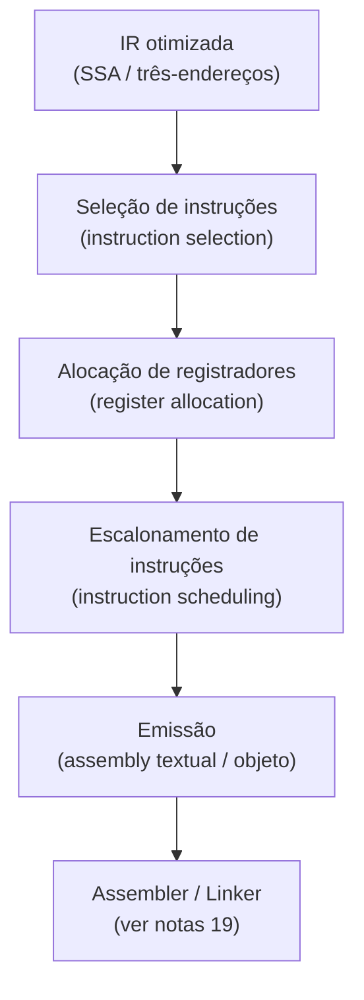
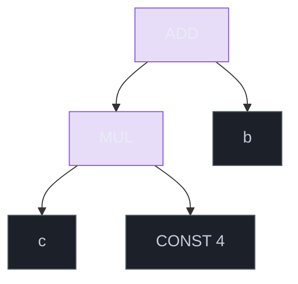
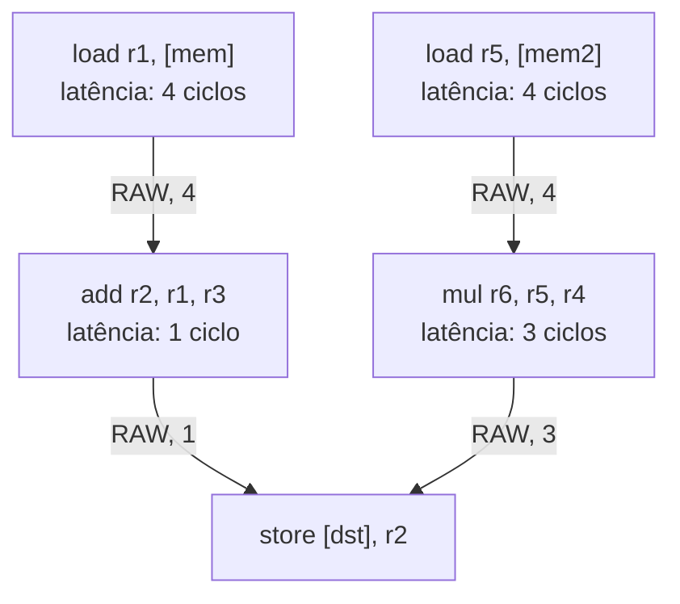
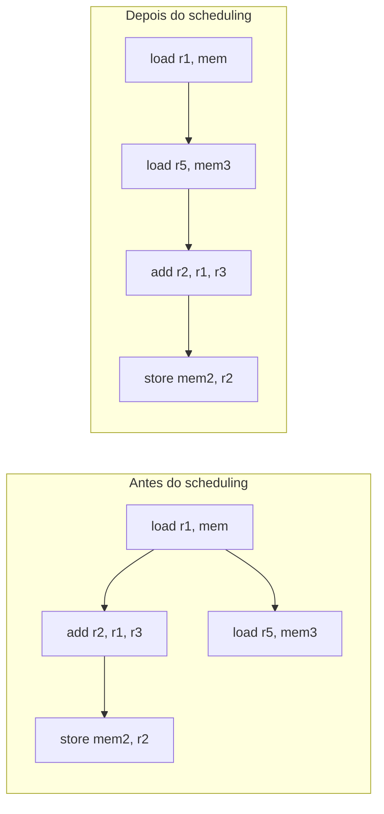
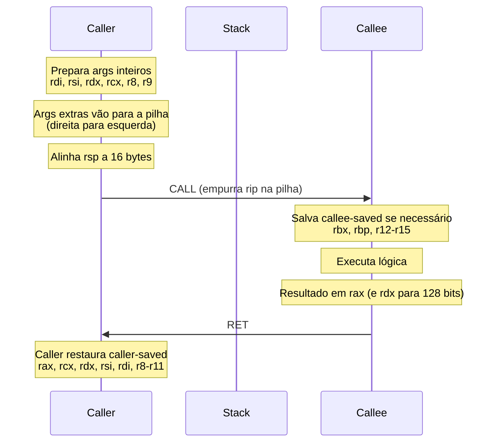
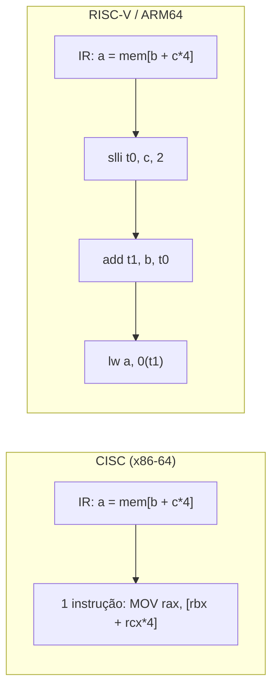
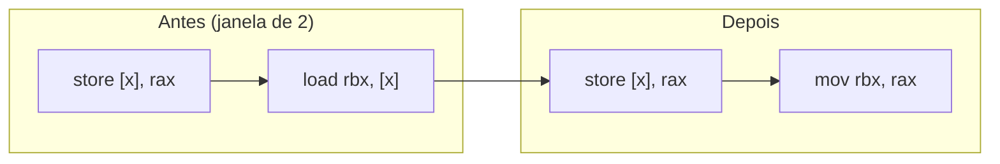

# Geração de código e seleção de instruções

> [!abstract] TL;DR
> O back-end do compilador recebe a IR otimizada e tem três tarefas clássicas: **selecionar** quais instruções da ISA representam cada operação da IR, **alocar registradores** (nota 14) e **escalonar** a ordem de emissão para esconder latências de pipeline. A seleção de instruções é o problema de *tiling* — cobrir a árvore da IR com padrões de instruções de custo mínimo. Calling conventions e ABI definem o contrato que permite código de diferentes compiladores conviver no mesmo binário.

---

## O back-end: o que acontece depois da otimização

Você chegou até aqui com uma IR otimizada — seja três-endereços ou SSA, já tratada pelas passes de [[12 - Otimização]] e [[11 - Representação intermediária e SSA]]. Agora começa o trabalho de materializar esse programa abstrato em instruções reais para uma ISA específica.

O back-end clássico tem três tarefas que se encadeiam:

1. **Seleção de instruções** — mapear operações da IR a instruções da ISA alvo.
2. **Alocação de registradores** — decidir quais valores vivem em registradores e quais vão para a pilha (ver [[14 - Alocação de registradores]]).
3. **Escalonamento de instruções** — reordenar as instruções para explorar o pipeline e esconder latências.

O diagrama abaixo mostra o fluxo completo:



> [!info] Leitura do diagrama
> As três fases centrais interagem entre si — alocação pode criar spills que exigem nova seleção; escalonamento pode revelar oportunidades de alocação. Compiladores modernos (LLVM, GCC) iteram sobre essas fases em múltiplas passes.

---

## Seleção de instruções: o problema do tiling

Imagine que a IR é uma árvore de expressão. Cada instrução da ISA é um *tile* — um padrão que cobre um ou mais nós dessa árvore. A seleção de instruções é, essencialmente, o problema de **cobrir a árvore inteira com tiles**, minimizando o custo total (número de instruções, latência, tamanho do código).

Por que é não-trivial? Porque uma operação da IR pode virar **uma ou várias** instruções, e uma única instrução pode cobrir **vários nós** da IR de uma vez.

Exemplo canônico: a instrução `LEA` (load effective address) do x86 computa `base + index * scale + offset` em um único ciclo — ela "engole" uma multiplicação por constante mais uma soma, dois nós da árvore, com uma instrução só. Da mesma forma, `FMA` (fused multiply-add) do ARM/AVX cobre `a = b * c + d` sem arredondamento intermediário.

### O problema formal: tiling de árvore

Dada uma árvore de IR e um conjunto de padrões de instrução com custos associados, encontre uma cobertura completa de custo mínimo.



> [!info] Leitura do diagrama
> A expressão `a = b + c * 4`. Tiling 1 (ingênuo): três instruções — MOV, SHL (shift left por 2 = ×4), ADD. Tiling 2 (otimizado): `LEA rax, [rbx + rcx*4]` — uma instrução cobre todos os nós. O compilador precisa reconhecer o padrão inteiro para emitir o tile mais econômico.

Vejamos os dois tilings em assembly (alvo x86-64, apenas para ilustrar a diferença de cobertura — para ISA detalhada veja [[03-Dominios/Ciência/Organização de Computadores/08 - ISA - a interface hardware-software]]):

```asm
; Tiling ingênuo — 3 instruções
mov  eax, ecx       ; eax = c
shl  eax, 2         ; eax = c * 4
add  eax, ebx       ; eax = b + c*4

; Tiling otimizado — 1 instrução (LEA cobre MUL + ADD)
lea  eax, [rbx + rcx*4]
```

### Algoritmos de tiling

**Maximal munch (guloso, top-down):** começa na raiz da árvore e escolhe o tile que cobre o maior número de nós possível a cada passo. É simples de implementar, mas pode produzir coberturas subótimas — o tile "gordo" na raiz pode forçar tiles "magros" nos filhos.

**Dynamic programming (ótimo, bottom-up):** para cada nó da árvore, computa o custo mínimo de cobrir a subárvore enraizada ali. Garante solução ótima ao custo de mais complexidade. É a base do algoritmo de Aho, Ganapathi e Tjiang (1989), antecessor dos BURS.

**BURS (Bottom-Up Rewrite Systems):** codificam os padrões de instrução como regras de reescrita e constroem um autômato de estados que reconhece padrões eficientemente. A ideia central: pré-compilar as regras em tabelas compactas (similar a um DFA), de modo que a varredura bottom-up da árvore em tempo de compilação seja quase tão rápida quanto executar um analisador léxico. O LLVM usa SelectionDAG + TableGen como aproximação moderna desse conceito.

> [!tip] Por que a IR como DAG e não árvore pura?
> Em SSA, valores com múltiplos usos aparecem como nós compartilhados — a estrutura é uma DAG (grafo acíclico dirigido). Algoritmos de tiling para DAGs são mais complexos porque o mesmo nó pode ser coberto por tiles diferentes em diferentes caminhos de uso. O SelectionDAG do LLVM lida com isso durante a fase de legalização.

### Um exemplo de tiling completo: maximal munch vs. dinâmico

Considere a expressão `t = (a + b) * (a + b)`. Em SSA, `a + b` é um nó compartilhado — a DAG tem dois arestas saindo do mesmo nó ADD para ambos os ramos do MUL. O compilador precisa decidir: materializa `a + b` em um registrador e reutiliza, ou recalcula?

Maximal munch, percorrendo top-down, tende a materializar em registrador (tile MUL cobre MUL, tile ADD cobre ADD, percebe o compartilhamento). O algoritmo dinâmico computa o custo de recalcular versus guardar — e se o registrador está sob pressão, pode escolher recalcular.

```text
; Opção A: materializar (1 add + 1 mul = 2 instruções)
add  r1, a, b       ; r1 = a + b
mul  r0, r1, r1     ; r0 = r1 * r1

; Opção B: recalcular (2 add + 1 mul = 3 instruções, mas libera r1)
add  r1, a, b
add  r2, a, b
mul  r0, r1, r2
```

A opção A é melhor quando há registrador livre. A opção B pode ser preferível se `r1` é crítico em um loop com muita pressão de registradores — o escalonador e o alocador juntos tomam essa decisão.

### Legalização: quando a IR não tem instrução correspondente

Nem toda operação da IR existe na ISA alvo. O LLVM chama esse processo de **legalização**: operações ilegais são expandidas em sequências de operações legais antes da seleção propriamente dita.

Exemplos:
- `i128 add` em x86-64 não existe nativamente → expande em dois `add` de 64 bits com carry (`add rax, ...; adc rdx, ...`).
- `f16 load` em ARM sem suporte a half precision → converte para `f32` via instrução de extensão.
- Vetores de tamanho arbitrário → divide em chunks do tamanho do registrador SIMD disponível.

Legalização acontece antes do tiling, garantindo que o selecionador só enxerga padrões que a ISA efetivamente suporta.

---

## Escalonamento de instruções

Você tem a lista de instruções selecionadas. Mas a ordem em que você as emite importa? Muito.

Processadores modernos têm pipelines profundos e unidades de execução paralelas — mas também **latências**: uma instrução de load pode levar 4-5 ciclos para produzir seu resultado. Se a instrução seguinte depende desse resultado, o pipeline para (stall). O escalonador de instruções reordena as instruções para **esconder latências**, preenchendo os "buracos" com trabalho independente.

O problema é restrito por **dependências de dados**:

- **RAW (Read After Write):** a instrução B lê um valor que A escreve. B não pode ser movida antes de A.
- **WAR (Write After Read):** B escreve onde A lê. Em SSA isso é raro, mas aparece após alocação de registradores.
- **WAW (Write After Write):** ambas escrevem no mesmo local — a segunda deve manter a ordem.

O **list scheduling** é o algoritmo mais usado: constrói um grafo de dependências, mantém uma lista de instruções "prontas" (todos os predecessores já emitidos) e escolhe iterativamente qual emitir com base em heurísticas (ex.: preferir instruções com maior caminho crítico à frente).

### Grafo de dependências: a estrutura que guia o escalonador

O escalonador começa construindo um DAG de dependências onde nós são instruções e arestas representam dependências. Cada aresta carrega o **peso de latência** — quantos ciclos a instrução-fonte leva para produzir seu resultado.



> [!info] Leitura do diagrama
> O caminho crítico passa por `load r1 → add → store` com latência total de 5 ciclos. O list scheduler prioriza instruções no caminho crítico e intercala `load r5` e `mul` nos slots livres, escondendo suas latências atrás do trabalho do outro caminho.

### Pre-RA vs. post-RA scheduling

O escalonamento pode ocorrer em dois momentos no pipeline do compilador:

- **Pre-RA (antes da alocação):** trabalha com registradores virtuais ilimitados, tem mais liberdade de reordenamento, mas não sabe as pressões reais de registrador.
- **Post-RA (após a alocação):** trabalha com registradores físicos reais, pode explorar slots de branch delay (MIPS, SPARC legado) e fazer uso de unidades de execução específicas (load unit, FPU).

Compiladores modernos como LLVM fazem ambos: `MachineFunctionPass` de scheduling pre-RA e `PostRAScheduler` para refinamento final.



> [!info] Leitura do diagrama
> O segundo load (independente) foi movido para preencher o slot de latência do primeiro load. A instrução `add` agora tem os ciclos de que precisa para encontrar `r1` disponível. Para entender o pipeline que motiva esse reordenamento, veja [[03-Dominios/Ciência/Organização de Computadores/09 - Assembly e o modelo de execução]].

---

## ABI e calling conventions: o contrato invisível

Pergunta: como uma função compilada com GCC chama uma função compilada com Clang? A resposta é: através da **ABI (Application Binary Interface)** — um contrato que define como o código binário de módulos independentes se comunica.

A parte mais visível da ABI é a **calling convention** (convenção de chamada). Ela especifica:

- **Passagem de argumentos:** quais registradores carregam os primeiros N argumentos; o resto vai para a pilha.
- **Valor de retorno:** em que registrador o callee devolve o resultado.
- **Caller-saved vs. callee-saved:** quem é responsável por preservar quais registradores.
- **Alinhamento de pilha:** geralmente 16 bytes no momento de uma `call`.

### System V AMD64 ABI (Linux/macOS)



> [!info] Leitura do diagrama
> O contrato é assimétrico: o caller salva os registradores que ele precisa preservar através da chamada (caller-saved); o callee salva os que a ABI garante preservados para o caller (callee-saved). Ambos honram o contrato sem se conhecerem.

```asm
; Chamada: resultado = soma(3, 7)   (System V AMD64)
mov  edi, 3        ; 1º argumento em rdi
mov  esi, 7        ; 2º argumento em rsi
call soma          ; resultado volta em rax
; rax agora contém 10
```

### O prólogo e o epílogo: o que o compilador gera em toda função

A calling convention implica código boilerplate que o compilador insere automaticamente no início (*prólogo*) e no fim (*epílogo*) de cada função:

```asm
; Prólogo típico (System V AMD64, função que usa rbp como frame pointer)
push rbp            ; salva caller's frame pointer (callee-saved)
mov  rbp, rsp       ; estabelece frame pointer da função atual
sub  rsp, 32        ; reserva espaço para variáveis locais (alinhado a 16)

; ... corpo da função ...

; Epílogo
mov  rsp, rbp       ; restaura stack pointer
pop  rbp            ; restaura frame pointer do caller
ret                 ; retorna para o caller
```

Compiladores com `-fomit-frame-pointer` (padrão no GCC com otimização) eliminam `rbp` como frame pointer — liberando o registrador para uso geral e economizando 2 instruções por função. O custo: depuração mais difícil (unwind de stack depende de `.eh_frame` / DWARF em vez de frame pointer chain).

### Red zone (System V AMD64)

A System V AMD64 ABI define uma **red zone**: os 128 bytes *abaixo* do `rsp` são reservados para uso temporário da função atual, sem necessidade de mover o stack pointer. Funções leaf (que não chamam outras funções) podem usar a red zone para variáveis locais sem emitir `sub rsp, N`.

```asm
; Função leaf sem prólogo explícito (usa red zone)
mov [rsp-8],  rax   ; salva rax na red zone
mov [rsp-16], rbx   ; salva rbx na red zone
; ... código ...
mov rax, [rsp-8]    ; restaura
ret
```

> [!warning] Red zone e signal handlers
> Se um signal handler é entregue durante a execução da função, o handler usa a mesma pilha — e pode sobrescrever a red zone. Código de kernel e handlers de sinal precisam desabilitar a red zone explicitamente (`-mno-red-zone` no GCC).

### Windows x64: uma ABI diferente

O Windows usa uma convenção distinta: os 4 primeiros argumentos inteiros vão em `rcx, rdx, r8, r9` (não `rdi, rsi, rdx, rcx`), e o caller deve reservar 32 bytes de "shadow space" na pilha mesmo sem precisar deles. Isso é por quê código Linux e Windows não são ABI-compatíveis ao nível de objeto, mesmo na mesma ISA.

> [!warning] ABI ≠ API
> Mudança de ABI quebra binários já compilados sem recompilar; mudança de API quebra código-fonte sem reescrever. Um compilador pode introduzir uma nova convenção de chamada (ABI nova) mantendo a mesma API. O linker e o runtime (nota 15 e nota 19) dependem da ABI para montar o binário final.

A ABI conecta diretamente com [[15 - Runtime, stack frames e gestão de memória]] (stack frames, prólogo/epílogo) e com [[19 - Linking e loading]] (símbolos, relocações, PLT/GOT).

---

## CISC × RISC: impacto na seleção de instruções

A escolha da ISA alvo muda radicalmente a complexidade do selecionador.



> [!info] Leitura do diagrama
> Em CISC (x86-64) o modo de endereçamento `[base + index*scale + disp]` é uma instrução. Em RISC-V a mesma operação exige três instruções explícitas. O selecionador CISC tem tiles complexos disponíveis; o selecionador RISC tem tiles simples e regulares — mais fácil de implementar, mas emite mais instruções que o escalonador depois reorganiza.

**Consequência para o compilador:** seletores CISC precisam de bibliotecas ricas de padrões e heurísticas para escolher entre modos de endereçamento complexos. Seletores RISC são mais simples, mas dependem mais do escalonador e da alocação para recuperar performance.

> [!example] FMA como tile de alto valor
> `FMA rD, rA, rB, rC` → `rD = rA * rB + rC` em uma instrução, sem arredondamento intermediário. O selecionador precisa reconhecer o padrão `ADD(MUL(a,b), c)` na IR e emitir FMA em vez de MUL + ADD separados. Pequena diferença numérica, grande ganho de performance — e motivo pelo qual o padrão está em IEEE 754-2008.

---

## Peephole optimization: o pente fino local

Depois de selecionar instruções, o compilador passa uma janela deslizante — o *peephole* — sobre o código gerado, procurando padrões locais ineficientes para substituir por sequências melhores.

Casos clássicos:

- **Load redundante:** `store [x], rax` seguido imediatamente de `load rbx, [x]` → substituir o load por `mov rbx, rax`.
- **Instrução morta:** `add rax, 0` ou `xor rax, rax; xor rax, rax` — operação identidade ou repetida.
- **Sequência de branches:** `jmp L1; L1: jmp L2` → `jmp L2`.
- **Conversão de operações:** `mul rax, 2` → `shl rax, 1` (shift é mais barato em algumas microarquiteturas).



> [!info] Leitura do diagrama
> O load da memória some: `rbx` recebe o valor diretamente de `rax`, que acabou de ser armazenado. A store permanece porque `[x]` pode ser lida por outro código (aliasing conservador). Peephole é barato, local e captura o que as passes de cima podem ter perdido.

> [!tip] Peephole como pós-processador ou como seletor
> Cooper & Torczon (cap. 11) descrevem peephole não apenas como otimização pós-seleção, mas também como **estratégia de seleção**: emitir código "canônico" (simples, correto) e confiar no peephole para simplificar. É a abordagem do compilador lcc e de geradores de código simples.

---

## Emissão: assembly textual vs. código objeto direto

Ao final do pipeline, o back-end pode emitir:

- **Assembly textual** (`.s`): legível, passa pelo assembler externo (`as`, `nasm`) para gerar o `.o`. Facilita depuração e portabilidade do back-end.
- **Código objeto direto**: o compilador emite o ELF/Mach-O/COFF diretamente, sem invocar um assembler separado. GCC e LLVM fazem isso quando não usando `-S`. É mais rápido no build, mas o código do emissor é mais complexo.

Em ambos os casos, o objeto gerado passa pelo linker — veja [[19 - Linking e loading]] para relocações, tabela de símbolos e o processo de montar o executável final.

### Relocações e referências pendentes

Quando o compilador emite código para uma função que chama outra função definida em outro módulo, ele não sabe o endereço final. A solução é emitir uma **relocação**: uma anotação no objeto que diz ao linker "aqui vai o endereço do símbolo X". O assembler (ou o emissor direto) preenche um placeholder de zeros e registra a relocação na seção `.rela.text` do ELF.

```text
; Código objeto: call para função externa
; offset 0x42: e8 00 00 00 00   CALL rel32
;              ^ placeholder zerado
; .rela.text: { offset: 0x43, symbol: printf, type: R_X86_64_PLT32 }
```

O linker resolve isso em link-time, preenchendo o offset relativo correto. Para bibliotecas dinâmicas, a PLT (Procedure Linkage Table) entra como intermediário — tópico de [[19 - Linking e loading]].

---

## O back-end na prática: SelectionDAG do LLVM

Para tornar concreto tudo que foi descrito, vale entender brevemente como o LLVM estrutura seu back-end — o sistema mais influente da compilação moderna.

O LLVM IR entra no back-end e passa por estas fases sequenciais:

1. **Construção do SelectionDAG:** cada bloco básico de LLVM IR vira um DAG de nós `SDNode`. Operações de memória, aritmética, chamadas — tudo representa como nós com dependências de dados e de cadeia (chain edges que preservam a ordem de efeitos colaterais).
2. **Legalização de tipos:** nós com tipos ilegais para a ISA alvo (ex.: `i128` em ARM32) são expandidos ou promovidos para tipos suportados.
3. **Otimização de DAG (DAGCombiner):** passa de combinação que faz reescritas algébricas e simplificações locais — similar a peephole, mas no DAG antes da seleção.
4. **Legalização de operações:** operações sem instrução correspondente na ISA são expandidas em sequências de operações legais.
5. **Instrução selection via TableGen:** padrões definidos em arquivos `.td` (TableGen) são compilados em um matcher que percorre o DAG e emite `MachineInstr` concretas. É aqui que o tiling acontece.
6. **Scheduling pré-RA:** reordena as `MachineInstr` respeitando dependências, antes da alocação.
7. **Register Allocation** → **Scheduling pós-RA** → **Emissão** (MC Layer).

> [!success] Por que o LLVM importa aqui
> O SelectionDAG é o descendente direto da teoria de BURS e dynamic programming. Os arquivos `.td` são a biblioteca de padrões (tiles); o matcher gerado pelo TableGen é o autômato de reconhecimento; o DAGCombiner é o peephole aplicado à representação de grafo. É a mesma teoria dos anos 1970-80 em escala industrial.

---

## Por que isso é difícil: o fim do almoço grátis

Durante décadas, frequência de clock dobrava a cada par de anos e o compilador "bom o suficiente" ficava grátis em performance. Isso acabou. Desde meados dos anos 2000, ganho de performance vem de:

- **Paralelismo de instrução** (ILP) — extraído pelo escalonador.
- **Vetorização** (SIMD) — exige reconhecer padrões de loop na IR e emitir instruções de vetor.
- **Uso correto da hierarquia de cache** — relacionado a layout de dados, não só instrução.
- **Pipelines fora de ordem** — o processador reordena sozinho, mas o compilador ainda pode ajudar com prefetch e ordenação favorável.

O selecionador moderno não é mais um algoritmo de tiling simples: é um sistema que legaliza tipos, expande operações não suportadas, combina padrões e emite código para dezenas de ISAs diferentes a partir da mesma IR — tudo automaticamente via TableGen e similares.

> [!warning] O problema do ótimo local
> Seleção de instruções, alocação de registradores e escalonamento são, cada um separadamente, NP-difíceis no caso geral. O compilador usa heurísticas polinomiais que produzem bom código na média, mas a solução globalmente ótima (selecionar + alocar + escalonar em conjunto) é computacionalmente proibitiva. Por isso compiladores modernos iteram entre as fases.

> [!danger] O custo de ignorar a ABI
> Errar a convenção de chamada — passar argumentos na ordem errada, não alinhar a pilha, não salvar callee-saved — produz bugs silenciosos e não-determinísticos que só aparecem quando o otimizador reusa registradores. São os bugs mais difíceis de depurar porque o sintoma ocorre longe da causa.

---

## Conexões

- Anterior: [[12 - Otimização]] — as passes de otimização que preparam a IR antes do back-end.
- Próxima: [[14 - Alocação de registradores]] — a segunda tarefa clássica do back-end.
- [[11 - Representação intermediária e SSA]] — a IR que o selecionador recebe como entrada.
- [[15 - Runtime, stack frames e gestão de memória]] — o que as calling conventions implicam em runtime.
- [[19 - Linking e loading]] — o que acontece com o objeto emitido pelo back-end.
- [[03-Dominios/Ciência/Organização de Computadores/08 - ISA - a interface hardware-software]] — a ISA como alvo (registradores, modos de endereçamento, encodings).
- [[03-Dominios/Ciência/Organização de Computadores/09 - Assembly e o modelo de execução]] — o modelo de execução que o scheduling tenta explorar.

> [!summary] Resumo em uma linha
> O back-end seleciona instruções da ISA cobrindo a IR com tiles de custo mínimo, escala-as para esconder latências de pipeline e honra a ABI para que módulos independentes se comuniquem corretamente.

---

## Em entrevista

Em entrevistas sênior de sistemas e compiladores, geração de código costuma aparecer como pergunta de design ("como você implementaria um back-end simples?") ou como contexto de otimização ("por que o compilador emitiu essas instruções?"). Demonstrar familiaridade com tiling, calling conventions e os trade-offs CISC × RISC diferencia candidatos.

*What are the three classic phases of a compiler back-end?* *Instruction selection, register allocation, and instruction scheduling.*

*What is instruction selection tiling?* *Covering the IR tree with instruction patterns (tiles) that map to target ISA instructions, minimizing cost.*

*What is the difference between maximal munch and dynamic programming for tiling?* *Maximal munch is a greedy top-down algorithm — simple but potentially suboptimal; dynamic programming guarantees an optimal cover by computing costs bottom-up.*

*What is a BURS system?* *A Bottom-Up Rewrite System — it pre-compiles instruction patterns into a finite automaton for fast, near-optimal tiling during compilation.*

*What does a calling convention define?* *Which registers carry arguments, which register holds the return value, which registers are caller- vs. callee-saved, and how the stack must be aligned.*

*Why does violating the ABI cause non-deterministic bugs?* *Because the optimizer may reuse caller-saved registers assuming the callee won't touch them; if the callee does, the wrong value surfaces far from where it was corrupted.*

*How does CISC differ from RISC in instruction selection?* *CISC has complex instruction tiles (addressing modes, multi-operation instructions); RISC has simple uniform tiles — RISC selection is simpler but emits more instructions, relying on scheduling to recover ILP.*

*What is peephole optimization?* *A local post-selection pass that slides a small window over generated instructions, replacing inefficient patterns with better sequences.*

| Português | English |
|---|---|
| Geração de código | Code generation |
| Seleção de instruções | Instruction selection |
| Cobertura de árvore (tiling) | Instruction tiling / tree tiling |
| Maximal munch | Maximal munch |
| BURS | Bottom-Up Rewrite System (BURS) |
| Escalonamento de instruções | Instruction scheduling |
| Convenção de chamada | Calling convention |
| Interface binária de aplicação | ABI (Application Binary Interface) |
| Registrador salvo pelo chamador | Caller-saved register |
| Registrador salvo pelo chamado | Callee-saved register |
| Otimização de buraco de agulha | Peephole optimization |
| Latência de pipeline | Pipeline latency |
| Programação dinâmica | Dynamic programming |
| Emissão de código | Code emission |
| Legalização de tipo | Type legalization |

---

> [!info] Lastro
> - Aho, Lam, Sethi, Ullman — *Compilers: Principles, Techniques, and Tools* (2ª ed., "Livro do Dragão"), cap. 8: *Code Generation* — seleção de instruções, scheduling, BURS e a formalização do problema de tiling. Addison-Wesley, 2006.
> - Cooper, K. D. & Torczon, L. — *Engineering a Compiler* (3ª ed.), cap. 11: *Instruction Selection* e cap. 12: *Instruction Scheduling* — cobertura exaustiva de maximal munch, dynamic programming, peephole como seletor e list scheduling. Elsevier/Morgan Kaufmann, 2022. ISBN 978-0-12-815412-0.
> - Appel, A. W. — *Modern Compiler Implementation in Java/ML/C*, cap. 9: *Instruction Selection* — apresentação didática do maximal munch e da geração de código para RISC. Cambridge University Press, 1998.
> - *System V Application Binary Interface — AMD64 Architecture Processor Supplement*, versão 0.99+ (Linux Standard Base / uclibc): especificação formal dos registradores, passagem de argumentos, alinhamento e red zone. Disponível em https://refspecs.linuxbase.org/elf/x86_64-abi-0.99.pdf e https://cs61.seas.harvard.edu/site/pdf/x86-64-abi-20210928.pdf.
> - LLVM Project — *The LLVM Target-Independent Code Generator* (documentação oficial, LLVM 23.x): arquitetura do SelectionDAG, fases de legalização, TableGen e o pipeline de instrução selection. https://llvm.org/docs/CodeGenerator.html
> - Cattell, R. G. G. — *Formalization and Automatic Derivation of Code Generators* (Carnegie Mellon, PhD thesis, 1978) — trabalho seminal que formalizou tree pattern matching para geração de código, precursor do maximal munch moderno.
> - Glanville, R. S. & Graham, S. L. — "A New Method for Compiler Code Generation" (POPL 1978) — introduziu parsing de árvores como instrução selection; base histórica do BURS e da visão de tiling como gramática.
