# Garbage collection

> [!abstract] TL;DR
> Garbage collection (GC) automatiza a liberação de memória rastreando quais objetos ainda são *alcançáveis* a partir das raízes do programa — o resto é lixo e pode ser recuperado. Os dois grandes paradigmas são contagem de referências (simples, incremental, mas cega a ciclos) e tracing GC (mark-and-sweep, copying, mark-compact). A hipótese geracional explica por que a maioria dos GCs modernos divide o heap em young/old e coleta o jovem com frequência. O grande trade-off: throughput × latência × footprint — você nunca maximiza os três ao mesmo tempo.

---

## O problema que o GC resolve

Em [[15 - Runtime, stack frames e gestão de memória]] vimos que o heap é o espaço onde vivem objetos de tempo de vida dinâmico. Em C, você pede memória com `malloc` e devolve com `free`. Em C++, `new` e `delete`. Parece simples — e é, enquanto o código é pequeno.

Conforme o sistema cresce, quatro bugs clássicos aparecem:

- **Memory leak**: você esquece de chamar `free`. O processo consome memória até o SO matar.
- **Use-after-free**: você libera um bloco e continua usando o ponteiro. Comportamento indefinido, corrupção silenciosa, vetor de exploração.
- **Double-free**: liberar o mesmo bloco duas vezes. Corrompe as estruturas internas do alocador.
- **Dangling pointer**: ponteiro aponta para memória já liberada (e possivelmente realocada para outra coisa).

Esses bugs são difíceis de detectar porque o crash geralmente acontece *longe* do ponto da falha. Ferramentas como Valgrind, AddressSanitizer e Purify existem exatamente para caçar esses problemas em runtime.

A promessa do GC é radical: o *runtime* descobre automaticamente o que não é mais necessário e libera. Você nunca chama `free`. Nunca tem dangling pointer. Use-after-free torna-se impossível — o GC só coleta o que *ninguém alcança*.

> [!tip] O preço da liberdade
> GC não é almoço grátis. Você troca previsibilidade e controle por conveniência e segurança. A conta chega em forma de pausas, overhead de CPU e maior uso de memória (o GC precisa de espaço de manobra). Conhecer o GC da sua linguagem é tão importante quanto conhecer a sintaxe.

---

## Alcançabilidade: o coração do GC

O conceito fundamental é simples: um objeto é **vivo** se existe algum caminho que leve até ele a partir das **raízes** do programa.

Raízes são todos os pontos de partida confiáveis:
- Variáveis locais nas pilhas de todas as threads (stack frames ativos)
- Registradores (objetos sendo manipulados agora)
- Variáveis globais e estáticas
- Handles da JVM, referências em filas de finalização

A partir dessas raízes, o GC percorre o **grafo de objetos**: cada objeto pode referenciar outros objetos, que referenciam outros, formando um grafo dirigido. Tudo que é alcançável a partir das raízes está vivo. Tudo que não é alcançável é **lixo** — pode ser coletado, independente de ainda ter ponteiros *entre* objetos lixo apontando uns para os outros.

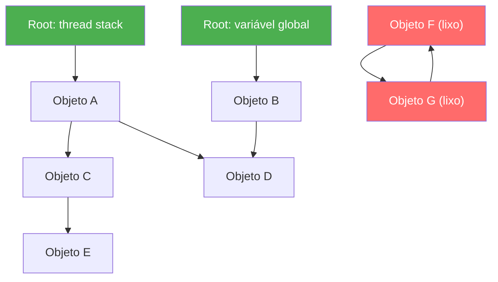

> [!info] Leitura do diagrama
> Objetos em verde são raízes; objetos em vermelho (F e G) são lixo — formam um ciclo isolado, sem caminho a partir das raízes. A, B, C, D e E são vivos porque o grafo das raízes os alcança. Note que D é alcançável por dois caminhos (A→D e B→D) — não importa quantas referências existam, o que conta é existir *pelo menos uma* a partir das raízes.

---

## Reference Counting: o GC mais simples

A ideia mais intuitiva: cada objeto guarda um **contador** do número de referências que apontam para ele. Quando você cria uma referência, incrementa. Quando destrói, decrementa. Quando chega a zero, ninguém mais usa — libera imediatamente.

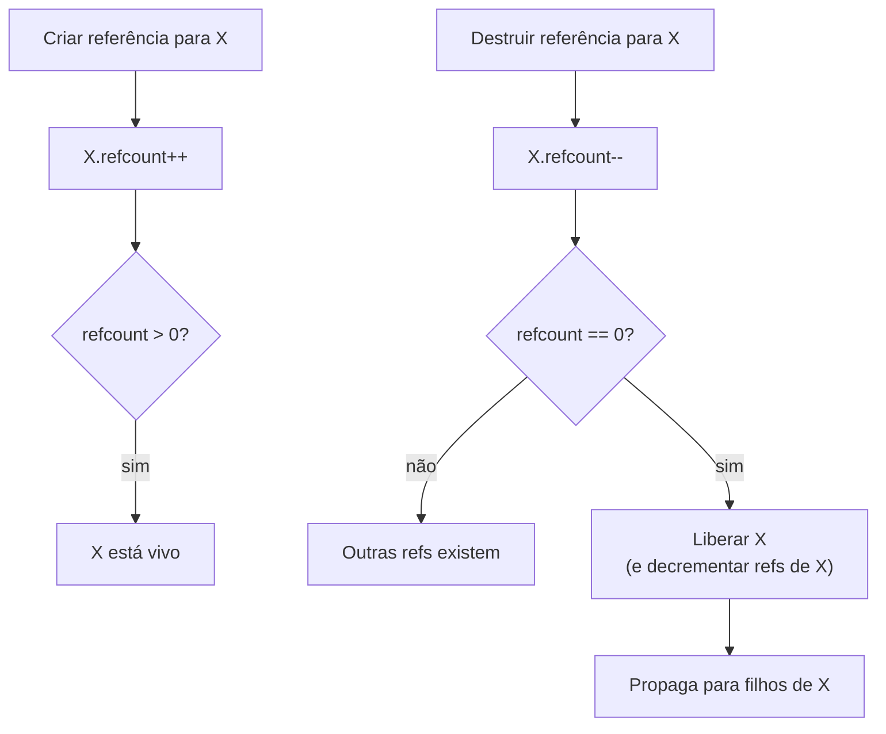

> [!info] Leitura do diagrama
> O ciclo de vida no reference counting é reativo: cada operação de escrita que muda uma referência dispara incremento/decremento. A libertação ocorre imediatamente quando o contador cai a zero, e propaga recursivamente para todos os objetos que X referenciava.

**Vantagens reais**: distribuído no tempo (sem pausa longa), previsível (objeto morre assim que a última referência some), baixo footprint (memória liberada imediatamente). É por isso que CPython, Swift ARC e Objective-C usam reference counting.

### O problema fatal: ciclos

Considere este código Python:

```python
class Node:
    def __init__(self):
        self.other = None

a = Node()
b = Node()
a.other = b   # refcount(b) = 2
b.other = a   # refcount(a) = 2

del a          # refcount(a) = 1 — ainda não zero!
del b          # refcount(b) = 1 — ainda não zero!
# a e b vazaram. Ninguém mais os alcança, mas refcount ≠ 0.
```

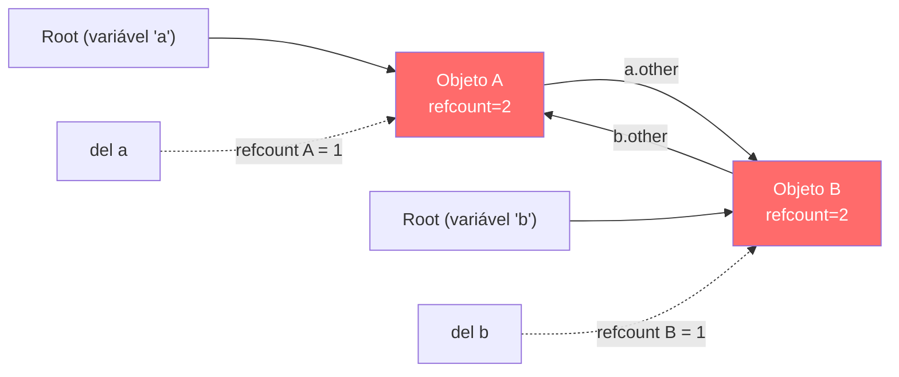

> [!info] Leitura do diagrama
> Depois de `del a` e `del b`, as roots deixam de apontar para os objetos. Mas A ainda aponta para B e B ainda aponta para A — o refcount de ambos é 1, nunca chegará a 0. Eles vazaram para sempre (até o processo morrer).

> [!danger] Ciclos vazam memória no reference counting puro
> Se sua linguagem usa apenas refcount (sem cycle collector), qualquer estrutura cíclica — listas circulares, grafos, closures que capturam `self` — vaza memória permanentemente. CPython contorna isso com um *cycle collector* separado que detecta ilhas de objetos com refcount > 0 mas mutuamente isolados.

**Soluções**: **weak references** (referências que não incrementam o contador — usadas para caches e back-pointers) e **cycle collectors** (um tracing GC rodando periodicamente só para detectar ciclos). Swift ARC exige que o programador marque explicitamente `weak` ou `unowned` as referências que fechariam ciclos.

---

## Tracing GC: percorrer o grafo para descobrir lixo

A alternativa ao reference counting é *tracing*: periodicamente, parte das raízes e percorre o grafo inteiro marcando tudo que é alcançável. O que não foi marcado é lixo.

### Mark-and-Sweep

O algoritmo mais clássico, descrito por John McCarthy no paper original do Lisp (1960). Duas fases:

**Fase 1 — Mark**: percorre o grafo de objetos a partir das raízes (DFS ou BFS), marcando cada objeto alcançável com um bit.

**Fase 2 — Sweep**: varre todo o heap linearmente; objetos não marcados são lixo e entram na lista livre; objetos marcados têm o bit resetado para a próxima coleta.

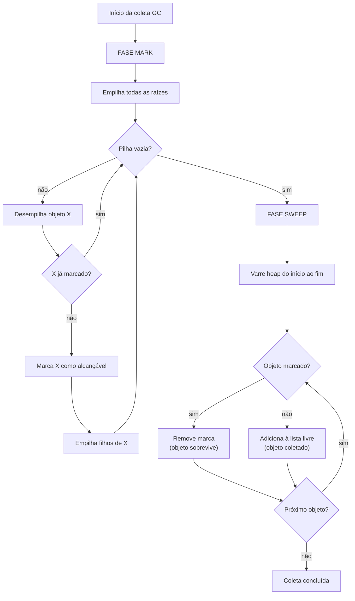

> [!info] Leitura do diagrama
> A fase Mark é uma travessia de grafo clássica (DFS com pilha explícita). A fase Sweep é uma varredura linear — O(tamanho do heap), não O(objetos vivos). O bit de marca é o único estado por objeto durante a coleta. Objetos mortos nunca são "visitados" na fase Mark — eles são descobertos por exclusão na varredura.

**Problema**: Mark-and-Sweep não compacta. Após várias coletas, o heap fica fragmentado — buracos entre objetos vivos tornam difícil alocar objetos grandes. Alocação requer percorrer a lista livre buscando um buraco do tamanho certo (*first-fit*, *best-fit*).

### Mark-Compact

Variante que adiciona uma fase de **compactação**: depois de marcar, *move* todos os objetos vivos para um extremo do heap, atualizando todas as referências. O resultado é um heap compacto, com um único ponteiro de alocação (*bump pointer*). Alocar um objeto novo é baratíssimo: incrementar o ponteiro. A desvantagem é que mover objetos exige atualizar *todas* as referências para eles — um passe adicional pelo heap.

### Copying GC (algoritmo de Cheney)

C. J. Cheney publicou em 1970 (*Communications of the ACM*, vol. 13, n. 11) um algoritmo elegante: divida o heap em dois semiespaços iguais — **from-space** e **to-space**. A aplicação aloca sempre no from-space com bump pointer. Quando o from-space esgota, o GC copia *apenas os objetos vivos* para o to-space, usando BFS. Depois, inverte os papéis: to-space vira o novo from-space.

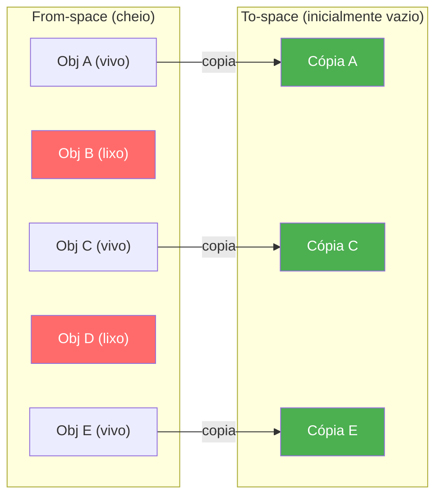

> [!info] Leitura do diagrama
> Apenas os objetos vivos (A, C, E) são copiados para o to-space, compactados automaticamente. Os objetos mortos (B, D) simplesmente ficam no from-space, que é descartado por inteiro — não há sweep. O custo de coleta é proporcional ao número de objetos *vivos*, não ao tamanho total do heap. O preço: você usa metade da memória disponível.

**Vantagens**: zero fragmentação, alocação O(1) com bump pointer, custo proporcional a objetos vivos (não ao heap total).  
**Desvantagem**: 50% do heap é sempre "desperdiçado" como to-space de reserva. Mover objetos exige atualizar referências.

> [!example] Bump pointer — a alocação mais rápida possível
> No copying GC (e no mark-compact), alocar um objeto é literalmente:
> ```
> ptr = free_pointer
> free_pointer += object_size
> return ptr
> ```
> Duas instruções. Compare com `malloc` em C, que precisa buscar um bloco adequado na lista livre — potencialmente percorrendo dezenas de entradas.

---

## A hipótese geracional

Observação empírica confirmada em dezenas de linguagens e workloads: **a maioria dos objetos morre jovem**. Objetos criados numa iteração de loop morrem na próxima. Temporários em expressões morrem imediatamente. Apenas uma fração dos objetos tem vida longa (caches, estruturas de sessão, singletons).

Essa observação — a **hipótese geracional** — motivou uma arquitetura de heap dividida em **gerações**:

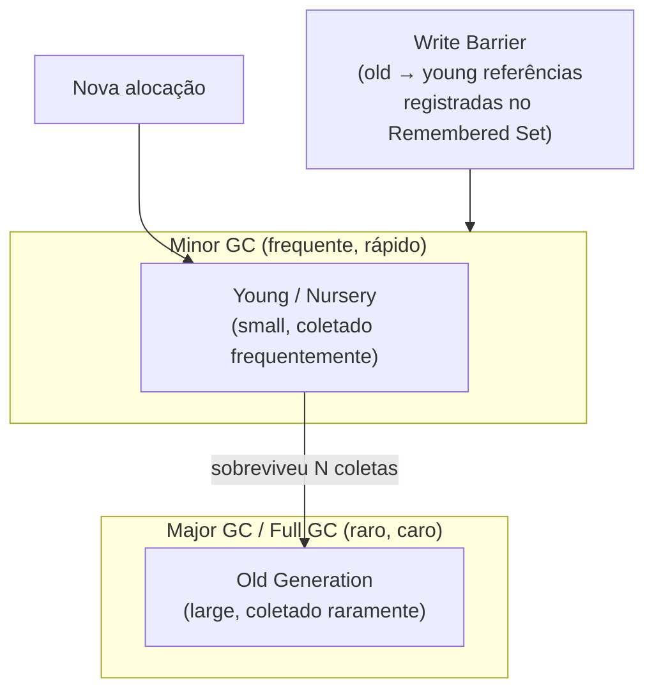

> [!info] Leitura do diagrama
> A seta de "sobreviveu N coletas" é a **promoção**: objetos que sobrevivem um número configurável de coletas da young generation são promovidos para a old generation. A young generation é coletada com copying GC (rápido, compacta). A old generation acumula objetos e é coletada muito menos frequentemente.

**Write Barrier**: o que acontece quando um objeto antigo cria uma referência para um objeto jovem? O GC da young generation precisa saber — senão, ao coletar a young, pode considerar o objeto jovem como lixo (porque a referência do old não é uma raiz explícita). A solução é uma **write barrier**: toda escrita de referência passa por código extra que registra a referência old→young em um **remembered set**. Durante a minor GC, o remembered set é tratado como raízes adicionais.

> [!warning] Write barrier tem custo real
> Em linguagens como Java e C#, cada escrita de referência pode disparar código de write barrier. Em aplicações com muita mutação de objetos antigos, isso é overhead mensurável. Alguns GCs usam *card tables* (o heap é dividido em "cards" de 512 bytes; qualquer escrita num card marca o card inteiro como "sujo") para amortizar esse custo.

**Por que funciona?** Minor GC coleta só a young generation — uma fração pequena do heap. A maioria dos objetos na young já está morta (hipótese geracional), então pouco é copiado para o to-space. Coletas rápidas frequentes × coletas lentas raras = throughput alto e latência gerenciável.

---

## Stop-the-world, Concurrent e Incremental

O GC precisa de uma visão consistente do heap. Se a aplicação (o **mutator**) continua rodando enquanto o GC percorre o grafo de objetos, o mutator pode criar ou destruir referências no meio do processo — o GC pode marcar um objeto como morto que ainda está sendo alcançado.

A solução clássica é **stop-the-world (STW)**: parar *todas* as threads da aplicação durante a coleta. Simples de implementar, visão perfeitamente consistente — mas cada pausa STW é um "hiccup" visível ao usuário. Em aplicações interativas ou de baixa latência (servidores de trading, jogos, APIs de tempo real), pausas de dezenas ou centenas de milissegundos são inaceitáveis.

GCs modernos evoluíram para trabalhar **concorrentemente** com o mutator. O mecanismo base é o **tri-color marking**:

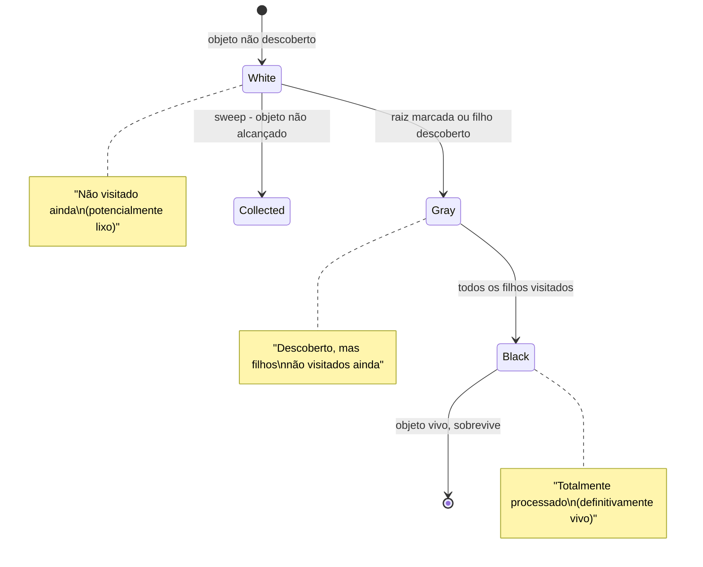

> [!info] Leitura do diagrama
> O invariante crucial do tri-color marking: **nunca há uma referência direta de um objeto preto para um objeto branco**. Se o mutator criar tal referência enquanto o GC roda (um objeto preto passa a referenciar um branco recém-criado), o objeto branco seria coletado indevidamente. Para prevenir isso, write barriers detectam violações desse invariante e "reclassificam" o objeto afetado para cinza.

**Incremental GC**: a coleta é fragmentada em pequenos "slices" intercalados com execução do mutator. Nenhuma pausa individual é longa — mas o total de trabalho pode ser maior.

**Concurrent GC**: partes do GC rodam em threads separadas, em paralelo com o mutator. G1 (Java), ZGC (Java), Shenandoah (Java), e o GC do Go são exemplos. ZGC consegue pausas sub-milissegundo em heaps de terabytes — a maior parte do trabalho é feita concorrentemente.

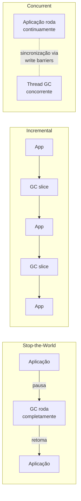

> [!info] Leitura do diagrama
> Stop-the-world produz pausas longas mas é simples. Incremental fragmenta o pausa em pedaços menores. Concurrent elimina a maior parte das pausas usando threads separadas, mas exige sincronização complexa (write barriers, load barriers, handshakes). O ZGC usa "colored pointers" — bits nos próprios ponteiros — para implementar load barriers sem custo de memória adicional.

---

## O trade-off central

Todo GC vive no triângulo:

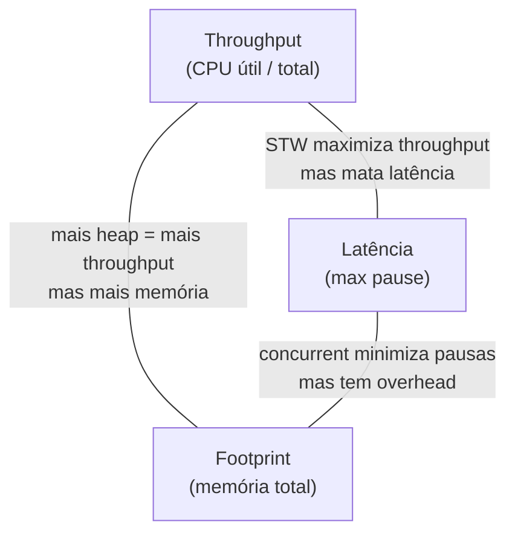

> [!info] Leitura do diagrama
> Você não pode maximizar os três simultaneamente. Serial GC (Java) maximiza throughput em ambiente mono-thread sem preocupação com pausas. G1 equilibra throughput e latência. ZGC/Shenandoah priorizam latência mínima ao custo de throughput ligeiramente menor e maior footprint. Escolha o GC para o seu *perfil de workload*, não para o mais recente ou mais "moderno".

**Tuning de GC**: ajustar o tamanho das gerações, frequência de coleta, número de threads do GC, e targets de pausa (`-XX:MaxGCPauseMillis` no G1) são habilidades reais de engenharia de produção. Garbage collection tuning é uma disciplina por si só.

> [!tip] Regra prática para JVM
> Comece com G1 (default no JDK 9+). Se as pausas forem problema real (medido!), migre para ZGC (sub-ms, JDK 21+). Se você tem heap gigante (>100 GB) e SLA de latência agressivo, ZGC com modo geracional (JDK 23+ default) é o estado da arte.

---

## GC × Ownership: o espectro de abordagens

Gestão automática de memória não é a única resposta ao problema. Existe um espectro:

| Abordagem | Exemplos | Pausas | Segurança | Controle |
|---|---|---|---|---|
| Manual (malloc/free) | C, C++ (raw) | Nenhuma | Baixa | Total |
| RAII / smart pointers | C++ (unique\_ptr, shared\_ptr) | Nenhuma | Alta | Alto |
| Ownership + Borrow Checker | Rust | Nenhuma | Total | Alto |
| Reference Counting (ARC) | Swift, Objective-C, CPython | Mínimas | Alta | Médio |
| Tracing GC | Java, C#, Go, Python, JS | Sim (variável) | Total | Baixo |

**RAII** (*Resource Acquisition Is Initialization*) em C++: recursos são adquiridos no construtor e liberados no destrutor. `std::unique_ptr` libera a memória quando o objeto sai de escopo — sem GC, sem overhead de runtime. O problema é que você ainda pode ter múltiplos owners (com `shared_ptr`, que usa refcount), e o ciclo de vida precisa ser modelado corretamente pelo programador.

**Rust** vai além: o *borrow checker* verifica em tempo de compilação que cada objeto tem exatamente um dono e que referências não sobrevivem ao dono. Não existe runtime de GC, não existem pausas, não existem dangling pointers — verificados estaticamente. O custo é uma curva de aprendizado íngreme: você precisa expressar o ciclo de vida de cada dado na tipagem do programa. Para sistemas de baixa latência onde "zero overhead" é o requisito, Rust é a resposta moderna.

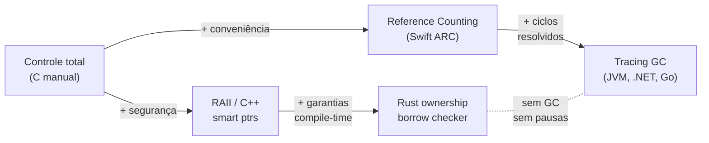

> [!info] Leitura do diagrama
> O eixo horizontal não é "pior → melhor": é um trade-off real. Rust escolhe segurança sem runtime — paga com disciplina de código. Java escolhe conveniência e segurança — paga com GC overhead. C escolhe controle total — paga com ausência de segurança. Escolha conforme os requisitos do sistema.

> [!success] Rust como prova de conceito teórica
> Rust demonstrou que é possível ter segurança de memória *sem* GC em tempo de execução. O ownership/borrow checker é uma análise de fluxo de dados aplicada em compile-time. O custo de runtime é literalmente zero — sem write barriers, sem tri-color marking, sem stop-the-world. O GC foi eliminado movendo sua lógica para o compilador.

---

## Ciclo de vida de um objeto

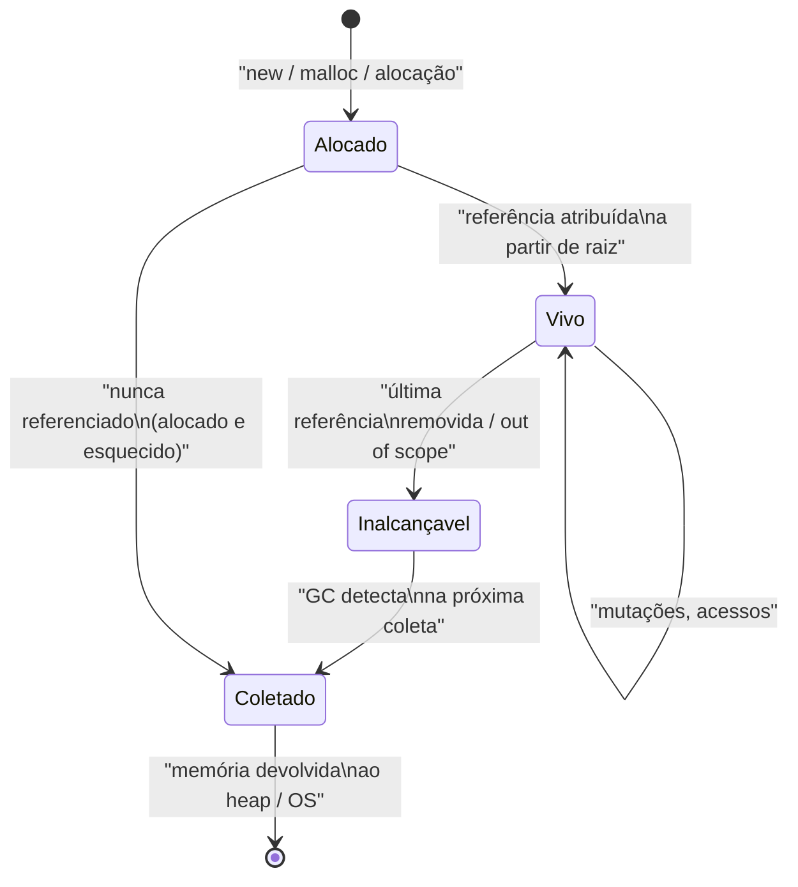

> [!info] Leitura do diagrama
> Note que "Inalcançável" e "Coletado" são estados distintos — há uma janela entre o objeto se tornar inalcançável e o GC efetivamente recuperar a memória. Durante esse intervalo, o objeto ocupa memória mas é inacessível. GCs com finalização (Java `finalize`, Python `__del__`) adicionam complexidade: o objeto pode "ressuscitar" durante a finalização, tornando o estado "Coletado" não-final.

---

## Conexões

- [[15 - Runtime, stack frames e gestão de memória]] — base de heap, stack frames e alocação manual que o GC substitui
- [[02 - Compilação, interpretação e JIT]] — runtimes gerenciados (JVM, CLR, V8) que hospedam o GC
- [[17 - JIT a fundo]] — JIT e GC interagem: o JIT gera código com write barriers embutidos; GC precisa de safepoints para pausas

---

> [!summary] Resumo em uma linha
> Garbage collection rastreia alcançabilidade a partir das raízes do programa para automatizar a liberação de memória — eliminando leaks e dangling pointers ao custo de pausas e overhead de runtime.

---

## Em entrevista

Em entrevistas sênior de sistemas e engenharia de plataforma, GC aparece em perguntas sobre latência, escolha de linguagem, tuning de JVM e design de serviços de baixa latência.

*How does a tracing garbage collector determine which objects are live?* *It traces the object graph starting from roots — stack variables, registers, and globals — and marks everything reachable. Unreachable objects are garbage.*

*What is the generational hypothesis and why does it matter for GC design?* *Most objects die young. Generational GCs exploit this by collecting the young generation frequently with a fast copying collector, and the old generation rarely — yielding high throughput with manageable pause times.*

*Why does reference counting fail on cyclic data structures?* *When A references B and B references A, both have refcount ≥ 1 even after all external references are gone. The cycle is never freed unless a separate cycle detector (like CPython's) or weak references break the cycle.*

*What is a write barrier and why does a generational GC need one?* *A write barrier is code that runs on every reference write. In a generational GC, it tracks old-to-young references in a remembered set so the minor GC doesn't miss roots held by old-generation objects.*

*What does stop-the-world mean and what alternatives exist?* *STW pauses all application threads during GC. Alternatives include incremental GC (sliced pauses) and concurrent GC (GC runs on separate threads alongside the mutator, using tri-color marking and write barriers to maintain consistency).*

*What is the throughput-latency-footprint trade-off in GC?* *You can't maximize all three simultaneously. More heap improves throughput but increases footprint. Concurrent GC reduces latency but adds CPU overhead. Serial STW maximizes throughput but kills latency.*

*How does Rust achieve memory safety without a garbage collector?* *Rust's borrow checker enforces ownership rules at compile time: each value has one owner, references can't outlive the owner. Memory is freed at end of scope (RAII). No runtime GC, no pauses, zero overhead.*

### Vocabulário PT → EN

| Português | English |
|---|---|
| Coleta de lixo | Garbage collection |
| Contagem de referências | Reference counting |
| Alcançabilidade | Reachability |
| Raízes | Roots |
| Marcação e varredura | Mark-and-sweep |
| Coletor por cópia | Copying collector |
| Geracional | Generational |
| Parar o mundo | Stop-the-world |
| Barreira de escrita | Write barrier |
| Conjunto de lembrados | Remembered set |
| Vazamento de memória | Memory leak |
| Ponteiro pendurado | Dangling pointer |
| Throughput | Throughput |
| Latência de pausa | Pause latency |
| Propriedade (Rust) | Ownership |
| Verificador de empréstimos | Borrow checker |

---

> [!info] Lastro
> - Richard Jones, Antony Hosking, J. Eliot B. Moss. *The Garbage Collection Handbook: The Art of Automatic Memory Management* (2ª ed.). CRC Press / Chapman & Hall, 2023. ISBN 9781032231785. Referência definitiva: cobre todos os algoritmos, variantes concorrentes e análise empírica. <https://www.routledge.com/The-Garbage-Collection-Handbook-The-Art-of-Automatic-Memory-Management/Jones-Hosking-Moss/p/book/9781032231785>
> - Paul R. Wilson. "Uniprocessor Garbage Collection Techniques". *International Workshop on Memory Management (IWMM)*, Springer LNCS 637, 1992. O survey que organizou a taxonomia do campo — mark-sweep, copying, generational, incremental em um vocabulário unificado. <https://www.semanticscholar.org/paper/Uniprocessor-Garbage-Collection-Techniques-Wilson/008b4c3ece6aaa3e8244476c7649f0a711c67978>
> - C. J. Cheney. "A nonrecursive list compacting algorithm". *Communications of the ACM*, vol. 13, n. 11, p. 677–678, 1970. O paper original do copying collector semi-space com traversal BFS. <https://dl.acm.org/doi/10.1145/362790.362798>
> - V8 Team. "Trash talk: the Orinoco garbage collector". V8 Blog, 2019. Descreve o GC do V8 (JavaScript/Node.js): parallel scavenger, concurrent marking, concurrent sweeping. <https://v8.dev/blog/trash-talk>
> - Oracle / OpenJDK. "Garbage-First (G1) Garbage Collector". *Java SE 21 GC Tuning Guide*. Documentação oficial do G1 — regiões, mixed collections, pause targets. <https://docs.oracle.com/en/java/javase/21/gctuning/garbage-first-g1-garbage-collector1.html>
> - OpenJDK. "ZGC — The Z Garbage Collector". OpenJDK Projects. GC de pausas sub-milissegundo; modo geracional default no JDK 23. <https://openjdk.org/projects/zgc/>
> - Steve Klabnik, Carol Nichols. *The Rust Programming Language*, cap. 4 "Understanding Ownership". Explicação canônica do sistema de ownership/borrow checking do Rust — memória segura sem GC. <https://doc.rust-lang.org/book/ch04-00-understanding-ownership.html>
