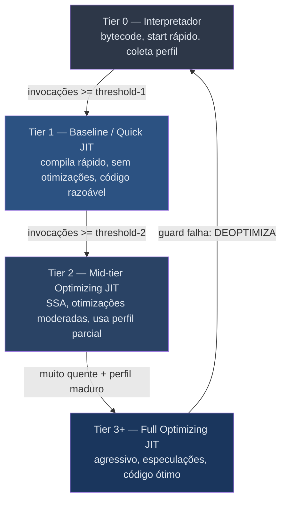
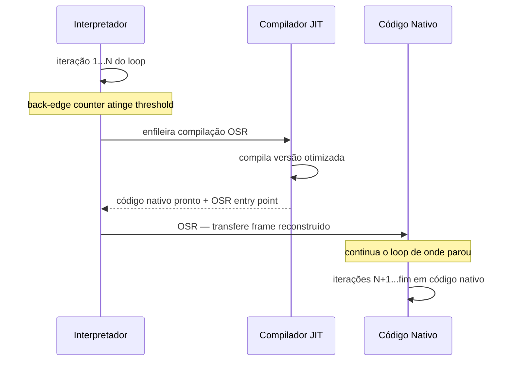
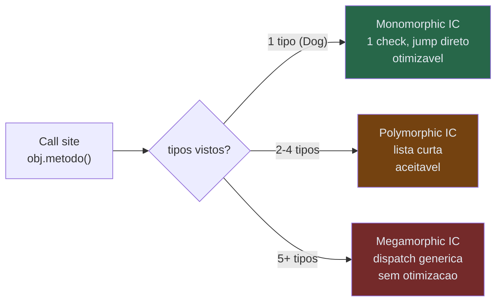
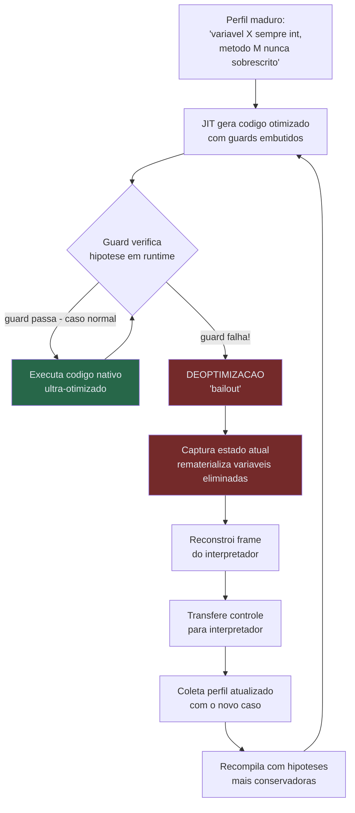
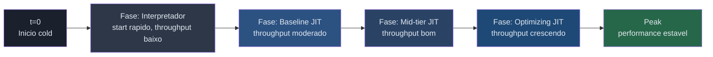

# JIT a fundo

> [!abstract] TL;DR
> JIT (Just-In-Time) compila bytecode portável para código nativo **enquanto o programa roda**, focando só no código quente. Faz isso em camadas (tiered compilation): começa lento e seguro no interpretador, migra gradualmente para otimizações agressivas. O truque central é **especulação**: apostar em tipos e ramos com base em perfil real, gerar código ótimo, mas garantir **deoptimização** se a aposta falhar. Por isso JIT pode bater AOT no pico — o AOT nunca vê os dados reais.

---

## Por que JIT existe

Imagine que você precisa entregar código que rode em qualquer sistema operacional e arquitetura — Linux, Windows, ARM, x86. A resposta clássica é bytecode: compile uma vez para um formato intermediário portável, e cada plataforma tem uma VM que interpreta esse bytecode.

Funciona. Mas interpretar é lento. Para cada instrução do bytecode, a VM precisa de uma sequência de operações: buscar a instrução, decodificar, executar, avançar o contador. Um loop de um milhão de iterações passa por esse overhead um milhão de vezes. Em benchmarks representativos, a interpretação pura é de 10× a 100× mais lenta que código nativo bem otimizado.

A alternativa seria compilar tudo para nativo antes de rodar — AOT clássico. Portável? Não diretamente: você compila para cada alvo separado. E ainda desperdiça: a maior parte do código de um programa roda poucas vezes. Funções de inicialização, tratadores de erro, código de configuração — rodam uma vez e somem para sempre. Compilar tudo AOT significa pagar um custo alto por código que quase não importa, além de um tempo de startup longo.

O JIT resolve o dilema elegantemente: **começa interpretando** (portável, start rápido), **observa** o que está quente e **compila só isso** para nativo. Você não paga o custo de compilação por código frio; paga só onde a conta fecha.

> [!tip] Princípio de Pareto aplicado
> Em programas reais, cerca de 80% do tempo de execução ocorre em 20% do código. JIT localiza esse 20% em runtime e esmaga o custo dele. O restante roda no interpretador — e isso é aceitável, porque é código raro.

A promessa fundamental do JIT é: **portabilidade do bytecode + performance próxima do nativo**, ao custo de latência de compilação no início e memória para o compilador e o code cache.

Existe uma tensão fundamental no design de todo JIT: **tempo de compilação versus qualidade do código**. Um compilador que passa 10 segundos produz código 30% melhor que um que passa 100ms — mas esses 10 segundos são inaceitáveis em tempo de execução. A solução é a escada de tiers: compilar rápido e barato primeiro, compilar lento e sofisticado só quando há evidência de que vale a pena.

> [!success] JIT como síntese
> JIT sintetiza as virtudes dos dois extremos: a portabilidade e o start rápido da interpretação, e o peak de performance da compilação nativa. O preço é a complexidade da VM — que é enorme. A existência de JITs sofisticados justifica por que construir uma nova linguagem "compilada" do zero frequentemente performa pior que Java ou JavaScript modernos por anos.

Historicamente, os primeiros JITs eram simples: compilavam cada método inteiro para nativo na primeira invocação (simple method JIT). A evolução para tiered compilation foi motivada por dois problemas desse design: latência na primeira chamada (o método compilava sincronamente, pausando a execução) e qualidade de código medíocre (compilar rápido significa otimizações rasas). O tiered compilation resolve os dois: o baseline compiler é rápido o suficiente para não causar latência perceptível, e o optimizing compiler recebe todo o tempo que precisa porque só é invocado para código provadamente quente.

---

## Tiered Compilation — a escada de execução

JIT moderno não é binário (interpretado OU compilado). É uma **escada de tiers**, cada degrau comprometendo mais CPU de compilação em troca de código mais rápido. A ideia central: código que acabou de aparecer não justifica investimento pesado de compilação — mas código que vai rodar bilhões de vezes justifica qualquer custo razoável.



> [!info] Leitura do diagrama
> Cada seta para cima representa mais custo de compilação e melhor código gerado. A seta de retorno (deopt) mostra que o tier mais alto não é permanente: se uma especulação falha, o código volta ao interpretador e o ciclo recomeça com perfil mais rico e hipóteses corrigidas.

### HotSpot JVM: cinco níveis

A JVM HotSpot usa cinco níveis explícitos numerados de 0 a 4:

- **Nível 0** — interpretador puro. Coleta contadores de invocação e back-edge. Zero compilação.
- **Nível 1** — C1 compilado sem instrumentação. Para métodos triviais que não precisam de mais dados.
- **Nível 2** — C1 com instrumentação limitada (apenas contadores de invocação e back-edge).
- **Nível 3** — C1 com instrumentação completa: tipos em cada operação, frequência de ramos, alvos de chamadas virtuais.
- **Nível 4** — C2. O compilador servidor. Consome os dados do nível 3 para gerar código agressivamente otimizado — inlining profundo, eliminação de verificações, vetorização.

O caminho típico de um método quente é `0 → 3 → 4`: interpreta enquanto coleta dados com C1 profiling, depois C2 pega o perfil maduro e gera o código definitivo. Se o método for simples demais para o C2 se importar, vai direto para nível 1 e fica lá.

Vale notar que C1 e C2 rodam em **threads de compilação separadas** (compiler threads), em paralelo com a aplicação. O método continua rodando no tier anterior enquanto a compilação acontece. Quando o código novo fica pronto, a VM faz a troca de forma segura — as invocações seguintes usam o novo código.

Em sistemas com muitas threads de aplicação e poucos cores, o número de compiler threads pode ser um gargalo. O HotSpot configura automaticamente com base no número de CPUs, mas em containers com limites de CPU estritos (ex.: `--cpus=1`), vale monitorar se as compiler threads estão disputando excessivamente com a aplicação via `-XX:+PrintCompilation`.

### V8: quatro tiers desde 2023

O V8 (motor JavaScript do Chrome e Node.js) evoluiu historicamente até quatro tiers ativos:

- **Ignition** — interpretador de registradores. Executa bytecode e coleta feedback em slots embutidos nas instruções ("feedback vectors"). Cada operação reporta o tipo que viu.
- **Sparkplug** (2021) — compilador baseline sem SSA, sem otimizações. Traduz bytecode para nativo de forma quase mecânica, em tempo mínimo. O código gerado é só um pouco melhor que a interpretação — mas sem o overhead de dispatch do interpretador.
- **Maglev** (2023) — tier intermediário baseado em SSA. Cerca de 10× mais lento que o Sparkplug para compilar, mas gera código ~10× melhor. Preenche o vão enorme que existia entre Sparkplug e TurboFan, dando performance "boa o suficiente" sem esperar o TurboFan.
- **TurboFan** — compilador otimizador completo. Pipeline longo baseado em "Sea of Nodes". Demora para compilar, mas gera o melhor código possível para código extremamente quente, usando todas as especulações disponíveis.

> [!example] Analogia da oficina mecânica
> O Ignition é o mecânico que anota cada detalhe do carro. O Sparkplug faz uma troca rápida de óleo. O Maglev faz uma revisão completa. O TurboFan desmonta o motor e reconstrói peça a peça para máxima performance — mas só faz isso quando o carro vai correr num circuito, não num percurso de um quarteirão.

---

## Detecção de código quente

Como o JIT sabe o que merece compilação? Dois contadores por função ou loop:

1. **Contador de invocação** — incrementa a cada chamada da função. Quando cruza o threshold, a função é enfileirada para o próximo tier.
2. **Contador de back-edge** — incrementa a cada vez que um loop fecha (salta de volta para o início). Permite detectar loops longos dentro de funções que talvez não sejam chamadas frequentemente.

Os thresholds são configuráveis. No HotSpot, o padrão histórico era 10.000 invocações para C2. Com tiered compilation, os thresholds de C1 são muito menores (tipicamente 2.000 para o nível 3), porque o custo é baixo.

Os contadores ficam no **MethodData** (estrutura interna por método) e são consultados pelo interpretador a cada invocação e a cada back-edge. Isso tem custo, mas é mínimo — uma instrução de memória a mais por chamada. O benefício (saber o que compilar) justifica largamente.

### On-Stack Replacement (OSR)

Aqui está um problema elegante: e se um loop longo começar a rodar no interpretador e levar segundos para terminar? Compilar o código e esperar a próxima chamada seria inútil — pode não haver próxima chamada por horas.

OSR é a solução: **substituir o frame em execução no meio do loop**. O contador de back-edge estoura o threshold, o JIT compila a versão otimizada, **reconstrói o frame de execução** (variáveis locais, estado do loop, referências) no formato esperado pelo código compilado, e transfere o controle — sem sair do loop, sem esperar reiniciar.



> [!info] Leitura do diagrama
> O ponto crítico é a reconstrução do frame: o JIT precisa de metadados que descrevem como mapear cada variável do interpretador para registradores/slots do código nativo. Sem esse mapeamento, a transferência corromperia o estado.

A OSR adiciona complexidade porque o compilador precisa gerar um **OSR entry point** especial — um ponto de entrada que assume o estado parcial vindo do interpretador, em vez de iniciar a função do zero.

> [!tip] OSR e benchmarks
> Benchmarks de microbenchmark em Java que rodam um loop longo dentro de um método único frequentemente disparam OSR. Isso significa que o código está sendo otimizado pelo C2 *durante* a execução do benchmark, o que pode causar variância nas medições iniciais. JMH lida com isso rodando o benchmark em um método separado chamado repetidamente (cada chamada acumula contadores de invocação, não back-edge), evitando OSR e tornando as medições mais estáveis e representativas.

---

## Profile-Guided Optimization em Runtime

O AOT mais sofisticado tem PGO estático: você roda o programa em modo de treinamento, coleta um perfil, recompila com esses dados. É uma etapa extra no build, e o perfil é estático — representa *uma* execução de treinamento, não o usuário real.

O JIT faz PGO continuamente, automaticamente, com dados **do usuário real, na execução atual**. O perfil coletado inclui:

- **Tipos concretos** em cada operação polimórfica — o JIT vê que `obj` em `obj.metodo()` é 99,9% do tempo do tipo `Dog`, não `Animal` genérico.
- **Frequência de ramos** — qual lado do `if` é tomado em 95% dos casos. O JIT pode eliminar o lado frio ou reorganizar o código para o lado quente ficar no caminho linear (sem salto).
- **Alvos de chamadas virtuais** — qual implementação concreta de uma interface é chamada na prática.
- **Tamanho médio de arrays e strings** — permite decisões de unrolling de loop.

Com esses dados, o JIT pode aplicar otimizações que seriam impossíveis estaticamente:

- **Devirtualização**: converter uma chamada virtual (dispatch dinâmica via vtable ou interface table) em uma chamada direta, desde que o tipo concreto visto seja sempre o mesmo. Elimina o custo de dispatch e **permite inlining**, que por sua vez abre espaço para propagação de constantes e eliminação de código morto cruzando a fronteira da chamada.
- **Inlining especulativo com guard**: mesmo que a devirtualização não seja certa, o JIT pode inline o corpo do método mais provável protegido por um guard de tipo. Se o guard passa (tipo correto), executa o inlined body. Se falha, cai no desvio que faz a chamada virtual normal — ou deoptimiza.
- **Eliminar ramos frios**: marcar o caminho improvável como `unlikely`, movê-lo para longe do caminho quente, reduzindo pressão no instruction cache e melhorando a previsão de branch do processador.
- **Especialização de laço**: unrolar parcialmente loops cujo tamanho médio o JIT conhece, ou aplicar vetorização SIMD quando o perfil mostra que o tipo do array é uniforme.

**Por que JIT pode bater AOT no pico?** Porque o AOT não tem acesso a esses dados reais. Ele compila conservadoramente, respeitando todas as possibilidades do tipo-estático e dos contratos de interface. O JIT compila agressivamente para *o que realmente acontece* — e tem o mecanismo de deoptimização para se recuperar quando erra. Pense assim: o AOT é o arquiteto que projeta um prédio para qualquer usuário imaginável; o JIT é o arquiteto que observa os usuários reais por um mês e então refaz o projeto especificamente para eles.

> [!tip] Benchmark de longa duração
> Em servidores que rodam horas (JVM web servers, por exemplo), o pico de throughput JIT frequentemente supera equivalentes AOT. O custo de warmup é amortizado; o ganho do perfil real acumula. Para workloads efêmeros (serverless), a conta se inverte — AOT ou snapshot ganha no tempo médio de resposta quando as instâncias vivem segundos.

---

## Inline Caches — o truque de Smalltalk e Self

Em linguagens dinâmicas, toda chamada de método é potencialmente polimórfica. `obj.toString()` pode despachar para implementações completamente diferentes dependendo do tipo de `obj`. A VM não sabe em tempo de compilação estático.

A solução clássica — inventada no Smalltalk-80 e formalizada no Self (Hölzle, Chambers & Ungar, ECOOP'91) — é o **inline cache**: no call site, guardar o resultado da última dispatch para o último tipo visto. Na próxima chamada, verificar se o tipo é o mesmo. Se sim, pula direto para o destino cacheado. Se não, atualiza o cache.

O nome "inline" vem da ideia original: o endereço do destino é colocado **inline no próprio código do call site**, modificando as instruções geradas (code patching). Em implementações modernas, o mecanismo é mais sofisticado (estruturas de dados separadas, ICs em feedback vectors), mas o princípio é o mesmo: cachear o resultado da lookup para o tipo mais recente.

### O espectro de polimorfismo



> [!info] Leitura do diagrama
> O IC evolui conforme novos tipos aparecem no call site ao longo do tempo. Monomorphic é o cenário ideal: uma comparação, um salto, código especializado. Megamorphic é o pior: a VM desiste de especializar e usa dispatch genérica, bloqueando devirtualização e inlining.

### Exemplo concreto em JavaScript

```javascript
function processar(obj) {
  return obj.valor * 2;
}

// Chamadas com objetos do mesmo "shape" → IC monomorphic:
// obj.valor está sempre no offset fixo X na estrutura interna.
// O JIT gera: carrega campo em offset X, multiplica por 2. Direto.
processar({ valor: 10 });  // shape A → IC inicializado para shape A
processar({ valor: 20 });  // shape A → hit no IC, código especializado

// Objeto com propriedades diferentes → novo shape → IC vira polymorphic:
processar({ valor: 5, nome: "X" }); // shape B → IC agora tem [A, B]

// Se aparecerem shape C, D, E... → IC vira megamorphic → otimização perdida.
```

> [!danger] Armadilha: megamorphic = morte das otimizações
> Em JavaScript, adicionar propriedades em ordens diferentes em objetos "parecidos" cria shapes (hidden classes) distintas. Um call site que vê muitas shapes distintas vira megamorphic — o JIT desiste de especializar. É um bug silencioso de performance que não aparece no linting mas pode degradar throughput em 3×-5×.

---

## Especulação e Deoptimização — o conceito mais difícil e mais cobrado

Este é o coração do JIT moderno e o conceito que aparece em toda entrevista de sistemas avançados. Entenda o mecanismo completamente.

O JIT **aposta**. Com base no perfil coletado, gera código que assume certas condições como verdadeiras. A analogia exata é a de um apostador que viu 9.999 bolas vermelhas saírem de uma urna e está disposto a apostar que a próxima também é vermelha — mas tem um plano B se sair azul.

Exemplos de apostas comuns:

- "Essa variável JavaScript é sempre um inteiro de 32 bits — não preciso checar overflow."
- "Esse método virtual nunca foi sobrescrito — posso chamar diretamente e inline."
- "Esse ramo `if` é sempre verdadeiro — o lado `else` é código morto na prática."
- "Essa função nunca recebe `null` — omito a verificação de null."
- "Esse array nunca tem buracos (holes) — posso usar acesso direto sem checagem."
- "Esse campo de objeto é final — seu valor nunca muda depois da construção."

Para cada aposta, o JIT emite um **guard**: uma instrução de verificação rápida que confirma se a hipótese ainda vale naquele ponto da execução. Se o guard passa, executa o código ultra-otimizado. Se falha — inicia a **deoptimização (bailout)**.

### O ciclo completo de especulação



> [!info] Leitura do diagrama
> O caminho feliz é o loop interno: C → D → C. O guard passa, o código ótimo executa, vida segue. A deoptimização (lado esquerdo) é rara mas necessária. Não é falha catastrófica — é o mecanismo de segurança funcionando, recalibrando as apostas para a próxima compilação.

### Deoptimização passo a passo — o mecanismo

1. **Guard falha**: a instrução de verificação detecta que a hipótese violou (ex.: chegou um `float` onde só havia `int`).

2. **Ponto de deopt identificado**: cada ponto de guard no código compilado tem um ID que aponta para os **deoptimization metadata** — tabelas geradas pelo compilador que descrevem, para aquele ponto específico, onde estão todas as variáveis do programa original.

3. **Rematerialização**: algumas otimizações eliminaram variáveis intermediárias (ex.: constantes propagadas, valores mortos). A deopt precisa reconstituir esses valores. Valores que foram mantidos em registradores precisam ser localizados no estado atual dos registradores.

4. **Reconstrução do frame do interpretador**: com todos os valores disponíveis, o runtime monta um frame de interpretação válido — como se o interpretador estivesse executando aquele ponto do código.

5. **Transferência de controle**: o interpretador assume a partir daquele ponto exato, com o estado correto.

6. **Invalidação**: o código compilado pode ser marcado como inválido (para que novas chamadas também vão para o interpretador) ou apenas o caminho específico é desativado. Na JVM, a invalidação pode ser de **uma hipótese específica** (como "esse campo é constante") e pode desencadear deopt de métodos que nem estavam rodando naquele momento — um mecanismo chamado **deopt de pilha completa** (full stack deoptimization), onde todos os frames compilados que dependem daquela hipótese são invalidados simultaneamente.

7. **Recompilação**: depois de mais profiling incluindo o caso problemático, um novo código otimizado é gerado com hipóteses corrigidas — ou, se o call site for realmente polimórfico, com especulação abandonada para aquele ponto específico. O novo código geralmente é mais conservador: testa mais casos ou faz a operação de forma geral sem asumir um tipo.

> [!warning] Deopt loops são armadilhas de produção
> Se uma aposta falha frequentemente, o JIT pode entrar em ciclo: compila com hipótese → deopt → recompila mais conservador → deopt de novo. Em V8, isso pode ser rastreado com `--trace-deopt`. Em código JavaScript que mistura tipos em variáveis (ex.: `let x = 0; ...; x = "texto"`), esse padrão é comum e degrada performance silenciosamente. Na JVM, `-XX:+TraceDeoptimization` ou a flag `-XX:+PrintDeoptimizationInfo` mostra cada deopt com o motivo — diagnóstico essencial em regressões de performance inesperadas.

---

## Warmup — o custo de esquentar

Um programa JIT não roda no seu melhor desempenho desde o início. Precisa **esquentar** — acumular invocações suficientes para que os thresholds sejam cruzados e os tiers otimizadores sejam ativados.



> [!info] Leitura do diagrama
> As fases representam o estado do código mais quente ao longo do tempo de execução. O throughput cresce à medida que mais código migra para tiers superiores e o perfil coletado fica mais rico. Peak performance é estável uma vez que os métodos mais quentes atingiram o tier máximo.

### Por que isso importa na prática

**Benchmarks enganosos**: se você mede performance JIT sem warmup, está medindo o interpretador, não o JIT. Frameworks de benchmark como JMH (Java) forçam iterações de aquecimento obrigatórias antes de medir, e descartam as medições do início. Um benchmark ingênuo pode mostrar Java mais lento que C para workloads onde Java deveria ganhar depois de aquecido.

O problema é pior ainda quando o JIT sofre deoptimizações durante o warmup: o código pode parecer estável no benchmark mas estar passando por ciclos de compilação-deopt que inflariam artificialmente o tempo medido. O ideal é checar `--trace-deopt` / `-XX:+PrintCompilation` para garantir que o código está compilado e estável antes de medir.

**Lambdas e serverless**: funções que vivem por milissegundos e morrem nunca chegam ao pico. O JIT não tem tempo sequer de cruzar o threshold do baseline compiler. É o problema do cold start — e é por isso que Node.js serverless frequentemente performa melhor que Java serverless para funções de curta duração, apesar de V8 e HotSpot serem ambos JITs sofisticados.

Respostas ao problema de warmup:

- **CRaC (Coordinated Restore at Checkpoint)**: faz um snapshot da JVM já aquecida — em produção, com tráfego real de aquecimento — e restaura em nova instância. O código JIT compilado, as filas de threads, os caches de IC, tudo é preservado. Uma instância CRaC pode atingir peak performance em milissegundos.
- **AOT caching**: GraalVM Enterprise e experimentos no OpenJDK (como o Project Leyden) persistem código compilado em disco entre execuções. Na próxima inicialização, o código já compilado é carregado direto, pulando o warmup. Ainda é JIT (pode deoptimizar e recompilar se o perfil mudar), mas o start é dramáticamente mais rápido.
- **GraalVM Native Image**: compila tudo AOT para um binário nativo estático. Perde o JIT adaptativo (e, portanto, o pico de throughput de longa duração), mas ganha start em milissegundos e footprint de memória mínimo. Para microsserviços que escalam rapidamente (autoscaling horizontal), pode ser a escolha certa mesmo com throughput menor por instância — ver [[02 - Compilação, interpretação e JIT]].

---

## Custo do JIT — o parasita necessário

JIT não é gratuito. Ele roda no mesmo processo e compete por recursos:

**CPU**: compilar código no background usa threads e ciclos que poderiam ser da aplicação. C2 em especial é um compilador pesado — décadas de engenharia de otimizações acumuladas, incluindo análise de escape, partial escape analysis, loop transformations, vetorização automática. Por isso tiered compilation usa C1 para início rápido e reserva C2 para o que realmente importa. Em máquinas com poucos cores, é possível que o compilador JIT competindo com a aplicação cause degradação visível de throughput durante o warmup.

**Memória — o code cache**: o código nativo compilado vai para um **code cache** (heap nativo separado do heap Java). Quando cheio, o JIT pode parar de compilar métodos novos ou descartar código pouco usado (code cache flushing). No HotSpot, `-XX:+PrintCodeCache` exibe o uso. Em containers com memória limitada, o code cache pode ser um gargalo invisible.

**Latência de compilação**: cada método que sobe de tier sofre uma latência de compilação. Em tiers baixos é imperceptível; em C2 ou TurboFan com métodos complexos, pode ser alguns milissegundos.

**Alocação de registradores**: o compilador otimizador (C2, TurboFan) precisa alocar registradores para todas as variáveis do código gerado — o mesmo problema discutido em [[14 - Alocação de registradores]]. Algoritmos como Linear Scan são usados aqui porque precisam ser rápidos; o Chaitin (coloração de grafo de interferência) seria ótimo mas proibitivamente lento para compilação online. C2 usa uma variante de coloração de grafo, mas com heurísticas que limitam o tempo.

**Descarregamento de código**: quando o code cache está cheio, o JIT pode parar completamente de compilar novos métodos. Em aplicações que carregam muitas classes dinamicamente (ex.: servidores de aplicação com muitos deploys), o code cache pode saturar. A solução é `-XX:ReservedCodeCacheSize=256m` (ou mais). Em JDK 9+, o code cache foi segmentado em três regiões: non-methods, profiled e non-profiled — permitindo gerenciamento mais granular.

> [!tip] Tuning do HotSpot
> `-server` ativa C2. `-XX:+TieredCompilation` (default desde Java 8) ativa os 5 níveis. `-XX:ReservedCodeCacheSize=256m` expande o code cache. `-XX:+PrintCodeCache` monitora uso. `-XX:+PrintCompilation` mostra cada método compilado em tempo real — útil para entender o warmup. Raramente precisa de tuning além do code cache — os defaults são bem calibrados para servidores modernos.

---

## O que o JIT não pode fazer — limites de especulação

JIT não é mágico. Existem classes de otimização que ele não consegue ou tem dificuldade de aplicar mesmo com perfil rico:

**Eliminação de verificações de limites de array** é complicada: o JIT pode remover checks dentro de loops quando prova que o índice está sempre no range (análise de range), mas se a prova falha, o check fica. Em Java, todo acesso a array tem um bounds check implícito — o C2 é bom em removê-los em loops simples, mas não em todos os casos.

**Otimizações de memória transacional** exigem coordenação com o hardware e o GC. O JIT não pode reordenar operações de memória além do que as garantias do modelo de memória da linguagem permitem, mesmo que o processador pudesse.

**Paralelização automática** — o JIT geralmente não paraleliza loops automaticamente. Ele pode vetorizar (SIMD), mas criar novas threads com base em análise JIT é complexo demais para ser seguro em linguagens com side effects.

**Inlining profundo demais** tem custo: cada nível de inlining aumenta o tamanho do método compilado e a pressão de registradores. O C2 tem um limite de profundidade de inlining configurável. Métodos muito grandes gerados por inlining excessivo podem ter performance pior por causa de pressão de registradores e instruction cache misses.

> [!example] Regra prática de inlining no HotSpot
> O C2 não faz inline de métodos maiores que ~35 bytecodes por padrão (FreqInlineSize para métodos quentes: ~325 bytecodes). Métodos grandes que deveriam ser inlineados por performance podem requerer refatoração — dividir em helpers menores — para o JIT conseguir inline.

> [!warning] JIT não conserta algoritmos ruins
> A maior otimização que um JIT pode fazer é na ordem de constantes (reduzir dispatch, eliminar checks). Ele não muda complexidade algorítmica. Um `O(n²)` continua `O(n²)` depois do JIT — apenas com uma constante menor. A frase "o JIT vai otimizar isso" é frequentemente um álibi para não pensar no algoritmo.

Uma consequência interessante dessas limitações: em linguagens com sistema de tipos rico (Java, Kotlin, C#), o JIT pode fazer mais otimizações estáticas porque tem mais informação de tipo — e as especulações têm menor chance de falhar. Em linguagens completamente dinâmicas (JavaScript puro, Python), o JIT depende quase inteiramente do perfil runtime, e qualquer mudança de tipo deoptimiza. Por isso código JavaScript com tipos consistentes é substancialmente mais rápido que código com tipos variáveis — não é só "estilo", é como o JIT funciona.

---

## Casos reais no ecossistema

Cada grande plataforma de linguagem gerenciada implementa JIT de forma diferente, refletindo as características da linguagem e os tradeoffs do ecosistema. Entender essas diferenças importa na prática — elas explicam comportamentos de performance que você vai encontrar em produção.

### JVM HotSpot / GraalVM

O C2 da JVM é um dos JITs mais maduros que existem — décadas de otimizações acumuladas. Desde o JDK 17, o **Graal JIT** (escrito em Java) pode substituir o C2 via `-XX:+UseJVMCICompiler`. O Graal usa JVMCI (JVM Compiler Interface), uma API que permite JITs externos. É o mesmo motor que alimenta o GraalVM Native Image no modo AOT, mas aqui roda como JIT convencional — com especulações, deopt e warmup normais. Em muitos benchmarks, gera código ainda melhor que C2, especialmente com partial escape analysis mais agressivo.

### V8 (Chrome / Node.js)

A história do V8 é uma aula de evolução de JIT. O primeiro compilador "full-codegen" foi substituído por Crankshaft (2010), depois por Ignition + TurboFan (2017), depois vieram Sparkplug (2021) e Maglev (2023). Cada geração aprendeu com limitações da anterior. TurboFan usa representação "Sea of Nodes" — uma representação unificada de controle e dados que facilita otimizações como eliminação de código morto cruzando o fluxo de controle.

### .NET RyuJIT

O runtime .NET usa tiered compilation desde o .NET Core 2.1. O tier 0 gera código rapidamente sem otimizações; o tier 1 recompila métodos quentes. O .NET 8 introduziu **dynamic PGO** (Profile-Guided Optimization dinâmico) como padrão: coleta tipos e ramos em runtime, e a recompilação tier 1 usa esses dados. Devirtualização e inlining especulativo são os principais benefícios.

### PyPy — meta-tracing JIT

PyPy usa uma abordagem fundamentalmente diferente: **meta-tracing** em vez de method JIT. Em vez de compilar métodos, PyPy **traça loops** — grava a sequência exata de operações executadas em uma iteração de um loop quente e compila aquela trace (sequência linear de operações) para nativo.

O mecanismo é implementado em RPython (um subconjunto estático de Python) e pode ser aplicado a qualquer interpretador escrito em RPython — não só Python. A chave é que a trace atravessa múltiplas funções implicitamente (equivalente a inlining total do caminho quente), gerando código muito enxuto para padrões regulares.

Para código numérico puro com loops regulares, PyPy chega perto da velocidade de C. Para código com muitos caminhos diferentes no loop, as traces proliferam e o ganho é menor — é a limitação inerente do tracing vs. method JIT.

### LuaJIT

LuaJIT de Mike Pall também usa tracing JIT, com reputação de velocidade excepcional em linguagem dinâmica. Historicamente batia V8 em muitos benchmarks numéricos antes de o V8 ter TurboFan. Ilustra que tracing JIT pode ser extremamente competitivo para padrões de código regulares com loops previsíveis. LuaJIT compila traces diretamente para código de máquina sem passar por IR de alto nível — uma decisão de design que mantém o compilador pequeno e rápido.

### JavaScriptCore (Safari / WebKit)

O JSC da Apple usa quatro tiers: LLInt (interpretador de baixo nível em linguagem assembly portável) → Baseline JIT → DFG JIT (Data Flow Graph, mid-tier com análise de tipos) → FTL JIT (Faster Than Light, usa B3 — próprio backend de baixo nível — para geração de código de alta qualidade). DFG coleta tipos; FTL usa esses tipos para otimizações agressivas.

### GraalVM Polyglot

Um caso especial: o Graal JIT, ao ser compilado por ele mesmo (partial evaluation), pode atingir picos de performance onde o overhead do interpretador de linguagens convidadas (Python, Ruby, R via Truffle) é quase eliminado. É a ideia de meta-tracing levada ao extremo no ecossistema JVM: o Graal otimiza o interpretador Truffle junto com o programa sendo interpretado, produzindo código especializado que parece AOT mas se adapta como JIT.

Essa abordagem — compilar o interpretador junto com o programa — é teoricamente motivada pelo teorema de Futamura (1971), que estabelece que a especialização parcial de um interpretador em relação a um programa produz um compilador. O GraalVM/Truffle é uma realização prática dessa ideia décadas depois.

---

## Conexões

- Anterior: [[16 - Garbage collection]] — GC e JIT coexistem na mesma VM e interagem de formas sutis. Pauses de GC afetam o warmup (contadores de invocação não são resetados por GC, mas o tempo parado na GC não conta como warmup útil). Escape analysis no JIT pode eliminar alocações que o GC teria que coletar — a otimização JIT e a eficiência do GC são complementares.
- Próxima: [[18 - Capstone - compiladores na vida do dev]] — onde JIT, AOT e interpretação aparecem nas escolhas reais de plataforma, arquitetura de microsserviços e decisões de linguagem.
- Base: [[02 - Compilação, interpretação e JIT]] — introdução ao espectro interpretação/JIT/AOT, CRaC e GraalVM Native Image como respostas ao warmup. Esta nota é o aprofundamento técnico daquele panorama — os mecanismos internos que justificam as escolhas discutidas lá.
- [[14 - Alocação de registradores]] — o compilador otimizador do JIT roda exatamente esses algoritmos (Linear Scan, variantes de coloração de grafo) ao gerar código nativo, sob a restrição adicional de que o próprio compilador precisa ser rápido.
- [[12 - Otimização]] — as otimizações clássicas (inlining, constant folding, dead code elimination, loop unrolling) são exatamente as que o JIT aplica especulativamente com base no perfil runtime. A diferença: o compilador AOT aplica só o que é seguro estaticamente; o JIT aplica o que é seguro dado o perfil observado.

> [!summary] Resumo em uma linha
> JIT é o compilador que aprende enquanto o programa roda: detecta código quente, compila em tiers progressivos com otimizações especulativas baseadas em perfil real, e deoptimiza graciosamente quando as apostas falham — podendo superar AOT no pico porque conhece os dados reais.

---

## Em entrevista

Em entrevistas senior de plataforma, sistemas distribuídos ou linguagens, JIT aparece em "por que a JVM é rápida", "o que é warmup", "por que Java server precisa de tempo para atingir throughput máximo", "como o V8 otimiza JavaScript dinâmico" e "por que meu benchmark Java mostra resultado diferente do que eu esperava". Em entrevistas de performance engineering, perguntas sobre como diagnosticar regressões de JIT — via `--trace-deopt` no V8 ou `-XX:+PrintCompilation` no HotSpot — são comuns em empresas que operam serviços de alto throughput.

*JIT compilation compiles bytecode to native machine code at runtime, focusing on hot paths rather than the entire program.*

*Tiered compilation uses multiple compiler tiers of increasing sophistication — the interpreter collects profiling data, a fast baseline compiler generates reasonable code quickly, and a slow but powerful optimizing compiler generates peak code for the hottest paths.*

*Hot code detection relies on invocation counters and back-edge counters; when a threshold is crossed, the method or loop is enqueued for compilation at the next tier.*

*On-stack replacement (OSR) allows the JIT to swap out interpreting code for compiled code mid-execution, even inside a currently running loop — without waiting for the next call.*

*Profile-guided optimization in JIT uses real runtime data — actual types, actual branch frequencies, actual virtual dispatch targets — allowing it to outperform static AOT compilation at peak throughput.*

*Inline caches cache the dispatch target at a call site for the last seen receiver type; monomorphic ICs enable devirtualization and inlining; megamorphic ICs force generic dispatch and disable further optimization.*

*Speculation means the JIT generates optimized code under assumptions (type assumptions, monomorphism assumptions, constant field assumptions) protected by guards.*

*Deoptimization (bailout) is triggered when a guard fails: the JIT reconstructs the interpreter state from deoptimization metadata, rematerializes eliminated values, and transfers control back to the interpreter.*

*Warmup is the time before peak JIT performance is reached; production benchmarks must account for it, and serverless cold starts highlight its cost.*

*PyPy uses meta-tracing JIT, which records and compiles the exact sequence of operations in a hot loop trace, rather than compiling method bodies — enabling aggressive implicit inlining along the hot path.*

| PT | EN |
|---|---|
| compilação JIT | just-in-time compilation |
| compilação em camadas | tiered compilation |
| código quente | hot code |
| otimização guiada por perfil | profile-guided optimization (PGO) |
| cache inline | inline cache |
| especulação | speculation |
| deoptimização | deoptimization / bailout |
| substituição em pilha | on-stack replacement (OSR) |
| aquecimento | warmup |
| abandono | bailout |
| guard de tipo | type guard |
| call site monomórfico | monomorphic call site |
| call site megamórfico | megamorphic call site |
| rastreamento de meta-nível | meta-tracing |
| cache de código | code cache |

---

> [!info] Lastro
> - [Maglev - V8's Fastest Optimizing JIT · v8.dev](https://v8.dev/blog/maglev) — anúncio oficial do tier Maglev (2023), com benchmarks comparativos e análise arquitetural da escada de quatro tiers do V8.
> - [How Tiered Compilation Works in OpenJDK — Microsoft for Java Developers](https://devblogs.microsoft.com/java/how-tiered-compilation-works-in-openjdk/) — explicação detalhada dos 5 níveis (0-4), transições entre tiers, papel de C1 vs C2 e impacto no warmup.
> - [A crash course in just-in-time (JIT) compilers — Lin Clark, Mozilla Hacks](https://hacks.mozilla.org/2017/02/a-crash-course-in-just-in-time-jit-compilers/) — introdução visual acessível a monitores, inline caches e deoptimização, usando o SpiderMonkey como exemplo.
> - [Tracing the Meta-Level: PyPy's Tracing JIT Compiler — Bolz et al., ICOOOLPS 2009](https://dl.acm.org/doi/10.1145/1565824.1565827) — paper original descrevendo o meta-tracing JIT do PyPy via RPython; explica por que tracing difere de method JIT e quando cada abordagem vence.
> - [Formally Verified Speculation and Deoptimization in a JIT Compiler — POPL 2021](https://dl.acm.org/doi/10.1145/3434327) — tratamento formal do ciclo especulação → guard → deopt, com semântica de correção provada mecanicamente.
> - [Introduction to HotSpot JVM C2 JIT Compiler — Emanuel Ziegler](https://eme64.github.io/blog/2024/12/24/Intro-to-C2-Part01.html) — mergulho técnico no C2 por engenheiro do OpenJDK: IR interno, fases de otimização e o mecanismo de deopt no compilador servidor.
> - [CacheIR: A Structured Representation for Inline Caches — ACM MPLR 2023](https://dl.acm.org/doi/10.1145/3617651.3622979) — evolução dos inline caches no SpiderMonkey (Firefox), mostrando como a representação estruturada de ICs impacta otimizações JIT modernas e facilita a transição mono → poly → mega.
