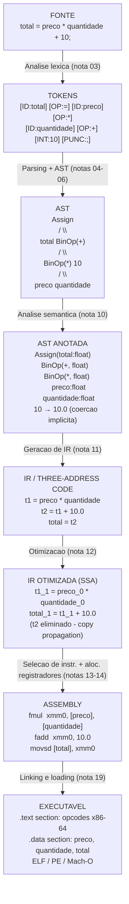
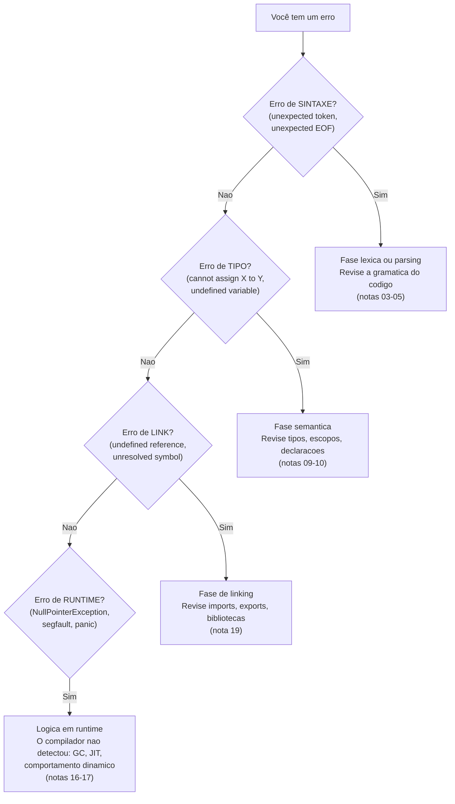
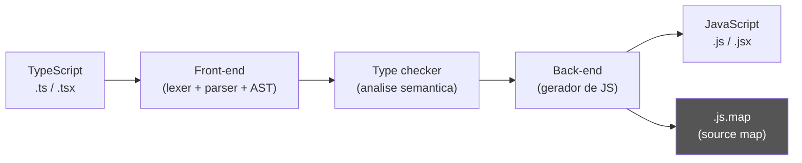
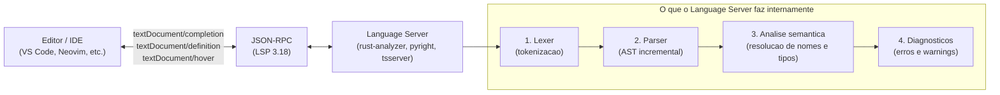
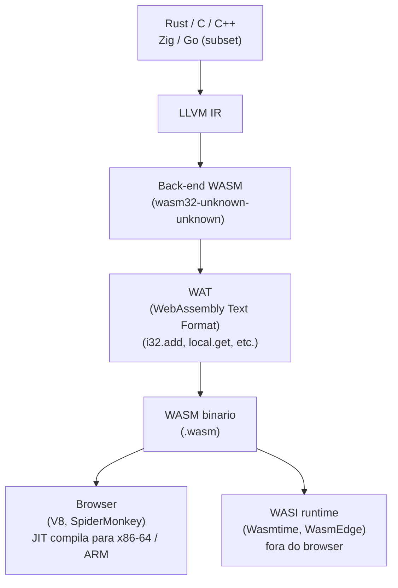
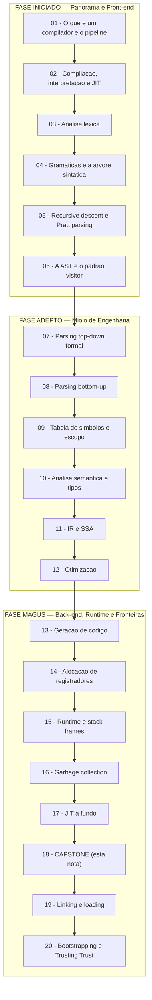

# Capstone - compiladores na vida do dev

> [!abstract] TL;DR
> Você percorreu o pipeline de compilação do início ao fim — do caractere bruto ao executável que roda em metal. Este capstone faz duas coisas: (1) atravessa uma expressão concreta por todas as fases, mostrando o código em cada transformação; (2) conecta esse conhecimento a situações reais no dia a dia de um dev sênior — mensagens de erro, builds lentos, transpilers, LSP, WASM e DSLs. Ao final, você não apenas *sabe* como um compilador funciona: você *vê* o compilador operando enquanto trabalha.

---

## O galho em uma frase

Você começou com a pergunta "o que é um compilador?" e chegou até JIT, GC e SSA. Antes de olhar para frente, vale parar um segundo para olhar para trás — e ver que tudo isso não é teoria abstrata. É o motor que roda enquanto você digita.

---

## Pipeline end-to-end: uma expressão, oito transformações

Nada fixa o conhecimento como ver *o mesmo trecho de código* mudar de forma enquanto atravessa cada fase. Vamos usar:

```
total = preco * quantidade + 10;
```

Uma atribuição simples. Três operadores. Um literal inteiro. Perfeita para mostrar cada etapa sem ruído.

---

### Diagrama: o pipeline com o exemplo concreto



> [!info] Leitura do diagrama
> Cada caixa mostra a *representação real* do trecho `total = preco * quantidade + 10;` naquela fase. O código não muda de significado — muda de forma. A seta indica qual nota do galho descreve a transformação.

---

### Fase 1 — Texto-fonte

O compilador recebe uma sequência de caracteres. Nada mais. Não existe "variável" nem "operador" neste ponto — só bytes.

```
t o t a l   =   p r e c o   *   q u a n t i d a d e   +   1 0 ;
```

---

### Fase 2 — Tokens (análise léxica)

O *scanner* agrupa os caracteres em unidades com significado. Ver [[03 - Análise léxica - do texto a tokens]].

```
[ID "total"] [OP "="] [ID "preco"] [OP "*"] [ID "quantidade"] [OP "+"] [INT 10] [PUNC ";"]
```

Cada token tem tipo e valor. O lexer já descartou espaços e comentários.

---

### Fase 3 — AST (parsing)

O *parser* consome a sequência de tokens e constrói a árvore que reflete a precedência dos operadores. Ver [[04 - Gramáticas e a árvore sintática]] e [[06 - A AST e o padrão visitor]].

```
Assign
├── ID "total"
└── BinOp "+"
    ├── BinOp "*"
    │   ├── ID "preco"
    │   └── ID "quantidade"
    └── INT 10
```

Note: `*` é filho de `+`, não o contrário — a árvore captura precedência.

---

### Fase 4 — AST com semântica resolvida

O compilador verifica se `preco`, `quantidade` e `total` existem no escopo atual, quais são seus tipos, e se a operação é válida. O literal `10` é promovido implicitamente para `float`. Ver [[10 - Análise semântica e checagem de tipos]].

```
Assign(total: float)
├── ID "total" : float (declarada no escopo)
└── BinOp "+" : float
    ├── BinOp "*" : float
    │   ├── ID "preco"     : float (resolvida)
    │   └── ID "quantidade": float (resolvida)
    └── FLOAT 10.0  ← coerção implícita int→float
```

---

### Fase 5 — IR / three-address code

A AST é "planificada" em código de três endereços. Ver [[11 - Representação intermediária e SSA]].

```
t1 = preco * quantidade
t2 = t1 + 10.0
total = t2
```

Cada instrução tem no máximo dois operandos e um resultado. Isso facilita análise e transformação.

---

### Fase 6 — IR otimizada (SSA + copy propagation)

O otimizador percebe que `t2` é copiado imediatamente para `total`. Elimina a variável temporária. Ver [[12 - Otimização]].

```
t1_1 = preco_0 * quantidade_0
total_1 = t1_1 + 10.0
```

Em SSA, cada variável tem exatamente uma definição (sufixo `_0`, `_1`). Isso habilita análises de fluxo.

---

### Fase 7 — Assembly com registradores alocados

O gerador de código seleciona instruções x86-64 e aloca registradores físicos. Ver [[13 - Geração de código e seleção de instruções]].

```asm
fmul  xmm0, [preco], [quantidade]   ; xmm0 = preco * quantidade
fadd  xmm0, 10.0                     ; xmm0 += 10.0
movsd [total], xmm0                  ; total = xmm0
```

---

### Fase 8 — Executável

O linker combina este objeto com as bibliotecas que ele depende e gera um arquivo ELF (Linux), PE (Windows) ou Mach-O (macOS). Ver [[19 - Linking e loading]].

O SO carrega o segmento `.text` em memória executável, resolve os símbolos pendentes, e o processador executa.

---

## Cheat-sheet: estágio → entrada → saída → estrutura de dados

| Estágio | Entrada | Saída | Estrutura principal |
|---|---|---|---|
| Análise léxica | Fluxo de caracteres | Sequência de tokens | Lista / stream de tokens |
| Parsing | Sequência de tokens | Árvore sintática (CST/AST) | Árvore N-ária |
| Análise semântica | AST + tabela de símbolos | AST anotada / erros | AST + tabela de símbolos |
| Geração de IR | AST anotada | Código de três endereços / SSA | Grafo de fluxo de controle (CFG) |
| Otimização | IR | IR transformada | CFG / SSA |
| Seleção de instruções | IR | Sequência de instruções da arquitetura-alvo | DAG de instruções |
| Alocação de registradores | Instruções com virtuais | Instruções com físicos | Grafo de interferência |
| Linking | Módulos objeto | Executável / biblioteca | Tabela de símbolos, seções |

---

## Por que isso te torna melhor

Agora vem a parte que faz o galho valer para além da teoria.

---

### Ler mensagens de erro como um compilador leria

Quando você vê um erro, a primeira pergunta é: **em que fase ele aconteceu?** Isso direciona o fix imediatamente.



> [!info] Leitura do diagrama
> Cada ramificação corresponde a uma fase do pipeline. Saber onde o erro foi detectado elimina hipóteses instantaneamente — você não vai procurar um erro de tipo no linker.

> [!tip] Regra prática
> Erro de compilação = fase estática (lexer/parser/semântica/linker). Erro de runtime = o compilador não tinha informação suficiente para detectar em tempo de compilação — lógica dinâmica, GC ou JIT em ação.

---

### Entender por que o build é lento

Builds lentos têm causas distintas dependendo da fase:

- **Parsing custoso**: arquivos de header gigantes em C++ (pré-compilado headers existem por isso). Módulos em C++20 resolvem em parte.
- **Otimização `-O2`/`-O3`**: inlining agressivo, unrolling, análise de alias — cada um custa tempo de compilação. O compilador faz mais trabalho para entregar código mais rápido.
- **Monomorphization (Rust/C++ templates)**: cada instância de tipo gera código separado. `Vec<i32>` e `Vec<String>` viram dois binários diferentes. Explosão de código objeto.
- **Link incremental**: o linker relê todos os símbolos. Linking incremental (LLD, `mold`) só reprocessa o que mudou.
- **Compilação incremental**: o compilador rastreia quais módulos mudaram e só recompila esses. Ferramentas como `cargo check` (Rust) fazem apenas análise semântica, sem geração de código — muito mais rápido.

> [!warning] O custo de `-O2`
> Pedir ao compilador para otimizar é pedir que ele resolva problemas NP-difíceis (alocação de registradores, scheduling de instruções). É esperado que `-O2` seja 2-5× mais lento que `-O0`. Em CI, separe o build de teste (sem otimizações) do release build.

---

### Transpilers e ferramentas de front-end

TypeScript, Babel, SWC, esbuild — todos são compiladores. A diferença é que o *alvo* não é assembly, mas outro código de alto nível (JavaScript).



> [!info] Leitura do diagrama
> O TypeScript executa um compilador completo — frente e verso. O **source map** é um arquivo JSON que mapeia cada posição no `.js` gerado de volta à posição correspondente no `.ts` original. É isso que permite o debugger mostrar seu código TypeScript enquanto o browser executa JavaScript.

**esbuild** (Go) e **SWC** (Rust) são 20-50× mais rápidos que `tsc` porque *ignoram a checagem de tipos*. Eles fazem só frente (AST) + verso (emit JS) sem a fase semântica cara. O `tsc --noEmit` continua sendo necessário para verificar tipos — nenhuma ferramenta substitui isso.

> [!example] Source maps na prática
> Quando você vê `bundle.min.js:1:43201` no stack trace do browser e o DevTools mostra a linha 47 do seu componente React — isso é o source map mapeando a posição de volta ao fonte original. Magia que é puro compilador.

---

### LSP: seu editor é um compilador parcial

O Language Server Protocol define como seu editor de código e um servidor de linguagem se comunicam. O servidor implementa as fases iniciais do compilador e expõe o resultado via JSON-RPC.



> [!info] Leitura do diagrama
> Toda vez que você digita uma letra no editor, o Language Server re-executa as fases 1-3 do compilador (de forma incremental, só no que mudou) e devolve sugestões, erros e definições. **Autocomplete = resolução de nomes em tempo real. Go-to-definition = a tabela de símbolos da análise semântica.** É exatamente o que a nota [[10 - Análise semântica e checagem de tipos]] descreve — só que rodando em milissegundos enquanto você escreve.

> [!tip] Por que o LSP importa
> Antes do LSP (criado pela Microsoft em 2016 junto com o VS Code), cada editor precisava de um plugin por linguagem. Com LSP, um único servidor de linguagem funciona com qualquer editor compatível — N linguagens × M editores = N+M implementações, não N×M.

---

### WebAssembly: um alvo de compilação universal

WebAssembly (WASM) é um formato binário portável que funciona como o "assembly" da web — e cada vez mais fora dela também.



> [!info] Leitura do diagrama
> Rust aponta para LLVM, que tem um back-end WASM. O resultado é um `.wasm` que o browser JIT-compila para código nativo (→ nota [[17 - JIT a fundo]]). O mesmo binário roda no browser, em Node.js e em runtimes WASI como Wasmtime — portabilidade sem abrir mão de performance próxima ao nativo.

Por que um dev sênior se importa com WASM? Porque cada vez mais ferramentas de front-end são escritas em WASM: esbuild compila para WASM para rodar no browser sem Node, plugins de formatador no VS Code rodam como WASM, e SQLite tem um port WASM que roda direto no browser. Entender que WASM é só "mais um alvo de compilação" desmistifica boa parte dessa magia.

---

### DSLs: quando você mesmo escreve um parser

Às vezes o problema pede uma linguagem pequena sob medida. Config files (TOML, YAML são parsers), sistemas de template (Jinja, Handlebars), query languages (GraphQL é um parser que gera um AST que o resolver percorre com o padrão Visitor — exatamente a nota [[06 - A AST e o padrão visitor]]).

> [!example] Quando escrever um parser
> Você tem uma DSL de regras de negócio que o time de produto edita. Em vez de inventar uma sintaxe em JSON (frágil, verboso), você escreve um parser simples com um lexer manual + parser recursivo descendente. Crafting Interpreters (Nystrom) mostra isso do zero em ~500 linhas de Java. O conhecimento deste galho é exatamente o que você precisa para tomar essa decisão com segurança.

---

### Performance: escrevendo código que o compilador otimiza

Saber o que o compilador faz internamente muda como você escreve código:

- **Inlining** ([[12 - Otimização]]): funções pequenas e frequentes são candidatas a inlining. Funções grandes ou com `#[inline(never)]` não são. Em Rust/C++, `#[inline]` é uma *dica*, não uma ordem.
- **JIT warmup** ([[17 - JIT a fundo]]): em Java/JVM, o código começa interpretado e o JIT compila os "hot paths" após ~10.000 invocações. Benchmarks que não fazem warmup medem o interpretador, não o JIT.
- **GC pauses** ([[16 - Garbage collection]]): alocações excessivas de objetos de curta duração alimentam o GC minor. Em código crítico de latência, reciclar objetos (object pooling) reduz pressão no GC.
- **Loops e estruturas de dados**: o compilador auto-vetoriza loops sobre arrays contíguos (SIMD). Listas encadeadas quebram o prefetcher da CPU — o compilador não consegue vetorizar acessos indiretos.

> [!success] O princípio geral
> Quanto mais *previsível* for o comportamento do seu código para o compilador (tipos estáticos, sem aliasing, loops sobre memória contígua), mais agressivas serão as otimizações aplicadas. Código idiomático em Rust ou Java moderno tende a ser mais otimizável porque elimina casos que o compilador não consegue descartar.

---

## Mapa do galho



> [!info] Leitura do diagrama
> O galho tem 20 notas distribuídas em três fases. A fase Iniciado cobre o panorama e o front-end (lexer → parser → AST). A fase Adepto cobre o miolo de engenharia (parsing formal LL/LR → tabela de símbolos → semântica/tipos → IR/SSA → otimização). A fase Magus cobre o back-end e o runtime (geração de código → alocação de registradores → stack frames → GC → JIT), fecha com este capstone e termina em linking/loading e bootstrapping/Trusting Trust — o último elo, da fonte ao binário.

---

## Conexões

- Anterior: [[17 - JIT a fundo]]
- Próxima: [[19 - Linking e loading]]
- Fundações léxicas: [[03 - Análise léxica - do texto a tokens]]
- Parsing e estrutura: [[04 - Gramáticas e a árvore sintática]], [[06 - A AST e o padrão visitor]]
- Semântica e tipos: [[10 - Análise semântica e checagem de tipos]]
- IR e SSA: [[11 - Representação intermediária e SSA]]
- Otimização: [[12 - Otimização]]
- Geração de código: [[13 - Geração de código e seleção de instruções]]
- Runtime: [[16 - Garbage collection]], [[17 - JIT a fundo]]
- Galho completo: [[01 - O que é um compilador e o pipeline de tradução]]

> [!summary] Resumo em uma linha
> Um compilador é uma série de transformações que preservam o significado enquanto mudam a forma — e entender cada transformação torna você um dev que lê erros mais rápido, escreve código mais otimizável e escolhe ferramentas com mais clareza.

---

## Em entrevista

Compiladores aparecem em entrevistas de duas formas: perguntas diretas sobre o pipeline (mais raras, mais em empresas de infra/linguagens) e perguntas indiretas que pressupõem o conhecimento (muito mais comuns). Saber o pipeline te diferencia porque você responde com precisão onde outros improvisam.

Estruture sua resposta ao pipeline em três camadas: **frente** (lexer + parser + semântica), **meio** (IR + otimização) e **verso** (geração de código + linking). Isso mostra organização e profundidade ao mesmo tempo.

*Can you walk me through the stages of a compiler?*

*Lexical analysis tokenizes the source characters into a stream of tokens; parsing builds an AST that captures syntactic structure and operator precedence; semantic analysis resolves names against a symbol table, checks types, and annotates the AST; IR generation flattens the AST into three-address code or SSA form; optimization passes transform the IR to improve performance without changing semantics; instruction selection maps IR operations to target instructions; register allocation assigns physical registers to virtual ones; and finally the linker combines object files, resolves external symbols, and produces an executable.*

*What's the difference between a syntax error and a type error?*

*A syntax error is caught by the parser — the token sequence violates the grammar; no AST can be built. A type error is caught by the semantic analysis phase — the AST is valid, but an operation is applied to incompatible types. Knowing which phase raised the error immediately tells you where to look.*

*Why does TypeScript exist if JavaScript already works?*

*TypeScript adds a static type system on top of JavaScript, enabling the semantic analysis phase to catch type errors at compile time rather than at runtime. The TypeScript compiler runs the full front-end plus type checking, then emits JavaScript. Tools like SWC and esbuild skip type checking entirely to be 20-50× faster — they are transpilers, not full compilers in that sense.*

*What is SSA and why does it matter for optimization?*

*Static Single Assignment form ensures every variable has exactly one definition in the IR. This property makes data-flow analyses like constant propagation, dead code elimination, and copy propagation dramatically simpler — each use of a variable has exactly one reaching definition, eliminating the need for complex reaching-definition lattices.*

*What is the Language Server Protocol and how does it relate to compilers?*

*LSP is a JSON-RPC protocol that lets any editor communicate with a language server, which runs the compiler's front-end phases incrementally to provide autocomplete, go-to-definition, and diagnostics in real time. Autocomplete is name resolution; go-to-definition is the symbol table; type errors in your editor are the semantic analysis phase running on every keystroke.*

*What is WebAssembly and why should a web developer care?*

*WebAssembly is a portable binary instruction format that serves as a compilation target for languages like Rust, C, and C++. The browser's JavaScript engine JIT-compiles WASM to native code, achieving near-native performance. From a compiler perspective, WASM is just another back-end target — the same way LLVM emits x86-64, it also emits WASM32.*

*Why does enabling -O2 make compilation slower but the binary faster?*

*Optimization passes — inlining, loop unrolling, constant folding, register allocation improvements — require the compiler to solve NP-hard problems over the program's control-flow graph. More optimization work at compile time yields faster code at runtime. The trade-off is explicit: debug builds skip most optimization, release builds invest compile time to earn runtime performance.*

*What is a JIT compiler and how is it different from an AOT compiler?*

*Ahead-of-time compilation happens before the program runs — the compiler has full information about the program but no information about runtime data. Just-in-time compilation happens during execution: the VM profiles hot code paths and compiles them to native code at runtime, using actual data to guide speculative optimizations like inline caching and type specialization. JIT can outperform AOT when runtime data enables better decisions than static analysis alone.*

*When would you write your own parser instead of using a general-purpose format like JSON?*

*When the domain has a natural syntax that JSON cannot express cleanly — rule engines, query languages, template systems, config DSLs. A recursive-descent parser for a small grammar is a few hundred lines and gives you better error messages, syntax highlighting hooks, and LSP support. The risk is maintenance; the reward is a domain-specific tool that fits the problem precisely.*

*What is garbage collection and how does it interact with a compiler?*

*GC is a runtime system that automatically reclaims unreachable memory. The compiler cooperates with the GC by emitting safepoint instructions — places where the mutator thread can be paused and the heap inspected. The compiler also performs escape analysis to determine which objects can be stack-allocated instead of heap-allocated, reducing GC pressure. Understanding GC pauses helps you write code that minimizes allocation in hot paths.*

### Tabela de termos PT → EN

| Português | English |
|---|---|
| Compilador | Compiler |
| Interpretador | Interpreter |
| Análise léxica | Lexical analysis / scanning |
| Token | Token |
| Análise sintática | Parsing / syntactic analysis |
| Árvore sintática abstrata | Abstract syntax tree (AST) |
| Tabela de símbolos | Symbol table |
| Análise semântica | Semantic analysis |
| Checagem de tipos | Type checking |
| Representação intermediária | Intermediate representation (IR) |
| Forma SSA | Static single assignment (SSA) |
| Otimização | Optimization / optimization pass |
| Seleção de instruções | Instruction selection |
| Alocação de registradores | Register allocation |
| Compilação just-in-time | Just-in-time compilation (JIT) |
| Coleta de lixo | Garbage collection (GC) |
| Transpilador | Transpiler / source-to-source compiler |
| Mapa de fonte | Source map |
| Protocolo de servidor de linguagem | Language Server Protocol (LSP) |

---

> [!info] Lastro
> - Aho, A. V., Lam, M. S., Sethi, R., & Ullman, J. D. (2006). *Compilers: Principles, Techniques, and Tools* (2nd ed.). Pearson / Addison-Wesley. ISBN 978-0-321-48681-3. ["Livro do Dragão"](https://www.informit.com/store/compilers-principles-techniques-and-tools-9780321486813) — referência canônica para todas as fases do pipeline.
> - Nystrom, R. (2021). *Crafting Interpreters*. Genever Benning. ISBN 978-0-9905829-3-9. Disponível gratuitamente em [craftinginterpreters.com](https://craftinginterpreters.com/) — implementação hands-on de lexer, parser, AST, semântica e VM em Java e C.
> - Cooper, K. D., & Torczon, L. (2011). *Engineering a Compiler* (2nd ed.). Morgan Kaufmann. ISBN 978-0-12-088478-0. [Elsevier](https://shop.elsevier.com/books/engineering-a-compiler/cooper/978-0-12-088478-0) — tratamento rigoroso de IR, SSA, otimização e alocação de registradores.
> - W3C / WebAssembly Community Group. (2026). *WebAssembly Core Specification 3.0*. [webassembly.github.io/spec](https://webassembly.github.io/spec/core/intro/introduction.html) — especificação oficial do formato binário, validação e semântica de execução.
> - Microsoft. (2024). *Language Server Protocol Specification 3.18*. [microsoft.github.io/language-server-protocol](https://microsoft.github.io/language-server-protocol/specifications/lsp/3.18/specification/) — protocolo JSON-RPC que define como editores e servidores de linguagem se comunicam.
> - esbuild vs SWC vs Babel (2026). [pkgpulse.com/guides/esbuild-vs-swc-2026](https://www.pkgpulse.com/guides/esbuild-vs-swc-2026) — comparação prática de transpilers modernos, benchmarks e casos de uso.
> - TypeScript. (2026). *TypeScript Compiler Handbook*. [typescriptlang.org/docs](https://www.typescriptlang.org/docs/) — documentação oficial do compilador TypeScript, incluindo checagem de tipos e emissão de JS.
