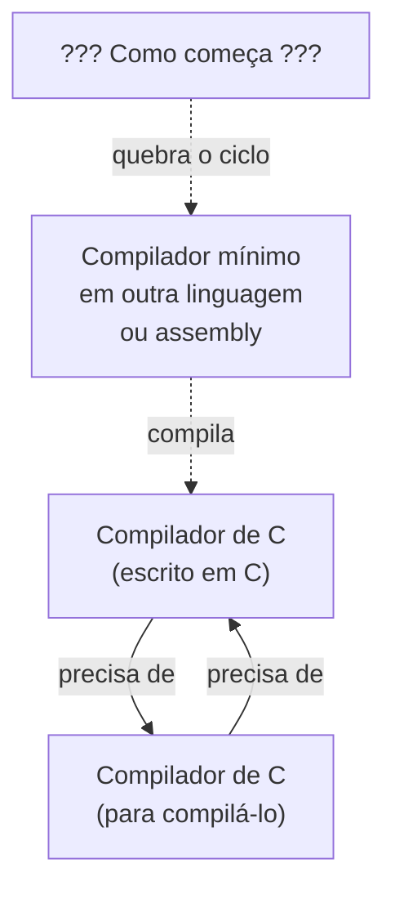
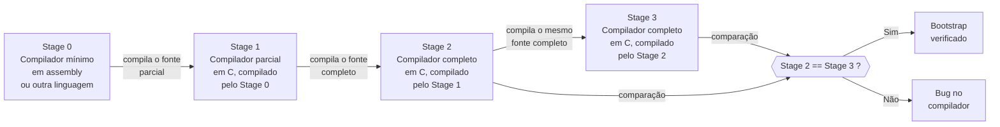
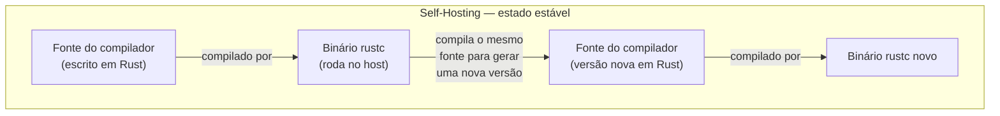
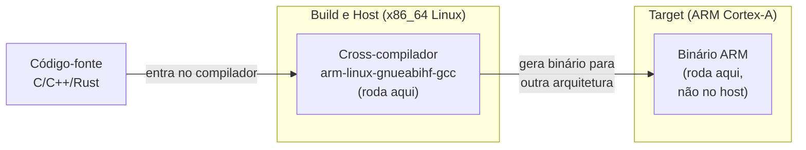
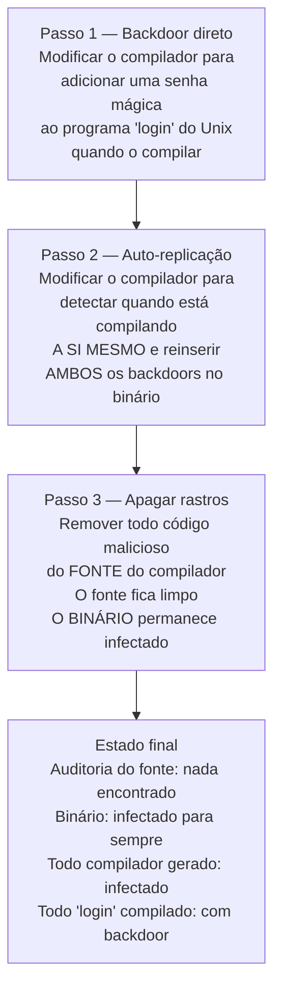
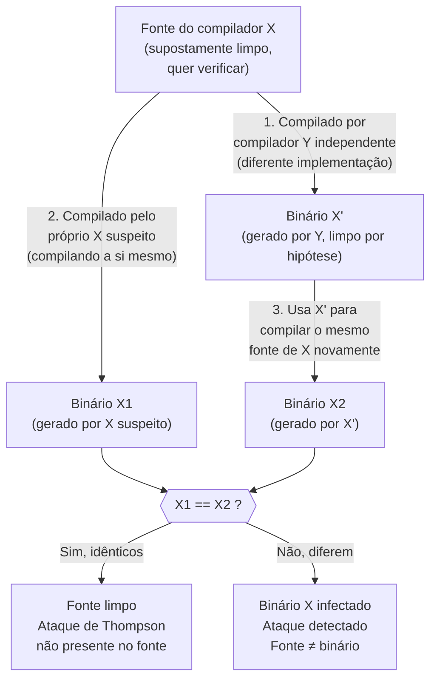

# Bootstrapping, self-hosting e o ataque de Thompson

> [!abstract] TL;DR
> Todo compilador é um programa — mas com que compilador você compila o primeiro compilador? A resposta é o _bootstrapping_: puxar-se pelos próprios cadarços, subindo de uma versão mínima em assembly até um compilador completo escrito na própria linguagem. Quando um compilador compila a si mesmo, temos _self-hosting_ — marco de maturidade de qualquer linguagem. Mas Ken Thompson mostrou em 1984 que essa auto-replicação abre uma brecha assustadora: um compilador infectado pode propagar um backdoor invisível a qualquer auditoria de código-fonte — e a única defesa prática é o Diverse Double-Compiling de Wheeler.

---

## O problema do ovo e da galinha

Pense num compilador de C. Ele transforma código C em binário. Mas o próprio compilador de C é escrito em C. Então, para compilar o compilador, você precisa de... um compilador de C.

Isso é circular. E não é só um exercício filosófico — é um problema prático que toda nova linguagem enfrenta na hora de nascer.

A pergunta é simples e perturbadora: **com o que se compila o primeiro compilador?**

Se você responder "com outro compilador", a pergunta se repete. Se você disser "compilador de C em C foi compilado pelo compilador de C anterior", você empurra o problema para trás no tempo, mas não o resolve. Em algum ponto da história, tinha que haver um primeiro compilador de C. E esse primeiro não pôde ser compilado por um compilador de C que ainda não existia.

> [!info] Leitura do diagrama
> A seta circular entre A e B é o paradoxo puro. A seta pontilhada mostra a saída: começar de _fora_ do ciclo, com algo que já existe. Isso é o bootstrapping.

A resposta chama-se **bootstrapping** — e é elegante como um nó de Möbius.

O nome vem da expressão inglesa "pull yourself up by your bootstraps": levantar-se puxando os próprios cadarços dos sapatos. Fisicamente impossível. Metaforicamente poderoso. Na computação, é o processo pelo qual uma linguagem ganha capacidade de se auto-compilar partindo do nada.

A história do C é o exemplo canônico. O compilador original de C foi escrito por Dennis Ritchie em B (o predecessor do C) e depois em assembly. Quando o C amadureceu o suficiente, Ritchie reescreveu o compilador em C. Para compilar essa nova versão, ele usou o compilador antigo — ainda em B — para produzir o primeiro binário do compilador C puro. Daí em diante, o compilador de C compilou a si mesmo. A escada em B foi descida, mas o processo foi preservado na história.

---

## Bootstrapping: os estágios da escalada

A ideia central é simples: você não precisa compilar o compilador _completo_ de uma vez. Você sobe por degraus.

**Stage 0 — O ponto de partida:** escreva um compilador mínimo (às vezes chamado de _seed compiler_ ou _stage0_) em assembly, ou em outra linguagem já compilável. Ele não precisa implementar toda a linguagem — só o suficiente para compilar a próxima versão.

**Stage 1 — O primeiro filho:** use o stage0 para compilar uma versão maior do compilador, já escrita na nova linguagem. O stage1 faz mais coisas que o stage0.

**Stage 2 — O compilador real:** use o stage1 para compilar o compilador completo. O stage2 é o compilador que você vai distribuir.

**Stage 3 — A verificação:** use o stage2 para compilar o mesmo fonte do compilador completo. Se stage2 e stage3 são bit-a-bit idênticos, o processo é consistente. Esse é o _ponto fixo_.

> [!info] Leitura do diagrama
> Cada seta é uma compilação real. O ponto-chave é que Stage 2 e Stage 3 compilam o _mesmo fonte_ — só diferem pelo compilador que os gerou. Se o resultado é idêntico, a transitividade está saudável. Se difere, algo está errado na cadeia.

> [!tip] Por que 3 estágios e não 2?
> Dois estágios provam que o compilador _se reproduz_. Três estágios provam que ele se reproduz _de forma estável_, eliminando variações introduzidas pelo compilador de sistema que iniciou o processo. O GCC usa exatamente esse esquema e documenta o comando `make compare` para verificar a igualdade entre stage2 e stage3.

O GCC descreve isso na documentação oficial: o compilador é construído três vezes. A primeira com o compilador nativo do sistema. A segunda com o compilador recém-gerado. A terceira com o resultado da segunda. Em teoria, os dois últimos deveriam produzir resultados idênticos — e se não produzirem, isso indica um bug potencialmente sério.

Na prática, o bootstrapping de uma nova linguagem costuma envolver também escolhas pragmáticas: o projeto [stage0](https://github.com/oriansj/stage0) e o [bootstrappable builds](https://bootstrappable.builds.gnu.org/) tentam rastrear a cadeia até o menor seed possível, minimizando a confiança que você precisa depositar em binários pré-existentes.

### T-diagrams: a notação de Bratman

Peter Bratman (1961) formalizou uma notação visual para raciocinar sobre compiladores e bootstrapping: os **T-diagrams** (diagramas em T). Um compilador que traduz linguagem S para linguagem T, e é implementado em linguagem H, é representado como um T com S na esquerda, T na direita, e H na base.

A beleza dos T-diagrams está em como eles se encaixam: se a linguagem de implementação H bate com a linguagem de entrada de outro compilador, você pode compô-los — como peças de Lego. O bootstrapping vira uma sequência de encaixes. O stage0 lê a base de um T, e permite encaixar o próximo T acima, subindo a cadeia.

A ideia completa dos T-diagrams está na Wikipedia sobre Bootstrapping (compilers) — recomendada para quem quer visualizar a algebra dos compiladores. Aqui o essencial: cada estágio do bootstrapping é um T que encaixa no T anterior.

Os T-diagrams também deixam claro por que cross-compilation é natural: você simplesmente usa um T com base em "arquitetura existente" para produzir código com alvo em "nova arquitetura". A notação generaliza facilmente para todos os casos: nativo, cross, e Canadian Cross.

---

## Self-hosting: o compilador que compila a si mesmo

Quando um compilador é escrito na própria linguagem que ele compila, dizemos que ele é **self-hosted** (auto-hospedado).

Exemplos canônicos:

- O compilador de C original do Unix foi reescrito em C e tornou-se self-hosted.
- O `rustc` (compilador do Rust) é escrito em Rust.
- O compilador de Go é escrito em Go desde a versão 1.5 (antes era em C).
- O compilador do OCaml é escrito em OCaml.
- O compilador do Haskell GHC é escrito em Haskell.

> [!info] Leitura do diagrama
> O loop não é um paradoxo — é um estado estável. O binário existente compila a próxima versão do fonte, que produz um binário novo. A evolução da linguagem é interna à própria linguagem.

Self-hosting é um **marco de maturidade** de uma linguagem por razões concretas:

**Dogfooding de alto nível:** os autores da linguagem passam a escrever código real e complexo nela. Um compilador é um dos programas mais exigentes que existem — lida com parsing, otimização, geração de código, gerenciamento de memória. Se a linguagem tem buracos expressivos ou problemas de performance, o compilador os vai expor.

**Ecossistema fechado:** a linguagem não depende de outra linguagem para evoluir. Novas features podem ser usadas no próprio compilador assim que implementadas. Há um feedback loop direto.

**Sinal de confiança para a comunidade:** quando Go 1.5 reescreveu o compilador em Go e abandonou o compilador em C, foi um sinal claro de que a linguagem era madura o suficiente para projetos de grande escala.

O paradoxo aparente desaparece quando você entende que o _primeiro_ compilador self-hosted foi gerado pelo bootstrapping. O binário que "iniciou o ciclo" veio de fora. Uma vez dentro, o ciclo se sustenta — e a escada do bootstrapping pode ser esquecida (mas nunca jogada fora de verdade, pois alguém precisa manter o stage0 para reconstrução limpa).

### O caso do Go 1.5

Antes do Go 1.5 (2015), o compilador Go era escrito em C. Isso criava uma dependência: para compilar Go, você precisava de um compilador C. Rob Pike liderou o esforço de reescrever o compilador em Go puro.

O bootstrapping do Go 1.5 funcionou assim: o compilador Go 1.4 (ainda em C) foi usado para compilar o novo compilador Go 1.5 (escrito em Go). O novo compilador passou a compilar a si mesmo e todas as versões subsequentes. A dependência do C foi eliminada da toolchain regular.

O resultado: para construir Go hoje, você começa com um binário de Go 1.4 (ou outro compilador Go confiável) e usa isso para compilar o fonte do compilador Go atual. A cadeia de confiança é mais longa, mas é explícita e auditável.

### O caso do Rust

O Rust usa uma abordagem similar. O `rustc` é escrito em Rust, mas para compilar uma nova versão do `rustc`, você precisa de uma versão anterior do `rustc`. O projeto mrustc ("mini rustc") é um compilador de Rust escrito em C++ — um compilador alternativo independente que serve como ponto de entrada para bootstrapping limpo, quebrando a dependência do binário pré-compilado.

Esse é exatamente o ponto que o projeto Bootstrappable Builds explora: reduzir o conjunto de binários que você precisa confiar cegamente para iniciar toda a cadeia. O ideal é chegar a um _seed_ tão pequeno que pode ser auditado à mão — centenas de bytes de binário, não megabytes. O seed0 do projeto Bootstrappable Builds é um binário de 357 bytes que implementa um subconjunto mínimo de hex-assembly. Tudo o mais é construído a partir daí, em etapas auditáveis.

---

## Cross-compilation: compilar para outro mundo

E quando você quer compilar para uma arquitetura diferente da máquina onde está trabalhando?

Isso é **cross-compilation** (compilação cruzada). Você compila no _host_ (a máquina onde você trabalha) código para um _target_ (a arquitetura de destino). O binário gerado não roda no host — roda no target.

A terminologia GNU estabelece três papéis distintos:

| Papel | Significado |
|---|---|
| **build** | A máquina onde o compilador está sendo _construído_ agora |
| **host** | A máquina onde o compilador vai _rodar_ |
| **target** | A arquitetura para qual o compilador vai _gerar código_ |

Para um compilador nativo comum, os três são iguais. Para um cross-compiler clássico (compilando firmware ARM num PC x86), temos build == host (seu PC Linux x86) e target (ARM Cortex-M). No caso raro do **Canadian Cross** — construir um cross-compilador em uma plataforma para que ele rode em outra e gere código para uma terceira — os três papéis são todos distintos.

> [!info] Leitura do diagrama
> O compilador roda no host (x86) mas entende a ABI, as instruções e os registradores do target (ARM). O binário gerado é incompreensível para o host — precisa de hardware ARM ou emulação para rodar.

Cross-compilation é a solução natural para **quebrar a circularidade do bootstrapping em uma nova plataforma**. Você não precisa de um compilador rodando na nova plataforma para gerar o primeiro compilador para ela — você compila na plataforma que já existe.

> [!example] Bootstrapping do RISC-V
> Quando o RISC-V emergiu como arquitetura, os primeiros compiladores para ela foram gerados em máquinas x86_64 via cross-compilation. Só depois, quando havia infraestrutura suficiente (hardware, emuladores), foi possível fazer o bootstrap nativo. O stage0 veio de fora — e isso é correto.

Cross-compilation também é onipresente em desenvolvimento embarcado. Um desenvolvedor de firmware para microcontroladores nunca compila no próprio microcontrolador — compila no PC, gera o binário para o target, e faz o upload. A toolchain GCC, quando instalada como `arm-none-eabi-gcc`, já é um cross-compiler: build e host são o seu PC, target é ARM sem sistema operacional.

### A conexão entre cross-compilation e bootstrapping

Quando você quer fazer o bootstrapping do compilador de uma plataforma nova, você usa cross-compilation como primeiro passo. Compile o stage0 na plataforma existente apontando para a nova arquitetura como target. Faça o upload do binário gerado para a nova plataforma. Execute lá. Use esse binário para compilar o stage1 _na nova plataforma_. A partir do stage2, você tem um compilador nativo da nova arquitetura.

Esse fluxo é o que permitiu que arquiteturas como RISC-V, WebAssembly (WASI), e diversas arquiteturas de DSPs ganhassem toolchains completas sem precisar de um compilador nativo no hardware novo desde o primeiro dia. A plataforma existente serve de "incubadora" — e só depois o bebê-compilador é capaz de andar sozinho.

---

## A verificação do ponto fixo

Antes de chegar no ataque de Thompson, é importante entender por que a igualdade stage2 == stage3 importa tanto.

Imagine que você tem um bug no compilador: uma otimização incorreta que transforma `a + b` em `a | b` em certos contextos. Se o compilador compilar a si mesmo, esse bug pode se propagar — o binário gerado tem o bug, e quando compila o próximo compilador, introduz o mesmo bug novamente. O bug se auto-preserva.

A verificação de três estágios detecta inconsistências desse tipo. Se stage2 e stage3 diferem, o compilador está gerando código inconsistente ao compilar a si mesmo — o que é um indicador forte de bug.

> [!warning] Ponto fixo ≠ correção
> Um compilador pode atingir o ponto fixo com um bug consistente — i.e., o bug se auto-preserva perfeita e estavelmente. O ponto fixo garante _estabilidade_, não _correção_. A correção exige testes independentes. Mas a estabilidade é necessária — sem ela, o compilador nem ao menos é determinístico.

Essa distinção entre estabilidade e correção é exatamente o terreno onde o ataque de Thompson vive.

### Ponto fixo na prática: o que o GCC faz

O GCC documenta o processo explicitamente. Durante o bootstrap padrão, o sistema de build:

1. Compila todos os estágios (stage1, stage2, stage3) usando o compilador do host como ponto de partida.
2. Compara os arquivos objeto gerados pelo stage2 e pelo stage3 usando `make compare`.
3. Se a comparação falha, emite um erro e para — indicando que o compilador não está se reproduzindo de forma estável.

O bootstrap pode ser desabilitado com `--disable-bootstrap`, mas a documentação oficial desaconselha: o processo de bootstrap _testa_ o compilador mais completamente do que qualquer suite de testes poderia, pois exercita a compilação de código real e complexo (o próprio GCC).

Há também a opção `--enable-checking`, que ativa asserções internas no compilador. Compilar com checking habilitado e depois verificar o ponto fixo é uma forma ainda mais robusta de garantir que o compilador está correto.

---

## O ataque de Ken Thompson: a traição que ninguém vê

Em 1984, Ken Thompson — co-criador do Unix e do B (precursor do C) — recebeu o Prêmio Turing junto com Dennis Ritchie. O Turing Award é o Nobel da computação. Em vez de um discurso celebratório, ele entregou uma bomba conceitual.

O título do artigo: _"Reflections on Trusting Trust"_, publicado nas Comunicações da ACM, Vol. 27, No. 8, agosto de 1984, pp. 761–763.

A tese central: **você não pode confiar em código que não criou completamente você mesmo.**

E para provar isso, ele descreveu um ataque. Não teórico — ele afirmou ter executado na prática, contra o compilador C do Unix.

O ataque é elegante, perturbador, e funciona em três passos:

> [!info] Leitura do diagrama
> Os passos são sequenciais e cada um prepara o terreno para o seguinte. O resultado final é um sistema onde o código-fonte parece completamente limpo mas o binário propaga a infecção indefinidamente.

> [!danger] O ataque de Thompson em detalhe
>
> **Passo 1 — O backdoor direto:** você modifica o compilador C para que, ao compilar o programa `login` do Unix, insira silenciosamente um trecho de código que aceita uma senha especial conhecida só por você — concedendo acesso root para qualquer um que a use. O programa `login` compilado com esse compilador tem a porta dos fundos. Mas se alguém ler o fonte do compilador, vai ver o código malicioso.
>
> **Passo 2 — A jogada genial, a auto-replicação:** você modifica o compilador para _também_ detectar quando está compilando a si mesmo (por exemplo, reconhecendo padrões do próprio código-fonte). Quando isso ocorre, o compilador insere no binário gerado não apenas o backdoor do `login`, mas também o próprio código de reconhecimento e reinserção. O compilador infectado gera um compilador igualmente infectado — sem que o fonte do compilador reflita isso.
>
> **Passo 3 — Limpar o crime:** agora você remove TODO o código malicioso do _fonte_ do compilador. O fonte fica pristino. Qualquer auditoria, por mais rigorosa que seja, não encontra nada suspeito no fonte. Mas o _binário_ do compilador continua infectado — e toda vez que recompila a si mesmo, regenera a infecção no próximo binário. Toda vez que compila o `login`, insere o backdoor.
>
> O ciclo é perfeito e invisível. Só existe no binário, nunca no fonte.

A frase de Thompson que ficou gravada na história da segurança:

> _"You can't trust code that you did not totally create yourself."_

E ele foi além: mesmo criar o código do zero não é suficiente, pois você precisa confiar no compilador que o compilou, no assembler, no linker, no sistema operacional, e em última instância no hardware. A cadeia de confiança desce até o silício.

O ângulo de segurança completo — supply chain, confiança transitiva, e o que isso significa para a segurança moderna — está em [[03-Dominios/Engenharia/Segurança/17 - Confiança transitiva e Trusting Trust]]. Aqui focamos no mecanismo do compilador: por que o self-hosting torna esse ataque possível e por que a verificação de fonte não é suficiente.

---

## Por que o self-hosting torna o ataque possível

Sem self-hosting, o ataque de Thompson não funciona. Pense:

Se o compilador de C fosse escrito em Pascal, e você quisesse infectá-lo, precisaria modificar o _compilador de Pascal_ para que, ao compilar o compilador de C, inserisse o backdoor. A cadeia fica mais longa, mais visível, mais difícil de manter.

Mas quando o compilador compila a si mesmo, a circularidade cria uma superfície de ataque fechada e perfeita. O binário infectado compila o próximo binário infectado compila o próximo — indefinidamente. E como o ponto fixo é mantido (stage2 == stage3, apenas ambos infectados da mesma forma), a verificação de três estágios não detecta nada.

O self-hosting é uma propriedade maravilhosa para o desenvolvimento de linguagens e uma superfície de ataque perfeita para quem controla o compilador de partida.

### A simetria com vírus de computador

O ataque de Thompson é estruturalmente idêntico a um vírus de arquivo. Um vírus de arquivo modifica executáveis ao infectá-los; ao ser executado, o executável infectado infecta outros executáveis. A diferença é que o ataque de Thompson atinge o _processo de compilação_ — a camada onde código-fonte se torna executável — tornando-o invisível a qualquer análise estática do fonte.

Isso antecipou em décadas os ataques modernos de supply chain: SolarWinds (2020) comprometeu o _processo de build_ da empresa, não o código-fonte. O resultado foi o mesmo: o binário distribuído tinha código malicioso que nenhuma auditoria do repositório poderia detectar. Thompson havia descrito o modelo em 1984.

> [!warning] A lição além do C
> O ataque de Thompson não é específico ao C ou a compiladores. Qualquer sistema que transforma uma representação "fonte" em uma representação "executável" pode ser alvo: transpiladores JavaScript, interpretadores Python (bytecode), pipelines de build de containers (Dockerfile → imagem), sistemas de CI/CD. A superfície é a transição entre fonte e artefato executável.

A profundidade real da observação de Thompson é que a confiança não pode ser estabelecida apenas analisando o que você _vê_ (o código-fonte). Ela precisa levar em conta toda a cadeia de transformações que você _não_ vê: o compilador, o assembler, o linker, o SO, o hardware. Cada camada é uma oportunidade de traição invisível.

---

## A defesa: Diverse Double-Compiling

Por décadas, o ataque de Thompson foi considerado teoricamente irrefutável na prática. Em 2005, David A. Wheeler apresentou na ACSAC (Annual Computer Security Applications Conference) uma defesa real: **Diverse Double-Compiling (DDC)**.

A ideia é elegante como o ataque que ela derrota: use diversidade para quebrar a homogeneidade da infecção.

> [!info] Leitura do diagrama
> A chave é o compilador Y, totalmente independente. Se X estava infectado e inseriu código ao se recompilar (X1), esse código extra não está no fonte. Quando Y — sem infecção — compila o mesmo fonte gerando X', e X' recompila o mesmo fonte gerando X2, o resultado X2 não tem o código extra. Logo X1 ≠ X2: o ataque é detectado.

O raciocínio formal: se o backdoor existe _apenas no binário_ (não no fonte), então compilar o mesmo fonte com um compilador independente e limpo produz um binário sem o backdoor. Usando esse binário limpo para compilar o fonte novamente, você obtém um segundo binário também sem o backdoor. A comparação revela a discrepância.

> [!success] Reproducible Builds: a versão moderna e em escala
> O projeto [Reproducible Builds](https://reproducible-builds.org/) generaliza essa ideia para distribuições inteiras de Linux e pacotes de software. Uma build é reprodutível se, dado o mesmo fonte, ambiente e instruções de build, qualquer parte pode recriar bit-a-bit o mesmo artefato. Isso permite verificação independente por terceiros — o mesmo princípio do DDC aplicado em escala a ecossistemas inteiros. Debian, Arch Linux, NixOS e outros aderiram ao projeto. A verificabilidade substitui a confiança cega.

Wheeler também demonstrou o DDC empiricamente, compilando quatro compiladores diferentes e verificando a ausência do ataque de Thompson em todos eles.

### O que o DDC exige na prática

O DDC tem um requisito importante: o compilador Y precisa ser suficientemente _diferente_ do compilador X para garantir que não compartilha a mesma infecção. Se Y é apenas uma versão ligeiramente modificada de X compilada pelo mesmo binário X, a diversidade é ilusória — ambos podem estar infectados da mesma forma.

Na prática, isso significa:

- Y deve ter uma cadeia de proveniência independente — idealmente compilado por terceiros confiáveis, ou de uma plataforma diferente.
- Builds determinísticos são essenciais: dois compiladores limpos compilando o mesmo fonte _devem_ produzir o mesmo binário para a comparação funcionar. Se existem fontes de não-determinismo (timestamps, ordenação de arquivos, seeds aleatórios), a comparação vai falhar mesmo sem infecção.

É aqui que Reproducible Builds entra como pré-requisito do DDC em larga escala. Sem builds determinísticos e reprodutíveis, você não consegue distinguir "infecção" de "não-determinismo inocente". Os dois projetos são complementares: Reproducible Builds constrói a fundação, DDC usa essa fundação para verificação de segurança.

---

## Fechamento: da fonte ao binário ao hardware, a torre de tradução

Esta é a última nota do galho Compiladores e Linguagens — e a última nota do domínio Fundamentos inteiro.

Começamos em [[01 - O que é um compilador e o pipeline de tradução]] perguntando: o que é um compilador? Como o texto em código vira silício em movimento? Percorremos lexing, parsing, IR, otimização, geração de código, linking, loading.

Aqui chegamos à pergunta que fecha o círculo: e o próprio compilador, com o que foi feito? Com que compilador foi compilado o compilador?

A resposta é o bootstrapping — e ela nos obriga a reconhecer que a cadeia de tradução que acreditamos entender (fonte → tokens → AST → IR → assembly → objeto → executável) tem uma camada mais profunda: o compilador que executa cada passo dessa cadeia é, ele mesmo, um artefato com história, com cadeia de custódia, e com superfícies de ataque que nenhuma auditoria de código-fonte consegue ver.

Ken Thompson nos lembrou disso em 1984, com uma elegância perturbadora. David Wheeler nos deu uma saída prática em 2005. E o projeto Reproducible Builds está tornando essa saída acessível para todos.

O loop se fecha: o ataque de Thompson só é possível _por causa_ do bootstrapping e do self-hosting. E a defesa de Wheeler só funciona _por causa_ da reproducibilidade de builds — que é, ela mesma, uma propriedade do processo de compilação. Compiladores e segurança não são domínios separados. São faces da mesma moeda.

### O que o domínio Fundamentos construiu

Ao longo do domínio Fundamentos, construímos uma imagem de como os computadores _realmente_ funcionam, camada por camada. Não abstrações de marketing, não simplificações de tutorial — o mecanismo real, com suas elegâncias e suas armadilhas:

- A **Organização de Computadores** nos deu o hardware: transistores, portas lógicas, ULA, registradores, memória.
- A **Matemática para Computação** nos deu a linguagem: lógica, álgebra, grafos, probabilidade.
- A **Teoria da Computação** nos deu os limites: o que é computável, o que não é, a complexidade do que é possível.
- Os **Sistemas Operacionais** nos deram o ambiente: processos, memória virtual, sistemas de arquivos, I/O.
- A **Concorrência** nos deu o tempo: threads, locks, condições de corrida, modelos de memória.
- A **Segurança Conceitual** nos deu o adversário: criptografia, autenticação, ataques, defesas, confiança.
- E os **Compiladores e Linguagens** fecharam o ciclo: como programas escritos por humanos se tornam instruções para máquinas — e quem garante que essa tradução é honesta.

Bootstrapping e o ataque de Thompson são o ponto onde todos esses fios se cruzam. É o compilador como sistema de confiança, como alvo de adversário, como artefato histórico com cadeia de custódia. É onde a Ciência da Computação encontra a Segurança, onde teoria encontra consequência prática.

> [!tip] A torre inteira
> Hardware → firmware → bootloader → kernel → libc → compilador → linguagem → seu programa.
>
> Cada camada confia na anterior. A confiança é transitiva. E em cada transição, há um compilador — ou algo que se comporta como um — traduzindo entre mundos.
>
> Entender compiladores não é apenas entender como código vira binário. É entender os alicerces da confiança computacional.

Este é o ponto final do galho. E um bom ponto de partida para tudo o mais — porque agora você sabe que "tudo o mais" começa com código compilado por algo em que você precisa, em algum nível, confiar.

> [!question] Para reflexão
> Se você não pode confiar no compilador que não criou você mesmo, pode confiar no processador que executa esse compilador? A Intel e a AMD publicam as especificações completas do comportamento de seus chips — mas os microprocessadores modernos têm microcódigo interno que pode ser atualizado. Quem audita o microcódigo? Onde para a cadeia de desconfiança? Esta é a questão que Thompson deixou em aberto — e que a área de _trusted hardware_ (TPM, secure enclaves, RISC-V como ISA aberta) tenta endereçar.

---

## Conexões

- Anterior: [[19 - Linking e loading]] — o último elo na cadeia antes da execução.
- Início do ciclo: [[01 - O que é um compilador e o pipeline de tradução]] — onde começamos; o bootstrapping fecha o círculo.
- Capstone do galho: [[18 - Capstone - compiladores na vida do dev]] — a visão do desenvolvedor sobre toda a pipeline.
- Confiança e supply chain: [[03-Dominios/Engenharia/Segurança/17 - Confiança transitiva e Trusting Trust]] — o ataque de Thompson pelo ângulo de segurança, defesa em profundidade e supply chain moderna.

---

> [!summary] Resumo em uma linha
> Bootstrapping resolve o paradoxo do ovo-e-galinha compilando um primeiro compilador fora da linguagem e subindo por estágios; self-hosting é quando o compilador compila a si mesmo — marco de maturidade e superfície de ataque; e o ataque de Thompson mostra que um compilador infectado propaga backdoors invisíveis para sempre, derrotado pelo Diverse Double-Compiling de Wheeler e pelo movimento de Reproducible Builds.

---

## Em entrevista

O tema de bootstrapping e self-hosting aparece em entrevistas para posições de infraestrutura de linguagens, toolchain, compiladores e engenharia de plataforma. O ataque de Thompson é referência obrigatória em perguntas sobre supply chain security, segurança de software e confiança em cadeias de ferramentas.

Em entrevistas de security engineering ou DevOps/SRE sênior, é comum a pergunta: "Como você garante que o binário que você distribui corresponde ao código-fonte que você auditou?" A resposta esperada envolve reproducible builds, assinatura de artefatos (sigstore, cosign), e idealmente o conhecimento de DDC como fundamento teórico. Citar Thompson mostra maturidade conceitual — você sabe que o problema tem raízes profundas, não é apenas "rodar um linter no CI".

*"A compiler is self-hosted when it is written in the language it compiles — for example, rustc is written in Rust. This is a maturity milestone: the language can evolve without depending on another toolchain, and the authors use their own language for demanding real-world code."*

*"Bootstrapping solves the chicken-and-egg problem: write a minimal compiler in an existing language or assembly, use it to compile a partial version in the new language, then use that to compile the full version. The ladder is then discarded — but ideally kept reproducible for clean reconstruction."*

*"Cross-compilation means building on the host machine code that will run on a different target architecture. In GNU terminology, build is where you compile now, host is where the compiler will run, and target is what the compiler generates code for. All three can differ — that is the Canadian Cross."*

*"The GCC build system performs a three-stage bootstrap: compile GCC three times, then compare the stage-2 and stage-3 outputs. If they are bit-for-bit identical, the bootstrap has reached a fixed point — the compiler is self-consistently reproducing itself."*

*"Ken Thompson's 'Reflections on Trusting Trust' showed that a compiler can be taught to insert backdoors into specific programs and to recognize when it is compiling itself — reinserting both backdoors into the output binary. After removing the malicious source, the binary continues to propagate the attack silently. Source code audits cannot detect it."*

*"Diverse Double-Compiling, proposed by David Wheeler, defeats the Thompson attack: compile the suspected compiler's source with an independent second compiler, use that output to recompile the source, and compare with the original binary. If they differ, the source does not match the binary — the attack is detected."*

*"Reproducible Builds extend this principle to ecosystems: if two independent parties building from the same source produce bit-for-bit identical binaries, the supply chain is verifiably clean. Projects like Debian and NixOS have adopted this as a security goal."*

*"The Thompson attack is structurally similar to a file virus: the infected binary modifies new binaries at compile time, propagating the attack without touching the source. This is why modern supply chain attacks target build pipelines and CI systems — the same principle, industrialized."*

*"To defend against Trojan horses in the build chain in practice: use hermetic builds (reproducible, sealed dependencies), sign artifacts with tools like cosign or sigstore, and for high-assurance targets, apply DDC by comparing binaries built with independent toolchains."*

| Português | Inglês |
|---|---|
| Bootstrapping / auto-inicialização | Bootstrapping |
| Auto-hospedagem | Self-hosting |
| Compilação cruzada | Cross-compilation |
| Máquina anfitriã | Host machine |
| Arquitetura alvo | Target architecture |
| Máquina de build | Build machine |
| Cruzamento canadense | Canadian Cross |
| Confiar em quem confia | Trusting Trust |
| Porta dos fundos | Backdoor |
| Cavalo de Troia no compilador | Compiler Trojan horse |
| Build hermético | Hermetic build |
| Compilação dupla diversificada | Diverse Double-Compiling (DDC) |
| Builds reproduzíveis | Reproducible builds |
| Ponto fixo | Fixed point |
| Semente do compilador | Compiler seed / stage0 |
| Cadeia de custódia | Chain of custody / chain of trust |

---

> [!info] Lastro
>
> 1. **Ken Thompson** — _Reflections on Trusting Trust_, Communications of the ACM, Vol. 27, No. 8, agosto de 1984, pp. 761–763. Turing Award Lecture. Disponível em: [dl.acm.org](https://dl.acm.org/doi/10.1145/358198.358210) e [cs.cmu.edu (PDF)](https://www.cs.cmu.edu/~rdriley/487/papers/Thompson_1984_ReflectionsonTrustingTrust.pdf). Fonte primária e canônica do ataque descrito nesta nota.
>
> 2. **David A. Wheeler** — _Countering Trusting Trust through Diverse Double-Compiling_, ACSAC 2005; _Fully Countering Trusting Trust through Diverse Double-Compiling_ (dissertação/tese, versão expandida). Disponível em: [dwheeler.com/trusting-trust](https://dwheeler.com/trusting-trust/) e [arxiv.org/abs/1004.5548](https://arxiv.org/abs/1004.5548). Descreve e demonstra o DDC contra quatro compiladores.
>
> 3. **GCC — Installing GCC: Building** — documentação oficial do processo de bootstrap em 3 estágios, a comparação stage2/stage3 via `make compare`, e o significado do ponto fixo. Disponível em: [gcc.gnu.org/install/build.html](https://gcc.gnu.org/install/build.html).
>
> 4. **Reproducible Builds project** — definição canônica ("bit-for-bit identical"), objetivos, documentação técnica e status de adoção em distribuições Linux. Disponível em: [reproducible-builds.org](https://reproducible-builds.org/) e [reproducible-builds.org/docs](https://reproducible-builds.org/docs/).
>
> 5. **GNU Autoconf — Hosts and Cross-Compilation** — documentação canônica dos papéis build/host/target e da terminologia GNU para cross-compilation e Canadian Cross. Disponível em: [gnu.org/software/autoconf](https://www.gnu.org/software/autoconf/manual/autoconf-2.69/html_node/Hosts-and-Cross_002dCompilation.html).
>
> 6. **Wikipedia — Bootstrapping (compilers)** — visão geral com referências históricas, T-diagrams de Bratman, e lista de compiladores self-hosted por linguagem. Disponível em: [en.wikipedia.org/wiki/Bootstrapping\_(compilers)](https://en.wikipedia.org/wiki/Bootstrapping_(compilers)).
>
> 7. **LWN.net — Wheeler: Fully Countering Trusting Trust through Diverse Double-Compiling** — artigo de 2010 que discute a tese de Wheeler e a recepção da comunidade de segurança. Disponível em: [lwn.net/Articles/360040](https://lwn.net/Articles/360040/).
