# Concorrência e paralelismo: o que é e por que é difícil

> [!abstract] Resumo em uma linha
> Concorrência é como você **estrutura** o programa para lidar com muitas coisas ao mesmo tempo; paralelismo é **executá-las** de fato ao mesmo tempo — e a dificuldade nasce do não-determinismo da intercalação.

Imagine uma cozinha. Um único cozinheiro precisa preparar três pratos: ele corta a cebola, vai ao fogão mexer o molho enquanto a cebola "descansa", volta para a cebola, checa o forno. Um cozinheiro, três pratos, **alternando** entre eles. Isso é **concorrência**: lidar com várias tarefas que progridem de forma intercalada.

Agora coloque **três cozinheiros**, um por prato, trabalhando lado a lado. Os três pratos avançam *literalmente* no mesmo instante. Isso é **paralelismo**: várias tarefas executando ao mesmo tempo de verdade.

Repare na sutileza: o primeiro cozinheiro **lidava** com três pratos ao mesmo tempo, mas só **fazia** uma coisa por vez. A concorrência estava na *estrutura* da cozinha — na decisão de dividir o trabalho em tarefas que dá para alternar. O paralelismo só apareceu quando contratamos mais cozinheiros.

## A distinção de Rob Pike

A formulação mais citada vem de uma palestra de **Rob Pike** (um dos criadores de Go), em 2012, intitulada justamente *"Concurrency is not parallelism"*:

> [!quote] Rob Pike
> "Concurrency is about **dealing with** lots of things at once. Parallelism is about **doing** lots of things at once."
>
> (Concorrência é sobre *lidar* com muitas coisas ao mesmo tempo. Paralelismo é sobre *fazer* muitas coisas ao mesmo tempo.)

E o ponto central, frequentemente esquecido:

> [!quote] Rob Pike
> "Concurrency is a way to **structure** a program by breaking it into pieces that can be executed independently. (...) Parallelism is **not the goal** of concurrency. The goal of concurrency is good structure."

Em uma frase: **concorrência é sobre design; paralelismo é sobre execução.**

A concorrência é uma decisão de **arquitetura** — você decompõe o problema em tarefas independentes que se comunicam. O paralelismo é uma propriedade da **execução** — se essas tarefas vão de fato rodar ao mesmo tempo depende do hardware (quantos núcleos você tem) e do escalonador.

```mermaid
flowchart TB
    subgraph CONC["Concorrência &#40;estrutura / design&#41;"]
        direction LR
        T1["Tarefa A"]
        T2["Tarefa B"]
        T3["Tarefa C"]
        note1["Programa decomposto em<br/>tarefas independentes"]
    end

    subgraph PAR["Paralelismo &#40;execução / hardware&#41;"]
        direction LR
        C1["Núcleo 1: A"]
        C2["Núcleo 2: B"]
        C3["Núcleo 3: C"]
        note2["Tarefas rodando<br/>simultaneamente"]
    end

    CONC -->|"uma forma de RODAR<br/>código concorrente"| PAR
```



Leitura do diagrama: a concorrência (caixa de cima) é a *forma de escrever* o programa — você o quebra em A, B e C. O paralelismo (caixa de baixo) é uma das *formas de rodar* esse programa concorrente: espalhar A, B e C por núcleos distintos. A seta indica que paralelismo é **uma maneira de executar** código concorrente, não um sinônimo dele.

> [!tip] A tabela mental
> - **Concorrência sem paralelismo**: um núcleo intercalando várias tarefas (o cozinheiro solo). Comum em I/O.
> - **Paralelismo sem concorrência aparente**: somar dois vetores grandes dividindo o trabalho entre núcleos — tarefas que nem precisam "lidar" umas com as outras.
> - **Ambos**: um servidor web concorrente rodando numa máquina de 16 núcleos.

## Por que isso existe (e por que agora)

Por que de repente todo mundo precisa pensar em concorrência? Por três pressões.

**1. O fim do "almoço grátis" (multicore).** Por décadas, programas ficavam mais rápidos sozinhos: bastava esperar a próxima geração de processadores, com clock maior, e o mesmo código corria mais rápido. Em 2005, **Herb Sutter** declarou o fim disso no clássico *"The Free Lunch Is Over"* (Dr. Dobb's Journal). O clock parou de subir — limites físicos de calor e energia — e os fabricantes passaram a entregar **mais núcleos** em vez de núcleos mais rápidos.

> [!warning] A consequência brutal
> Código sequencial **não fica mais rápido sozinho**. Uma CPU de 8 núcleos não acelera seu programa single-thread — ela só permite que *outros* programas (ou *suas* tarefas concorrentes) rodem em paralelo. Para usar o hardware moderno, você precisa **escrever** concorrência.

**2. I/O-bound — esperar sem travar.** Boa parte do trabalho de um programa real é *esperar*: resposta de rede, leitura de disco, query no banco. Se uma tarefa bloqueia esperando o disco, por que o programa inteiro deveria parar? A concorrência deixa outras tarefas progredirem durante a espera.

**3. Responsividade.** A interface não pode congelar enquanto baixa um arquivo. A thread da UI fica livre para responder ao usuário; o download acontece "ao lado".

```mermaid
flowchart LR
    A["Pressões que<br/>exigem concorrência"] --> B["Multicore<br/>&#40;free lunch acabou&#41;"]
    A --> C["I/O-bound<br/>&#40;esperar sem travar&#41;"]
    A --> D["Responsividade<br/>&#40;UI não congela&#41;"]
    B --> E["Usar todos os núcleos"]
    C --> F["Sobrepor esperas"]
    D --> G["Trabalho em segundo plano"]
```



Leitura do diagrama: três motivações distintas convergem para a mesma necessidade — estruturar o programa de forma concorrente. Note que cada uma puxa para um objetivo diferente (usar núcleos, sobrepor esperas, não congelar), e isso vai influenciar **qual estratégia** você escolhe.

## Por que é DIFÍCIL: o não-determinismo

Aqui está o coração da dor. Um programa sequencial é **determinístico**: dadas as mesmas entradas, ele executa os mesmos passos na mesma ordem, sempre. Você consegue raciocinar sobre ele lendo de cima para baixo.

Um programa concorrente **não tem uma ordem única de execução**. O escalonador decide quando cada tarefa avança, e essa decisão muda a cada execução — depende de carga da máquina, timing, sorte. As tarefas se **intercalam** (interleave) de jeitos imprevisíveis.

> [!question] Como `x++` quebra?
> Parece atômico, mas `x++` são na verdade **três passos**: ler `x` da memória, somar 1, escrever de volta. Se duas threads fazem isso ao mesmo tempo sobre o mesmo `x`, a intercalação dos seis passos (três de cada) decide o resultado.

Veja duas threads tentando incrementar um contador que vale `0`. O resultado *correto* seria `2`. Mas:

```mermaid
sequenceDiagram
    participant T1 as Thread 1
    participant Mem as x &#40;memória&#41;
    participant T2 as Thread 2

    Note over Mem: x = 0
    T1->>Mem: lê x → 0
    T2->>Mem: lê x → 0
    Note over T1,T2: ambas leram 0 antes de qualquer escrita
    T1->>T1: calcula 0 + 1 = 1
    T2->>T2: calcula 0 + 1 = 1
    T1->>Mem: escreve x = 1
    T2->>Mem: escreve x = 1
    Note over Mem: x = 1  ❌ &#40,esperado: 2&#41,
```



Leitura do diagrama: as duas threads leem `0` **antes** de qualquer uma escrever. Cada uma calcula `1` e escreve `1`. Um incremento foi **perdido** — o resultado é `1`, não `2`. E o ponto perturbador: noutra execução, a Thread 1 poderia terminar *antes* de a Thread 2 começar, e aí o resultado seria `2`, **correto**. O bug aparece ou some dependendo da ordem da intercalação. Isso é uma [[03 - Estado compartilhado e race conditions|race condition]].

A intercalação é **a fonte do caos**. Cada ordem possível de entrelaçar os passos das tarefas é uma execução diferente — e a quantidade de ordens explode com o número de threads e instruções.

> [!warning] Heisenbugs
> Bugs de concorrência frequentemente **somem quando você tenta observá-los**. Você adiciona um `print` para depurar — o print muda o timing, a intercalação ruim deixa de acontecer, e o bug "desaparece". Você roda num debugger, passo a passo, e tudo funciona. Esses são os **Heisenbugs** (trocadilho com o princípio da incerteza de Heisenberg): o ato de medir altera o fenômeno. Eles só aparecem em produção, sob carga, num horário específico.

> [!note] A lição que dói
> Um programa **correto em série pode estar errado quando concorrente**. A correção sequencial não se preserva. Você precisa de novas ferramentas mentais — [[04 - Atomicidade, visibilidade e ordenação|atomicidade, visibilidade e ordenação]] — para raciocinar sobre o que pode dar errado. E perigos como [[07 - Deadlock, livelock e starvation|deadlock]] nem existiam no mundo sequencial.

## Por que a correção não COMPÕE

Aqui está a propriedade mais traiçoeira da concorrência, e a que diferencia quem entende de quem decorou: **a correção não compõe**.

Em programação serial, a composição é seu melhor amigo. Se a função `A` está correta e a função `B` está correta, então chamar `A` e depois `B` continua correto. Você raciocina sobre cada peça **isoladamente**, prova que cada uma funciona, e a soma das partes funciona. É por isso que conseguimos construir sistemas enormes a partir de funções pequenas: a correção é uma propriedade **local** que se propaga para o todo.

Sob concorrência, essa garantia **evapora**. Dois trechos de código, cada um perfeitamente correto e até thread-safe por conta própria, podem produzir um programa errado quando executados ao mesmo tempo. A correção deixa de ser local e vira um problema **global** — você não pode mais provar a peça sozinha; precisa raciocinar sobre **todas as intercalações possíveis com tudo o mais que toca o mesmo estado**.

> [!question] Como duas operações corretas viram uma errada?
> Imagine uma estrutura de dados thread-safe — digamos, um `Map` concorrente em que `containsKey` é atômico e `put` é atômico. Cada operação, isolada, é impecável. Agora componha as duas no padrão clássico **"verifica-depois-age"** (check-then-act):
>
> ```
> if (!mapa.containsKey(chave)) {   // operação 1: atômica, correta
>     mapa.put(chave, valor);        // operação 2: atômica, correta
> }
> ```
>
> Duas threads executam isso. Ambas chamam `containsKey` **antes** de qualquer `put` — ambas veem `false`. Ambas seguem para o `put`. O segundo `put` sobrescreve o primeiro. Cada operação cumpriu seu contrato; a **composição** delas violou a intenção ("inserir só se não existir"). O bug não está em nenhuma das duas peças — está na **lacuna entre elas**, onde outra thread se intercala.

```mermaid
flowchart TB
    subgraph SERIAL["Mundo serial: correção COMPÕE"]
        direction LR
        SA["A correto"] --> SB["B correto"] --> SOK["A depois B<br/>correto ✓"]
    end
    subgraph CONC["Mundo concorrente: correção NÃO compõe"]
        direction LR
        CA["A correto<br/>&#40;thread-safe&#41;"]
        CB["B correto<br/>&#40;thread-safe&#41;"]
        CA --> CBUG["A + B juntos<br/>podem quebrar ✗"]
        CB --> CBUG
        GAP["outra thread se<br/>intercala na lacuna"] -.-> CBUG
    end
    SERIAL -.->|"a propriedade<br/>que se perde"| CONC
```



Leitura do diagrama: em cima, o mundo serial — a seta de `A` para `B` carrega a correção adiante; o todo herda a correção das partes. Embaixo, o mundo concorrente — `A` e `B` continuam corretos isoladamente, mas a composição abre uma **lacuna** onde uma terceira thread se enfia (a seta pontilhada), e o resultado conjunto pode estar errado. A linha pontilhada entre as caixas é exatamente **a garantia que você perde** ao sair do serial para o concorrente.

> [!warning] A consequência prática
> "Esse objeto é thread-safe" **não** significa "qualquer código que use esse objeto é thread-safe". A thread-safety das partes não se herda para o todo — é por isso que `java.util.concurrent` oferece operações **compostas atômicas** como `putIfAbsent` e `compute`: elas fecham a lacuna, fazendo o "verifica-depois-age" virar **um único passo indivisível**. Sempre que você vir duas operações thread-safe encadeadas tocando o mesmo estado, desconfie da costura entre elas.

O check-then-act não é o único padrão composto que quebra; ele é o representante de uma família. O **read-modify-write** (`saldo = saldo - valor`) é dois passos thread-safe — ler e escrever — com a mesma lacuna no meio. O **"itera-e-remove"** sobre uma coleção concorrente combina duas operações seguras numa sequência que pode pular ou repetir elementos se outra thread mexe na coleção entre os passos. Em todos, o mesmo enredo: **as peças estão certas; a junção, não.** A regra mental é abrir mão de "a operação é segura?" e adotar "**a sequência inteira que precisa ser indivisível está, de fato, sendo tratada como indivisível?**" — se não está, a lacuna é o seu bug.

Essa é a raiz filosófica de toda a dor que vem a seguir: concorrência é difícil porque o raciocínio **modular** — a técnica que torna toda a engenharia de software possível — para de valer. Você não pode mais isolar e conquistar.

## Por que os testes não pegam esses bugs

Se a correção não compõe e tudo depende da intercalação, surge a pergunta natural: por que não escrevo um teste e pronto? Porque **o teste herda o não-determinismo do programa** — e o não-determinismo é justamente o que você precisaria controlar para testar.

Um teste de unidade serial é uma promessa: rodou verde, vai rodar verde de novo. Um teste de código concorrente promete muito menos. Ele exercita **uma** das intercalações possíveis — aquela que o escalonador escolheu naquela máquina, naquele instante, sob aquela carga. O bug, porém, mora em **outra** intercalação: a que perde o incremento, a que se enfia na lacuna do check-then-act. Se essa ordem específica não acontecer durante o teste, o teste passa. E ele passa **quase sempre**, porque a janela de tempo da intercalação ruim é minúscula.

> [!warning] O número que assusta
> Um bug de concorrência pode se manifestar em **1 a cada 10⁶ execuções** — ou só sob uma combinação específica de carga, número de núcleos e timing que sua suíte de testes nunca reproduz. O teste passa mil vezes; a milésima-primeira, em produção, na Black Friday, quebra. Como resume a pesquisa em testes não-determinísticos: *"um teste pode passar 1000 vezes e então falhar"*, e o stress testing *"não oferece nenhuma garantia de detectar bugs e frequentemente falha em detectar bugs que aparecem só sob condições restritas"*. A ausência de falha **não é evidência de ausência de bug** — é evidência de que você não bateu na intercalação certa.

Isso inverte uma intuição que você carrega da programação serial: lá, "passou nos testes" é um sinal forte. Aqui, é um sinal **fraco**. O espaço de intercalações é combinatório — explode com o número de threads e instruções — e seus testes amostram uma fração desprezível dele, sempre **enviesada** pelo ambiente em que rodam (sua máquina de dev é mais ociosa e tem menos núcleos que produção).

> [!question] Por que o bug "espera" para aparecer em produção?
> Porque produção é onde as intercalações raras finalmente acontecem. Mais núcleos significam mais paralelismo real e mais ordens possíveis; mais carga significa mais contenção e janelas de timing mais apertadas; mais tempo de execução significa mais sorteios da loteria de intercalações. Sua máquina de dev, ociosa e com 8 núcleos, quase nunca produz a ordem que um servidor de 64 núcleos sob pico produz aos milhares por segundo. O bug não "surge" em produção — ele **sempre esteve lá**; produção só é o ambiente que enfim rola o dado o suficiente para cair na face ruim.

Por isso a indústria desenvolveu ferramentas que **atacam o não-determinismo de frente**, em vez de torcer pela sorte:

- **Stress testing** — rodar a operação sob altíssima concorrência, milhões de vezes, para *aumentar a chance* de cair na intercalação ruim. Bruto e sem garantias, mas barato. Amplifica a probabilidade; não a torna certeza.
- **Sanitizadores dinâmicos (ThreadSanitizer/TSan)** — o compilador (LLVM/Clang, via `-fsanitize=thread`) **instrumenta** cada leitura e escrita de memória; em tempo de execução, uma biblioteca usa os algoritmos *happens-before* e *lockset* para flagrar acessos concorrentes não sincronizados ao mesmo dado — mesmo que a intercalação ruim **não tenha acontecido** naquela rodada. O custo é real (cerca de **5× a 15× mais lento**, **5× a 10× mais memória**), mas ele detecta o *potencial* de corrida, não só a corrida realizada.
- **Model checking / testes sistemáticos** (CHESS, Lincheck na JVM) — em vez de torcer, **enumeram** as intercalações de forma exaustiva ou guiada, e quando acham a que quebra, dão um **trace determinístico** para reproduzir. O limite é a explosão combinatória de escalonamentos, mas para estruturas pequenas é o mais próximo de uma prova que se tem na prática.

```mermaid
flowchart LR
    P["Bug raro:<br/>1 em 10⁶<br/>intercalações"] --> S["Stress testing<br/>&#40;amplifica a chance,<br/>sem garantia&#41;"]
    P --> T["TSan / sanitizador<br/>&#40;detecta o POTENCIAL<br/>de corrida&#41;"]
    P --> M["Model checking<br/>&#40;enumera intercalações,<br/>trace reproduzível&#41;"]
```



Leitura do diagrama: o mesmo bug raro pode ser caçado por três estratégias com filosofias distintas. O **stress** aposta na repetição para *bater* na intercalação ruim. O **sanitizador** não precisa que ela aconteça — flagra o acesso desprotegido que *poderia* causá-la. O **model checking** vai ao extremo oposto do stress: em vez de sortear ordens, ele as **percorre** sistematicamente. Da esquerda para a direita, cresce a garantia e cresce o custo.

> [!tip] A frase de ouro sobre testes
> "Concorrência é a única área em que *passar nos testes* quase não significa nada." Sêniores não dizem "está testado"; dizem "rodei com TSan e stress sob carga, e o invariante é mantido por construção". A confiança vem do **design** (imutabilidade, confinamento, primitivas atômicas) e de **ferramentas**, não da suíte verde.

## CPU-bound × I/O-bound: o que decide a estratégia

Nem todo problema se beneficia da mesma arma. A pergunta-chave é: **seu programa está gastando tempo calculando ou esperando?**

- **CPU-bound** (ligado à CPU): o gargalo é processamento puro — comprimir um vídeo, treinar um modelo, calcular hashes. A CPU está a 100%, sem esperar nada.
- **I/O-bound** (ligado à E/S): o gargalo é a espera — chamadas de rede, leitura de disco, queries. A CPU passa a maior parte do tempo **ociosa**, esperando dados.

```mermaid
flowchart TD
    Q{"Onde o tempo<br/>é gasto?"}
    Q -->|"Calculando<br/>&#40;CPU a 100%&#41;"| CPU["CPU-bound"]
    Q -->|"Esperando<br/>&#40;rede, disco, BD&#41;"| IO["I/O-bound"]

    CPU --> PAR["Paralelismo:<br/>mais núcleos =<br/>mais trabalho real"]
    IO --> CONC["Concorrência:<br/>sobrepor as esperas<br/>num &#40;ou poucos&#41; núcleo&#40;s&#41;"]

    PAR --> EX1["Ex: dividir o vetor<br/>entre 8 threads<br/>em 8 núcleos"]
    CONC --> EX2["Ex: disparar 100 requests,<br/>aguardar todas<br/>sem 100 threads"]
```



Leitura do diagrama: a decisão começa na pergunta de cima. Se o trabalho é CPU-bound, **paralelismo** é o que ajuda — só ter mais núcleos converte em mais trabalho feito por segundo. Se é I/O-bound, **concorrência** resolve — não adianta jogar 100 núcleos no problema se eles só ficariam parados esperando a rede; o que você quer é **sobrepor as esperas**, deixando uma tarefa progredir enquanto outra aguarda.

> [!tip] A regra de bolso
> - **CPU-bound → paralelismo** (mais núcleos fazem mais).
> - **I/O-bound → concorrência** (sobreponha o tempo morto das esperas). Confundir os dois é um erro clássico: jogar 200 threads num problema CPU-bound de 8 núcleos só gera [[02 - Processos e threads|troca de contexto]] inútil; usar paralelismo pesado para I/O desperdiça hardware que ficaria ocioso.

## Latência × throughput: a distinção que confunde

CPU-bound × I/O-bound diz **onde** o tempo é gasto. Mas há uma segunda pergunta, ortogonal, que separa o que você quer otimizar: você está atrás de **latência** ou de **throughput**? Concorrência mexe com os dois — e raramente com os dois ao mesmo tempo.

- **Latência** é o tempo de **uma** tarefa do início ao fim. "Quanto demora *esta* requisição?"
- **Throughput** (vazão) é **quanto trabalho** o sistema completa por unidade de tempo. "Quantas requisições por segundo?"

A armadilha: concorrência pode **melhorar throughput sem melhorar latência** — e vice-versa. Um servidor que processa 100 requisições ao mesmo tempo entrega muito mais requisições por segundo (throughput sobe), mas *cada* requisição individual pode demorar igual ou até **mais** (latência não melhora, ou piora — disputam CPU, cache, locks). Inversamente, paralelizar **uma** tarefa CPU-bound dividindo-a entre núcleos reduz a latência **daquela** tarefa, sem necessariamente aumentar o throughput agregado do sistema.

> [!example] O caixa do supermercado
> Abrir mais caixas aumenta o **throughput** da loja (mais clientes atendidos por hora) — mas o tempo que **você** leva no seu caixa (sua **latência**) não muda. Para baixar *sua* latência, alguém teria que escanear seus itens em paralelo, o que é outro problema. Mais caixas = mais throughput; itens escaneados em paralelo = menos latência. São alavancas diferentes.

Confundir as duas leva a otimizar a coisa errada: você adiciona threads esperando que a página carregue mais rápido (latência), mas só aumentou quantas páginas o servidor serve por segundo (throughput) — o usuário individual não sente diferença. A distinção é tão central que ganha tratamento numérico próprio na trilha de redes — veja a ordem de grandeza dos custos em [[03-Dominios/Ciência/Redes e Protocolos/12 - Latência, throughput e os números|latência e throughput]], onde os números mostram por que sobrepor esperas de rede dispara o throughput sem encurtar nenhuma espera individual.

## O espectro de abordagens: não existe só "threads e locks"

Quando se fala em concorrência, a primeira imagem que vem é "threads compartilhando memória, protegidas por locks". É o modelo mais antigo e ensinado — e o mais cheio de armadilhas. Mas ele é **uma** resposta, não **a** resposta. Existe um **leque** de modelos, e cada um faz uma troca diferente: nenhum elimina a dificuldade da concorrência; cada um **troca o problema por outro** mais administrável para o seu caso.

```mermaid
flowchart TB
    ROOT["Como coordenar<br/>tarefas concorrentes?"]
    ROOT --> SM["Memória compartilhada<br/>+ locks"]
    ROOT --> MSG["Troca de mensagens<br/>&#40;CSP&#41;"]
    ROOT --> ACT["Atores"]
    ROOT --> EVT["Loop de eventos<br/>&#40;assincronia&#41;"]
    ROOT --> DATA["Paralelismo<br/>de dados"]

    SM --> SMT["Troca: rápido e direto,<br/>mas race e deadlock<br/>são por sua conta"]
    MSG --> MSGT["Troca: sem estado<br/>compartilhado, mas você<br/>desenha os canais"]
    ACT --> ACTT["Troca: isolamento por ator,<br/>mas mailboxes e<br/>supervisão a gerenciar"]
    EVT --> EVTT["Troca: um núcleo, sem locks,<br/>mas callback bloqueante<br/>trava tudo"]
    DATA --> DATAT["Troca: escala lindo,<br/>mas só serve trabalho<br/>regular e divisível"]
```



Leitura do diagrama: a partir da mesma pergunta — como coordenar — saem cinco caminhos. À esquerda, cada modelo; à direita, **o que ele cobra de você em troca**. A leitura honesta é a da coluna da direita: não há almoço grátis. [[10 - Memória compartilhada com threads e locks|Memória compartilhada]] é o mais rápido e o mais perigoso; a [[12 - Troca de mensagens e CSP|troca de mensagens (CSP)]] elimina o estado compartilhado mas te faz desenhar os canais; o [[13 - O modelo de atores|modelo de atores]] isola estado em entidades que só trocam mensagens; o [[14 - Loop de eventos e assincronia|loop de eventos]] dispensa locks rodando tudo num núcleo, mas pune qualquer bloqueio; o [[15 - Paralelismo de dados|paralelismo de dados]] escala maravilhosamente, desde que o trabalho seja regular e divisível.

> [!tip] O reflexo de sênior
> A pergunta de design não é "como uso locks aqui?" — é "**qual modelo** encaixa neste problema?". Estado mutável intenso e compartilhado pede atores ou mensagens; muita espera de I/O pede loop de eventos; um cálculo numérico enorme e uniforme pede paralelismo de dados. Cada nota deste galho, da 10 à 15, abre um desses caminhos.

## O teto do ganho: a intuição de Amdahl

Há uma última desilusão a internalizar antes de mergulhar nos modelos: **paralelizar tem retorno decrescente**. A intuição ingênua diz "dobrei os núcleos, dobrei a velocidade". A realidade não é assim.

Pense num programa em que **90%** do trabalho dá para paralelizar, mas **10%** é irredutivelmente serial — precisa rodar em ordem, num único núcleo (ler a configuração, montar o resultado final, qualquer coisa que dependa do passo anterior). Você pode jogar **mil** núcleos no problema. Os 90% paralelos encolhem para quase nada — mas os 10% seriais **continuam ali, inteiros**. Não importa quantos núcleos você adicione, o programa nunca fica mais rápido que esses 10%. O teto está fixado pela **fração serial**.

> [!tip] A intuição em uma frase
> Mais núcleos atacam só a parte paralela do trabalho; a parte serial é um piso que nenhum hardware fura. Por isso o speedup **satura** — cada núcleo extra rende menos que o anterior, e além de certo ponto, quase nada.

É por isso que "tem 64 núcleos, vai voar" raramente se confirma. A primeira pergunta de quem entende escala não é "quantos núcleos?", e sim "**qual fração do trabalho é serial?**". Essa intuição vira fórmula — e ganha o contraponto otimista de Gustafson (que pergunta o que acontece quando o *problema* também cresce) — em [[16 - As leis da escala - Amdahl e Gustafson|as leis da escala: Amdahl e Gustafson]]. Aqui basta gravar o instinto: **o ganho do paralelismo é limitado, e o limite é a parte que não paraleliza.**

## O mapa do galho

Este galho percorre concorrência em três fases. A âncora (esta nota) abre o caminho:

```mermaid
flowchart TB
    subgraph INI["Iniciado &#40;fundamentos&#41;"]
        A["01 · O que é<br/>&#40;esta nota&#41;"]
        B["02 · Processos e threads"]
        C["03 · Estado compartilhado<br/>e race conditions"]
        D["04 · Atomicidade e visibilidade"]
    end
    subgraph ADE["Adepto &#40;perigos e modelos&#41;"]
        E["07 · Deadlock,<br/>livelock, starvation"]
        F["10 · Memória compartilhada<br/>&#40;threads e locks&#41;"]
        G["12 · Troca de mensagens<br/>&#40;CSP&#41;"]
    end
    subgraph MAG["Magus &#40;escala e síntese&#41;"]
        H["16 · Leis da escala<br/>&#40;Amdahl, Gustafson&#41;"]
        I["18 · Concorrência<br/>em entrevista"]
    end
    INI --> ADE --> MAG
```



Leitura do diagrama: a fase **Iniciado** firma o vocabulário e os perigos universais. A **Adepto** explora os dois grandes modelos — [[10 - Memória compartilhada com threads e locks|memória compartilhada com locks]] e [[12 - Troca de mensagens e CSP|troca de mensagens (CSP)]] — e como o caos vira [[07 - Deadlock, livelock e starvation|deadlock e starvation]]. A **Magus** trata de escala e fecha no capstone [[18 - Concorrência em entrevista|de entrevista]].

Esta trilha é **agnóstica de linguagem** — fala de modelos e leis. Quando você quiser a encarnação concreta na JVM (threads de plataforma e virtuais, `synchronized`, `java.util.concurrent`, executors), atravesse para [[03-Dominios/Tecnologia/Java/Concorrência e paralelismo/index|Concorrência (Java)]].

## As duas faces em entrevista

Concorrência aparece em entrevistas de duas formas bem distintas — vale reconhecer qual delas o entrevistador está jogando:

**(a) Conceitual / design.** "Desenhe um worker pool", "como você processaria 10 mil arquivos em paralelo?", "escolha entre threads com locks e atores". Aqui o jogo é demonstrar que você sabe **escolher o modelo** certo e justificar — CPU-bound × I/O-bound, qual primitiva, quais trade-offs.

**(b) Debugging / diagnóstico.** "Por que esse bug só aparece em produção sob carga?", "o que é uma race condition?", "como você reproduziria um deadlock?". Aqui o jogo é mostrar que você entende o **não-determinismo** e os perigos clássicos.

> [!tip] A frase que separa juniores de seniores
> Em quase toda pergunta de design, abrir com *"é CPU-bound ou I/O-bound?"* já te coloca em outro patamar — porque é exatamente essa pergunta que decide entre paralelismo e concorrência.

## Em entrevista

In English, be precise about the distinction. Concurrency is about **structure** — how you compose independent tasks; parallelism is about **execution** — actually running them simultaneously on multiple cores. As Rob Pike put it: "concurrency is about *dealing with* lots of things at once; parallelism is about *doing* lots of things at once." You can have concurrency on a single core through interleaving, and parallelism is just one way to *run* concurrent code. The core difficulty is **non-determinism**: the interleaving of operations changes between runs, so code that is correct sequentially can break when concurrent — these timing-dependent bugs are often Heisenbugs that vanish under observation. A sharper way to say it: **correctness does not compose under concurrency** — two operations that are each thread-safe in isolation can be wrong when composed, because another thread interleaves in the gap (the classic check-then-act bug); that's why thread-safety isn't inherited by the calling code. And **tests don't catch these bugs reliably**: a concurrency test exercises just one interleaving, so it can pass a thousand times and fail in production — "no failure" is weak evidence here, which is why we reach for ThreadSanitizer, stress testing, and model checking instead of trusting a green suite. Finally, "threads and locks" is just one point on a **spectrum of models** — shared memory, message passing/CSP, actors, event loops, data parallelism — each trading one problem for another, so the senior question is "which model fits?" not "how do I lock this?". Always anchor the strategy on the workload: **parallelism helps CPU-bound work** (more cores, more throughput), while **concurrency helps I/O-bound work** (overlapping waits). The reason this matters now is the "free lunch" being over — clock speeds plateaued and we got more cores instead.

### Vocabulário

| Português | English |
|---|---|
| concorrência | concurrency |
| paralelismo | parallelism |
| intercalação | interleaving |
| não-determinismo | non-determinism |
| ligado à CPU / à E-S | CPU-bound / I/O-bound |
| núcleo | core |
| troca de contexto | context switch(ing) |
| condição de corrida | race condition |
| escalonador | scheduler |
| sobrepor esperas | to overlap waits |
| caminho de execução | execution path |
| memória compartilhada | shared memory |
| composabilidade / composição | composability / composition |
| sanitizador de threads | thread sanitizer |
| retorno decrescente | diminishing returns |
| latência / vazão | latency / throughput |
| troca de mensagens | message passing |

> [!info] Lastro
> - Rob Pike, *Concurrency is not Parallelism* (Waza/Heroku, 2012) — [go.dev/blog/waza-talk](https://go.dev/blog/waza-talk) e slides em [go.dev/talks/2012/waza.slide](https://go.dev/talks/2012/waza.slide).
> - Herb Sutter, *The Free Lunch Is Over: A Fundamental Turn Toward Concurrency in Software*, Dr. Dobb's Journal 30(3), março 2005 — [gotw.ca/publications/concurrency-ddj.htm](http://www.gotw.ca/publications/concurrency-ddj.htm).
> - Sutter & Larus, *Software and the Concurrency Revolution*, ACM Queue 3(7), 2005 — [queue.acm.org/detail.cfm?id=1095421](https://queue.acm.org/detail.cfm?id=1095421).
> - *ThreadSanitizer* — documentação Clang/LLVM (pass de instrumentação em LLVM + biblioteca de runtime; algoritmos *happens-before* + *lockset*; `-fsanitize=thread`; overhead ~5–15× tempo, ~5–10× memória) — [clang.llvm.org/docs/ThreadSanitizer.html](https://clang.llvm.org/docs/ThreadSanitizer.html) e [github.com/google/sanitizers/wiki/threadsanitizercppmanual](https://github.com/google/sanitizers/wiki/threadsanitizercppmanual).
> - SEI/CMU, *Seven Recommendations for Testing in a Non-Deterministic World* — sobre testes que "passam 1000 vezes e então falham" — [sei.cmu.edu/blog/seven-recommendations-for-testing-in-a-non-deterministic-world](https://www.sei.cmu.edu/blog/seven-recommendations-for-testing-in-a-non-deterministic-world/).
> - Koval et al., *Lincheck: A Practical Framework for Testing Concurrent Data Structures on JVM*, CAV 2023 — stress testing + bounded model checking com trace reproduzível — [nikitakoval.org/publications/cav23-lincheck.pdf](https://nikitakoval.org/publications/cav23-lincheck.pdf).

## Veja também

- [[02 - Processos e threads]] — as unidades de execução por trás de "tarefas".
- [[03 - Estado compartilhado e race conditions]] — o perigo nº 1 do não-determinismo.
- [[04 - Atomicidade, visibilidade e ordenação]] — as ferramentas mentais para raciocinar.
- [[07 - Deadlock, livelock e starvation]] — quando a coordenação trava.
- [[10 - Memória compartilhada com threads e locks]] — o primeiro grande modelo.
- [[12 - Troca de mensagens e CSP]] — o modelo de Pike e Hoare.
- [[13 - O modelo de atores]] — estado isolado por ator, só mensagens.
- [[14 - Loop de eventos e assincronia]] — um núcleo, sem locks, assíncrono.
- [[15 - Paralelismo de dados]] — escala em trabalho regular e divisível.
- [[16 - As leis da escala - Amdahl e Gustafson]] — o teto teórico do ganho com paralelismo.
- [[18 - Concorrência em entrevista]] — o capstone.
- [[03-Dominios/Tecnologia/Java/Concorrência e paralelismo/index|Concorrência (Java)]] — a encarnação concreta na JVM.
- [[03-Dominios/Ciência/Concorrência e Paralelismo/index|Concorrência e Paralelismo]] — índice do galho.
