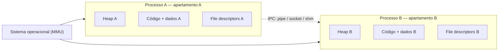
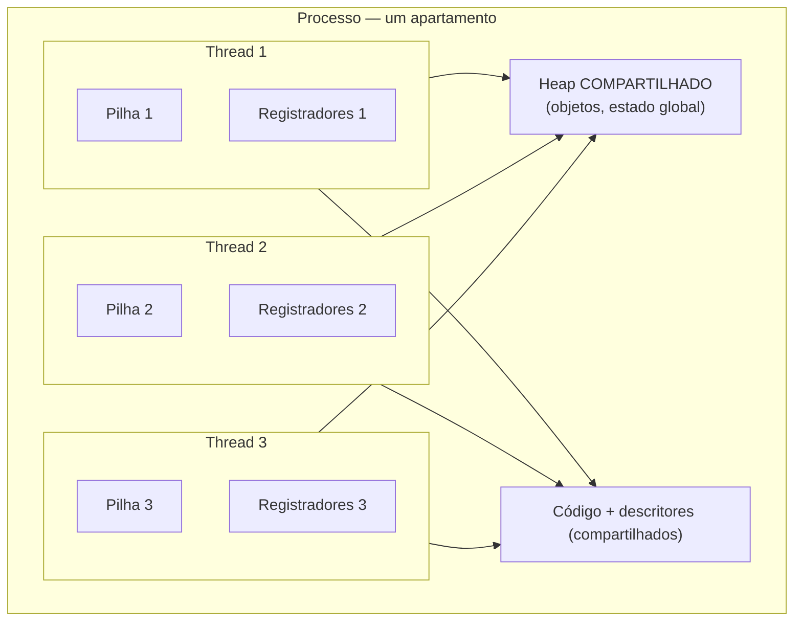
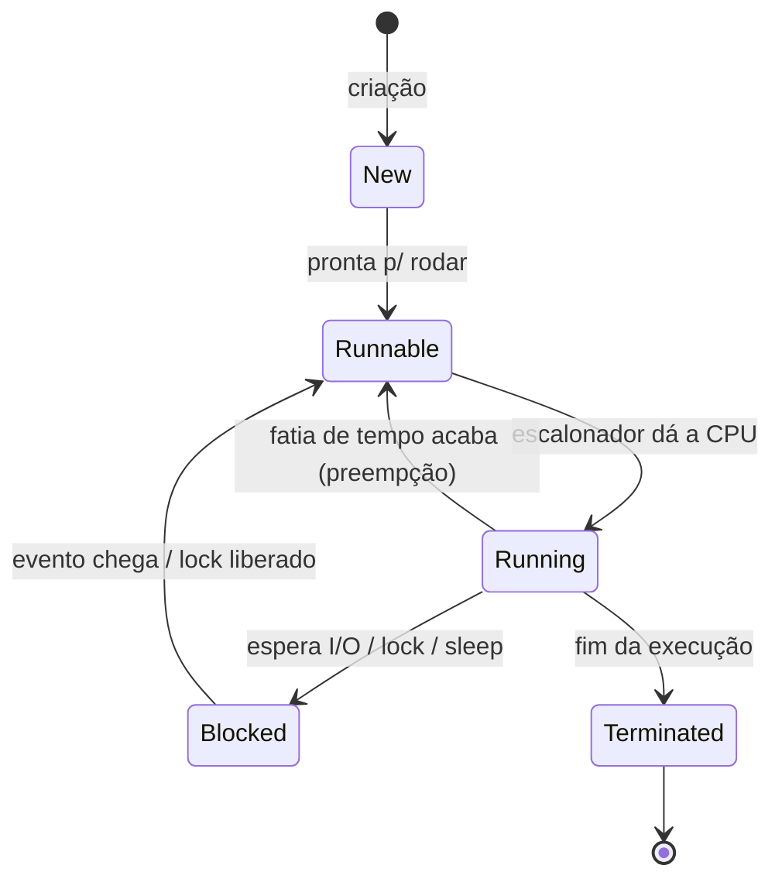
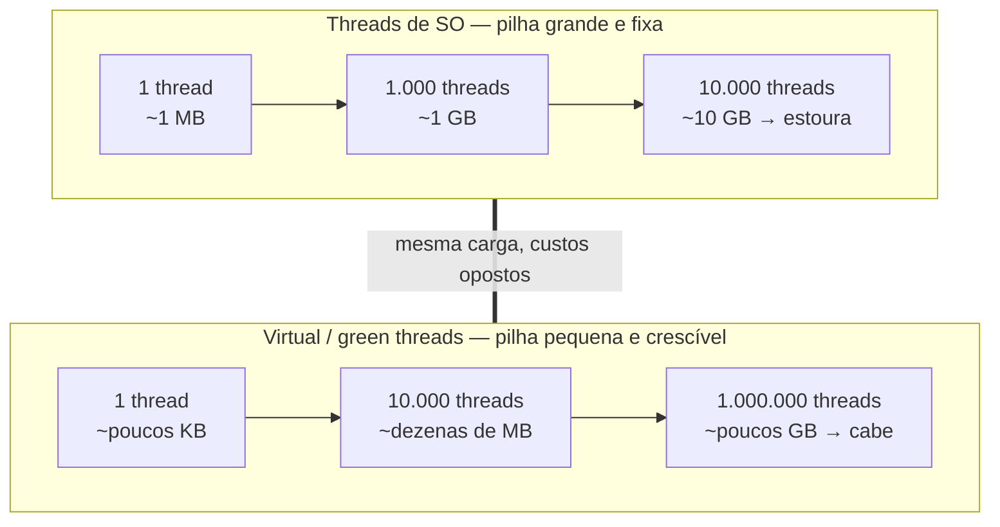
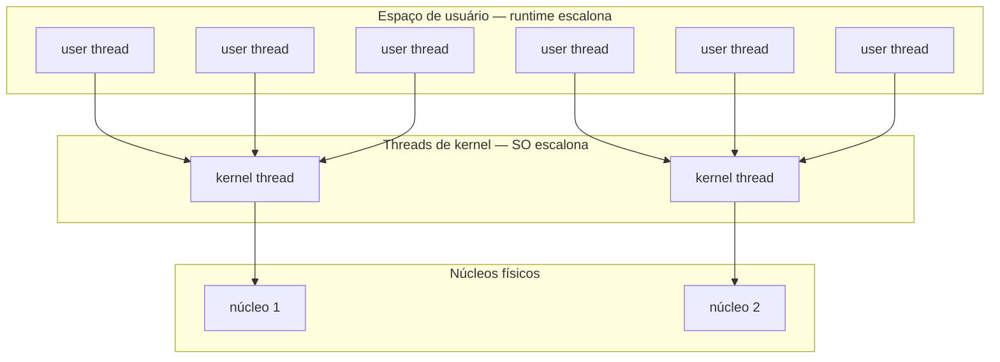
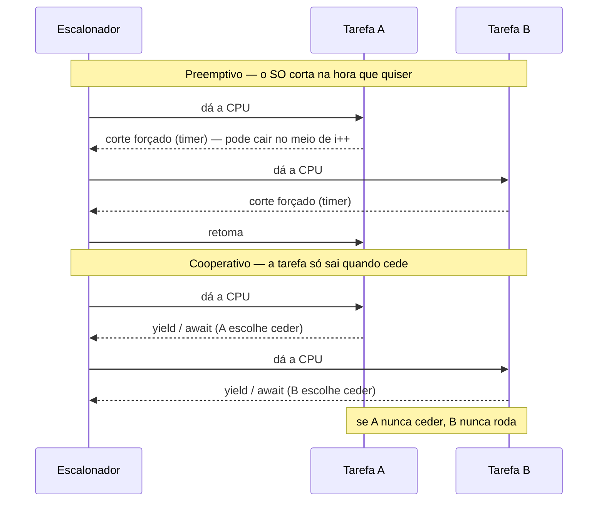

# Processos e threads

> [!abstract] Resumo em uma linha
> Um **processo** é um apartamento com paredes (memória isolada, protegida pelo SO); as **threads** são colegas de quarto dividindo a mesma geladeira (heap compartilhado) — leves e rápidas de criar, mas perigosas porque enxergam o mesmo estado.

Em [[01 - Concorrência e paralelismo - o que é e por que é difícil]] vimos *por que* concorrência é difícil. Aqui vemos *com o quê* o sistema operacional faz concorrência acontecer: as duas unidades de execução que todo runtime, toda linguagem e toda entrevista assumem como ponto de partida.

A pergunta-mãe é simples: **quem compartilha memória com quem?** Tudo o mais — custo, segurança, velocidade, perigo — deriva dessa resposta.

## Processo: um apartamento com paredes

Um **processo** é uma instância de um programa em execução. Quando você dá `python script.py`, o SO cria um processo: aloca um **espaço de endereçamento** próprio, abre uma tabela de descritores de arquivo (`stdin`, `stdout`, sockets), carrega o código e começa a executar.

A palavra-chave é **isolamento**. Cada processo enxerga sua própria memória virtual e *só* a sua. O processo A não consegue ler nem corromper a memória do processo B — o SO, com ajuda da MMU (unidade de gerência de memória), garante essa parede. Se o A tentar acessar um endereço que não é seu, leva um *segfault* e morre. O B nem fica sabendo.

> [!note] Por que isso é ótimo
> Isolamento é segurança e robustez de graça. Um navegador moderno roda cada aba num processo separado justamente por isso: se uma aba travar ou for comprometida, ela cai sozinha — as outras seguem vivas. "Crashar um processo não derruba os irmãos."

O preço do isolamento aparece quando dois processos *precisam* conversar. Como eles não compartilham memória, a comunicação tem que ser **explícita** via mecanismos de IPC (*Inter-Process Communication*): pipes, sockets, filas de mensagens ou memória compartilhada negociada com o SO. Tudo isso custa: há cópia de dados, chamadas de sistema, serialização. Conversa entre apartamentos exige sair no corredor e bater na porta do vizinho — não dá pra simplesmente esticar o braço.

Leitura do diagrama: cada processo tem heap, código e descritores próprios, todos isolados pela parede que o SO impõe. A única ponte entre eles é o canal pontilhado de IPC — caro e explícito. Não existe seta direta de memória entre A e B.

## Thread: colegas dividindo a geladeira

Uma **thread** é um fluxo de execução *dentro* de um processo. Um processo nasce com pelo menos uma thread (a "main"); ele pode criar mais. E aqui está a virada: **threads do mesmo processo compartilham o espaço de endereçamento** — o mesmo heap, o mesmo código, os mesmos descritores de arquivo.

O que cada thread tem de seu é o mínimo: sua própria **pilha** (*stack*, onde vivem as variáveis locais e o encadeamento de chamadas) e seus próprios **registradores** (incluindo o contador de programa, que diz qual instrução vem a seguir). O resto é coletivo.

Leitura do diagrama: dentro de um único processo, três threads. Cada uma tem pilha e registradores privados (a caixa interna), mas todas apontam para o *mesmo* heap e o *mesmo* código. É essa convergência de setas no heap compartilhado que torna threads leves — e que é a fonte de todo o perigo.

> [!warning] A geladeira compartilhada
> Como as threads enxergam o mesmo heap, duas delas podem ler e escrever o *mesmo* objeto ao mesmo tempo, sem coordenação. É exatamente daí que nascem as condições de corrida — assunto inteiro de [[03 - Estado compartilhado e race conditions]]. A leveza da thread e o perigo da thread são a *mesma* propriedade vista de dois ângulos: compartilhar memória.

Repare também numa assimetria importante: como as threads dividem o processo, **crashar uma thread (de forma não tratada) pode derrubar o processo inteiro** — e com ele todas as outras threads. Uma exceção fatal num colega de quarto incendeia o apartamento. Não há parede interna para conter o estrago.

## Processo × thread: a tabela de trade-offs

Leitura do diagrama: a coluna da esquerda e a da direita são imagens espelhadas. Cada vantagem de um lado é a desvantagem do outro. Processo troca leveza por segurança; thread troca segurança por leveza. Não existe "melhor" — existe o que o problema pede.

| Dimensão | Processo | Thread |
|---|---|---|
| Espaço de endereçamento | Próprio, isolado | Compartilhado com as irmãs |
| O que é privado | Tudo | Só pilha + registradores |
| Custo de criação | Alto | Baixo |
| Comunicação | IPC explícita (cara) | Memória direta (barata, perigosa) |
| Falha isolada | Sim — irmãos sobrevivem | Não — pode derrubar o processo |
| Risco de corrida | Baixo (sem memória comum) | Alto (heap comum) |

> [!tip] Regra de bolso
> Precisa de **isolamento e robustez** (tarefas que não confiam umas nas outras, ou paralelismo pesado de CPU contornando travas globais)? Pense em **processos**. Precisa de **leveza e troca rápida de dados** (muitas tarefas cooperando sobre o mesmo estado)? Pense em **threads** — e prepare a sincronização.

## Troca de contexto: o pedágio invisível

Há mais threads e processos prontos para rodar do que núcleos de CPU. Então o SO faz **rodízio**: dá a CPU a uma unidade por uma fração de tempo, depois a entrega a outra. A operação de salvar o estado de quem sai e restaurar o estado de quem entra é a **troca de contexto** (*context switch*).

E ela não é grátis. Trocar de contexto exige salvar registradores e o contador de programa, atualizar estruturas do escalonador e — o ponto caro — mexer na hierarquia de memória.

> [!info] Por que trocar de *processo* custa mais que trocar de *thread*
> Quando o SO troca entre duas **threads do mesmo processo**, o espaço de endereçamento não muda — a TLB (cache de tradução de endereços virtuais para físicos) continua válida. Quando troca entre dois **processos**, o espaço de endereçamento muda, e a TLB precisa ser invalidada. Reconstruir a TLB depois custa caro em *misses* de memória. É por isso que threads são, em geral, mais leves de alternar — e por que criar milhares de threads de SO mata o desempenho em pura troca de contexto. ([fonte](https://www.sobyte.net/post/2022-06/ctx-switch/))

Leitura do diagrama: o ciclo de vida de uma thread. Note que só uma thread por núcleo está em *Running* a cada instante; as demais ficam em *Runnable* esperando a vez, ou em *Blocked* esperando um evento externo. Cada seta que sai de *Running* é uma troca de contexto — e cada troca paga o pedágio descrito acima. A transição *Running → Blocked* é a mais valiosa: enquanto uma thread espera I/O, o SO entrega a CPU a outra (a base do paralelismo de I/O em [[14 - Loop de eventos e assincronia]]).

### Quanto custa, em números

"Caro" é abstrato; vale aterrar em ordens de grandeza. O **custo direto** de uma troca de contexto — salvar registradores, rodar o escalonador, restaurar o próximo — fica na casa de **1 a 5 microsegundos** em hardware moderno (medições controladas reportam ~1,2–1,5 µs com a thread fixada num núcleo, e ~2,2 µs quando há migração entre núcleos). Parece desprezível, e isoladamente é.

O que machuca é o **custo indireto**: depois da troca, a thread que retoma encontra as caches frias. As linhas de cache L1/L2 e as entradas da TLB que ela tinha aquecido foram despejadas pelo colega que rodou no intervalo. Reaquecer tudo isso — os *misses* subsequentes — pode custar de dezenas a centenas de microsegundos, muito mais que o custo direto. É o que se chama *cache pollution*: a troca em si é rápida; a ressaca dela é cara.

E é aqui que a distinção thread/processo do começo da nota volta com número. Trocar entre duas **threads do mesmo processo** preserva o espaço de endereçamento: o ponteiro da tabela de páginas não muda e a TLB sobrevive. Trocar entre dois **processos** troca o espaço de endereçamento — o ponteiro muda e a TLB é invalidada, condenando a próxima rajada de acessos a *misses* de tradução, cada um custando centenas de ciclos. Por isso a regra empírica: *trocar de thread é mais barato que trocar de processo*, e a diferença mora quase toda no custo indireto da TLB fria, não no direto.

> [!warning] O teto de threads úteis
> Junte as duas coisas e aparece um teto. Cada thread *ativa* a mais aumenta a frequência de trocas e a competição por cache. Passado o número de núcleos disponíveis, adicionar threads **não** adiciona trabalho útil — adiciona pedágio. Milhares de threads prontas para rodar fazem o escalonador gastar uma fatia crescente do tempo só alternando entre elas, com caches perpetuamente frias. O sistema fica ocupado *trocando de contexto* em vez de *computando*. Esse teto é o motivo de existirem thread pools e, mais fundo, todo o I/O assíncrono. ([fonte](https://eli.thegreenplace.net/2018/measuring-context-switching-and-memory-overheads-for-linux-threads/))

## O problema C10K: por que "uma thread por conexão" quebra

Em 1999, Dan Kegel cunhou o **problema C10K**: como fazer *um* servidor atender **10 mil conexões simultâneas**? Na virada dos anos 2000, a internet crescia e o modelo dominante era o mais intuitivo possível — **uma thread (ou processo) de SO por conexão**. Bloqueia lendo o socket, acorda quando chega dado, responde. Simples de escrever, simples de raciocinar.

O modelo desmorona em escala por dois custos que já vimos, agora multiplicados por dez mil:

- **Memória.** Cada thread reserva uma pilha. Com pilhas de 1–2 MB (o default da época, ainda comum), 10 mil threads pedem **10–20 GB** só de pilha, antes de uma única linha de dado de aplicação. Em máquinas de 32 bits, o espaço virtual de ~1 GB estourava por volta de **algumas centenas** de threads.
- **Troca de contexto.** Dez mil threads quase todas bloqueadas em I/O, mas prontas a acordar a qualquer notificação, afogam o escalonador. O kernel passa a gastar o tempo alternando entre elas — exatamente o teto da seção anterior.

Repare na ironia: as 10 mil threads passam **a maior parte do tempo paradas**, esperando o próximo pacote chegar. Você não precisa de 10 mil *executores* — precisa de capacidade para *aguardar* 10 mil esperas ao mesmo tempo. O modelo thread-por-conexão paga o preço de um executor caro (pilha + presença no escalonador) para cada um desses aguardos, a maioria dos quais nunca está fazendo trabalho de CPU. O dinheiro vai todo para *poder esperar*, não para computar. Essa é a observação que o I/O assíncrono explora: separe o *aguardar* (barato, uma estrutura de dados no event loop) do *executar* (caro, uma thread de verdade).

> [!info] A bifurcação que o C10K abriu
> A saída foi parar de amarrar uma thread de SO a cada conexão. Em vez disso: **um punhado de threads** (idealmente uma por núcleo) com sockets **não-bloqueantes**, registrados num multiplexador de eventos (`epoll` no Linux, `kqueue` no BSD), girando num **loop de eventos**. Uma thread monitora milhares de conexões e só toca naquelas que têm dado pronto. Foi assim que nginx, Node.js e companhia atravessaram o C10K — o assunto inteiro de [[14 - Loop de eventos e assincronia]]. Anos depois, as **virtual threads** (Loom) e as **goroutines** trouxeram de volta o modelo simples "uma thread por requisição", agora barato, multiplexando milhões de threads leves sobre poucas de kernel. ([fonte](https://kegel.com/c10k.html))

### O custo de pilha, visto escalando

A âncora física do C10K é a memória de pilha. Cada thread de SO precisa de uma pilha contígua reservada — não é o uso real no momento, mas a reserva máxima que a thread *pode* atingir sem estourar. O diagrama abaixo mostra por que esse número, multiplicado, vira uma parede.

Leitura do diagrama: na linha de cima, threads de SO com pilha fixa de ~1 MB; a memória cresce linearmente até estourar a RAM lá pelas dezenas de milhares. Na linha de baixo, virtual/green threads começam com pilhas de poucos KB que **crescem sob demanda** e vivem no heap (não como reserva contígua do SO) — por isso um milhão delas ainda cabe. A diferença não é de grau, é de modelo: a pilha pequena e crescível é o que destrava a escala que o C10K exigia.

## Threads de kernel × de usuário, e o modelo M:N

Até aqui falamos de threads como se fossem todas iguais. Não são. Há duas formas de implementá-las.

**Threads de kernel** são conhecidas e escalonadas pelo próprio SO. Cada uma é uma entidade que o kernel vê e gerencia. Quando seu código pede "crie uma thread" na maioria das linguagens modernas, o que você ganha é o modelo **1:1** — uma thread da linguagem para uma thread do kernel. Vantagem: paralelismo real em múltiplos núcleos e bloqueio honesto (uma thread bloqueada não trava as outras). Custo: são pesadas — pilha de megabytes, criação cara, troca de contexto via kernel.

**Threads de usuário** (ou *green threads*) são uma abstração de software gerenciada pelo **runtime da linguagem ou VM**, e o kernel nem sabe que existem. O runtime as escalona dentro de uma ou poucas threads de kernel. Vantagem: criação e troca baratíssimas (sem ida ao kernel), milhões delas cabem na RAM. Desvantagem clássica: se uma thread de usuário faz uma chamada bloqueante "burra", ela trava a thread de kernel que a hospeda — e todas as irmãs junto.

O **modelo M:N** é a síntese: mapeia **M** threads de usuário sobre **N** threads de kernel (com M ≫ N). O runtime equilibra os dois mundos — leveza das threads de usuário, paralelismo real das de kernel. É elegante, mas notoriamente complicado: exige cooperação fina entre runtime e kernel, e historicamente foi *abandonado* em sistemas como Solaris e FreeBSD por não compensar a complexidade frente ao 1:1. ([fonte](https://en.wikipedia.org/wiki/Thread_(computing)))

Leitura do diagrama: três camadas. Em cima, muitas threads de usuário, leves, escalonadas pelo runtime. No meio, poucas threads de kernel, escalonadas pelo SO. Embaixo, os núcleos físicos. O afunilamento de seis para duas para dois é o coração do M:N: muitas tarefas lógicas, poucas amarras reais com o hardware.

## Virtual threads e fibers: "uma thread por requisição" de volta ao jogo

A reencarnação moderna das green threads são as **virtual threads** (Java, via projeto Loom) e os **fibers** de outras plataformas: threads leves gerenciadas pelo runtime, baratas o bastante para você criar milhões delas sem medo.

Por que isso importa? Por décadas, o modelo mais simples de programar — **uma thread por requisição** — esbarrava no custo das threads de kernel: alguns milhares e o servidor afogava em troca de contexto. As virtual threads destravam esse modelo: você escreve código bloqueante, sequencial, legível, e o runtime cuida de multiplexar milhões de threads virtuais sobre um punhado de threads de kernel. Os detalhes no galho [[03-Dominios/Tecnologia/Java/Concorrência e paralelismo/index|Concorrência (Java)]].

> [!example] Outra rota para o mesmo destino
> As **goroutines** de Go são parentes próximas — threads de usuário leves sobre um runtime M:N — mas escolhem comunicar por **troca de mensagens** em vez de memória compartilhada. Essa filosofia ("não comunique compartilhando memória; compartilhe memória comunicando") é o tema de [[12 - Troca de mensagens e CSP]].

## Thread pools: amortizar o custo de criar

Se threads de SO são caras de criar *e* há um teto de quantas valem a pena rodar, a resposta clássica — anterior às virtual threads — é o **pool de threads** (*thread pool*): em vez de criar uma thread por tarefa e destruí-la ao fim, você mantém um conjunto **fixo** de threads vivas e as alimenta com uma **fila de tarefas**. Cada thread pega a próxima tarefa, executa, e volta para a fila pedir mais.

O ganho é duplo. **Amortiza a criação**: o custo de nascer uma thread é pago uma vez, no arranque, não a cada requisição. E **impõe o teto de propósito**: o pool limita quantas threads disputam a CPU, evitando o afogamento em troca de contexto da seção do C10K. A fila vira o regulador — picos de carga viram espera, não milhares de threads novas.

A pergunta prática é o **tamanho do pool**, e ela depende do tipo de carga:

- **CPU-bound** (cálculo puro, pouca espera): o teto útil é o número de **núcleos**. Mais threads que núcleos só adicionam troca de contexto sem adicionar trabalho. A receita usual é `núcleos` ou `núcleos + 1` (o `+1` cobre faltas de página ocasionais).
- **I/O-bound** (a thread passa a maior parte do tempo esperando rede/disco): vale ter **muito mais threads que núcleos**, porque cada thread fica bloqueada boa parte do tempo, liberando a CPU para as outras. A heurística é `núcleos × (1 + tempo_de_espera / tempo_de_CPU)` — o termo `tempo_de_espera / tempo_de_CPU` (o *coeficiente de bloqueio*) diz quantas threads cabem por núcleo antes de saturá-lo. ([fonte](https://engineering.zalando.com/posts/2019/04/how-to-set-an-ideal-thread-pool-size.html))

> [!tip] A Lei de Little, em uma linha
> Para dimensionar pela vazão desejada, a **Lei de Little** dá o atalho: `L = λ × W` — o número de tarefas simultâneas no sistema (`L`, ~o tamanho de pool necessário) é a taxa de chegada (`λ`, req/s) vezes o tempo de serviço de cada uma (`W`, s). Querendo atender 1.000 req/s com 50 ms cada, você precisa de ~50 tarefas em voo ao mesmo tempo. Os detalhes de implementação (executors, filas limitadas, políticas de rejeição) vivem em [[17 - Padrões de concorrência]] e, com código, no galho [[03-Dominios/Tecnologia/Java/Concorrência e paralelismo/index|Concorrência (Java)]].

Duas armadilhas clássicas de dimensionamento, que entrevistas adoram. Um pool **pequeno demais** vira gargalo: tarefas se enfileiram, a latência dispara, e no pior caso surge *deadlock de pool* — uma tarefa no pool espera o resultado de outra tarefa que precisa entrar no mesmo pool, mas não há thread livre para ela rodar. Um pool **grande demais** desperdiça memória (cada thread, sua pilha) e reabre o afogamento em troca de contexto que o pool deveria conter. O número certo não é "o maior possível"; é o menor que satura o recurso de verdade.

As virtual threads não aposentam o pool — mudam a conta. Quando cada thread é baratíssima, o gargalo deixa de ser "quantas threads aguento" e volta a ser o recurso real lá embaixo (conexões de banco, vazão da API externa), que continua querendo um limite. O *pooling* migra da thread para o recurso escasso.

## Escalonamento: quem decide quando trocar?

Uma última peça. Quem aperta o botão da troca de contexto? Há duas filosofias.

No escalonamento **preemptivo**, o SO (ou o runtime) *interrompe* a unidade em execução à força — tipicamente por um temporizador — e dá a vez a outra. Ninguém precisa "ser educado": mesmo uma thread em laço infinito acaba cedendo a CPU. É o que SOs modernos fazem com threads de kernel.

No escalonamento **cooperativo**, a unidade só perde a CPU quando *ela mesma* cede — chamando algo como `yield` ou ao bloquear em I/O. É mais simples e barato, mas frágil: uma única unidade mal-comportada que nunca cede pode congelar todas as outras. Muitos sistemas de green threads e loops de eventos começam cooperativos.

A troca tem consequência direta na *segurança* do código. No preemptivo, o SO pode te interromper **a qualquer instrução** — inclusive no meio de um `i++`, que não é atômico. Isso é o que **garante progresso** (ninguém monopoliza a CPU) mas é também o que **habilita race conditions em qualquer ponto**: você nunca sabe onde a interrupção cai, então precisa proteger todo estado compartilhado com locks ([[03 - Estado compartilhado e race conditions]]). No cooperativo é o oposto: entre dois pontos de cessão (`yield`/`await`), o código roda **sem ser interrompido**. Isso simplifica o raciocínio — trechos sem `await` são naturalmente atômicos — em troca da fragilidade: uma tarefa que entra em laço sem ceder trava o agendador inteiro.

Leitura do diagrama: na metade de cima (preemptivo), as setas de volta ao escalonador são *cortes forçados* por temporizador — A e B perdem a CPU sem pedir, em pontos imprevisíveis. Na metade de baixo (cooperativo), a tarefa só devolve a CPU num ponto de cessão explícito (`yield`/`await`); o último bilhete avisa o risco: se A nunca ceder, B morre de fome.

> [!example] Onde goroutines e async se encaixam
> O **async/await** (JS, Python, Rust) é cooperativo no fundo: o `await` é o ponto em que a tarefa cede ao loop de eventos ([[14 - Loop de eventos e assincronia]]). Daí o aviso clássico "não bloqueie o event loop" — um cálculo pesado sem `await` é a tarefa que não cede. As **goroutines** de Go começaram cooperativas (cediam em chamadas de função e I/O) mas o runtime ganhou **preempção assíncrona** (Go 1.14, 2020): hoje o agendador pode interromper uma goroutine em laço apertado, fechando justamente o buraco da inanição cooperativa. É um híbrido — leveza cooperativa com a rede de segurança preemptiva.

> [!note] Onde isso vive
> Os detalhes finos de algoritmos de escalonamento (filas, prioridades, *time slices*) são domínio do sistema operacional — um galho futuro deste grimório. Para concorrência, basta reter: **preemptivo = o sistema te interrompe; cooperativo = você cede a vez**. Loops de eventos ([[14 - Loop de eventos e assincronia]]) são o caso cooperativo mais comum no dia a dia de quem escreve aplicações.

## Em entrevista

A process has its **own isolated address space**, protected by the OS, while threads within a process **share the same heap and code** — only the stack and registers are per-thread. That sharing is why threads are lightweight but dangerous: shared mutable state leads to race conditions. **Context switching between threads is cheaper than between processes** because the address space does not change, so the TLB stays valid; switching processes forces a TLB flush. The default model in most languages is **1:1** (one language thread per kernel thread), giving true parallelism at a higher cost. **Green threads / virtual threads** are user-space threads scheduled by the runtime, cheap enough to spawn millions, multiplexed over few kernel threads in an **M:N** model — this is what makes "one thread per request" viable again. The reason it broke in the first place is the **C10K problem**: with a 1–2 MB stack per thread, 10,000 connections means tens of gigabytes just in stacks, plus a scheduler drowning in context switches — which is why the industry moved to event loops with non-blocking sockets. A **context switch** is cheap directly (roughly 1–5 microseconds) but expensive indirectly: the resuming thread hits cold caches and a cold TLB, so the real cost is the cache and TLB misses afterward — which is why thousands of runnable threads stop doing useful work past the core count. Before virtual threads, the standard answer was a **thread pool**: reuse a fixed set of threads and feed them a queue, sizing it to **roughly the core count for CPU-bound** work and **much higher for I/O-bound** work (cores times one-plus-wait-over-compute). Scheduling can be **preemptive** (the OS can interrupt you at any instruction, guaranteeing progress but enabling races everywhere) or **cooperative** (you yield voluntarily with `yield`/`await`, simpler to reason about but one task that never yields starves the rest). When asked "process or thread?", the honest answer is a trade-off: **isolation and robustness versus weight and shared-memory speed.**

### Vocabulário
- processo → process
- thread → thread
- espaço de endereçamento → address space
- troca de contexto → context switch
- thread de kernel → kernel thread
- thread de usuário → user thread
- thread verde → green thread
- escalonamento → scheduling
- escalonamento preemptivo → preemptive scheduling
- escalonamento cooperativo → cooperative scheduling
- memória compartilhada → shared memory
- pilha de thread → thread stack
- pool de threads → thread pool
- ceder a vez → to yield
- conexões simultâneas → concurrent connections

> [!info] Lastro
> - SoByte — *The cost of context switching* (TLB flush ao trocar de processo; threads do mesmo processo preservam a TLB): https://www.sobyte.net/post/2022-06/ctx-switch/
> - Wikipedia — *Thread (computing)* (green threads como threads de usuário em VM; modelo N:M / M:N; abandono em Solaris e FreeBSD frente ao 1:1): https://en.wikipedia.org/wiki/Thread_(computing)
> - GeeksforGeeks — *Difference between Thread Context Switch and Process Context Switch*: https://www.geeksforgeeks.org/difference-between-thread-context-switch-and-process-context-switch/
> - Dan Kegel — *The C10K problem* (origem 1999; 10 mil conexões; pilha de 2 MB estoura VM de 1 GB por volta de 512 threads; saída via sockets não-bloqueantes + event loop): https://kegel.com/c10k.html
> - Eli Bendersky — *Measuring context switching and memory overheads for Linux threads* (custo direto ~1,2–2,2 µs; custo indireto de cache/TLB frios; memória por thread): https://eli.thegreenplace.net/2018/measuring-context-switching-and-memory-overheads-for-linux-threads/
> - Zalando Engineering — *How to set an ideal thread pool size* (CPU-bound ~núcleos; I/O-bound núcleos × (1 + espera/CPU); Lei de Little): https://engineering.zalando.com/posts/2019/04/how-to-set-an-ideal-thread-pool-size.html

## Veja também
- [[01 - Concorrência e paralelismo - o que é e por que é difícil]] — o porquê do problema que processos e threads tentam resolver
- [[03 - Estado compartilhado e race conditions]] — o preço do heap compartilhado entre threads
- [[12 - Troca de mensagens e CSP]] — a alternativa: comunicar em vez de compartilhar (goroutines)
- [[14 - Loop de eventos e assincronia]] — concorrência sem multiplicar threads de SO
- [[18 - Concorrência em entrevista]] — perguntas e armadilhas recorrentes
- [[03-Dominios/Ciência/Concorrência e Paralelismo/index|Concorrência e Paralelismo]] — índice do galho
