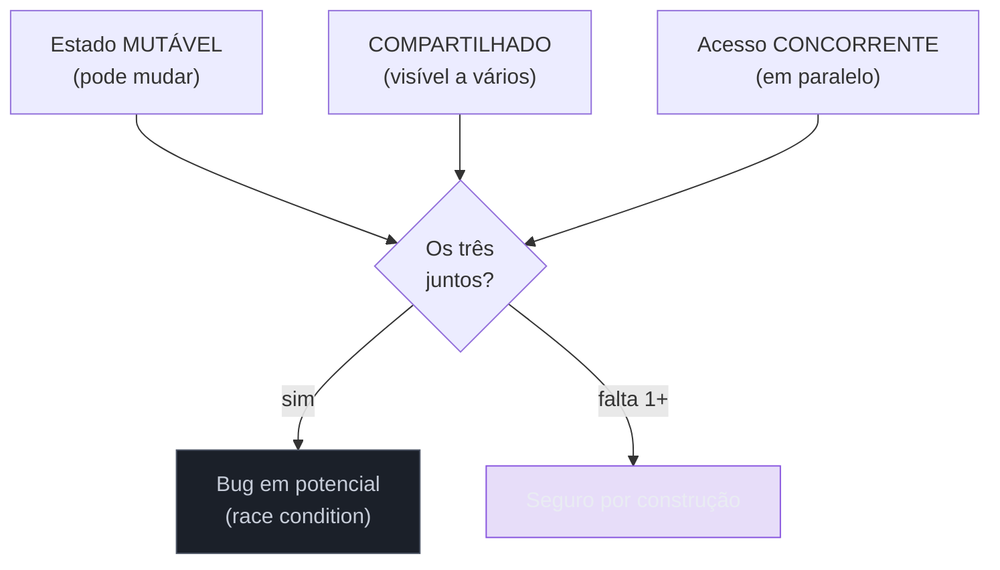
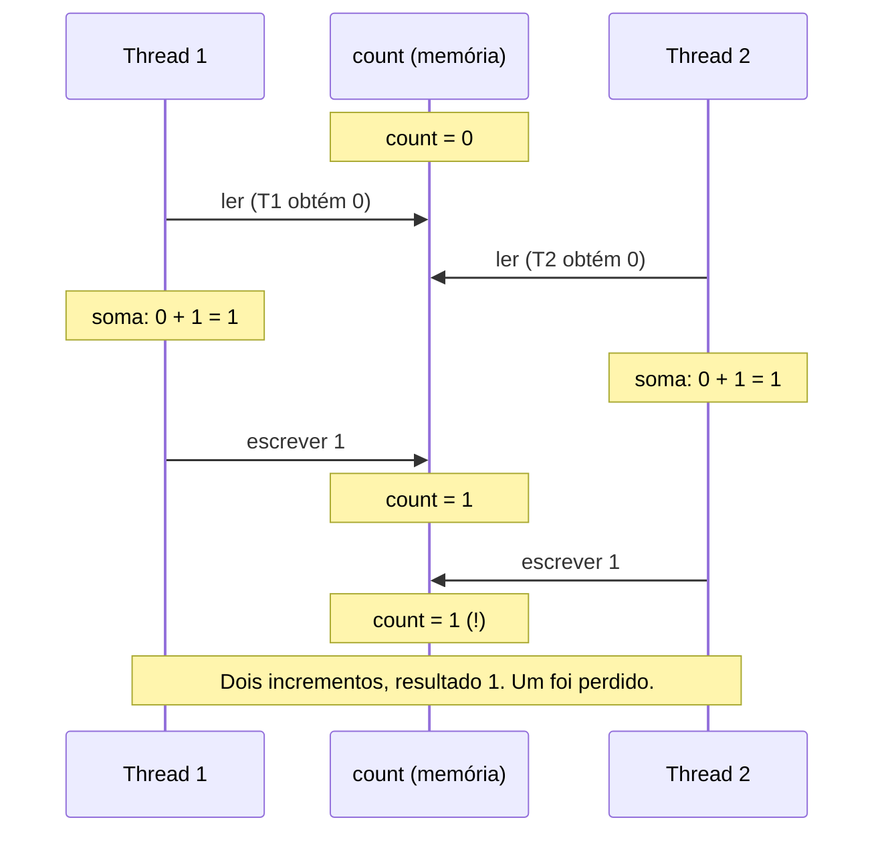
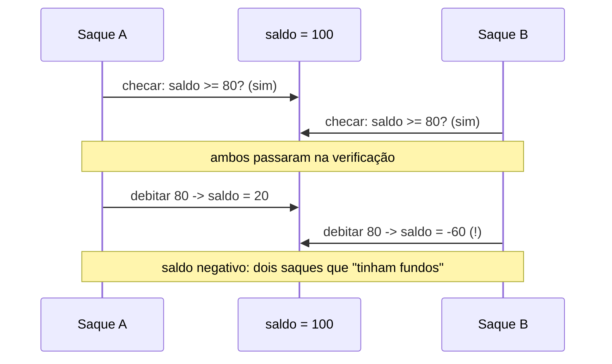
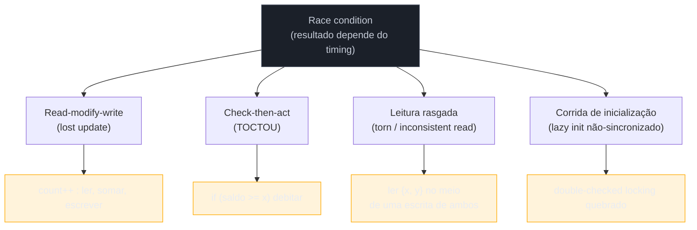
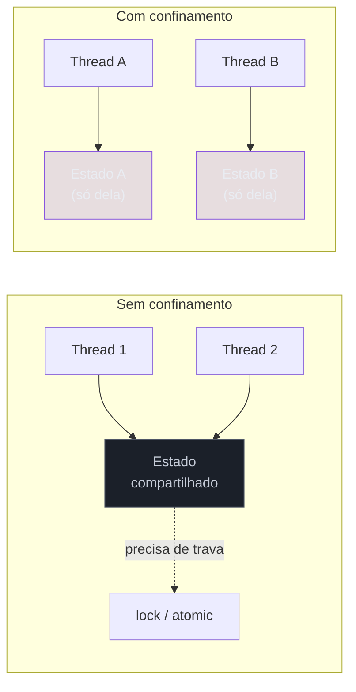
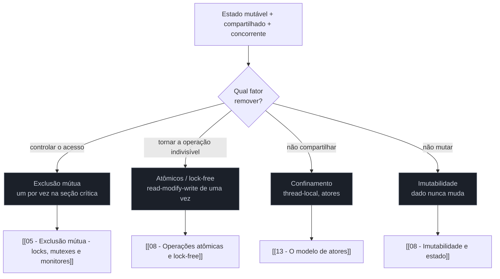

# Estado compartilhado e race conditions

> [!abstract] Resumo em uma linha
> A raiz de quase todo bug de concorrência é uma equação de três fatores — estado mutável, compartilhado e acessado em paralelo —, e cada modelo de concorrência é, no fundo, uma forma diferente de remover um desses três.

Dois caixas de banco, lado a lado, atualizam o mesmo saldo. Nenhum dos dois conversa com o outro. Cada um lê o saldo no caderno, faz a conta de cabeça, e escreve o resultado. Se os dois lerem "100" ao mesmo tempo e cada um somar 50, o caderno vai terminar com "150" — não com "200". Um depósito sumiu. Ninguém errou a aritmética. O bug está no *encontro*.

Essa é a história inteira deste galho. Antes de falar de locks, atômicos ou atores, precisamos entender com clareza o inimigo que todos eles combatem. Se você entender bem a equação a seguir, cada solução do galho vai parecer óbvia depois.

## A equação do problema

Um bug de concorrência por estado compartilhado precisa de três ingredientes simultâneos. Tire qualquer um e o problema desaparece.



Leitura do diagrama: os três fatores entram juntos no losango. Só quando os três coexistem há perigo. Remova um único deles e você cai no ramo verde — seguro, sem precisar de nenhuma trava.

E como se remove cada fator?

- **Mutável → imutável.** Se o dado nunca muda depois de criado, não há "antes" e "depois" para disputar. Ler é sempre seguro. É a tese de `[[08 - Imutabilidade e estado]]`.
- **Compartilhado → confinado.** Se cada thread tem a sua própria cópia (thread-local) ou se o estado vive dentro de um único dono que ninguém mais toca, não há disputa. É a aposta dos atores em `[[13 - O modelo de atores]]`.
- **Concorrente → serial.** Se as operações nunca rodam ao mesmo tempo (uma fila, um único thread de evento), a ordem é determinística. Mas aí abrimos mão da concorrência que queríamos — ver `[[01 - Concorrência e paralelismo - o que é e por que é difícil]]`.

> [!tip] A pergunta de diagnóstico
> Diante de um bug intermitente, não pergunte "onde está o lock?". Pergunte: *qual dos três fatores eu posso remover aqui?* Quase sempre a melhor correção não é adicionar uma trava — é eliminar o compartilhamento ou a mutabilidade.

## Race condition: quando o resultado depende do timing

Uma **race condition** (condição de corrida) é um defeito em que o resultado do programa depende da *ordem ou do timing* de operações concorrentes — e esse timing é não-determinístico, decidido pelo escalonador do sistema operacional, não por você ([Wikipedia](https://en.wikipedia.org/wiki/Race_condition)). O mesmo código pode passar mil vezes e falhar na próxima, porque a próxima foi a vez em que duas threads se cruzaram no ponto errado.

O exemplo canônico, aquele que aparece em toda entrevista, é o contador.

```java
int count = 0;

void incrementar() {
    count++;   // parece UMA operação...
}
```

> [!warning] `count++` mente para você
> Aquele `++` parece um gesto único e indivisível. Não é. O processador o executa em **três** passos: **ler** o valor da memória, **somar** um num registrador, **escrever** o resultado de volta. É o padrão *read-modify-write* (leitura-modificação-escrita). E entre esses três passos, outra thread pode se intrometer.

Por que a ilusão é tão forte? Porque a linguagem de alto nível nos treina a ler uma linha de código como uma ação. Mas *uma linha de fonte não é uma operação de máquina*. Compile aquele `count++` e ele vira, conceitualmente, três instruções:

```text
load   count -> registrador   ; ler da memoria
add    registrador, 1         ; somar no registrador
store  registrador -> count   ; escrever de volta
```

A sintaxe esconde a costura. Onde você vê um átomo, o hardware vê uma sequência — e toda sequência tem *frestas* entre as instruções por onde outra thread se enfia. A atomicidade da sintaxe é uma miragem: o `++`, o `+=`, o `i = i + 1` são todos o mesmo trio disfarçado de gesto único. A pegadinha vale para qualquer ISA; os nomes das instruções mudam, a fresta não.

Vamos ver duas threads incrementando um contador que vale 0, esperando chegar a 2.



Leitura do diagrama: ambas as threads leram o valor 0 *antes* de qualquer uma escrever. Cada uma calculou 1 sobre uma leitura já obsoleta. A segunda escrita simplesmente sobrescreve a primeira. Os dois incrementos colidiram e um sumiu — o clássico **lost update** ([thecoder.cafe](https://read.thecoder.cafe/p/data-race-vs-race-condition)). Note que se as três operações de T1 tivessem rodado *antes* das três de T2, o resultado seria 2, correto. O bug não está nas instruções; está na *intercalação*.

É por isso que race conditions são tão traiçoeiras: elas não são erros de lógica que você lê no código. São janelas de tempo. E a janela só se abre quando o escalonador, o número de núcleos e a carga conspiram.

## Operação atômica × operação composta

O que faltou ao `count++`? **Atomicidade.** Uma operação é atômica quando é *indivisível*: ou acontece inteira, ou não acontece — nunca pela metade, e nenhuma outra thread consegue observar um estado intermediário.

`count++` é uma operação *composta*: três operações atômicas (ler, somar, escrever) costuradas. Cada uma é atômica isoladamente, mas a *sequência* não é. A janela de perigo é exatamente o intervalo entre elas.

A correção não é "fazer mais rápido" nem "rezar". É tornar os três passos uma unidade indivisível — seja com uma trava em volta deles, seja com uma instrução de hardware que faça read-modify-write de uma vez (como `compare-and-swap`). Esse é o tema de `[[04 - Atomicidade, visibilidade e ordenação]]` e a base das soluções lock-free de `[[08 - Operações atômicas e lock-free]]`.

> [!info] Atomicidade não é só sobre contadores
> Qualquer "ler-decidir-escrever" carrega o mesmo risco: ler um saldo, decidir se há fundos, debitar. Ler um arquivo de config, mesclar, salvar. Verificar se uma chave existe num mapa, e então inseri-la. Todo `if (não existe) { criar }` concorrente é um `count++` disfarçado.

### A armadilha da atomicidade composta

Há uma sutileza que pega gente experiente. Suponha que você troca seu mapa comum por um `ConcurrentHashMap` — uma estrutura cujas operações *individuais* são todas atômicas e thread-safe. Você se sente protegido. Então escreve:

```java
if (!map.containsKey(k)) {   // chamada 1: atômica
    map.put(k, v);           // chamada 2: atômica
}
```

Cada uma das duas chamadas é atômica. O *par* não é. Entre o `containsKey` e o `put`, outra thread pode inserir `k`. Você checou "não existe", e quando agiu, já existia — um check-then-act perfeito, montado a partir de duas operações impecavelmente atômicas. **Compor operações atômicas não produz uma operação atômica.** A atomicidade não se acumula; ela tem que ser projetada na operação composta inteira.

A correção é usar uma operação atômica *composta* que a própria estrutura oferece — uma que faça o "checar-e-inserir" de uma vez, sob a sua trava interna:

```java
map.putIfAbsent(k, v);   // checagem e inserção: uma operação indivisível
```

A lição é geral e cara: thread-safety das partes não compõe em thread-safety do todo. Quando precisar de "se-então" sobre estado compartilhado, procure a operação atômica composta certa (`putIfAbsent`, `compute`, `merge`, ou um `compareAndSet`) em vez de costurar chamadas atômicas à mão — o terreno de `[[08 - Operações atômicas e lock-free]]`.

## Data race × race condition: a pegadinha de entrevista

Aqui mora a confusão que separa quem decorou de quem entendeu. **Não são sinônimos.**

- **Data race (corrida de dados)** é um conceito do *modelo de memória*: dois ou mais acessos concorrentes à *mesma posição de memória*, ao menos um deles uma escrita, *sem sincronização* entre eles. É uma definição mecânica, quase sintática — você pode apontar para ela no código ([regehr.org](https://blog.regehr.org/archives/490)).
- **Race condition (condição de corrida)** é um *bug de lógica*: o resultado correto do programa depende de um timing que não está garantido. É uma propriedade do comportamento, não da memória.

Há sobreposição enorme — muitas race conditions *vêm* de data races, e muitas data races *causam* race conditions. Mas a fronteira existe nos dois sentidos ([regehr.org](https://blog.regehr.org/archives/490)):

- **Race condition sem data race.** Imagine que todos os acessos à memória usam operações atômicas — não há data race nenhum. Ainda assim, se a *lógica* do programa depende de qual thread chegou primeiro (ex.: dois `compareAndSet` disputando, ou um TOCTOU feito de operações atômicas individuais), você tem race condition de timing sem nenhuma data race ([thecoder.cafe](https://read.thecoder.cafe/p/data-race-vs-race-condition)).
- **Data race sem race condition.** Dois threads escrevendo o mesmo valor numa flag, ou um benchmark que tolera leituras "sujas" — tecnicamente há data race (acesso não sincronizado), mas o comportamento observável pode ser aceitável. Perigoso, porque o compilador tem liberdade para reordenar/otimizar de formas surpreendentes, mas não é necessariamente um *bug de correção lógica*.

> [!example] Como responder em entrevista
> "Data race é uma noção do modelo de memória: acesso concorrente não-sincronizado à mesma posição, pelo menos uma escrita. Race condition é um defeito de comportamento dependente de timing. A maioria das races práticas é os dois ao mesmo tempo, mas você pode ter um sem o outro." Dizer isso já te coloca acima da média.

## TOCTOU: o intervalo entre checar e usar

Há uma família de race condition tão recorrente que ganhou nome próprio: **TOCTOU** — *time-of-check to time-of-use*, "do momento da verificação ao momento do uso". É um bug causado pela disputa entre *checar* o estado de algo e *agir* com base nessa checagem; entre os dois passos, o estado mudou ([Wikipedia](https://en.wikipedia.org/wiki/Time-of-check_to_time-of-use)).

Dois cozinheiros olham a geladeira: "tem uma cebola, ótimo". Os dois vão pegar. Um chega, usa a última cebola. O outro estende a mão para o nada. A checagem ("tem cebola?") foi verdadeira para ambos — mas só era válida no instante da olhada.

O caso clássico de software é o saque concorrente:



Leitura do diagrama: os dois saques verificaram o saldo *antes* de qualquer débito acontecer. A condição "tem fundos" foi verdadeira para ambos no instante da checagem — mas se tornou mentira no instante do uso. O resultado é um saldo negativo que a regra de negócio jurava ser impossível.

TOCTOU é a ponte entre concorrência e segurança. Atacantes exploram justamente essa janela: o programa checa uma permissão de arquivo, o atacante troca o arquivo por um link simbólico antes do uso, e o programa age com privilégios sobre o alvo errado ([Wikipedia](https://en.wikipedia.org/wiki/Time-of-check_to_time-of-use)). A correção é a mesma do contador: fundir checagem e ação numa operação atômica — debitar condicionalmente *de uma vez*, em vez de checar e depois debitar.

## A taxonomia das races

Read-modify-write e check-then-act (TOCTOU) são os dois rostos mais famosos da família, mas não são os únicos. Vale catalogar a fauna inteira, porque cada padrão tem uma assinatura própria — e reconhecer a assinatura num bug intermitente é metade da cura.



Leitura do diagrama: os quatro galhos descem de uma única raiz — "o resultado depende do timing". Read-modify-write e check-then-act já vimos em detalhe. Os dois novos abaixo completam a árvore: a leitura rasgada (observar um objeto pela metade) e a corrida de inicialização (criar algo "só uma vez" sem sincronizar de verdade).

### Leitura rasgada (torn read)

Imagine um objeto `Ponto` com dois campos, `x` e `y`, que devem permanecer coerentes — sempre o ponto de uma trajetória válida. Uma thread atualiza ambos: escreve `x`, depois escreve `y`. Outra thread lê os dois campos *entre* as duas escritas. Ela vê o `x` novo e o `y` velho — uma combinação que nunca existiu como estado real. O objeto foi observado *rasgado* ao meio ([Joe Duffy](https://joeduffyblog.com/2006/02/07/threadsafety-torn-reads-and-the-like/)).

```text
Thread escritora:   x = 10  ........  y = 20
Thread leitora:              le {x=10, y=0}   <- estado que nunca foi valido
```

O que dói na leitura rasgada é que ela viola um **invariante** que o resto do código assume sempre verdadeiro. Pense num retângulo cujos campos `largura` e `altura` nunca podem ser ambos zero, ou num intervalo `{inicio, fim}` em que `fim` deve ser maior que `inicio`. Quem lê no meio da atualização pode pegar uma combinação que a regra de negócio jura ser impossível — e então uma divisão estoura, ou um laço roda para trás. O bug não está na leitura nem na escrita isoladas; está em *quando* a leitura caiu.

Há ainda uma variante mais sutil, no nível do hardware: escrever um valor maior que a palavra nativa da máquina — um `long` de 64 bits numa plataforma de 32 bits — pode acontecer em duas metades, e um leitor concorrente pega uma metade nova com uma metade velha (*word tearing*). O invariante "os campos sempre combinam" falha porque eles foram, literalmente, costurados de partes diferentes ([cr.openjdk.org](https://cr.openjdk.org/~jrose/oblog/value-tearing.html)). A correção: tornar a leitura *e* a escrita do objeto inteiro atômicas (uma trava em volta do par, ou — mais elegante — trocar por um objeto imutável que se substitui de uma vez, em que não existe "meio da atualização" porque o objeto nasce pronto e a referência troca atomicamente).

### Corrida de inicialização

O padrão "crie isto só na primeira vez que precisar, e só uma vez" — *lazy initialization* (inicialização preguiçosa) — é um check-then-act disfarçado: "se ainda não existe, crie". Duas threads podem checar `instancia == null` ao mesmo tempo, ambas verem `null`, e ambas criarem o objeto. Em vez de um singleton, nascem dois.

A tentativa esperta de consertar isso barato é o **double-checked locking**: checar fora da trava, e só travar e checar de novo se parecer nulo. Por décadas isso foi escrito *errado* — sem `volatile` no campo. O problema não é só duas threads criando: é que uma thread pode publicar a *referência* do objeto antes de terminar de inicializá-lo, e outra thread enxergar um objeto **parcialmente construído** ([cs.umd.edu](https://www.cs.umd.edu/~pugh/java/memoryModel/DoubleCheckedLocking.html)). A reordenação que o compilador e o processador têm liberdade de fazer transforma "alocar, construir, atribuir" em "alocar, atribuir, construir" — e a janela entre os dois últimos passos é a corrida. A correção (em Java moderno) exige `volatile`, que proíbe essa reordenação e garante a publicação segura — o tema de visibilidade e ordenação de `[[04 - Atomicidade, visibilidade e ordenação]]`. Na prática, muita gente abandona o double-checked locking e usa o *holder estático* (initialization-on-demand holder), em que a própria semântica de carregamento de classe da plataforma garante a inicialização única e segura sem nenhuma trava explícita — outra vitória do "a melhor trava é não precisar de trava".

| Padrão | Forma | O que dá errado | Correção típica |
|---|---|---|---|
| Read-modify-write | ler, modificar, escrever | dois leem o mesmo valor velho; uma escrita some (lost update) | atômico (CAS) ou trava |
| Check-then-act (TOCTOU) | checar, depois agir | estado muda entre a checagem e o uso | fundir checagem e ação numa operação |
| Leitura rasgada (torn read) | ler vários campos no meio de uma escrita | observa metade novo, metade velho | ler/escrever o objeto inteiro de forma atômica; imutabilidade |
| Corrida de inicialização | criar "só uma vez" sem sincronizar | dois objetos, ou um objeto meio-construído publicado | `volatile` + double-checked locking correto; holder estático |

## A mesma família das anomalias de banco

Aqui vale parar e amarrar um insight que separa quem viu concorrência só em threads de quem enxerga o padrão. **Anomalia de banco de dados e race condition são o mesmo problema.** Os dois são concorrência sobre estado compartilhado mutável — só muda quem é o estado (linhas numa tabela em vez de bytes na heap) e quem disputa (transações em vez de threads).

O paralelo é direto. O *lost update* do contador `count++` é, letra por letra, a anomalia de **lost update** do banco: duas transações leem o mesmo valor, calculam sobre ele e gravam, e uma sobrescreve a outra. O TOCTOU do saque é o **write skew**: duas transações checam um invariante (o saldo combinado), cada uma decide que sua ação é segura, e juntas violam o invariante que nenhuma sozinha violaria. A leitura rasgada é prima da **leitura suja** e da leitura fantasma — observar dados de uma escrita ainda não consolidada.

A diferença é que o banco *resolveu* essa família de forma sistemática, com um vocabulário que vale roubar para a concorrência em memória: **níveis de isolamento** (de read-committed a serializable) e **MVCC** (multiversão, em que cada transação enxerga um instantâneo coerente) são respostas industriais ao mesmo trio mutável-compartilhado-concorrente. Ver `[[Banco de Dados]]` e, em detalhe, `[[06 - Isolamento e anomalias]]`. Em memória, o eco mais próximo do otimismo do MVCC é a **memória transacional** — começar, trabalhar sobre um instantâneo, e validar no commit — explorada em `[[09 - Memória transacional e otimismo]]`.

> [!tip] O salto de senior
> Quando o entrevistador pergunta de race conditions, mencione que é a mesma família das anomalias de isolamento de banco — lost update vira lost update, TOCTOU vira write skew. Mostrar que o padrão é um só, atravessando threads, transações e até sistemas distribuídos, sinaliza que você entendeu o problema, não decorou um exemplo.

## Confinamento: a melhor trava é não precisar de trava

Repare que três das quatro estratégias da seção anterior *adicionam* algo — uma trava, uma instrução atômica, uma cópia imutável. Há uma quarta que, em vez de gerenciar o compartilhamento, simplesmente o **abole**. Se o estado não é compartilhado, o "compartilhado" sai da equação dos três fatores, e não há corrida possível. Nada para sincronizar. É o **confinamento** (confinement), e merece tratamento de cidadão de primeira classe, não de paliativo.



Leitura do diagrama: à esquerda, duas threads convergem no mesmo estado e por isso precisam de uma trava. À direita, cada thread tem o seu próprio estado, intocável pelas outras — não há ponto de encontro, logo não há nada para travar. O confinamento não resolve a corrida: ele faz a corrida deixar de existir.

Há três formas de confinar:

- **Confinamento de thread (stack / thread-local).** Uma variável criada e usada dentro de um único método nunca escapa da pilha daquela thread — é *stack confinement*, e é segura de graça. Quando o estado precisa sobreviver entre chamadas mas continuar privado por thread, usa-se *thread-local*: cada thread vê a sua própria cópia da "mesma" variável.
- **Confinamento por ator.** Cada ator é o dono exclusivo do seu estado; ninguém o lê ou escreve de fora. A comunicação é por mensagens, processadas uma de cada vez. O estado nunca é compartilhado, então nunca há corrida sobre ele — a aposta de `[[13 - O modelo de atores]]`.
- **Confinamento por ownership / canal.** Em vez de proteger o acesso compartilhado, transfere-se a *posse* do dado de uma thread para outra. Rust faz isso com o `move`: ao mandar um valor por um canal, a thread origem perde o acesso a ele em tempo de compilação. Go cristalizou a filosofia num lema: "não comunique compartilhando memória; compartilhe memória comunicando" — o tema de `[[12 - Troca de mensagens e CSP]]` ([Rust Book](https://doc.rust-lang.org/book/ch16-02-message-passing.html)).

> [!tip] A melhor trava é não precisar de trava
> Antes de escolher um mutex, pergunte se o estado *precisa* ser compartilhado. Muitas vezes a resposta é não — ele pode viver na pilha, dentro de um ator, ou ser passado por um canal. Trava que não existe não pode causar deadlock, não tem contenção, não tem overhead. Confinamento é a solução mais barata e mais segura quando o problema permite.

## As quatro famílias de solução

Toda a engenharia de concorrência é, em essência, uma resposta à equação dos três fatores. Há quatro estratégias, e cada uma ataca um ângulo diferente.



Leitura do diagrama: as quatro famílias não competem — combinam. Exclusão mútua (locks, mutexes, monitores) serializa o acesso à seção crítica. Atômicos e lock-free tornam o read-modify-write indivisível sem trava. Confinamento simplesmente não compartilha — cada ator é dono do seu estado. Imutabilidade remove o "mutável" da equação. Repare como cada folha do diagrama aponta para um fator removido lá da primeira figura deste documento.

| Estratégia | Fator removido | Custo principal |
|---|---|---|
| Exclusão mútua | concorrência (localmente) | contenção, risco de deadlock |
| Atômicos / lock-free | divisibilidade da operação | difícil de compor, escopo estreito |
| Confinamento | compartilhamento | passagem de mensagem, cópia |
| Imutabilidade | mutabilidade | alocação, dados derivados |

Não existe almoço grátis: cada uma troca o bug de race por um custo de design. A arte está em escolher a estratégia certa para o problema certo.

## Em entrevista

A race condition is a defect where the program's outcome depends on the non-deterministic ordering of concurrent operations. The canonical example is `count++`, which is not atomic — it is a read-modify-write that two threads can interleave, losing an update. Distinguish a **data race** (a memory-model notion: concurrent unsynchronized access to the same location, at least one a write) from a **race condition** (a timing-dependent logic bug) — they overlap heavily but you can have one without the other. **TOCTOU** is a classic race: a check-then-act where the state changes between the check and the use, which is also a security vector. The remedy is always to remove one of the three ingredients — mutability, sharing, or concurrency — via immutability, confinement, mutual exclusion, or atomic operations. The family is wider than `count++`: name the **taxonomy** — read-modify-write (lost update), check-then-act (TOCTOU), **torn/inconsistent reads** (observing a multi-field object mid-update), and **initialization races** (broken double-checked locking, where a thread can publish a partially constructed object). A senior insight is that these are the *same family* as database isolation anomalies — a lost update is a lost update, a TOCTOU is write skew — which databases solve systematically with isolation levels and MVCC. Stress that **confinement** is a first-class fix, not a fallback: if state isn't shared (stack/thread-local, actors, ownership transfer over a channel), there is no race and no lock to manage — the best lock is the one you don't need. And beware **compound atomicity**: composing individually atomic operations does not yield an atomic operation — `if (!map.containsKey(k)) map.put(k,v)` is racy even on a `ConcurrentHashMap`; reach for the compound atomic primitive (`putIfAbsent`). Strong candidates name the trade-off each strategy carries rather than reflexively reaching for a lock.

### Vocabulário

| Português | English |
|---|---|
| condição de corrida | race condition |
| estado compartilhado mutável | shared mutable state |
| operação atômica | atomic operation |
| leitura-modificação-escrita | read-modify-write |
| corrida de dados | data race |
| confinamento | confinement |
| confinamento de thread | thread confinement |
| TOCTOU (verificação-uso) | time-of-check to time-of-use |
| leitura rasgada | torn read |
| inicialização preguiçosa | lazy initialization |
| atomicidade composta | compound atomicity |
| inserir se ausente | putIfAbsent |

> [!info] Lastro
> - [Race Condition vs. Data Race — Embedded in Academia (John Regehr)](https://blog.regehr.org/archives/490): a fonte canônica para a distinção, incluindo race-sem-data-race e data-race-sem-race.
> - [Race condition — Wikipedia](https://en.wikipedia.org/wiki/Race_condition) e [Time-of-check to time-of-use — Wikipedia](https://en.wikipedia.org/wiki/Time-of-check_to_time-of-use): definições e exemplos de TOCTOU.
> - [Data Race vs. Race Condition — The Coder Cafe](https://read.thecoder.cafe/p/data-race-vs-race-condition): read-modify-write, lost update e a fronteira entre os dois conceitos.
> - ["Double-Checked Locking is Broken" Declaration — Pugh et al. (cs.umd.edu)](https://www.cs.umd.edu/~pugh/java/memoryModel/DoubleCheckedLocking.html): por que a corrida de inicialização publica objetos parcialmente construídos e por que `volatile` conserta.
> - [Thread-safety, torn reads, and the like — Joe Duffy](https://joeduffyblog.com/2006/02/07/threadsafety-torn-reads-and-the-like/) e [value types and struct tearing — OpenJDK](https://cr.openjdk.org/~jrose/oblog/value-tearing.html): leitura rasgada de múltiplos campos e word tearing no hardware.
> - [Message Passing — The Rust Programming Language](https://doc.rust-lang.org/book/ch16-02-message-passing.html): confinamento por ownership/canal (`move`) e o lema de Go "share by communicating".

## Veja também

- `[[01 - Concorrência e paralelismo - o que é e por que é difícil]]` — por que o não-determinismo é a fonte da dificuldade.
- `[[04 - Atomicidade, visibilidade e ordenação]]` — as três propriedades que faltam ao `count++`.
- `[[05 - Exclusão mútua - locks, mutexes e monitores]]` — a resposta por serialização.
- `[[08 - Operações atômicas e lock-free]]` — a resposta por indivisibilidade.
- `[[12 - Troca de mensagens e CSP]]` — confinamento por canal e o "share by communicating".
- `[[13 - O modelo de atores]]` — a resposta por confinamento.
- `[[09 - Memória transacional e otimismo]]` — o eco do MVCC em memória.
- `[[Banco de Dados]]` e `[[06 - Isolamento e anomalias]]` — a mesma família, resolvida por isolamento/MVCC.
- `[[08 - Imutabilidade e estado]]` — a resposta por imutabilidade (galho Paradigmas).
- `[[18 - Concorrência em entrevista]]` — síntese para entrevista.
- `[[03-Dominios/Ciência/Concorrência e Paralelismo/index|Concorrência e Paralelismo]]` — índice do galho.
