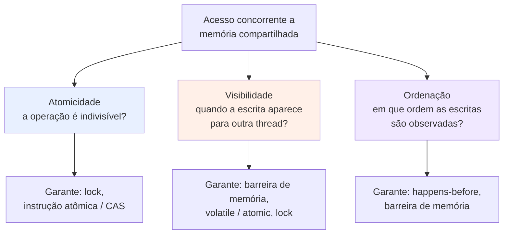
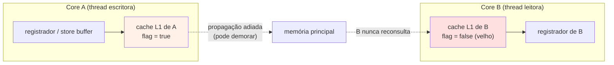
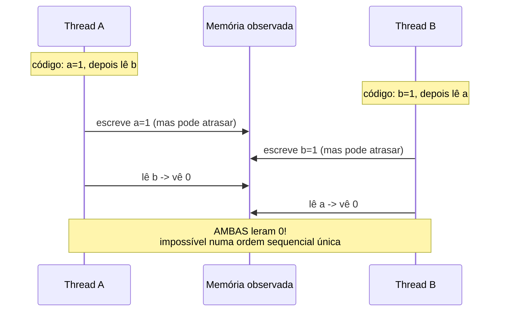
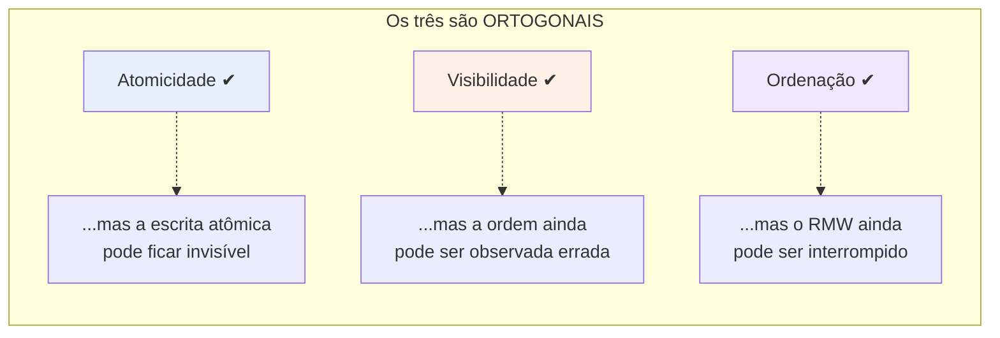
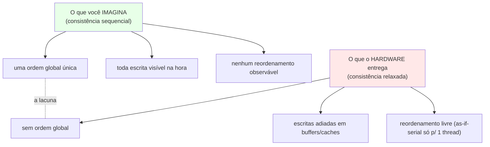
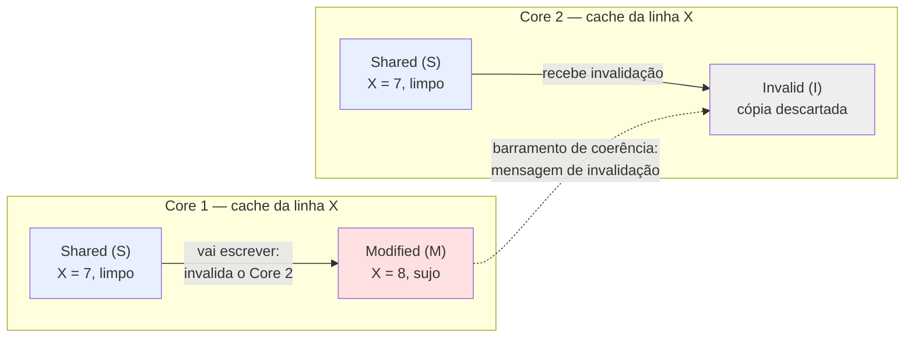
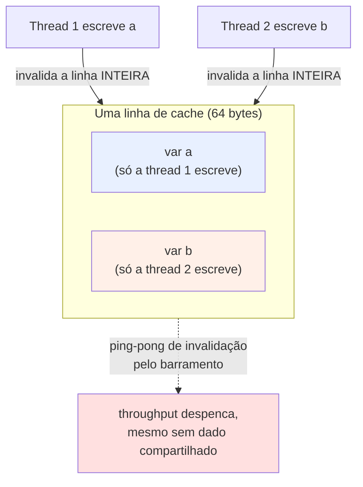
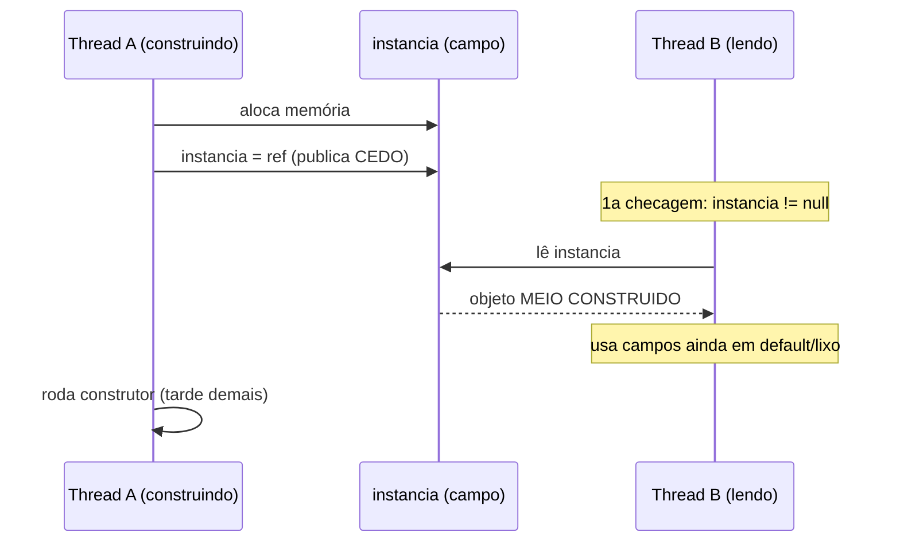

# Atomicidade, visibilidade e ordenação

> [!abstract] Resumo em uma linha
> Todo bug de memória compartilhada cai em um destes três eixos independentes — uma operação que não é indivisível (atomicidade), uma escrita que outra thread nunca vê (visibilidade), ou escritas observadas fora de ordem (ordenação) — e resolver um deles não resolve os outros dois.

Você já viu em [[03 - Estado compartilhado e race conditions]] que `count++` quebra quando duas threads correm. Mas "quebra" é vago demais. Por que, exatamente, quebra? E se eu trocar `count++` por uma escrita única, `flag = true`, ainda quebra? E se duas threads escrevem em variáveis diferentes — uma confusão dessas é possível?

Essas perguntas parecem variações do mesmo bug. Não são. São três problemas distintos, e qualquer modelo de memória compartilhada — o da CPU, o da JVM, o do Go — precisa dar uma resposta para os três. Nomear os três é o pulo do gato. É o que separa "concorrência é confusa" de "concorrência tem exatamente três armadilhas e eu sei qual é qual".

> [!tip] A analogia: a cozinha com bancadas privadas
> Imagine uma cozinha grande. No centro, um quadro branco com o pedido oficial. Mas cada cozinheiro trabalha na sua própria bancada, com um caderninho privado onde anota o que está fazendo. Ele não consulta o quadro central a cada segundo — copia uma vez, trabalha no caderninho, e só de vez em quando passa a limpo de volta pro quadro.
>
> Daí nascem os três problemas:
> - **Atomicidade**: dois cozinheiros leem "3 pratos prontos", ambos somam 1, ambos escrevem "4". Viraram 4, não 5. A operação "ler-somar-escrever" não foi indivisível.
> - **Visibilidade**: o cozinheiro A anotou "molho pronto" no caderninho dele, mas ainda não passou pro quadro. O cozinheiro B olha o quadro, não vê nada, e espera para sempre.
> - **Ordenação**: A anotou "molho pronto" e depois "prato montado", mas passou pro quadro na ordem inversa. B vê "prato montado" sem molho — um estado que, na cabeça de A, nunca existiu.
>
> O quadro central é a memória principal. As bancadas privadas são os caches por core e os registradores. Os três problemas vêm da mesma raiz física: ninguém fala direto com o quadro o tempo todo.

## O mapa: três eixos ortogonais

Antes de mergulhar em cada um, o diagrama que organiza tudo. Estes três problemas são **independentes** — você pode ter um sem os outros.



Leitura do diagrama: um único acesso concorrente abre três perguntas distintas. Repare que cada eixo tem sua própria caixa de garantia — e que `lock` aparece em dois deles (atomicidade e visibilidade), pista de que um lock bem-feito resolve mais de um problema de uma vez. Guarde isso; é o motivo de locks serem tão úteis apesar de caros.

## Eixo 1 — Atomicidade: tudo ou nada

Uma operação é **atômica** quando acontece por inteiro ou não acontece — nenhuma outra thread consegue observar um estado pela metade. A palavra vem do grego *átomos*, "indivisível".

O problema clássico você já conhece: `count++` não é uma operação. São três — ler `count`, somar 1, escrever de volta. Uma thread pode se intrometer entre o "ler" e o "escrever" da outra, e uma das incrementadas evapora. É o read-modify-write não-atômico de [[03 - Estado compartilhado e race conditions]].

Mas há uma armadilha mais sutil, que pega gente experiente: **nem toda escrita única é atômica em hardware**. Em uma máquina de 32 bits, escrever um valor de 64 bits (um `long`, um `double`) pode levar duas instruções de hardware — escreve a metade alta, escreve a metade baixa. Uma thread pode ler entre as duas e enxergar um número que é metade do valor velho e metade do novo. Um valor que **nunca foi escrito por ninguém**. Isso tem nome: *word tearing* (rasgo de palavra).

> [!warning] "Mas é só uma linha de código"
> Atomicidade não se mede em linhas de código. Mede-se em instruções de hardware. `flag = true` parece atômico e quase sempre é; `valor64 = x` parece igualzinho e pode não ser. A unidade que o hardware garante atômica é a *palavra* da arquitetura. Acima dela, você está por conta própria.

Como se garante atomicidade?
- **Lock / mutex** — envelopa o read-modify-write inteiro numa seção crítica. Caro, mas universal. Detalhado em [[05 - Exclusão mútua - locks, mutexes e monitores]].
- **Instrução atômica / CAS** — o hardware oferece um "compare-and-swap" que faz ler-comparar-trocar em um único passo indivisível. É a base do lock-free de [[08 - Operações atômicas e lock-free]].

## Eixo 2 — Visibilidade: quando (se é que) a escrita aparece?

Aqui é onde a intuição mais falha. Você assume que, quando a thread A faz `flag = true`, a thread B passa a ver `true`. **Não há essa garantia.** A escrita pode ficar presa no store buffer ou no cache do core de A por um tempo indefinido — ou, no caso do compilador, nunca ser propagada porque ele decidiu manter o valor num registrador.

O hardware moderno é assim por design: cada core tem seu próprio cache, e mantê-los sincronizados a cada escrita seria proibitivamente lento. Sem uma barreira explícita, escritas ficam bufferizadas no cache local, e a propagação para o sistema global de memória é adiada pelo protocolo de coerência, que prioriza performance sobre consistência imediata.



Leitura do diagrama: a escrita de A vive no cache L1 dele. A memória principal demora a receber a atualização, e B continua lendo seu próprio cache velho. As setas pontilhadas são o ponto: nada força a sincronização. B pode ler `false` por muito tempo depois de A ter escrito `true`.

O sintoma mais famoso é o **loop que deveria parar e não para**:

```java
// Thread escritora (em algum momento):
parar = true;

// Thread leitora:
while (!parar) {
    // trabalha...
}
// pode rodar PARA SEMPRE, mesmo depois de parar virar true
```

Por que o loop infinito? Duas causas, e elas se somam. Primeira: o compilador, vendo que `parar` não muda *dentro* daquele loop, é livre para içar a leitura para fora — lê uma vez, guarda num registrador, e o `while` testa o registrador para sempre. Segunda: mesmo que releia, o core da leitora pode estar servindo o valor velho do próprio cache. Em qualquer um dos casos, a atualização de A simplesmente não chega.

> [!danger] O bug que "funciona na sua máquina"
> Bugs de visibilidade são traiçoeiros porque dependem de timing, de qual core rodou onde, de quão otimizado o build está. Roda mil vezes em debug, passa em todos os testes, e trava em produção sob carga. Não é flakiness aleatória — é o modelo de memória te entregando exatamente o que prometeu (nada).

Como se garante visibilidade?
- **`volatile` / atomic** — marca a variável como "sempre leia da memória, sempre escreva na memória". No exemplo acima, `volatile boolean parar` conserta o loop.
- **Barreira de memória (fence)** — instrução que força o core a esvaziar o store buffer e/ou invalidar o cache, alinhando a expectativa de visibilidade com o que a CPU de fato faz.
- **Lock** — soltar um lock *publica* todas as escritas feitas dentro dele; adquirir o lock *importa* as escritas publicadas. Por isso seções críticas resolvem visibilidade de brinde, sem você pedir.

## Eixo 3 — Ordenação: a ordem que você escreveu não é a ordem que ele vê

Tanto o compilador quanto a CPU **reordenam instruções** para extrair performance — enchendo o pipeline, escondendo latência de memória, agrupando acessos. A regra é uma só: o reordenamento não pode mudar o resultado de **uma** thread isolada. Isso se chama *as-if-serial* — de fora, para uma thread sozinha, é como se nada tivesse sido reordenado.

A pegadinha: essa garantia vale para *uma* thread. **Outra** thread pode observar as escritas em ordem diferente da escrita no código-fonte. O reordenamento é transparente em programas single-thread; quando múltiplas threads interagem via memória compartilhada, ele produz bugs sutis e difíceis de depurar.

O exemplo canônico usa duas flags e duas threads:



Leitura do diagrama: A faz `a=1` e depois lê `b`; B faz `b=1` e depois lê `a`. Sua intuição diz que pelo menos uma das duas tem que ver o `1` da outra. Mas as escritas podem ser adiadas (bufferizadas) enquanto as leituras passam na frente — e **ambas** as threads leem `0`. Esse resultado é impossível se você imaginar uma única linha do tempo global intercalada. E no entanto o hardware real o produz.

> [!example] Por que isso é "impossível" e mesmo assim acontece
> Tente desenhar qualquer intercalação sequencial das quatro operações (a=1, lê b, b=1, lê a). Em toda ordem que você inventar, a última escrita acontece antes da última leitura correspondente, então pelo menos uma leitura vê `1`. O fato de a realidade contrariar isso prova que o hardware **não** está te dando uma intercalação sequencial única. Ele está te dando algo mais fraco.

Como se garante ordenação?
- **Barreira de memória** — proíbe o reordenamento através dela. "Tudo que está antes acontece antes; tudo depois, depois."
- **Happens-before** — a relação formal (a partir da ordem de programa, locks, volatiles) que, quando estabelecida entre duas ações, garante ordem *e* visibilidade entre elas. É o vocabulário com que [[11 - Modelos de memória e consistência]] formaliza tudo isto.

## A tabela que você leva pra entrevista

Os três eixos lado a lado. Decore esta tabela e você nunca mais confunde os bugs.

| Problema | O que é | Sintoma típico | O que garante |
|---|---|---|---|
| **Atomicidade** | operação acontece tudo-ou-nada, indivisível | incremento perdido; word tearing num `long` | lock; instrução atômica / CAS |
| **Visibilidade** | quando a escrita de A aparece para B | loop que não para; valor velho lido para sempre | `volatile`/atomic; barreira; lock (publica) |
| **Ordenação** | em que ordem as escritas são observadas | estado "impossível" visto por outra thread | happens-before; barreira de memória |



Leitura do diagrama: resolver um eixo deixa os outros dois em aberto. Uma operação pode ser perfeitamente atômica e mesmo assim invisível. Pode ser visível e ainda observada fora de ordem. Esse é o insight sênior — quando alguém diz "usei `volatile`, está thread-safe", a pergunta certa é "`volatile` resolve visibilidade e ordenação, mas e a atomicidade do seu read-modify-write?".

## O ideal caro: consistência sequencial

Existe um modelo de memória em que nenhum desses problemas aparece: a **consistência sequencial** (sequential consistency). Nela, todas as operações de todas as threads acontecem em *alguma* ordem global única, e cada thread respeita estritamente sua ordem de programa. É exatamente o que sua intuição assume — uma só linha do tempo, intercalada.

O problema é o preço. Garantir consistência sequencial obrigaria a CPU a tornar cada escrita globalmente visível em ordem de programa, matando store buffers, caches especulativos e reordenamento — boa parte do que torna processadores modernos rápidos. Então o hardware entrega algo mais fraco: **consistência relaxada**. Você ganha velocidade e perde a linha do tempo única.



Leitura do diagrama: a coluna verde é a fantasia confortável; a vermelha é a realidade. As primitivas de sincronização (`volatile`, locks, barreiras) existem para, **localmente e sob demanda**, recuperar pedaços da garantia sequencial onde você precisa dela — pagando o custo só ali, não no programa inteiro. Diferentes arquiteturas relaxam diferente: x86-64 tem ordem forte (relaxa pouco); ARM e PowerPC são bem mais fracos.

A formalização disto — modelos forte versus fraco, a definição precisa de happens-before, como o Java Memory Model (JMM) ancora o `volatile` — é o assunto de [[11 - Modelos de memória e consistência]]. E é o mesmo terreno que a trilha de [[03-Dominios/Tecnologia/Java/Concorrência e paralelismo/index|Concorrência (Java)]] pisa quando fala de `volatile` e do JMM na prática.

## De onde a visibilidade vem (e o mito que ela cria)

Volte à cozinha. Você pode estar se perguntando: se cada core tem seu cache privado e ninguém força sincronização, como é que dois cores não vivem em realidades completamente separadas o tempo todo? A resposta é que o hardware **não** os deixa divergir indefinidamente — existe um protocolo, gravado no silício, que mantém os caches coerentes entre si. Ele se chama **coerência de cache**, e o representante clássico é o **protocolo MESI**.

MESI foi desenvolvido por Mark Papamarcos e Janak Patel na Universidade de Illinois em 1984, e a Intel o adotou a partir do Pentium para suportar caches write-back eficientes. O nome é o conjunto dos quatro estados que **cada linha de cache** pode assumir:

- **Modified (M)** — a linha está só neste cache e foi alterada; está "suja", diverge da memória. Antes de qualquer outro core ler esse dado, ele precisa ser escrito de volta ou transferido direto.
- **Exclusive (E)** — a linha está só neste cache e bate com a memória ("limpa"). Se este core quiser escrever, transita direto para `Modified` sem precisar avisar ninguém — ninguém mais tem cópia.
- **Shared (S)** — a linha pode estar em vários caches ao mesmo tempo, todos limpos. Para escrever, o core precisa primeiro **invalidar** todas as outras cópias.
- **Invalid (I)** — a linha não está disponível neste cache; ler dela exige buscar fora.

A regra de ouro: escrever só é permitido em `Modified` ou `Exclusive`. Estando em `Shared`, todas as outras cópias precisam ser invalidadas antes.



Leitura do diagrama: os dois cores compartilham a linha X em `Shared`. Quando o Core 1 decide escrever, ele dispara uma mensagem de invalidação pelo barramento; o Core 2 marca sua cópia `Invalid` e na próxima leitura terá de buscar o valor novo. Repare no custo: essa conversa entre cores é tráfego de barramento, e quanto mais escritas concorrentes, mais mensagens.

> [!warning] O mito "cache coerente, logo visibilidade garantida"
> É tentador concluir que, se o MESI mantém os caches coerentes, a visibilidade está resolvida e `volatile` é supérfluo. Está errado por dois motivos. Primeiro, a coerência age **abaixo** do compilador: ele pode içar uma leitura para um registrador e nunca mais tocar no cache — o MESI não tem o que coerir se a variável virou registrador. Segundo, entre o `store` da CPU e o cache existe o **store buffer**: a escrita pode ficar ali, ainda invisível para o protocolo, até ser drenada. Coerência garante que, *quando* a escrita chegar ao cache, todo mundo a verá; ela não diz *quando* isso acontece, nem desfaz o que o compilador reordenou. Visibilidade correta ainda exige barreira / `volatile`.

## False sharing: brigar por um dado que ninguém compartilha

O MESI opera na granularidade da **linha de cache** — tipicamente **64 bytes** —, não da variável. Esse detalhe gera um dos bugs de performance mais cruéis e invisíveis da concorrência.

Suponha duas variáveis independentes, `a` e `b`, que por azar do layout caíram na mesma linha de 64 bytes. A thread 1 só mexe em `a`; a thread 2 só mexe em `b`. Logicamente elas não compartilham nada. Mas o hardware não enxerga `a` e `b` — enxerga *a linha*. Cada escrita em `a` invalida a linha inteira no cache da thread 2, que precisa rebuscá-la para ler `b`; cada escrita em `b` faz o mesmo do outro lado. Os cores ficam jogando a linha de pingue-pongue pelo barramento. Isso é o **false sharing** (falso compartilhamento).



Leitura do diagrama: `a` e `b` moram na mesma linha. Como o MESI invalida por linha e não por variável, a escrita de uma thread derruba a cópia da outra, embora elas nunca toquem o mesmo dado. O resultado é serialização disfarçada — duas threads que deveriam escalar de forma independente travam uma à outra.

> [!tip] A cura: padding e alinhamento
> Conserta-se o false sharing **separando** as variáveis em linhas diferentes, com bytes de enchimento (*padding*) entre elas. Na JVM, a anotação `@Contended` (JEP 142, desde o Java 8) faz isso por você: o runtime aloca padding ao redor do campo — na prática **128 bytes**, e não 64, porque o prefetcher pode trazer duas linhas de uma vez (ajustável com `-XX:ContendedPaddingWidth`). O ganho ao eliminar false sharing chega a ~49% com duas threads — perto do dobro teórico de throughput. É um tópico clássico de entrevista sênior justamente porque **não aparece em profiler óbvio**: o código parece correto, os contadores de CPU é que denunciam.

## A taxonomia das barreiras de memória

"Barreira de memória" não é uma coisa só. São quatro tipos, classificados pelo par de operações que impedem de cruzar a fronteira. Saber distingui-los é o que permite entender por que x86 é barato e ARM é caro.

| Barreira | Impede que… | Custo | Quem usa |
|---|---|---|---|
| **LoadLoad** | uma leitura *depois* da barreira passe na frente de uma leitura *antes* | baixo | lado de aquisição (acquire) |
| **StoreStore** | uma escrita *depois* passe na frente de uma escrita *antes* | baixo | lado de liberação (release) |
| **LoadStore** | uma escrita *depois* passe na frente de uma leitura *antes* | baixo | acquire / release |
| **StoreLoad** | uma leitura *depois* veja valor anterior a um `store` *antes* | **alto** | full fence; `volatile` write seguido de read |

A `StoreLoad` é a cara porque obriga o core a **drenar o store buffer** e tornar as escritas globalmente visíveis antes de prosseguir — exatamente o passo que store buffers existem para evitar. Uma **full fence** equivale às quatro de uma vez.

A diferença de arquitetura cai direto aqui: o x86-64 tem modelo forte — loads não reordenam com loads, stores não reordenam com stores — então só precisa de barreira para o caso `StoreLoad`. ARM e PowerPC são fracos e exigem barreiras explícitas para mais combinações. É por isso que um código concorrente sutilmente errado pode "funcionar" no seu x86 e quebrar no ARM.

Como isso se conecta ao que você já sabe: um `volatile write` em Java emite, por baixo, uma `StoreStore` antes e uma `StoreLoad` depois; um `volatile read` emite uma `LoadLoad` e uma `LoadStore` depois. Não é mágica — é a tradução das suas primitivas de alto nível para as cercas de hardware desta tabela.

## Acquire/release: a quantidade certa de ordem

A consistência sequencial conserta tudo, mas paga full fence em toda operação. Existe um meio-termo que é o modelo mais usado na prática: a **semântica de aquisição e liberação** (acquire/release).

A ideia é parear duas operações:

- Uma operação de **liberação** (*release*, tipicamente uma escrita, como soltar um lock ou escrever um `volatile`): garante que **tudo que veio antes dela, no código, fica visível** para quem fizer a aquisição correspondente. Nada que esteja antes pode ser reordenado para depois do release.
- Uma operação de **aquisição** (*acquire*, tipicamente uma leitura, como pegar um lock ou ler o mesmo `volatile`): garante que **tudo que vier depois dela enxerga** o que o release publicou. Nada que esteja depois pode ser reordenado para antes do acquire.

Quando um *acquire* lê o valor que um *release* escreveu, os dois **sincronizam-com** (synchronizes-with), e isso estabelece happens-before entre as duas threads — transitivamente. É o par que dá ordem e visibilidade sem o custo total da SC: a sincronização só acontece entre as operações pareadas, não em toda escrita do programa. Por isso acquire/release é descrito como mais leve e mais rápido que a consistência sequencial, que precisaria de full fence propagando a cada core. A formalização de synchronizes-with e happens-before está em [[11 - Modelos de memória e consistência]].

## O caso que amarra os três: double-checked locking quebrado

Se existe um único exemplo que prende atomicidade, visibilidade e ordenação no mesmo nó, é o **double-checked locking** (DCL). É o idioma clássico para inicializar um singleton caro só uma vez, com lock só na primeira vez:

```java
class Holder {
    private static Recurso instancia; // SEM volatile -> QUEBRADO

    static Recurso get() {
        if (instancia == null) {            // 1a checagem (sem lock)
            synchronized (Holder.class) {
                if (instancia == null) {    // 2a checagem (com lock)
                    instancia = new Recurso();
                }
            }
        }
        return instancia;
    }
}
```

A intenção é boa: a 1a checagem evita pegar o lock quando a instância já existe; a 2a, dentro do lock, garante que só uma thread constrói. Parece blindado. **Não é** — sem `volatile`, está quebrado, e foi por anos o exemplo canônico de bug de memória em Java (corrigível só a partir do JDK 5).

O problema está em `instancia = new Recurso()`, que **não é atômico** e pode ser **reordenado**. Ele se decompõe em: (1) alocar memória, (2) rodar o construtor, (3) apontar `instancia` para o objeto. O compilador/JIT pode inlinar o construtor e reordenar para (1) → (3) → (2): a referência é publicada **antes** de o objeto estar construído. Agora uma segunda thread chega na 1a checagem (fora do lock), vê `instancia != null`, pula tudo e **retorna um objeto meio construído**. É um bug onde os três eixos colidem: o RMW da inicialização não é atômico, a publicação prematura é um problema de ordenação, e a thread leitora vê um estado de visibilidade ilegal.



Leitura do diagrama: por reordenação, A publica a referência antes de rodar o construtor. B passa na 1a checagem sem lock, lê a referência válida, mas usa um objeto cujos campos ainda não foram inicializados. Nenhum lock foi violado — o lock protege a *seção crítica*, não a *ordem* em que a escrita vaza para fora dela.

> [!danger] A correção é uma palavra: `volatile`
> Declarar `private static volatile Recurso instancia` conserta. Desde o JDK 5, o JMM proíbe reordenar uma escrita `volatile` para antes de qualquer leitura/escrita anterior (release) e uma leitura `volatile` para depois de qualquer leitura/escrita seguinte (acquire). Logo a publicação de `instancia` só acontece **depois** de o construtor terminar, e quem ler a referência (acquire) enxerga o objeto inteiro. É exatamente a semântica acquire/release da seção anterior fazendo o serviço — e a **publicação segura** do objeto. Hoje, em código novo, prefere-se o *initialization-on-demand holder idiom* (classe interna estática), que delega a garantia ao class loader e dispensa o `volatile`. O DCL com `volatile` continua sendo a pergunta de entrevista. A versão Java está em [[03-Dominios/Tecnologia/Java/Concorrência e paralelismo/index|Concorrência (Java)]].

> [!note] Por que isto é "iniciado" e não "magus"
> Você não precisa do formalismo de modelos de memória para programar concorrência correta no dia a dia — precisa saber que os três problemas existem, reconhecer cada sintoma, e saber que `volatile`, locks e atomics são as ferramentas. O formalismo vem depois. Aqui o objetivo é instalar os três nomes na sua cabeça. Veja a visão geral em [[01 - Concorrência e paralelismo - o que é e por que é difícil]].

## Em entrevista

A common senior-level question is "what does thread-safety actually require?" — and the strong answer names three orthogonal axes. **Atomicity** means an operation is indivisible: a non-atomic read-modify-write like `count++` loses updates, and even a single 64-bit write may tear on 32-bit hardware. **Visibility** means a write by one thread may stay stuck in a CPU cache or register and never reach another thread — the classic "infinite loop on a stop flag" bug. **Ordering** means the compiler and CPU reorder instructions for performance (preserving single-thread *as-if-serial* semantics), so another thread can observe writes out of program order. The key insight to state out loud is that these are independent: fixing one does not fix the others, which is why `volatile` (visibility plus ordering) still leaves your read-modify-write non-atomic. Mention that **sequential consistency** is the intuitive ideal we assume but it is too expensive, so hardware ships relaxed consistency, and synchronization primitives buy back ordering and visibility on demand via memory barriers and happens-before. If pushed deeper, clarify the common myth: **cache coherence** (the MESI protocol) keeps per-core caches consistent, but it does *not* guarantee visibility — the compiler can hoist a value into a register and the store buffer can delay a write, both below the protocol, which is why you still need `volatile` or a fence. Bring up **false sharing** as a sign of seniority: two unrelated variables on the same 64-byte cache line ping-pong invalidations between cores and kill throughput even though no data is logically shared — the cure is padding or `@Contended`. Frame the practical model as **acquire/release** semantics: a release publishes everything before it, a matching acquire sees everything after, establishing happens-before far cheaper than full sequential consistency (only the paired operations synchronize). Finally, the canonical trap that fuses all three axes is **double-checked locking**: without `volatile`, instruction reordering can publish a reference to a partially constructed object, so a lock-free first check returns a half-built instance — a bug that is simultaneously about atomicity, ordering, and visibility. This connects naturally to [[18 - Concorrência em entrevista]].

### Vocabulário

- atomicidade → atomicity
- visibilidade → visibility
- ordenação / reordenamento → ordering / reordering
- barreira / cerca de memória → memory barrier / memory fence
- consistência sequencial → sequential consistency
- consistência relaxada / fraca → relaxed / weak consistency
- coerência de cache → cache coherence
- linha de cache → cache line
- falso compartilhamento → false sharing
- semântica de aquisição / liberação → acquire / release semantics
- publicação segura → safe publication
- volátil → volatile
- relação acontece-antes → happens-before relationship

> [!info] Lastro
> - Jeremy Manson (coautor do Java Memory Model), [*Atomicity, Visibility and Ordering*](http://jeremymanson.blogspot.com/2007/08/atomicity-visibility-and-ordering.html) — a fonte que nomeia os três eixos.
> - Preshing, [*Weak vs. Strong Memory Models*](https://preshing.com/20120930/weak-vs-strong-memory-models/) e [*Memory Ordering at Compile Time*](https://preshing.com/20120625/memory-ordering-at-compile-time/) — reordenamento de compilador e CPU, consistência forte versus fraca.
> - Wikipedia, [*Memory ordering*](https://en.wikipedia.org/wiki/Memory_ordering) — consistência sequencial, ordens de memória por arquitetura (x86-64 forte, ARM/PowerPC fracas).
> - Wikipedia, [*MESI protocol*](https://en.wikipedia.org/wiki/MESI_protocol) — os quatro estados (Modified/Exclusive/Shared/Invalid); Papamarcos & Patel, 1984; adotado pela Intel no Pentium.
> - Jakob Jenkov, [*False Sharing in Java*](https://jenkov.com/tutorials/java-concurrency/false-sharing.html) e DZone, [*What False Sharing Is and How JVM Prevents It*](https://dzone.com/articles/what-false-sharing-is-and-how-jvm-prevents-it) — linha de 64 bytes, `@Contended` (JEP 142), padding de 128 bytes pelo prefetcher.
> - Preshing, [*Memory Barriers Are Like Source Control Operations*](https://preshing.com/20120710/memory-barriers-are-like-source-control-operations/) e [*Acquire and Release Semantics*](https://preshing.com/20120913/acquire-and-release-semantics/) — taxonomia LoadLoad/StoreStore/LoadStore/StoreLoad e o par acquire/release.
> - Bacon et al., [*The "Double-Checked Locking is Broken" Declaration*](https://www.cs.umd.edu/~pugh/java/memoryModel/DoubleCheckedLocking.html) e Wikipedia, [*Double-checked locking*](https://en.wikipedia.org/wiki/Double-checked_locking) — publicação de objeto meio construído por reordenação; correção com `volatile` desde o JDK 5.

## Veja também

- [[03 - Estado compartilhado e race conditions]] — onde o `count++` não-atômico apareceu primeiro
- [[05 - Exclusão mútua - locks, mutexes e monitores]] — locks resolvem atomicidade e visibilidade de uma vez
- [[08 - Operações atômicas e lock-free]] — CAS e instruções atômicas do hardware
- [[11 - Modelos de memória e consistência]] — a formalização: happens-before, JMM, modelos forte/fraco
- [[18 - Concorrência em entrevista]] — como articular os três eixos numa resposta
- [[03-Dominios/Ciência/Concorrência e Paralelismo/index|Concorrência e Paralelismo]] — índice do galho
