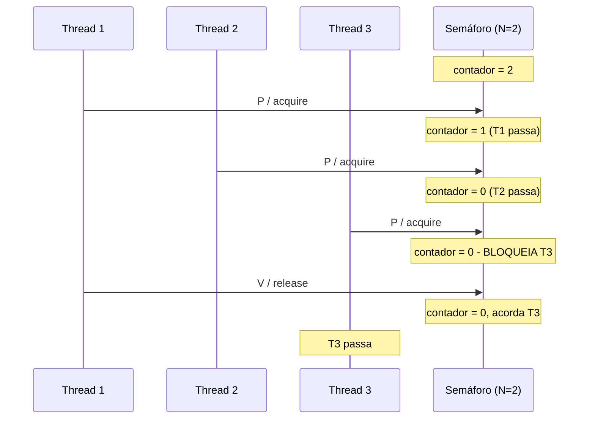
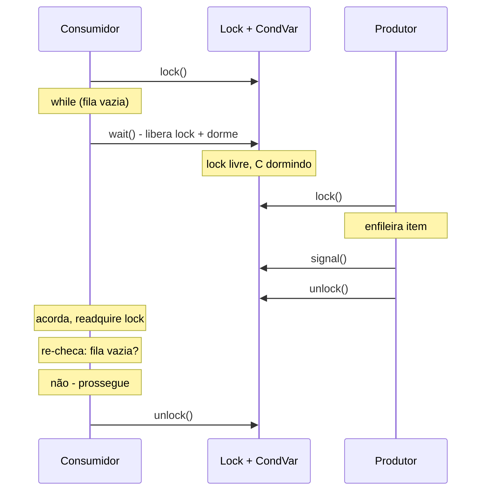
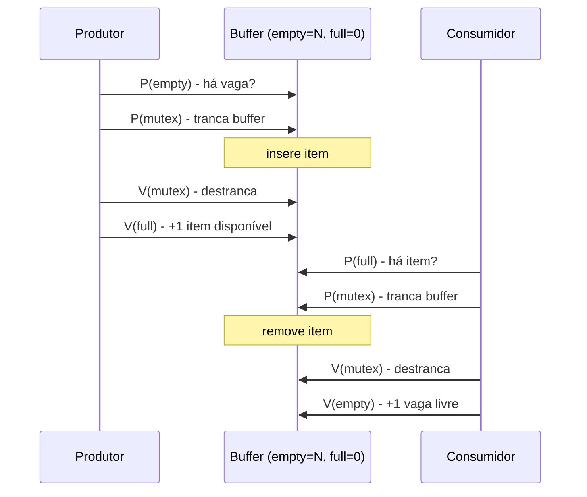
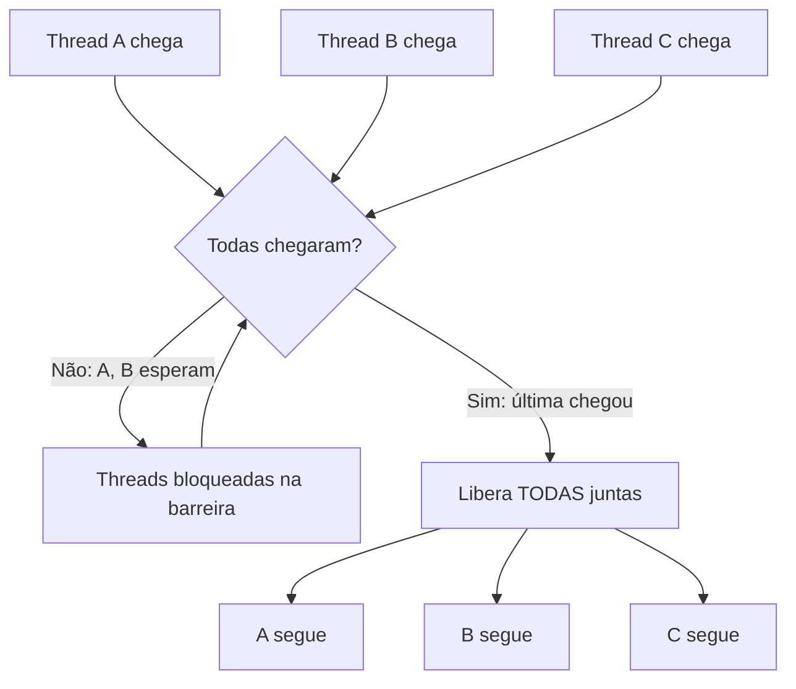
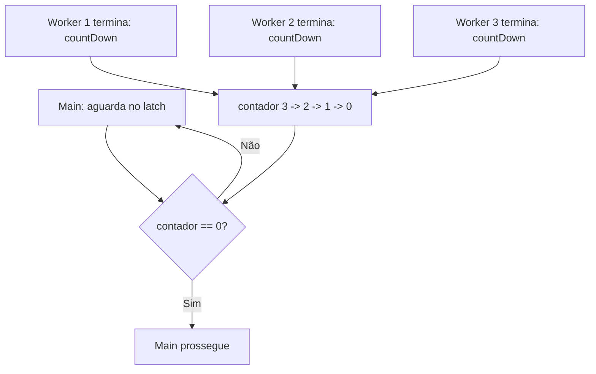
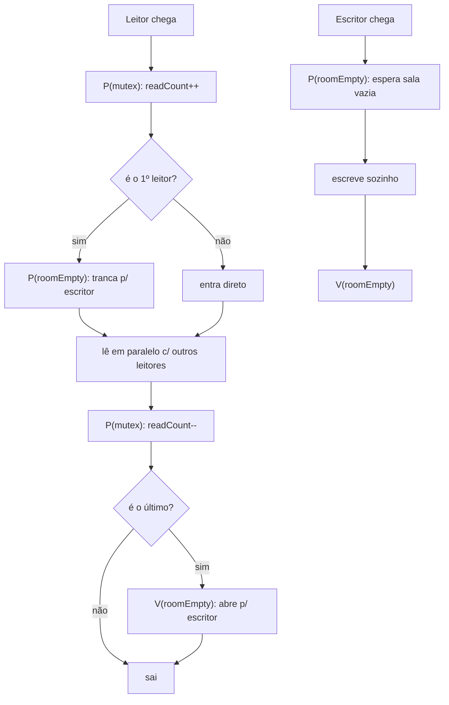
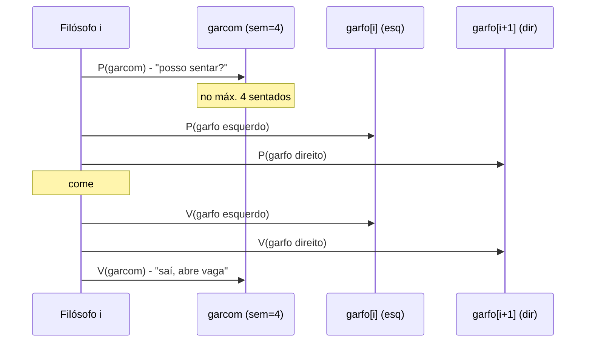

# Semáforos e coordenação

> [!abstract] Resumo em uma linha
> Um semáforo é um contador atômico de permissões que coordena threads — quem espera, quem segue, quantos cabem — e em cima dele (mais variáveis de condição, barreiras e latches) montamos os padrões de coordenação que o [[05 - Exclusão mútua - locks, mutexes e monitores|lock simples]] não resolve.

O lock responde a uma pergunta só: "este pedaço de código pode rodar agora?" Mutexes garantem que **um** entra no [[03 - Estado compartilhado e race conditions|trecho crítico]] de cada vez. Mas concorrência de verdade pede perguntas mais ricas. *Quantos* podem usar este pool ao mesmo tempo? *Espere* até o buffer ter espaço. *Não siga* até que todas as oito threads cheguem aqui. *Acorde-me* quando o trabalho terminar.

Essas são perguntas de **coordenação**, não de exclusão. E a peça fundadora de quase tudo isso é o semáforo.

## O semáforo de Dijkstra

Edsger Dijkstra introduziu o semáforo em 1965, durante o sistema THE, e o formalizou em *Cooperating Sequential Processes* (1968). A ideia é minimalista: um contador inteiro não-negativo, com **duas operações atômicas** que só podem mexer nele.

- **P** — do holandês *prolaag* / *probeer te verlagen* ("tente diminuir"). Também chamada `wait`, `acquire`, `pend`, `down`. **Decrementa** o contador. Se o resultado ficaria negativo (contador era zero), a thread **bloqueia** até alguém somar de volta.
- **V** — do holandês *verhogen* ("aumentar"). Também `signal`, `release`, `post`, `up`. **Incrementa** o contador e **acorda** uma thread que estava bloqueada em P, se houver.

A intuição que cola: o contador é o número de **permissões disponíveis**. P consome uma permissão (ou espera por uma); V devolve uma.

> [!example] Analogia: o estacionamento com cancela
> Imagine um estacionamento com 10 vagas e uma cancela que conta. A cada carro que entra, a cancela soma 1 ao ocupado e deixa 9 vagas. Quando as 10 vagas enchem, a cancela trava: o próximo carro **fica parado na entrada** (bloqueado em P) até alguém sair. Cada saída devolve uma vaga (V) e libera um carro da fila. Ninguém precisa saber *quem* saiu nem *quem* vai entrar — a cancela só conta. Essa é a essência do semáforo: contagem cega de permissões.

O ponto que faz o semáforo poderoso (e perigoso) é a atomicidade do par P/V. O incremento e o decremento, mais a decisão de bloquear ou acordar, acontecem de forma indivisível. Sem isso, dois P concorrentes poderiam ler "1 permissão" ao mesmo tempo e ambos passarem — exatamente o tipo de [[03 - Estado compartilhado e race conditions|condição de corrida]] que o semáforo deveria evitar.

Vamos ver um semáforo contador com N permissões em ação.



**Leitura do diagrama:** o semáforo começa com 2 permissões. T1 e T2 fazem P e passam, zerando o contador. T3 chega, tenta P, e como não há permissão, fica bloqueada. Só quando T1 faz V (release) é que T3 acorda e segue. O contador nunca representa "quem" — só "quantos cabem".

## Binário × contador (e por que NÃO é um mutex)

Há dois sabores de semáforo:

- **Semáforo contador** — assume valores 0..N. É o caso do pool: "tenho 10 conexões de banco; até 10 threads podem segurar uma; a décima-primeira espera". O contador modela um recurso com **N unidades intercambiáveis**.
- **Semáforo binário** — só vale 0 ou 1. Parece um mutex. **Não é.**

> [!warning] Pegadinha de entrevista: semáforo binário não é mutex
> O erro clássico é dizer "mutex é só um semáforo que conta até 1". Errado. A diferença não é o range do contador — é a **propriedade (ownership)**.
>
> - **Mutex** tem **dono**. Só a thread que fez `lock` pode fazer `unlock`. O runtime sabe quem segura o lock — é o que viabiliza reentrância e detecção de uso indevido. O mutex existe para **exclusão mútua**.
> - **Semáforo binário** **não tem dono**. **Qualquer** thread pode fazer V, mesmo uma que nunca fez P. Não há reentrância, não há "dono". O semáforo existe para **sinalização e coordenação**.
>
> Consequência prática: usar um semáforo binário como mutex te tira a detecção de "thread errada liberou o lock". Mas é justamente a ausência de dono que permite o padrão de **sinalização cruzada**: a thread A bloqueia em P esperando um evento, e a thread B (outra!) faz V quando o evento ocorre. Um mutex não faria isso — A não poderia ser destravada por B.

Em uma frase: **mutex = posse + exclusão; semáforo = contagem + sinalização**. São ferramentas com propósitos diferentes que por acaso se parecem no caso binário.

## Variáveis de condição

O semáforo é ótimo para "quantas permissões". Mas e quando a espera depende de uma **condição arbitrária** sobre o estado compartilhado — "espere até a fila não estar vazia", "espere até o saldo passar de zero"? Aí entra a **variável de condição** (condition variable), quase sempre acoplada a um [[05 - Exclusão mútua - locks, mutexes e monitores|monitor / lock]].

A variável de condição tem duas operações:

- **wait** — **libera o lock** e põe a thread para dormir, atomicamente. Quando acorda, **readquire o lock** antes de retornar.
- **signal / notify** (acorda uma) ou **broadcast / notifyAll** (acorda todas) — sinaliza que a condição *pode* ter mudado.

Por que `wait` precisa do lock? Porque a condição é avaliada sobre estado compartilhado protegido por aquele lock. Se `wait` não liberasse o lock ao dormir, ninguém mais poderia mexer no estado para tornar a condição verdadeira — deadlock instantâneo. A liberação-e-dormir tem que ser **atômica**: se houvesse uma janela entre "checo a condição" e "durmo", um `signal` poderia chegar nessa janela e se perder (o famoso *lost wakeup*).



**Leitura do diagrama:** o consumidor pega o lock, vê a fila vazia e chama `wait`, que libera o lock e o adormece. O produtor então pega o lock, enfileira, sinaliza e libera. O consumidor acorda, **readquire o lock**, **re-checa a condição** e só então segue. Note os dois pontos críticos: liberar o lock ao dormir, e re-checar ao acordar.

### Despertar espúrio e o loop de espera

Aqui mora a regra mais importante e mais violada das variáveis de condição.

> [!warning] Sempre espere em LOOP, nunca com `if`
> ```java
> // CERTO
> while (!condicao) {
>     cond.wait();
> }
> // ERRADO
> if (!condicao) {
>     cond.wait();
> }
> ```
> Uma `wait` pode retornar **sem que ninguém tenha sinalizado** — é o **despertar espúrio** (spurious wakeup). POSIX, C++ `condition_variable`, monitores Java: todos permitem isso. O kernel e o runtime ganham simplicidade e desempenho (batching, coalescing, evitar casos de borda de sinais perdidos) ao custo de transferir a você a responsabilidade de **sempre re-checar a condição ao acordar**.

São três razões para o loop, e só a primeira costuma ser lembrada:

1. **Despertar espúrio** — a thread acorda sozinha, sem sinal.
2. **Sinalização imprecisa** — `notifyAll` acorda *todas*, mas pode haver só um item para uma; as demais re-checam e voltam a dormir.
3. **Corrida pós-acordar** — entre o `signal` e o momento em que esta thread readquire o lock, *outra* thread pode ter consumido o item. Se você usasse `if`, prosseguiria sobre estado inválido.

A regra mecânica é simples: **trate cada acordar como um palpite, não uma garantia.** O `while` converte despertares espúrios, broadcasts e corridas em re-tentativas inofensivas sob o lock. "Acordou" nunca significa "está pronto" — só significa "vá conferir".

## Produtor-consumidor: o padrão canônico

Junte tudo e você chega ao problema clássico da coordenação: o **buffer limitado** com produtores e consumidores. Produtores geram itens e os põem num buffer de tamanho fixo; consumidores os retiram. Quando o buffer enche, produtores esperam; quando esvazia, consumidores esperam. É o exemplo que aparece em toda prova de SO — veja também `[[17 - Padrões de concorrência]]`.

A solução clássica com semáforos usa **três** primitivas:

- `empty` — semáforo contador inicializado em **N** (vagas vazias).
- `full` — semáforo contador inicializado em **0** (vagas cheias).
- `mutex` — exclusão mútua sobre o buffer em si (um por vez mexe na estrutura).



**Leitura do diagrama:** o produtor primeiro espera uma vaga vazia (`P(empty)`), depois tranca o buffer, insere, destranca e sinaliza um item disponível (`V(full)`). O consumidor faz o espelho: espera um item (`P(full)`), tranca, remove, destranca e devolve uma vaga (`V(empty)`). Os dois semáforos contadores fazem o bloqueio por capacidade; o `mutex` só protege a integridade da estrutura.

Esqueleto em pseudocódigo:

```text
// Produtor
loop:
    item = produz()
    P(empty)          // espera vaga; bloqueia se buffer cheio
    P(mutex)          // entra na seção crítica
        buffer.push(item)
    V(mutex)
    V(full)           // anuncia: +1 item

// Consumidor
loop:
    P(full)           // espera item; bloqueia se buffer vazio
    P(mutex)
        item = buffer.pop()
    V(mutex)
    V(empty)          // anuncia: +1 vaga
    consome(item)
```

> [!danger] A ordem dos P importa — eis um deadlock à espreita
> Note que `P(empty)` vem **antes** de `P(mutex)`. Se você inverter — pegar o mutex primeiro e *depois* esperar por vaga — o produtor bloqueado em `empty` ainda segura o mutex. O consumidor que liberaria a vaga não consegue entrar para retirar item, porque o mutex está tomado. Travamento mútuo clássico. A regra: **adquira o semáforo de capacidade antes do mutex de exclusão.** Mais sobre isso em [[07 - Deadlock, livelock e starvation]].

A mesma coordenação pode ser escrita com **uma variável de condição** (ou duas — `notFull` e `notEmpty`) em vez de semáforos: o produtor faz `while (cheio) notFull.wait()`, o consumidor `while (vazio) notEmpty.wait()`, e cada um sinaliza o outro. Semáforos contam; condition variables checam predicados. Ambos resolvem o mesmo problema, com sabores diferentes.

## Barreira: o ônibus só sai com todos a bordo

E quando o que você precisa não é "espere por um recurso" mas "espere pelos seus **colegas**"? A **barreira** (barrier) faz N threads esperarem até que **todas** cheguem ao ponto de encontro; quando a última chega, **todas seguem juntas**.

> [!example] Analogia: a excursão de ônibus
> O guia não deixa o ônibus partir enquanto os 8 turistas não voltarem do passeio. Quem chega primeiro **espera**. Quando o oitavo embarca, o ônibus parte — todos juntos. Ninguém anda sozinho. É exatamente uma barreira de party = 8.

O uso clássico são **simulações paralelas em fases**: cada thread calcula sua parte da fase 1; a barreira garante que *toda* a fase 1 terminou antes que *qualquer* thread comece a fase 2 (senão alguém leria dados da fase anterior ainda não calculados). Uma **barreira cíclica** (cyclic barrier) se **reseta** automaticamente após disparar, pronta para a próxima fase — ideal para laços iterativos.



**Leitura do diagrama:** cada thread que chega à barreira verifica se todas chegaram. Enquanto faltar alguém, as que já chegaram ficam bloqueadas. Quando a última chega, a barreira "dispara" e libera todas simultaneamente. Numa barreira cíclica, o contador volta ao valor inicial e o ciclo recomeça.

## Latch: conte os eventos até zero

O **latch de contagem** (countdown latch) parece uma barreira, mas resolve um problema diferente: uma ou mais threads **esperam que N eventos aconteçam** antes de prosseguir. É **one-shot** — uma vez que chega a zero, fica em zero para sempre.



**Leitura do diagrama:** o latch começa em 3. Cada worker que termina faz `countDown`, decrementando. A thread principal fica parada em `await` até o contador zerar. Quando o terceiro worker conta para baixo, a main acorda e segue. O latch não volta a subir.

> [!info] Barreira × latch — a diferença que cai em entrevista
> Confunde-se muito. A distinção limpa:
> - **Latch**: assimétrico e one-shot. *Algumas* threads (tipicamente a main) **esperam** que *outras* threads concluam N tarefas. Quem conta para baixo **não** espera. Perfeito para inicialização: "só comece a servir requisições depois que os 3 caches carregarem". Zerou, acabou.
> - **Barreira**: simétrica e (na versão cíclica) reutilizável. **Todas** as threads do grupo esperam **umas às outras** no mesmo ponto. Cada worker é, ao mesmo tempo, quem espera e quem é esperado. Perfeito para fases iterativas.
>
> Regrinha: latch = "espere os outros terminarem" (one-shot, assimétrico); barreira = "esperem-se mutuamente" (cíclica, simétrica).

## Rendezvous e troca

O caso mais enxuto de sincronização-de-encontro é o **rendezvous**: duas threads que precisam se sincronizar num ponto — nenhuma passa antes que a outra chegue. É uma barreira de party = 2.

A variação útil é o **Exchanger**: as duas threads não só se encontram, mas **trocam um objeto** no ponto de encontro. A thread A traz um buffer cheio, B traz um vazio; no rendezvous elas trocam, e cada uma sai com o que precisava. É um produtor-consumidor de duas vias sem buffer intermediário — útil em pipelines de double-buffering.

## O problema dos leitores-escritores

O produtor-consumidor trata todo mundo igual: cada thread quer um item. Mas há um caso muito comum em que as threads têm **interesses diferentes** sobre o mesmo dado: umas só querem **ler**, outras querem **escrever**. Pense num cache, numa tabela de configuração, num catálogo: noventa por cento dos acessos são leituras.

A observação central é que **leitura não conflita com leitura**. Dois leitores olhando o mesmo dado ao mesmo tempo não corrompem nada — ninguém muda o estado. O conflito só aparece quando há escrita: escritor × escritor (dois mudando ao mesmo tempo) e escritor × leitor (um lendo enquanto outro muda debaixo dele). A regra que queremos é então: **vários leitores OU um escritor sozinho**, nunca os dois grupos juntos.

Um mutex burro resolveria — serializa tudo — mas joga fora o paralelismo de leitura, que é justamente o que torna esse caso interessante. Queremos algo mais fino. E aqui surge a tensão que faz a fama do problema: **a quem dar prioridade quando leitores e escritores disputam?**

> [!info] As três versões — e quem starva em cada uma
> Não existe "a" solução de leitores-escritores. Existem três políticas, cada uma sacrificando alguém:
> - **Prioridade aos leitores (primeira versão)** — se há leitor lendo, novos leitores entram livremente, mesmo com escritor esperando. Maximiza o paralelismo de leitura, mas o **escritor pode starvar**: enquanto pingar um leitor atrás do outro, o escritor nunca pega a vez.
> - **Prioridade aos escritores (segunda versão)** — assim que um escritor manifesta interesse, **nenhum leitor novo entra**; os leitores em curso terminam e o escritor assume. Mata a fome do escritor, mas agora os **leitores podem starvar** sob escrita intensa.
> - **Justa / sem inanição (terceira versão)** — ninguém starva: o lock é concedido em tempo limitado para todos, tipicamente respeitando ordem de chegada. Custa um pouco de throughput de leitura para garantir o limite de espera.

A construção com semáforos é instrutiva porque mostra o **contador protegido** em ação. Na versão com prioridade aos leitores precisamos de:

- `readCount` — um inteiro com o número de leitores ativos.
- `mutex` — semáforo binário que protege o `readCount` (incrementar e decrementar é seção crítica).
- `roomEmpty` (ou `wrt`) — semáforo binário que representa "a sala está livre para um escritor". O **primeiro** leitor a entrar adquire `roomEmpty`; o **último** a sair o devolve.

```text
// Leitor
P(mutex)
    readCount++
    if (readCount == 1) P(roomEmpty)   // primeiro leitor tranca a porta p/ escritores
V(mutex)
    ... lê ...
P(mutex)
    readCount--
    if (readCount == 0) V(roomEmpty)   // último leitor abre a porta
V(mutex)

// Escritor
P(roomEmpty)                           // espera a sala esvaziar
    ... escreve ...
V(roomEmpty)
```

O truque elegante: só o **primeiro** leitor disputa `roomEmpty` com os escritores; os leitores seguintes entram de graça (apenas passam pelo `mutex` rápido para contar). E só o **último** leitor reabre a porta. É por isso que o escritor pode starvar — enquanto `readCount` nunca chega a zero, `roomEmpty` nunca é devolvido.



**Leitura do diagrama:** o caminho do leitor (esquerda) só toca `roomEmpty` nas pontas — o primeiro a entrar tranca, o último a sair destranca; no meio, leitores correm em paralelo. O escritor (direita) precisa de `roomEmpty` inteiro para si. Veja por que ele starva: se sempre houver pelo menos um leitor dentro, o ramo "é o último? sim" nunca dispara, e o `V(roomEmpty)` que acordaria o escritor nunca acontece. As versões com prioridade ao escritor e justa inserem semáforos extras (um `turnstile`/catraca que barra leitores novos quando há escritor na fila) para quebrar exatamente esse ciclo.

A lição maior: o `readCount` é estado compartilhado e por isso anda **dentro de um mutex próprio** — esquecer de proteger o contador é o bug nº 1 dessa solução. Coordenação fina quase sempre envolve um contador, e contador sem proteção é [[03 - Estado compartilhado e race conditions|condição de corrida]] garantida.

## O jantar dos filósofos resolvido com semáforos

Cinco filósofos à volta de uma mesa redonda, um garfo entre cada par. Para comer, um filósofo precisa dos **dois** garfos vizinhos. O algoritmo ingênuo — "pegue o garfo da esquerda, depois o da direita" — leva ao **deadlock** clássico, detalhado em [[07 - Deadlock, livelock e starvation]]: se *todos* pegarem a esquerda ao mesmo tempo, cada um segura um garfo e espera para sempre pelo vizinho. As quatro condições de Coffman se satisfazem todas, e a mesa congela.

O interessante para esta nota é que **o semáforo, bem usado, previne o deadlock** — não basta ter a primitiva, é preciso desenhar a coordenação. Três soluções clássicas, cada uma atacando uma condição de Coffman diferente:

> [!example] Três jeitos de salvar o jantar
> - **Limitar a 4 à mesa** — um semáforo `garcom` inicializado em **4** só deixa quatro filósofos disputarem garfos ao mesmo tempo. A aritmética não mente: 4 filósofos sentados precisam de 5 garfos para travar, mas só existem 5 garfos e o quinto fica sobrando para alguém — então pelo menos um sempre consegue os dois, come, e devolve. Ataca a condição de **espera circular** removendo a possibilidade do ciclo fechar.
> - **Ordem de garfos (assimetria)** — todos pegam primeiro o garfo de **menor índice**. Na prática, quatro filósofos pegam a esquerda primeiro e **um** (o filósofo "canhoto") pega a direita primeiro. Essa quebra de simetria impede que o ciclo se feche: não existe mais o estado "todos seguram a esquerda". Ataca diretamente a **espera circular** com ordenação total de recursos.
> - **Garçom (árbitro)** — um semáforo/monitor central que só autoriza pegar os garfos quando **ambos** estão livres. O filósofo nunca segura um garfo esperando o outro. Ataca a condição de **hold-and-wait** (segurar-e-esperar).

A solução do garçom limitado a 4 é a mais didática para mostrar o semáforo prevenindo deadlock, porque é literalmente um semáforo contador fazendo o trabalho:



**Leitura do diagrama:** antes de tocar em qualquer garfo, o filósofo pede permissão ao `garcom` (`P(garcom)`). Como o semáforo só tem 4 permissões, no máximo quatro disputam garfos ao mesmo tempo — e com 5 garfos para 4 disputantes, o ciclo de espera nunca fecha. Quando termina, devolve os garfos e a vaga (`V(garcom)`), liberando o quinto filósofo. O semáforo contador, sozinho, transformou um deadlock garantido em progresso garantido. Note que isso **previne deadlock** mas não promete **fairness**: um filósofo azarado ainda pode esperar muito (starvation), problema que a [[07 - Deadlock, livelock e starvation|nota seguinte]] separa do travamento.

## Passing the baton

Há um padrão senior que aparece quando a condição de espera é complexa demais para "conte permissões": **passar o bastão** (*passing the baton*), formalizado por Gregory Andrews. O nome diz tudo — quem solta o recurso, em vez de simplesmente liberar um mutex e deixar a multidão brigar, **escolhe explicitamente a próxima thread a acordar e entrega o controle a ela**, como um corredor de revezamento passando o bastão.

O problema que ele resolve: imagine várias filas de espera diferentes sobre o mesmo recurso (leitores numa, escritores noutra, threads esperando o buffer encher noutra). Com sinalização ingênua, você corre dois riscos. O **sinal perdido** (lost wakeup) — você sinaliza antes da outra thread dormir, e o sinal cai no vácuo. E a **corrida pós-acordar** — você acorda alguém, mas até ela readquirir o lock, o estado mudou e ela acorda para nada.

A técnica usa **semáforos binários divididos** (*split binary semaphores*): um conjunto de semáforos binários cuja soma nunca passa de 1, cada um representando um estado distinto de quem-pode-prosseguir. A regra de ouro: o `mutex` que protege o estado **não é liberado por um `V` genérico**. Em vez disso, a thread que está saindo examina os contadores, decide quem deve correr em seguida, e faz `V` **exatamente no semáforo daquela classe** de espera — passando o bastão (a posse da seção crítica) diretamente. Quem recebe o bastão não precisa recompetir pelo mutex: ele já chega com o controle nas mãos e o estado intacto.

> [!tip] Por que isso elimina a perda de sinal
> No esquema normal, "liberar o lock" e "acordar alguém" são dois passos, e existe uma janela entre eles onde o estado pode mudar ou um sinal pode se perder. No passing the baton, **acordar é a própria transferência da posse** — não há janela. A thread acordada herda a seção crítica diretamente da que saiu, sem reentrar na disputa. O bastão só "cai no chão" (o mutex é de fato liberado) quando a thread que sai conclui que **não há ninguém elegível** para receber. É a forma mais controlada de coordenar quem-acorda-quem, ao custo de código bem mais intrincado — por isso é ferramenta de quem constrói a primitiva, não de quem só a usa.

## Barging × fairness em semáforos

Quando uma permissão é liberada e há threads na fila de espera, quem ganha? A resposta não é óbvia, e divide os semáforos em **justos** e **injustos**.

Um semáforo **injusto** (não-fair, o **padrão** na maioria das plataformas, inclusive o `Semaphore` do Java) permite **furar a fila** (*barging*): uma thread que acabou de chegar e chama `acquire()` pode **pegar a permissão na frente** de threads que já estavam esperando, se a permissão estiver disponível naquele instante. Logicamente, a recém-chegada se enfia na cabeça da fila.

Por que diabos um sistema permitiria isso? Por **desempenho**. A thread recém-chegada **já está rodando** na CPU, com cache quente, pronta para usar o recurso. A thread que estava na fila está **suspensa** — acordá-la custa um context switch caro, e ela ainda vai levar tempo para voltar a rodar. Deixar a recém-chegada "furar" evita esse ida-e-volta e mantém o throughput alto. Em workloads de alta contenção, a diferença é dramática.

Um semáforo **justo** (fair) proíbe o barging: as permissões são concedidas em **ordem de chegada** (FIFO), respeitando quem esperou mais. Ninguém starva — há um limite de espera. Mas o custo é real e medido: manter a fila ordenada e forçar o handoff para a thread suspensa **derruba o throughput**, frequentemente em **cerca de uma ordem de magnitude** sob contenção, por causa do excesso de trocas de contexto.

> [!warning] Quando fairness vale o preço
> O default injusto é a escolha certa na imensa maioria dos casos: maximiza throughput e, na prática, ninguém starva porque as threads chegam e saem rápido. Ative fairness só quando a **inanição** for um risco real e inaceitável — por exemplo, tempos de espera com cauda longa que violam um SLA de latência, ou uma thread de baixa frequência que precisa de garantia de progresso entre rajadas de threads gulosas. Regra de bolso: **injusto por padrão, justo por exceção justificada** — e meça, porque a diferença de throughput não é sutil.

Repare que barging e despertar espúrio são primos: ambos significam que "estar na fila" ou "ter sido acordado" **não garante** que você prossiga. É por isso que a disciplina do `while`-loop sobre o predicado, vista lá em cima, é universal — ela é robusta tanto a despertares espúrios quanto ao furo de fila.

## Semáforo como bloco de construção

Toda a coordenação desta nota — mutex, latch, barreira, pool — pode ser reduzida a um único primitivo: o **semáforo**. Ele é, no sentido teórico, **suficiente** para construir os outros. Vale internalizar isso, porque é o que faz o semáforo merecer o título de primitiva fundamental.

> [!example] Tudo é semáforo, por baixo
> - **Mutex (a parte de exclusão)** — um semáforo binário inicializado em 1. `P` antes da seção crítica, `V` depois. (Falta-lhe a *posse*, como vimos — por isso não é um mutex completo, mas o mecanismo de bloqueio é esse.)
> - **Latch de contagem** — um contador `N` protegido, mais um semáforo onde a thread que espera faz `P`; cada `countDown` decrementa, e quando chega a zero, faz `V` para liberar quem aguardava.
> - **Barreira (party = N)** — combina um contador protegido com um semáforo: cada thread que chega incrementa o contador e bloqueia; a última a chegar dispara N `V` (ou um broadcast) liberando todas.
> - **Pool de recursos** — é o caso nativo: um semáforo contador inicializado no tamanho do pool. `P` para pegar um recurso, `V` para devolver. Sem contador extra, sem nada — o semáforo *é* o pool.

Isso não quer dizer que você *deva* construir tudo na mão sobre semáforos — a plataforma já oferece classes especializadas e otimizadas. Mas entender que todas descendem da mesma primitiva esclarece os [[17 - Padrões de concorrência|padrões de concorrência]]: o produtor-consumidor, o pool, a barreira e o latch não são mágicas independentes, são **arranjos diferentes de contadores e bloqueio**. Quando você reconhece o semáforo embaixo, um padrão novo deixa de ser memorização e vira dedução — você pergunta "quantas permissões? quem espera? quem libera?" e a estrutura aparece sozinha.

> [!info] Por que então existem as outras primitivas?
> Se semáforo basta, por que `CountDownLatch`, `CyclicBarrier` e companhia? Por **clareza de intenção e segurança**. Um `CountDownLatch` grita "espere N eventos" no nome; um semáforo contador com a mesma lógica exige que o leitor reconstrua a intenção. Além disso, as classes especializadas embutem verificações (não deixam contar abaixo de zero, expõem `await` com timeout, integram-se ao `AbstractQueuedSynchronizer`) que você teria de reimplementar. O semáforo é a primitiva *teórica*; as classes nomeadas são a ergonomia *prática*. Saber que são a mesma coisa por baixo é o que conecta a teoria de Dijkstra ao código do dia a dia.

## Fronteira com a plataforma

Tudo acima é teoria de SO portável. No mundo Java, cada conceito tem um nome concreto na biblioteca `java.util.concurrent` — detalhado em `[[03-Dominios/Tecnologia/Java/Concorrência e paralelismo/index|Concorrência (Java)]]`:

- `Semaphore` — o semáforo contador (e binário com `permits = 1`).
- `CountDownLatch` — o latch one-shot.
- `CyclicBarrier` — a barreira reutilizável (com `Runnable` opcional ao disparar, para atualizar estado compartilhado antes de liberar).
- `Phaser` — barreira flexível com número de partes ajustável em tempo de execução, para múltiplas fases dinâmicas.
- `Exchanger` — o rendezvous com troca.
- Variáveis de condição via `Lock.newCondition()` ou `Object.wait/notify` no monitor embutido.

A teoria diz *o que* coordenar; a plataforma diz *com qual classe*. Saber as duas camadas é o que separa "decorou a API" de "entende a coordenação".

## Em entrevista

> [!tip] Como falar disso em inglês
> A semaphore is a counter with two atomic operations, P/acquire (decrement, block at zero) and V/release (increment, wake a waiter); it models a pool of N interchangeable permits. The common trap is calling a binary semaphore a mutex: a mutex has ownership — only the locking thread can unlock it — while a semaphore has no owner, so any thread can release it, which is exactly what enables cross-thread signaling. With condition variables, always wait inside a `while` loop checking the predicate, never an `if`, because spurious wakeups and post-signal races mean a wakeup is a hint, not a guarantee. For the producer-consumer bounded buffer I'd use two counting semaphores, `empty` and `full`, plus a mutex, and I'd acquire the capacity semaphore before the mutex to avoid deadlock. A latch is one-shot and asymmetric — some threads wait for others to finish — whereas a cyclic barrier is symmetric and reusable, with every thread waiting for all the others. The readers-writers problem has three flavors — reader-priority (writers can starve), writer-priority (readers can starve), and a fair version where nobody starves — and the classic semaphore solution guards a `readCount` so only the first reader competes with writers and only the last reopens the door. One subtlety I'd flag is fairness versus barging: the default semaphore is unfair, letting a freshly arrived thread jump the queue if a permit is free, which boosts throughput by avoiding a context switch, so I only enable fairness when starvation actually threatens an SLA, since it can cut throughput by roughly an order of magnitude. Ultimately the semaphore is the fundamental primitive — mutexes, latches, barriers, and resource pools are all just arrangements of a protected counter and blocking on top of it.

### Vocabulário

- semáforo → semaphore
- semáforo binário / contador → binary / counting semaphore
- variável de condição → condition variable
- despertar espúrio → spurious wakeup
- barreira → barrier
- latch / trava de contagem → countdown latch
- produtor-consumidor → producer-consumer
- rendezvous / ponto de encontro → rendezvous
- permissão → permit
- sinalizar / notificar → signal / notify
- leitores-escritores → readers-writers
- prioridade aos leitores / escritores → reader / writer preference
- passar o bastão → passing the baton
- furar a fila → barging
- justiça / justo × injusto → fairness / fair vs. non-fair
- inanição → starvation

> [!info] Lastro
> - [Semaphore (programming) — Wikipedia](https://en.wikipedia.org/wiki/Semaphore_(programming)) — P/V de Dijkstra (*prolaag*/*verhogen*), semântica de acquire/release, contador × binário.
> - [Difference between Binary Semaphore and Mutex — GeeksforGeeks](https://www.geeksforgeeks.org/operating-systems/difference-between-binary-semaphore-and-mutex/) — ownership: só o mutex tem dono; qualquer thread libera um semáforo binário.
> - [Condition Variable Spurious Wakes — Just Software Solutions](https://www.justsoftwaresolutions.co.uk/threading/condition-variable-spurious-wakes.html) — por que esperar em `while` com predicado, não `if`.
> - [Producer Consumer Solution using Semaphores — GeeksforGeeks](https://www.geeksforgeeks.org/operating-systems/producer-consumer-problem-using-semaphores-set-1/) — buffer limitado com `empty`/`full`/`mutex` e ordem dos P.
> - [Java CyclicBarrier vs CountDownLatch — Baeldung](https://www.baeldung.com/java-cyclicbarrier-countdownlatch) — latch one-shot/assimétrico × barreira cíclica/simétrica.
> - [Readers–writers problem — Wikipedia](https://en.wikipedia.org/wiki/Readers%E2%80%93writers_problem) — as três versões (prioridade leitores/escritores/justa) e quem starva em cada.
> - [Readers-Writers Problem (reader preference) — GeeksforGeeks](https://www.geeksforgeeks.org/operating-systems/readers-writers-problem-set-1-introduction-and-readers-preference-solution/) — construção com `readCount`/`mutex`/`roomEmpty`; o primeiro/último leitor.
> - [Dining Philosopher Solution using Semaphores — GeeksforGeeks](https://www.geeksforgeeks.org/operating-systems/dining-philosopher-problem-using-semaphores/) — limitar a 4, assimetria de garfos e o garçom prevenindo deadlock.
> - [Passing the Baton — Core Dumps](https://amitab.github.io/post/baton/) — técnica de Andrews com split binary semaphores; acordar é a transferência da posse.
> - [Fairness — Explicit Locks (flylib)](https://flylib.com/books/en/2.558.1/fairness.html) — barging no semáforo injusto, custo da fairness, por que furar a fila ajuda o throughput.

## Veja também

- [[05 - Exclusão mútua - locks, mutexes e monitores]] — a fronteira posse × contagem começa aqui.
- [[03 - Estado compartilhado e race conditions]] — o que a coordenação existe para evitar.
- [[07 - Deadlock, livelock e starvation]] — a ordem dos P e os perigos da espera.
- [[17 - Padrões de concorrência]] — produtor-consumidor e companhia como padrões reutilizáveis.
- [[18 - Concorrência em entrevista]] — onde semáforo × mutex e while × if reaparecem como pegadinhas.
- [[03-Dominios/Tecnologia/Java/Concorrência e paralelismo/index|Concorrência (Java)]] — `Semaphore`, `CountDownLatch`, `CyclicBarrier`, `Phaser`, `Exchanger`.
- [[03-Dominios/Ciência/Concorrência e Paralelismo/index|Concorrência e Paralelismo]] — índice do galho.
