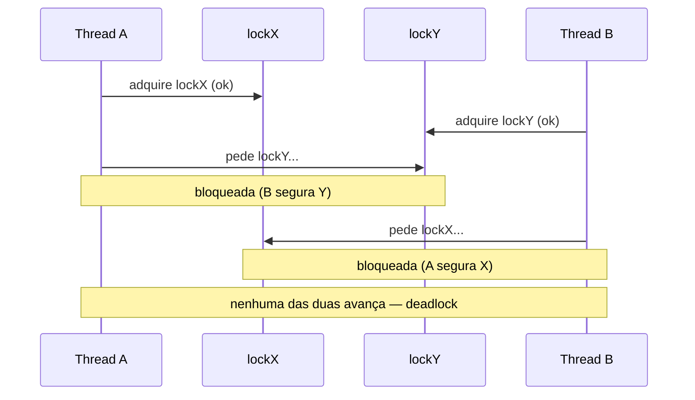
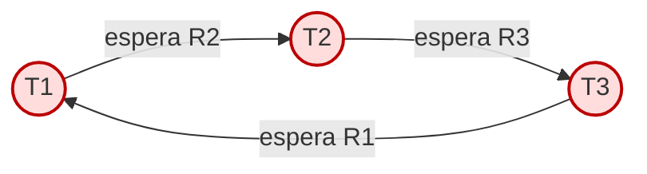
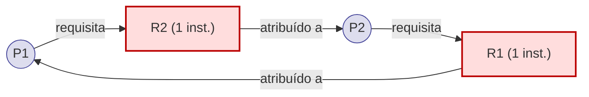
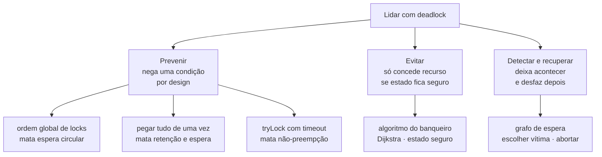
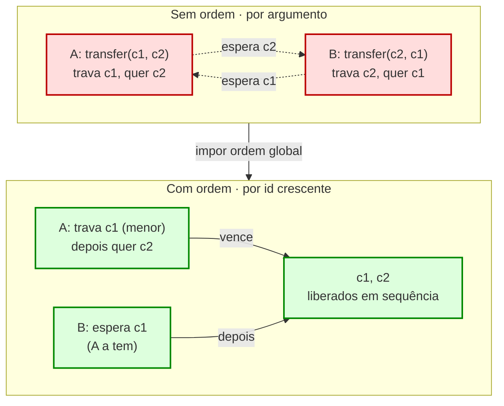
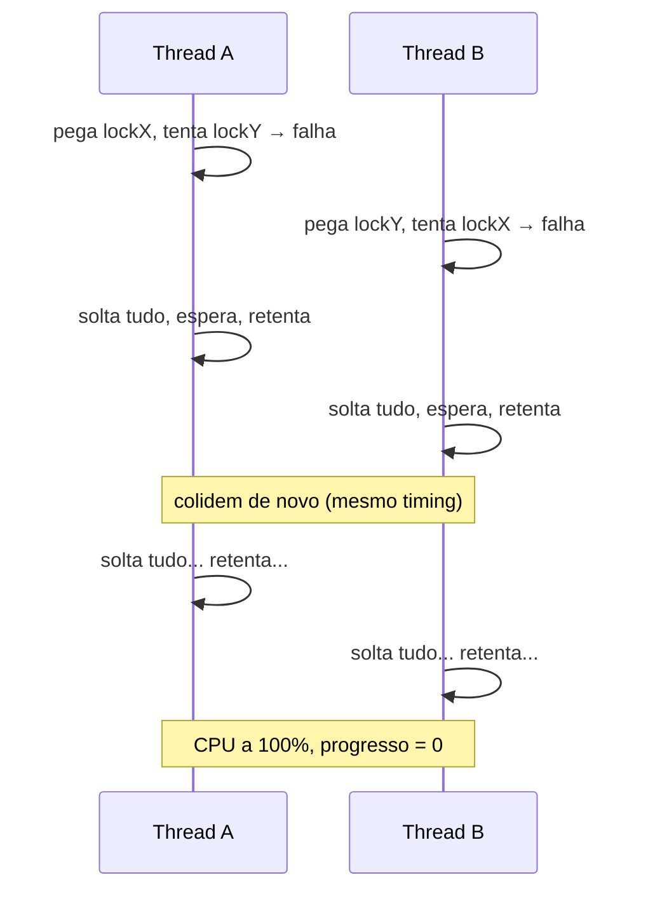
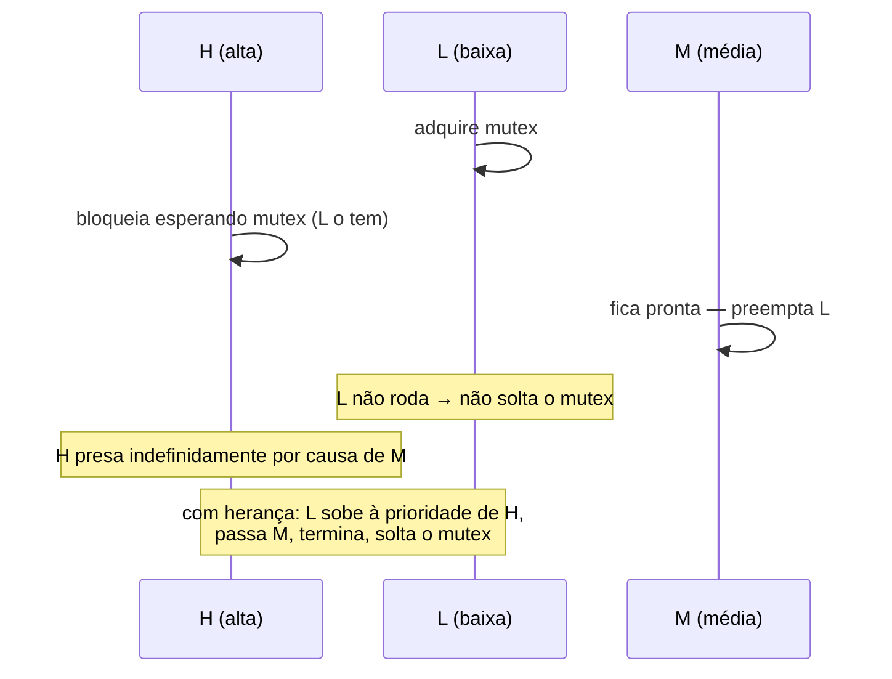

# Deadlock, livelock e starvation

> [!abstract] Resumo em uma linha
> Deadlock é a espera circular que nunca termina; livelock é o movimento que nunca progride; starvation é a thread que nunca chega a vez — três modos distintos de uma thread ficar sem fazer o que veio fazer.

Você sincronizou tudo direitinho. Cada região crítica está protegida por um lock, cada variável compartilhada tem seu guarda. Os race conditions de [[03 - Estado compartilhado e race conditions]] sumiram. E então, em produção, o sistema simplesmente para. Sem erro. Sem crash. Sem log. As threads estão vivas — só não estão andando.

Bem-vindo ao lado escuro da sincronização. Você não corrigiu a concorrência; você apenas trocou um problema (corrupção de dados por acesso simultâneo) por outro (paralisia por excesso de espera). Esta nota é sobre as três formas dessa paralisia: **deadlock**, **livelock** e **starvation**. As três têm a mesma assinatura observável — "nada acontece" — e três causas completamente diferentes.

## Deadlock: o abraço mortal

Comece pela imagem que Dijkstra usou em 1965 e que nunca saiu da literatura: o **jantar dos filósofos**.

Cinco filósofos sentam-se ao redor de uma mesa redonda. Entre cada par de vizinhos há um único garfo — cinco filósofos, cinco garfos. Cada filósofo alterna entre pensar e comer. Mas para comer, ele precisa de **dois** garfos: o da sua esquerda e o da sua direita. Ele pega um, depois o outro, come, e devolve ambos.

Parece inofensivo. Agora suponha que todos fiquem com fome ao mesmo tempo. Cada filósofo pega o garfo da sua **esquerda**. Os cinco garfos somem das mesas simultaneamente. Agora cada filósofo está segurando um garfo e esperando pelo da direita — que está na mão do vizinho, que por sua vez espera o garfo do próximo vizinho, e assim em círculo.

Ninguém solta o garfo que tem. Ninguém consegue o garfo que falta. Ninguém come. Ninguém morre de cabeça quente — eles morrem de fome, educadamente, para sempre. Isso é deadlock.

> [!tip] A analogia do cruzamento
> Quatro carros chegam simultaneamente a um cruzamento sem semáforo, cada um vindo de uma direção. Cada motorista avança até o meio do cruzamento e fica preso — o caminho à frente está bloqueado pelo carro que veio da direita. Os quatro carros formam um quadrado travado. Cada um espera o da frente sair, e o da frente é, transitivamente, ele mesmo. Ninguém recua. O trânsito para.

### O caso simples: dois locks em ordem oposta

Você não precisa de cinco filósofos para travar. Bastam **duas** threads e **dois** locks adquiridos em ordens opostas. Este é o deadlock que mais aparece em código real — e o mais fácil de criar sem perceber.

A thread A faz: pega `lockX`, depois pega `lockY`. A thread B faz: pega `lockY`, depois pega `lockX`. Na maioria das execuções, nada de errado acontece. Mas existe uma janela: A pega `lockX`, e antes de A pegar `lockY`, B pega `lockY`. Agora A espera `lockY` (que B tem) e B espera `lockX` (que A tem). Travados.

```java
// Thread A                      // Thread B
synchronized (lockX) {           synchronized (lockY) {
    synchronized (lockY) {           synchronized (lockX) {
        // ...                           // ...
    }                                }
}                                }
```

O sequenceDiagram abaixo mostra o instante exato em que o abraço mortal se fecha. Repare que cada thread completa o primeiro lock com sucesso — o problema só nasce no segundo.



Leitura do diagrama: as duas primeiras setas são sucessos independentes. As duas últimas são pedidos que nunca serão atendidos — A só liberaria `lockX` depois de obter `lockY`, e B só liberaria `lockY` depois de obter `lockX`. A dependência é circular, logo eterna.

> [!warning] Deadlock é silencioso
> Um deadlock não lança exceção. Não dispara timeout (a menos que você tenha programado um). As threads não consomem CPU — elas estão **bloqueadas**, dormindo em espera. Do lado de fora, o sistema parece travado ou "lento". É por isso que deadlock é tão traiçoeiro: ele não grita, ele emudece.

## As quatro condições de Coffman

Em 1971, Coffman, Elphick e Shoshani publicaram a caracterização que se tornou canônica: deadlock só pode ocorrer se **todas as quatro** condições abaixo estiverem presentes ao mesmo tempo. A consequência prática é poderosa — para **eliminar** a possibilidade de deadlock, basta garantir que **uma** dessas condições nunca se forme.

1. **Exclusão mútua** (*mutual exclusion*). Pelo menos um recurso só pode ser usado por uma thread de cada vez. Se o recurso fosse compartilhável sem restrição, não haveria espera. (Garfo é exclusivo; o ar da sala não é.)
2. **Retenção e espera** (*hold-and-wait*). Uma thread já segura ao menos um recurso e, ao mesmo tempo, espera por outro. Ela não solta o que tem enquanto pede mais.
3. **Não-preempção** (*no preemption*). Um recurso não pode ser tomado à força de quem o segura — só é liberado voluntariamente pela própria thread. Ninguém arranca o garfo da mão do filósofo.
4. **Espera circular** (*circular wait*). Existe um ciclo de threads `T1 → T2 → ... → Tn → T1`, onde cada uma espera um recurso que a próxima segura.

As três primeiras são propriedades do **sistema** (do desenho dos recursos e locks). A quarta é uma propriedade do **estado** em um dado instante — ela só aparece quando os pedidos se encadeiam em laço. É a espera circular que fecha a armadilha.

O grafo de espera abaixo ("wait-for graph") mostra a quarta condição materializada. Cada nó é uma thread; cada seta significa "espera por um recurso que esta segura". Deadlock equivale a um **ciclo** neste grafo.



Leitura do diagrama: as três setas fecham um ciclo `T1 → T2 → T3 → T1`. Não há saída. Compare com um grafo sem ciclo (uma cadeia `A → B → C` que termina): ali a thread `C` no fim não espera ninguém, então `C` eventualmente progride, libera seu recurso, e a cadeia se desfaz da ponta para trás. **Ciclo = deadlock; cadeia acíclica = espera saudável.** Detectar deadlock é, no fundo, detectar ciclo em grafo dirigido.

> [!note] Necessário, não suficiente — e a sutileza
> A formulação clássica diz que as quatro condições são *necessárias* para o deadlock. Em sistemas com uma única instância de cada recurso, a presença de um ciclo no grafo de espera é também *suficiente* (há deadlock). Quando há múltiplas instâncias do mesmo tipo de recurso, um ciclo é necessário mas não suficiente — pode haver ciclo e ainda assim alguém conseguir progredir. Em entrevista, o seguro é dizer: "as quatro condições de Coffman precisam coexistir; quebre qualquer uma e o deadlock se torna impossível".

## O grafo de alocação de recursos (RAG)

O grafo de espera da seção anterior é uma simplificação. Ele só fala de threads. A formalização completa que os livros de SO usam é o **grafo de alocação de recursos** (*resource allocation graph*, RAG), que torna explícitos tanto os processos quanto os recursos — e é aí que a teoria fica precisa.

O RAG é um grafo dirigido com **dois tipos de nó**:

- **Nós de processo** (desenhados como círculos): cada thread ou processo que disputa recursos.
- **Nós de recurso** (desenhados como retângulos): cada tipo de recurso. Dentro do retângulo, um ponto por **instância** daquele recurso (um lock tem uma instância; um pool de cinco conexões tem cinco).

E **dois tipos de aresta**, que é a parte que importa:

- **Aresta de requisição** (*request edge*): vai de um **processo para um recurso** (`P → R`). Significa "este processo pediu este recurso e está esperando".
- **Aresta de atribuição** (*assignment edge*): vai de uma **instância de recurso para um processo** (`R → P`). Significa "esta instância foi concedida a este processo".

A direção das setas conta a história inteira: pedidos apontam para o recurso desejado; concessões apontam de volta para quem está de posse. Quando um pedido é atendido, a aresta de requisição `P → R` se converte em aresta de atribuição `R → P` — a seta literalmente vira de lado.

A regra de detecção segue daí, e tem duas camadas:

- **Sem ciclo no RAG → garantidamente não há deadlock.** A ausência de ciclo é prova de segurança.
- **Com ciclo → depende das instâncias.** Se **todo** recurso no ciclo tem **uma única instância**, o ciclo é necessário *e suficiente*: há deadlock, ponto final. Se algum recurso no ciclo tem **múltiplas instâncias**, o ciclo é apenas necessário — pode haver ciclo e mesmo assim alguém liberar uma instância e desfazer o nó.



Leitura do diagrama: `P1` segura `R1` (aresta de atribuição `R1 → P1`) e pede `R2` (aresta de requisição `P1 → R2`); `P2` segura `R2` e pede `R1`. Siga as setas e você fecha o ciclo `P1 → R2 → P2 → R1 → P1`. Como `R1` e `R2` têm uma instância cada, esse ciclo *é* o deadlock — é o mesmo "dois locks em ordem oposta" da seção anterior, agora desenhado com recursos explícitos. Detectar deadlock vira, mecanicamente, **rodar uma busca de ciclo em grafo dirigido** (DFS marcando nós cinza/preto). Quando todos os recursos têm instância única, o RAG colapsa no grafo de espera: contraia cada recurso na seta que o atravessa (`P1 → R2 → P2` vira `P1 espera P2`) e você recupera o wait-for graph.

## Estratégias: prevenir, evitar, detectar

Há três posturas diante do deadlock, em ordem crescente de permissividade.



Leitura do diagrama: prevenir age **antes**, removendo uma das quatro condições no próprio desenho do código. Evitar age **durante**, recusando concessões que levariam a um estado inseguro. Detectar age **depois**, deixando o deadlock formar-se e então quebrando-o à força.

### Prevenir — quebrar uma condição de Coffman

Esta é a abordagem mais usada no código de aplicação, porque é puramente uma disciplina de design.

- **Quebrar a espera circular: ordem global de aquisição.** Imponha uma ordem total sobre todos os locks (por exemplo, ordene por um identificador numérico) e exija que **toda** thread adquira locks sempre nessa ordem crescente. Se A e B sempre pegam `lockX` antes de `lockY`, o ciclo `A espera Y / B espera X` jamais se forma — alguém sempre pega `X` primeiro e vence. **É a cura mais barata e mais eficaz.** No jantar dos filósofos, equivale a numerar os garfos e fazer todos pegarem primeiro o de menor número; o último filósofo, ao tentar pegar o garfo de número menor que já está na mão do vizinho, simplesmente espera sem nunca ter levantado o outro garfo — o ciclo não fecha.
- **Quebrar a retenção e espera: pegar tudo de uma vez.** A thread adquire **todos** os recursos de que vai precisar de uma só vez, atomicamente; se não conseguir todos, não fica com nenhum. Sem reter-um-e-esperar-outro, não há como encadear. O custo: você precisa saber de antemão tudo que vai usar, e há perda de concorrência (você segura recursos que talvez só use no fim).
- **Quebrar a não-preempção: timeout / `tryLock`.** Em vez de bloquear para sempre esperando um lock, a thread tenta adquiri-lo com um prazo (`tryLock(timeout)`). Se estourar, ela **solta todos os locks que já tem** e recomeça depois de um instante. Isso introduz preempção voluntária: ninguém fica retendo enquanto espera indefinidamente. Cuidado: feito errado, vira livelock (mais abaixo).

> [!example] A regra de ouro de produção
> "Sempre adquira locks na mesma ordem." Esta única disciplina, aplicada com consistência em toda a base de código, elimina a categoria inteira de deadlocks por ordem oposta. O difícil não é entender a regra — é fazê-la valer quando há dezenas de locks espalhados por camadas que ninguém vê de uma vez só.

#### O exemplo clássico: transferência bancária

Nenhum exemplo prega a disciplina de ordenação melhor que a transferência entre contas. A operação é simétrica por natureza: travar a conta de origem, travar a de destino, mover o dinheiro. O código ingênuo trava **na ordem dos argumentos**:

```java
void transfer(Account from, Account to, long amount) {
    synchronized (from) {
        synchronized (to) {
            from.debit(amount);
            to.credit(amount);
        }
    }
}
```

Parece correto — e funciona em quase todo teste. Mas considere duas transferências concorrentes e **opostas**: a thread A faz `transfer(conta1, conta2)` e a thread B faz `transfer(conta2, conta1)` ao mesmo tempo. A trava `conta1` e quer `conta2`; B trava `conta2` e quer `conta1`. É o abraço mortal das duas seções anteriores, agora com nome de negócio: dinheiro do cliente preso porque alguém transferia na direção contrária no mesmo milissegundo.

A cura é **ordem global de aquisição**: nunca trave por argumento; trave sempre pela conta de **menor id** primeiro, independentemente de quem é origem ou destino.

```java
void transfer(Account from, Account to, long amount) {
    Account first  = from.id() < to.id() ? from : to;   // sempre o menor id
    Account second = from.id() < to.id() ? to : from;
    synchronized (first) {
        synchronized (second) {
            from.debit(amount);
            to.credit(amount);
        }
    }
}
```

Agora `transfer(conta1, conta2)` e `transfer(conta2, conta1)` travam **ambas** `conta1` antes de `conta2`. Uma das duas threads vence `conta1`, a outra espera — sem reter `conta2`. O ciclo não tem como se formar, porque ambas as threads "sobem a escada" de ids na mesma direção. (Resta tratar `from.id() == to.id()`, a transferência para a mesma conta, normalmente barrada antes de chegar aqui.) Esta é a **hierarquia de locks** (*lock hierarchy*) em sua forma mais nua: uma ordem total sobre os recursos, e a regra de só adquirir subindo.



Leitura do diagrama: em cima (vermelho), as setas tracejadas fecham um ciclo — A espera c2, B espera c1, ninguém solta. Embaixo (verde), as duas threads competem pelo **mesmo** primeiro lock (`c1`, o de menor id); uma vence e a outra apenas espera sem reter nada, então não há ciclo a formar. A transformação no meio — "impor ordem global" — é a única coisa que muda entre o código que deadlocka e o que não deadlocka; a lógica de débito e crédito é idêntica nos dois.

### Evitar — o algoritmo do banqueiro

Dijkstra também propôs uma abordagem mais sofisticada: em vez de proibir condições, o sistema **simula** cada pedido antes de concedê-lo. Conceder o recurso deixaria o sistema em um **estado seguro** (existe ao menos uma ordem na qual todas as threads conseguem terminar)? Se sim, concede. Se não, faz a thread esperar — mesmo que o recurso esteja livre.

O nome vem da analogia: um banqueiro só empresta dinheiro se ainda conseguir satisfazer os saques máximos de todos os clientes em alguma ordem. Requer conhecer de antemão a demanda máxima de cada thread por cada recurso — o que raramente se sabe em software de aplicação. Por isso o banqueiro é mais um clássico acadêmico (e de prova de SO) do que uma ferramenta do dia a dia. Mas a ideia de "estado seguro" é a essência da prevenção dinâmica.

### Detectar e recuperar — o que os bancos de dados fazem

A terceira postura: **deixe o deadlock acontecer**, mas mantenha um detetive rodando. Periodicamente, o sistema constrói o grafo de espera e procura ciclos. Achou ciclo? Escolhe uma **vítima** (a transação mais barata de desfazer, geralmente) e a **aborta** — desfaz seu trabalho, libera seus locks, e quebra o ciclo. A vítima recebe um erro e tipicamente tenta de novo.

É exatamente assim que um SGBD trata deadlock entre transações — e o gancho com o [[Banco de Dados]] é direto, porque o lock que entra no ciclo quase sempre nasce do **two-phase locking** (*2PL*), o protocolo de controle de concorrência padrão. No 2PL, uma transação vive em duas fases: uma **fase de crescimento** em que só adquire locks (e nunca solta) e uma **fase de encolhimento** em que só solta (e nunca adquire). Esse "agarrar e segurar até o fim" é literalmente a condição de *retenção e espera* de Coffman elevada à regra do protocolo — por isso o 2PL garante serialização, mas **abre a porta para deadlock**. O banco aceita esse trade: prefere arriscar deadlock (e resolvê-lo depois) a abrir mão da serialização.

A resolução é o trio detectar-escolher-abortar, materializado:

1. **Detectar.** O SGBD mantém um *wait-for graph* (transações como nós, "T1 espera lock que T2 segura" como arestas) e roda busca de ciclo. PostgreSQL aciona o detector só depois de um curto atraso de espera (`deadlock_timeout`, 1 s por padrão) — não vale a pena verificar a cada bloqueio, já que a maioria das esperas se resolve sozinha rápido. SQL Server varre periodicamente o gestor de locks com a mesma lógica de ciclo.
2. **Escolher a vítima.** Achado o ciclo, o banco escolhe **quem matar pelo custo de rollback**: a transação que modificou menos linhas, ou cujo log de undo é menor, é a mais barata de desfazer. SQL Server documenta isso explicitamente — a vítima padrão é "a transação menos cara de reverter"; InnoDB escolhe pela menor quantidade de trabalho a desfazer.
3. **Abortar e devolver erro.** A vítima sofre rollback, libera os locks, o ciclo se quebra e as demais transações seguem. A aplicação recebe um erro de deadlock (em PostgreSQL, `ERROR: deadlock detected`, SQLSTATE `40P01`) e **deve tentar de novo** — retry é a resposta esperada, não a exceção.

O desenvolvimento completo (níveis de isolamento, 2PL estrito, MVCC) está em [[Banco de Dados]]; aqui basta ver que o mesmo princípio teórico desta nota — ciclo no grafo é deadlock — vira mecanismo de produção lá.

> [!info] Por que detectar em vez de prevenir?
> Em um SGBD, prevenir por ordem global de locks seria impraticável: as transações são escritas por milhares de aplicações diferentes, cada uma tocando linhas em ordens que o banco não controla. Impor "sempre trave a linha de menor id primeiro" sobre SQL arbitrário é impossível. Então o banco aceita o caos e arbitra depois — abortar uma transação e pedir retry é barato comparado a engessar todo o modelo de concorrência. (Há SGBDs que *previnem* por timestamp, esquemas como *wait-die* e *wound-wait*, mas detecção por wait-for graph é o caminho mais comum.)

### Ignorar — o algoritmo do avestruz

Há uma quarta postura que os livros mencionam de cara fechada e a indústria pratica sem pudor: **não fazer nada**. O **algoritmo do avestruz** (*ostrich algorithm*) é a estratégia de **enfiar a cabeça na areia** — fingir que deadlock não existe, e se um dia o sistema travar, reiniciar. O nome vem do mito de que avestruzes escondem a cabeça na areia diante do perigo.

Por mais cínico que soe, é a escolha **racional** da maioria dos SOs de propósito geral — Linux, Windows, macOS não rodam detector de deadlock de kernel para recursos comuns. O raciocínio é puro custo-benefício:

- Deadlock de kernel é **raro** comparado a outras falhas (bug de aplicação, kernel panic, falha de hardware).
- Prevenir ou evitar exige conhecer demandas máximas e impor ordem global sobre todo `malloc`, `open`, `lock` — caríssimo e engessante.
- Detectar exige rodar busca de ciclo continuamente, gastando ciclos a troco de um evento que quase nunca ocorre.
- Recuperar de um deadlock raro é trivial: o usuário reinicia o processo ou a máquina.

Quando o evento é improvável e a recuperação é barata, pagar imposto permanente para preveni-lo é mau negócio. Ignorar **maximiza o desempenho do caso comum**.

> [!warning] Quando o avestruz é irresponsável
> A conta vira no instante em que reiniciar deixa de ser barato. Em **aviônica**, em um **marca-passo**, no **controle de um reator**, num **sistema de tempo real** com deadlines rígidos, um travamento não é "reinicie e siga" — é um avião que perde controle de voo, uma missão perdida (foi quase o destino do Pathfinder, na seção de inversão de prioridade). Nesses domínios não se ignora nada: usa-se prevenção rígida, recursos pré-alocados, análise estática de ordem de locks. No outro extremo, num **SGBD financeiro**, ignorar também é inaceitável — não porque travar seja catastrófico, mas porque deadlocks ali são **frequentes** (milhares de transações concorrentes), então o banco paga o detector de bom grado. A regra honesta: ignore deadlock só quando ele for **raro E barato de recuperar**; falhe em qualquer das duas e o avestruz vira negligência.

## Livelock: movimento sem progresso

Deadlock é paralisia: ninguém se mexe. **Livelock** é o oposto visível e o mesmo resultado de fundo: todos se mexem freneticamente, e ainda assim ninguém progride.

A analogia perfeita: duas pessoas educadas se cruzam num corredor estreito. Os dois vão pelo mesmo lado. "Desculpe", e ambos desviam para o outro lado — ainda bloqueados. "Não, desculpe você", e ambos voltam ao primeiro lado. E de novo. E de novo. Eles estão em constante movimento, reagindo um ao outro com perfeita simetria, e nunca passam.

Em código, o livelock costuma nascer da própria cura ingênua do deadlock. Lembra do `tryLock` com retry? Imagine duas threads que, ao falhar em pegar o segundo lock, soltam tudo e tentam de novo — **exatamente ao mesmo tempo, com o mesmo atraso**. Elas colidem, recuam, tentam, colidem de novo, em sincronia perfeita. Nenhuma trava (não estão bloqueadas), mas nenhuma avança.



Leitura do diagrama: nenhuma seta é um bloqueio — todas são ações ativas. A diferença para o deadlock está aí: no deadlock as threads dormem (CPU ociosa); no livelock elas queimam CPU rodando o mesmo loop de tentar-e-desistir. Sintoma de produção distinto: deadlock = CPU baixa e travada; livelock = CPU alta e nenhum trabalho útil saindo.

> [!tip] A cura do livelock: quebrar a simetria
> O livelock vive da simetria perfeita. Quebre-a. Em vez de cada thread esperar um intervalo fixo antes de retentar, faça-a esperar um intervalo **aleatório** (*randomized backoff*). Assim, na próxima tentativa, uma chega antes da outra, vence o lock, e a sequência se desfaz. É a mesma ideia do *exponential backoff* de redes: o acaso desempata educados teimosos. No corredor, equivale a um dos dois jogar uma moeda mental e parar de imitar o outro.

## Starvation: a thread que nunca chega a vez

**Starvation** (inanição) é diferente das duas anteriores. Aqui não há ciclo nem simetria. Há uma thread que, repetidamente, é **passada para trás**. O recurso está disponível, outras threads o usam e o liberam — só que sempre alguma outra é escolhida antes dela. O sistema como um todo progride; uma thread específica, não.

Causas típicas:

- **Prioridades.** Um escalonador por prioridade que sempre roda a thread de maior prioridade pode deixar uma thread de baixa prioridade esperando indefinidamente, desde que sempre haja alguém mais prioritário pronto.
- **Locks injustos** (*unfair locks*). Um lock que não mantém fila — que entrega o acesso a qualquer thread pronta no momento da liberação — pode favorecer sistematicamente threads que chegam em rajada, deixando uma azarada eternamente para trás. Em Java, um `ReentrantLock` pode ser construído em modo *fair* justamente para evitar isso (FIFO de espera), ao custo de throughput.
- **Convoy / contenção desbalanceada.** Padrões em que algumas threads "monopolizam" um recurso quente e outras nunca alcançam a frente da fila.

A cura geral chama-se **fairness** (justiça): garantir que toda thread esperando acabe, mais cedo ou mais tarde, sendo atendida. Filas FIFO, *aging* (envelhecimento — aumentar a prioridade de quem espera há muito tempo) e locks justos são instâncias dessa ideia.

> [!note] Três paralisias, três assinaturas
> **Deadlock**: ciclo de espera; threads bloqueadas; CPU ociosa; ninguém progride; permanente. **Livelock**: reação mútua simétrica; threads ativas; CPU alta; ninguém progride; permanente até o acaso quebrar. **Starvation**: thread preterida; o sistema progride; uma thread específica não; pode ser temporário ou eterno conforme a (in)justiça do escalonador.

## Inversão de prioridade: a lição de Marte

Há um parente próximo da starvation que merece destaque, porque é história clássica de entrevista e porque quase matou uma missão espacial: a **inversão de prioridade**.

O cenário tem **três** threads e um lock:

- **Alta** prioridade (H) precisa de um lock.
- **Baixa** prioridade (L) está segurando esse lock.
- **Média** prioridade (M) está pronta para rodar e não usa o lock.

H bloqueia esperando o lock que L segura — normal, por enquanto. Mas então o escalonador, vendo que M tem prioridade maior que L, **preempta L e roda M**. Agora L não roda (M está na frente), logo L não termina, logo L não solta o lock, logo H continua bloqueada — bloqueada, na prática, por uma thread de prioridade **média** que nem usa o lock. A prioridade ficou invertida: M, de prioridade média, está efetivamente passando na frente de H, de prioridade alta. Em sistemas de tempo real, isso faz H estourar seu deadline.

### O caso Mars Pathfinder (1997)

Em 4 de julho de 1997, a sonda Mars Pathfinder pousou em Marte. Dias depois, começou a se **reiniciar sozinha**, repetidamente, perdendo dados científicos a cada reset.

A causa era exatamente a inversão de prioridade. O sistema rodava o RTOS VxWorks. Uma thread de **alta** prioridade que gerenciava um barramento de dados compartilhado dependia de um *mutex* sobre uma área de dados; uma thread **meteorológica de baixa** prioridade às vezes segurava esse mutex. Quando uma thread de **comunicações de prioridade média** (longa) entrava em cena, ela preemptava a meteorológica de baixa prioridade — que então não liberava o mutex. A thread de alta prioridade ficava bloqueada além do tempo previsto; um *watchdog* detectava que a tarefa do barramento não cumprira seu prazo e, concluindo que algo estava travado, **reiniciava o sistema**.

A correção: **herança de prioridade** (*priority inheritance*). O mutex do VxWorks tinha um flag de herança de prioridade que estava **desligado** — desligado de propósito, por razões de desempenho. Com herança ativada, quando H bloqueia esperando um lock que L segura, L **herda temporariamente a prioridade de H** enquanto segura o lock. Assim L passa à frente de M, termina rápido, solta o lock, e H segue. A JPL reproduziu o bug em uma réplica de laboratório com tracing ligado, identificou a causa e **enviou um patch da Terra para Marte** ligando a flag. A sonda voltou a se comportar.



Leitura do diagrama: sem herança, M (prioridade média) bloqueia indiretamente H (prioridade alta) ao roubar a CPU de L. Com herança de prioridade, L é temporariamente promovido ao nível de H enquanto segura o lock, neutralizando M e devolvendo a vez a H assim que L libera. A herança não elimina a espera — ela impede que uma thread de prioridade intermediária a prolongue indevidamente.

> [!warning] A moral de engenharia
> O bug do Pathfinder não foi um descuido de programação local — foi uma **opção de configuração** (herança desligada "por performance") que só explodiu sob a combinação exata de três threads e um lock. Concorrência falha assim: nas costuras entre decisões que pareciam locais e inofensivas. Por isso o tópico é tão valorizado em entrevista — testa se você raciocina sobre interações, não só sobre linhas.

## Diagnóstico em produção

Como você descobre que travou — e por quê?

- **Thread dump.** A ferramenta primária. Um *snapshot* de todas as threads e do estado de cada uma (rodando, bloqueada, esperando) e de quais locks cada uma segura e espera. Em Java, `jstack <pid>` (ou um `kill -3`) produz o dump; a JVM frequentemente já **detecta e imprime o ciclo de deadlock** explicitamente ("Found one Java-level deadlock"), listando as threads e os monitores envolvidos.
- **Reconstruir o grafo de espera.** Com o dump em mãos, monte mentalmente (ou com ferramenta) o grafo "quem espera o quê que quem segura". Um ciclo confirma deadlock; uma thread sempre bloqueada sem ciclo sugere starvation; CPU alta sem progresso sugere livelock.
- **Disciplina de design > diagnóstico.** O melhor diagnóstico é o que você nunca precisa fazer. Ordem de aquisição de locks **consistente e documentada**, locks de granularidade adequada, e `tryLock` com timeout nas fronteiras onde a ordem não pode ser garantida — essas práticas previnem a maioria dos casos antes que cheguem à produção.

O ferramental concreto de Java para isso (ler thread dumps, `jstack`, detecção da JVM, ferramentas de profiling) está em [[03-Dominios/Tecnologia/Java/Concorrência e paralelismo/index|Concorrência (Java)]]. Esta nota fica no plano conceitual — os mecanismos de base aparecem em [[05 - Exclusão mútua - locks, mutexes e monitores]] e [[06 - Semáforos e coordenação]], e o custo da contenção na escala em [[16 - As leis da escala - Amdahl e Gustafson]].

## Deadlock distribuído (panorama)

Tudo até aqui pressupôs algo que some quando os processos vivem em **máquinas diferentes**: uma **visão global** do grafo. Numa só máquina, o SO ou a JVM enxerga todos os locks e monta o wait-for graph num instante. Num sistema distribuído — microserviços, bancos particionados, locks espalhados por nós que conversam por [[03-Dominios/Ciência/Redes e Protocolos/index|rede]] — ninguém tem essa foto completa. Cada nó só conhece os seus próprios pedaços do grafo, e o ciclo de espera pode atravessar três nós sem que nenhum deles, sozinho, perceba o laço.

Isso torna a detecção genuinamente mais difícil, por dois motivos que vêm direto da natureza da rede: as mensagens chegam com **atraso** (a foto que você monta já está desatualizada quando termina de montá-la) e podem se **perder ou reordenar**. Algoritmos formais existem — o clássico é o **Chandy-Misra-Haas**, de *edge chasing*: em vez de centralizar o grafo, uma sonda (*probe*) é injetada e segue as arestas de espera de nó em nó; se a sonda iniciada por um processo **volta a ele mesmo**, fechou-se um ciclo, há deadlock. É elegante e exige só mensagens curtas de tamanho fixo, sem estado global.

Na prática de produção, porém, o que quase todo mundo usa é bem mais humilde: **timeout**. Se uma transação ou requisição espera por um lock além de um prazo, presume-se deadlock (ou algo igualmente ruim — um nó morto, uma partição de rede) e aborta-se, com retry. É grosseiro: às vezes mata uma espera que ia se resolver, e o limiar é uma adivinhação. Mas é simples, não exige coordenação entre nós, e degrada graciosamente quando a própria rede falha — virtude decisiva num ambiente onde a falha parcial é a norma, não a exceção. A elegância do edge chasing perde para a robustez do relógio justamente porque, em rede, você nunca pode confiar que a mensagem do detetive vai chegar.

## Em entrevista

Talk through the three failure modes precisely, because they sound alike but differ. **Deadlock** is a cycle of threads each waiting on a resource the next one holds — threads are blocked, CPU is idle, nothing ever moves. I'd cite the four **Coffman conditions** (mutual exclusion, hold-and-wait, no preemption, circular wait) and stress that breaking any one of them makes deadlock impossible — the cheapest fix being a **global lock-ordering** discipline that kills circular wait. **Livelock** is when threads stay active but keep reacting to each other without progress; the cure is breaking symmetry, usually with randomized backoff. **Starvation** is one thread perpetually passed over, cured by **fairness** (FIFO queues, aging). The killer follow-up is **priority inversion**: I'd tell the **Mars Pathfinder** story — a high-priority task blocked by a low-priority lock holder that a medium task kept preempting — and explain the fix, **priority inheritance**, where the low-priority holder temporarily borrows the high priority. On prevention, my go-to is a **global lock-ordering** discipline — the canonical example is a bank transfer, where always locking accounts by ascending id (not by argument order) kills the circular wait that two opposite transfers would otherwise form; that total order over locks is a **lock hierarchy**. I'd also be honest that most general-purpose OSes use the **ostrich algorithm** — they just ignore deadlock because it's rare and a reboot is cheap, which is the rational call until recovery stops being cheap (avionics, real-time). The contrast is the database, which can't ignore it: under **two-phase locking** deadlocks are frequent, so the engine keeps a **wait-for graph**, detects cycles, and aborts a **victim** chosen by cheapest rollback. For production, I diagnose with a **thread dump** (`jstack`), where the JVM often prints the deadlock cycle directly.

### Vocabulário

- impasse → deadlock
- espera circular → circular wait
- exclusão mútua → mutual exclusion
- retenção e espera → hold-and-wait
- não-preempção / preempção → no preemption / preemption
- livelock → livelock
- inanição → starvation
- justiça → fairness
- inversão de prioridade → priority inversion
- herança de prioridade → priority inheritance
- ordem de aquisição de locks → lock acquisition order / lock ordering
- grafo de alocação de recursos → resource allocation graph (RAG)
- grafo de espera → wait-for graph
- algoritmo do avestruz → ostrich algorithm
- vítima de deadlock → deadlock victim
- hierarquia / ordem de locks → lock hierarchy / lock ordering
- bloqueio em duas fases → two-phase locking (2PL)
- deadlock distribuído → distributed deadlock
- perseguição de arestas (sonda) → edge chasing (probe)

> [!info] Lastro
> - Coffman, Elphick, Shoshani (1971), as quatro condições — [CS 341 · Deadlock (UIUC)](https://cs341.cs.illinois.edu/coursebook/Deadlock)
> - Algoritmo do banqueiro e jantar dos filósofos (Dijkstra), detecção e prevenção — [Necessary and Sufficient Deadlock Conditions (Kent State)](http://personal.kent.edu/~rmuhamma/OpSystems/Myos/deadlockCondition.htm)
> - Inversão de prioridade e o caso Mars Pathfinder, herança de prioridade no VxWorks — [What really happened on Mars (Cornell, M. Jones)](https://www.cs.cornell.edu/courses/cs614/1999sp/papers/pathfinder.html)
> - Análise do incidente Pathfinder — [What really happened to the software on the Mars Pathfinder (Rapita Systems)](https://www.rapitasystems.com/blog/what-really-happened-software-mars-pathfinder-spacecraft)
> - Grafo de alocação de recursos e ciclo (single vs. multi instância) — [Resource Allocation Graph (RAG) (GeeksforGeeks)](https://www.geeksforgeeks.org/resource-allocation-graph-rag-in-operating-system/)
> - Algoritmo do avestruz e ignorância de deadlock — [Deadlock Ignorance (GeeksforGeeks)](https://www.geeksforgeeks.org/deadlock-ignorance-in-operating-system/) · [The Ostrich Algorithm (Baeldung)](https://www.baeldung.com/cs/ostrich-algorithm)
> - Detecção por wait-for graph e escolha de vítima por custo de rollback — [Understanding Deadlock Victim Selection in SQL Server (SQLServerCentral)](https://www.sqlservercentral.com/articles/understanding-deadlock-victim-selection-in-sql-server) · [Why Do Databases Deadlock and How Do They Resolve It (Arpit Bhayani)](https://arpitbhayani.me/blogs/database-deadlocks/)
> - Two-phase locking e prevenção por ordem de locks — [Lecture #16: Two-Phase Locking (CMU 15-445)](https://15445.courses.cs.cmu.edu/fall2023/notes/16-twophaselocking.pdf)
> - Deadlock distribuído e edge chasing — [Chandy-Misra-Haas Distributed Deadlock Detection (GeeksforGeeks)](https://www.geeksforgeeks.org/operating-systems/chandy-misra-haass-distributed-deadlock-detection-algorithm/)

## Veja também

- [[05 - Exclusão mútua - locks, mutexes e monitores]] — os locks cuja má aquisição gera deadlock
- [[06 - Semáforos e coordenação]] — coordenação além do lock simples
- [[03 - Estado compartilhado e race conditions]] — o problema que a sincronização resolve (e cuja cura cria estas armadilhas)
- [[16 - As leis da escala - Amdahl e Gustafson]] — por que contenção e espera limitam o ganho de paralelizar
- [[18 - Concorrência em entrevista]] — síntese e perguntas de fechamento
- [[03-Dominios/Tecnologia/Java/Concorrência e paralelismo/index|Concorrência (Java)]] — thread dump, jstack e diagnóstico concreto na JVM
- [[Banco de Dados]] — detecção de deadlock e abort de transação em SGBDs
- [[03-Dominios/Ciência/Concorrência e Paralelismo/index|Concorrência e Paralelismo]] — índice da trilha
