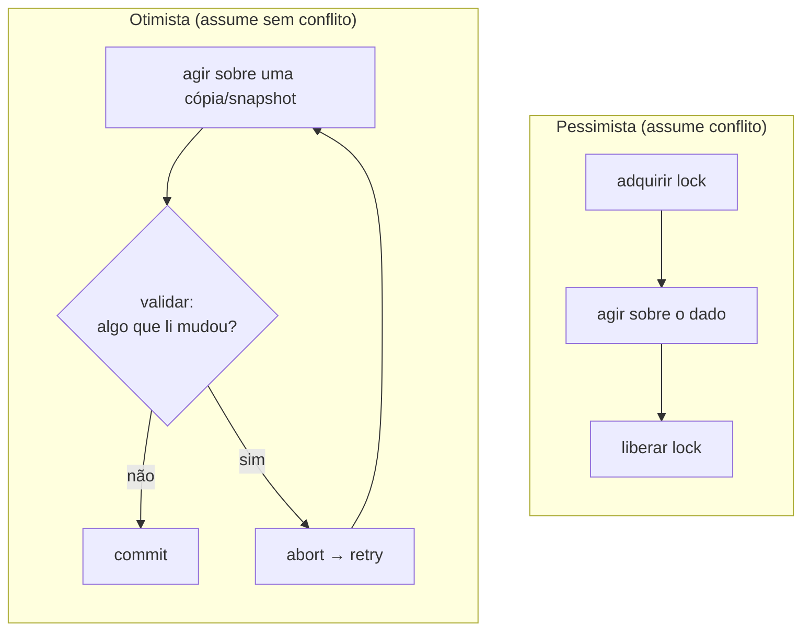
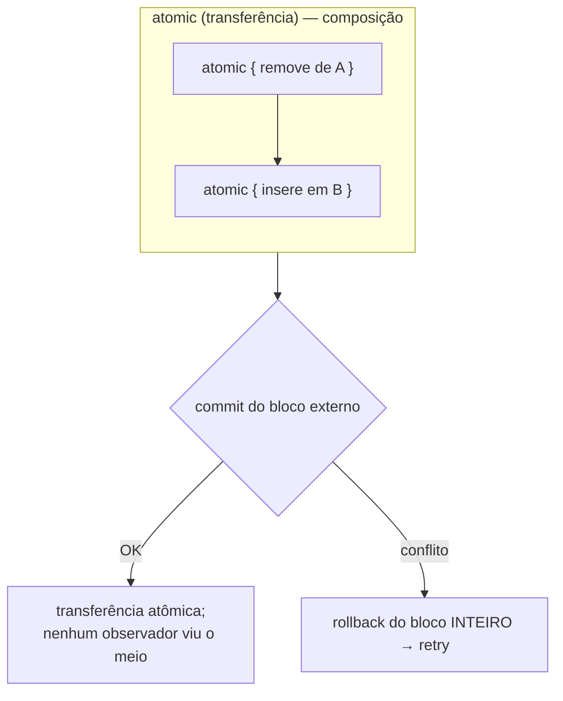
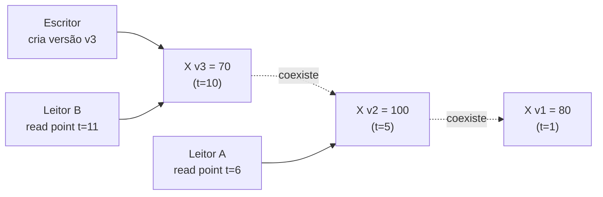
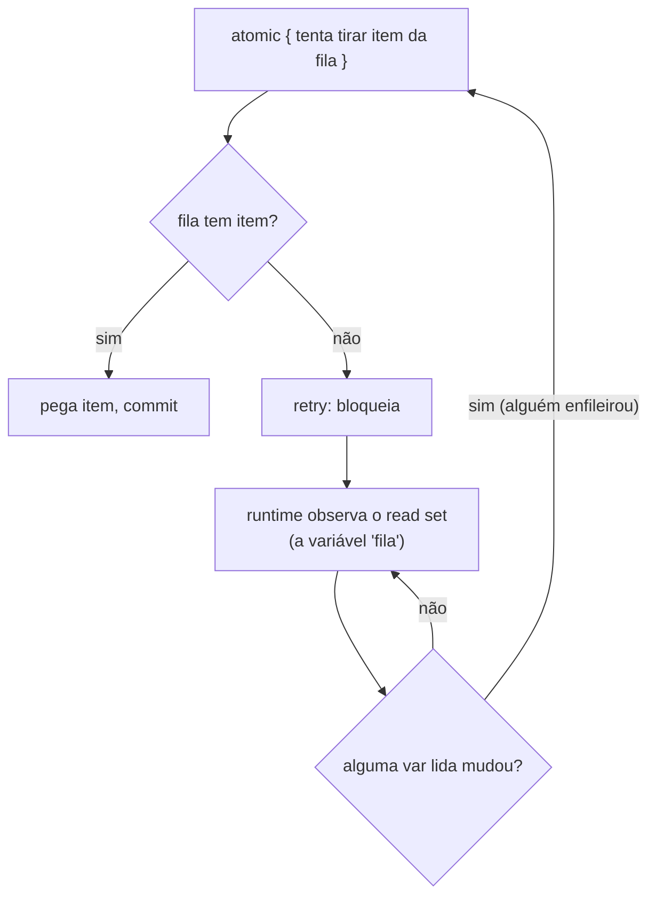
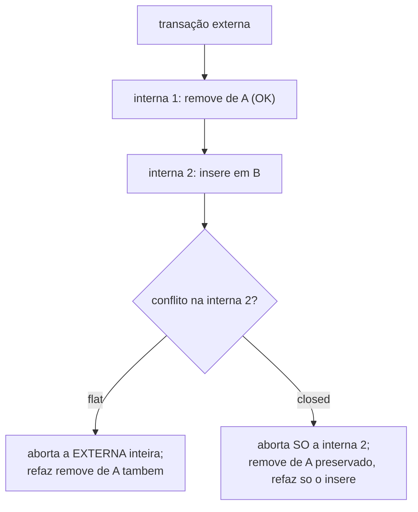

# Memória transacional e otimismo

> [!abstract] Resumo em uma linha
> Em vez de travar antes de acessar (pessimismo), você age livremente e só no fim valida se alguém atrapalhou — se atrapalhou, desfaz e tenta de novo; é o otimismo, e a memória transacional o leva ao extremo trazendo a transação do banco pra dentro da RAM.

Tem duas maneiras de lidar com gente disputando o mesmo dado. A primeira é a que você já conhece: trancar a porta antes de entrar. A segunda é entrar, fazer o que veio fazer, e só na saída conferir se alguém mexeu no que você usou. Essa segunda postura — agir primeiro, validar depois — é o **otimismo**, e ela vira um modelo de programação inteiro quando você lhe dá memória transacional.

Esta nota fecha a fase Adepto da trilha. Ela costura dois fios que já passaram por aqui: o `[[05 - Exclusão mútua - locks, mutexes e monitores|lock pessimista]]` e o `[[08 - Operações atômicas e lock-free|CAS lock-free]]`. O CAS já era otimismo, só que do tamanho de uma palavra de memória. A memória transacional pega o mesmo espírito e o estende a blocos arbitrários de código.

## A analogia que organiza tudo: editar a Wikipédia

Pense em editar um artigo de wiki. Há dois jeitos de a plataforma evitar que duas pessoas se atropelem.

No jeito **pessimista**, ao abrir o artigo pra editar, o sistema o tranca pra você. Ninguém mais edita enquanto você está lá. Você nunca terá conflito — mas todo mundo espera, mesmo que ninguém mais fosse mexer naquela página hoje.

No jeito **otimista** (o que a Wikipédia de fato usa), você edita à vontade, sem trancar nada. Só ao clicar em "salvar" o sistema confere: "a versão que você abriu ainda é a versão atual?" Se sim, salva. Se outra pessoa salvou antes de você, conflito de edição — sua tentativa é rejeitada e você recomeça em cima da versão nova.

Repare na aposta embutida no otimismo: **conflito é raro**. Quando é mesmo raro, ninguém esperou na porta à toa, e o custo do retry ocasional é baratíssimo perto da espera que o pessimismo cobraria de todos. Quando conflito é comum, o otimismo vira um inferno de retries — aí o pessimismo ganha. Guarde esse eixo; ele decide tudo nesta nota.

## O eixo central: pessimista versus otimista

Os dois modelos resolvem o mesmo problema — `[[03 - Estado compartilhado e race conditions|race conditions]]` sobre estado compartilhado — com filosofias opostas sobre quando pagar o custo da coordenação.



Lead-in: o desenho coloca os dois fluxos lado a lado pra você ver onde cada um paga.

Leitura do diagrama: no pessimista (esquerda), o custo está na entrada — `adquirir lock` bloqueia todo mundo antes mesmo de saber se haveria conflito. No otimista (direita), não há bloqueio na entrada; o custo está na saída, no losango de validação. Se a validação passa, você fez tudo sem travar ninguém. Se falha, paga um `abort → retry` e volta ao começo. O pessimista paga sempre um pouco; o otimista paga zero quase sempre e muito de vez em quando.

| Dimensão | Pessimista | Otimista |
|---|---|---|
| Aposta | conflito é provável | conflito é raro |
| Quando coordena | antes de acessar | depois, na validação |
| Custo no caso comum | espera/contenção sempre | praticamente nulo |
| Custo no caso ruim | deadlock, espera longa | retries em cascata |
| Vence quando | contenção alta, escritas concorrentes | leitura pesada, baixa contenção |
| Exemplo | `mutex`, `synchronized` | CAS, MVCC, STM |

Segundo a literatura de controle de concorrência, a regra prática é exatamente essa: alta contenção de escrita, transações curtas e baixa tolerância a retry apontam pro pessimista; cargas com muita leitura e baixa probabilidade de conflito favorecem o otimista ou o MVCC. Sistemas reais frequentemente misturam: MVCC para o caso geral, lock pessimista nas poucas linhas que viram hot-spot.

### O CAS já era otimismo

Reveja `[[08 - Operações atômicas e lock-free]]`: o ciclo `read → compute → compare-and-swap → repeat-on-failure` é otimismo puro. Você lê o valor, calcula o novo, e tenta trocar **só se** o valor ainda for o que você leu. Se não for, alguém mexeu — você descarta o cálculo e refaz. É exatamente o fluxo da direita do diagrama, mas operando sobre uma única palavra de memória.

A pergunta natural: e se eu quiser esse comportamento sobre **várias** variáveis ao mesmo tempo, atômicas como um bloco? CAS só sabe uma palavra. É aí que entra a memória transacional.

## Memória transacional: a transação do banco vai pra RAM

A ideia é roubar um conceito maduríssimo do `[[Banco de Dados]]` — a **transação** — e aplicá-lo a variáveis em memória. Você escreve:

```clojure
;; Clojure: refs + dosync (STM de primeira classe)
(def conta-a (ref 100))
(def conta-b (ref 0))

(dosync
  (alter conta-a - 30)
  (alter conta-b + 30))
;; ou ambas mudam, ou nenhuma. Sem lock explícito.
```

Dentro do bloco transacional, o runtime **registra cada leitura e cada escrita** que você faz — o chamado *read set* e *write set*. As escritas não vão direto pra memória compartilhada; ficam num log privado da transação (atualização diferida). No fim, na hora do **commit**, o runtime valida: "tudo que está no meu read set ainda tem o mesmo valor que tinha quando eu li?" Se sim, ele aplica as escritas de uma vez, atomicamente. Se não — algum dado que você leu mudou debaixo dos seus pés —, ele faz **rollback**: descarta o log privado, volta ao começo do bloco e **tenta de novo**.

> [!note] As mesmas garantias do banco, em escala de nanossegundos
> Atomicidade (tudo ou nada) e isolamento (você não vê o meio de uma transação alheia) são as letras A e I do ACID. A memória transacional traz essas garantias pra dentro do processo, sem que você escreva um único `lock`.

```mermaid
sequenceDiagram
    participant T1 as Transação 1
    participant M as Memória (refs)
    participant T2 as Transação 2
    T1->>M: lê X (=100), registra no read set
    T2->>M: lê X (=100), registra no read set
    T2->>M: commit: X agora = 70
    T1->>M: commit: valida read set
    M-->>T1: X mudou (70 != 100) &rarr; ABORT
    Note over T1: rollback, descarta log privado
    T1->>M: relê X (=70), refaz cálculo
    T1->>M: commit: validação OK
    M-->>T1: aplica escritas
```

Lead-in: aqui está o conflito acontecendo de fato — duas transações leem o mesmo X, uma vence o commit, a outra refaz.

Leitura do diagrama: T1 e T2 leem X=100. T2 commita primeiro e grava X=70. Quando T1 tenta commitar, a validação do read set falha — o X que ela leu não vale mais. T1 não corrompe nada: ela faz rollback, relê o X atual (70) e refaz o cálculo em cima do valor certo. Ninguém viu estado inconsistente; o "perdedor" só pagou uma repetição.

## O argumento decisivo: locks não compõem, transações sim

Aqui está a razão pela qual gente muito séria se empolgou com STM. O problema dos locks não é desempenho — é **composição**.

Suponha que você tenha duas estruturas thread-safe, cada uma com seu lock interno, ambas corretas. Você quer uma operação que "remova de A e insira em B" como uma unidade atômica. Você **não consegue** montar isso só compondo os dois métodos thread-safe: entre o `remove` de A e o `insert` em B existe uma janela onde o item não está em lugar nenhum, visível a outras threads. Para fechar a janela, você precisa de um lock **externo** abraçando as duas operações — e agora precisa conhecer a ordem interna de aquisição de locks de A e de B pra não cair em `[[05 - Exclusão mútua - locks, mutexes e monitores|deadlock]]`. A abstração vazou: você teve que abrir a caixa-preta.

O paper canônico — *Composable Memory Transactions*, de Tim Harris, Simon Marlow, Simon Peyton Jones e Maurice Herlihy (PPoPP 2005) — diz isso com todas as letras: "programas baseados em locks não compõem: fragmentos corretos podem falhar quando combinados." Sistemas com locks são difíceis de compor sem conhecer suas entranhas.

Com transações, a história é outra. Você simplesmente **aninha** dois blocos `atomic` num maior, e o aninhamento dá uma transação maior, atômica, sem você saber nada do que cada bloco faz por dentro.



Lead-in: o bloco externo é uma transação só, mesmo sendo feito de duas internas.

Leitura do diagrama: os dois `atomic` internos viram **um** read/write set unificado do bloco externo. A validação e o commit acontecem uma vez, no fim do `BIG`. Por isso não existe janela intermediária: ou a transferência inteira commita, ou ela inteira faz rollback e refaz. Você compôs duas operações atômicas numa terceira atômica sem tocar nas entranhas de nenhuma — algo, nas palavras do paper, "impossível com programação baseada em locks". E de quebra: liberdade de deadlock, porque não há ordem de aquisição de lock pra errar.

> [!tip] Por que isso importa de verdade
> Composição é o que permite construir software grande a partir de peças pequenas e confiáveis. Locks quebram essa propriedade: a corretude da peça não sobrevive à combinação. Transações preservam a propriedade. Esse é o argumento conceitual mais forte a favor de STM — vale mais que qualquer benchmark.

## MVCC: o paralelo direto com o banco

Como o runtime consegue que **leitores não bloqueiem escritores**? Com multiversão — *Multiversion Concurrency Control* (MVCC), o mesmo princípio de isolamento por snapshot do `[[Banco de Dados]]`.

Em vez de sobrescrever o dado no lugar, cada atualização cria uma **nova versão**. As versões antigas ficam vivas o tempo necessário. Um leitor que começou sua transação enxerga um snapshot consistente do mundo no instante em que começou (seu "read point"), e continua vendo essa versão mesmo enquanto escritores produzem versões novas em paralelo.



Lead-in: várias versões do mesmo X coexistem; cada leitor mira a versão certa pro seu ponto no tempo.

Leitura do diagrama: o escritor cria a versão v3 sem destruir as anteriores. O Leitor A, cujo read point é t=6, enxerga v2 (a versão válida naquele instante) e não é bloqueado pelo escritor. O Leitor B, mais recente (t=11), enxerga v3. Ninguém espera ninguém: leitores não bloqueiam escritores, escritores não bloqueiam leitores. É exatamente assim que a STM do Clojure funciona — MVCC com filas de histórico adaptativas pra dar isolamento por snapshot.

O paralelo com banco é literal. O "bloqueio otimista" clássico de ORM — uma coluna `version` que é checada e incrementada no `UPDATE` — é o mesmo mecanismo da validação de read set, só que persistido em disco. Otimismo no banco e otimismo em memória são o mesmo desenho em escalas diferentes.

## `retry` e `orElse`: STM não é só atomicidade, é espera declarativa

Se você achou que transação serve só pra "tudo ou nada", o STM do Haskell guarda uma segunda surpresa que é, talvez, a parte mais bonita do paper de 2005. Pense num produtor-consumidor: o consumidor quer tirar um item de uma fila, mas a fila está vazia. No mundo dos locks, você resolveria isso com uma *condition variable* — `wait`/`notify`, monitores, toda aquela cerimônia de "espere nesta fila de condição, e lembre quem deve te acordar". É verboso e é fácil de errar (esquecer o `notify`, acordar cedo demais, perder o sinal).

O STM oferece uma primitiva só: **`retry`**. Dentro do bloco `atomic`, se você descobre que ainda não pode prosseguir (a fila está vazia), você chama `retry`. Aí mora a elegância: você **não diz** em que condição quer ser acordado. O runtime já sabe — afinal, ele rastreou seu read set. Então ele simplesmente bloqueia a transação e a religa **quando qualquer variável que você leu mudar**. A condição de despertar é *deduzida* do que você tocou, não declarada à mão.

```haskell
-- Haskell: tirar item de uma fila, bloqueando se vazia
tirarItem :: TVar [a] -> STM a
tirarItem fila = do
  xs <- readTVar fila        -- leitura registrada no read set
  case xs of
    []       -> retry         -- vazia: bloqueia até 'fila' mudar
    (x:rest) -> do
      writeTVar fila rest
      return x
-- nenhum wait/notify, nenhuma condition variable. A espera "sabe"
-- que depende de 'fila' porque foi 'fila' que a transação leu.
```

> [!tip] A espera vira consequência da leitura, não código separado
> Com condition variable, "o que eu leio" e "em que condição eu acordo" são duas coisas que você mantém em sincronia na unha — e que divergem em silêncio quando o código cresce. Com `retry`, são a mesma coisa: você acorda exatamente quando muda algo que você leu. Bug de sinal perdido deixa de existir por construção.

A segunda primitiva é **`orElse`**, que compõe transações como **alternativas**. `orElse t1 t2` roda `t1`; se `t1` chamar `retry`, ele é descartado e `t2` roda no lugar. Se `t2` também der `retry`, a transação inteira espera. Isso te deixa "esperar por várias coisas ao mesmo tempo" — tipo o `select` do Unix, com uma diferença que o paper faz questão de cravar: **`select` não compõe, `orElse` sim**. Você empilha alternativas sem refazer a lógica de cada uma.



Lead-in: o desenho mostra a espera bloqueante do `retry` — repare que ninguém precisou escrever um `notify`.

Leitura do diagrama: a transação tenta tirar item; se a fila está vazia, chama `retry` e bloqueia. O runtime não fica em *busy-wait* — ele observa o read set (a variável da fila que a transação leu) e só religa quando algo ali mudar. Quando outra thread enfileira um item, a variável muda, a transação acorda e refaz do começo. Compare com o `[[06 - Semáforos e coordenação|wait/notify de uma condition variable]]`: lá, quem produz tem a obrigação de sinalizar o consumidor certo; aqui, o despertar é automático e deduzido. Menos código, menos bug.

## As quatro estratégias de coordenação (fechamento da fase Adepto)

Você chegou ao fim da fase Adepto tendo visto quatro maneiras fundamentalmente distintas de várias threads conviverem com dados. Vale alinhá-las num quadro só — porque a pergunta de entrevista raramente é "o que é um mutex", e quase sempre é "dado este cenário, qual abordagem?".

| Eixo | Locks (pessimista) | CAS / lock-free (otimista baixo nível) | STM (otimista alto nível) | Atores / confinamento |
|---|---|---|---|---|
| Coordena como | trancando antes de acessar | tentar-e-trocar 1 palavra, refazer se falhou | log de read/write set, validar no commit, refazer | não compartilha estado; troca mensagens |
| Granularidade | bloco crítico que você delimita | uma palavra de memória | bloco `atomic` arbitrário | um ator dono do seu próprio estado |
| Compõe? | **não** (combinar 2 corretos pode dar errado; precisa lock externo + ordem global) | mal (compor 2 CAS exige protocolos sutis, ABA, etc.) | **sim** (aninhar blocos `atomic`; é o argumento-chave) | **sim** (atores se aninham; um ator usa outros sem saber das entranhas) |
| Custo dominante | espera/contenção sempre; risco de deadlock | retry sob contenção; cuidado com ABA | overhead de rastreamento + retry; I/O irreversível | latência de mensagem; serialização por ator vira gargalo |
| Quando | alta contenção de escrita, seção curta | contadores, pilhas, filas muito quentes | quer composição e código declarativo, conflito raro | estado naturalmente particionável, distribuído |

Os dois primeiros já foram a fundo em `[[05 - Exclusão mútua - locks, mutexes e monitores]]` e `[[08 - Operações atômicas e lock-free]]`; o quarto é o assunto de `[[13 - O modelo de atores]]`, na fase Magus. Repare na coluna que mais importa: **"compõe?"**. Lock é o único que diz "não" sem ressalva — e essa é a razão filosófica de existirem os outros três. STM resolve a composição mantendo estado compartilhado; atores resolvem a composição **abolindo** o estado compartilhado. Duas saídas opostas pro mesmo beco.

> [!summary] O mapa mental da fase inteira
> Pense num eixo de "quanto eu confio que dá tudo certo". No extremo desconfiado mora o **lock**: tranca antes, não arrisca. Um passo adiante, o **CAS** aposta que ninguém mexeu numa palavra e refaz se errou. Mais adiante, o **STM** estende essa aposta a um bloco inteiro de código e ganha composição de quebra. E na ponta oposta ao lock está o **ator**, que não precisa confiar em nada porque não divide nada — não há conflito quando não há estado comum. Os quatro respondem à mesma pergunta ("como threads convivem com dados?") com graus diferentes de otimismo e de compartilhamento. Saber escolher entre eles, dado o cenário, é metade do que uma entrevista de concorrência testa.

## Custos e limites: por que STM não dominou

Se STM compõe, evita deadlock e tem um modelo mental lindo, por que não está em todo lugar? Por causa de três custos reais.

**Overhead de rastreamento.** Cada leitura e escrita dentro do `atomic` precisa ser registrada e, no commit, validada. Isso não é grátis. Comparado a um campo simples ou a um CAS único, a contabilidade do read/write set pesa — especialmente em transações grandes.

**Retry sob contenção.** O otimismo só compensa se conflito for raro. Numa estrutura muito disputada, transações abortam e refazem repetidamente, queimando CPU. Aqui o otimismo perde feio pro lock pessimista — o mesmo trade-off do `[[08 - Operações atômicas e lock-free|livelock em lock-free]]`.

**O calcanhar de Aquiles: efeitos colaterais irreversíveis.**

> [!warning] I/O não dá rollback
> Uma transação pode ser abortada e refeita a qualquer momento. Tudo bem se ela só mexeu em memória — o runtime desfaz. Mas se dentro do `atomic` você enviou um e-mail, gravou num arquivo, debitou um cartão ou disparou um míssil, **não há rollback possível**. Se a transação refizer três vezes, o e-mail sai três vezes. Por isso STMs sérias proíbem ou restringem I/O e chamadas externas dentro de transações. Essa é a limitação que mais atrapalhou a adoção: o mundo real está cheio de efeitos que não se desfazem.

> [!example] A solução de tipos do Haskell
> Haskell fecha esse buraco na raiz: a mônada `STM` simplesmente **não tem** a operação que faz I/O (essa vive na mônada `IO`). O sistema de tipos te impede de chamar `putStrLn` ou `launchMissiles` dentro de `atomically`. O compilador rejeita o programa. É o calcanhar de Aquiles transformado em garantia estática — só que ao custo de exigir a disciplina monádica, que não existe na maioria das linguagens.

### Atomicidade fraca versus forte: o perigo de misturar acessos

Há uma pergunta sutil que separa um STM "de brinquedo" de um sério. Uma transação se isola **de quem**? Se ela se isola só de outras transações — mas código comum, fora de qualquer `atomic`, consegue ler e escrever as mesmas variáveis sem barreira nenhuma —, isso é **atomicidade fraca** (*weak atomicity*). Se ela se isola de tudo, transacional ou não — cada instrução fora de transação se comporta como uma microtransação solitária —, é **atomicidade forte** (*strong atomicity*).

A maioria dos STMs por software implementa atomicidade fraca, e o motivo é puro custo: garantir atomicidade forte obriga o compilador a instrumentar **todo** acesso a memória do programa, transacional ou não, com barreiras caras — não só os que estão dentro de `atomic`. A conta fica proibitiva.

> [!danger] O bug que só aparece quando você mistura
> Sob atomicidade fraca, se uma thread acessa uma variável **dentro** de uma transação e outra thread acessa **a mesma variável fora** de qualquer transação, o STM não te protege: o código não-transacional pode ver o estado pela metade da transação, ou pisar nas escritas dela. A garantia bonita de "tudo ou nada" só vale entre transações. Misturar acesso transacional e não-transacional à mesma variável é, sob semântica fraca, um caminho garantido pra corrupção silenciosa — e o tipo de bug que não reproduz em teste.

A regra de bolso: sob atomicidade fraca, trate uma variável como "ou sempre transacional, ou nunca". Não fique no meio do caminho. (Em Haskell, de novo, o tipo `TVar` só é acessível dentro de `STM`, então a pergunta nem chega a se colocar — a linguagem força "sempre transacional".)

Um jeito de pensar a semântica forte: imagine que existe **um lock global gigante** e que toda instrução do programa — dentro ou fora de transação — tem que segurá-lo por um instante. Essa é a intuição da *single-lock atomicity*. É um modelo mental limpíssimo de raciocinar, mas instrumentar cada `int x = y` do programa com a barreira que sustenta essa ilusão é justamente o que torna a atomicidade forte cara demais em software puro. A semântica fraca é o atalho de quem aceita pagar com bugs sutis na fronteira transacional o que economizou em barreiras.

### Transações aninhadas: do que depende a composição

Eu disse lá em cima que você "aninha" blocos `atomic` e ganha um maior. Vale destrinchar o que acontece de fato quando uma transação roda dentro de outra — porque a composição que vendi como argumento-chave **depende** de qual modelo de aninhamento o runtime usa. Há três.

| Modelo | O que faz | No abort da interna |
|---|---|---|
| **Flat** (achatado) | ignora a transação interna; tudo vira uma transação gigante única | a interna abortando **aborta a externa inteira**; sem rollback parcial; muito trabalho refeito |
| **Closed** (fechado) | a interna tem seu próprio escopo, mas só publica ao commitar a externa | a interna pode abortar e refazer **sozinha** (rollback parcial), poupando o trabalho da externa |
| **Open** (aberto) | a interna, ao commitar, libera seu isolamento na hora, antes da externa | mais paralelismo, porém quebra o "tudo ou nada"; precisa de ação compensatória se a externa abortar depois |

Lead-in da tabela: a diferença entre os três está toda em o que sobrevive quando a transação interna falha.

Para a **composição** que é o coração desta nota, o modelo importa. No **flat nesting**, compor funciona pra correção (o resultado é atômico), mas é ineficiente: um conflito lá no fundo joga fora a transação inteira. No **closed nesting**, você compõe E ganha rollback parcial — só a sub-transação que conflitou refaz, e o resto do trabalho da transação externa se preserva. É o melhor dos mundos pra software composto a partir de peças. O **open nesting** troca isolamento por paralelismo e só vale a pena pra casos especiais (tipo liberar cedo um contador interno), ao custo de você ter que escrever a lógica de compensação na mão — o que reintroduz parte da complexidade que o STM prometia esconder.

Volte ao exemplo da transferência "remove de A, insere em B". Sob **flat**, se o `insere em B` conflitar perto do fim, o `remove de A` que já tinha funcionado é jogado fora junto e refeito do zero — corretíssimo, só desperdiçado. Sob **closed**, idealmente só a parte conflitante refaria. É por isso que dizer "transações compõem" é meia verdade até você fixar o modelo de aninhamento: a *correção* da composição é garantida em qualquer um dos três, mas a *eficiência* dela — quanto trabalho você refaz num conflito — é justamente o que separa um STM ingênuo de um bom.



Lead-in: o mesmo conflito, dois desfechos — é a diferença entre jogar fora tudo e jogar fora só o pedaço errado.

Leitura do diagrama: a transação externa roda duas internas; a segunda conflita. No caminho **flat**, o runtime não tem como isolar a interna 2, então aborta a externa inteira e refaz até o `remove de A` que já tinha dado certo. No caminho **closed**, a interna 2 aborta sozinha e refaz, enquanto o trabalho da interna 1 fica preservado. Mesma corretude no fim; trabalho refeito completamente diferente. Em transações longas e compostas, essa diferença é o que decide se o otimismo do STM ainda compensa sob alguma contenção.

### E o hardware? HTM e a saga do Intel TSX

Houve a aposta de fazer isso em **hardware** — *Hardware Transactional Memory* (HTM) —, com o cache da CPU servindo de read/write set e o commit acontecendo atomicamente. A Intel lançou o **TSX** na microarquitetura Haswell em 2013. A história foi acidentada:

- **2014**: um bug de implementação no TSX do Haswell e início do Broadwell forçou a Intel a **desabilitá-lo** via microcódigo.
- **2019–2021**: vulnerabilidades de canal lateral (TSX Asynchronous Abort, TAA, parente do ZombieLoad) levaram a Intel a, em junho de 2021, **desabilitar o TSX por padrão** em famílias de Skylake a Whiskey Lake.

Hoje o TSX sobrevive só em parte da linha Xeon. A moral: HTM é elegante no papel, mas o caminho real foi cheio de erratas e brechas de segurança — mais um motivo pra memória transacional ter ficado em nicho.

### O veredito honesto: ótima ideia, nicho na prática

Vale juntar as peças e dizer a verdade sem romantismo. Em 2008, um grupo da IBM publicou um artigo de título cruel — *Software Transactional Memory: Why Is It Only a Research Toy?* — que mediu STMs reais sob cargas grandes e concluiu que, mesmo com 8 threads, **nenhuma delas superava o próprio overhead** em benchmarks como o `vacation`. Eles apontaram quatro gargalos: conflitos falsos, **sobre-instrumentação** (o compilador insere barreiras redundantes por excesso de conservadorismo), o custo de tornar dados privados de forma segura, e amortização ruim. A promessa do STM, escreveram, era provavelmente solapada pelos seus custos e pela aplicabilidade limitada das cargas.

Some a isso o que esta nota já levantou: o I/O irreversível, que limita o que pode morar dentro de uma transação; a interação ruim com **código legado mutável** (atomicidade fraca não te protege quando o resto do programa não foi escrito em transações, e reescrever tudo não é opção); e o HTM, que era a esperança de pagar o overhead em silício e simplesmente não entregou — desabilitado por erratas e furos de segurança.

> [!quote] A lição que vale a entrevista
> STM é o caso clássico de **ideia conceitualmente vencedora que perdeu na engenharia**. O modelo mental é superior — composição, ausência de deadlock, declaratividade. Mas o custo de instrumentar memória, a praga do I/O e o atrito com código existente a empurraram pro nicho funcional.
>
> E aqui está a reviravolta: **o otimismo venceu — só que em outros lugares**. O MVCC é o coração do PostgreSQL e de quase todo banco sério. O *optimistic locking* por coluna `version` é pão-com-manteiga de qualquer ORM. As estruturas lock-free baseadas em CAS estão no `java.util.concurrent` que você usa todo dia. A aposta "aja primeiro, valide depois" ganhou em escala massiva — apenas não na forma de um bloco `atomic` genérico em memória. O conceito de STM era o destino certo; o veículo é que era o errado. Conecte sempre ao `[[Banco de Dados]]`: é lá que o otimismo dele realmente mora e prospera.

## Onde a memória transacional de fato vive

STM como cidadão de primeira classe aparece em algumas linguagens, quase sempre as de inclinação funcional (estado imutável combina com transações):

- **Clojure** — `ref` + `dosync`/`alter`, STM com MVCC embutida no runtime. O caso mais maduro e usado.
- **Haskell** — a mônada `STM` com `TVar` e `atomically`; o sistema do paper de 2005. O sistema de tipos *garante* que I/O não entre numa transação — a linguagem fecha o calcanhar de Aquiles na raiz.
- **Scala** — bibliotecas como ScalaSTM (e a STM histórica do Akka).

Na maioria das stacks mainstream (Java incluído — veja `[[03-Dominios/Tecnologia/Java/Concorrência e paralelismo/index|Concorrência (Java)]]`), você não programa com `atomic` no dia a dia. Mas o **conceito** ilumina coisas que você usa o tempo todo: o otimismo do CAS, o `version` do ORM, o snapshot do PostgreSQL. Saber STM é entender o princípio que está por trás de todos eles.

## Em entrevista

Optimistic concurrency assumes conflicts are rare: you act without locking and validate at commit time — if something you read changed, you roll back and retry. Pessimistic concurrency assumes conflicts are likely and locks before access; it wins under high write contention, while optimistic wins on read-heavy, low-conflict workloads. Software transactional memory brings the database notion of a transaction into RAM: an `atomic` block whose reads and writes the runtime tracks, validating the read set at commit and rolling back on conflict. The killer argument for STM is composability — locks don't compose (combining two thread-safe methods isn't thread-safe; you need an external lock and risk deadlock), whereas you can nest `atomic` blocks into a larger atomic one. Haskell's STM goes further with `retry` and `orElse`: `retry` blocks the transaction until something it read changes — declarative waiting with no manual condition variable, since the runtime already knows your read set — and `orElse` composes transactions as alternatives, like `select` but composable. MVCC is how readers avoid blocking writers: each transaction sees a consistent snapshot, the same snapshot-isolation idea used by databases. A subtle correctness point is weak versus strong atomicity: most software STMs give only weak atomicity (transactions are isolated from other transactions but not from plain non-transactional code), so mixing transactional and non-transactional access to the same variable can corrupt state. The big practical limitation is irreversible side effects — I/O can't be rolled back, so it can't safely live inside a transaction that may retry. Hardware TM (Intel TSX) promised this in silicon but was largely disabled after errata and side-channel vulnerabilities. The honest verdict: STM is a conceptually winning idea that lost on engineering — instrumentation overhead, the I/O problem, and friction with mutable legacy code kept it niche (mostly Clojure, Haskell, Scala) — but optimism itself won elsewhere, in database MVCC, ORM optimistic locking, and CAS-based lock-free structures.

### Vocabulário

- bloqueio otimista → optimistic locking
- bloqueio pessimista → pessimistic locking
- memória transacional → transactional memory
- transação → transaction
- reversão / desfazer → rollback
- composável → composable
- controle de concorrência multiversão → multiversion concurrency control (MVCC)
- conjunto de leitura/escrita → read set / write set
- isolamento por snapshot → snapshot isolation
- contenção → contention
- atomicidade fraca / forte → weak / strong atomicity
- transação aninhada → nested transaction
- bloqueio declarativo → declarative blocking
- repetir / compor alternativas → retry / orElse

> [!info] Lastro
> - Harris, Marlow, Peyton Jones, Herlihy — [Composable Memory Transactions (PPoPP 2005)](https://www.microsoft.com/en-us/research/wp-content/uploads/2005/01/2005-ppopp-composable.pdf) — o argumento de que locks não compõem e transações sim; `retry` e `orElse` como espera declarativa e composição de alternativas.
> - [Control.Monad.STM — Hackage](https://hackage.haskell.org/package/stm-2.5.0.0/docs/Control-Monad-STM.html) — a API real: `retry` bloqueia até o read set mudar, `orElse` compõe alternativas (como `select`, só que composável).
> - [Software transactional memory — Wikipedia](https://en.wikipedia.org/wiki/Software_transactional_memory) — read/write set, abort, retry, atomicidade fraca vs forte, aninhamento.
> - [Subtleties of Transactional Memory Atomicity Semantics — Blundell, Lewis, Martin (2006)](https://acg.cis.upenn.edu/papers/cal06_atomic_semantics.pdf) — weak vs strong atomicity e os bugs de misturar acesso transacional e não-transacional.
> - [Supporting Nested Transactional Memory in LogTM — Moravan et al. (ASPLOS 2006)](https://research.cs.wisc.edu/multifacet/papers/asplos06_nested_logtm.pdf) — flat, closed e open nesting; rollback parcial.
> - [Cascaval et al. — Software Transactional Memory: Why Is It Only a Research Toy? (ACM Queue 2008)](https://queue.acm.org/detail.cfm?id=1454466) — o post-mortem: sobre-instrumentação, conflitos falsos, overhead não amortizado.
> - [Clojure — Refs and Transactions](https://clojure.org/reference/refs) — STM de primeira classe com MVCC; leitores não bloqueiam escritores.
> - [Optimistic vs. Pessimistic Locking — Vlad Mihalcea](https://vladmihalcea.com/optimistic-vs-pessimistic-locking/) — quando cada estratégia vence.
> - [Transactional Synchronization Extensions — Wikipedia](https://en.wikipedia.org/wiki/Transactional_Synchronization_Extensions) — histórico das erratas e desabilitação do Intel TSX.

## Veja também

- `[[05 - Exclusão mútua - locks, mutexes e monitores]]` — o lado pessimista do eixo; por que locks não compõem.
- `[[08 - Operações atômicas e lock-free]]` — CAS, o otimismo no tamanho de uma palavra.
- `[[03 - Estado compartilhado e race conditions]]` — o problema que ambos os modelos resolvem.
- `[[18 - Concorrência em entrevista]]` — consolidação dos trade-offs pra entrevista.
- `[[Banco de Dados]]` — de onde vem a transação, o isolamento por snapshot e o bloqueio otimista por versão.
- `[[03-Dominios/Ciência/Concorrência e Paralelismo/index|Concorrência e Paralelismo]]` — índice da trilha.
