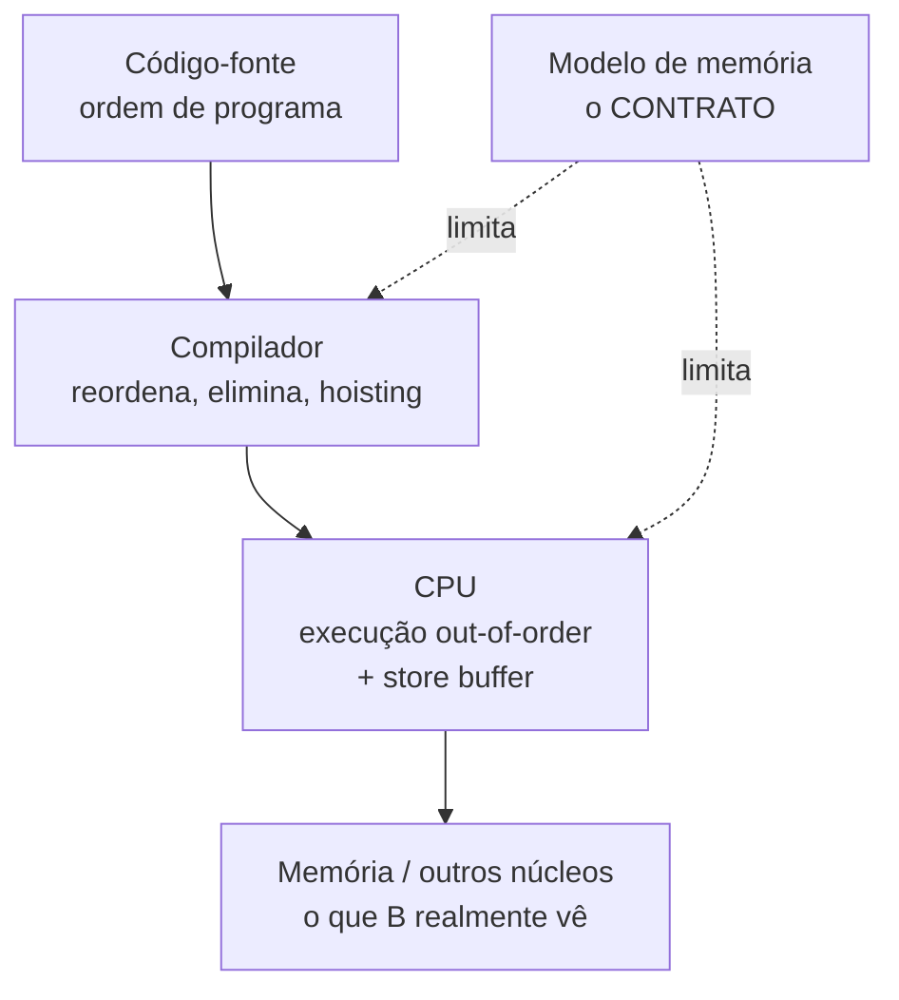
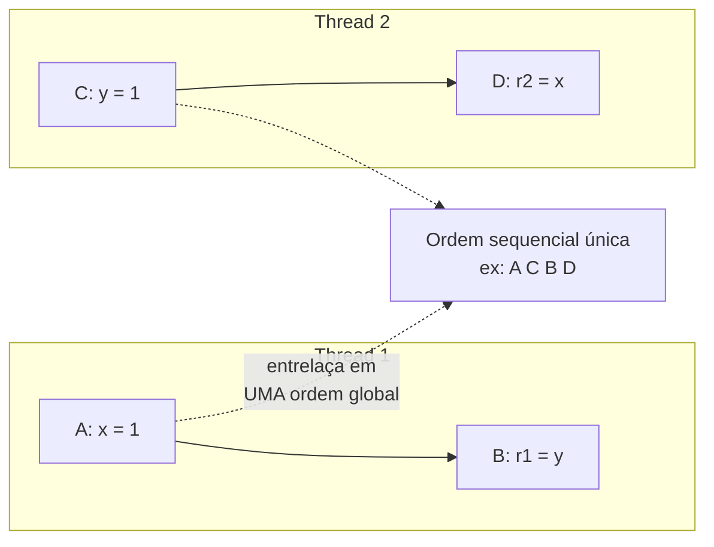
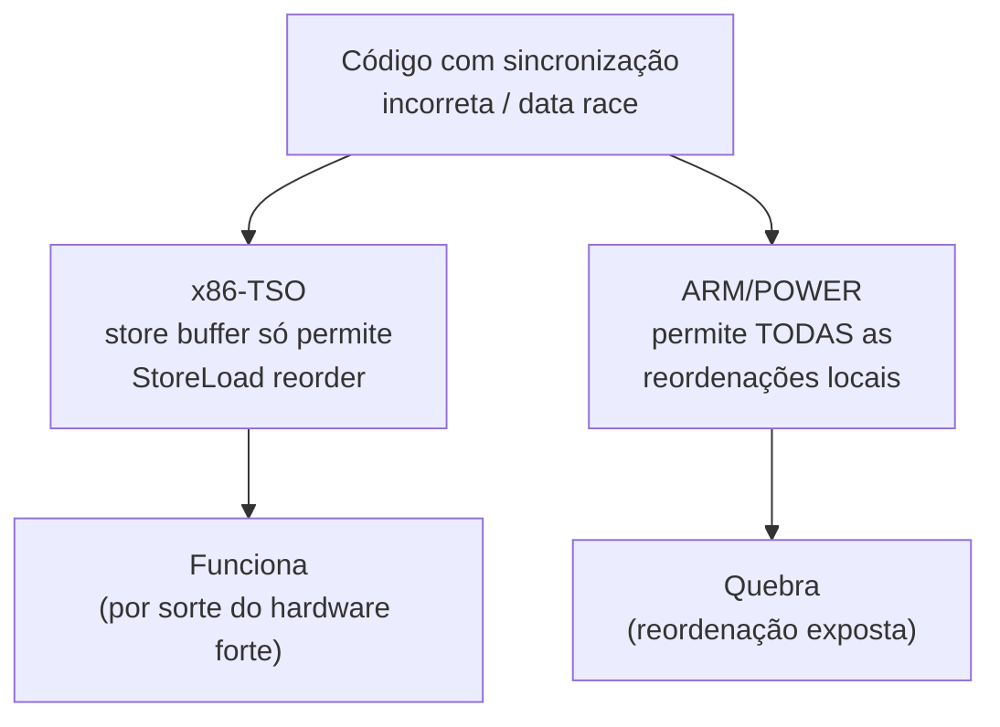
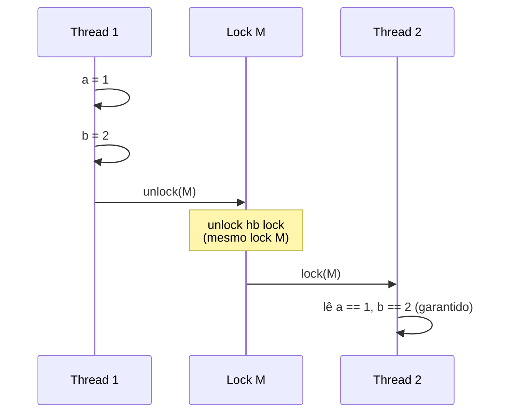
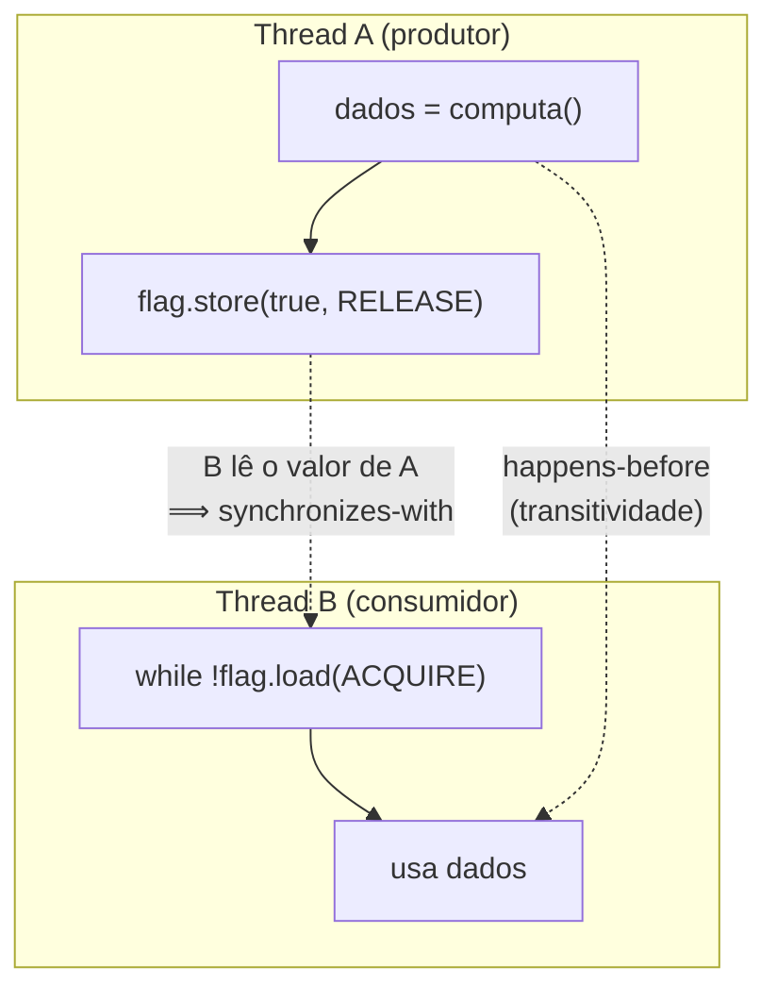
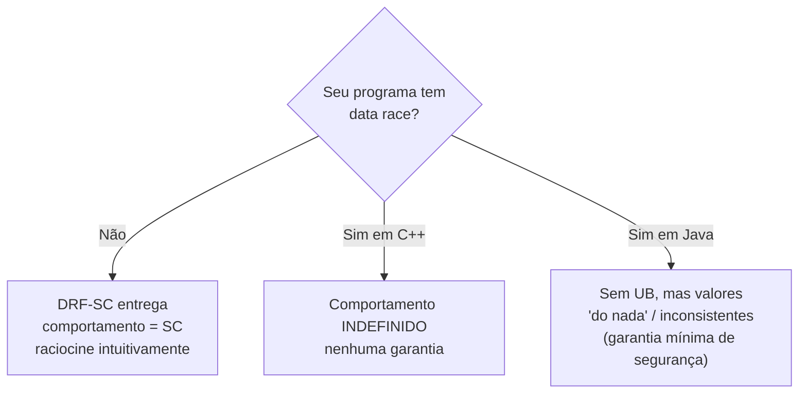

# Modelos de memória e consistência

> [!abstract] Resumo em uma linha
> Um modelo de memória é o contrato que diz o que o compilador e a CPU podem reordenar e quando uma escrita de uma thread fica visível para outra — e _happens-before_ é a linguagem desse contrato.

Na nota [[04 - Atomicidade, visibilidade e ordenação]] você viu os três fantasmas da concorrência: atomicidade, visibilidade e ordenação. Lá eu prometi que eles tinham um nome formal e uma teoria por trás. Esta é a nota dessa teoria.

A pergunta central é desconfortável: **quando a thread A escreve `x = 1`, quando — se é que algum dia — a thread B vê esse `1`?**

A resposta ingênua é "imediatamente". A resposta real é "não há resposta sem um contrato". E esse contrato tem nome: **modelo de memória** (_memory model_).

## A analogia das testemunhas

Imagine um acidente numa esquina movimentada. Cinco testemunhas. Você pergunta a ordem dos eventos.

A testemunha 1 diz: "o carro buzinou, depois freou". A testemunha 2: "freou, depois buzinou". As duas estão honestas. Cada uma estava num ponto diferente, e o som da buzina e a luz da freada chegaram a elas em ordens diferentes.

Agora a pergunta jurídica: **existe uma versão oficial da história?** Um relato único, costurado, em que todos concordam com a sequência?

Esse é exatamente o dilema das threads.

- Cada thread é uma testemunha.
- Cada núcleo de CPU tem o seu próprio ponto de vista (caches, buffers).
- A "versão oficial" é a **consistência sequencial** — e ela é cara de manter.
- O **modelo de memória relaxado** é o tribunal pragmático que aceita: "alguns fatos podem ser fofocados fora de ordem, desde que você não tivesse jurado segredo sobre eles".

> [!question] Por que isto importa para você, programador?
> Porque o seu código-fonte é uma sugestão, não uma ordem. O compilador reordena. A CPU reordena. Sem um modelo de memória, você não tem como saber quais reordenações são legais — e o seu código concorrente funcionaria por sorte.

## Por que um modelo de memória precisa existir

Considere este trecho, executado por uma thread:

```c
a = 1;   // (1)
b = 2;   // (2)
flag = true;  // (3)
```

Da perspectiva de _uma_ thread, a ordem (1) → (2) → (3) é irrelevante: o resultado final é o mesmo. Então o compilador se sente livre para reordenar (1) e (2). A CPU, idem, via _out-of-order execution_ e _store buffers_. Isso é otimização legítima e brutalmente importante para performance.

O problema aparece quando **outra thread observa**:

```c
while (!flag) { }   // espera (3)
print(a, b);        // espera ver 1, 2
```

Se a CPU deixou `flag = true` escapar para a memória _antes_ de `a = 1`, a segunda thread vê `flag` verdadeira mas `a` ainda velho. O contrato implícito do programador ("se a flag subiu, os dados estão prontos") foi quebrado — silenciosamente, sem erro, sem crash, só um resultado errado de vez em quando.

> [!danger] O ponto central
> O compilador e a CPU otimizam assumindo **código sequencial de uma thread**. Eles preservam a ilusão de ordem _para a thread que executa_, não para quem observa de fora. O modelo de memória é o documento que define onde essa ilusão termina.

Um modelo de memória responde a três perguntas, nesta ordem de dificuldade:

1. **O que pode ser reordenado?** (compilador e hardware)
2. **Quando uma escrita se torna visível a outra thread?**
3. **Quais garantias o programador pode exigir, e com qual sintaxe (`volatile`, `atomic`, `lock`)?**



Leitura do diagrama: a ordem que você escreve não é a ordem que executa, nem a ordem que outra thread observa. O modelo de memória (à esquerda, tracejado) é a única coisa que restringe as duas camadas de reordenação. Sem ele, as setas pretas seriam um vale-tudo.

## Consistência sequencial: o ideal de Lamport

Em 1979, Leslie Lamport definiu o modelo que captura nossa intuição. Um multiprocessador é **sequencialmente consistente** (SC) se:

> o resultado de qualquer execução é o mesmo que se as operações de todos os processadores tivessem sido executadas em _alguma_ ordem sequencial, e as operações de cada processador individual aparecem nessa sequência na ordem especificada pelo seu programa.

Decomponha a frase, porque cada metade carrega um requisito:

- **"alguma ordem sequencial"** — existe _uma_ linha do tempo global única, um único entrelaçamento (_interleaving_) das operações de todas as threads. A versão oficial da história existe.
- **"na ordem do seu programa"** — dentro dessa linha do tempo, a sequência de cada thread é preservada. Ninguém embaralha as suas próprias operações.

É o modelo mais intuitivo que existe para raciocinar sobre corretude de programas concorrentes, algoritmos e estruturas de dados. É o que você _acha_ que o hardware faz.

> [!example] O entrelaçamento de SC
> Threads T1 (`A; B`) e T2 (`C; D`). SC permite qualquer ordem global que preserve `A<B` e `C<D`: por exemplo `A C B D`, ou `C D A B`, ou `A B C D`. SC **proíbe** `B A ...` (violou a ordem de T1) e proíbe que T1 e T2 vejam ordens globais _diferentes_.



Leitura do diagrama: SC costura as operações das duas threads numa única fita, respeitando as setas internas de cada uma. A consequência famosa: sob SC, é **impossível** que `r1 == 0` e `r2 == 0` ao mesmo tempo neste exemplo (o teste de Dekker), porque uma das escritas tem que vir antes da leitura correspondente em qualquer entrelaçamento.

E é exatamente esse "impossível" que o hardware real **viola**.

> [!warning] Por que SC não é o default
> SC é caro. Garantir uma ordem global única proíbe reordenações que valem performance — especialmente o _store buffer_, em que a CPU adia escritas para não esperar a memória. Manter SC obrigaria a CPU a drenar o buffer (uma barreira) a cada acesso. Ninguém topa esse preço. Por isso o hardware entrega algo mais fraco e cobra de você as barreiras quando precisar de ordem.

## Consistência relaxada: o que o hardware real entrega

O hardware real não dá SC de graça. Ele dá um modelo **relaxado**, em que certas reordenações são permitidas por padrão. E aqui mora a armadilha que pega gente sênior: **modelos relaxados não são todos iguais**.

### x86-TSO: relativamente forte

O x86 implementa _Total Store Order_ (TSO). A garantia: as escritas (_stores_) são vistas por todos os núcleos na ordem em que foram emitidas. O TSO **não** permite reordenação local — exceto uma: uma leitura pode ser adiantada na frente de uma escrita anterior a um endereço diferente (reordenação _StoreLoad_).

A causa é o _store buffer_: a escrita fica no buffer do núcleo enquanto a leitura seguinte já vai à memória. Por isso o teste de Dekker acima _pode_ dar `r1 == 0 && r2 == 0` no x86 — a única violação de SC que o TSO admite.

> [!info] TSO é "quase SC"
> Na prática, TSO é forte o suficiente para que muito código concorrente _ingênuo_ funcione no x86 sem barreiras explícitas. Isso cria uma falsa sensação de segurança. O código não está correto — ele está sortudo por rodar num hardware forte.

### ARM e POWER: fracos

ARM e POWER são consideravelmente mais fracos que o x86-TSO. O modelo conceitual: cada processador lê e escreve na sua própria cópia da memória, e cada escrita se propaga aos outros núcleos de forma **independente**, com reordenação permitida durante a propagação. Threads de hardware podem ler e escrever fora de ordem, ou até especulativamente. **Qualquer reordenação local é permitida, a menos que você proíba explicitamente.**

O ganho é implementação mais simples e melhor performance quando você _não_ precisa de ordem. Medições mostram que o TSO é em média cerca de 9% mais lento que a ordenação fraca do ARM. O custo é jogado no seu colo: para hardware fraco, o compilador precisa emitir barreiras para forçar a ordem que você quer.

| Reordenação | x86-TSO | ARM / POWER |
|---|---|---|
| Store → Store | proibida | permitida |
| Load → Load | proibida | permitida |
| Load → Store | proibida | permitida |
| Store → Load (endereços ≠) | **permitida** | permitida |
| Propagação de escrita | atômica (todos veem na mesma ordem) | independente por núcleo |
| Custo relativo | ~9% mais lento | baseline |

> [!danger] Por que o mesmo código quebra ao migrar de x86 para ARM
> Um programa C++ com data race ou com sincronização incorreta pode rodar anos no x86 porque o TSO mascara o bug. Recompile para ARM (Apple Silicon, Graviton, mobile) e o modelo fraco expõe a reordenação que o TSO escondia. O programa não "ficou bugado no ARM" — ele **sempre esteve errado**; o x86 era cúmplice.



Leitura do diagrama: o mesmo defeito de origem segue dois caminhos. O x86 estreita o leque de reordenações e o bug raramente se manifesta; o ARM abre o leque e o bug aparece. A lição: não confie em testes no x86 para validar concorrência que vai rodar em ARM.

## Happens-before: o conceito central

Aqui está o ponto de viragem da nota. Tudo o que veio antes — SC, TSO, ARM — é descrição de _hardware_. O programador não quer pensar em store buffers. Ele quer uma **regra de alto nível** que diga: "se eu fizer isto, a thread B garantidamente verá aquilo".

Essa regra é a relação **happens-before** (acontece-antes), uma ordem _parcial_ sobre as operações do programa.

> [!abstract] A definição que vale ouro
> Se a operação **A** _happens-before_ a operação **B**, então os efeitos de A são **visíveis** a B, e A está **ordenada** antes de B. Se A e B _não_ estão relacionadas por happens-before, o modelo de memória não promete nada sobre a ordem ou visibilidade entre elas.

Repare em duas palavras: **parcial** e **nada**.

- **Parcial**: nem todo par de operações está ordenado. Operações não relacionadas podem rodar em qualquer ordem, e tudo bem.
- **Nada**: a ausência de happens-before é uma autorização para o caos. Se você quer garantia, precisa _estabelecer_ happens-before.

Como se estabelece happens-before? Por **ações de sincronização**:

- **Ordem de programa**: dentro de uma thread, A antes de B no código ⟹ A happens-before B.
- **_unlock_ → _lock_**: liberar um lock happens-before a próxima aquisição do _mesmo_ lock.
- **_volatile_ write → _volatile_ read**: escrever uma variável volátil happens-before toda leitura subsequente da _mesma_ variável.
- **`thread.start()`**: a chamada happens-before tudo que a thread iniciada executa.
- **`thread.join()`**: tudo que a thread fez happens-before o retorno do join.
- **Transitividade**: se A hb B e B hb C, então A hb C. É isto que faz a relação encadear visibilidade através de pontos de sincronização.



Leitura do diagrama: dentro de T1, `a=1` e `b=2` happens-before o `unlock` (ordem de programa). O `unlock(M)` happens-before o `lock(M)` de T2 (regra do lock). Por transitividade, `a=1` e `b=2` happens-before tudo o que T2 faz após adquirir M. Resultado: T2 **garantidamente** vê `1` e `2`. O lock não serve só para exclusão mútua — ele publica memória.

> [!tip] Lock = exclusão + visibilidade
> Iniciantes pensam que `synchronized`/`lock` serve para impedir acesso simultâneo. Verdade, mas só metade. A outra metade: o par unlock→lock estabelece happens-before, o que torna visíveis todas as escritas feitas dentro da região crítica anterior. É por isso que dados protegidos por lock não precisam ser `volatile`.

## Acquire/release: o par prático

SC é caro demais; happens-before é a regra abstrata. Falta a engenharia que conecta os dois: **acquire/release**. É o mecanismo de meio-termo, mais barato que SC e mais expressivo que "nada".

- **_release_** (numa escrita): publica. Todas as escritas que vieram _antes_ dela na ordem de programa não podem vazar para depois. "Quando esta escrita ficar visível, tudo o que escrevi antes também estará."
- **_acquire_** (numa leitura): adquire. Nenhuma operação posterior pode subir para antes dela. "Depois desta leitura, eu vejo tudo o que estava publicado quando ela leu."

O casamento: se uma leitura-acquire em B **lê o valor** escrito por uma escrita-release em A, então A _synchronizes-with_ B, e isso estabelece happens-before de tudo-antes-do-release para tudo-depois-do-acquire.



Leitura do diagrama: a escrita-release de `flag` em A é uma cerca que segura `dados` do lado de baixo. A leitura-acquire em B é uma cerca que segura `usa dados` do lado de cima. Quando B lê o `true` que A publicou, as duas cercas se conectam e `dados = computa()` happens-before `usa dados`. É o idioma produtor-consumidor sem lock, e é a base do `volatile` do Java e do `std::atomic` do C++.

> [!note] Por que acquire/release é mais barato que SC
> SC exige uma ordem global de _todas_ as operações sincronizadas — exige a barreira mais pesada (`StoreLoad`). Acquire/release exige apenas que escritas anteriores não desçam e leituras posteriores não subam — barreiras unidirecionais, mais baratas, e no x86 quase de graça (o TSO já dá quase isso). Você paga só pela ordem que pediu.

## O Java Memory Model: exemplo concreto

O Java foi a primeira linguagem mainstream a especificar um modelo de memória dentro da própria spec da linguagem. A versão atual nasceu da **JSR-133**, finalizada em agosto de 2004 (Java 5), depois que o modelo original de 1995 se mostrou quebrado — ele nem garantia direito o comportamento de `final` e `volatile`. Veja a trilha de Java em [[03-Dominios/Tecnologia/Java/Concorrência e paralelismo/index|Concorrência (Java)]].

O JMM define happens-before via três ferramentas:

- **`volatile`**: uma escrita numa variável volátil happens-before toda leitura subsequente da mesma variável. É acquire/release embutido — write é release, read é acquire.
- **`synchronized`**: unlock happens-before o próximo lock do mesmo monitor (a regra do lock que diagramamos acima).
- **`final`**: campos `final` ganharam **garantia de inicialização** (_initialization safety_). Se um objeto é construído corretamente — nenhuma referência a ele escapa do construtor antes de o construtor terminar — então toda thread que depois obtém a referência vê os valores corretos dos campos `final`, **sem sincronização extra**.

### Publicação segura (safe publication)

O problema clássico: a thread A cria um objeto e guarda a referência num campo compartilhado. A thread B lê o campo e usa o objeto. Sem happens-before entre o término da construção e a leitura, B pode ver a **referência publicada mas o objeto pela metade** — campos ainda com valores default. Publicar com segurança significa estabelecer happens-before entre "objeto pronto" e "outra thread o vê": via `volatile`, via campo `final`, via inicialização estática, ou dentro de um bloco `synchronized`.

### Double-checked locking, agora correto

O idioma mais famoso corrigido pela JSR-133:

```java
class Singleton {
    private static volatile Singleton instance;  // o volatile é ESSENCIAL

    static Singleton get() {
        if (instance == null) {                   // checagem barata, sem lock
            synchronized (Singleton.class) {
                if (instance == null) {            // dupla checagem, com lock
                    instance = new Singleton();    // publica
                }
            }
        }
        return instance;
    }
}
```

> [!danger] Por que `volatile` é obrigatório aqui
> `new Singleton()` não é atômico: aloca, constrói, atribui a referência. Sem `volatile`, o compilador pode **reordenar** para atribuir a referência _antes_ de terminar a construção. Outra thread veria `instance != null` na checagem barata (sem lock) e usaria um objeto pela metade. O `volatile` na referência insere a barreira release na escrita e acquire na leitura — a construção happens-before a publicação. Antes da JSR-133, double-checked locking era **comprovadamente quebrado**, e a recomendação era não usá-lo.

## O C++ memory model: você escolhe o nível

O C++11 trouxe um modelo de memória explícito via `std::atomic` e o enum `std::memory_order`. A diferença filosófica em relação ao Java: o C++ deixa **você** escolher a força da garantia em cada operação atômica, trocando segurança por performance.

- **`memory_order_seq_cst`** — o default. Estabelece uma ordem total única de todas as operações `seq_cst`. É o mais forte, o mais fácil de raciocinar, o mais caro. Você só obtém SC se _todas_ as operações forem `seq_cst` e o programa for livre de data races.
- **`memory_order_acquire` / `memory_order_release`** — o par que discutimos. Sincroniza um produtor com um consumidor sem o custo de SC.
- **`memory_order_relaxed`** — sem garantia de ordenação entre acessos; só atomicidade e ordem de modificação da própria variável. Para contadores que ninguém usa para sincronizar (estatísticas, por exemplo).

A simetria com o Java vale memorizar: `volatile` do Java ≈ `std::atomic` com `seq_cst` no C++. O Java não te deixa escolher relaxed (de propósito — segurança por padrão); o C++ entrega o bisturi inteiro.

## Data race = comportamento indefinido

Chegamos ao princípio que costura tudo. Em C++, um programa **com um data race tem comportamento indefinido** — _undefined behavior_, o pior veredito da linguagem. Não é "resultado errado"; é "o compilador não promete nada", incluindo crash, valores impossíveis, ou nasal demons.

Um data race é: dois acessos à mesma posição de memória, de threads diferentes, pelo menos um sendo escrita, sem ordenação por happens-before entre eles.

A redenção é um teorema, conhecido como **DRF-SC** (_Data-Race-Free implies Sequential Consistency_):

> [!abstract] DRF-SC — a promessa do modelo
> Se o seu programa é **livre de corridas de dados** (toda concorrência mediada por sincronização que estabelece happens-before), então ele se comporta **como se fosse sequencialmente consistente**. Você programa pensando em SC, o intuitivo, e o sistema entrega isso — _desde que_ você não tenha races.

É um contrato bilateral genial:

- **Você** promete: nenhum data race. Toda comunicação entre threads passa por `volatile`/`atomic`/lock.
- **O sistema** promete: em troca, o hardware fraco e o compilador agressivo desaparecem da sua vista. Você raciocina como se fosse SC.



Leitura do diagrama: o teste é binário — há race ou não. Sem race, os três modelos relaxados de hardware somem e você ganha SC de graça. Com race, o C++ entra em UB total; o Java, por ser memory-safe, limita o dano (sem corromper a JVM), mas o resultado ainda é imprevisível. Em ambos, a sua obrigação é a mesma: **elimine os races**, não tente "raciocinar sobre" o comportamento de um programa com race.

> [!tip] A regra de ouro operacional
> Não pense em barreiras de memória nem em store buffers no dia a dia. Pense em happens-before. Toda vez que duas threads tocam o mesmo dado e ao menos uma escreve, pergunte: "que ação de sincronização estabelece happens-before entre elas?" Se a resposta for "nenhuma", você tem um data race. Para o ferramental concreto disto — atômicos, CAS, lock-free — veja [[08 - Operações atômicas e lock-free]]; para locks e regiões críticas, [[10 - Memória compartilhada com threads e locks]].

## Em entrevista

A memory model is the contract among the programmer, the compiler, and the CPU about what can be reordered and when a write becomes visible to another thread. Sequential consistency — Lamport, 1979 — is the intuitive ideal: a single global order that respects each thread's program order; it is easy to reason about but expensive, because it forbids useful reorderings like the store buffer. Real hardware ships relaxed models: x86-TSO is relatively strong (only StoreLoad reordering), while ARM and POWER are weak and reorder almost everything, which is why code that works on x86 can break on ARM. The key concept is happens-before: a partial order where, if A happens-before B, then B sees A's effects; you establish it through synchronization — unlock/lock, volatile write/read, thread start/join. Acquire/release is the practical pair: a release publishes everything before it, an acquire sees everything that was released, giving you happens-before without the full cost of SC. Java formalized this in the JSR-133 memory model (volatile, synchronized, final-field initialization safety, fixed double-checked locking), and C++11 exposes std::atomic with memory_order so the programmer picks the level. The unifying principle is DRF-SC: a data-race-free program behaves as if sequentially consistent, and in C++ a program _with_ a data race is undefined behavior — so the job is to eliminate races, not to reason about them.

### Vocabulário

| Português | English |
|---|---|
| modelo de memória | memory model |
| consistência sequencial | sequential consistency |
| consistência relaxada | relaxed consistency |
| acontece-antes | happens-before |
| aquisição / liberação | acquire / release |
| publicação segura | safe publication |
| livre de corridas de dados / DRF | data-race-free / DRF |
| buffer de escrita | store buffer |
| comportamento indefinido | undefined behavior |
| barreira de memória | memory barrier / fence |

> [!info] Lastro
> - Lamport, _How to Make a Multiprocessor Computer That Correctly Executes Multiprocess Programs_ (1979) — definição original de consistência sequencial. Síntese moderna em [Jepsen — Sequential Consistency](https://jepsen.io/consistency/models/sequential).
> - Russ Cox, [Hardware Memory Models](https://research.swtch.com/hwmm) — x86-TSO × ARM/POWER, DRF-SC, e a evolução dos modelos de linguagem.
> - [JSR-133 (Java Memory Model) FAQ](https://www.cs.umd.edu/~pugh/java/memoryModel/jsr-133-faq.html) — happens-before, `volatile`/`final`, publicação segura, double-checked locking.
> - [cppreference — std::memory_order](https://en.cppreference.com/cpp/atomic/memory_order) — seq_cst, acquire/release, relaxed; condição de DRF para seq_cst.

## Veja também

- [[04 - Atomicidade, visibilidade e ordenação]] — os três problemas que esta nota formaliza.
- [[08 - Operações atômicas e lock-free]] — atômicos e CAS, o ferramental que usa acquire/release.
- [[10 - Memória compartilhada com threads e locks]] — locks como estabelecedores de happens-before.
- [[18 - Concorrência em entrevista]] — como articular tudo isto sob pressão.
- [[03-Dominios/Tecnologia/Java/Concorrência e paralelismo/index|Concorrência (Java)]] — o JMM aplicado na prática.
- [[03-Dominios/Ciência/Concorrência e Paralelismo/index|Concorrência e Paralelismo]] — índice da trilha.
