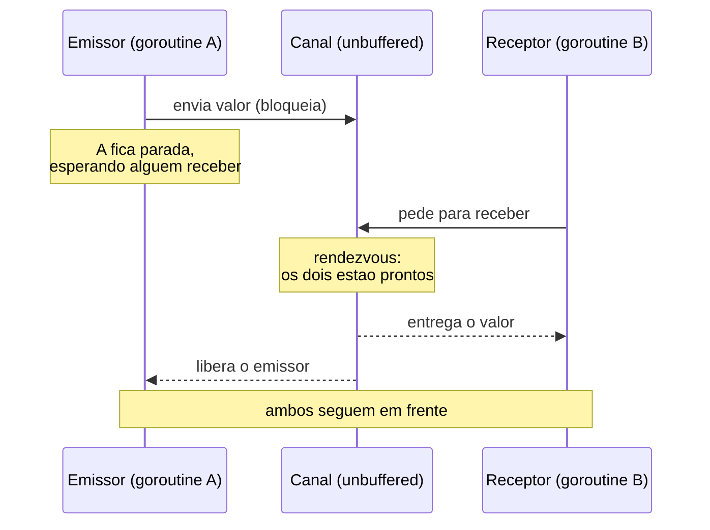
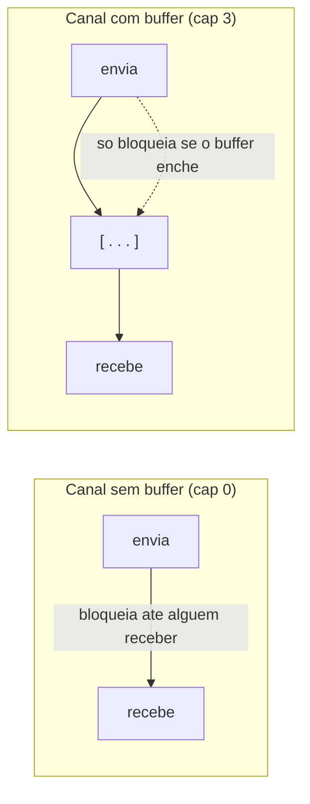
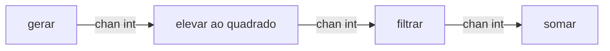
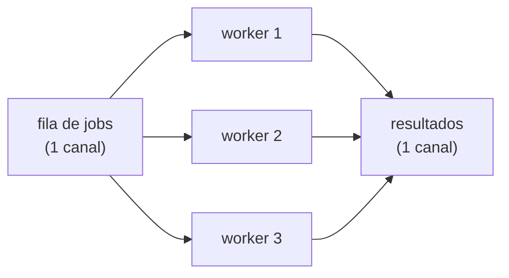
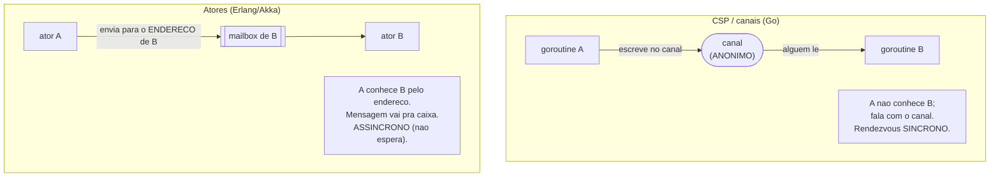

# Troca de mensagens e CSP

> [!abstract] Resumo em uma linha
> Em vez de compartilhar memória e protegê-la com locks, cada tarefa guarda seu próprio estado e troca **mensagens** por **canais** — o modelo CSP, que Go transformou em idioma de primeira classe.

Na nota [[10 - Memória compartilhada com threads e locks]] vimos o mundo onde várias threads mexem na mesma região de memória e a gente reza pra que os mutexes cubram todos os acessos. Funciona, mas é frágil: esquece um lock e a corrida aparece; tranca demais e o paralelismo evapora; tranca na ordem errada e o programa congela. A pergunta natural é: **e se a gente simplesmente não compartilhasse a memória?**

É exatamente essa a virada que esta nota explora. Não é uma otimização de locks — é uma mudança de modelo mental.

## A virada: pare de compartilhar, comece a conversar

Pense numa cozinha de restaurante. No modelo de memória compartilhada, todos os cozinheiros mexem na **mesma** mesa central: precisam combinar quem pega qual ingrediente e quando, ou dois agarram a mesma faca ao mesmo tempo. Caos coordenado por regras.

No modelo de troca de mensagens, cada cozinheiro tem **sua própria** bancada. Ninguém invade a bancada do outro. Quando um termina sua parte, ele **passa o prato adiante** por uma esteira até a próxima estação. O dado anda; a memória não é disputada.

Essa é a frase que virou bandeira de Go, atribuída a Rob Pike:

> [!quote] O lema
> "Don't communicate by sharing memory; share memory by communicating." — Rob Pike (Go Proverbs, Gopherfest SV 2015). Verificado.

Releia com atenção: não é "nunca compartilhe memória". É "não use memória compartilhada como **mecanismo de comunicação**". Em vez de duas tarefas espiarem a mesma variável e disputarem com lock, uma tarefa **envia o valor** para a outra por um canal. As duas se sincronizam no ato do envio. A comunicação e a sincronização viram a mesma coisa.

> [!tip] O insight central
> No modelo de memória compartilhada, comunicação e sincronização são problemas separados (você comunica via variável, sincroniza via lock). Na troca de mensagens, **o canal faz as duas coisas de uma vez**. Menos peças móveis, menos formas de errar.

## CSP: a teoria por trás (Hoare, 1978)

A fundação formal disso é o **CSP — Communicating Sequential Processes**, descrito por Tony Hoare em 1978. Verificado. A ideia é elegante e tem três peças:

1. **Processos sequenciais.** Cada processo é uma sequência comum de instruções, sem concorrência interna. Simples de raciocinar isoladamente.
2. **Estado privado.** Cada processo tem seu próprio espaço de memória, distinto. Ninguém lê a memória do outro. Verificado.
3. **Comunicação por mensagens.** A única forma de processos interagirem é mandar e receber mensagens — não há variável global compartilhada.

E há um detalhe crucial sobre **como** a mensagem viaja: o **rendezvous**.

> [!info] Rendezvous (o encontro)
> Na formulação original do CSP, a comunicação é **síncrona**: o emissor não consegue transmitir a mensagem até o receptor estar pronto para aceitá-la. Os dois "se encontram" no ponto da troca — um rendezvous. Verificado.

A palavra é francesa para "encontro marcado". A imagem certa: duas pessoas combinam de se encontrar numa esquina. Quem chega primeiro **espera** o outro. A troca (o aperto de mão, a entrega do envelope) só acontece quando ambos estão presentes. Não há caixa de correio intermediária; é mão na mão.

CSP teve uma evolução importante que vale anotar porque aparece em entrevista. A versão de 1978 ainda nomeava processos: você dizia "mande para o processo P". Versões posteriores **abandonaram a comunicação por nome de processo em favor de comunicação anônima por canais** — abordagem também usada no CCS de Milner e no cálculo π. Verificado. Guarde essa palavra: **anônima**. Vamos voltar a ela no contraste com atores.



Esse diagrama mostra o rendezvous de um canal sem buffer. Leitura do diagrama: o emissor A tenta enviar e **trava** — não porque há um lock, mas porque ninguém recebeu ainda. Quando B aparece para receber, os dois se sincronizam, o valor passa, e **ambos** são liberados ao mesmo tempo. O envio e a recepção são um único ato atômico.

## Canais: a fila que também é um relógio

Um canal é, ao mesmo tempo, duas coisas: uma **fila thread-safe** (transporta dados sem você precisar de mutex) e um **ponto de sincronização** (coordena o tempo entre tarefas). Essa dupla natureza é o que torna o modelo tão econômico.

Canais vêm em dois sabores, e a diferença é só uma: quando o emissor bloqueia.

> [!example] Sem buffer (síncrono) × com buffer (assíncrono)
> - **Unbuffered** — capacidade zero. O envio bloqueia até **alguém receber**. É o rendezvous puro do CSP. Use quando quiser garantir que a entrega aconteceu (handoff, sincronização).
> - **Buffered** — capacidade N. O envio só bloqueia quando o buffer **enche**; até lá, deposita e segue. Use quando quiser desacoplar produtor e consumidor em ritmos diferentes (alto throughput). Verificado.



Leitura do diagrama: no canal sem buffer, há uma linha direta e bloqueante entre enviar e receber — não existe lugar para o dado "ficar". No canal com buffer, há um pequeno depósito no meio; o emissor deposita e continua, e só trava quando as três vagas estão ocupadas. Mude a capacidade e você desliza entre "totalmente síncrono" e "desacoplado".

> [!warning] Buffer não é mágica
> Um buffer maior não conserta um consumidor lento — só adia o bloqueio. Se o produtor é cronicamente mais rápido, o buffer enche e você volta a bloquear (ou, pior, esconde o problema atrás de latência crescente). O buffer absorve **rajadas**, não desequilíbrios permanentes.

## Showcase Go: goroutines, chan, select

Go pegou o CSP e o costurou na linguagem. Três primitivas fazem o trabalho.

### Goroutines: concorrência barata

Uma **goroutine** é uma tarefa concorrente leve. Você cria uma com a palavra `go` na frente de uma chamada. O barato vem do **scheduler M:N**: o runtime multiplexa **muitas** goroutines (G) sobre um número **pequeno** de threads do SO (M), através de processadores lógicos (P). Verificado. Isso liga direto na discussão de [[02 - Processos e threads]] — goroutines são green threads gerenciadas pelo runtime, não pelo kernel, por isso você pode ter centenas de milhares delas onde teria poucos milhares de threads de SO.

```go
func main() {
    go dizer("oi")   // roda concorrentemente
    dizer("mundo")   // roda na goroutine principal
}
```

O detalhe sutil: o runtime mantém todos os núcleos ocupados e garante que nenhuma goroutine passe fome, parqueando as que bloqueiam (num canal, por exemplo) e acordando-as quando há trabalho. Verificado.

### Canais: o `chan`

```go
ch := make(chan int)        // sem buffer (rendezvous)
chb := make(chan int, 10)   // com buffer de 10

ch <- 42                    // envia (bloqueia ate alguem receber)
x := <-ch                   // recebe
close(ch)                   // fecha; receptores leem o "zero" e ok=false
```

A seta de canal só aparece dentro de código, nunca na prosa. O canal é tipado (`chan int` só carrega `int`), o que dá segurança em tempo de compilação e impede a confusão de mandar a coisa errada.

### Select: o coração da composição

E se uma goroutine precisa esperar em **vários** canais ao mesmo tempo? É para isso o `select`. Ele dá um lugar único para ouvir muitas operações de canal e deixa o **runtime** decidir qual avança primeiro. Verificado.

```go
select {
case v := <-entrada:
    processar(v)
case resultado <- valor:
    // conseguiu enviar
case <-time.After(time.Second):
    // timeout: nada chegou em 1s
default:
    // nenhum caso pronto: nao bloqueia
}
```

> [!info] Detalhe de runtime do select
> Se nenhum caso está pronto e não há `default`, a goroutine é enfileirada em **todos** os canais envolvidos e parqueada — acorda quando qualquer um deles ficar pronto. Verificado. É barato esperar em dez canais ao mesmo tempo.

O `select` é o que eleva o modelo de "tubos isolados" para **composição**: timeout, cancelamento, multiplexação e prioridade emergem todos de combinar casos. Quando você vir um worker elegante em Go, quase sempre há um `select` num laço no centro dele.

## Padrões idiomáticos

Com goroutines + canais + select, alguns desenhos se repetem tanto que viraram vocabulário. Eles aprofundam em [[17 - Padrões de concorrência]]; aqui está o mapa.

### Pipeline

Cada estágio é uma goroutine; canais ligam um estágio ao próximo. O dado flui como numa linha de montagem.



Leitura do diagrama: cada caixa é uma goroutine independente, cada seta é um canal. Nenhum estágio sabe quem está do outro lado — só recebe, transforma, manda adiante. Você pode trocar um estágio sem tocar nos vizinhos. É composição por canais, não por chamada de função.

### Fan-out / fan-in (worker pool)

Quando um estágio é o gargalo, você o **paraleliza**: vários workers leem do mesmo canal de entrada (fan-out) e escrevem num canal de saída comum (fan-in). É o **worker pool**.



Leitura do diagrama: um único canal de jobs alimenta N workers — o runtime distribui naturalmente, porque cada worker pega o próximo job assim que fica livre (balanceamento de carga de graça). Os três despejam num canal único de resultados. Sem mutex, sem fila manual: o canal **é** a fila thread-safe. Fan-out e fan-in detalhados em [[17 - Padrões de concorrência]].

### Done-channel e context (cancelamento)

Como você diz a um monte de goroutines "parem, não preciso mais"? Você não as mata — não há como matar uma goroutine de fora. Em vez disso, fecha um canal de sinalização e elas observam.

```go
func worker(jobs <-chan int, done <-chan struct{}) {
    for {
        select {
        case j := <-jobs:
            processar(j)
        case <-done:        // sinal de cancelamento
            return          // a goroutine se encerra sozinha
        }
    }
}
```

O `context` da biblioteca padrão é a forma idiomática e portável disso: carrega o canal de cancelamento, deadline e valores de escopo de requisição, e propaga pela árvore de chamadas. Sempre que você vê cancelamento em I/O concorrente Go, há um `context` por baixo.

## "Share memory by communicating" na prática

Aqui está a peça que faz o modelo evitar corridas sem locks: **ownership** (posse) viaja na mensagem.

Quando você envia um dado por um canal, a convenção é que você **abre mão** dele — quem recebe agora é o dono. Em qualquer instante, **só uma goroutine "tem" o dado**. Se só uma goroutine acessa um dado por vez, não existe acesso concorrente, e sem acesso concorrente não existe corrida. O canal serializa a posse.

> [!note] A corrida some por construção, não por vigilância
> Com mutex, você previne a corrida **lembrando** de trancar em todo acesso (vigilância humana). Com passagem de posse por canal, a corrida não acontece porque o dado nunca está em dois lugares ao mesmo tempo (propriedade estrutural). É menos coisa para lembrar.

Mas atenção a uma armadilha de entrevista: **Go não proíbe memória compartilhada.** A biblioteca padrão tem `sync.Mutex`, `sync.RWMutex`, `sync/atomic` — tudo lá. O lema é uma **convenção**, não uma trava da linguagem. Às vezes um contador protegido por mutex é mais simples e rápido que um canal. O próprio Pike diz: use o que for mais claro para o problema.

E porque a linguagem não impede, Go oferece uma rede de segurança: o **race detector**. Verificado.

> [!info] Go race detector
> Habilitado com a flag `-race` (`go test -race`, `go run -race`, `go build -race`). É construído sobre o **ThreadSanitizer** (a mesma runtime usada em C/C++ no Chromium e na base interna do Google). O compilador instrumenta cada leitura e escrita de memória; em tempo de execução, o runtime registra qual goroutine acessou cada endereço por último e **denuncia acessos concorrentes não sincronizados**. Verificado.
>
> Limites importantes (caem em entrevista): só encontra corridas que **acontecem em tempo de execução** — código não exercitado não é checado, então depende da cobertura dos testes/carga. E custa caro: memória pode subir 5–10x e o tempo 2–20x. Verificado. Por isso é ferramenta de CI/teste, não de produção.

## CSP × atores: dois primos message-passing

Tanto CSP/canais quanto o modelo de atores (a próxima nota, [[13 - O modelo de atores]]) são **troca de mensagens** — nenhum dos dois compartilha memória como mecanismo de comunicação. Mas eles diferem em dois eixos que importam.



Leitura do diagrama: à esquerda, CSP — A escreve num **canal anônimo**; não sabe nem se importa quem recebe; a troca é síncrona (rendezvous). À direita, atores — A endereça a mensagem **a B** especificamente, deposita na **mailbox** de B e segue sem esperar (assíncrono). Resumindo o contraste:

| Eixo | CSP / canais | Atores |
|---|---|---|
| Destino | **canal anônimo** (você fala com um canal) | **endereço** do ator (você fala com alguém) |
| Sincronia | síncrono (rendezvous, no caso unbuffered) | assíncrono (mailbox amortece) |
| Acoplamento | mais acoplado no tempo da troca | mais desacoplado |
| Encarnação | Go, Occam | Erlang, Akka, Elixir |

> [!tip] Frase de bolso pra entrevista
> "Channels are anonymous and synchronous; actors have addresses and mailboxes and are asynchronous." Os dois evitam memória compartilhada — a diferença é **com quem** você fala e **se** você espera.

## Prós e contras

Nenhum modelo é grátis. O honesto é saber onde a troca de mensagens brilha e onde ela morde.

> [!success] A favor
> - **Sem locks explícitos** no caminho comum — o canal sincroniza por você.
> - **Composável** — `select`, pipelines e worker pools se combinam limpos.
> - **Raciocínio mais local** — cada goroutine pensa só no seu estado e nas mensagens que troca.
> - **Excelente para pipelines e I/O concorrente** — fluxos de dados e milhares de conexões caem como uma luva.

> [!failure] Contra
> - **Deadlock por canal continua possível** — se todas as goroutines esperam num canal que ninguém alimenta (ou ninguém esvazia), o programa congela. Trocou o deadlock de locks pelo deadlock de canais.
> - **Copiar dados tem custo** — passar valores grandes por canal copia; às vezes você passa ponteiros e... volta a ter memória compartilhada disfarçada (e o risco de corrida de novo).
> - **Disciplina mental** — quem fecha o canal? Quem é o dono do dado agora? Esquecer essas convenções gera bugs sutis (envio em canal fechado entra em pânico, leitura de canal fechado dá zero silencioso).

A relação com o resto do mapa: este é o **Modelo 2** da família de modelos de concorrência. O Modelo 1 é memória compartilhada com locks ([[10 - Memória compartilhada com threads e locks]]); o Modelo 3 são atores ([[13 - O modelo de atores]]); e há ainda o loop de eventos com assincronia ([[14 - Loop de eventos e assincronia]]), que ataca o mesmo problema por outro ângulo. Por que concorrência é difícil em primeiro lugar, a base de tudo, está em [[01 - Concorrência e paralelismo - o que é e por que é difícil]].

## Em entrevista

CSP is a message-passing concurrency model from Tony Hoare (1978): independent sequential processes with private state that communicate over channels, synchronizing via rendezvous. Go is the canonical showcase — goroutines are cheap M:N green threads, channels are typed thread-safe queues that double as synchronization points, and `select` composes waiting over many channels. The slogan "don't communicate by sharing memory; share memory by communicating" means you pass ownership of data through a channel so only one goroutine holds it at a time, which removes data races by construction rather than by lock discipline. But Go does not forbid shared memory — `sync.Mutex` exists, and the race detector (`-race`, built on ThreadSanitizer) is the safety net. The key contrast with the actor model: channels are anonymous and synchronous, while actors have addresses and asynchronous mailboxes. The honest caveat: channel deadlock is still possible, copying large values costs, and the model demands discipline about who owns and who closes a channel.

### Vocabulário

- troca de mensagens — message passing
- canal — channel
- goroutine — goroutine
- rendezvous — rendezvous
- canal com buffer / sem buffer — buffered / unbuffered channel
- select — select statement
- fan-in / fan-out — fan-in / fan-out
- detector de corrida — race detector

> [!info] Lastro
> - Hoare, C. A. R., "Communicating Sequential Processes" — [Wikipedia: CSP](https://en.wikipedia.org/wiki/Communicating_sequential_processes) (rendezvous síncrono, estado privado, comunicação anônima por canais nas versões posteriores). Verificado.
> - Rob Pike, Go Proverbs — [Channels in Go (go101.org)](https://go101.org/article/channel.html) e o proverb "don't communicate by sharing memory". Verificado.
> - [Data Race Detector — go.dev](https://go.dev/doc/articles/race_detector) e [Introducing the Go Race Detector — go.dev/blog](https://go.dev/blog/race-detector) (flag `-race`, ThreadSanitizer, overhead 5–10x memória / 2–20x tempo). Verificado.
> - [CSP vs Actor model for concurrency — Karan Pratap Singh](https://www.karanpratapsingh.com/blog/csp-actor-model-concurrency) (canal anônimo síncrono × mailbox endereçado assíncrono). Verificado.

## Veja também

- [[01 - Concorrência e paralelismo - o que é e por que é difícil]]
- [[02 - Processos e threads]]
- [[10 - Memória compartilhada com threads e locks]]
- [[13 - O modelo de atores]]
- [[14 - Loop de eventos e assincronia]]
- [[17 - Padrões de concorrência]]
- [[18 - Concorrência em entrevista]]
- [[03-Dominios/Ciência/Concorrência e Paralelismo/index|Concorrência e Paralelismo]]
