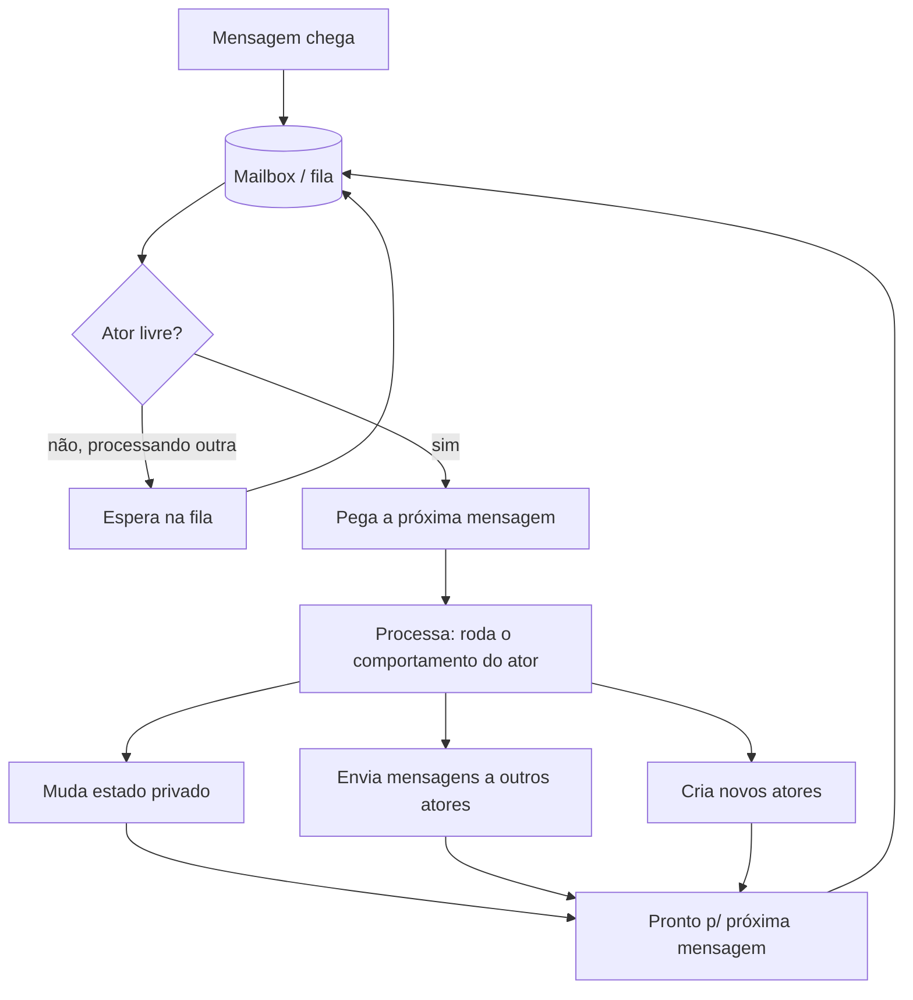
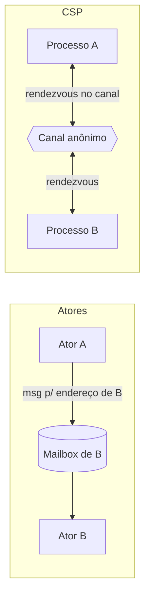
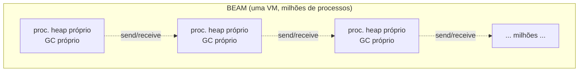
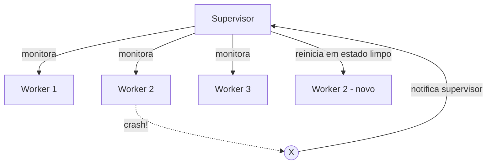
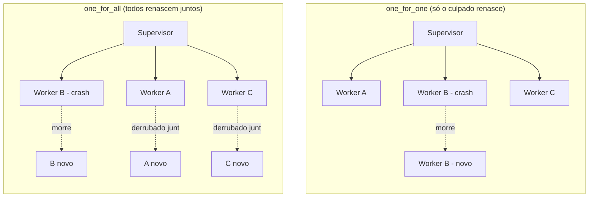
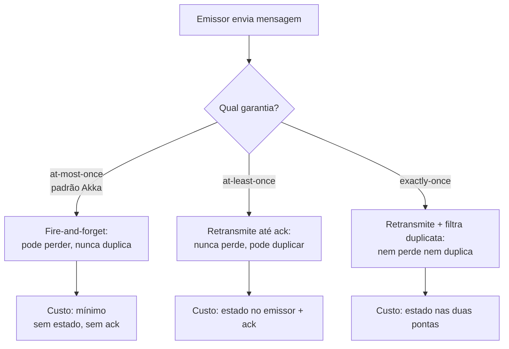

# O modelo de atores

> [!abstract] Resumo em uma linha
> Em vez de proteger memória compartilhada com cadeados, o modelo de atores elimina o compartilhamento: cada ator é um pequeno ser isolado, com estado privado e uma caixa de entrada, que processa um recado por vez e fala com os outros só por mensagens assíncronas.

Você já viu duas formas de domar a concorrência. Em [[03 - Estado compartilhado e race conditions]], a memória é compartilhada e você paga o pedágio dos cadeados. Em [[12 - Troca de mensagens e CSP]], processos anônimos se encontram em canais e trocam dados num aperto de mão. O modelo de atores é o terceiro grande paradigma — e o mais radical na sua aposta: *e se ninguém pudesse tocar no estado de ninguém?*

Pense num escritório enorme. Cada funcionário tem sua própria mesa, suas próprias gavetas, seus próprios papéis. Ninguém invade a mesa do outro pra mexer numa planilha. Se você precisa que alguém faça algo, você deixa um bilhete na caixa de entrada dele. Ele lê os bilhetes um por um, na ordem que chegaram, e responde — talvez mudando seus próprios papéis, talvez deixando bilhetes pra outras pessoas, talvez contratando um estagiário novo. Esse funcionário é um ator.

A pergunta que move este modelo é simples: se a race condition nasce de dois fios de execução pisando no mesmo dado, e se cada dado vive dentro de um único dono que processa um pedido por vez, *de onde viria a corrida?*

## O modelo: Hewitt, 1973

O modelo de atores foi proposto em 1973 por Carl Hewitt, junto com Peter Bishop e Richard Steiger, como uma arquitetura modular universal para construir sistemas inteligentes. A ideia era ter uma unidade de computação que fosse, ao mesmo tempo, a unidade de concorrência, a unidade de estado e a unidade de comunicação. Essa unidade é o **ator**.

Um ator tem três coisas e faz três coisas. As três coisas que ele *tem*:

- **Estado privado.** Memória que é só dele. Ninguém de fora lê, ninguém de fora escreve. Não existe ponteiro pro miolo de um ator.
- **Um endereço.** Uma identidade pela qual outros atores conseguem mandar mensagens pra ele. O endereço é público; o estado, não.
- **Um mailbox (caixa de mensagens).** Uma fila onde as mensagens que chegam ficam esperando, na ordem em que chegaram.

E as três coisas que ele *pode fazer* ao processar uma mensagem — e só ao processar uma mensagem:

1. **Mudar seu próprio estado** (mexer nas suas gavetas).
2. **Enviar mensagens** a outros atores que ele conhece (deixar bilhetes).
3. **Criar novos atores** (contratar estagiários).

Nada além disso. Toda a riqueza de um sistema de atores emerge dessas três ações encadeadas, milhões de vezes por segundo. As mensagens são **imutáveis** e a comunicação é **100% assíncrona**: você manda o recado e segue a vida — *fire-and-forget*, sem esperar resposta na linha.

Vamos olhar o ciclo de vida de uma única mensagem dentro de um ator.



Leitura do diagrama: a mensagem entra pela fila do mailbox. Se o ator já está ocupado processando outra mensagem, a nova espera — não há atendimento em paralelo dentro do ator. Quando ele fica livre, pega a próxima, roda seu comportamento (que pode disparar qualquer combinação das três ações) e só então volta pra fila pra pegar a seguinte. O laço nunca processa duas mensagens ao mesmo tempo.

> [!note] O comportamento pode mudar
> Na formulação de Hewitt, ao processar uma mensagem o ator também especifica qual será seu comportamento para a *próxima* mensagem. Ou seja, um ator pode "trocar de chapéu" entre mensagens — uma máquina de estados onde cada transição é disparada por um recado. É um detalhe sutil mas poderoso: o ator de amanhã não precisa ser igual ao de hoje.

## Por que isso mata a race condition

Aqui está o coração do modelo. Em [[01 - Concorrência e paralelismo - o que é e por que é difícil]] vimos que a dificuldade da concorrência mora no **estado mutável compartilhado**. Tire o compartilhamento e o problema some — não se mitiga, *some*.

O truque tem duas camadas. **Entre atores**, há concorrência plena: mil atores podem estar processando suas mensagens ao mesmo tempo, em mil núcleos. **Dentro de um ator**, há serialização absoluta: um ator processa exatamente uma mensagem de cada vez, do começo ao fim, sem interrupção.

Repare no que isso significa pro estado privado. O único código que toca o estado de um ator é o próprio ator, e ele só roda um pedaço por vez. Não existe "dois acessos simultâneos ao mesmo dado", porque nunca há dois acessos simultâneos — *período*. A região crítica é o ator inteiro, e a exclusão mútua é grátis, dada pela arquitetura.

Lembra do confinamento que vimos em [[03 - Estado compartilhado e race conditions]]? Confinar um dado a uma única thread o torna seguro sem cadeado. O modelo de atores pega essa ideia e a eleva a princípio organizador do sistema todo: *todo* estado é confinado, *sempre*, a um único ator. Você não confina por disciplina; confina por construção.

```mermaid
sequenceDiagram
    participant Cliente
    participant Conta as Ator Conta (saldo privado)
    participant Log as Ator Log
    Cliente->>Conta: {sacar, 50}
    Note over Conta: processa sozinho;<br/>saldo 100 -> 50
    Conta-->>Log: {sacado, 50}
    Cliente->>Conta: {sacar, 30}
    Note over Conta: processa sozinho;<br/>saldo 50 -> 20
    Conta-->>Log: {sacado, 30}
    Note over Cliente,Log: setas tracejadas = assíncrono;<br/>ninguém espera resposta
```

Leitura do diagrama: dois saques chegam ao ator Conta. Mesmo que o Cliente dispare os dois quase juntos, eles entram na fila e são processados em série — `100 → 50 → 20`, sem perder atualização. O saldo é privado: não há outra thread capaz de ler `100` e escrever `70` "por cima". As setas tracejadas marcam o envio assíncrono: o Cliente não bloqueia esperando, e o ator Log recebe os avisos quando der.

Compare isso com o mesmo cenário em memória compartilhada com `saldo -= 50` sem cadeado: duas threads leem `100`, ambas calculam e gravam, uma sobrescreve a outra, e some dinheiro. O ator não tem como cair nessa, porque a sequência inteira "ler, calcular, gravar" roda atomicamente do ponto de vista de fora.

## Ator × CSP: dois sabores de mensagem

É fácil confundir atores com CSP — ambos pregam "comunique trocando mensagens, não compartilhando memória". Mas a diferença na *forma* da comunicação muda tudo, e entrevistadores adoram cobrar isso.



Leitura do diagrama: à esquerda, o modelo de atores — A conhece o *endereço* de B e deposita a mensagem no mailbox de B; B não precisa estar pronto, o recado espera na fila, e A segue sem bloquear. À direita, CSP — A e B se encontram num *canal anônimo*; o canal não pertence a ninguém, e (no caso síncrono clássico) os dois precisam estar prontos ao mesmo tempo pro rendezvous acontecer.

As diferenças que importam:

- **Endereçamento.** No modelo de atores, você fala com um ator *específico*, identificado pelo endereço. Em CSP, você fala com um *canal*, e quem está do outro lado é anônimo — qualquer processo pode estar lá.
- **Acoplamento temporal.** Atores são assíncronos com buffer (o mailbox): o emissor não espera. CSP clássico é um rendezvous síncrono: emissor e receptor sincronizam no ponto da troca. (Canais com buffer suavizam isso, mas a alma de CSP é o encontro.)
- **Onde o estado vive.** No modelo de atores, o estado mora *dentro* do ator. Em CSP, o estado vive no processo também, mas a abstração de primeira classe é o *canal*, não o processo.

Uma régua mental: **atores são como mandar uma carta** (endereço, caixa de correio, assíncrono); **CSP é como um telefonema** (linha aberta, os dois presentes, síncrono). Vale revisitar [[12 - Troca de mensagens e CSP]] pra ver o outro lado dessa moeda em detalhe.

## Showcase: Erlang, Elixir e a BEAM

Se CSP tem Go como vitrine, o modelo de atores tem **Erlang** — e sua máquina virtual, a **BEAM**. Erlang nasceu na Ericsson nos anos 80 pra programar centrais telefônicas: sistemas que não podem cair, que rodam por anos, que atualizam sem desligar. O modelo de atores não foi um enfeite acadêmico ali; foi a resposta a um problema de engenharia brutal.

### Processos leves

Na BEAM, o ator se chama **processo** — mas esqueça o processo do sistema operacional. Um processo da BEAM é absurdamente barato: começa com cerca de 1 a 2,5 KB de memória, e a máquina virtual roda **milhões** deles num único nó. Eles são totalmente isolados: cada processo tem seu **próprio heap** e seu **próprio coletor de lixo**.

Esse detalhe do GC por processo é genial. Em runtimes com heap compartilhado, o coletor de lixo às vezes precisa pausar o mundo inteiro. Na BEAM, quando um processo coleta seu lixinho, só ele pausa — os outros milhões seguem. Sem pausas globais. É o isolamento do modelo de atores pagando dividendos até na latência.

O escalonador é preemptivo e justo: a BEAM conta "reduções" (passos de execução) e troca de processo periodicamente, então um processo guloso não trava os vizinhos. Há um escalonador por núcleo de CPU, e o paralelismo entre processos sai de graça.



Leitura do diagrama: dentro de uma única instância da BEAM convivem milhões de processos, cada um com heap e GC próprios — caixas estanques. A única ponte entre eles são as setas tracejadas de `send`/`receive`: mensagens assíncronas. Não há memória atravessando as paredes. O isolamento é físico no nível do runtime.

O envio é literal: `Pid ! Mensagem` em Erlang manda um recado pro processo de identificador `Pid`; o `receive` do lado de lá casa padrões nas mensagens da fila. É o modelo de Hewitt quase ao pé da letra.

### "Let it crash" e árvores de supervisão

Aqui mora a contribuição mais contraintuitiva — e mais bonita — da cultura Erlang. A filosofia chama-se **"let it crash"** ("deixe quebrar").

Em quase toda linguagem você aprende a programar *defensivamente*: checar cada entrada, tratar cada erro, blindar cada função contra o inesperado. Erlang vira a mesa. A ideia é: *não* tente prever e tratar todo erro possível dentro do processo. Se algo deu errado de um jeito que você não esperava, deixe o processo **morrer** — e tenha um **supervisor** que o reinicia num estado limpo, conhecido e correto.



Leitura do diagrama: o supervisor monitora os workers. O Worker 2 estoura — talvez um dado corrompido, um caso impossível. Em vez de propagar o caos, ele simplesmente morre. O supervisor é notificado, descarta o cadáver e parte um worker novinho, do zero, sem o estado bichado que causou o problema. O sistema se cura sozinho.

> [!tip] Por que "deixar quebrar" funciona
> A intuição parece suicida — "deixar quebrar" soa como desistir. Mas pense: a maioria dos bugs em produção vem de estado corrompido ou de combinações que você nunca imaginou. Tentar tratar o que você não previu é, por definição, impossível. Reiniciar do zero, ao contrário, leva o processo de volta a um estado *conhecido e correto*. Some isso ao isolamento (um processo que morre não derruba os vizinhos) e você tem resiliência por construção, não por heroísmo no código. O segredo não é a ausência de falhas — é o **confinamento** delas.

Os supervisores se organizam em **árvores de supervisão**: supervisores que supervisionam workers e outros supervisores. Quando uma falha não pode ser resolvida no nível baixo, ela *escala* — o supervisor pai reinicia um ramo inteiro, ou repassa o problema pra cima. É uma hierarquia de responsabilidade pela cura, espelhando a hierarquia do sistema.

> [!warning] "Let it crash" não é "deixe tudo quebrar"
> A frase é frequentemente mal entendida. Não significa abandonar validação de entrada do usuário ou ignorar erros esperados — esses você trata normalmente. Significa não escrever código defensivo paranoico contra falhas *inesperadas* e *irrecuperáveis*. Você ainda valida o que é validável; o que você *não* faz é tentar costurar um estado já corrompido de volta à vida.

### OTP em profundidade: GenServer, Supervisor, Application

Toda essa disciplina não fica solta — vem empacotada no **OTP** (Open Telecom Platform), o conjunto de bibliotecas e princípios de design do Erlang. O termo "Erlang" é praticamente intercambiável com "Erlang/OTP". OTP não é uma biblioteca qualquer: é o que transforma "o modelo de atores" em "um framework de tolerância a falhas pronto pra produção". A piada interna é que ninguém escreve um ator cru em Erlang/Elixir — você escreve um *behaviour* OTP, e o OTP já resolveu por você as partes chatas e fáceis de errar.

**GenServer** (*generic server*) é o ator padrão. Em vez de escrever à mão o laço `receive` que casa padrões nas mensagens, você implementa *callbacks* num esqueleto pronto. O GenServer cuida do mailbox, do laço de recepção, do *timeout*, do encaixe na árvore de supervisão e do *tracing*; você só escreve a lógica. Dois verbos definem como o mundo fala com ele:

- **`call` — síncrono.** Você manda a mensagem e *espera* a resposta (com timeout). Por baixo do pano ainda é troca de mensagens assíncrona, mas a API bloqueia o chamador até a resposta voltar. Use quando você precisa do resultado pra continuar — ler um valor, confirmar que a escrita pegou.
- **`cast` — assíncrono.** *Fire-and-forget* puro: manda e segue, sem esperar resposta. É o envio canônico do modelo de Hewitt. Use quando você não precisa da resposta — disparar um evento, registrar um log.

Repare que essa dupla `call`/`cast` é a própria tensão do galho: o `call` traz de volta o conforto de uma chamada de função (e o acoplamento temporal de quem espera), enquanto o `cast` honra a assincronia pura do modelo. Você escolhe a cada mensagem.

> [!tip] O `call` síncrono é uma armadilha de deadlock
> Há um perigo elegante escondido no `call`. Se o ator A faz um `call` ao ator B, e B, *para responder*, precisa fazer um `call` de volta pra A — A está bloqueado esperando B, B está bloqueado esperando A, e nenhum dos dois processa a próxima mensagem do seu mailbox. Deadlock, ressuscitado dentro de um modelo que prometia matá-lo. A lição: o `call` reintroduz dependências circulares de espera, exatamente o que [[03 - Estado compartilhado e race conditions]] alertava nos cadeados. Use `cast` (assíncrono) sempre que puder; reserve `call` pra quando você genuinamente precisa do resultado pra seguir, e cuide pra não fechar um ciclo.

Os GenServers não vivem soltos: ficam pendurados num **Supervisor**, que é o ator cuja única função é vigiar filhos e reiniciá-los quando morrem. E aqui mora a parte fina do OTP — a **estratégia de supervisão** decide *o que mais* reiniciar quando um filho cai:

- **`one_for_one`** — só reinicia o filho que morreu. Os irmãos seguem intactos. É o padrão, e serve quando os filhos são independentes (cada um é uma sessão de usuário, por exemplo).
- **`one_for_all`** — reinicia *todos* os filhos quando *um* morre. Serve quando os filhos são fortemente acoplados e um estado parcial não faz sentido — se um cai, o conjunto inteiro precisa renascer junto.
- **`rest_for_one`** — reinicia o filho que morreu e todos os que foram iniciados *depois* dele. Serve quando há uma cadeia de dependência: os que vieram antes não dependem do morto, mas os que vieram depois sim.



Leitura do diagrama: à esquerda, `one_for_one` — o Worker B estoura e só ele é reiniciado; A e C nem percebem. À direita, `one_for_all` — quando B cai, o supervisor derruba A e C de propósito e reinicia os três do zero, porque o trio só faz sentido como um bloco coerente. A escolha da estratégia é, na prática, uma declaração de quão acoplados são os filhos: independentes pedem `one_for_one`; um organismo único pede `one_for_all`.

Por fim, a **Application** é a unidade de empacotamento: agrupa uma árvore de supervisão inteira sob um ponto de partida único, com ciclo de vida (*start*/*stop*) e dependências declaradas. Um sistema Erlang/Elixir real é um punhado de Applications, cada uma com sua árvore de supervisão, compostas como peças de Lego. É por isso que se diz que OTP "virou um framework de tolerância a falhas": ele dá a forma (GenServer), a hierarquia de cura (Supervisor) e o invólucro (Application) — você só preenche os buracos com lógica de negócio.

E ainda há o **hot code reload**: a BEAM consegue **trocar o código de um sistema em produção sem desligá-lo**. Você sobe uma nova versão de um módulo (incrementando o `@vsn` e definindo um *callback* `code_change` que migra o estado), e os processos passam a rodar o código novo na próxima mensagem. Pra uma central telefônica que não pode cair, isso não é luxo — é requisito.

O resultado dessa pilha toda virou lenda. Em 1998 a Ericsson lançou o switch **AXD301**, com mais de um milhão de linhas de Erlang, e relatou disponibilidade de **nove noves** — 99,9999999% de uptime. São cerca de 30 milissegundos de indisponibilidade por ano. Esse número é o cartão de visitas do modelo de atores levado a sério.

**Elixir** é a linguagem moderna que roda na mesma BEAM, com sintaxe mais amigável e ferramental atual, herdando OTP, supervisão, "let it crash" e hot reload de graça. E na JVM, o **Akka** é o port mais famoso do modelo de atores — atores como objetos pequenos e *stateful* que só conversam por mensagens assíncronas, sem expor métodos tradicionais.

## Garantias de entrega: o recado pode se perder

Há uma ilusão confortável no modelo de atores: como você "envia uma mensagem", parece natural assumir que ela *chega*. Não assuma. A pergunta "o que acontece se a mensagem se perder?" é a que separa quem entende o modelo de quem só desenhou caixinhas.

O Akka, referência da JVM, é explícito: a garantia padrão é **entrega no máximo uma vez** (*at-most-once*). Isso quer dizer: a mensagem pode se perder, mas **nunca é duplicada**. E por que justo essa? Porque é a mais barata. *At-most-once* é puro *fire-and-forget* — não guarda estado no emissor, não pede confirmação, não retransmite. É rápido e simples, ao custo de aceitar que, de vez em quando, um recado evapora.

As outras duas garantias custam mais:

- **Entrega ao menos uma vez** (*at-least-once*): a mensagem nunca se perde, mas **pode duplicar**. Exige retransmitir até receber um *ack* — logo, guardar estado no emissor (o que enviar de novo) e ter confirmação no receptor.
- **Entrega exatamente uma vez** (*exactly-once*): nem perde, nem duplica. É o ideal e o mais caro — além de retransmitir, o receptor precisa guardar estado pra **filtrar duplicatas**. Em sistemas distribuídos de verdade, "exactly-once" é mais uma meta perseguida com truques (idempotência + deduplicação) do que uma garantia mágica do transporte.



Leitura do diagrama: as três garantias formam uma escada de custo. *At-most-once* (o padrão) não guarda nada e por isso é o mais rápido — em troca, aceita perda. *At-least-once* paga com estado no emissor e confirmações pra nunca perder, mas o preço é a duplicata. *Exactly-once* paga nas duas pontas pra eliminar perda e duplicata, e por isso é o mais lento. Não há almoço grátis: você escolhe qual problema prefere ter.

Some a isso a regra de **ordenação**: o Akka garante ordem **só por par emissor-receptor**. Se A manda `m1` e depois `m2` pro mesmo B, B as recebe nessa ordem (`m1` antes de `m2`). Mas não há nenhuma garantia global: se A e C mandam mensagens pro mesmo B, elas podem se intercalar de qualquer jeito; e mensagens de A pra B versus de A pra D não têm relação de ordem entre si. (Há um detalhe fino: a garantia vale pra ordem de *enfileiramento* no mailbox; um mailbox de prioridade pode processar fora da ordem de chegada.)

A consequência prática é dura e libertadora ao mesmo tempo: **o programador precisa pensar em mensagens perdidas, reordenadas e duplicadas como casos normais, não como exceções raras.** A ferramenta para isso é a **idempotência** — desenhar o tratamento de cada mensagem de modo que recebê-la duas vezes produza o mesmo efeito que recebê-la uma vez (um "marque o pedido X como pago" é idempotente; um "adicione 50 ao saldo" não é). A filosofia do Akka aqui é honesta: a única forma de o emissor *saber* que a interação deu certo é receber uma confirmação de nível de negócio. O transporte não promete nada — o protocolo, sim, e você o constrói por cima.

## Back-pressure: o calcanhar de Aquiles do mailbox

Se o modelo de atores tem um ponto cego, é este. O mailbox padrão de um ator (no Akka, uma fila *unbounded* sobre a `ConcurrentLinkedQueue`) **cresce sem limite**. Pense no que isso significa: se um ator recebe mensagens mais rápido do que consegue processá-las, a fila incha — e incha — até a JVM derrubar tudo com um `OutOfMemoryError`. O isolamento que dá tolerância a falhas não te protege disso; pelo contrário, esconde o problema até a memória acabar.

A raiz é a assincronia pura do `cast`/`fire-and-forget`. O emissor não espera, então ele *não tem como saber* que o receptor está afogado. Não há, por construção, nenhum sinal automático de "pare, estou lotado". Isso é exatamente a ausência de **back-pressure** (contrapressão) — o mecanismo pelo qual um consumidor lento consegue forçar um produtor rápido a desacelerar.

> [!warning] Mailbox ilimitado é uma bomba-relógio de memória
> O mailbox *unbounded* é cômodo no protótipo e traiçoeiro em produção. Enquanto o produtor for mais lento que o consumidor, tudo parece bem; no dia em que a carga inverte — um pico de tráfego, um consumidor que travou num I/O —, a fila vira um buraco negro de memória e o nó cai. O perigo é que o sintoma (OOM) aparece longe da causa (um ator específico atolado), o que torna o diagnóstico penoso. Trate "que mailbox e que limite?" como uma decisão de design, não como um *default* a ignorar.

As saídas são três, em ordem crescente de sofisticação:

- **Mailbox limitado** (*bounded*): você dá um teto à fila. Quando enche, ou o envio bloqueia o produtor (uma `LinkedBlockingQueue` empurrando a pressão de volta), ou estoura um *timeout* e a mensagem vai pro *dead letter*. É contrapressão grosseira, mas é contrapressão.
- **Descartar**: aceitar perder mensagens quando a fila enche (faz sentido pra dados que envelhecem rápido, como leituras de sensor — a próxima já corrige).
- **Streams reativos / pull**: a solução elegante. Em vez de o produtor *empurrar* (push) na velocidade dele, o consumidor *puxa* (pull) na velocidade que aguenta, pedindo "me mande N itens". O Akka Streams faz isso: as etapas têm mailboxes limitados que *não descartam* — quando uma etapa lenta para de pedir, a pressão sobe a montante de forma assíncrona e não-bloqueante, sem travar threads. É a contrapressão virando cidadã de primeira classe.

Essa tensão entre empurrar e puxar é o coração da programação reativa, e ela reaparece inteira no laço de eventos: vale ler [[14 - Loop de eventos e assincronia]], onde o mesmo problema — produtor rápido, consumidor lento, fila no meio — aparece sob outra roupa. Atores e reatividade são primos: os dois moram no mundo assíncrono e os dois precisam responder à mesma pergunta de "e quando entra mais do que sai?".

## Distribuição transparente

Há uma consequência elegante de comunicar só por mensagens endereçadas, e não por memória: o modelo *não se importa onde o ator mora*.

Se A fala com B mandando uma mensagem pro endereço de B, faz diferença se B está no mesmo processo, na mesma máquina ou num data center do outro lado do oceano? Pra A, não. O endereço abstrai a localização. Isso se chama **transparência de localização** (*location transparency*), e é a razão de o modelo de atores se estender naturalmente pra sistemas distribuídos.

No Akka, por exemplo, a forma como os atores interagem é a mesma quer estejam no mesmo host, quer em hosts, núcleos ou nuvens diferentes — quase não há API de rede, só configuração. Você escreve a aplicação como se tudo fosse local; o *deployment* remoto de subárvores de atores vai num arquivo de config. A memória compartilhada nunca te deixaria fazer isso: ponteiro não atravessa a rede. Mensagem, sim. É isso que habilita os **clusters**: a *Erlang distribution* (nós da BEAM conversando entre si como se fossem um só) e o **Akka Cluster** (vários nós JVM formando um sistema de atores único, com atores migrando entre máquinas) são extensões diretas dessa transparência. O `send` não muda; só o destino mora mais longe.

O caso real mais eloquente é o **WhatsApp**. A engenharia deles ficou famosa por uma frase de blog em 2012 — "1 million is so 2011" — ao anunciar **2 milhões de conexões TCP simultâneas num único servidor**, rodando Erlang sobre FreeBSD. Cada usuário conectado era um processo Erlang dedicado; mensagens iam de processo a processo com sobrecarga mínima, e os processos leves da BEAM tornavam viável manter milhões deles vivos por nó. Foi esse modelo que permitiu ao WhatsApp servir centenas de milhões (depois bilhões) de usuários com uma equipe de engenharia minúscula — a lenda dos "50 engenheiros para 2 bilhões de usuários". A telecom que pariu o Erlang e o app de mensagens que o consagrou pediam a mesma coisa: enxames de conexões longevas, isoladas, que não podem cair.

É aqui que o modelo de atores e os [[03-Dominios/Ciência/Redes e Protocolos/index|Redes]] se encontram. Um ator remoto é, no fundo, um endereço pra onde mensagens viajam por TCP em vez de irem pra uma fila local. Mas — e este é o porém honesto — atravessar a rede traz de volta as durezas dos sistemas distribuídos: mensagens podem se perder, chegar fora de ordem, duplicar. A transparência é da *interface*, não da *física*. Você programa igual; só que precisa de protocolos que tolerem perda e reordenação — exatamente as garantias de entrega que vimos acima. Localmente, o Akka entrega na mesma JVM por padrão (raramente perde); na rede, a perda passa a ser regra de jogo. Por isso a transparência de localização é uma faca de dois gumes: ela esconde a distância no código, mas não esconde a física, e cabe a você não esquecer que o ator do outro lado pode estar do outro lado do oceano (temas que [[12 - Troca de mensagens e CSP]] tangencia e que voltam em [[17 - Padrões de concorrência]]).

## Prós e contras

Nenhum modelo é grátis. O de atores tem trocas claras.

**A favor:**

- **Sem cadeados, sem race condition por construção.** O estado é confinado; a exclusão mútua é estrutural.
- **Tolerância a falhas.** Isolamento + "let it crash" + supervisão dão resiliência que seria penosa de montar à mão.
- **Escala horizontal.** A transparência de localização leva o mesmo código de um núcleo pra um cluster.
- **Modelo mental claro.** "Pequenos seres que trocam recados" é mais fácil de raciocinar do que um emaranhado de threads e cadeados.

**Contra:**

- **Mailbox sem limite.** Se um ator recebe mensagens mais rápido do que processa, a fila cresce e cresce — até estourar a memória. Isso é um problema de *backpressure*, e a resposta costuma vir do mundo reativo e do [[14 - Loop de eventos e assincronia]]: limitar a fila, descartar, ou empurrar a pressão de volta pro emissor.
- **Debugging de fluxo assíncrono é duro.** Sem pilha de chamadas linear, rastrear "quem mandou o quê pra quem, e em que ordem" exige tracing e correlação. O fire-and-forget que dá liberdade também esconde o fio da meada.
- **Overhead de mensagens.** Copiar e enfileirar mensagens custa mais do que uma chamada de função direta. Pra trabalho fino e fortemente acoplado, atores podem ser pesados demais.
- **Entrega não é garantida de graça.** As mensagens podem se perder ou reordenar — sobretudo no caso distribuído. Garantir entrega exige *protocolo* (acks, timeouts, idempotência), que você precisa construir por cima.

### Atores × os outros modelos

Vale fechar o triângulo, porque entrevista adora pedir "atores ou X?".

**Contra threads-e-locks** ([[10 - Memória compartilhada com threads e locks]]): aqui a vitória dos atores é conceitual e estrutural. Threads-e-locks te dão poder bruto e desempenho máximo, mas o isolamento e a tolerância a falhas você paga *a cada linha*, na unha — confinar estado por disciplina, acertar a ordem dos cadeados pra não dar deadlock, garantir que uma thread que morre não deixe um lock travado pra sempre. Os atores entregam isolamento (estado privado por construção) e tolerância a falhas (supervisão) *de graça* na arquitetura. O custo: você troca a chamada de função direta e barata por uma mensagem copiada e enfileirada, e troca a pilha de chamadas linear (fácil de depurar) por um fluxo assíncrono espalhado por mailboxes (difícil de depurar). Threads-e-locks são um bisturi; atores são um arranjo de células independentes.

**Contra CSP** ([[12 - Troca de mensagens e CSP]]): os dois primos rejeitam memória compartilhada, mas escalam diferente. A diferença decisiva é o **endereçamento**. No ator, você fala com uma identidade (o endereço), e essa identidade pode morar em qualquer máquina — então o modelo se estica naturalmente pro distribuído, com clusters e migração de atores. No CSP, a abstração é o *canal anônimo*, ótimo pra coordenar goroutines/processos *dentro de um nó*, mas que não carrega um conceito nativo de "onde está o outro lado" — distribuir CSP exige montar esse endereçamento por fora. A régua: **CSP tende a ser mais simples e direto pra concorrência local** (um canal, dois lados, pronto); **atores escalam melhor pra distribuído** justamente porque o endereço já é uma identidade roteável. Não à toa Go (CSP) brilha em servidores de um nó e Erlang/Akka (atores) brilham em clusters resilientes.

A régua final: o modelo de atores brilha onde há **muitas entidades concorrentes, fracamente acopladas, que precisam sobreviver a falhas e escalar** — conexões de usuários, dispositivos IoT, sessões, agentes. Brilha menos em computação numérica fina e fortemente acoplada, onde o overhead de mensagem domina e um modelo de memória compartilhada com paralelismo de dados se sai melhor. Como sempre em [[18 - Concorrência em entrevista]], a resposta certa é "depende da forma da carga".

## Em entrevista

Use estas frases em inglês quando o tema aparecer:

- "The actor model makes each actor own its private state; nothing outside can touch it, so there's no shared mutable state to race over."
- "Actors run concurrently with each other but process their own mailbox one message at a time — concurrency between actors, serialization within each one."
- "Unlike CSP channels, which are anonymous and synchronous, actors have an address and an asynchronous mailbox — you send to a specific actor, fire-and-forget."
- "Erlang's 'let it crash' philosophy means you don't program defensively for every failure; you let the process die and a supervisor restarts it in a clean state."
- "Because actors only talk via messages, the model gives you location transparency — the same code runs whether the actor is local or on another machine, which is what lets it scale to a cluster."
- "The main trade-offs are unbounded mailboxes needing backpressure, hard async debugging, and the fact that message delivery and ordering aren't guaranteed without a protocol on top."
- "Akka's default is at-most-once delivery — messages can be lost but never duplicated — and ordering is guaranteed only per sender-receiver pair, so you have to design handlers to be idempotent."
- "The classic gotcha is the unbounded mailbox: if an actor receives faster than it processes, the queue grows until you hit an OutOfMemoryError, so you reach for bounded mailboxes or reactive streams with pull-based backpressure."
- "In Erlang/Elixir, OTP packages this as GenServer for the actor, with call for synchronous and cast for asynchronous messaging, and Supervisor with strategies like one_for_one, one_for_all, and rest_for_one to decide what restarts when a child dies."

### Vocabulário

- modelo de atores → actor model
- ator → actor
- estado privado → private state
- caixa de mensagens → mailbox
- "deixe quebrar" → let it crash
- árvore de supervisão → supervision tree
- supervisor → supervisor
- processo leve → lightweight process
- transparência de localização → location transparency
- contrapressão → backpressure
- recarga de código a quente → hot code reload
- entrega no máximo uma vez → at-most-once delivery
- entrega ao menos uma vez → at-least-once delivery
- entrega exatamente uma vez → exactly-once delivery
- idempotência → idempotency
- GenServer (servidor genérico) → GenServer
- estratégia de supervisão → supervision strategy
- um-para-um / um-para-todos / resto-para-um → one_for_one / one_for_all / rest_for_one

> [!info] Lastro
> - [Actor model — Wikipedia](https://en.wikipedia.org/wiki/Actor_model) (Hewitt, Bishop e Steiger, 1973; estado privado, mailbox, processar mensagens em série, criar atores, comunicação assíncrona)
> - [Erlang (programming language) — Wikipedia](https://en.wikipedia.org/wiki/Erlang_(programming_language)) (Erlang/OTP, hot code swapping, AXD301 com nove noves de uptime, 1998)
> - [#71: Erlang: let it crash! — Tomasz Nurkiewicz](https://nurkiewicz.com/2022/04/erlang.html) (filosofia "let it crash", supervisão, processos leves e isolados na BEAM)
> - [Location Transparency — Akka core](https://doc.akka.io/docs/akka/current/general/remoting.html) (transparência de localização; mesma interação local ou remota, dirigida por configuração)
> - [Message Delivery Reliability — Akka core](https://doc.akka.io/docs/akka/current/general/message-delivery-reliability.html) (padrão at-most-once; categorias at-most/at-least/exactly-once e seus custos; ordenação só por par emissor-receptor; ack de nível de negócio)
> - [Typed Mailboxes in Scala — Baeldung](https://www.baeldung.com/scala/typed-mailboxes) (mailbox unbounded default sobre ConcurrentLinkedQueue; OutOfMemoryError se produtor mais rápido que consumidor; BoundedMailbox com LinkedBlockingQueue bloqueia o produtor)
> - [Basics and working with Flows — Akka Streams](https://doc.akka.io/docs/akka/current/stream/stream-flows-and-basics.html) (mailboxes limitados que não descartam; backpressure assíncrono e não-bloqueante; pull vs push)
> - [Supervisor — Elixir](https://hexdocs.pm/elixir/Supervisor.html) (estratégias one_for_one, one_for_all, rest_for_one; árvore de supervisão)
> - [GenServer — Elixir](https://hexdocs.pm/elixir/GenServer.html) (call síncrono / cast assíncrono; callbacks; encaixe em supervisão e tracing)
> - [How WhatsApp Grew to Nearly 500 Million Users — High Scalability](https://highscalability.com/how-whatsapp-grew-to-nearly-500-million-users-11000-cores-an/) (Erlang sobre FreeBSD; 2 milhões de conexões TCP por servidor; processo Erlang por usuário; equipe enxuta)

## Veja também

- [[12 - Troca de mensagens e CSP]] — o modelo irmão: canais anônimos e rendezvous síncrono
- [[03 - Estado compartilhado e race conditions]] — o problema que os atores eliminam por confinamento
- [[14 - Loop de eventos e assincronia]] — assincronia e backpressure, o calcanhar do mailbox
- [[17 - Padrões de concorrência]] — onde atores viram receitas práticas
- [[18 - Concorrência em entrevista]] — como escolher entre os modelos sob pressão
- [[03-Dominios/Ciência/Concorrência e Paralelismo/index|Concorrência e Paralelismo]] — o índice do galho
