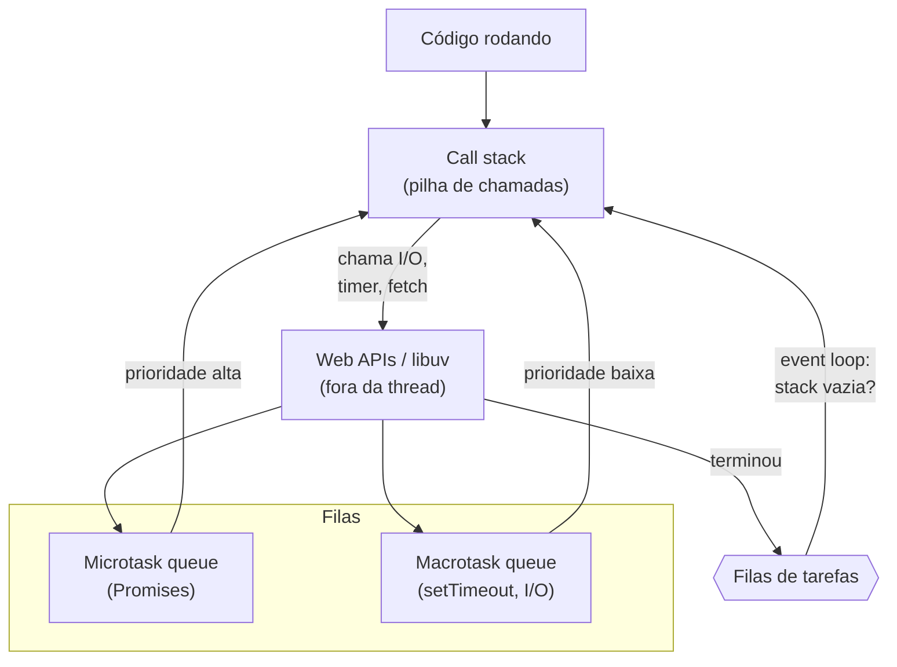
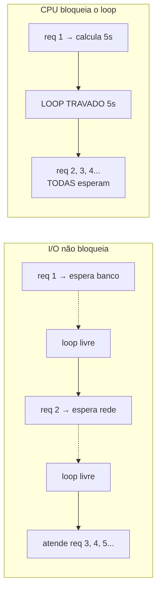
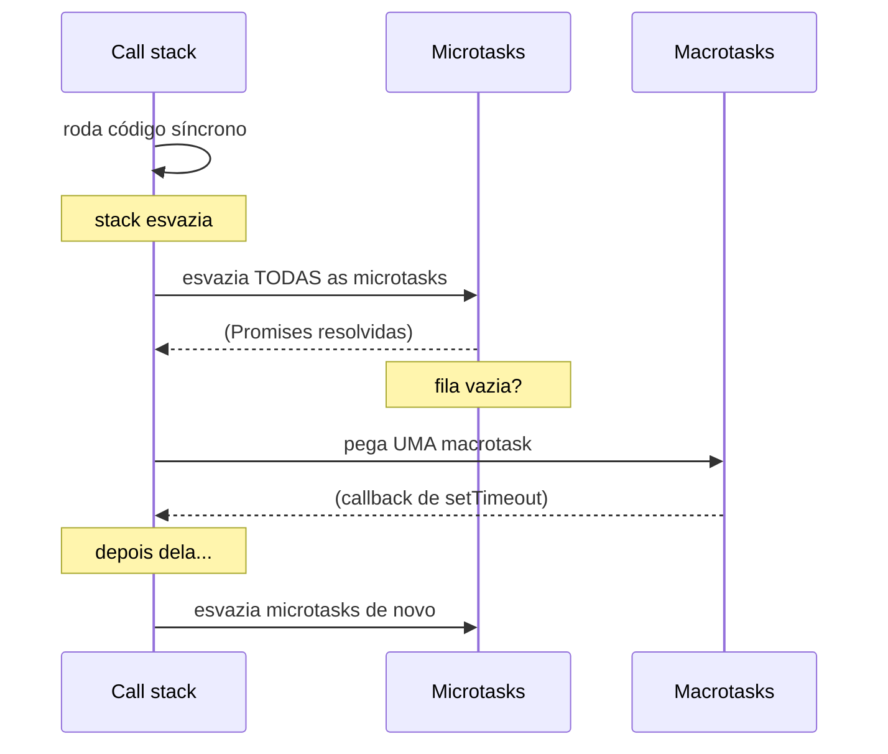
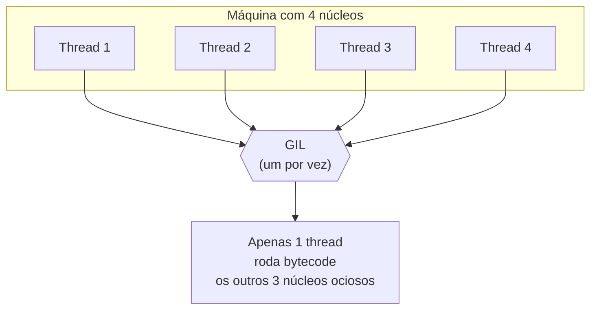
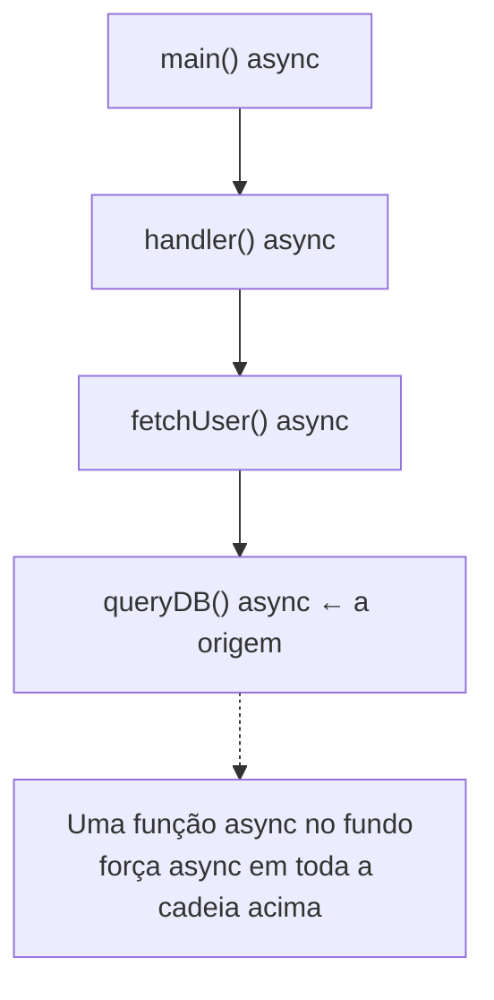

# Loop de eventos e assincronia

> [!abstract] Resumo em uma linha
> Uma única thread roda um loop que retira eventos de uma fila e os executa até o fim; o I/O é registrado com um callback e a thread segue — concorrência por intercalação cooperativa, sem threads e sem paralelismo.

Você já viu três jeitos de fazer várias coisas ao mesmo tempo. Threads compartilhando memória, com `[[10 - Memória compartilhada com threads e locks]]`. Atores isolados trocando mensagens, em `[[13 - O modelo de atores]]`. E o paralelismo de dados, espalhando o mesmo trabalho por muitos núcleos, em `[[15 - Paralelismo de dados]]`. Agora vem o quarto modelo, e ele é o mais teimoso de todos: **uma thread só**.

Sem threads. Sem locks. Sem paralelismo. Uma thread, um loop, uma fila. E ainda assim ela atende milhares de conexões ao mesmo tempo. Como?

A resposta é o **loop de eventos** (event loop), e é o motor por trás do JavaScript, do Node.js, do `asyncio` do Python, do Nginx. É um modelo de concorrência tão diferente do de threads que ele vira a intuição do avesso. Aqui não existe "duas coisas rodando ao mesmo tempo". Existe **uma coisa rodando por vez, mas nunca esperando à toa**.

## A garçonete que não fica parada

Imagine um restaurante com uma garçonete só.

O jeito ingênuo (modelo de thread bloqueante): ela anota o pedido da mesa 1, vai até a cozinha, e fica parada esperando o prato ficar pronto. Só depois de entregar é que ela atende a mesa 2. Se o prato demora vinte minutos, as outras mesas esperam vinte minutos. Para atender dez mesas ao mesmo tempo, você precisa de dez garçonetes — dez threads.

O jeito do event loop: ela anota o pedido da mesa 1, **entrega o pedido à cozinha e segue em frente**. Anota a mesa 2, anota a mesa 3, recolhe um prato pronto que a cozinha avisou que ficou, leva à mesa 5, anota a mesa 4. Ela nunca fica parada esperando a cozinha. Sempre que a cozinha grita "prato pronto!", ela coloca aquela entrega na lista de coisas a fazer e cuida quando puder.

Uma garçonete só, atendendo o salão inteiro. Esse é o truque. A "espera" — o I/O, o banco de dados, a rede — acontece **fora** dela. Ela só reage quando o resultado chega.

> [!note] A virada de chave conceitual
> Em `[[01 - Concorrência e paralelismo - o que é e por que é difícil]]` separamos trabalho **I/O-bound** (esperando disco, rede, banco) de **CPU-bound** (calculando). O event loop é a arma perfeita para I/O-bound: enquanto uma requisição espera o banco responder, a thread atende mil outras. A espera não custa thread nenhuma.

## A anatomia do loop

O modelo tem três peças, e entender o fluxo entre elas é entender tudo.



Leitura do diagrama: o código executa na **call stack** (a pilha de chamadas, uma só). Quando ele dispara uma operação assíncrona — um `setTimeout`, uma leitura de arquivo, um `fetch` — essa operação vai para **fora da thread** (as Web APIs no browser, a `libuv` no Node). A thread não espera. Quando a operação termina, seu callback entra numa **fila**. O event loop é o vigia que, sempre que a stack esvazia, pega o próximo da fila e o empurra de volta para a stack.

A regra de ouro: **o event loop só puxa da fila quando a call stack está vazia**. Ou seja, ele só roda a próxima tarefa quando a tarefa atual terminou completamente. Não há preempção. Cada tarefa roda **até o fim**, sem ser interrompida no meio.

Compare isso com o escalonamento **preemptivo** de threads que vimos em `[[02 - Processos e threads]]`: lá o sistema operacional pode tirar a thread do processador a qualquer instante. Aqui, ninguém te interrompe. Você roda até devolver o controle voluntariamente. É **cooperativo**, e essa palavra carrega toda a beleza e toda a maldição do modelo.

## Por que isso funciona tão bem para I/O



Leitura do diagrama: à esquerda, três requisições I/O-bound. Cada uma "espera" algo externo (banco, rede), mas a espera devolve o loop, então ele atende as outras no intervalo. À direita, uma única requisição CPU-bound que calcula por cinco segundos. Como não há preempção, **ela segura a thread inteira** por cinco segundos, e todas as outras requisições congelam atrás dela.

Esse contraste é o coração do modelo. Para um servidor web típico — que passa a maior parte do tempo esperando bancos e APIs — uma thread só consegue manter dezenas de milhares de conexões abertas. É a resposta moderna ao **problema C10K** que vimos em `[[02 - Processos e threads]]`: dez mil conexões simultâneas sem dez mil threads, sem dez mil pilhas de memória, sem o custo de troca de contexto.

E aqui está o pecado capital, o mandamento que todo desenvolvedor de Node tatua na memória:

> [!warning] Don't block the event loop
> Trabalho CPU-bound **bloqueia o loop inteiro**. Um laço pesado, um `JSON.parse` de um arquivo gigante, um hash síncrono — qualquer coisa que segure a thread por muito tempo congela **todas** as outras requisições, porque não há preempção. O loop não pode te tirar do processador; ele tem que esperar você terminar. Em event loop, latência alta numa requisição vira latência alta em todas. A regra: quebre trabalho pesado, mande para um worker, ou use processos separados.

## Showcase JavaScript: a ordem do caos

JavaScript é a vitrine perfeita do modelo, porque ele é **single-threaded por design** e te força a pensar assim. Mas há um detalhe que separa quem decorou de quem entendeu: existem **duas** filas, não uma.

- A **macrotask queue** (fila de tarefas): recebe callbacks de `setTimeout`, `setInterval`, `setImmediate`, eventos de I/O.
- A **microtask queue** (fila de microtarefas): recebe callbacks de Promises (`.then`, `.catch`, `.finally`), `queueMicrotask`, `MutationObserver`.

E a regra que define a ordem de tudo: **a microtask queue tem prioridade**. Depois de cada macrotarefa, o engine **esvazia toda a fila de microtarefas** antes de tocar na próxima macrotarefa.



Leitura do diagrama: primeiro roda o código síncrono até a stack esvaziar. Aí o loop **drena a fila inteira de microtarefas** — todas as Promises pendentes. Só então pega **uma** macrotarefa (um `setTimeout`, por exemplo). E imediatamente depois dessa macrotarefa, volta a esvaziar microtarefas. Microtarefas em rajada; macrotarefas uma de cada vez.

A pergunta clássica de entrevista. O que isto imprime?

```js
console.log("1");

setTimeout(() => console.log("2"), 0);

Promise.resolve().then(() => console.log("3"));

console.log("4");
```

A resposta é `1`, `4`, `3`, `2`. Vamos destrinchar:

1. `console.log("1")` roda na hora — síncrono. Imprime **1**.
2. `setTimeout(..., 0)` agenda uma **macrotarefa**. Não roda agora; vai para a fila de macrotarefas.
3. `Promise.resolve().then(...)` agenda uma **microtarefa**. Vai para a fila de microtarefas.
4. `console.log("4")` roda na hora — síncrono. Imprime **4**.
5. Stack vazia. O loop esvazia microtarefas: roda o `.then`. Imprime **3**.
6. Fila de microtarefas vazia. O loop pega a macrotarefa do `setTimeout`. Imprime **2**.

O `setTimeout(0)` **não** significa "rode imediatamente". Significa "rode na próxima volta de macrotarefa, e mesmo assim depois de todas as microtarefas pendentes". A Promise sempre fura a fila na frente do timer. Esse é o ponto que confunde, e é exatamente o que o entrevistador quer ver você raciocinar.

> [!tip] Por que microtarefas vêm primeiro
> A ideia é dar às Promises uma semântica consistente: o resultado de uma cadeia de `.then` deve resolver **antes** que o navegador renderize ou processe o próximo evento de usuário. Isso evita que o estado da aplicação fique visível "pela metade" entre passos de uma Promise.

### Callbacks → Promises → async/await

A evolução da escrita assíncrona em JS é uma história de açúcar sintático sobre a mesma máquina.

Começou com **callbacks**: passe uma função para ser chamada quando terminar. Funciona, mas aninhar callbacks dentro de callbacks dentro de callbacks vira o famoso **callback hell** — uma pirâmide ilegível inclinada para a direita.

Vieram as **Promises**: um objeto que representa um valor futuro, que você encadeia com `.then`. Achatou a pirâmide. O tratamento de erro centralizou no `.catch`, um modelo que conversa com os tipos de resultado de `[[10 - Tipos algébricos, pattern matching e erros sem exceção]]` — em vez de exceção solta, um sucesso ou uma falha embrulhados num objeto.

E veio o **async/await**, que é puro **açúcar sintático sobre Promises**. Uma função `async` sempre devolve uma Promise; cada `await` desembrulha uma Promise e suspende a função até ela resolver. O código assíncrono passa a **parecer** síncrono, lido de cima para baixo, mas por baixo é a mesma fila de microtarefas. A `await` é só um `.then` disfarçado.

Esse estilo de fluxo declarativo de dados que reage a eventos é a porta de entrada para a `[[12 - Programação reativa e dataflow]]` e a `[[Programação Reativa]]`, onde o assíncrono deixa de ser exceção e vira o jeito padrão de pensar.

### Browser × Node: a mesma ideia, motores diferentes

No **browser**, o event loop intercala com a renderização. Entre macrotarefas, o navegador pode repintar a tela, processar cliques, rodar animações. As "Web APIs" (timers, `fetch`, DOM) vivem fora da thread JS e devolvem callbacks às filas.

No **Node.js**, o motor é a **libuv**, uma biblioteca em C. O event loop do Node tem fases bem definidas — timers, pending callbacks, poll (espera por I/O), check (`setImmediate`), close callbacks — e entre cada fase ele drena as microtarefas. Detalhe crucial: parte do I/O do Node (leitura de disco, DNS, algumas operações de crypto) **não é assíncrono no kernel**, então a libuv mantém um **thread pool** — por padrão **4 threads** — para fazer esse trabalho "por fora" e devolver o resultado ao loop. Ou seja: o modelo é single-thread na sua lógica, mas há threads escondidas embaixo para o I/O que o sistema operacional não sabe fazer sem bloquear.

## Showcase Python: o GIL na sala

Python tem o mesmo modelo de event loop — via `asyncio`, com `async`/`await` idênticos em espírito ao JS. Mas Python carrega uma peculiaridade histórica que muda toda a conversa sobre concorrência: o **GIL**.

O **Global Interpreter Lock** (trava global do interpretador) é um mutex no interpretador CPython que garante que **apenas uma thread executa bytecode Python por vez** — mesmo numa máquina com 16 núcleos.



Leitura do diagrama: quatro threads, quatro núcleos. Mas todas precisam adquirir o GIL para rodar bytecode, e ele só deixa **uma** passar de cada vez. As outras três esperam. O resultado prático e contraintuitivo: **threads em Python NÃO dão paralelismo de CPU**. Você pode criar dez threads para um cálculo pesado e elas vão rodar essencialmente em série, revezando o GIL — às vezes mais lento que uma thread só, pelo custo do revezamento.

> [!warning] O que o GIL não impede
> O GIL serializa **bytecode Python**. Mas quando uma thread faz I/O bloqueante (ler um arquivo, esperar a rede), ela **solta o GIL** enquanto espera. Por isso threads em Python **ajudam I/O-bound** — várias threads podem estar esperando rede ao mesmo tempo. O GIL só te trai no CPU-bound.

Daí o mapa de decisão do pythonista:

- **CPU-bound** (cálculo pesado): use **`multiprocessing`** — processos separados, cada um com seu próprio interpretador e seu próprio GIL, espalhados por núcleos de verdade. É a estratégia de `[[15 - Paralelismo de dados]]`.
- **I/O-bound, poucas conexões**: threads servem (soltam o GIL no I/O).
- **I/O-bound, muitas conexões**: `asyncio` — event loop single-thread, sem o custo de threads, atendendo milhares de sockets.

### O fim do GIL? PEP 703 e o free-threading

A novidade quente: o GIL está virando **opcional**. A **PEP 703** propôs uma build "free-threaded" do CPython com o GIL desligado. O Python **3.13** (out/2024) introduziu essa build de forma **experimental** — mas com um custo: código single-thread rodava cerca de **40% mais lento** nessa build, pelo overhead de travas finas necessárias para segurança.

O Python **3.14** (out/2025) promoveu o free-threading de experimental para **oficialmente suportado**, e o overhead em código single-thread caiu para algo entre **5% e 10%**. Continua sendo uma build separada (você escolhe na instalação), e ainda dá para reativar o GIL em runtime via `PYTHON_GIL` ou `-X gil`. A era do GIL não acabou de uma vez — mas a porta para paralelismo de threads real em Python finalmente abriu.

## O problema da cor das funções

Há um preço escondido no async/await, e ele tem nome: **"what color is your function"** (a coloração de funções), de um ensaio famoso de Bob Nystrom.

A ideia: num mundo async/await, funções têm duas "cores". Funções **síncronas** (vermelhas, digamos) e funções **assíncronas** (azuis). E há uma regra contagiante: **para chamar uma função azul (async) e pegar seu resultado, você precisa estar dentro de uma função azul** (usando `await`). A assincronia **contamina** quem a chama, e quem chama esse, subindo toda a cadeia.

Você não pode simplesmente `await` no meio de uma função síncrona comum. Se uma função lá no fundo da sua pilha virar `async`, todo o caminho até ela tem que virar `async` também. Uma só folha azul tinge a árvore inteira.



Leitura do diagrama: `queryDB` precisa ser `async` porque faz I/O. Logo `fetchUser`, que a chama com `await`, também vira `async`. E `handler`, e `main`. A cor sobe. Em linguagens com event loop, você sente isso o tempo todo — bibliotecas síncronas e assíncronas não se misturam livremente, e às vezes existe uma versão "sync" e uma "async" da mesma API.

É um custo real de ergonomia, e é o contraste com modelos como o de `[[13 - O modelo de atores]]` ou as goroutines de Go, onde a concorrência não pinta a assinatura da função — você escreve código que parece síncrono e o runtime cuida da suspensão por baixo.

## Event loop × threads × atores

Vale alinhar os três modelos lado a lado, porque eles resolvem o mesmo problema por caminhos opostos.

| Eixo | Event loop | Threads (`[[10 - Memória compartilhada com threads e locks]]`) | Atores (`[[13 - O modelo de atores]]`) |
|---|---|---|---|
| Threads | Uma só | Várias | Várias (escondidas) |
| Escalonamento | Cooperativo | Preemptivo | Cooperativo/preemptivo |
| Paralelismo de CPU | Não | Sim | Sim |
| Estado compartilhado | Sim (uma thread) | Sim (perigoso) | Não (isolado) |
| Locks | Nenhum | Muitos | Nenhum |
| Race conditions | Raras | Comuns | Raras (sem memória compartilhada) |

O event loop **evita data races não por disciplina, mas por construção**: como só existe uma thread e cada tarefa roda até o fim, duas tarefas nunca tocam a mesma variável ao mesmo tempo. É a ausência de paralelismo que te protege.

> [!caution] Não é mágica total
> "Sem races" não significa "sem surpresas". Entre dois `await`, o estado pode ter mudado — outra tarefa rodou no meio-tempo. Você pode ler um valor, suspender num `await`, e quando voltar o valor é outro. Isso é uma forma sutil de **reentrância**, e a ordem de execução das filas continua sendo fonte de bugs difíceis. O modelo elimina a corrida de baixo nível, não a corrida lógica.

## Prós e contras

**A favor:**

- Nenhum lock, nenhum mutex — a categoria inteira de bugs de `[[10 - Memória compartilhada com threads e locks]]` simplesmente não existe.
- Excelente para I/O concorrente massivo — a resposta ao C10K com pegada de memória mínima.
- Modelo mental de **uma thread** — raciocinar sobre o estado é mais simples; não há dois fluxos pisando no mesmo dado.

**Contra:**

- **CPU-bound mata** — sem preempção, qualquer cálculo pesado congela todas as conexões.
- **Callback hell** — mitigado por async/await, mas ainda aparece em código legado.
- **Debugging difícil** — stack traces assíncronas são fragmentadas; o "de onde veio essa chamada" se perde entre voltas do loop.
- **Coloração de funções** — async contamina a árvore de chamadas e divide o ecossistema em sync e async.

## Em entrevista

> [!example] Como explicar em inglês
> "The event loop is a concurrency model that uses a **single thread**: it pulls tasks from a queue and runs each one to completion, with **no preemption**. When code starts I/O, it registers a **callback** and the thread moves on — so the thread never blocks while waiting. This makes it ideal for **I/O-bound** workloads like web servers, but a CPU-bound task will **block the entire loop**, since nothing can preempt it. In JavaScript there are two queues: the **microtask queue** (Promises) always drains fully before the next **macrotask** (like `setTimeout`), which is why a resolved Promise logs before a `setTimeout(0)`. Python has the same model via `asyncio`, but its **GIL** means threads can't run Python bytecode in parallel — so CPU work needs `multiprocessing`, not threads. The trade-off everyone hits is **function coloring**: `async` propagates up the entire call chain."

### Vocabulário

- loop de eventos → event loop
- fila de tarefas → task queue / macrotask queue
- fila de microtarefas → microtask queue
- callback → callback
- promessa → promise
- assíncrono / aguardar → asynchronous / await
- ponto de suspensão → suspension point
- trava global do interpretador → global interpreter lock (GIL)
- coloração de função → function coloring
- não bloquear o loop → don't block the event loop

> [!info] Lastro
> - [Event loop: microtasks and macrotasks — javascript.info](https://javascript.info/event-loop) — ordem microtask × macrotask verificada
> - [Thread pool work scheduling — libuv documentation](https://docs.libuv.org/en/v1.x/threadpool.html) — thread pool da libuv (padrão 4)
> - [Python support for free threading — Python 3.14 docs](https://docs.python.org/3/howto/free-threading-python.html) — GIL e free-threading
> - [What is PEP 703? — pydevtools](https://pydevtools.com/handbook/explanation/what-is-pep-703/) — proposta de tornar o GIL opcional

## Veja também

- [[01 - Concorrência e paralelismo - o que é e por que é difícil]] — I/O-bound × CPU-bound, a distinção que justifica o modelo
- [[02 - Processos e threads]] — preemptivo × cooperativo, o problema C10K
- [[10 - Memória compartilhada com threads e locks]] — o modelo oposto: muitas threads, muitos locks
- [[13 - O modelo de atores]] — concorrência por isolamento, sem memória compartilhada
- [[15 - Paralelismo de dados]] — a saída para CPU-bound (multiprocessing)
- [[18 - Concorrência em entrevista]] — como amarrar todos os modelos numa resposta
- [[03-Dominios/Ciência/Concorrência e Paralelismo/index|Concorrência e Paralelismo]] — o índice do galho
