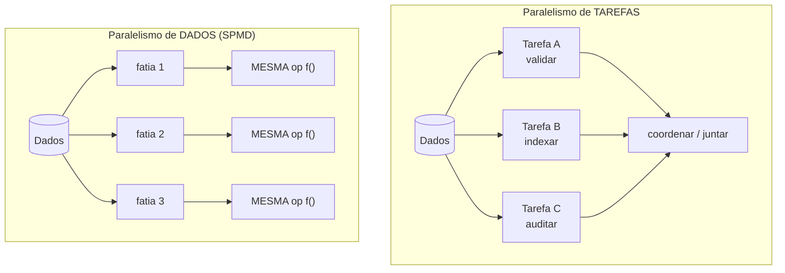
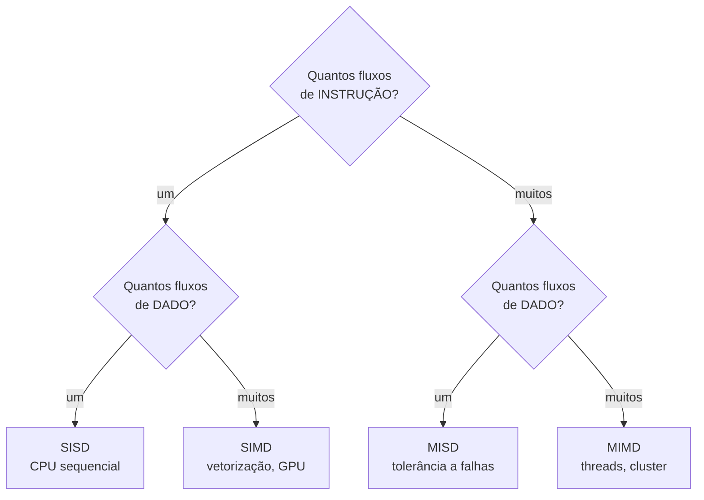
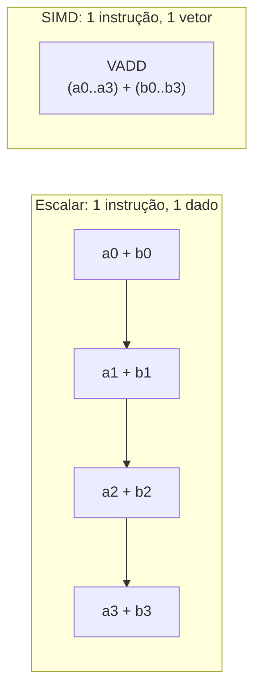
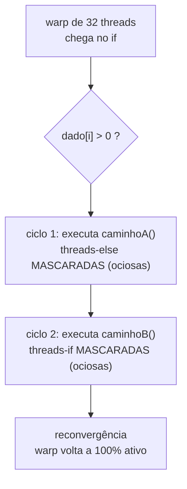
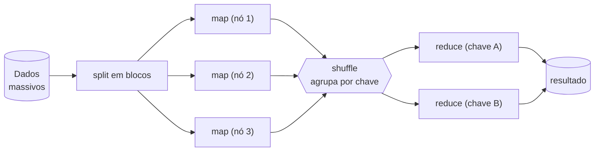
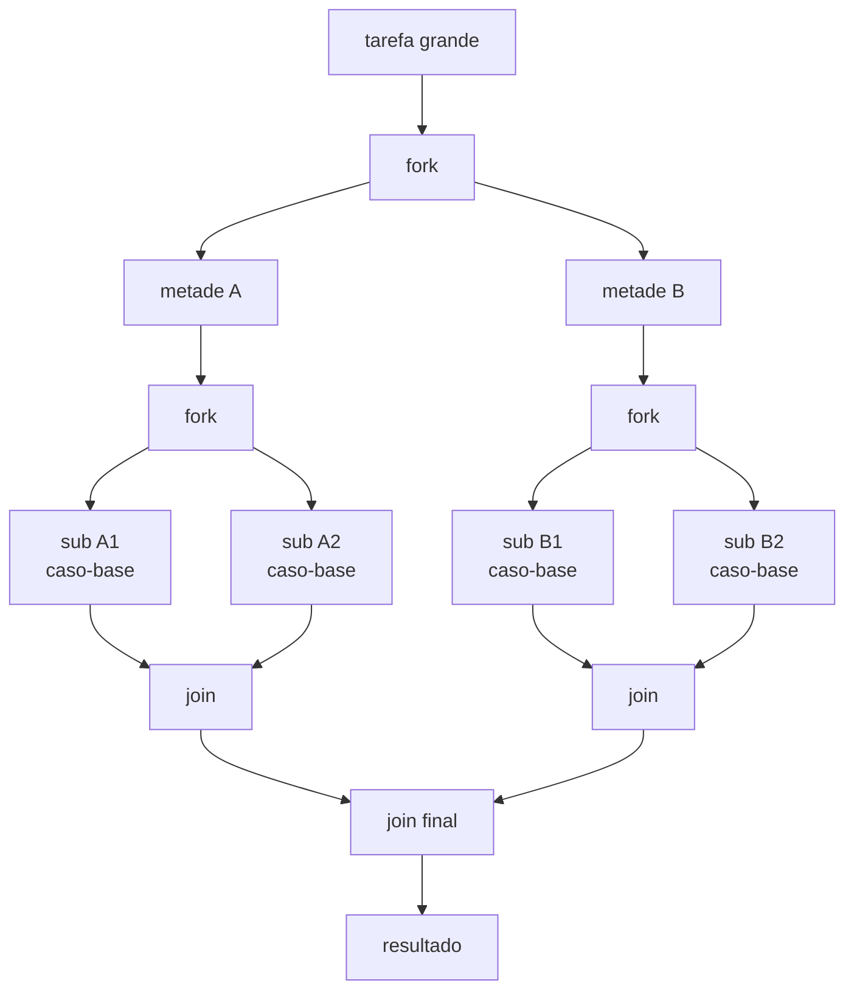
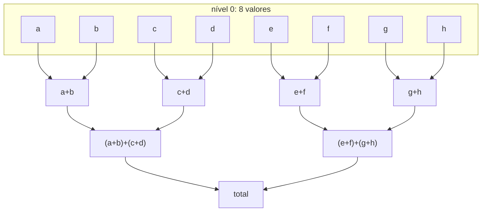

# Paralelismo de dados

> [!abstract] Resumo em uma linha
> Em vez de orquestrar tarefas diferentes, você aplica a MESMA operação a muitos pedaços de dados ao mesmo tempo — o paralelismo nasce de fatiar os DADOS, não a lógica.

Imagine um supermercado num sábado de movimento. Não existe uma fila gigante onde um caixa faz tudo. Existem mil caixas, cada um fazendo exatamente a MESMA tarefa — passar produtos, cobrar — sobre clientes DIFERENTES. Ninguém precisa coordenar com ninguém. O fluxo dobra porque você dobrou os caixas, não porque inventou um caixa mais esperto.

Isso é paralelismo de dados. E é, de longe, a forma mais fácil de paralelizar um problema — quando o problema permite.

## A virada de mentalidade

Nos modelos anteriores desta trilha, o paralelismo vinha de coordenar coisas DIFERENTES acontecendo juntas. Threads disputando uma estrutura compartilhada `[[10 - Memória compartilhada com threads e locks]]`, atores trocando mensagens, um loop de eventos `[[14 - Loop de eventos e assincronia]]` intercalando tarefas heterogêneas. Em todos eles, a dificuldade está na coordenação: quem mexe em quê, e quando.

O paralelismo de dados inverte a pergunta. Em vez de "que tarefas diferentes posso rodar juntas?", ele pergunta: "tenho UMA operação que precisa rodar sobre um monte de dados — posso aplicá-la a todos os pedaços de uma vez?".

> [!note] Paralelismo de TAREFAS × de DADOS
> - **Tarefas (task parallelism):** muitas operações DIFERENTES, possivelmente sobre os mesmos dados. Cada unidade de execução faz algo distinto e coordena com as outras pra resolver o problema. É o mundo dos threads, atores, pipelines.
> - **Dados (data parallelism):** a MESMA operação sobre subconjuntos DIFERENTES dos dados. Cada unidade roda o mesmo código, só muda o pedaço que recebe.

A literatura clássica chama esse estilo de **SPMD** — *single program, multiple data*. Você lança N unidades de execução e todas rodam o MESMO programa; o que muda entre elas é só a fatia de dados que cada uma processa. É o estilo mais comum de programação paralela justamente porque dispensa lógica diferente por unidade: um código, N fatias.



Leitura do diagrama: à esquerda, três tarefas distintas precisam se encontrar num ponto de coordenação. À direita, uma única função `f()` é replicada sobre fatias independentes — nada se encontra no meio do caminho. É essa independência que dá a escalabilidade boa.

Por que isso importa tanto? Porque "mesma operação, dados independentes" significa **sem estado compartilhado**. E sem estado compartilhado, não há corrida de dados, não há lock, não há a dor toda de `[[01 - Concorrência e paralelismo - o que é e por que é difícil]]`. O problema que era difícil simplesmente deixa de existir.

## A taxonomia de Flynn: o mapa de todos os paralelismos

Antes de descer pro hardware, vale ter um mapa. Em 1966, Michael Flynn propôs uma classificação que até hoje é o vocabulário padrão pra falar de arquiteturas paralelas. A pergunta é simples e tem só duas dimensões: **quantos fluxos de INSTRUÇÃO** correm ao mesmo tempo, e **quantos fluxos de DADOS**? Cruzando "um × muitos" nas duas dimensões, saem quatro caixas.

| | Um dado (SD) | Muitos dados (MD) |
|---|---|---|
| **Uma instrução (SI)** | **SISD** — CPU sequencial clássica (von Neumann). Uma instrução, um dado por ciclo. | **SIMD** — uma instrução sobre muitos dados. Vetorização (AVX), GPU, processadores vetoriais. |
| **Muitas instruções (MI)** | **MISD** — várias instruções sobre o MESMO dado. Rara; usada em tolerância a falhas (redundância: vários processadores conferindo o mesmo cálculo). | **MIMD** — vários processadores autônomos, cada um com sua instrução e seu dado. Multicore, threads, sistemas distribuídos. |

A taxonomia é o esqueleto desta trilha inteira. Veja onde cada modelo de concorrência que você já viu se encaixa:

- **SISD** é o ponto de partida — um núcleo, sem paralelismo. É o "antes".
- **SIMD** é o herói deste capítulo: uma instrução, várias fatias de dado. Vetorização e GPU vivem aqui.
- **MIMD** é o mundo de threads-e-locks `[[10 - Memória compartilhada com threads e locks]]`, atores e clusters — cada unidade roda código próprio sobre dados próprios. Quando você lança N threads que fazem coisas diferentes, é MIMD.
- **MISD** quase não existe na prática; aparece em sistemas de altíssima confiabilidade (aviônica, por exemplo) onde vários processadores conferem o mesmo cálculo pra detectar falha.



Leitura do diagrama: duas perguntas binárias geram as quatro classes. O paralelismo de DADOS deste capítulo é o ramo SIMD (um fluxo de instrução, muitos de dado); o paralelismo de TAREFAS dos capítulos anteriores é MIMD (muitos fluxos de instrução). SPMD — "um programa, muitas fatias" — é, a rigor, MIMD usado de um jeito que se parece com SIMD: cada thread roda o mesmo binário, mas tem seu próprio contador de programa e pode divergir.

> [!note] SPMD não é SIMD, é MIMD disfarçado
> Confunde, então cuidado. SIMD verdadeiro tem UM fluxo de instrução: todas as pistas executam a mesma instrução no mesmo ciclo, em lockstep. SPMD lança N processos que rodam o MESMO programa, mas cada um tem seu próprio contador de programa — eles podem estar em pontos diferentes do código ao mesmo tempo. Por isso SPMD é, formalmente, MIMD. É o estilo de MPI e de parallel streams.

## SIMD: o paralelismo dentro da própria CPU

A forma mais primitiva e mais barata de paralelismo de dados não usa thread nenhuma. Está dentro de um único núcleo, no hardware.

**SIMD** — *single instruction, multiple data* — é uma instrução que opera sobre vários valores de uma vez. A CPU tem registradores LARGOS (128, 256, 512 bits) que cabem vários números lado a lado. Em vez de somar `a[0]+b[0]`, depois `a[1]+b[1]`, depois `a[2]+b[2]`... uma única instrução SIMD soma oito pares de uma tacada.

> [!example] A linha de montagem que clonou a estação
> Pense numa estação de trabalho que monta um produto. SIMD é pegar essa estação e CLONÁ-LA oito vezes lado a lado, ligadas ao MESMO botão. Você aperta o botão uma vez (uma instrução) e as oito estações executam o passo simultaneamente. O operário continua sendo um só; o que multiplicou foi a largura do que ele toca por gesto.

Os conjuntos de instruções SIMD têm nomes que aparecem em entrevista: **SSE** e **AVX** (Intel/AMD), **NEON** (ARM). Eles são o motor por trás de vetorização.



Leitura do diagrama: em cima, quatro somas em SEQUÊNCIA, uma instrução por par. Embaixo, UMA instrução `VADD` processa os quatro pares juntos. O trabalho é o mesmo; o número de instruções emitidas caiu por quatro.

A boa notícia é que você quase nunca escreve SIMD à mão. O compilador faz **auto-vetorização**: ele reconhece um laço regular — sem dependências entre iterações, com acesso contíguo à memória — e o reescreve em instruções vetoriais sozinho. A má notícia é que ele é tímido: basta uma ramificação imprevisível ou um padrão de acesso bagunçado pra ele desistir e voltar ao código escalar.

> [!tip] Vetorização gosta de loops "burros"
> Quanto mais regular e previsível o laço (mesma operação, mesmo passo, sem `if` no meio), mais fácil o compilador vetorizar. Ironicamente, código "inteligente" demais costuma ser código LENTO porque mata a auto-vetorização.

## GPU e CUDA: milhares de núcleos burros

Se SIMD multiplica a largura dentro de um núcleo, a GPU multiplica o NÚMERO de núcleos — para milhares. A troca é deliberada: cada núcleo de GPU é simples e lento comparado a um núcleo de CPU, mas há muitos, e todos fazem a mesma coisa sobre dados diferentes.

O modelo da GPU se chama **SIMT** — *single instruction, multiple threads*. É um primo mais flexível do SIMD. Em vez de você empacotar os dados num vetor à mão, você escreve um *kernel* — o código de UMA thread — e a GPU lança milhares de cópias dessa thread, cada uma operando em seu índice de dado. No CUDA (a plataforma da NVIDIA), essas threads são organizadas em *warps* de 32, e o warp inteiro executa a mesma instrução em sincronia.

> [!note] SIMT × SIMD: a diferença que cai em entrevista
> - **SIMD** exige que você expresse o paralelismo como "loops vetorizados" e gerencie o alinhamento e o tamanho do vetor explicitamente.
> - **SIMT** deixa cada thread executar o kernel "como escrito"; o hardware cuida do empacotamento. E o SIMT TOLERA ramificação — threads do mesmo warp podem divergir num `if`. Mas isso tem custo: na *divergência de warp*, o hardware serializa os dois caminhos, e metade das threads fica ociosa em cada um. Por isso GPU adora dados REGULARES, sem `if` por dado.

A GPU brilha em cargas massivamente paralelas e uniformes: deep learning (multiplicação de matrizes gigantes), gráficos (o mesmo shader sobre milhões de pixels), simulações físicas. Mas há um pedágio que ninguém pode esquecer:

> [!warning] O custo de mover dados CPU↔GPU
> A GPU tem memória própria, separada da RAM da CPU. Pra processar, os dados precisam VIAJAR pela ponte PCIe até a GPU, e o resultado precisa voltar. Essa transferência é lenta. Se o cálculo é pequeno, você passa mais tempo movendo dados do que calculando — e a GPU fica mais devagar que a CPU. A GPU só compensa quando o volume de cálculo POR byte transferido é alto o bastante pra amortizar a viagem.

### Divergência de warp: por que um `if` machuca a GPU

Aquela frase de passagem na caixa anterior — "threads do mesmo warp podem divergir num `if`, e isso tem custo" — merece um zoom, porque é o erro nº 1 de quem escreve GPU pela primeira vez.

Lembre que um warp são 32 threads que executam em lockstep: uma instrução, todas as 32 pistas, no mesmo ciclo. Isso funciona lindamente enquanto as 32 threads querem fazer a MESMA coisa. O problema aparece quando o código tem um desvio que depende do dado de cada thread:

```
if (dado[i] > 0)
    caminhoA();   // umas threads vão por aqui
else
    caminhoB();   // outras vão por ali
```

Se metade do warp tem `dado[i] > 0` e a outra metade não, o warp **divergiu**. Mas o hardware só sabe executar UMA instrução por ciclo pro warp inteiro. Como ele resolve? Ele **serializa os dois caminhos**: primeiro executa `caminhoA()` com as threads do `else` MASCARADAS (paradas, sem efeito), depois executa `caminhoB()` com as threads do `if` mascaradas. Ou seja, o warp paga o custo dos DOIS ramos somados, e em cada ramo metade das pistas fica ociosa.



Leitura do diagrama: o que num MIMD seria "metade das threads faz A enquanto a outra metade faz B, ao mesmo tempo", na GPU vira DOIS passos em sequência, cada um com metade das pistas desligadas. No pior caso — um `switch` com 32 ramos distintos, ou um laço cujo número de iterações varia por thread — o warp serializa até 32 vezes e a vazão despenca pra de uma thread só.

Por isso código de GPU foge de ramificação dependente-de-dado. As táticas:

- **Manter o branch UNIFORME no warp:** se todas as 32 threads tomam o mesmo lado, não há divergência — o warp executa um ramo e pula o outro inteiro. Organizar os dados pra que threads vizinhas caiam no mesmo caminho mata a divergência.
- **Aritmética sem branch (*branchless*):** trocar `if (x>0) y=a; else y=b;` por uma fórmula que computa os dois e seleciona com uma máscara. Ambos os lados rodam sempre, mas sem serializar caminhos.
- **Predicação:** para `if`s minúsculos, o compilador já faz isso sozinho — executa as duas instruções e descarta a que não vale, mais barato que serializar blocos.

> [!tip] A regra mental da GPU
> Threads do mesmo warp são como 32 remadores num barco a um só comando: enquanto remam juntas, voam. No instante em que metade quer virar à esquerda e metade à direita, o barco para, vira à esquerda com metade remando, depois vira à direita com a outra metade. Mantenha o warp remando junto.

## MapReduce: paralelismo de dados que escala em cluster

SIMD e GPU paralelizam dentro de uma máquina. E quando os dados não cabem numa máquina — terabytes, petabytes? O mesmo princípio sobe um andar e vira **MapReduce**, o modelo que a Google popularizou e que sustentou Hadoop e, depois, Spark.

A ideia tem duas fases com uma costura no meio:

- **Map** (paralelo, sem estado compartilhado): os dados são fatiados em blocos e espalhados pelo cluster. Cada nó aplica a MESMA função `map` à sua fatia, produzindo pares chave-valor. Como nenhum mapper depende de outro, essa fase escala lindamente — é paralelismo de dados puro, só que com as fatias em máquinas diferentes.
- **Shuffle** (a costura): o sistema agrupa todos os valores pela chave, ordena, e move pela rede os dados de modo que tudo de uma mesma chave vá parar no mesmo reducer. É aqui que mora o custo — tráfego de rede entre nós.
- **Reduce** (agrega): cada reducer recebe uma chave e a lista de valores dela, e aplica a função `reduce` pra produzir o resultado final.



Leitura do diagrama: o `split` distribui blocos; os `map` rodam em paralelo e independentes (a parte fácil); o `shuffle` é o gargalo de rede que reorganiza tudo por chave; os `reduce` agregam. Note que o map é embaraçosamente paralelo, mas o reduce só pode começar depois que a chave dele estiver completa — há uma barreira embutida no shuffle.

A fronteira aqui encosta nos dados distribuídos: fatiar dados por chave e espalhá-los por nós é a mesma intuição do *sharding* que aparece em `[[Banco de Dados]]`. A diferença é o objetivo — MapReduce fatia pra COMPUTAR sobre tudo de uma vez; um banco fatia pra ARMAZENAR e consultar. Mas a costura conceitual (mover o cálculo pra perto do dado, em vez do dado pra perto do cálculo) é a mesma.

## Localidade de dados: mover custa mais que computar

Aquele "leve a computação ao dado" do MapReduce não é detalhe de implementação — é o princípio econômico que governa todo paralelismo de escala. A intuição é contra-intuitiva pra quem aprendeu que "computar é caro": em GPU, em cluster, em qualquer máquina moderna, **mover um dado custa mais do que processá-lo**.

A razão é a hierarquia de custos de acesso. Pegar um valor que já está no registrador ou no cache L1 é quase de graça. Buscá-lo na RAM custa centenas de ciclos. Trazê-lo pela rede de outro nó custa milhões. A própria viagem PCIe CPU↔GPU que vimos é uma versão disso. Quando o gargalo é a viagem, adicionar mais núcleos não ajuda — eles ficam famintos, esperando dado chegar.

> [!example] A cozinha e o depósito
> Você é um chef rápido. Se os ingredientes estão na bancada (cache), você cozinha sem parar. Se estão no depósito do outro lado do prédio (RAM), cada prato exige uma caminhada. Se estão num armazém na cidade vizinha (rede), você passa o dia no trânsito e a cozinha fica vazia. Contratar mais chefs (núcleos) não adianta — o gargalo é a distância até o ingrediente, não a velocidade de cozinhar.

Daí saem duas estratégias, as duas no mesmo princípio:

- **Particionamento com localidade:** fatie os dados de modo que cada unidade de execução trabalhe sobre um pedaço que está PERTO dela — na sua RAM local, no seu disco. O Hadoop tenta agendar cada tarefa map no próprio nó que já guarda aquele bloco de dado, justamente pra não trafegar o bloco pela rede.
- **Levar a computação ao dado:** quando o dado é grande e o código é pequeno, mande o CÓDIGO pra onde o dado mora, não o contrário. Mover um kernel de alguns kilobytes pra perto de terabytes de dado é trivial; mover os terabytes seria o suicídio econômico.

Essa lógica é a mesma — um andar acima — da localidade de cache que aparece nas `[[03-Dominios/Ciência/Estruturas de Dados/index|Estruturas de Dados]]`: um array vence uma lista encadeada em varredura não porque tem menos elementos, mas porque os elementos são CONTÍGUOS na memória, e a CPU traz vizinhos de graça na mesma linha de cache. Localidade espacial no cache e localidade de dados no cluster são o mesmo fenômeno em escalas diferentes: o trabalho é rápido; o que mata é ir buscar longe.

> [!note] Por que isso muda o desenho do algoritmo
> Algoritmo paralelo bom não minimiza só o número de operações — minimiza o **movimento de dados**. Duas soluções com a mesma contagem de FLOPs podem ter desempenho ordens de grandeza diferente se uma reaproveita dado quente no cache e a outra fica indo buscar na memória distante. É por isso que multiplicação de matriz em GPU é feita por blocos (*tiling*): carrega um bloco pra memória rápida e reusa ao máximo antes de buscar o próximo.

## Fork-join e work-stealing: dividir pra conquistar, em threads

De volta a uma máquina só, com vários núcleos. Como você paralela um problema que pode ser quebrado recursivamente — ordenar um vetor grande, somar uma árvore, percorrer uma estrutura? A resposta é **fork-join**.

O padrão é o velho dividir-para-conquistar com paralelismo:

1. Se o pedaço de trabalho é pequeno o bastante, processe direto (caso-base).
2. Senão, **fork**: divida em sub-pedaços e dispare cada um pra ser processado em paralelo.
3. **Join**: espere os sub-resultados e combine-os.



Leitura do diagrama: a tarefa se divide em árvore até os sub-pedaços virarem pequenos o bastante pra rodar direto (as folhas); depois os resultados sobem juntando-se de volta. A profundidade da árvore é controlada pela granularidade do caso-base.

O detalhe genial é como o agendador mantém todos os núcleos ocupados: **work-stealing** (roubo de trabalho). Cada thread trabalhadora tem sua própria fila dupla (*deque*) de tarefas. Quando uma thread esvazia a própria fila, ela não fica parada — ela **rouba** uma tarefa da PONTA da fila de outra thread que ainda está cheia. O resultado é balanceamento de carga automático: ninguém fica ocioso enquanto há trabalho em qualquer lugar.

> [!info] Onde isso vive no Java
> O `ForkJoinPool` e os *parallel streams* são exatamente isso: divisão recursiva mais work-stealing. É o motor por trás de `stream.parallel()`. Os detalhes — splitterators, granularidade, quando vale a pena — estão no galho `[[03-Dominios/Tecnologia/Java/Concorrência e paralelismo/index|Concorrência (Java)]]`.

> [!warning] Tarefas minúsculas matam o fork-join
> O work-stealing tem sua própria máquina interna (filas, sincronização, roubo). Se cada tarefa faz pouquíssimo trabalho — menos que alguns microssegundos — o overhead dessa máquina passa a custar mais que o cálculo. Granularidade pequena demais transforma o framework num peso morto. Calibre o caso-base pra cada folha fazer trabalho de verdade.

## Reduções: por que nem toda soma paraleliza

O `join` do fork-join e o `reduce` do MapReduce têm o mesmo coração: pegar muitos valores e **agregá-los num só**. Somar um vetor, achar o máximo, contar elementos, concatenar logs. Isso se chama **redução**. E aqui mora uma sutileza que separa quem entende paralelismo de quem só sabe a receita.

Some um vetor de oito números sequencialmente e você faz `((((((a+b)+c)+d)+e)+f)+g)+h` — sete somas, uma de cada vez, cada uma dependendo da anterior. É O(n) passos. Agora paralelize: some os pares `(a+b), (c+d), (e+f), (g+h)` ao mesmo tempo (quatro somas num passo), depois some os pares dos resultados (duas somas num passo), depois a última (uma soma). De sete passos sequenciais você caiu pra **três passos** — em geral, **O(log n) níveis** numa árvore de redução.



Leitura do diagrama: cada nível dobra o tamanho dos pedaços já somados e corta pela metade quantos restam. Com 8 valores são 3 níveis (log₂8); com um milhão, só 20. As somas de um mesmo nível são INDEPENDENTES entre si — daí o paralelismo. O caminho crítico encolheu de n para log n.

Mas note o que esse rearranjo fez: ele **mudou a ORDEM e o AGRUPAMENTO** das operações. A versão sequencial calcula `(((a+b)+c)+d)`; a árvore calcula `(a+b)+(c+d)`. Pra que as duas deem o MESMO resultado, a operação precisa ser **associativa** — `(x∘y)∘z` tem que ser igual a `x∘(y∘z)`. Soma, multiplicação, máximo, mínimo, AND, OR, concatenação: todos associam, todos paralelizam por árvore.

> [!danger] Subtração não associa — então não reduz em paralelo
> `(5 - 3) - 1 = 1`, mas `5 - (3 - 1) = 3`. A subtração NÃO é associativa: reagrupar muda a resposta. Se você jogar uma subtração numa árvore de redução, threads diferentes vão agrupar diferente e o resultado fica errado (e pior: não-determinístico, muda a cada execução conforme o agendador fatia). A mesma armadilha pega divisão, e — sutilmente — a soma de PONTO FLUTUANTE, que não é exatamente associativa por causa de arredondamento: o total paralelo pode diferir do sequencial nos últimos dígitos.

A **comutatividade** (`x∘y = y∘x`) é o bônus. Associatividade já basta pra reagrupar em árvore mantendo a ORDEM dos elementos. Comutatividade deixa, além disso, processar os pedaços em qualquer ordem de chegada — o que casa perfeitamente com work-stealing, onde você não controla quem termina primeiro. Por isso os frameworks pedem reduções associativas e idealmente comutativas: é o que torna o resultado independente de COMO o agendador fatiou o trabalho.

> [!info] Onde isso aparece no código
> Em Java, `Stream.reduce(identidade, acumulador, combinador)` assume que o acumulador é associativo — a documentação avisa que resultados são indefinidos se não for. O `identity` precisa ser o elemento neutro (0 pra soma, 1 pra produto, `""` pra concatenação). Os detalhes da API estão em `[[03-Dominios/Tecnologia/Java/Concorrência e paralelismo/index|Concorrência (Java)]]`.

## Embaraçosamente paralelo × precisa coordenar

Nem todo problema escala igual, e a fronteira tem nome.

Um problema **embaraçosamente paralelo** (*embarrassingly parallel*) se quebra em sub-tarefas totalmente INDEPENDENTES — nenhuma precisa de resultado de outra. Processar mil imagens, testar um milhão de senhas, renderizar pixels, a fase map do MapReduce. Esses escalam quase linearmente: dobrou os núcleos, quase dobrou a vazão. São o sonho do paralelismo de dados.

No outro extremo estão os problemas com DEPENDÊNCIAS — onde sub-tarefas precisam trocar dados ou agregar resultados (uma redução, um `join`, o shuffle do MapReduce). Esses exigem barreiras de sincronização e comunicação, e cada barreira é um momento em que threads rápidas esperam as lentas. É aí que o ganho começa a vazar.

> [!quote] A regra mental
> Quanto mais INDEPENDENTES as fatias, melhor escala. Cada ponto de coordenação — barreira, redução, comunicação — é um pedágio que come parte do ganho do paralelismo.

## Quando paralelizar de verdade

Aqui mora a armadilha mais comum: assumir que paralelizar sempre acelera. Não acelera.

Particionar os dados custa. Coordenar as unidades custa. Juntar os resultados custa. Esse overhead é FIXO — você paga mesmo que os dados sejam minúsculos. Pra um vetor de dez elementos, o tempo de montar o ForkJoinPool, fatiar e juntar é maior que o de só percorrer o vetor uma vez. O paralelismo só compensa ACIMA de um limiar de volume, onde o ganho de dividir supera o custo de coordenar.

E há um teto teórico no melhor caso: a **lei de Amdahl**. Por mais núcleos que você jogue, a parte SEQUENCIAL do programa (a que não paraleliza — o shuffle, a redução final, a leitura inicial) limita o speedup máximo. Esse limite, e o contraponto otimista da lei de Gustafson, estão em `[[16 - As leis da escala - Amdahl e Gustafson]]`.

> [!danger] A regra de ouro: meça antes
> Nunca paralelize por instinto. Paralelizar adiciona overhead garantido e ganho incerto. Meça a versão sequencial, identifique se o trabalho passa do limiar, e só então pague o preço da coordenação. Em dados pequenos, sequencial quase sempre vence.

## Parallel streams na prática: o `.parallel()` que parece grátis

Em Java, paralelismo de dados está a um método de distância: troque `stream()` por `parallelStream()` (ou chame `.parallel()`) e a coleção é fatiada e processada pelo `ForkJoinPool` comum. Em .NET, é o `.AsParallel()` do PLINQ. A facilidade é uma armadilha: parece que você ganhou velocidade de graça, mas paralelizar errado deixa o código mais LENTO — ou pior, sutilmente errado.

Quando `parallelStream` realmente ajuda — os três precisam valer juntos:

- **Volume grande de dados.** Acima do limiar onde o ganho de fatiar supera o custo de montar o pool. Coleção pequena: o overhead come tudo.
- **Operação cara por elemento.** Cada elemento precisa de trabalho de CPU de verdade (parsear, calcular, transformar). Se o lambda só faz `x*2`, o trabalho útil não paga a coordenação.
- **Sem estado compartilhado, lambda puro.** Cada elemento processado independente, operação associativa na redução, zero efeito colateral. É o requisito do paralelismo de dados, vindo cobrar.

Quando `parallelStream` PIORA — e por quê:

- **Lambda com efeito colateral.** Escrever numa `ArrayList` externa, somar num campo, mexer em estado fora do stream: vira corrida de dados. O resultado fica errado e não-determinístico. A operação tem que ser *stateless*.
- **Fonte mal-particionável.** O ganho depende de FATIAR a fonte em pedaços iguais barato. `ArrayList`, arrays e `IntStream.range` são indexados — partem ao meio em O(1). `LinkedList` não tem índice: pra achar o meio você percorre desde o início, e o splitterator fica caro e desbalanceado. Streams de I/O (ler linhas de um arquivo) sofrem do mesmo mal. Fonte ruim mata o paralelismo antes de começar.
- **Operações já-estaduais empilhadas.** `sorted()`, `distinct()`, `limit()` carregam overhead extra em paralelo porque precisam de coordenação global. Empilhar muitas pode anular o ganho.
- **Dados pequenos ou trabalho barato.** O caso mais comum. Aqui o sequencial quase sempre vence.

> [!warning] O pool é COMPARTILHADO — e isso vaza
> Todos os parallel streams da JVM dividem o MESMO `ForkJoinPool.commonPool()` por padrão. Um stream paralelo com uma tarefa bloqueante (chamada de rede, I/O) prende threads desse pool comum e degrada TODOS os outros parallel streams da aplicação. Parallel stream é pra trabalho CPU-bound e não-bloqueante. Trabalho bloqueante pede outro modelo — `[[14 - Loop de eventos e assincronia]]` ou um pool dedicado.

E sempre, sempre, o teto de Amdahl está olhando: por mais que você paralelize o `map`, a parte sequencial (a redução final, a coleta, a fonte) limita o ganho — `[[16 - As leis da escala - Amdahl e Gustafson]]`. A conclusão prática é a mesma da regra de ouro: **meça os dois**. `parallel()` é a única otimização que mais erra quando aplicada por reflexo. Os detalhes de tuning — spliterator, granularidade, pool customizado — estão no galho `[[03-Dominios/Tecnologia/Java/Concorrência e paralelismo/index|Concorrência (Java)]]`.

## Data parallelism × os outros modelos

O paralelismo de dados não compete com threads-e-locks `[[10 - Memória compartilhada com threads e locks]]` nem com message-passing — ele é ORTOGONAL e complementar. Você pode ter um sistema de atores onde cada ator, internamente, usa um parallel stream. Pode ter um loop de eventos que dispara um kernel de GPU.

A vantagem decisiva, quando o problema é REGULAR (mesma operação, fatias independentes), é que o paralelismo de dados é a forma mais FÁCIL de paralelizar — porque sem estado compartilhado não há corrida pra defender, não há lock pra adquirir, não há deadlock pra temer. A complexidade some por construção. Por isso a primeira pergunta diante de um problema CPU-bound deveria ser: "isso é paralelismo de dados disfarçado?". Se for, você ganhou.

Os demais padrões — quando o problema NÃO é regular, quando há estado compartilhado inevitável, quando as tarefas são heterogêneas — estão em `[[17 - Padrões de concorrência]]`.

## Em entrevista

Data parallelism applies the SAME operation to many independent data partitions — the parallelism comes from splitting the DATA, not the logic. This is the SPMD model: one program, many data slices, no shared state. Because there is no shared state, there are no data races to defend against, which makes it the EASIEST kind of parallelism when the problem is regular. In Flynn's taxonomy this is the SIMD branch (one instruction stream, many data streams), as opposed to MIMD — the task-parallel world of threads and clusters where each unit runs its own code; SPMD is technically MIMD that behaves like SIMD. It shows up at three scales: SIMD/vectorization inside a single core (one instruction over a wide register, e.g. AVX), SIMT on the GPU (thousands of threads running the same kernel, great for regular workloads like deep learning, costly when threads diverge or when you move data across PCIe), and MapReduce across a cluster (parallel map, then shuffle, then reduce). On the GPU, watch for warp divergence: when threads in the same warp take different branches of an `if`, the hardware serializes both paths and masks off half the lanes on each, so GPU code avoids data-dependent branching. On the JVM, fork-join with work-stealing — the engine behind parallel streams and `ForkJoinPool` — recursively splits work and lets idle threads steal tasks to balance load. A reduction only parallelizes if the operation is ASSOCIATIVE: a reduction tree gives O(log n) depth by re-grouping operations, which is safe for sum/max/min but breaks for subtraction (`(5-3)-1 ≠ 5-(3-1)`) and is subtly lossy for floating-point. At scale, the dominant cost is moving data, not computing it — so you partition for locality and "move the computation to the data" rather than the reverse. The key judgment call: parallelism only pays off above a threshold because partitioning and coordination have fixed overhead, and Amdahl's law caps the speedup — so always measure before parallelizing, and beware that `parallelStream()` looks free but degrades on small data, side-effecting lambdas, or poorly splittable sources like a `LinkedList`.

### Vocabulário

- paralelismo de dados → data parallelism
- paralelismo de tarefas → task parallelism
- taxonomia de Flynn → Flynn's taxonomy
- uma instrução, um dado → SISD (single instruction, single data)
- muitas instruções, muitos dados → MIMD (multiple instruction, multiple data)
- mesma operação, dados diferentes → single program, multiple data (SPMD)
- uma instrução, vários dados → SIMD (single instruction, multiple data)
- uma instrução, várias threads → SIMT (single instruction, multiple threads)
- divergência de warp → warp divergence
- redução → reduction
- associatividade → associativity
- comutatividade → commutativity
- árvore de redução → reduction tree
- localidade de dados → data locality
- levar a computação ao dado → move the computation to the data
- particionamento → partitioning
- stream paralelo → parallel stream
- sem efeito colateral / sem estado → stateless
- vetorização → vectorization
- auto-vetorização → auto-vectorization
- mapear-reduzir → map-reduce
- embaralhar (fase do MapReduce) → shuffle
- dividir e juntar → fork-join
- roubo de trabalho → work-stealing
- fila dupla → deque (double-ended queue)
- embaraçosamente paralelo → embarrassingly parallel
- aceleração / ganho → speedup
- limiar → threshold

> [!info] Lastro
> - [Data parallelism — Wikipedia](https://en.wikipedia.org/wiki/Data_parallelism) e [Task parallelism — Wikipedia](https://en.wikipedia.org/wiki/Task_parallelism) (a distinção data × task e o estilo SPMD)
> - [Flynn's taxonomy — Wikipedia](https://en.wikipedia.org/wiki/Flynn%27s_taxonomy) e [Flynn's Taxonomy — Baeldung on CS](https://www.baeldung.com/cs/flynns-taxonomy-architecture-categories) (SISD/SIMD/MISD/MIMD; SPMD como MIMD)
> - [SIMT and Warps — Cornell Virtual Workshop](https://cvw.cac.cornell.edu/gpu-architecture/gpu-characteristics/simt_warp) e [SIMT vs SIMD — Benjamin Glick](https://www.glick.cloud/blog/simt-vs-simd-parallelism-in-modern-processors) (SIMD × SIMT, warps, divergência)
> - [Thread Divergence — Cornell Virtual Workshop](https://cvw.cac.cornell.edu/cuda-intro/gpu-performance-topics/thread_div) e [What is warp divergence? — Modal GPU Glossary](https://modal.com/gpu-glossary/perf/warp-divergence) (serialização de caminhos, mascaramento de threads, mitigação)
> - [Parallel Reduction — ScienceDirect Topics](https://www.sciencedirect.com/topics/computer-science/parallel-reduction) e [Associative Operation — Lenovo Glossary](https://www.lenovo.com/gb/en/glossary/associative-operation/) (árvore O(log n), por que associatividade é obrigatória, subtração não reduz)
> - [What is MapReduce? — Databricks](https://www.databricks.com/glossary/mapreduce) (modelo map/shuffle/reduce em cluster)
> - [Data locality in Hadoop — DataFlair](https://data-flair.training/blogs/data-locality-in-hadoop-mapreduce/) (mover computação ao dado, particionamento, custo de tráfego de rede)
> - [Fork/Join — The Java Tutorials (Oracle)](https://docs.oracle.com/javase/tutorial/essential/concurrency/forkjoin.html) e [How to use ForkJoinPool — InfoWorld](https://www.infoworld.com/article/2338348/how-to-use-forkjoinpool.html) (fork-join, work-stealing, deque, granularidade)
> - [Think before Parallelizing Streams — Subir (Medium)](https://medium.com/@subirrastogi/java-streams-think-before-parallelizing-streams-fa328bfaab6c) (quando parallelStream ajuda × piora, LinkedList, efeitos colaterais, medir)

## Veja também

- `[[01 - Concorrência e paralelismo - o que é e por que é difícil]]` — por que coordenar é difícil (e por que dados independentes escapam disso)
- `[[10 - Memória compartilhada com threads e locks]]` — o modelo ortogonal: estado compartilhado e suas dores
- `[[14 - Loop de eventos e assincronia]]` — outro eixo: intercalar tarefas heterogêneas
- `[[16 - As leis da escala - Amdahl e Gustafson]]` — o teto teórico do ganho com paralelismo
- `[[17 - Padrões de concorrência]]` — quando o problema NÃO é regular
- `[[18 - Concorrência em entrevista]]` — consolidação pra entrevista
- `[[03-Dominios/Tecnologia/Java/Concorrência e paralelismo/index|Concorrência (Java)]]` — fork-join e parallel streams na prática
- `[[03-Dominios/Ciência/Concorrência e Paralelismo/index|Concorrência e Paralelismo]]` — índice do galho
